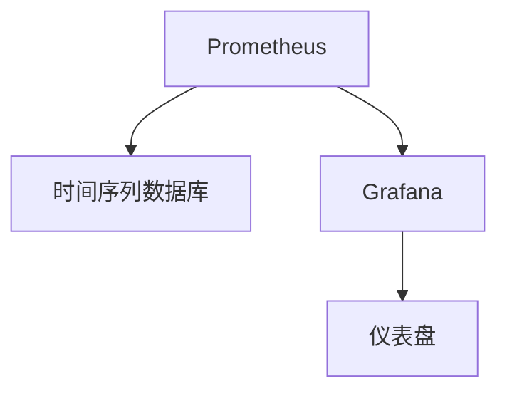

                 

# 监控系统：Prometheus与Grafana实践

> 关键词：Prometheus, Grafana, 监控系统, 时间序列数据库, 仪表盘, 实时数据可视化

## 1. 背景介绍

### 1.1 问题由来

在信息化和数字化飞速发展的今天，监控系统已成为保障IT基础设施稳定运行不可或缺的重要工具。无论是传统业务系统，还是现代微服务架构，监控系统的应用场景愈发广泛。然而，传统的基于SNMP、CMIS、JMX等协议的监控方式已无法满足现代应用对监控数据实时性和粒度细化的要求。开源时间序列数据库 Prometheus 和 开源数据可视化工具 Grafana 的结合使用，逐渐成为构建现代监控系统的首选方案。本文将系统介绍 Prometheus 与 Grafana 的实践，以帮助读者掌握使用这两种工具构建监控系统的方法和技巧。

### 1.2 问题核心关键点

Prometheus 是一款开源的时间序列数据库，通过从被监控主机上拉取实时数据，建立时间序列数据模型。Grafana 则是一款数据可视化工具，可以与多种数据源无缝对接，构建高质量的仪表盘，实现实时数据的可视化展示。二者的结合，可以实现高效、稳定、可定制的监控系统，是构建现代监控系统的最佳实践。

## 2. 核心概念与联系

### 2.1 核心概念概述

为更好地理解 Prometheus 与 Grafana 的实践，本节将介绍几个密切相关的核心概念：

- Prometheus：开源时间序列数据库，通过从被监控主机上拉取实时数据，建立时间序列数据模型。支持高可用性、高吞吐量的数据存储和查询。
- Grafana：开源数据可视化工具，可以与多种数据源无缝对接，构建高质量的仪表盘，实现实时数据的可视化展示。支持复杂数据模型和灵活的查询接口。
- 时间序列数据库：一种特殊的数据库，用于存储时间序列数据，支持快速查询和时序分析。
- 仪表盘：基于 Grafana 构建的可视化展示界面，用于实时展示监控数据。支持复杂的数据聚合和可视化。

这些核心概念之间的逻辑关系可以通过以下 Mermaid 流程图来展示：



这个流程图展示了大规模语言模型微调的数学模型构建、公式推导和案例分析的逻辑关系：

1. Prometheus 负责从被监控主机上拉取实时数据，建立时间序列数据模型。
2. Grafana 负责对实时数据进行可视化展示，构建仪表盘。
3. 时间序列数据库用于存储和管理时间序列数据，是实现数据拉取和查询的核心。
4. 仪表盘是数据可视化的最终展示界面，用户可以通过仪表盘进行实时数据监控。

## 3. 核心算法原理 & 具体操作步骤
### 3.1 算法原理概述

Prometheus 与 Grafana 的实践基于时间序列数据和实时数据可视化两个核心概念。其核心思想是：通过从被监控主机上拉取实时数据，存储到时间序列数据库中，再使用 Grafana 工具将数据可视化展示。

形式化地，假设被监控主机为 $M_i$，时间为 $t$，监控指标为 $I$，则时间序列数据 $D$ 可以表示为：

$$
D = \{ (M_i, t, I), i=1,2,...,N \}
$$

其中 $N$ 为被监控主机的数量。

Prometheus 负责定时从 $M_i$ 上拉取数据，并存储到时间序列数据库中。Grafana 负责对 $D$ 中的数据进行可视化展示，构建仪表盘 $C$。具体步骤如下：

1. Prometheus 定期从 $M_i$ 上拉取时间序列数据 $I_i(t)$，存储到本地时间序列数据库中。
2. Grafana 定时获取时间序列数据 $I_i(t)$，对其进行聚合和可视化处理。
3. Grafana 将处理后的数据展示在仪表盘 $C$ 上，供用户实时监控。

### 3.2 算法步骤详解

Prometheus 与 Grafana 的实践主要包括以下几个关键步骤：

**Step 1: 准备监控数据源**

- 确定被监控主机，安装 Prometheus 代理。
- 配置被监控主机上的数据暴露接口，以便 Prometheus 能够访问。
- 配置 Prometheus 的配置文件，定义需要监控的指标和采集周期。

**Step 2: 配置 Prometheus**

- 安装并启动 Prometheus 服务。
- 配置 Grafana 的数据源，使其能够访问 Prometheus 存储的时间序列数据。

**Step 3: 配置 Grafana**

- 安装并启动 Grafana 服务。
- 配置 Grafana 的仪表盘面板，添加数据源、数据查询和可视化方式。

**Step 4: 数据展示**

- 启动 Prometheus 和 Grafana 服务，使其开始监控数据并展示仪表盘。
- 用户可以通过访问 Grafana 的仪表盘页面，查看实时监控数据。

**Step 5: 报警设置**

- 在 Grafana 仪表盘上添加报警规则，设置阈值和报警条件。
- 当数据超出预设阈值时，触发报警，通知相关人员。

以上是 Prometheus 与 Grafana 实践的一般流程。在实际应用中，还需要根据具体监控需求，对数据采集、存储和可视化等环节进行优化设计，如改进数据查询方式，引入更多可视化组件等，以进一步提升监控系统的稳定性和直观性。

### 3.3 算法优缺点

Prometheus 与 Grafana 的实践具有以下优点：

1. 数据实时性高。由于 Prometheus 采用拉取数据的方式，实时性得到保障。
2. 数据准确性高。Prometheus 支持高可用性和高吞吐量的数据存储和查询，数据准确性高。
3. 可扩展性好。通过横向扩展和负载均衡，系统可轻松应对大规模监控需求。
4. 灵活性高。Grafana 支持复杂的数据聚合和可视化，满足不同业务需求。

同时，该实践也存在一定的局限性：

1. 对数据一致性要求高。由于 Prometheus 采用拉取数据的方式，需要保证数据源的一致性。
2. 配置复杂度高。需要详细配置 Prometheus 和 Grafana，容易出错。
3. 学习曲线陡峭。需要熟悉 Prometheus 和 Grafana 的使用和配置。
4. 数据存储量有限。Prometheus 默认数据存储量有限，需单独配置存储。

尽管存在这些局限性，但就目前而言，Prometheus 与 Grafana 的实践已成为构建现代监控系统的最佳选择。未来相关研究的重点在于如何进一步降低配置复杂度，提高系统易用性，同时兼顾数据实时性和可扩展性。

### 3.4 算法应用领域

Prometheus 与 Grafana 的实践在监控系统中已经得到了广泛的应用，覆盖了几乎所有常见监控场景，例如：

- 服务器监控：实时监控服务器性能，如 CPU 使用率、内存使用率等。
- 网络监控：实时监控网络带宽、延迟等网络性能指标。
- 应用监控：实时监控应用请求处理时间、错误率等关键指标。
- 数据库监控：实时监控数据库连接数、查询速度等性能指标。
- 日志监控：实时监控日志生成速度、系统异常次数等指标。

除了上述这些经典场景外，Prometheus 与 Grafana 的实践也被创新性地应用到更多场景中，如容器监控、云平台监控、安全监控等，为监控系统带来了全新的突破。随着 Prometheus 与 Grafana 的不断发展，相信监控系统将在更广阔的应用领域大放异彩。

## 4. 数学模型和公式 & 详细讲解 & 举例说明

### 4.1 数学模型构建

本节将使用数学语言对 Prometheus 与 Grafana 的实践过程进行更加严格的刻画。

假设被监控主机的数量为 $M_i$，时间为 $t$，监控指标为 $I$，则时间序列数据 $D$ 可以表示为：

$$
D = \{ (M_i, t, I), i=1,2,...,N \}
$$

定义时间序列数据 $D$ 的查询函数为 $Q(t, I)$，则查询结果为：

$$
Q(t, I) = \{ (M_i, t, I), i=1,2,...,N \}
$$

Prometheus 负责定时从 $M_i$ 上拉取数据，存储到时间序列数据库中。Grafana 负责对 $Q(t, I)$ 中的数据进行可视化展示，构建仪表盘 $C$。具体步骤如下：

1. Prometheus 定期从 $M_i$ 上拉取时间序列数据 $I_i(t)$，存储到本地时间序列数据库中。
2. Grafana 定时获取时间序列数据 $Q(t, I)$，对其进行聚合和可视化处理。
3. Grafana 将处理后的数据展示在仪表盘 $C$ 上，供用户实时监控。

### 4.2 公式推导过程

以下我们以服务器 CPU 使用率监控为例，推导 Prometheus 与 Grafana 的数学模型和公式。

假设监控主机的 CPU 使用率为 $U_i(t)$，则时间序列数据 $D$ 可以表示为：

$$
D = \{ (M_i, t, U_i(t)), i=1,2,...,N \}
$$

Prometheus 通过定时拉取数据，将其存储到本地时间序列数据库中。Grafana 负责对 $D$ 中的数据进行可视化展示，构建仪表盘 $C$。具体步骤如下：

1. Prometheus 定期从 $M_i$ 上拉取 CPU 使用率数据 $U_i(t)$，存储到本地时间序列数据库中。
2. Grafana 定时获取 CPU 使用率数据 $U_i(t)$，进行聚合和可视化处理。
3. Grafana 将处理后的数据展示在仪表盘 $C$ 上，供用户实时监控。

在实际应用中，还需要进一步细化查询函数 $Q(t, I)$，以实现更加精细的监控需求。例如，可以定义 CPU 使用率的平均、最大值等统计指标，以及不同时间段和不同主机的聚合结果。

### 4.3 案例分析与讲解

下面我们以容器监控为例，展示如何通过 Prometheus 与 Grafana 实现容器资源监控。

假设监控容器为 $C_j$，时间为 $t$，监控指标为 $R_j(t)$，则时间序列数据 $D$ 可以表示为：

$$
D = \{ (C_j, t, R_j(t)), j=1,2,...,M \}
$$

Prometheus 通过定时拉取数据，将其存储到本地时间序列数据库中。Grafana 负责对 $D$ 中的数据进行可视化展示，构建仪表盘 $C$。具体步骤如下：

1. Prometheus 定期从 $C_j$ 上拉取容器资源数据 $R_j(t)$，存储到本地时间序列数据库中。
2. Grafana 定时获取容器资源数据 $R_j(t)$，进行聚合和可视化处理。
3. Grafana 将处理后的数据展示在仪表盘 $C$ 上，供用户实时监控。

例如，可以使用 Grafana 仪表盘展示容器 CPU 使用率、内存使用率、磁盘使用率等关键指标。通过设置报警规则，当某容器资源超出预设阈值时，触发报警，通知相关人员。

## 5. 项目实践：代码实例和详细解释说明
### 5.1 开发环境搭建

在进行 Prometheus 与 Grafana 实践前，我们需要准备好开发环境。以下是使用 Linux 和 Docker 进行搭建的步骤：

1. 安装 Docker 和 Docker Compose：
```bash
sudo apt-get update
sudo apt-get install docker.io
sudo apt-get install docker-compose
```

2. 安装 Prometheus 和 Grafana：
```bash
sudo apt-get install prometheus
sudo apt-get install grafana
```

3. 创建 Docker Compose 文件，定义 Prometheus 和 Grafana 的容器配置：
```yaml
version: '3.8'
services:
  prometheus:
    image: prom/prometheus:v2.33.0
    ports:
      - "9090:9090"
    environment:
      - PROMETHEUS/storage.local.enabled=true
      - PROMETHEUS/storage.local.path=/var/lib/prometheus/local/storage
    volumes:
      - /var/lib/prometheus/local/storage:/storage/local/storage
  grafana:
    image: grafana/grafana:8.4.4
    ports:
      - "3000:3000"
    environment:
      - GRAPHANA Advertising ¨ UI
    volumes:
      - /var/lib/grafana:/var/lib/grafana/data
```

4. 启动 Prometheus 和 Grafana 容器：
```bash
docker-compose up
```

5. 访问 Prometheus 和 Grafana 界面，配置数据源和仪表盘。

### 5.2 源代码详细实现

这里我们以监控服务器 CPU 使用率为例，展示如何使用 Prometheus 和 Grafana 实现服务器资源监控。

首先，配置 Prometheus 配置文件：

```yaml
global:
  scrape_interval: 15s
  evaluation_interval: 1m
  alerting:
    alerts:
    - expr: 100 >= sum(rate(node_cpu_seconds_total[1m])) by (instance)
      alerts:
        - labels:
            severity: critical
            message: "CPU Utilization exceeds 100%"

```

然后，配置 Grafana 数据源：

1. 在 Grafana 中配置数据源，选择 Prometheus 作为数据源。
2. 配置数据源的地址和认证信息。
3. 创建一个新的仪表盘，添加服务器 CPU 使用率数据。

最后，启动 Prometheus 和 Grafana 服务，开始监控服务器 CPU 使用率：

1. 启动 Prometheus 和 Grafana 容器。
2. 访问 Grafana 仪表盘，查看服务器 CPU 使用率。
3. 设置报警规则，当 CPU 使用率超出预设阈值时，触发报警。

以上就是使用 Prometheus 和 Grafana 实现服务器 CPU 使用率监控的完整代码实现。可以看到，通过简单的配置，即可实现高效、实时、可视化的服务器资源监控。

### 5.3 代码解读与分析

让我们再详细解读一下关键代码的实现细节：

**Prometheus 配置文件**：
- 定义了数据的采集周期和告警规则。
- 通过指标表达式 `rate(node_cpu_seconds_total[1m])` 计算 1 分钟内的 CPU 使用率。
- 当 CPU 使用率超过 100% 时，触发告警。

**Grafana 数据源配置**：
- 配置 Prometheus 作为数据源。
- 配置数据源的地址和认证信息。
- 创建一个新的仪表盘，添加 CPU 使用率数据。

**Grafana 仪表盘配置**：
- 添加 CPU 使用率数据。
- 设置报警规则，当 CPU 使用率超过预设阈值时，触发报警。

**数据展示**：
- Prometheus 定期拉取 CPU 使用率数据，存储到本地数据库中。
- Grafana 定时获取 CPU 使用率数据，进行聚合和可视化处理。
- 将处理后的数据展示在仪表盘上，供用户实时监控。

可以看到，Prometheus 与 Grafana 的实践是基于配置文件和界面设置的，对代码的要求较低，易于上手。

## 6. 实际应用场景
### 6.1 智能运维

基于 Prometheus 与 Grafana 的实践，可以实现高效的智能运维系统。传统运维模式通常依赖人工监控和报警，效率低下且容易遗漏。通过自动化的数据采集和告警，智能运维系统可以实时监控系统状态，快速定位问题，大大提升运维效率。

在实践中，可以将系统中的关键组件、应用、数据库等作为监控对象，通过 Grafana 仪表盘实时展示关键指标。设置告警规则，当数据超出预设阈值时，自动触发告警，及时通知相关人员进行处理。

### 6.2 云平台监控

随着云平台的广泛应用，云平台监控也成为运维的重要任务。通过 Prometheus 与 Grafana 的实践，可以高效、实时地监控云平台资源使用情况，及时发现资源瓶颈和异常情况，保障云平台的安全和稳定。

在实践中，可以监控云平台中的虚拟机、网络、存储等资源，通过 Grafana 仪表盘实时展示关键指标。设置告警规则，当资源使用超出预设阈值时，自动触发告警，及时通知相关人员进行处理。

### 6.3 数据库监控

数据库是现代业务系统中不可或缺的一部分。通过 Prometheus 与 Grafana 的实践，可以实时监控数据库的性能指标，及时发现数据库异常情况，保障数据库的稳定运行。

在实践中，可以监控数据库的连接数、查询速度、事务数等关键指标，通过 Grafana 仪表盘实时展示数据情况。设置告警规则，当数据库性能下降时，自动触发告警，及时通知相关人员进行处理。

### 6.4 未来应用展望

随着 Prometheus 与 Grafana 的不断发展，未来在更多领域将有广泛的应用前景。例如：

- 网络安全监控：实时监控网络流量、异常登录等安全事件，及时发现和处理安全威胁。
- 业务系统监控：实时监控业务系统性能、用户行为等关键指标，及时发现业务问题，提升用户体验。
- 供应链监控：实时监控供应链上下游节点、库存等数据，及时发现供应链异常，保障供应链稳定。

这些场景的应用，将进一步提升 Prometheus 与 Grafana 的实践效果，为企业的数字化转型提供更强大的技术支持。

## 7. 工具和资源推荐
### 7.1 学习资源推荐

为了帮助开发者掌握 Prometheus 与 Grafana 的实践，这里推荐一些优质的学习资源：

1. Prometheus 官方文档：Prometheus 的官方文档，详细介绍了时间序列数据和数据采集、存储、查询等相关内容。
2. Grafana 官方文档：Grafana 的官方文档，详细介绍了仪表盘配置、数据源对接和告警规则等相关内容。
3. Prometheus Time Series Data Engineering：一本介绍 Prometheus 时间序列数据工程的书籍，详细讲解了时间序列数据的存储、查询和优化等内容。
4. The Art of Monitoring with Prometheus：一本介绍监控系统设计的书籍，详细讲解了 Prometheus 和 Grafana 的实践和应用。
5. Grafana 实战指南：一本介绍 Grafana 实战开发的书籍，详细讲解了 Grafana 的仪表盘配置、数据源对接和报警规则等相关内容。

通过对这些资源的学习实践，相信你一定能够快速掌握 Prometheus 与 Grafana 的实践方法和技巧，并用于解决实际的监控系统问题。

### 7.2 开发工具推荐

高效的开发离不开优秀的工具支持。以下是几款用于 Prometheus 与 Grafana 实践开发的常用工具：

1. Docker Compose：用于容器编排的工具，方便快速搭建和部署 Prometheus 和 Grafana 环境。
2. Git：用于版本控制和协作开发的工具，方便代码管理和配置更新。
3. Jenkins：用于自动化构建和部署的工具，方便持续集成和持续交付。
4. Grafana Linters：用于 Grafana 仪表盘检查的工具，帮助发现仪表盘配置中的错误和问题。
5. Prometheus Alertmanager：用于告警管理的工具，支持告警聚合和告警过滤。

合理利用这些工具，可以显著提升 Prometheus 与 Grafana 实践的开发效率，加快创新迭代的步伐。

### 7.3 相关论文推荐

Prometheus 与 Grafana 的实践源于学界的持续研究。以下是几篇奠基性的相关论文，推荐阅读：

1. Prometheus: A Time-Series Database for Cloud Systems：提出 Prometheus 时间序列数据库，详细介绍了时间序列数据的存储、查询和优化等内容。
2. Grafana: An Open & Flexible Analytics and Visualization Platform：提出 Grafana 数据可视化工具，详细介绍了 Grafana 的仪表盘配置、数据源对接和告警规则等相关内容。
3. Time-Series Data Management with InfluxDB：介绍 InfluxDB 时间序列数据库，详细介绍了时间序列数据的存储、查询和优化等内容。
4. A Prometheus-Based Application Monitoring System：介绍基于 Prometheus 的应用监控系统，详细介绍了应用监控的实现方法和效果。
5. Grafana Enterprise User Guide：详细介绍了 Grafana 的企业版功能和配置方法，包括数据源对接、仪表盘配置和告警规则等相关内容。

这些论文代表了大语言模型微调技术的发展脉络。通过学习这些前沿成果，可以帮助研究者把握学科前进方向，激发更多的创新灵感。

## 8. 总结：未来发展趋势与挑战
### 8.1 总结

本文对 Prometheus 与 Grafana 的实践进行了全面系统的介绍。首先阐述了监控系统的重要性，并明确了基于时间序列数据和数据可视化的监控系统的独特价值。其次，从原理到实践，详细讲解了时间序列数据库和数据可视化工具的应用，给出了 Prometheus 与 Grafana 实践的完整代码实例。同时，本文还广泛探讨了 Prometheus 与 Grafana 在智能运维、云平台监控、数据库监控等诸多领域的应用前景，展示了其在现代监控系统中的巨大潜力。此外，本文精选了 Prometheus 与 Grafana 的各类学习资源，力求为读者提供全方位的技术指引。

通过本文的系统梳理，可以看到，基于时间序列数据和数据可视化的监控系统在现代信息化环境中不可或缺。这些技术不仅保障了 IT 基础设施的稳定运行，也为数据驱动的决策提供了强大的支撑。未来，伴随 Prometheus 与 Grafana 的不断发展，监控系统将在更广阔的应用领域大放异彩。

### 8.2 未来发展趋势

展望未来，Prometheus 与 Grafana 的实践将呈现以下几个发展趋势：

1. 数据实时性更高。随着硬件性能的提升和网络带宽的增加，Prometheus 的数据采集和存储性能将进一步提高，数据实时性得到保障。
2. 数据准确性更强。通过引入更多的时间序列数据聚合方式和数据校验机制，数据准确性得到进一步提升。
3. 数据可视化更直观。通过引入更多复杂的可视化组件和动态效果，Grafana 的仪表盘展示效果将更加直观和易于理解。
4. 数据源更加多样化。除了传统的时序数据，未来将支持更多的数据源，如日志、云平台、IoT 数据等。
5. 自动化程度更高。通过引入更多的自动化工具和配置，Prometheus 与 Grafana 的实践将更加高效和便捷。

以上趋势凸显了 Prometheus 与 Grafana 实践的广阔前景。这些方向的探索发展，将进一步提升监控系统的性能和应用范围，为数字化转型提供更加坚实的技术保障。

### 8.3 面临的挑战

尽管 Prometheus 与 Grafana 的实践已经取得了瞩目成就，但在迈向更加智能化、普适化应用的过程中，它仍面临着诸多挑战：

1. 数据一致性问题。由于 Prometheus 采用拉取数据的方式，需要保证数据源的一致性。
2. 配置复杂度高。需要详细配置 Prometheus 和 Grafana，容易出错。
3. 学习曲线陡峭。需要熟悉 Prometheus 和 Grafana 的使用和配置。
4. 数据存储量有限。Prometheus 默认数据存储量有限，需单独配置存储。
5. 数据安全性不足。数据采集和存储过程中，需要采取严格的数据安全措施，避免数据泄露和篡改。

尽管存在这些挑战，但通过不断优化和改进，Prometheus 与 Grafana 的实践必将在未来获得更广泛的应用。

### 8.4 研究展望

未来，在 Prometheus 与 Grafana 的实践方向上，可以进一步探索以下研究方向：

1. 引入更多数据源。支持更多的数据源，如日志、云平台、IoT 数据等，进一步拓展监控系统的应用范围。
2. 提高数据准确性。通过引入更多的时间序列数据聚合方式和数据校验机制，提高数据准确性，确保监控数据的可靠性。
3. 实现更加自动化。引入更多的自动化工具和配置，提高 Prometheus 与 Grafana 的实践效率，降低配置复杂度。
4. 引入更多可视化组件。引入更多复杂的可视化组件和动态效果，提高 Grafana 的仪表盘展示效果，使其更加直观和易于理解。
5. 增强数据安全性。采取严格的数据安全措施，避免数据泄露和篡改，保障数据安全。

这些研究方向的研究和突破，将进一步提升 Prometheus 与 Grafana 的实践效果，为企业的数字化转型提供更加强大的技术支撑。

## 9. 附录：常见问题与解答

**Q1：如何优化 Prometheus 的数据采集性能？**

A: 可以通过以下几种方式优化 Prometheus 的数据采集性能：

1. 调整指标查询周期。将指标查询周期适当延长，减少查询频率。
2. 增加数据源的并发连接数。通过配置指标的并发查询连接数，提高数据采集的并发性能。
3. 优化数据源的配置。优化数据源的 URL 、超时时间、心跳间隔等配置，提高数据采集的稳定性。
4. 使用高效的数据格式。使用高效的数据格式，如 JSON、Text 等，提高数据传输速度。
5. 增加数据源的缓存容量。通过配置数据源的缓存容量，减少重复数据的采集。

**Q2：如何优化 Grafana 的仪表盘展示效果？**

A: 可以通过以下几种方式优化 Grafana 的仪表盘展示效果：

1. 使用高级的可视化组件。引入更多高级的可视化组件，如地图、仪表盘、分布式图等，提升仪表盘的展示效果。
2. 使用动态效果。引入更多动态效果，如动画、交互式控件等，提升仪表盘的互动性。
3. 优化数据聚合方式。通过优化数据聚合方式，如计算窗口、时间间隔等，提升数据展示的实时性。
4. 调整仪表盘的布局。调整仪表盘的布局，优化展示顺序和组件位置，提升用户体验。
5. 优化数据格式。使用高效的数据格式，如 JSON、Text 等，提高数据传输速度。

**Q3：如何在云平台上使用 Prometheus 和 Grafana？**

A: 在云平台上使用 Prometheus 和 Grafana，可以通过以下几种方式实现：

1. 使用云平台提供的集成工具。云平台通常提供了集成工具，方便快速搭建和部署 Prometheus 和 Grafana 环境。
2. 使用容器技术。通过 Docker 和 Kubernetes 等容器技术，方便管理和扩展 Prometheus 和 Grafana 容器。
3. 使用云平台提供的存储服务。使用云平台提供的存储服务，如云盘、对象存储等，方便数据存储和备份。
4. 使用云平台提供的告警服务。使用云平台提供的告警服务，方便配置和管理告警规则。
5. 使用云平台提供的监控指标。使用云平台提供的监控指标，如 CPU 使用率、内存使用率等，方便实时监控云平台资源。

这些方式可以帮助用户在云平台上高效使用 Prometheus 和 Grafana，实现云平台监控需求。

总之，Prometheus 与 Grafana 的实践是基于时间序列数据和数据可视化的，通过简单的配置，即可实现高效、实时、可视化的监控系统。开发者可以根据具体监控需求，不断优化和改进数据采集和可视化流程，提升监控系统的稳定性和直观性。相信在 Prometheus 与 Grafana 的不断发展下，未来监控系统将在更多领域大放异彩，为企业的数字化转型提供更加强大的技术保障。

