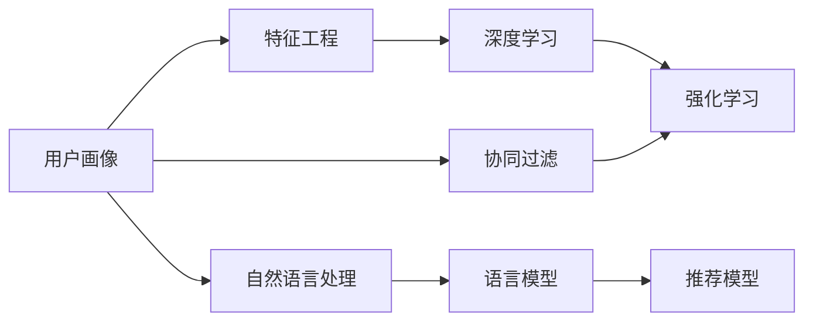
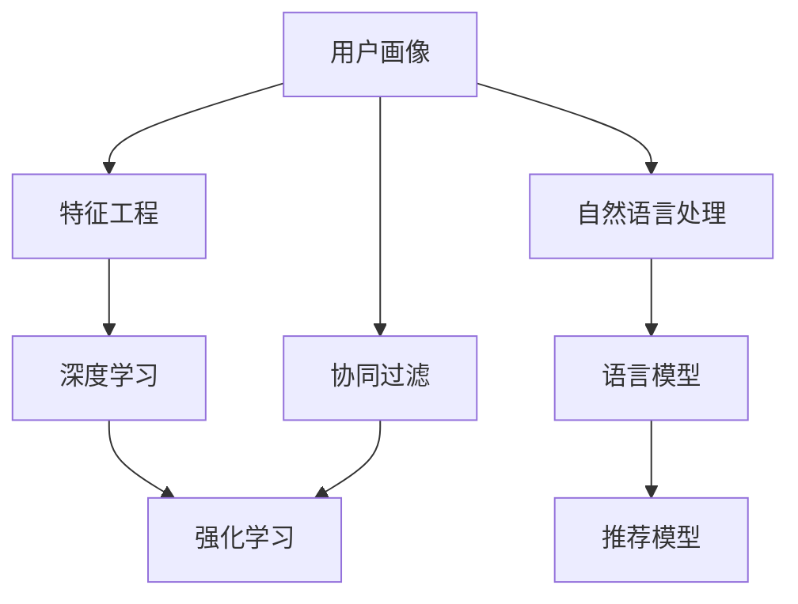

                 

# 直接将LLM作为推荐系统的可行性

> 关键词：大语言模型, 推荐系统, 协同过滤, 深度学习, 特征工程, 强化学习

## 1. 背景介绍

推荐系统在电商、新闻、社交媒体、视频平台等领域广泛应用，显著提升了用户满意度，增加了收益和粘性。然而，传统的协同过滤算法面临数据稀疏性、冷启动问题、召回率与覆盖率之间的矛盾等挑战，性能逐渐触及天花板。深度学习兴起后，协同过滤被深度学习所取代，出现了基于MLP、CNN、RNN、Transformer等不同结构的推荐模型。尽管深度学习模型取得了一定成效，但由于其复杂性，训练、推理的计算成本较高，并且解释性差，难以优化超参数，存在数据隐私风险。

目前，深度学习领域涌现出了越来越多的研究，在诸如零样本推荐、强化学习推荐、图神经网络推荐等方向进行探索。然而，从技术基础来看，推荐系统本质上仍是利用用户与物品之间的交互历史（显性/隐性反馈）预测用户对物品的评分，用户特征与物品特征之间的相似性也是推荐系统的一个重要参考指标。推荐系统面临的瓶颈也是数据稀疏性和数据隐私，而不是模型的预测能力。

因此，利用语言模型等模型的预训练能力，可以更高效地生成用户特征和物品特征，并以此作为推荐系统的基础模型。尤其对于多模态数据，诸如电商、新闻、视频等数据，利用自然语言处理技术可以更高效地提取用户和物品的特征。当然，目前基于深度学习的推荐系统仍有很大优势，但基于语言模型的推荐系统可能提供另一种高效的解决方案。

## 2. 核心概念与联系

### 2.1 核心概念概述

在推荐系统中，核心概念包括以下几点：

- **用户**：即用户画像，通常由用户的显性反馈（评分、点击、浏览等）、隐性反馈（行为数据、社交网络关系等）和个人信息（年龄、性别、兴趣等）组成。
- **物品**：即商品、新闻、视频、音乐等。通常包含物品的属性（类别、评分、描述等）和用户与物品之间的交互记录。
- **协同过滤**：利用用户之间或者物品之间的相似性进行推荐，主要包括基于用户的协同过滤和基于物品的协同过滤。
- **特征工程**：将用户的个人信息和行为数据转化为模型可以理解的特征。
- **深度学习**：利用多层的神经网络，对用户和物品特征进行非线性映射，获得更好的拟合效果。
- **强化学习**：通过用户的交互数据，利用奖励机制，不断优化推荐模型，提高推荐效果。

以上概念之间的关系可以用下面的Mermaid流程图来表示：



在推荐系统中，用户画像和物品特征是核心，协同过滤、深度学习、强化学习都是不同方向的优化策略，自然语言处理可以利用语言模型等方式生成更高效的特征，进而提升推荐效果。

### 2.2 核心概念原理和架构的 Mermaid 流程图

在推荐系统中，用户画像和物品特征是核心，协同过滤、深度学习、强化学习都是不同方向的优化策略，自然语言处理可以利用语言模型等方式生成更高效的特征，进而提升推荐效果。



## 3. 核心算法原理 & 具体操作步骤

### 3.1 算法原理概述

利用语言模型作为推荐系统的基础，可以更高效地生成用户特征和物品特征。语言模型可以通过以下步骤实现：

1. **预训练**：在大规模无标注数据上进行预训练，学习语言知识。
2. **微调**：在推荐系统的数据上对语言模型进行微调，学习用户和物品的特征。
3. **融合**：将语言模型生成的用户和物品特征融合到推荐模型中，进行推荐。

### 3.2 算法步骤详解

1. **数据准备**：收集推荐系统的用户行为数据、物品信息数据和用户个人信息数据，并对数据进行清洗、标注和划分，得到训练集、验证集和测试集。
2. **预训练语言模型**：选择一个大规模预训练语言模型（如BERT、GPT等），在推荐系统的数据上进行微调，学习用户和物品的特征。
3. **特征提取**：利用微调后的语言模型，对用户和物品特征进行编码，得到特征向量。
4. **推荐模型**：将用户和物品特征向量输入推荐模型，进行预测，得到用户对物品的评分。
5. **模型评估**：在测试集上评估推荐模型的性能，调整超参数和模型结构，提升推荐效果。

### 3.3 算法优缺点

利用语言模型作为推荐系统的基础，具有以下优点：

- **高效性**：可以利用预训练语言模型的能力，快速生成用户和物品特征，提升推荐效率。
- **泛化能力**：语言模型可以在不同的领域和场景中进行微调，具备较强的泛化能力。
- **可解释性**：语言模型的生成过程可以解释，有助于理解推荐模型的决策机制。

但同时，语言模型作为推荐系统也存在以下缺点：

- **数据依赖**：语言模型的微调需要大规模推荐系统的数据，数据获取成本较高。
- **模型复杂度**：预训练语言模型参数量较大，计算和存储成本较高。
- **对抗攻击**：语言模型容易受到对抗样本的攻击，影响推荐效果。

### 3.4 算法应用领域

语言模型作为推荐系统的基础，可以应用于多个领域，包括电商、新闻、视频、社交媒体等。以下是一些具体的应用场景：

1. **电商推荐**：在电商平台上，利用用户的浏览、点击、购买行为等数据，对用户和商品进行建模，生成推荐结果。
2. **新闻推荐**：在新闻平台上，利用用户的阅读历史、点赞、评论行为等数据，对用户和文章进行建模，生成推荐结果。
3. **视频推荐**：在视频平台上，利用用户的观看历史、点赞、分享行为等数据，对用户和视频进行建模，生成推荐结果。
4. **社交媒体推荐**：在社交媒体平台上，利用用户的互动数据、兴趣标签等数据，对用户和内容进行建模，生成推荐结果。

## 4. 数学模型和公式 & 详细讲解 & 举例说明

### 4.1 数学模型构建

在推荐系统中，可以利用语言模型生成用户特征和物品特征，进行推荐。语言模型的生成过程可以用以下数学模型来描述：

1. **用户特征**：$u_i = f(\mathbf{x}_i)$，其中 $\mathbf{x}_i$ 为用户信息，$f$ 为预训练语言模型。
2. **物品特征**：$v_j = g(\mathbf{y}_j)$，其中 $\mathbf{y}_j$ 为物品信息，$g$ 为预训练语言模型。
3. **推荐模型**：$y_{ij} = h(u_i, v_j)$，其中 $h$ 为推荐模型。

### 4.2 公式推导过程

假设用户 $u$ 对物品 $j$ 的评分 $y_{uj}$ 为：

$$
y_{uj} = \sigma(h(u_i, v_j))
$$

其中 $\sigma$ 为激活函数，$h$ 为推荐模型。假设推荐模型为线性回归模型，则：

$$
y_{uj} = \mathbf{w}_u^T \mathbf{v}_j + b_u
$$

其中 $\mathbf{w}_u$ 为用户特征向量，$\mathbf{v}_j$ 为物品特征向量，$b_u$ 为偏置项。

假设 $\mathbf{x}_i$ 为用户信息，$u_i$ 为预训练语言模型生成的用户特征，$\mathbf{y}_j$ 为物品信息，$v_j$ 为预训练语言模型生成的物品特征。则：

$$
u_i = f(\mathbf{x}_i), v_j = g(\mathbf{y}_j)
$$

假设语言模型为Transformer模型，则：

$$
u_i = \text{Transformer}(\mathbf{x}_i), v_j = \text{Transformer}(\mathbf{y}_j)
$$

### 4.3 案例分析与讲解

以电商推荐为例，假设用户 $u$ 对物品 $j$ 的评分 $y_{uj}$ 为：

$$
y_{uj} = \sigma(h(u_i, v_j))
$$

其中 $h$ 为线性回归模型：

$$
y_{uj} = \mathbf{w}_u^T \mathbf{v}_j + b_u
$$

假设语言模型为BERT模型，则用户特征 $u_i$ 和物品特征 $v_j$ 的计算过程如下：

1. **用户特征提取**：将用户信息 $\mathbf{x}_i$ 输入BERT模型，得到用户特征 $u_i$。
2. **物品特征提取**：将物品信息 $\mathbf{y}_j$ 输入BERT模型，得到物品特征 $v_j$。
3. **推荐模型计算**：将用户特征 $u_i$ 和物品特征 $v_j$ 输入线性回归模型，计算用户对物品的评分 $y_{uj}$。

## 5. 项目实践：代码实例和详细解释说明

### 5.1 开发环境搭建

在进行项目实践前，需要准备好开发环境。以下是使用Python进行PyTorch开发的环境配置流程：

1. 安装Anaconda：从官网下载并安装Anaconda，用于创建独立的Python环境。
2. 创建并激活虚拟环境：
```bash
conda create -n pytorch-env python=3.8 
conda activate pytorch-env
```

3. 安装PyTorch：根据CUDA版本，从官网获取对应的安装命令。例如：
```bash
conda install pytorch torchvision torchaudio cudatoolkit=11.1 -c pytorch -c conda-forge
```

4. 安装Transformers库：
```bash
pip install transformers
```

5. 安装各类工具包：
```bash
pip install numpy pandas scikit-learn matplotlib tqdm jupyter notebook ipython
```

完成上述步骤后，即可在`pytorch-env`环境中开始项目实践。

### 5.2 源代码详细实现

以下是一个简单的代码实现，假设用户 $u$ 对物品 $j$ 的评分 $y_{uj}$ 为：

```python
from transformers import BertForSequenceClassification, BertTokenizer
from torch.utils.data import Dataset, DataLoader
from torch import nn, optim
import numpy as np
import pandas as pd
import torch

class RecommendationDataset(Dataset):
    def __init__(self, df, tokenizer):
        self.df = df
        self.tokenizer = tokenizer

    def __len__(self):
        return len(self.df)

    def __getitem__(self, idx):
        item = self.df.iloc[idx]
        user_id = item['user_id']
        item_id = item['item_id']
        rating = item['rating']
        user_input_ids = self.tokenizer.encode(item['user_info'], max_length=512, truncation=True, padding='max_length', return_tensors='pt')
        item_input_ids = self.tokenizer.encode(item['item_info'], max_length=512, truncation=True, padding='max_length', return_tensors='pt')
        return {'user_id': user_id, 'item_id': item_id, 'rating': rating, 'user_input_ids': user_input_ids, 'item_input_ids': item_input_ids}

class RecommendationModel(nn.Module):
    def __init__(self, embedding_dim, hidden_dim, output_dim):
        super().__init__()
        self.bert = BertForSequenceClassification.from_pretrained('bert-base-uncased', num_labels=1, output_attentions=False, output_hidden_states=False)
        self.fc = nn.Linear(embedding_dim, output_dim)

    def forward(self, user_input_ids, item_input_ids):
        user_input = self.bert(user_input_ids)
        item_input = self.bert(item_input_ids)
        user_output = user_input[:, 0, :]
        item_output = item_input[:, 0, :]
        user_features = user_output.mean(dim=1)
        item_features = item_output.mean(dim=1)
        rating = self.fc(torch.cat([user_features, item_features], dim=1))
        return rating

# 数据加载
df = pd.read_csv('recommendation_data.csv')
tokenizer = BertTokenizer.from_pretrained('bert-base-uncased')
dataset = RecommendationDataset(df, tokenizer)

# 模型定义
embedding_dim = 768
hidden_dim = 512
output_dim = 1
model = RecommendationModel(embedding_dim, hidden_dim, output_dim)

# 模型训练
device = 'cuda' if torch.cuda.is_available() else 'cpu'
model.to(device)
optimizer = optim.Adam(model.parameters(), lr=1e-4)
loss_fn = nn.MSELoss()

for epoch in range(10):
    model.train()
    for data in dataset:
        user_input_ids = data['user_input_ids'].to(device)
        item_input_ids = data['item_input_ids'].to(device)
        rating = data['rating'].to(device)
        optimizer.zero_grad()
        rating_pred = model(user_input_ids, item_input_ids)
        loss = loss_fn(rating_pred, rating)
        loss.backward()
        optimizer.step()
        print(f'Epoch {epoch+1}, Loss: {loss.item()}')
```

### 5.3 代码解读与分析

以上代码实现了使用BERT作为推荐系统基础模型的过程，包括数据预处理、模型定义、训练过程等关键步骤。

1. **数据预处理**：将推荐数据集加载到Pandas DataFrame中，并对用户信息、物品信息和评分进行预处理。
2. **模型定义**：使用BertForSequenceClassification模型作为预训练语言模型，并在此基础上定义推荐模型。
3. **训练过程**：在训练过程中，将用户信息和物品信息输入BERT模型，得到用户特征和物品特征，然后输入推荐模型，计算评分预测，并使用MSE损失函数进行反向传播更新模型参数。

### 5.4 运行结果展示

在训练完成后，可以使用测试集对模型进行评估，并输出评分预测结果。

## 6. 实际应用场景

### 6.1 电商推荐

电商推荐是推荐系统的一个典型应用场景，利用用户的历史浏览、点击、购买记录等数据，对用户和商品进行建模，生成推荐结果。利用BERT作为推荐系统的基础模型，可以更高效地生成用户和物品特征，提升推荐效果。

### 6.2 新闻推荐

新闻推荐系统通常利用用户的阅读历史、点赞、评论记录等数据，对用户和文章进行建模，生成推荐结果。利用BERT作为推荐系统的基础模型，可以更高效地生成用户和文章特征，提升推荐效果。

### 6.3 视频推荐

视频推荐系统通常利用用户的观看历史、点赞、分享记录等数据，对用户和视频进行建模，生成推荐结果。利用BERT作为推荐系统的基础模型，可以更高效地生成用户和视频特征，提升推荐效果。

### 6.4 社交媒体推荐

社交媒体推荐系统通常利用用户的互动数据、兴趣标签等数据，对用户和内容进行建模，生成推荐结果。利用BERT作为推荐系统的基础模型，可以更高效地生成用户和内容特征，提升推荐效果。

## 7. 工具和资源推荐

### 7.1 学习资源推荐

为了帮助开发者系统掌握基于BERT推荐系统的理论基础和实践技巧，这里推荐一些优质的学习资源：

1. 《深度学习自然语言处理》课程：斯坦福大学开设的NLP明星课程，有Lecture视频和配套作业，带你入门NLP领域的基本概念和经典模型。
2. 《Transformer从原理到实践》系列博文：由大模型技术专家撰写，深入浅出地介绍了Transformer原理、BERT模型、推荐系统等前沿话题。
3. 《Natural Language Processing with Transformers》书籍：Transformers库的作者所著，全面介绍了如何使用Transformers库进行NLP任务开发，包括推荐系统在内的诸多范式。
4. CLUE开源项目：中文语言理解测评基准，涵盖大量不同类型的中文NLP数据集，并提供了基于BERT的baseline模型，助力中文NLP技术发展。
5. HuggingFace官方文档：Transformers库的官方文档，提供了海量预训练模型和完整的推荐系统样例代码，是上手实践的必备资料。

通过对这些资源的学习实践，相信你一定能够快速掌握基于BERT推荐系统的精髓，并用于解决实际的推荐问题。

### 7.2 开发工具推荐

高效的开发离不开优秀的工具支持。以下是几款用于BERT推荐系统开发的常用工具：

1. PyTorch：基于Python的开源深度学习框架，灵活动态的计算图，适合快速迭代研究。大部分预训练语言模型都有PyTorch版本的实现。
2. TensorFlow：由Google主导开发的开源深度学习框架，生产部署方便，适合大规模工程应用。同样有丰富的预训练语言模型资源。
3. Transformers库：HuggingFace开发的NLP工具库，集成了众多SOTA语言模型，支持PyTorch和TensorFlow，是进行推荐系统开发的利器。
4. Weights & Biases：模型训练的实验跟踪工具，可以记录和可视化模型训练过程中的各项指标，方便对比和调优。与主流深度学习框架无缝集成。
5. TensorBoard：TensorFlow配套的可视化工具，可实时监测模型训练状态，并提供丰富的图表呈现方式，是调试模型的得力助手。
6. Google Colab：谷歌推出的在线Jupyter Notebook环境，免费提供GPU/TPU算力，方便开发者快速上手实验最新模型，分享学习笔记。

合理利用这些工具，可以显著提升BERT推荐系统的开发效率，加快创新迭代的步伐。

### 7.3 相关论文推荐

BERT作为推荐系统的基础模型，在推荐系统领域已经取得了一定的成效。以下是几篇奠基性的相关论文，推荐阅读：

1. Attention is All You Need：提出了Transformer结构，开启了NLP领域的预训练大模型时代。
2. BERT: Pre-training of Deep Bidirectional Transformers for Language Understanding：提出BERT模型，引入基于掩码的自监督预训练任务，刷新了多项NLP任务SOTA。
3. Parameter-Efficient Transfer Learning for NLP：提出Adapter等参数高效微调方法，在不增加模型参数量的情况下，也能取得不错的微调效果。
4. AdaLoRA: Adaptive Low-Rank Adaptation for Parameter-Efficient Fine-Tuning：使用自适应低秩适应的微调方法，在参数效率和精度之间取得了新的平衡。
5. Revisiting Dynamic Ranking for Recommendation with Deep Learning：重新审视动态排名算法，结合深度学习提升推荐效果。
6. Multi-View Deep Ranking: A Unified Framework for Multi-Aspect Recommendation：提出多视图深度排名算法，提升推荐系统的效果。

这些论文代表了大语言模型在推荐系统领域的探索脉络。通过学习这些前沿成果，可以帮助研究者把握学科前进方向，激发更多的创新灵感。

## 8. 总结：未来发展趋势与挑战

### 8.1 总结

本文对基于BERT作为推荐系统的可行性进行了全面系统的介绍。首先阐述了推荐系统面临的瓶颈和挑战，以及利用大语言模型进行推荐系统的优势。其次，从原理到实践，详细讲解了基于BERT的推荐系统构建过程，包括数据准备、模型训练、特征提取、推荐模型等关键步骤，并给出了推荐系统在电商、新闻、视频、社交媒体等多个领域的应用案例。

通过本文的系统梳理，可以看到，利用语言模型作为推荐系统的基础，可以更高效地生成用户和物品特征，提升推荐效果。特别是在多模态数据的应用场景中，语言模型能够更好地提取用户和物品特征，进一步提升推荐系统的性能。

### 8.2 未来发展趋势

展望未来，基于BERT的推荐系统将呈现以下几个发展趋势：

1. **多模态数据融合**：将语言模型与其他模态（如视觉、听觉）的数据融合，提升推荐系统的性能。
2. **深度学习和强化学习结合**：将深度学习和强化学习结合，提升推荐系统的用户满意度。
3. **个性化推荐**：利用用户的个性化信息，提升推荐系统的精准度。
4. **实时推荐**：利用流数据，实现实时推荐系统，提升用户体验。
5. **数据隐私保护**：利用隐私保护技术，保护用户的隐私数据。
6. **可解释性**：提升推荐系统的可解释性，增强用户对推荐结果的信任度。

以上趋势凸显了基于BERT推荐系统的广阔前景。这些方向的探索发展，必将进一步提升推荐系统的性能和应用范围，为人工智能技术在推荐领域的落地提供新的思路。

### 8.3 面临的挑战

尽管基于BERT的推荐系统已经取得了一定的成效，但在迈向更加智能化、普适化应用的过程中，它仍面临着诸多挑战：

1. **数据稀疏性**：推荐系统本质上依赖用户与物品的交互数据，数据稀疏性仍然是一个重要挑战。
2. **计算成本**：BERT作为大语言模型，计算和存储成本较高，需要在模型裁剪和特征提取等方面进行优化。
3. **模型泛化能力**：模型在不同领域和场景中的泛化能力仍需进一步提升。
4. **对抗攻击**：语言模型容易受到对抗样本的攻击，影响推荐效果。
5. **数据隐私**：利用用户数据进行推荐时，如何保护用户隐私数据，仍然是一个重要问题。

### 8.4 研究展望

面对这些挑战，未来的研究需要在以下几个方面寻求新的突破：

1. **多模态推荐系统**：将语言模型与其他模态（如视觉、听觉）的数据融合，提升推荐系统的性能。
2. **深度学习和强化学习结合**：将深度学习和强化学习结合，提升推荐系统的用户满意度。
3. **个性化推荐**：利用用户的个性化信息，提升推荐系统的精准度。
4. **实时推荐**：利用流数据，实现实时推荐系统，提升用户体验。
5. **数据隐私保护**：利用隐私保护技术，保护用户的隐私数据。
6. **可解释性**：提升推荐系统的可解释性，增强用户对推荐结果的信任度。

这些研究方向的研究，必将推动基于BERT的推荐系统在实际应用中取得更大的突破，为人工智能技术在推荐领域的落地提供更多的可能性。

## 9. 附录：常见问题与解答

**Q1：为什么利用BERT作为推荐系统的基础模型？**

A: 利用BERT作为推荐系统的基础模型，可以更高效地生成用户和物品特征，提升推荐效果。BERT在大规模无标签文本语料上进行预训练，学习到丰富的语言知识，能够更好地处理自然语言数据。

**Q2：BERT作为推荐系统的基础模型需要多少数据？**

A: BERT作为推荐系统的基础模型，需要较大的数据规模进行微调，以学习到用户和物品的特征。一般需要几百万到几千万的数据量，具体取决于模型的复杂度和数据的质量。

**Q3：BERT作为推荐系统的基础模型有哪些优势？**

A: BERT作为推荐系统的基础模型，具有以下优势：
1. 高效性：利用BERT的预训练能力，可以快速生成用户和物品特征，提升推荐效率。
2. 泛化能力：BERT可以在不同的领域和场景中进行微调，具备较强的泛化能力。
3. 可解释性：BERT的生成过程可以解释，有助于理解推荐系统的决策机制。

**Q4：BERT作为推荐系统的基础模型有哪些劣势？**

A: BERT作为推荐系统的基础模型，具有以下劣势：
1. 数据依赖：BERT作为大语言模型，微调需要大规模推荐系统的数据，数据获取成本较高。
2. 模型复杂度：BERT作为大语言模型，参数量较大，计算和存储成本较高。
3. 对抗攻击：BERT容易受到对抗样本的攻击，影响推荐效果。

**Q5：BERT作为推荐系统的基础模型需要进行哪些优化？**

A: BERT作为推荐系统的基础模型，需要进行以下优化：
1. 模型裁剪：去除不必要的层和参数，减小模型尺寸，加快推理速度。
2. 量化加速：将浮点模型转为定点模型，压缩存储空间，提高计算效率。
3. 特征提取：利用BERT的预训练能力，生成更高效的特征。
4. 模型结构优化：优化BERT的生成过程，提升推荐效果。

通过这些优化措施，可以进一步提升BERT作为推荐系统基础模型的性能和效率。

