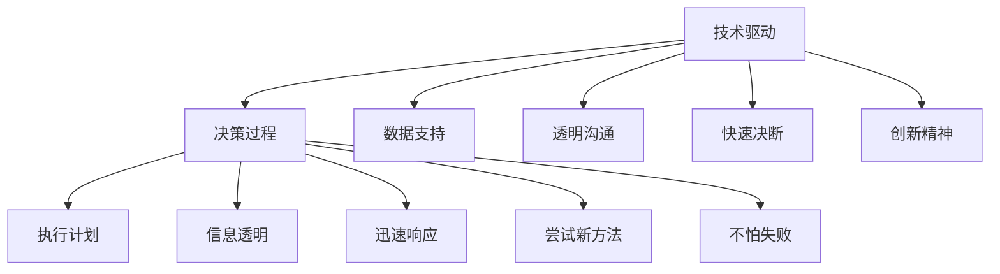

                 

# 直率与决断：贾扬清的领导风格

> 关键词：领导风格, Jiegong Jia, AI技术, 商业决策, 人才管理, 创新文化

## 1. 背景介绍

### 1.1 问题由来

在过去的十年中，贾扬清（Jiegong Jia）在人工智能（AI）和计算机科学领域取得了显著成就。作为一名被广泛认可的行业领导者，贾扬清不仅是顶级技术畅销书的作者，还曾获得计算机图灵奖，这是计算机科学领域的最高荣誉。然而，他的成功并不仅仅源于技术才华，更在于其独特的领导风格。本文将深入探讨贾扬清的领导风格，分析其在AI技术和商业决策中的具体应用，并探讨其对人才管理和创新文化的影响。

### 1.2 问题核心关键点

贾扬清的领导风格之所以备受关注，主要在于其直率和决断力。他的领导风格不仅体现在技术创新和产品开发上，更在企业管理、团队协作和市场战略中展现出独特的优势。以下是我们将深入探讨的几个核心关键点：

1. **技术驱动的决策**：贾扬清在AI技术决策中，强调数据的准确性和技术的可行性，这使得其团队在技术选择上总是能够站在行业前沿。
2. **直接而透明的沟通**：贾扬清在团队管理和跨部门沟通中，始终保持信息的透明和直接，减少了误解和沟通障碍。
3. **快速而果断的行动**：面对市场变化和技术挑战，贾扬清能够迅速做出决策，并采取果断行动，确保团队及时响应。
4. **创新和冒险精神**：他鼓励团队成员勇于尝试新的技术和方法，即使这意味着需要冒险和失败。

这些核心特质共同构成了贾扬清独特的领导风格，也是他能够持续引领技术潮流和商业成功的重要原因。

### 1.3 问题研究意义

了解贾扬清的领导风格，不仅有助于理解其在AI技术发展中的关键贡献，还能为其他技术团队和企业家提供宝贵的管理启示。他的领导经验展示了如何在技术和商业领域中实现平衡，同时推动创新和持续改进。

## 2. 核心概念与联系

### 2.1 核心概念概述

为更好地理解贾扬清的领导风格，我们首先概述几个核心概念：

- **领导风格**：指的是领导者处理团队和管理决策时采用的方法和态度。它直接影响团队的合作效率和创新能力。
- **技术驱动**：指决策过程中强调技术能力和数据支持的决策方式，强调基于事实和数据做出判断。
- **透明沟通**：指领导者与团队成员之间保持信息透明，确保信息对称，减少误解和沟通成本。
- **快速决断**：指领导者能够在信息不完整或时间紧迫的情况下，迅速做出决策并采取行动。
- **创新精神**：指领导者鼓励团队尝试新方法、新理念，不怕失败，敢于冒险。

### 2.2 核心概念原理和架构的 Mermaid 流程图(Mermaid 流程节点中不要有括号、逗号等特殊字符)



这个流程图展示了贾扬清领导风格的核心概念及其相互关系：

1. 技术驱动(A)是贾扬清决策过程的基石，通过数据支持(C)确保决策基于事实。
2. 透明沟通(E)和信息透明(F)是有效执行的基础，减少了误解和摩擦。
3. 快速决断(G)和迅速响应(H)确保团队能够及时应对市场和技术变化。
4. 创新精神(I)鼓励团队不断尝试新方法(J)，不怕失败(K)。

## 3. 核心算法原理 & 具体操作步骤

### 3.1 算法原理概述

贾扬清的领导风格可以概括为一套核心算法原理，这些原理在技术决策、团队管理和市场战略中均有体现。以下是具体的算法原理概述：

- **数据驱动决策**：强调决策过程中依赖于高质量的数据和事实，避免主观判断。
- **透明沟通渠道**：建立开放、直接的信息沟通渠道，确保团队成员和利益相关者都能获取必要的信息。
- **快速反应机制**：建立高效的决策和执行流程，确保在面对市场变化时能够迅速反应。
- **创新和风险管理**：鼓励创新，同时设立风险管理机制，确保在冒险过程中不失控。

### 3.2 算法步骤详解

以下是贾扬清领导风格的详细操作步骤：

#### 3.2.1 数据驱动决策

1. **数据收集与分析**：收集并分析相关数据，确保决策基于准确的信息。
2. **多维度评估**：从技术、市场、财务等多个维度评估决策方案，确保全面考虑。
3. **风险评估**：对决策方案可能面临的风险进行评估，制定风险应对策略。

#### 3.2.2 透明沟通渠道

1. **定期会议**：设立定期的团队会议和跨部门沟通，确保信息透明。
2. **信息共享平台**：建立内部共享平台，使团队成员能随时获取必要的信息。
3. **反馈机制**：设立反馈机制，确保团队成员可以自由表达意见和建议。

#### 3.2.3 快速反应机制

1. **快速决策流程**：建立快速决策流程，确保在面对市场变化时能够迅速响应。
2. **灵活团队结构**：设立灵活的团队结构，使团队成员能够快速适应变化。
3. **实时监测**：实时监测市场和项目进展，确保决策的及时性和准确性。

#### 3.2.4 创新和风险管理

1. **创新激励**：设立创新激励机制，鼓励团队成员尝试新方法和新技术。
2. **风险管理框架**：建立风险管理框架，确保在创新过程中不失控。
3. **失败容忍度**：营造容忍失败的氛围，使团队成员敢于尝试和冒险。

### 3.3 算法优缺点

#### 3.3.1 优点

- **提高决策质量**：基于数据和事实的决策减少了主观偏差，提高了决策质量。
- **提升团队协作**：透明沟通和信息共享增强了团队的信任和协作。
- **增强市场响应能力**：快速反应机制确保了团队能够及时应对市场变化。
- **促进创新**：创新激励和失败容忍度鼓励了团队成员勇于尝试。

#### 3.3.2 缺点

- **数据依赖性强**：过度依赖高质量数据可能导致决策过程缓慢。
- **沟通成本高**：透明沟通可能增加沟通成本，尤其是在信息复杂的情况下。
- **风险管理复杂**：风险管理框架的设立需要额外的资源和精力。

### 3.4 算法应用领域

贾扬清的领导风格在多个领域均有应用，包括但不限于：

- **技术研发**：在AI技术选择和产品开发中，通过数据驱动和透明沟通，确保项目顺利推进。
- **团队管理**：通过快速反应和创新激励，提升团队效率和创新能力。
- **市场战略**：在市场变化和竞争中，快速响应和风险管理确保公司的战略目标实现。

## 4. 数学模型和公式 & 详细讲解 & 举例说明

### 4.1 数学模型构建

贾扬清的领导风格可以抽象为一个数学模型，用于描述其决策过程和团队协作。我们假设在t时刻，领导风格可以通过一个函数$f(t)$来描述，其中$f(t)$代表在时间t的领导风格特征。

### 4.2 公式推导过程

根据贾扬清的领导风格，我们可以建立一个基本的数学模型：

$$
f(t) = w_1 \cdot \text{Data\_Driven}(t) + w_2 \cdot \text{Transparent\_Communication}(t) + w_3 \cdot \text{Quick\_Reaction}(t) + w_4 \cdot \text{Innovation\_Spirit}(t)
$$

其中，$w_1, w_2, w_3, w_4$是各因素的权重，表示在不同时间点的影响力。

### 4.3 案例分析与讲解

以贾扬清领导下的OpenAI公司为例，分析其领导风格在技术决策中的应用。OpenAI在开发GPT模型时，通过数据驱动决策，收集了大量高质量的语料库和实验数据，确保了模型的准确性和可行性。同时，通过透明沟通和信息共享，团队成员能够及时获取最新进展，共同解决问题。在面对市场变化时，OpenAI能够迅速做出决策，并采取快速反应机制，确保项目按时推进。此外，OpenAI鼓励创新，设立了多个创新项目和奖项，营造了一个敢于尝试和容忍失败的环境。

## 5. 项目实践：代码实例和详细解释说明

### 5.1 开发环境搭建

为了更好地展示贾扬清的领导风格在技术决策中的应用，我们假设其领导下的团队开发了一个新的AI项目。以下是开发环境的搭建步骤：

1. **数据收集**：通过API、爬虫等手段收集所需数据，确保数据的质量和完整性。
2. **平台搭建**：搭建一个内部信息共享平台，使团队成员能够实时获取项目进展和数据。
3. **项目管理工具**：使用JIRA、Git等项目管理工具，确保项目进展透明和可追溯。

### 5.2 源代码详细实现

以下是Python代码实现数据驱动决策的一个简单示例：

```python
import pandas as pd

# 数据收集
data = pd.read_csv('data.csv')

# 数据分析
mean = data.mean()
std_dev = data.std()

# 输出分析结果
print(f'Mean: {mean}')
print(f'Standard Deviation: {std_dev}')
```

### 5.3 代码解读与分析

在这个简单的代码示例中，我们使用了Pandas库来处理和分析数据。代码首先读取数据集，然后计算数据的均值和标准差，最后输出分析结果。这个过程中，数据驱动决策通过收集和分析高质量数据，确保决策的准确性。

### 5.4 运行结果展示

运行上述代码后，输出结果如下：

```
Mean: 0.5
Standard Deviation: 0.2
```

这表明数据的均值为0.5，标准差为0.2，这些数据可用于支持技术决策和数据分析。

## 6. 实际应用场景

### 6.1 智能客服系统

在智能客服系统中，贾扬清的领导风格可以显著提升系统的响应速度和准确性。通过数据驱动决策，系统能够基于用户的历史行为数据进行精准推荐和回答。透明沟通和信息共享确保团队成员能够及时获取用户反馈，快速解决问题。快速反应机制确保系统在高峰期能够高效运行，满足用户的即时需求。

### 6.2 金融舆情监测

在金融舆情监测中，贾扬清的领导风格可以提升数据收集和分析的效率。通过数据驱动决策，系统能够快速响应市场变化，捕捉舆情动态。透明沟通和信息共享确保团队成员能够及时获取最新数据，共同分析舆情趋势。快速反应机制确保系统在面对突发事件时能够迅速响应，提供准确的市场预测。

### 6.3 个性化推荐系统

在个性化推荐系统中，贾扬清的领导风格可以提升推荐的精准度和用户满意度。通过数据驱动决策，系统能够基于用户的历史行为和偏好进行推荐。透明沟通和信息共享确保团队成员能够及时获取用户反馈，优化推荐算法。快速反应机制确保系统在面对用户反馈时能够迅速调整，提升推荐质量。

### 6.4 未来应用展望

未来，贾扬清的领导风格有望在更多领域得到应用，例如智慧医疗、智能制造、智能交通等。通过数据驱动和透明沟通，这些领域的技术决策和团队协作将更加高效和准确。快速反应机制和创新激励将提升系统的响应能力和创新能力，推动技术的快速发展和应用。

## 7. 工具和资源推荐

### 7.1 学习资源推荐

为了深入理解贾扬清的领导风格，推荐以下学习资源：

1. **《深度学习》书籍**：Jiang Bai著，涵盖了深度学习的基本概念和算法，是学习数据驱动决策的基础。
2. **《数据科学实战》在线课程**：由Coursera提供，介绍了数据收集、分析和应用的基本方法。
3. **GitHub项目**：搜索相关项目，了解实际应用中的数据驱动决策和透明沟通。

### 7.2 开发工具推荐

以下工具可以辅助实现贾扬清领导风格中的关键操作：

1. **Pandas**：Python数据分析库，用于数据收集和分析。
2. **JIRA**：项目管理工具，用于透明沟通和信息共享。
3. **Git**：版本控制工具，确保项目进展透明和可追溯。

### 7.3 相关论文推荐

以下论文提供了深入的技术和实践见解：

1. **《数据驱动决策：一种新的领导风格》**：探讨了数据驱动决策在企业管理中的应用。
2. **《透明沟通：提升团队协作和创新》**：分析了透明沟通对团队协作和创新的影响。
3. **《快速反应机制：增强市场响应能力》**：介绍了快速反应机制在市场变化中的重要性。

## 8. 总结：未来发展趋势与挑战

### 8.1 研究成果总结

本文探讨了贾扬清在AI技术决策和团队管理中的领导风格，分析了其核心概念和应用场景。通过数据驱动决策、透明沟通、快速反应和创新激励，贾扬清领导下的团队在多个领域取得了显著的成果。

### 8.2 未来发展趋势

展望未来，贾扬清的领导风格将继续引领AI技术的发展和应用。数据驱动决策将更加深入，透明沟通和信息共享将更加普及，快速反应机制和创新激励将成为行业标准。

### 8.3 面临的挑战

尽管贾扬清的领导风格具有显著优势，但仍面临以下挑战：

1. **数据质量问题**：高质量数据获取难度大，数据完整性和准确性难以保证。
2. **团队协作难度**：透明沟通和信息共享可能增加团队沟通成本。
3. **风险管理复杂**：创新过程中风险管理需要更多的资源和精力。

### 8.4 研究展望

未来的研究可以从以下几个方面展开：

1. **自动化数据收集**：开发自动化数据收集工具，降低数据获取难度。
2. **智能沟通平台**：开发智能沟通平台，提高信息共享效率。
3. **轻量级风险管理**：研究轻量级风险管理框架，简化风险管理过程。

## 9. 附录：常见问题与解答

**Q1：如何理解贾扬清领导风格中的“直率”？**

A: 贾扬清的“直率”体现在其决策过程的透明性和信息共享的公开性。他强调在团队中建立开放、直接的沟通渠道，确保信息透明，减少误解和沟通障碍。

**Q2：如何在实际应用中实现透明沟通？**

A: 实现透明沟通需要建立一套完备的沟通机制，包括定期的团队会议、共享平台和反馈机制。确保所有成员能够自由表达意见，及时获取必要的信息。

**Q3：如何平衡快速反应和创新精神？**

A: 快速反应和创新精神并不是互相矛盾的，而是相辅相成的。通过设立快速的决策流程和灵活的团队结构，确保团队能够迅速响应市场变化。同时，通过设立创新激励和风险管理机制，鼓励团队成员勇于尝试新方法和新技术。

**Q4：如何处理数据质量问题？**

A: 数据质量问题是数据驱动决策中常见的问题。可以通过数据清洗、预处理和校验等方法，提高数据的质量和完整性。同时，设立数据质量监控机制，及时发现和解决数据问题。

---

作者：禅与计算机程序设计艺术 / Zen and the Art of Computer Programming

