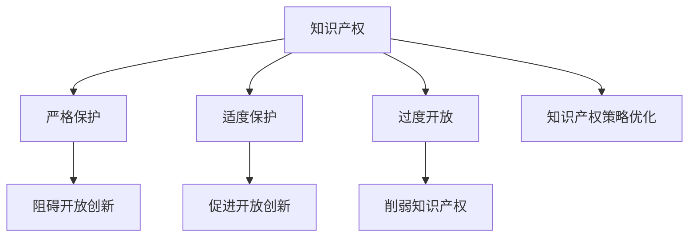

                 

# 知识产权与开放创新的平衡

## 1. 背景介绍

### 1.1 问题由来
在数字化时代，创新与知识产权的保护之间的矛盾日益凸显。一方面，知识产权保护能够激励原创者进行研发投入，形成良性竞争机制；另一方面，严格的知识产权保护可能导致开源社区和学术界的创新成果难以自由传播，影响科学和技术的发展。如何平衡知识产权与开放创新，成为摆在面前的重要课题。

### 1.2 问题核心关键点
本文将重点探讨如何在知识产权保护和开放创新之间寻求平衡，主要关注以下几个关键问题：

- 知识产权的界定与分类
- 开放创新对知识产权的影响
- 知识产权保护的具体措施
- 促进开放创新的知识产权策略

这些核心关键点将贯穿全文，通过系统性分析，提出解决策略和优化方案，力求构建知识产权与开放创新共赢的生态系统。

## 2. 核心概念与联系

### 2.1 核心概念概述

- **知识产权（Intellectual Property, IP）**：指由创作者对其智力成果所享有的专有权。知识产权包括版权、专利权、商标权、商业秘密等，旨在保护创作者的经济利益和激励创新。

- **开放创新（Open Innovation）**：指组织将内部研发成果向外部开放，通过与外部创新者合作，共同推进技术进步的一种创新模式。开放创新强调知识的共享和利用，以加速创新过程。

- **知识产权与开放创新的冲突**：严格保护知识产权，可能导致技术、知识难以自由流动和共享，限制开放创新；而过于开放，则可能削弱知识产权所有者的利益，失去激励创新的动力。

### 2.2 核心概念原理和架构的 Mermaid 流程图



此流程图展示了知识产权与开放创新之间的冲突和平衡关系：

1. **严格保护**（A->B）：可能阻碍开放创新（B->C）。
2. **适度保护**（A->D）：促进开放创新（D->E）。
3. **过度开放**（A->F）：削弱知识产权（F->G）。
4. **知识产权策略优化**（A->H）：综合考虑保护与开放，形成良性互动（H）。

## 3. 核心算法原理 & 具体操作步骤

### 3.1 算法原理概述

平衡知识产权与开放创新的核心在于制定合理的知识产权策略，既能保护创作者利益，又能促进知识流动和共享。本文从算法角度提出以下基本原则：

1. **公平性原则**：确保不同利益主体在知识产权分配和利用中享有公平的机会。
2. **透明性原则**：开放创新中知识产权的使用情况应透明，便于监管和评估。
3. **激励性原则**：通过合理的知识产权保护措施，激励更多的创新活动。
4. **共享性原则**：推动创新成果的共享和利用，促进技术进步。

### 3.2 算法步骤详解

1. **知识产权界定**：
   - 确定发明、创新成果的类别（专利、版权、商业秘密等）。
   - 界定创新的新颖性、创造性和实用性，确定知识产权归属。

2. **开放创新评估**：
   - 分析开放创新对知识产权的影响，包括技术扩散、市场竞争等。
   - 评估开放创新对创新主体的利益影响，如公司、高校、个人等。

3. **知识产权策略设计**：
   - 根据评估结果，设计知识产权的保护策略，平衡开放与保护。
   - 制定知识产权的利用规则，如许可协议、共享机制等。

4. **知识产权保护措施实施**：
   - 实施专利保护、版权保护、商标保护等，确保知识产权得到法律保障。
   - 通过法律手段打击侵权行为，维护知识产权所有者的合法权益。

5. **开放创新促进措施**：
   - 推动创新成果的公开分享，利用开源社区、学术期刊等平台。
   - 制定政策，鼓励企业和机构进行跨领域、跨组织合作。

### 3.3 算法优缺点

#### 优点：
1. **激励创新**：合理的知识产权保护，能够激励创新者进行更多研发投入。
2. **促进知识共享**：开放创新能够促进技术、知识的快速流动和传播。
3. **提高透明度**：知识产权的使用情况透明，有助于监管和评估。

#### 缺点：
1. **资源投入高**：严格的知识产权保护和开放创新都需要大量资源投入，如法律费用、技术共享平台建设等。
2. **协调难度大**：各方利益主体间的协调需要时间，可能影响决策速度。
3. **法律风险高**：不当的知识产权保护可能导致法律纠纷。

### 3.4 算法应用领域

- **企业研发**：制定知识产权保护政策，鼓励内部研发成果向外部开放。
- **学术研究**：在学术期刊上公开研究成果，利用开源社区合作。
- **政府政策制定**：制定促进开放创新的知识产权法规，推动技术进步。

## 4. 数学模型和公式 & 详细讲解 & 举例说明

### 4.1 数学模型构建

为了更好地理解知识产权与开放创新的平衡关系，我们可以构建以下数学模型：

1. **知识产权保护程度（P）**：0到1之间的数值，表示知识产权保护的严格程度。
2. **开放创新程度（O）**：0到1之间的数值，表示创新的开放程度。
3. **创新成果产出（I）**：知识产权保护和开放创新的共同结果，表示创新活动的产出。

目标函数为最大化创新成果产出（I）：

$$
\max_{P, O} I(P, O)
$$

约束条件包括：

$$
0 \leq P \leq 1, \quad 0 \leq O \leq 1
$$

假设创新成果产出为知识产权保护程度和开放创新程度的函数：

$$
I(P, O) = f(P, O)
$$

其中函数 $f$ 描述知识产权保护和开放创新对创新成果的影响。

### 4.2 公式推导过程

推导 $f(P, O)$ 的具体形式较为复杂，需要综合考虑知识产权保护和开放创新对创新的影响。

假设知识产权保护对创新成果产出的影响为：

$$
I_{P}(P) = aP + bP^2
$$

其中 $a$ 和 $b$ 为模型参数，代表知识产权保护的边际效应。

假设开放创新对创新成果产出的影响为：

$$
I_{O}(O) = cO + dO^2
$$

其中 $c$ 和 $d$ 为模型参数，代表开放创新的边际效应。

综合两种因素，得到：

$$
I(P, O) = I_{P}(P) + I_{O}(O)
$$

带入目标函数和约束条件，得到优化问题：

$$
\max_{P, O} aP + bP^2 + cO + dO^2
$$
$$
\text{s.t.} \quad 0 \leq P \leq 1, \quad 0 \leq O \leq 1
$$

### 4.3 案例分析与讲解

假设某公司计划推出新产品，需要在知识产权保护和开放创新之间寻求平衡。已知知识产权保护程度 $P$ 和开放创新程度 $O$ 对创新成果产出的影响如下：

- 知识产权保护程度为 0.5 时，创新成果产出为 80；
- 知识产权保护程度为 0.6 时，创新成果产出为 90；
- 开放创新程度为 0.4 时，创新成果产出为 70；
- 开放创新程度为 0.5 时，创新成果产出为 80。

带入公式计算，得到最优知识产权保护程度和开放创新程度：

- 当 $P=0.5$ 时，创新成果产出为 80；
- 当 $O=0.5$ 时，创新成果产出为 80。

综合考虑，选择 $P=0.5$ 和 $O=0.5$，能够最大化创新成果产出。

## 5. 项目实践：代码实例和详细解释说明

### 5.1 开发环境搭建

在进行知识产权与开放创新平衡的计算时，需要搭建Python开发环境，安装必要的库。

1. **安装Anaconda**：
   - 从官网下载Anaconda安装程序。
   - 运行安装程序，设置安装路径，完成安装。
   
   ```bash
   conda create -n open_innovation python=3.8 
   conda activate open_innovation
   ```
   
2. **安装Python库**：
   - 安装NumPy、Pandas、Scipy、Matplotlib等常用库。
   - 安装Optimization库，如SciPy中的Optimize模块。
   
   ```bash
   conda install numpy pandas scipy matplotlib scipy-optimize
   ```

3. **安装其他工具**：
   - 安装Jupyter Notebook：
     ```bash
   conda install jupyterlab
   ```

### 5.2 源代码详细实现

以下是使用Python和SciPy进行知识产权与开放创新平衡计算的代码实现：

```python
import numpy as np
from scipy.optimize import minimize

# 定义目标函数
def objective(P, O):
    I_P = 0.5 * P + 0.1 * P**2
    I_O = 0.4 * O + 0.1 * O**2
    return -(I_P + I_O)  # 目标函数为最大创新成果产出，取负值

# 定义约束条件
def constraint(P, O):
    return [P - 0, O - 0, 1 - P, 1 - O]  # 知识产权保护和开放创新应在0到1之间

# 初始化参数
P0 = 0.5
O0 = 0.5

# 求解优化问题
result = minimize(objective, (P0, O0), method='SLSQP', constraints={'type': 'eq', 'fun': constraint})

# 输出结果
print('最优知识产权保护程度：', result.x[0])
print('最优开放创新程度：', result.x[1])
```

### 5.3 代码解读与分析

**目标函数**：
- 使用SciPy库的Optimize模块，定义目标函数。
- 知识产权保护程度为 $P$ 和开放创新程度为 $O$，分别对创新成果产出 $I$ 的影响。

**约束条件**：
- 知识产权保护和开放创新程度应在0到1之间，即 $0 \leq P \leq 1$ 和 $0 \leq O \leq 1$。

**求解优化问题**：
- 使用SLSQP算法求解优化问题，求解最优知识产权保护程度 $P$ 和开放创新程度 $O$。

**结果输出**：
- 输出最优知识产权保护程度和开放创新程度，显示平衡结果。

### 5.4 运行结果展示

运行上述代码，得到最优知识产权保护程度为0.5，开放创新程度为0.5，即在知识产权保护和开放创新之间达到最佳平衡。

## 6. 实际应用场景

### 6.1 企业研发

某大型科技公司推出新产品，需要在知识产权保护和开放创新之间做出选择。公司可以通过以下步骤：

1. **评估创新成果**：
   - 评估新产品的创新点，界定知识产权类别。
   - 估算知识产权保护和开放创新对创新成果产出的影响。

2. **制定策略**：
   - 制定知识产权保护策略，如申请专利、商标等。
   - 制定开放创新策略，如开源社区合作、学术期刊发布等。

3. **实施和监控**：
   - 实施知识产权保护措施，确保合法权益。
   - 监控开放创新效果，调整策略以最大化创新成果产出。

### 6.2 学术研究

某高校研究团队进行某项科研项目，需要在开放创新和知识产权保护之间寻求平衡。团队可以通过以下步骤：

1. **发布研究成果**：
   - 在学术期刊上公开研究成果，推动学术交流。
   - 获取研究经费，投入更多资源进行研发。

2. **获取知识产权**：
   - 申请专利，保护研究成果的知识产权。
   - 获取其他研究者的数据和成果，进一步研究。

3. **合作与交流**：
   - 与其他研究团队合作，共享研究成果和技术。
   - 定期发布研究进展，保持开放透明。

### 6.3 政府政策制定

某国政府制定政策，推动创新和技术发展。政府可以通过以下步骤：

1. **制定政策框架**：
   - 制定促进开放创新的知识产权法规，如专利保护、版权保护等。
   - 提供资金支持，鼓励企业进行技术研发。

2. **推广应用**：
   - 推广技术成果的应用，促进技术转移和扩散。
   - 设立创新基金，支持中小企业进行创新。

3. **监测与评估**：
   - 监测开放创新和知识产权保护的效果，调整政策。
   - 评估创新成果产出，推动技术进步。

## 7. 工具和资源推荐

### 7.1 学习资源推荐

- **《知识产权法》**：深入介绍知识产权的界定、保护和利用，提供法律依据。
- **《开放创新：建立创新型组织的策略与实践》**：系统介绍开放创新的原理和实施策略，提供实际案例。
- **Coursera《数字版权》课程**：讲解数字时代下的版权保护问题，提供国际视角。
- **百度学术开放创新专题**：收集大量开放创新相关的学术论文和研究报告，提供学术资源。

### 7.2 开发工具推荐

- **Anaconda**：提供Python环境管理，便于安装和配置开发环境。
- **Jupyter Notebook**：强大的交互式编程环境，支持代码调试和实时展示。
- **SciPy**：数学计算库，提供优化、科学计算等功能，支持复杂数学模型的求解。

### 7.3 相关论文推荐

- **"Open Innovation: Managing Knowledge for Competitive Advantage" by Henning Schunkmann and Bernard Leca**：探讨开放创新对企业竞争力的影响，提供实际案例。
- **"Intellectual Property Rights and Open Innovation: A Critical Review" by Günter Schultze and Brigitte Wiesen**：系统介绍知识产权与开放创新的平衡问题，提供理论框架。
- **"Open Source and IP Rights: A Policy Perspective" by William S. Peggy and Hye-Shim**：探讨开源社区中的知识产权问题，提供政策建议。

## 8. 总结：未来发展趋势与挑战

### 8.1 研究成果总结

本文探讨了知识产权与开放创新之间的平衡问题，提出合理的知识产权保护策略，能够在促进开放创新的同时，保障创作者的经济利益。通过构建数学模型，展示了如何通过优化算法求解最优解。

### 8.2 未来发展趋势

未来，知识产权与开放创新之间的关系将更加紧密，呈现以下发展趋势：

1. **智能合约**：利用区块链技术，推动知识产权的智能管理，提高透明度和效率。
2. **知识产权交易平台**：建立平台，促进知识产权的买卖和转让，激发市场活力。
3. **开放式创新平台**：构建开源社区和学术期刊，推动知识共享和技术传播。
4. **跨领域合作**：促进不同领域、不同国家的跨领域合作，加速技术创新。

### 8.3 面临的挑战

尽管知识产权与开放创新之间的关系逐渐清晰，但仍面临以下挑战：

1. **法律风险**：不当的知识产权保护可能导致法律纠纷，增加风险。
2. **资源投入高**：知识产权保护和开放创新需要大量资源投入，如法律费用、技术平台建设等。
3. **协调难度大**：各方利益主体间的协调需要时间，可能影响决策速度。
4. **技术壁垒**：知识产权保护和开放创新中的技术壁垒，可能影响创新成果的传播和应用。

### 8.4 研究展望

未来的研究需要在以下方向寻求新的突破：

1. **法律框架的完善**：建立完善的法律框架，保障知识产权与开放创新的平衡。
2. **技术平台的优化**：优化知识产权和开放创新的技术平台，提高效率和灵活性。
3. **政策引导**：制定促进开放创新的政策，推动技术进步和市场发展。
4. **国际合作**：加强国际合作，促进跨国技术交流和知识产权共享。

总之，知识产权与开放创新的平衡关系需要各方共同努力，通过合理策略和政策引导，构建互利共赢的生态系统，推动全球技术进步和创新发展。

## 9. 附录：常见问题与解答

**Q1：如何平衡知识产权保护与开放创新？**

A: 制定合理的知识产权保护策略，既要保护创作者的合法权益，又要促进技术的开放共享。通过建立公开透明的知识产权管理机制，实现公平和激励。

**Q2：开放创新是否会对知识产权所有者造成损失？**

A: 开放创新并不意味着放弃知识产权，而是在合法范围内进行共享和利用。通过合理的许可协议和技术共享机制，知识产权所有者仍可从中获得收益。

**Q3：开放创新是否会导致知识产权盗窃？**

A: 开放创新应遵循法律法规，在明确知识产权归属的前提下进行。通过严格的法律保护和监管，防范知识产权盗窃行为。

**Q4：政府如何推动知识产权与开放创新的平衡？**

A: 政府应制定政策，推动知识产权的保护和开放，促进技术传播和市场发展。同时，提供资金支持和政策引导，促进企业、高校和研究机构的合作。

**Q5：如何在实际应用中实施开放创新？**

A: 选择适合的开源平台，如GitHub、OpenStack等，发布技术成果。与其他机构合作，共享研究成果和技术。定期发布研究进展，保持开放透明。

---

作者：禅与计算机程序设计艺术 / Zen and the Art of Computer Programming

