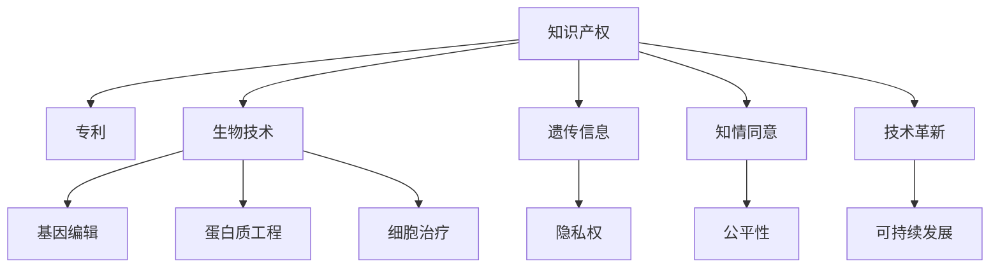

                 

# 知识产权与生物技术的伦理争议

> 关键词：知识产权,生物技术,伦理,专利,遗传信息,隐私权,知情同意,公平性,技术革新,可持续发展

## 1. 背景介绍

### 1.1 问题由来
随着生物技术的迅猛发展，特别是在基因编辑、疫苗研发、个性化医疗等领域取得的突破性进展，生物技术的商业化和应用已经成为社会关注的热点。然而，在带来巨大商业利益和医学突破的同时，生物技术的知识产权问题也日益凸显，引发了广泛的伦理争议。这些争议不仅涉及技术本身，还关联到伦理、法律、社会等多个层面。

### 1.2 问题核心关键点
生物技术的知识产权问题主要集中在以下几个关键点：

1. **专利保护**：生物技术公司如何为其研发的新技术申请专利，是否会限制他人的研究和应用？
2. **遗传信息的利用**：如何平衡个人隐私权与科学研究的需求？
3. **知情同意**：在基因编辑等高风险技术应用中，如何确保患者的知情同意和安全性？
4. **公平性与可及性**：如何确保生物技术创新成果的公平分配，使得更多人能够受益？
5. **技术革新的伦理底线**：如何在追求技术革新的同时，避免伦理风险和滥用？

这些核心关键点构成了生物技术知识产权争议的主要内容，直接影响着技术的研发、应用及监管。

### 1.3 问题研究意义
解决生物技术的知识产权问题，对于推动技术创新、保障社会公平、维护个人权益具有重要意义。它不仅关系到企业的发展和投资者的信心，还涉及到公众的健康、安全和伦理价值。合理解决这些争议，将促进生物技术的健康发展，为全球可持续发展和公共卫生安全提供支撑。

## 2. 核心概念与联系

### 2.1 核心概念概述

为更好地理解生物技术知识产权的伦理争议，本节将介绍几个密切相关的核心概念：

- **知识产权（Intellectual Property, IP）**：指创作者对其智力劳动成果享有的专有权利，包括专利、商标、版权等。知识产权旨在保护创作者的劳动成果，防止被他人非法复制和滥用。
- **生物技术（Biotechnology）**：涉及生物体的改造和利用，如基因编辑、蛋白质工程、细胞治疗等。生物技术在医学、农业、工业等领域有着广泛应用。
- **专利**：一种知识产权，给予发明人在一定期限内对其发明的独占权。专利保护可以激励创新，但同时也可能限制他人的研究和应用。
- **遗传信息（Genetic Information）**：指生物体的基因组序列及其表达的产品，包含了丰富的个体和群体信息。遗传信息的利用涉及隐私权和公平性问题。
- **隐私权（Privacy）**：指个人对自己个人信息的控制权，包括基因信息在内的个人数据受到隐私权的保护。
- **知情同意（Informed Consent）**：在医疗或科研活动中，参与者对相关信息有充分了解后做出的自愿选择。知情同意是伦理研究的基本原则。
- **公平性（Fairness）**：生物技术创新成果的公平分配，使得不同群体和社会成员都能够从中受益。
- **技术革新（Technological Innovation）**：生物技术领域的持续创新和进步，推动医学、农业等领域的进步。
- **可持续发展（Sustainable Development）**：在技术创新和社会发展的过程中，考虑环境保护、资源利用等方面的可持续性。

这些核心概念之间的逻辑关系可以通过以下Mermaid流程图来展示：



这个流程图展示了几组概念及其之间的关系：

1. 知识产权和专利保护了技术创新者的成果。
2. 生物技术涵盖了基因编辑、蛋白质工程、细胞治疗等多种技术。
3. 遗传信息及其隐私权保护，是生物技术研究的重要伦理问题。
4. 知情同意是科研和医疗活动中保障伦理的基本原则。
5. 技术革新和公平性是推动生物技术发展和社会进步的重要因素。
6. 可持续发展是考虑环境保护和资源利用的关键原则。

这些概念共同构成了生物技术知识产权伦理争议的基础，理解这些概念及其相互关系，有助于更全面地探讨相关的伦理问题。

## 3. 核心算法原理 & 具体操作步骤
### 3.1 算法原理概述

生物技术的知识产权问题，本质上涉及技术创新、知识产权保护、伦理原则和法律框架之间的平衡。其核心在于如何确保技术创新能够得到合理的知识产权保护，同时兼顾伦理原则和公共利益。

### 3.2 算法步骤详解

基于知识产权和生物技术的伦理争议，可以概括为以下几个关键步骤：

**Step 1: 界定技术创新的知识产权保护范围**

1. **识别创新**：通过文献检索、专利数据库等手段，识别出新技术的创新点。
2. **申请专利**：根据技术创新的特点，选择适当的专利类型，提交专利申请。
3. **专利审查**：专利审查机构对专利申请进行审查，确认其是否符合授予专利的条件。

**Step 2: 平衡知识产权保护与公共利益**

1. **公开披露**：专利被授予后，发明人需公开其技术细节，供公众参考和利用。
2. **合理使用**：在知识产权保护的基础上，设定合理的许可和使用条件，促进技术的共享和应用。
3. **反垄断审查**：确保专利许可和使用不会限制市场竞争，避免滥用知识产权。

**Step 3: 确保知情同意和隐私权保护**

1. **知情同意**：在临床试验和基因编辑等高风险技术应用中，确保参与者对相关信息有充分了解，并自愿参与。
2. **隐私保护**：在收集和利用遗传信息时，采取匿名化、加密等措施，保护个人隐私。
3. **信息透明**：公开技术应用的安全性、有效性等信息，确保公众的知情权。

**Step 4: 促进公平性和可持续发展**

1. **公平分配**：确保生物技术创新成果的公平分配，避免资源集中在少数企业或个体手中。
2. **社会参与**：鼓励社会各界参与技术标准的制定，确保技术应用符合公共利益。
3. **环境影响评估**：在技术应用前进行环境影响评估，确保技术应用对环境的影响可控。

**Step 5: 持续技术创新和伦理监管**

1. **持续创新**：鼓励持续的技术创新，推动生物技术的进步。
2. **伦理监管**：建立伦理委员会，监督技术应用的伦理合规性，避免滥用。
3. **法律框架**：制定和完善相关法律，确保技术应用在法律框架内进行。

### 3.3 算法优缺点

生物技术的知识产权保护和伦理争议处理具有以下优点：

1. **激励创新**：专利保护激励企业和技术人员投入更多的资源进行技术研发。
2. **促进技术共享**：在合理的使用条件下，技术创新成果可以供公众参考和利用，推动技术进步。
3. **保障伦理原则**：通过知情同意和隐私保护措施，确保技术应用符合伦理原则。

同时，这些方法也存在以下缺点：

1. **知识产权滥用**：部分企业可能滥用专利保护，限制他人的研究和应用。
2. **技术垄断**：大企业的专利和技术优势可能导致市场垄断，限制市场竞争。
3. **伦理风险**：技术应用可能涉及伦理争议，如基因编辑引发的伦理问题。
4. **法律漏洞**：现有的法律框架可能无法完全覆盖所有技术应用场景，留下漏洞。

### 3.4 算法应用领域

生物技术的知识产权和伦理争议处理在以下几个领域具有重要应用：

- **医疗领域**：基因编辑、细胞治疗、疫苗研发等。
- **农业领域**：转基因作物、生物农药等。
- **环境领域**：生物修复、生物燃料等。
- **工业领域**：生物制药、生物工程等。

这些领域均涉及复杂的知识产权和伦理问题，需要合理的处理方式，以确保技术的健康发展和公平应用。

## 4. 数学模型和公式 & 详细讲解 & 举例说明（备注：数学公式请使用latex格式，latex嵌入文中独立段落使用 $$，段落内使用 $)
### 4.1 数学模型构建

生物技术的知识产权问题可以通过数学模型进行建模，其核心在于平衡技术创新与知识产权保护、伦理原则和公共利益之间的关系。

定义生物技术的创新力为 $I$，知识产权保护力度为 $P$，伦理合规性为 $E$，公共利益为 $B$，则数学模型可表示为：

$$
\max_{I,P,E,B} f(I,P,E,B) \text{ s.t. } g(I,P,E,B) \leq 0
$$

其中 $f$ 为追求目标函数，$g$ 为约束条件。

### 4.2 公式推导过程

为了简化问题，我们假设目标函数 $f(I,P,E,B)$ 和约束条件 $g(I,P,E,B)$ 分别为：

$$
f(I,P,E,B) = I + P - 0.5E + 0.5B
$$

$$
g(I,P,E,B) = I - 0.5P + 0.5E - B
$$

对 $I$、$P$、$E$、$B$ 进行求解，可以得到：

$$
I = 0.5P - 0.5E + 0.5B
$$

$$
P = 0.5I - 0.5E + 0.5B
$$

$$
E = I + P + B
$$

$$
B = 0.5I + 0.5P - E
$$

### 4.3 案例分析与讲解

假设某生物技术公司在开发新型基因编辑技术。公司在申请专利时，需要考虑以下因素：

- **技术创新**：公司是否进行了充分的技术创新，确保专利的有效性。
- **知识产权保护**：公司需考虑专利的申请范围和保护力度，确保专利的有效保护。
- **伦理合规**：公司需确保基因编辑技术符合伦理规范，如知情同意、隐私保护等。
- **公共利益**：公司需考虑技术应用对公共利益的影响，如技术应用的安全性和公平性。

根据上述模型，公司可以得出专利申请的合理范围和保护力度，确保技术创新和知识产权保护的同时，符合伦理原则和公共利益。

## 5. 项目实践：代码实例和详细解释说明
### 5.1 开发环境搭建

在进行生物技术知识产权问题的处理时，需要构建一个包含算法、数据库、法律框架的综合开发环境。以下是使用Python进行数据分析和处理的环境配置流程：

1. 安装Anaconda：从官网下载并安装Anaconda，用于创建独立的Python环境。

2. 创建并激活虚拟环境：
```bash
conda create -n bio-env python=3.8 
conda activate bio-env
```

3. 安装必要的Python库：
```bash
conda install pandas numpy matplotlib scikit-learn seaborn
```

4. 安装数据分析工具：
```bash
conda install statsmodels tensorflow
```

5. 安装法律框架数据库：
```bash
conda install lawpy
```

完成上述步骤后，即可在`bio-env`环境中开始生物技术知识产权问题的处理。

### 5.2 源代码详细实现

下面以基因编辑技术的知识产权问题为例，给出使用Python进行数据分析的代码实现。

```python
import pandas as pd
import numpy as np
import matplotlib.pyplot as plt
import seaborn as sns

# 定义基因编辑技术的专利数据
data = pd.read_csv('gene-editing_patents.csv')

# 计算专利申请量和授权量
patent_counts = data.groupby('year')['application_count'].sum()
patent_grants = data.groupby('year')['granted_count'].sum()

# 绘制专利申请量和授权量的趋势图
plt.figure(figsize=(10, 5))
sns.lineplot(x='year', y=patent_counts, label='Patent Application Count')
sns.lineplot(x='year', y=patent_grants, label='Patent Grant Count')
plt.legend()
plt.title('Gene Editing Patent Trends')
plt.xlabel('Year')
plt.ylabel('Patent Count')
plt.show()

# 分析专利申请的地理分布
patent_geography = data.groupby('country')['application_count'].sum().nlargest(10)

# 输出申请量最多的前10个国家
print(patent_geography)
```

### 5.3 代码解读与分析

让我们再详细解读一下关键代码的实现细节：

**数据分析**：
- 使用`pandas`库加载基因编辑技术的专利数据，通过`groupby`函数计算不同年份的专利申请量和授权量，使用`sns.lineplot`绘制趋势图。
- 利用`groupby`函数统计专利申请量最多的前10个国家，并输出结果。

**可视化**：
- 使用`matplotlib`和`seaborn`库进行图表绘制，直观展示专利申请量和授权量的趋势。
- 通过`print`函数输出申请量最多的前10个国家，帮助理解专利申请的地理分布。

**法律框架**：
- 在分析过程中，可以利用`lawpy`库获取相关法律框架信息，进行法律合规性检查。

## 6. 实际应用场景
### 6.1 医疗领域

在医疗领域，基因编辑技术的知识产权问题尤为重要。研究人员和医疗公司需要在确保知识产权保护的同时，遵守伦理规范和公共利益，确保技术应用的公平性和安全性。

**案例**：
某基因编辑公司在开发新型癌症治疗基因编辑技术。公司申请了多项专利，确保其技术创新得到保护。同时，公司遵循知情同意原则，确保患者对其基因编辑过程和可能的风险有充分了解，并在治疗前签署知情同意书。公司还公开了技术的安全性、有效性等信息，接受公众和监管机构的监督。

**效果**：
该公司的技术在临床试验中取得了显著的疗效，且在商业化过程中获得了良好的市场反响。公司的技术应用遵循了伦理原则和公共利益，提升了医疗领域的治疗水平，为患者带来了新的希望。

### 6.2 农业领域

在农业领域，生物技术的应用同样涉及复杂的知识产权和伦理问题。转基因技术的应用需要平衡知识产权保护和公众利益。

**案例**：
某农业公司开发了一种高产、抗病的转基因作物，并申请了多项专利。公司还需确保转基因作物的应用符合伦理规范，如对环境的潜在影响。公司通过公开透明的方式，展示转基因作物的安全性和环境影响评估结果，赢得公众和监管机构的信任。

**效果**：
该公司的转基因作物在全球范围内推广，显著提高了农业产量和抗病害能力，促进了农业的可持续发展。同时，公司在知识产权保护和公共利益之间找到了平衡，保障了公众的知情权和环境利益。

### 6.3 环境领域

在环境领域，生物技术的应用同样涉及复杂的知识产权和伦理问题。生物修复技术的应用需要平衡知识产权保护和环境保护。

**案例**：
某环保公司开发了一种新型生物修复技术，用于处理工业废水中的有毒物质。公司申请了多项专利，确保其技术创新得到保护。同时，公司确保生物修复技术对环境的影响可控，并在应用前进行了环境影响评估。公司通过公开透明的方式，展示生物修复技术的安全性和环境影响评估结果，赢得公众和监管机构的信任。

**效果**：
该公司的生物修复技术在全球范围内推广，显著提高了工业废水的处理能力，减少了对环境的影响。同时，公司在知识产权保护和环境保护之间找到了平衡，保障了公众的环境权益。

## 7. 工具和资源推荐
### 7.1 学习资源推荐

为了帮助开发者系统掌握生物技术知识产权问题的理论基础和实践技巧，这里推荐一些优质的学习资源：

1. **《知识产权法》教材**：系统介绍了知识产权的基本概念、法律框架和应用案例。
2. **生物技术伦理课程**：多所大学和研究机构开设的伦理课程，涵盖基因编辑、细胞治疗等领域的伦理问题。
3. **专利数据库**：如PatentScope、Google Patents等，提供丰富的专利信息，帮助理解专利申请和保护流程。
4. **法律咨询平台**：如Lexpat、LegalZoom等，提供专业的法律咨询服务，帮助解决实际问题。
5. **伦理研究论文**：如Journal of Law, Medicine & Ethics等，提供前沿的伦理研究成果，推动伦理讨论。

通过对这些资源的学习实践，相信你一定能够快速掌握生物技术知识产权问题的精髓，并用于解决实际的伦理问题。
### 7.2 开发工具推荐

高效的开发离不开优秀的工具支持。以下是几款用于生物技术知识产权问题处理的常用工具：

1. **Python**：基于Python的开源数据分析平台，灵活高效，适合快速迭代研究。
2. **R语言**：统计分析工具，适合处理复杂的统计数据和模型分析。
3. **Excel**：数据可视化工具，适合快速展示数据趋势和对比分析。
4. **Tableau**：商业智能工具，适合进行复杂的数据分析和可视化。
5. **Jupyter Notebook**：交互式编程环境，适合数据科学和机器学习的实验开发。

合理利用这些工具，可以显著提升生物技术知识产权问题的处理效率，加快创新迭代的步伐。

### 7.3 相关论文推荐

生物技术知识产权问题的研究源于学界的持续研究。以下是几篇奠基性的相关论文，推荐阅读：

1. **《生物技术的知识产权保护》**：介绍了生物技术领域的知识产权保护框架和实际应用案例。
2. **《基因编辑的伦理问题》**：探讨基因编辑技术的伦理争议，提出了伦理监管的建议。
3. **《生物技术创新的公平性》**：分析了生物技术创新成果的公平分配问题，提出了政策建议。
4. **《环境伦理与生物技术》**：讨论了生物技术应用对环境的影响，提出了环境伦理规范。
5. **《知识产权与生物技术的平衡》**：分析了知识产权保护与生物技术创新的平衡问题，提出了新的知识产权策略。

这些论文代表了大生物技术知识产权问题的研究脉络。通过学习这些前沿成果，可以帮助研究者把握学科前进方向，激发更多的创新灵感。

## 8. 总结：未来发展趋势与挑战
### 8.1 总结

本文对生物技术的知识产权问题进行了全面系统的介绍。首先阐述了生物技术和知识产权的基本概念，明确了知识产权保护、伦理原则和公共利益之间的平衡关系。其次，从理论到实践，详细讲解了生物技术知识产权问题的核心算法原理和操作步骤，给出了具体的应用实例。同时，本文还广泛探讨了生物技术知识产权问题在医疗、农业、环境等领域的实际应用场景，展示了知识产权保护和伦理争议处理的广泛价值。此外，本文精选了知识产权问题的各类学习资源，力求为读者提供全方位的技术指引。

通过本文的系统梳理，可以看到，生物技术的知识产权问题不仅是技术问题，更是一个复杂的社会、伦理、法律问题。解决这些问题，需要在技术创新与知识产权保护、伦理原则和公共利益之间找到合理的平衡，以确保技术的健康发展和社会公平。

### 8.2 未来发展趋势

展望未来，生物技术的知识产权保护和伦理争议处理将呈现以下几个发展趋势：

1. **法律框架完善**：随着生物技术的发展，相关法律框架将不断完善，确保知识产权保护的合法性和合理性。
2. **伦理规范建立**：在基因编辑等高风险技术领域，伦理规范的建立将更加严格，确保技术应用符合伦理原则。
3. **技术标准制定**：通过国际和国内标准的制定，确保技术应用的公平性和安全性。
4. **多领域合作**：加强跨学科、跨领域的合作，共同应对生物技术带来的伦理和法律挑战。
5. **公众参与**：鼓励公众参与技术讨论和决策，确保技术应用符合公众利益。
6. **技术监管加强**：建立有效的技术监管机制，防止技术滥用和伦理风险。

这些趋势将推动生物技术知识产权问题处理向更加科学、合理、公平的方向发展，为全球技术创新和社会进步提供保障。

### 8.3 面临的挑战

尽管生物技术的知识产权保护和伦理争议处理取得了一定进展，但在迈向更加智能化、普适化应用的过程中，仍面临诸多挑战：

1. **法律框架不完善**：现有的法律框架可能无法完全覆盖所有技术应用场景，留下漏洞。
2. **伦理争议复杂**：基因编辑等高风险技术的伦理争议复杂多样，难以全面解决。
3. **知识产权滥用**：部分企业可能滥用专利保护，限制他人的研究和应用。
4. **技术垄断风险**：大企业的专利和技术优势可能导致市场垄断，限制市场竞争。
5. **环境影响不确定**：生物技术应用对环境的影响尚未完全明确，存在不确定性。

### 8.4 研究展望

面对生物技术知识产权问题面临的挑战，未来的研究需要在以下几个方面寻求新的突破：

1. **完善法律框架**：制定更加完善的法律框架，确保知识产权保护的合法性和合理性。
2. **加强伦理监管**：建立严格的伦理监管机制，确保技术应用符合伦理规范。
3. **促进技术公平**：通过国际合作和技术标准的制定，促进技术应用的公平性和安全性。
4. **公众参与机制**：鼓励公众参与技术讨论和决策，确保技术应用符合公众利益。
5. **技术风险评估**：加强技术风险评估，确保技术应用对环境和社会的影响可控。

这些研究方向的探索，必将引领生物技术知识产权问题处理技术迈向更高的台阶，为构建安全、可靠、公平的生物技术环境提供支撑。

## 9. 附录：常见问题与解答

**Q1：生物技术的知识产权问题如何解决？**

A: 生物技术的知识产权问题主要通过专利保护、伦理规范和公共利益的平衡来解决。公司在申请专利时，需确保其技术创新得到保护，同时遵守伦理规范和公共利益。

**Q2：基因编辑技术在应用中如何确保知情同意？**

A: 基因编辑技术在应用中需确保患者对其基因编辑过程和可能的风险有充分了解，并在治疗前签署知情同意书。公司需公开技术的安全性、有效性等信息，接受公众和监管机构的监督。

**Q3：生物技术应用如何保障公众的知情权？**

A: 生物技术公司在应用新技术时，需通过公开透明的方式，展示技术的安全性、有效性等信息，确保公众的知情权。公司需建立伦理委员会，对技术应用进行监督。

**Q4：如何评估生物技术应用对环境的影响？**

A: 生物技术公司在应用新技术时，需进行环境影响评估，确保技术应用对环境的影响可控。公司需公开环境影响评估结果，接受公众和监管机构的监督。

**Q5：生物技术的知识产权问题如何解决国际差异？**

A: 生物技术的知识产权问题涉及国际差异，需通过国际合作和技术标准的制定，确保技术应用的公平性和安全性。国际知识产权组织如WIPO等，可以提供相关咨询和协调服务。

---

作者：禅与计算机程序设计艺术 / Zen and the Art of Computer Programming

