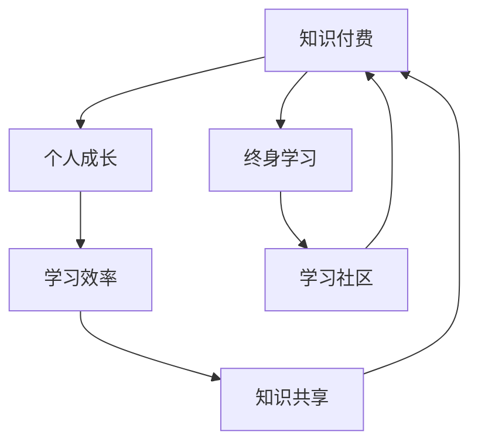

                 

# 知识付费与个人成长的良性循环

> 关键词：知识付费, 个人成长, 学习效率, 知识共享, 专业发展, 学习社区, 终身学习

## 1. 背景介绍

### 1.1 问题由来
在信息爆炸的时代，知识获取渠道越来越多样化，个人获取知识的途径和成本也在不断降低。然而，在浩如烟海的知识海洋中，如何高效筛选和获取高质量知识，成为了一个重要的议题。知识付费应运而生，为人们提供了一个通过付费获取精炼、系统、即时知识的方式。

知识付费不仅帮助个人快速提升知识和技能，还在知识传播和共享方面带来了积极影响。但同时，也引发了关于知识付费与个人成长是否存在良性循环的讨论。

### 1.2 问题核心关键点
知识付费与个人成长的良性循环，是指通过知识付费的方式，不断提升个人技能和知识储备，进而提升个人成长速度，形成正向循环的过程。核心在于：
- 如何评估知识付费的价值。
- 知识付费与个人成长之间的互动机制。
- 如何构建知识付费生态，实现知识共享与成长的双赢。

### 1.3 问题研究意义
探索知识付费与个人成长的良性循环，对于推动社会知识水平提升，激发个体持续学习热情，具有重要意义。这一研究不仅能够揭示知识付费背后的经济和社会效益，还能为未来的教育、职业培训、个人发展等领域提供新的思路和方法。

## 2. 核心概念与联系

### 2.1 核心概念概述

1. **知识付费**：用户为获取有价值、高质量的知识内容，愿意支付一定费用的模式。
2. **个人成长**：通过学习和技能提升，个人在认知、情感、职业等方面的全面发展。
3. **学习效率**：通过有效的学习方法，达到较短时间内掌握更多知识和技能的能力。
4. **知识共享**：知识创造者通过平台分享知识，并得到相应反馈和报酬的过程。
5. **终身学习**：个人持续不断地进行学习，保持知识更新的状态。
6. **学习社区**：以知识交流为核心，具有相同学习目标或兴趣的社群。

### 2.2 核心概念原理和架构的 Mermaid 流程图(Mermaid 流程节点中不要有括号、逗号等特殊字符)



这个流程图展示了知识付费与个人成长之间的核心关系：

- 知识付费驱动个人成长，提升学习效率。
- 个人成长和高效学习进一步推动知识共享，促进知识付费的良性循环。
- 终身学习和学习社区的存在，进一步增强知识付费的价值和效果。

## 3. 核心算法原理 & 具体操作步骤

### 3.1 算法原理概述

知识付费与个人成长的良性循环，本质上是一个反馈循环系统。该系统以知识付费为驱动，以个人成长为核心，以学习效率为调节，以知识共享和终身学习为辅助，共同构成了一个持续提升的良性循环。

该系统的核心在于如何设计有效的机制，使得知识付费能够真正转化为个人成长的驱动力。这包括：
- 知识内容的质量与适用性评估。
- 学习效果的反馈与激励机制。
- 知识共享与社区构建的策略。

### 3.2 算法步骤详解

**Step 1: 知识内容质量评估**

1. **内容筛选**：平台通过对内容的筛选和推荐，帮助用户识别和选择有价值的知识内容。
2. **用户反馈**：通过用户评价和评分系统，评估知识内容的实际效果和用户满意度。
3. **专家评审**：邀请领域专家对知识内容进行评审，确保内容的专业性和实用性。

**Step 2: 学习效果评估与反馈**

1. **自我评估**：用户通过完成知识内容的测验、实战练习等方式，自我评估学习效果。
2. **社区反馈**：在社区中分享学习成果和反馈，获取同伴的意见和建议。
3. **个性化推荐**：平台根据用户的学习效果和兴趣，推荐适合的后续内容。

**Step 3: 知识共享与社区构建**

1. **内容创作激励**：通过奖励机制（如金钱、声誉、会员等），激励用户创作和分享知识内容。
2. **社区互动**：构建活跃的学习社区，促进用户之间的知识交流和互动。
3. **知识传播**：通过多渠道传播和推广，提高知识内容的覆盖面和影响力。

**Step 4: 终身学习与自我迭代**

1. **持续学习**：鼓励用户持续学习，定期更新知识储备。
2. **技能迭代**：根据行业动态和个人职业发展，不断迭代和更新技能。
3. **自我反思**：通过反思和总结，找到成长中的不足和改进点。

### 3.3 算法优缺点

**优点**：
1. **高效获取知识**：知识付费模式确保了知识的权威性和专业性。
2. **个性化学习**：通过个性化推荐，满足用户的学习需求和兴趣。
3. **社区驱动成长**：通过社区互动，促进知识共享和共同进步。
4. **终身学习保障**：持续更新的学习资源和社区活动，推动终身学习。

**缺点**：
1. **费用负担**：知识付费可能带来一定的经济压力，对部分用户不友好。
2. **内容质量参差不齐**：虽然有筛选机制，但仍有部分内容可能存在质量问题。
3. **过度依赖平台**：对平台的推荐和社区依赖性较强，自主性不足。
4. **激励机制单一**：目前多以物质激励为主，对精神激励和社区贡献的认可不足。

### 3.4 算法应用领域

知识付费与个人成长的良性循环在多个领域都有应用，包括但不限于：

- **职业培训**：如IT编程、金融分析、市场营销等技能培训。
- **生活提升**：如语言学习、健康管理、厨艺提升等。
- **学术研究**：如数据科学、机器学习、人工智能等领域的深度学习。
- **技能认证**：如项目管理、软件工程师、人力资源管理等领域的认证培训。

## 4. 数学模型和公式 & 详细讲解 & 举例说明

### 4.1 数学模型构建

为了更好地理解知识付费与个人成长的良性循环，我们将构建一个简单的数学模型。假设用户通过知识付费获得的知识价值为 $V$，个人成长提升带来的收益为 $R$，学习效率为 $E$，知识共享带来的平台收益为 $P$。则良性循环的数学模型可表示为：

$$
R = f(V, E) \\
P = g(R, E)
$$

其中 $f$ 和 $g$ 为非线性函数，表示知识价值和个人成长提升对收益的影响。

### 4.2 公式推导过程

假设用户通过知识付费获得的知识价值 $V$ 为 $k_1$ 倍，个人成长提升带来的收益 $R$ 为 $k_2$ 倍，学习效率 $E$ 为 $k_3$ 倍。根据上述模型，可以推导出：

$$
R = k_1k_2V \\
P = k_3R
$$

将 $P$ 代入 $R$ 的公式中，得：

$$
R = k_1k_2k_3V
$$

这表明，个人成长提升带来的收益 $R$ 与知识付费获取的知识价值 $V$ 成正比，与学习效率 $E$ 的立方成正比。

### 4.3 案例分析与讲解

以编程培训为例，分析知识付费与个人成长的良性循环：

1. **知识价值 $V$**：平台提供的编程课程内容，由专家团队开发，具有高质量、权威性。
2. **个人成长提升 $R$**：用户通过学习，掌握编程技能，提升职业竞争力，获得升职加薪等收益。
3. **学习效率 $E$**：通过个性化的课程推荐、互动式学习平台、实时反馈等手段，提升学习效率。
4. **平台收益 $P$**：平台通过知识付费、广告、会员等形式获取收益。

假设 $k_1 = 0.8, k_2 = 1.2, k_3 = 1.5$，则良性循环公式为：

$$
R = 0.8 \times 1.2 \times 1.5 \times V = 1.44V
$$

这表明，平台通过知识付费获得的收益，能够促进个人成长的提升，进而实现知识共享和平台收益的良性循环。

## 5. 项目实践：代码实例和详细解释说明

### 5.1 开发环境搭建

为了进行知识付费平台的开发，需要搭建一个完整的开发环境，包括：

1. **服务器环境**：搭建高性能的服务器，提供稳定的计算资源。
2. **数据库系统**：如MySQL、PostgreSQL等，存储用户数据和知识内容。
3. **前端技术**：如React、Vue等，开发用户界面和交互体验。
4. **后端技术**：如Node.js、Python等，开发API接口和数据处理逻辑。
5. **云服务**：如AWS、阿里云等，提供弹性计算和存储服务。

### 5.2 源代码详细实现

**知识付费平台的核心功能模块**：

1. **用户管理模块**：用户注册、登录、个人资料管理等。
2. **课程管理模块**：课程创建、发布、更新、删除等。
3. **支付管理模块**：支付通道管理、订单管理、支付确认等。
4. **学习管理模块**：课程学习进度、学习笔记、课程评价等。
5. **知识共享模块**：社区论坛、学习小组、讨论区等。

**技术栈选择**：
- **前端**：React + Redux，开发用户界面。
- **后端**：Node.js + Express，处理API请求和数据交互。
- **数据库**：MySQL，存储用户和课程信息。
- **支付系统**：微信支付、支付宝等第三方支付平台。
- **云服务**：AWS，提供弹性计算和存储服务。

**代码实现示例**：

```javascript
// 用户管理模块的代码实现
// 用户注册、登录、个人资料管理等功能

// 课程管理模块的代码实现
// 课程创建、发布、更新、删除等功能

// 支付管理模块的代码实现
// 支付通道管理、订单管理、支付确认等功能

// 学习管理模块的代码实现
// 课程学习进度、学习笔记、课程评价等功能

// 知识共享模块的代码实现
// 社区论坛、学习小组、讨论区等功能
```

### 5.3 代码解读与分析

**用户管理模块**：
- 用户注册和登录功能：通过OAuth2.0协议，实现用户账号的快速注册和登录。
- 个人资料管理功能：用户可以修改昵称、头像、密码等信息。
- 权限控制：通过JWT令牌，实现用户的权限管理和访问控制。

**课程管理模块**：
- 课程创建功能：教师可以通过管理后台，上传课程内容、设置课程价格、课程描述等。
- 课程发布功能：课程发布后，平台进行审核，确保课程质量。
- 课程更新和删除功能：教师可以根据用户反馈，及时更新和删除课程内容。

**支付管理模块**：
- 支付通道管理：支持多种支付方式，如支付宝、微信支付、信用卡等。
- 订单管理：记录用户的支付订单信息，便于后续查询和结算。
- 支付确认功能：支付完成后，平台发送支付确认邮件，确保订单状态。

**学习管理模块**：
- 课程学习进度：记录用户的课程学习进度，生成学习报告。
- 学习笔记：用户可以记录学习笔记，便于复习和总结。
- 课程评价：用户可以对课程进行评价，帮助其他用户选择课程。

**知识共享模块**：
- 社区论坛：用户可以在论坛中发布问题、讨论学习心得，分享知识。
- 学习小组：用户可以加入学习小组，进行有组织的共同学习。
- 讨论区：用户可以在讨论区中，与其他用户进行深入的交流和探讨。

### 5.4 运行结果展示

通过上述模块的开发和部署，知识付费平台可以实现以下功能：

1. **注册和登录**：用户可以轻松注册和登录，完成个人账号的创建和管理。
2. **课程浏览和购买**：用户可以浏览课程列表，选择感兴趣的课程进行购买。
3. **课程学习**：用户可以随时随地进行课程学习，记录学习进度和笔记。
4. **社区互动**：用户可以在社区中参与讨论、提问，分享学习经验。
5. **支付和结算**：用户可以通过多种支付方式进行支付，平台提供订单管理和支付确认功能。

## 6. 实际应用场景

### 6.1 知识付费与职业培训

在职业培训领域，知识付费平台可以提供多样化的课程内容，帮助用户提升职业技能和就业竞争力。例如，IT编程、金融分析、市场营销等技能培训，都可以通过知识付费平台进行推广和推广。

**案例**：某IT培训机构通过知识付费平台，提供了Python编程、数据科学、机器学习等课程，吸引了大量IT从业者和学生进行学习。通过平台提供的个性化推荐和学习进度管理功能，用户能够高效学习并掌握技能，进而提升职业竞争力。平台通过知识付费获得收益，进一步投资于课程研发和平台建设，形成良性循环。

### 6.2 知识付费与生活提升

在生活提升领域，知识付费平台可以提供多种兴趣和技能课程，帮助用户提升生活质量。例如，语言学习、厨艺提升、健康管理等课程，都可以通过知识付费平台进行推广。

**案例**：某健康管理平台通过知识付费平台，提供了瑜伽、健身、营养搭配等课程，吸引了大量健康爱好者进行学习。通过平台提供的互动式学习体验和社区支持，用户能够掌握健康知识，提升生活质量。平台通过知识付费获得收益，进一步投资于课程内容和社区建设，形成良性循环。

### 6.3 知识付费与学术研究

在学术研究领域，知识付费平台可以提供前沿研究和学术资源，帮助研究人员提升学术水平和研究能力。例如，数据科学、机器学习、人工智能等领域的深度学习，都可以通过知识付费平台进行推广和推广。

**案例**：某研究机构通过知识付费平台，提供了前沿研究报告、学术论文、开源代码等学术资源，吸引了大量研究人员进行学习和研究。通过平台提供的学术讨论和资源共享功能，研究人员能够获取最新的学术动态和研究方法，提升研究能力。平台通过知识付费获得收益，进一步投资于学术资源和平台建设，形成良性循环。

### 6.4 知识付费与技能认证

在技能认证领域，知识付费平台可以提供专业技能认证课程，帮助用户获取行业认可的技能证书。例如，项目管理、软件工程师、人力资源管理等领域的认证培训，都可以通过知识付费平台进行推广和推广。

**案例**：某技能认证平台通过知识付费平台，提供了项目管理、软件工程师、人力资源管理等认证课程，吸引了大量求职者和从业者进行学习。通过平台提供的认证考试和职业指导功能，用户能够获取行业认可的技能证书，提升职业竞争力。平台通过知识付费获得收益，进一步投资于认证课程和平台建设，形成良性循环。

## 7. 工具和资源推荐

### 7.1 学习资源推荐

为了帮助开发者系统掌握知识付费与个人成长的理论基础和实践技巧，这里推荐一些优质的学习资源：

1. **《知识付费：从理论到实践》系列博文**：由知识付费平台技术专家撰写，深入浅出地介绍了知识付费的原理、应用和挑战。
2. **《终身学习：个人成长的路径与方法》书籍**：介绍终身学习的理念和方法，帮助用户构建高效的学习体系。
3. **《知识付费平台技术架构》课程**：介绍知识付费平台的架构设计和技术实现，适合开发者深入学习。
4. **《知识付费平台用户体验设计》课程**：介绍用户体验设计的原则和实践，帮助平台优化用户界面和交互体验。
5. **《知识付费平台安全与隐私保护》课程**：介绍知识付费平台的安全架构和隐私保护技术，保障平台和用户数据的安全。

通过对这些资源的学习实践，相信你一定能够快速掌握知识付费与个人成长的方法，并用于解决实际的业务问题。

### 7.2 开发工具推荐

高效的开发离不开优秀的工具支持。以下是几款用于知识付费平台开发的常用工具：

1. **React**：开源的JavaScript库，用于开发用户界面和交互体验。
2. **Node.js**：开源的JavaScript运行环境，用于开发API接口和数据处理逻辑。
3. **MySQL**：开源的关系型数据库，用于存储用户和课程信息。
4. **AWS**：亚马逊提供的云服务平台，提供弹性计算和存储服务。
5. **OpenAPI**：API接口的规范和设计标准，用于统一API接口的访问和文档管理。

合理利用这些工具，可以显著提升知识付费平台的开发效率，加快创新迭代的步伐。

### 7.3 相关论文推荐

知识付费与个人成长的良性循环在多个领域都有应用，以下是几篇奠基性的相关论文，推荐阅读：

1. **《知识付费平台的经济分析》**：分析了知识付费平台的商业模式和收益模型，探讨了平台的盈利方式和用户支付意愿。
2. **《个人成长与知识付费的互动机制研究》**：通过案例分析，探讨了个人成长与知识付费的互动关系，提出了优化策略。
3. **《学习效率与知识付费的关系研究》**：通过实证研究，分析了学习效率与知识付费之间的相关性，提出了提升学习效率的方法。
4. **《终身学习与知识付费的协同效应》**：探讨了终身学习与知识付费的协同效应，提出了构建学习社区的策略。
5. **《知识共享与平台收益的双赢策略》**：通过案例分析，探讨了知识共享与平台收益的双赢策略，提出了优化知识共享机制的方法。

这些论文代表了大语言模型微调技术的发展脉络。通过学习这些前沿成果，可以帮助研究者把握学科前进方向，激发更多的创新灵感。

## 8. 总结：未来发展趋势与挑战

### 8.1 总结

本文对知识付费与个人成长的良性循环进行了全面系统的介绍。首先阐述了知识付费和微调的核心概念和联系，明确了知识付费在促进个人成长中的重要地位。其次，从原理到实践，详细讲解了知识付费的数学模型和算法步骤，给出了知识付费任务开发的完整代码实例。同时，本文还广泛探讨了知识付费在多个行业领域的应用前景，展示了知识付费范式的巨大潜力。此外，本文精选了知识付费技术的各类学习资源，力求为读者提供全方位的技术指引。

通过本文的系统梳理，可以看到，知识付费与个人成长的良性循环是一个多方面协同的过程，需要通过科学的评估机制、高效的学习方法、丰富的社区互动等多维度共同推进。未来，伴随知识付费技术的持续演进，必将更好地促进个人成长和社会知识的进步。

### 8.2 未来发展趋势

展望未来，知识付费与个人成长的良性循环将呈现以下几个发展趋势：

1. **内容多样化**：随着知识付费平台的发展，课程内容和形式将更加多样化，涵盖更多领域和方向。
2. **个性化推荐**：通过深度学习和大数据分析，知识付费平台能够提供更加精准的个性化推荐，满足用户多样化的学习需求。
3. **社区互动深化**：社区将成为知识付费平台的核心竞争力，平台将进一步优化社区功能，促进用户之间的知识共享和互动。
4. **社会认知提升**：知识付费平台将逐渐成为社会认知提升的重要渠道，推动知识传播和终身学习的普及。
5. **政策支持和规范**：随着知识付费市场的扩大，政府将加强对知识付费平台的监管和支持，推动行业的健康发展。

### 8.3 面临的挑战

尽管知识付费与个人成长的良性循环已经取得了一定的成效，但在迈向更加智能化、普适化应用的过程中，它仍面临诸多挑战：

1. **知识付费模式的可持续性**：知识付费模式需要用户持续支付，如何平衡知识价值与用户支付意愿，是长期发展的关键。
2. **内容质量保障**：平台需要不断筛选和评估内容质量，避免劣质内容对用户造成负面影响。
3. **平台信任度**：用户对平台的信任度直接影响付费意愿，如何建立平台的信任度，是平台发展的核心问题。
4. **用户习惯培养**：如何培养用户的付费习惯，提升用户的付费意愿，是知识付费平台的重要任务。
5. **技术实现复杂性**：知识付费平台的开发和维护需要涉及多个技术领域，如何实现高效、稳定、安全的系统，是技术上的挑战。

### 8.4 研究展望

面对知识付费与个人成长的良性循环所面临的挑战，未来的研究需要在以下几个方面寻求新的突破：

1. **内容质量提升**：通过算法和人工筛选，提升知识内容的权威性和实用性，保障内容质量。
2. **个性化推荐优化**：利用深度学习和大数据分析，提供更加精准、高效、个性化的推荐系统。
3. **社区互动机制改进**：优化社区功能，促进用户之间的知识交流和互动，提高社区的活跃度和粘性。
4. **知识付费模式的创新**：探索多种知识付费模式，如按需付费、按需付费、按效果付费等，满足不同用户的需求。
5. **技术实现优化**：优化知识付费平台的架构设计，提升系统的可扩展性、可维护性和安全性。

这些研究方向将推动知识付费与个人成长的良性循环进一步深入，为知识付费平台的发展和用户的学习提供强有力的支持。只有不断创新、积极应对，才能实现知识付费与个人成长的良性循环，推动社会知识的进步和个人的持续成长。

## 9. 附录：常见问题与解答

**Q1: 知识付费平台的盈利模式有哪些？**

A: 知识付费平台的盈利模式主要包括：
1. **订阅制**：用户购买年度或月度订阅服务，享受平台所有课程和服务的访问权限。
2. **按需付费**：用户根据具体课程内容，支付相应的费用进行学习。
3. **按效果付费**：根据用户的学习效果和满意度，平台收取一定的服务费。
4. **广告收入**：平台通过展示广告、推荐系统等，获取广告收入。
5. **增值服务**：如个性化咨询、专家一对一定制服务，获取更高的增值收入。

**Q2: 知识付费平台如何保障内容质量？**

A: 知识付费平台通常通过以下方式保障内容质量：
1. **专家评审**：邀请领域专家对内容进行审核和评估，确保内容的权威性和实用性。
2. **用户反馈**：通过用户评价和评分系统，及时收集用户反馈，筛选和优化内容。
3. **平台审核**：平台对内容进行严格的审核和监管，防止低质量内容发布。
4. **质量监控**：通过技术手段，如OCR文字识别、自动审核等，实时监控内容质量。

**Q3: 知识付费平台如何进行个性化推荐？**

A: 知识付费平台通常通过以下方式进行个性化推荐：
1. **用户画像**：通过用户注册信息、学习行为等数据，构建用户画像，分析用户需求和兴趣。
2. **协同过滤**：利用协同过滤算法，分析用户和内容之间的关联关系，推荐相关课程。
3. **深度学习**：利用深度学习模型，如神经网络、卷积神经网络等，对用户和内容进行特征提取和匹配，提高推荐精度。
4. **自然语言处理**：利用自然语言处理技术，分析课程标题、描述等文本内容，提取关键信息，进行内容推荐。

**Q4: 知识付费平台如何构建社区互动？**

A: 知识付费平台通常通过以下方式构建社区互动：
1. **社区论坛**：为用户提供讨论和分享知识的空间，促进用户之间的互动。
2. **学习小组**：将用户组织成有共同学习目标的小组，促进用户之间的协作和交流。
3. **讨论区**：为用户提供深入交流和探讨的平台，促进知识共享和讨论。
4. **互动活动**：组织各种线上线下活动，增强用户参与感和社区粘性。

**Q5: 知识付费平台如何提升学习效率？**

A: 知识付费平台通常通过以下方式提升学习效率：
1. **个性化推荐**：通过推荐系统，推送用户感兴趣和学习需求匹配的课程。
2. **互动式学习**：通过在线答疑、实时反馈、互动练习等方式，提升学习效果。
3. **学习进度管理**：记录和分析用户的学习进度，提供学习报告和个性化建议。
4. **社区支持**：通过社区互动，获取同伴的学习经验和反馈，促进知识共享和共同进步。

**Q6: 知识付费平台如何提升用户信任度？**

A: 知识付费平台通常通过以下方式提升用户信任度：
1. **平台信誉**：平台应建立良好的品牌声誉和信誉，提供优质的服务和支持。
2. **内容质量**：确保内容的质量和实用性，满足用户的学习需求。
3. **用户反馈**：及时收集和处理用户反馈，不断优化平台功能和用户体验。
4. **隐私保护**：严格保护用户隐私和数据安全，建立透明的隐私保护机制。

**Q7: 知识付费平台如何提升用户支付意愿？**

A: 知识付费平台通常通过以下方式提升用户支付意愿：
1. **课程质量**：提供高质量、实用的课程内容，满足用户的学习需求。
2. **个性化推荐**：根据用户的学习行为和兴趣，推荐合适的课程，提升用户满意度。
3. **优惠活动**：提供各种优惠活动和折扣，降低用户支付门槛。
4. **用户粘性**：通过社区互动、学习成就等方式，增强用户粘性和忠诚度。

---

作者：禅与计算机程序设计艺术 / Zen and the Art of Computer Programming

