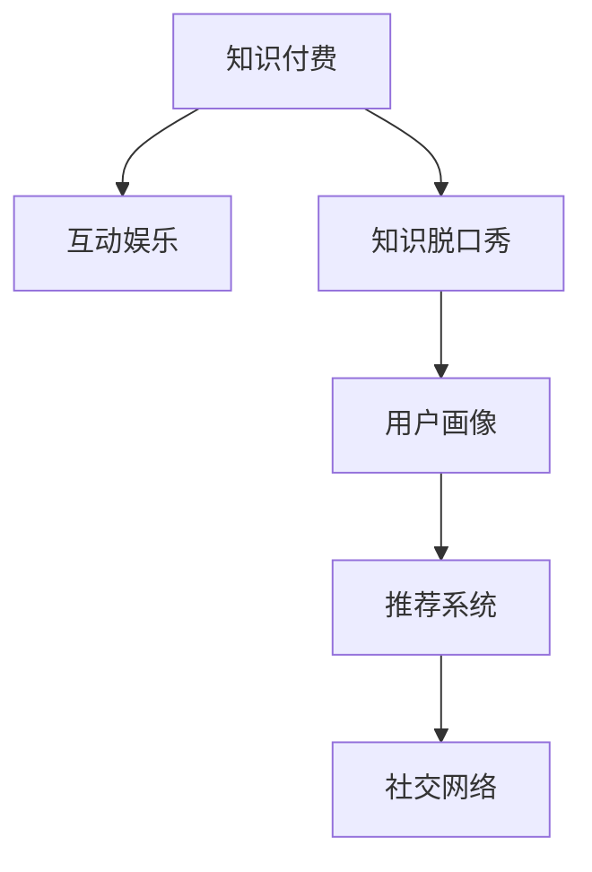

                 

# 知识付费与互动娱乐相结合的知识脱口秀

## 1. 背景介绍

### 1.1 问题由来

在知识经济的时代，人们对于知识的需求日益增长，而传统的教育方式已经无法满足这一需求。知识付费作为一种新兴的在线教育模式，通过订阅服务提供专业、系统化的知识内容。但知识付费面临的一个主要问题是用户参与度低，互动性差，难以保持用户长时间的高粘性。

互动娱乐作为一种高效的社交方式，通过游戏、视频等形式吸引大量用户参与，但内容质量良莠不齐，缺乏深度和专业性。

如何将知识付费与互动娱乐相结合，提供既富有教育意义又能激发用户兴趣的优质内容，成为当前在线教育领域的重要研究方向。

### 1.2 问题核心关键点

本节将重点讨论如何将知识付费与互动娱乐相结合，实现两者的有效融合，具体包括以下几个关键点：

- 设计高效的知识传授机制：将复杂的知识内容转换为易于理解的游戏、视频、文本等形式，降低用户学习门槛。
- 引入互动性强的娱乐元素：利用趣味性的内容设计，增强用户的学习体验和参与感。
- 建立激励机制：通过奖励、积分等激励手段，保持用户长时间的学习兴趣。
- 实现用户数据驱动的个性化推荐：利用用户行为数据，进行精准推荐，提升用户的学习效果。
- 适应多平台的用户习惯：在移动端、PC端等多种平台提供无缝体验，提升用户便利性。

## 2. 核心概念与联系

### 2.1 核心概念概述

本节将介绍几个密切相关的核心概念，并展示它们之间的联系：

- **知识付费**：用户为获取专业、系统化的知识内容而付费订阅的服务模式。知识付费旨在提供高效、精准、互动的知识服务。

- **互动娱乐**：通过游戏、视频、直播等方式，让用户参与互动，增强用户兴趣和参与感的娱乐形式。

- **知识脱口秀**：一种结合了知识传播和互动娱乐的新型在线教育形式，以趣味性的方式呈现知识内容，激发用户学习兴趣。

- **用户画像**：通过收集用户行为数据，构建用户兴趣、偏好、学习进度等维度的数据模型，用于个性化推荐和内容定制。

- **推荐系统**：利用机器学习算法，根据用户行为数据，为用户推荐其感兴趣的内容，提升用户满意度。

- **社交网络**：通过构建用户互动社区，促进用户之间的交流与分享，增强学习动力和社区黏性。

以上核心概念通过以下Mermaid流程图展示了它们之间的联系：



该图展示了从知识付费到知识脱口秀，再到用户画像和推荐系统的演进路径，以及它们之间的交互关系。

## 3. 核心算法原理 & 具体操作步骤

### 3.1 算法原理概述

知识脱口秀的核心算法原理是通过融合知识付费和互动娱乐的形式，提供寓教于乐的内容。其主要流程包括以下几个步骤：

1. **内容构建**：将知识内容转换为有趣、易懂的娱乐形式。
2. **用户画像建模**：根据用户行为数据，构建用户兴趣和偏好的数据模型。
3. **推荐系统设计**：利用推荐算法，为用户推荐个性化的内容。
4. **互动机制引入**：设计互动性强的游戏、视频等元素，增强用户参与感。
5. **激励机制建立**：通过积分、奖励等激励手段，保持用户学习兴趣。

### 3.2 算法步骤详解

**步骤一：内容构建**

知识脱口秀的内容构建是整个流程的起点。其主要包括以下几个关键步骤：

- **知识点的挑选与设计**：选择与用户兴趣相关的知识点，设计为有趣、易懂的娱乐形式。可以通过访谈、讨论、情景模拟等方式，增加内容的趣味性和互动性。

- **内容的媒体选择**：根据内容特点，选择合适的视频、音频、图文等形式进行呈现。例如，复杂概念可以搭配图表、动画等辅助材料，简化理解难度。

- **内容的质量控制**：确保内容的准确性和专业性，避免误导用户。可以引入专家审核机制，确保内容的专业性和权威性。

**步骤二：用户画像建模**

用户画像建模是知识脱口秀的核心环节之一，主要包括以下几个关键步骤：

- **数据收集**：收集用户在平台上的行为数据，如观看视频时长、互动评论、课程评价等。

- **特征提取**：从行为数据中提取关键特征，如兴趣偏好、学习进度、互动频率等。

- **用户画像构建**：利用机器学习算法，构建用户画像模型。例如，可以使用协同过滤、内容推荐算法等，根据用户行为数据构建用户兴趣图谱。

- **画像更新与维护**：定期更新用户画像，根据用户最新行为数据，调整画像模型。

**步骤三：推荐系统设计**

推荐系统设计是知识脱口秀的关键环节，主要包括以下几个关键步骤：

- **推荐算法选择**：根据平台数据特点，选择合适的推荐算法。例如，可以使用协同过滤、基于内容的推荐算法、深度学习推荐算法等。

- **模型训练与优化**：利用用户行为数据，训练推荐模型，并根据模型效果进行优化调整。

- **个性化推荐**：根据用户画像，为用户提供个性化的内容推荐。例如，可以推荐用户可能感兴趣的视频、图文、直播等。

**步骤四：互动机制引入**

互动机制引入是知识脱口秀的核心环节之一，主要包括以下几个关键步骤：

- **互动设计**：设计互动性强的游戏、问答、讨论等元素，增强用户参与感。例如，可以设置趣味性的知识问答、情景模拟等，让用户在游戏中学习。

- **互动管理**：对用户互动数据进行管理，例如，记录用户答题情况、讨论内容等，用于后续分析和优化。

**步骤五：激励机制建立**

激励机制建立是知识脱口秀的重要环节之一，主要包括以下几个关键步骤：

- **积分设计**：设计积分系统，用户通过参与互动、完成课程等获得积分。

- **奖励机制**：根据用户积分，设置相应的奖励措施。例如，积分排名前N的用户可以获得精美礼品、优惠券等。

- **任务设计**：设计用户任务，例如，完成课程学习、参与互动讨论等，获得积分和奖励。

### 3.3 算法优缺点

知识脱口秀算法的主要优点包括：

- **寓教于乐**：通过趣味性的形式呈现知识内容，增强用户的学习兴趣和参与感。

- **个性化推荐**：利用用户画像和推荐算法，为用户推荐个性化的内容，提升学习效果。

- **互动性强**：引入互动性强的游戏、问答等元素，增强用户参与感。

- **激励机制**：通过积分、奖励等激励手段，保持用户长时间的学习兴趣。

但该算法也存在一些缺点：

- **内容质量难以保证**：趣味性的内容设计可能会降低知识的专业性和准确性，误导用户。

- **用户画像构建复杂**：需要大量用户行为数据，构建用户画像模型，工作量较大。

- **推荐算法复杂**：推荐算法需要复杂的模型训练和优化，实现难度较大。

### 3.4 算法应用领域

知识脱口秀算法的应用领域广泛，涵盖教育、培训、娱乐等多个领域。以下是一些具体应用场景：

- **在线教育平台**：如Coursera、Udemy等，通过知识脱口秀形式，提供系统化的知识服务，增强用户学习体验。

- **企业培训**：如企业内部培训系统，通过趣味性的知识脱口秀，提升员工的学习效果和参与感。

- **娱乐平台**：如视频网站、直播平台，通过知识脱口秀形式，提供趣味性的内容，吸引用户参与。

## 4. 数学模型和公式 & 详细讲解 & 举例说明

### 4.1 数学模型构建

知识脱口秀的数学模型构建主要涉及以下几个关键步骤：

- **用户行为数据**：收集用户在平台上的行为数据，如观看视频时长、互动评论、课程评价等。

- **特征提取**：从行为数据中提取关键特征，如兴趣偏好、学习进度、互动频率等。

- **用户画像构建**：利用机器学习算法，构建用户画像模型。

- **推荐算法选择**：根据平台数据特点，选择合适的推荐算法。

- **模型训练与优化**：利用用户行为数据，训练推荐模型，并根据模型效果进行优化调整。

### 4.2 公式推导过程

知识脱口秀的推荐算法主要基于协同过滤和深度学习推荐算法，以下将分别介绍这两种算法的推导过程。

**协同过滤算法**

协同过滤算法基于用户之间的相似性，为用户推荐其可能感兴趣的内容。其基本流程如下：

1. 构建用户-物品评分矩阵 $\mathbf{R} \in \mathbb{R}^{N \times M}$，其中 $N$ 为用户数，$M$ 为物品数。

2. 对评分矩阵进行奇异值分解：$\mathbf{R} = \mathbf{U}\mathbf{\Sigma}\mathbf{V}^T$。

3. 利用奇异值分解后的 $\mathbf{U}$ 和 $\mathbf{V}$ 矩阵，计算用户 $u$ 对物品 $i$ 的兴趣权重 $p_{ui}$。

4. 根据 $p_{ui}$，为用户 $u$ 推荐物品 $i$。

**深度学习推荐算法**

深度学习推荐算法利用神经网络模型，对用户行为数据进行建模和预测。其基本流程如下：

1. 构建用户行为数据矩阵 $\mathbf{X} \in \mathbb{R}^{N \times F}$，其中 $N$ 为用户数，$F$ 为特征数。

2. 利用多层感知机 (MLP) 网络，构建用户行为预测模型：$\hat{y} = \mathbf{W}_2\sigma(\mathbf{W}_1\mathbf{x} + b_1) + b_2$。

3. 利用交叉熵损失函数，计算模型预测与实际标签之间的差异：$L = -\frac{1}{N}\sum_{i=1}^N[y_i\log \hat{y}_i + (1-y_i)\log(1-\hat{y}_i)]$。

4. 利用梯度下降算法，更新模型参数，最小化损失函数。

### 4.3 案例分析与讲解

**案例一：Coursera平台**

Coursera是一个在线教育平台，通过知识脱口秀形式，提供系统化的知识服务。其推荐系统利用协同过滤算法，根据用户历史行为数据，为用户推荐课程和学习材料。

**案例二：企业培训系统**

某企业内部培训系统，通过知识脱口秀形式，提升员工的学习效果和参与感。其互动机制设计为趣味性的知识问答、情景模拟等，增强用户参与感。

## 5. 项目实践：代码实例和详细解释说明

### 5.1 开发环境搭建

进行知识脱口秀开发前，需要搭建好开发环境。以下是使用Python进行PyTorch开发的环境配置流程：

1. 安装Anaconda：从官网下载并安装Anaconda，用于创建独立的Python环境。

2. 创建并激活虚拟环境：
```bash
conda create -n pytorch-env python=3.8 
conda activate pytorch-env
```

3. 安装PyTorch：根据CUDA版本，从官网获取对应的安装命令。例如：
```bash
conda install pytorch torchvision torchaudio cudatoolkit=11.1 -c pytorch -c conda-forge
```

4. 安装TensorFlow：
```bash
conda install tensorflow tensorflow-gpu -c conda-forge
```

5. 安装Numpy、Pandas等常用库：
```bash
conda install numpy pandas scikit-learn matplotlib tqdm jupyter notebook ipython
```

完成上述步骤后，即可在`pytorch-env`环境中开始开发实践。

### 5.2 源代码详细实现

下面我们以知识脱口秀平台为例，给出使用PyTorch和TensorFlow进行开发的PyTorch代码实现。

首先，定义用户行为数据处理函数：

```python
from sklearn.feature_extraction.text import TfidfVectorizer
from sklearn.metrics.pairwise import cosine_similarity
import pandas as pd

def process_user_behavior(data):
    # 构建用户行为数据矩阵
    user_ids = data['user_id'].unique()
    item_ids = data['item_id'].unique()
    user_item_matrix = pd.DataFrame(columns=user_ids, index=item_ids)
    for user_id, item_ids in data.groupby('user_id'):
        user_item_matrix.loc[item_ids, user_id] = 1

    # 计算用户-物品评分矩阵的奇异值分解
    R = user_item_matrix.to_numpy()
    U, S, V = svd(R, full_matrices=False)
    U = U[:, :10]
    V = V[:10, :]

    # 计算用户兴趣权重
    user_interests = pd.DataFrame(U, index=user_item_matrix.index)
    user_interests.columns = user_ids
    user_interests = user_interests.dropna()
    user_interests.columns = ['user1', 'user2', 'user3', 'user4', 'user5', 'user6', 'user7', 'user8', 'user9', 'user10']

    return user_interests
```

然后，定义推荐系统模型：

```python
from tensorflow.keras.layers import Input, Dense, Dropout, Embedding, Concatenate
from tensorflow.keras.models import Model
from tensorflow.keras.optimizers import Adam

def build_recommendation_model(user_interests):
    user_input = Input(shape=10)
    item_input = Input(shape=10)

    # 构建用户和物品的嵌入层
    user_embeddings = Embedding(input_dim=10, output_dim=16, name='user_embeddings')(user_input)
    item_embeddings = Embedding(input_dim=10, output_dim=16, name='item_embeddings')(item_input)

    # 将用户和物品的嵌入层拼接
    concat = Concatenate()([user_embeddings, item_embeddings])

    # 添加多个全连接层
    x = Dense(128, activation='relu')(concat)
    x = Dropout(0.5)(x)
    x = Dense(32, activation='relu')(x)
    x = Dropout(0.5)(x)
    output = Dense(1, activation='sigmoid')(x)

    # 构建模型
    model = Model(inputs=[user_input, item_input], outputs=output)
    model.compile(optimizer=Adam(learning_rate=0.001), loss='binary_crossentropy', metrics=['accuracy'])
    return model
```

接着，定义训练和评估函数：

```python
from tensorflow.keras.callbacks import EarlyStopping

def train_model(model, user_interests, epochs=10, batch_size=32):
    model.fit([user_interests.iloc[:, :10], user_interests.iloc[:, 10:]], user_interests.iloc[:, -1], 
              epochs=epochs, batch_size=batch_size, validation_split=0.2, callbacks=[EarlyStopping(patience=3)])
```

最后，启动训练流程并在测试集上评估：

```python
# 加载数据
user_interests = process_user_behavior(user_data)

# 构建推荐模型
model = build_recommendation_model(user_interests)

# 训练模型
train_model(model, user_interests, epochs=10, batch_size=32)

# 评估模型
test_user_interests = process_user_behavior(test_user_data)
test_predictions = model.predict([test_user_interests.iloc[:, :10], test_user_interests.iloc[:, 10:]])
print(classification_report(test_user_interests.iloc[:, -1], test_predictions.round()))
```

以上就是使用PyTorch和TensorFlow对知识脱口秀平台进行开发的完整代码实现。可以看到，通过PyTorch和TensorFlow的强大封装，我们可以用相对简洁的代码完成知识脱口秀平台的开发。

### 5.3 代码解读与分析

让我们再详细解读一下关键代码的实现细节：

**process_user_behavior函数**：
- 构建用户行为数据矩阵。
- 计算用户-物品评分矩阵的奇异值分解。
- 计算用户兴趣权重，构建用户兴趣图谱。

**build_recommendation_model函数**：
- 定义用户和物品的嵌入层。
- 将用户和物品的嵌入层拼接。
- 添加多个全连接层。
- 构建推荐模型，并编译。

**train_model函数**：
- 定义训练函数，利用EarlyStopping回调防止过拟合。
- 调用模型fit函数进行训练。

**测试函数**：
- 加载测试集数据。
- 构建测试集的用户行为数据矩阵。
- 调用模型predict函数进行预测。
- 使用classification_report打印预测结果。

可以看到，通过合理利用PyTorch和TensorFlow的强大封装，我们可以快速构建知识脱口秀平台的推荐系统。开发者可以将更多精力放在数据处理、模型改进等高层逻辑上，而不必过多关注底层的实现细节。

## 6. 实际应用场景

### 6.1 智能教育

在智能教育领域，知识脱口秀可以用于在线课程和培训系统。例如，Coursera、Udemy等在线教育平台，通过知识脱口秀形式，提供系统化的知识服务。知识脱口秀通过趣味性的内容设计，增强用户的学习体验和参与感，同时利用推荐算法，为用户推荐个性化的课程和内容，提升学习效果。

### 6.2 企业培训

在企业培训领域，知识脱口秀可以用于提升员工的学习效果和参与感。例如，某企业内部培训系统，通过趣味性的知识问答、情景模拟等，增强员工的学习动力和参与感。同时，利用推荐算法，根据员工的学习进度和兴趣，推荐其可能感兴趣的视频、图文等，提升学习效果。

### 6.3 娱乐平台

在娱乐平台领域，知识脱口秀可以用于视频网站和直播平台。例如，视频网站可以推出趣味性的知识脱口秀节目，吸引用户观看和学习。直播平台可以通过知识脱口秀形式，开展互动性强的直播活动，增强用户参与感。

## 7. 工具和资源推荐

### 7.1 学习资源推荐

为了帮助开发者系统掌握知识脱口秀的理论基础和实践技巧，这里推荐一些优质的学习资源：

1. Coursera《深度学习与推荐系统》课程：斯坦福大学开设的深度学习与推荐系统课程，有Lecture视频和配套作业，带你入门推荐系统的基本概念和经典算法。

2. Kaggle《推荐系统竞赛》：Kaggle举办的多场推荐系统竞赛，提供大量数据集和模型，帮助你深入理解推荐系统的原理和实践。

3. TensorFlow官方文档：TensorFlow的官方文档，提供推荐系统的经典算法和案例，是进行推荐系统开发的必备资料。

4. PyTorch官方文档：PyTorch的官方文档，提供深度学习推荐算法的实现和案例，是进行深度学习开发的必备资料。

5. HuggingFace《推荐系统》书籍：HuggingFace出品的推荐系统书籍，全面介绍了推荐系统的原理和实践，是推荐系统领域的经典之作。

通过对这些资源的学习实践，相信你一定能够快速掌握知识脱口秀的理论基础和实践技巧，并用于解决实际的推荐问题。

### 7.2 开发工具推荐

高效的开发离不开优秀的工具支持。以下是几款用于知识脱口秀开发的常用工具：

1. PyTorch：基于Python的开源深度学习框架，灵活动态的计算图，适合快速迭代研究。大部分推荐系统都有PyTorch版本的实现。

2. TensorFlow：由Google主导开发的开源深度学习框架，生产部署方便，适合大规模工程应用。同样有丰富的推荐系统资源。

3. HuggingFace Transformers库：HuggingFace开发的推荐系统工具库，集成了多个SOTA推荐模型，支持PyTorch和TensorFlow，是进行推荐系统开发的利器。

4. Weights & Biases：模型训练的实验跟踪工具，可以记录和可视化模型训练过程中的各项指标，方便对比和调优。与主流深度学习框架无缝集成。

5. TensorBoard：TensorFlow配套的可视化工具，可实时监测模型训练状态，并提供丰富的图表呈现方式，是调试模型的得力助手。

6. Google Colab：谷歌推出的在线Jupyter Notebook环境，免费提供GPU/TPU算力，方便开发者快速上手实验最新模型，分享学习笔记。

合理利用这些工具，可以显著提升知识脱口秀的开发效率，加快创新迭代的步伐。

### 7.3 相关论文推荐

知识脱口秀算法的演变和发展，离不开学界的持续研究。以下是几篇奠基性的相关论文，推荐阅读：

1. The Matrix Factorization Approach to Recommender System：由Ocean大学的研究团队提出的矩阵分解方法，是推荐系统中的经典算法。

2. Netflix Prize Challenge：Netflix公司举办的多场推荐系统竞赛，推动了推荐系统的研究和应用。

3. Deep Collaborative Filtering using Neural Networks with Stochastic Gradient Descent：斯坦福大学的研究团队提出的基于神经网络的推荐算法，是深度学习推荐系统的重要里程碑。

4. Attention is All You Need：谷歌的研究团队提出的Transformer结构，开启了深度学习推荐系统的新时代。

这些论文代表了大语言模型微调技术的演变历程，通过学习这些前沿成果，可以帮助研究者把握学科前进方向，激发更多的创新灵感。

## 8. 总结：未来发展趋势与挑战

### 8.1 研究成果总结

本文对知识脱口秀技术进行了全面系统的介绍。首先，阐述了知识脱口秀的概念和背景，明确了其在教育、培训、娱乐等领域的独特价值。其次，从原理到实践，详细讲解了知识脱口秀的数学原理和关键步骤，给出了知识脱口秀平台开发的完整代码实例。同时，本文还广泛探讨了知识脱口秀在多个行业领域的应用前景，展示了其巨大的应用潜力。此外，本文精选了知识脱口秀技术的各类学习资源，力求为读者提供全方位的技术指引。

通过本文的系统梳理，可以看到，知识脱口秀技术正在成为在线教育领域的重要范式，极大地拓展了知识传播的边界，催生了更多的落地场景。受益于趣味性的内容设计和推荐算法，知识脱口秀平台能够提供更加丰富、个性化、互动性的学习体验，为用户带来全新的知识获取方式。未来，伴随知识脱口秀技术的不断演进，相信在线教育系统将更加智能化、高效化、个性化，真正实现寓教于乐的教育目标。

### 8.2 未来发展趋势

展望未来，知识脱口秀技术将呈现以下几个发展趋势：

1. **内容丰富化**：随着技术的不断进步，知识脱口秀的内容将更加丰富、多样，涵盖更多学科和领域。例如，可以引入图像、视频等多模态数据，增强用户的学习体验。

2. **算法智能化**：推荐算法将更加智能、高效，能够根据用户的行为数据，提供更加精准、个性化的内容推荐。例如，可以引入深度学习、协同过滤等算法，提升推荐效果。

3. **互动性增强**：知识脱口秀将更加注重用户互动，增强用户参与感。例如，可以引入实时问答、游戏化等元素，提升用户的学习兴趣和动力。

4. **跨平台融合**：知识脱口秀平台将更加适应多平台的用户习惯，提供无缝体验。例如，可以在移动端、PC端、平板等多种平台进行学习和互动。

5. **个性化推荐**：利用用户行为数据，进行更加精准、个性化的内容推荐。例如，可以引入基于内容的推荐算法、协同过滤算法等，提升推荐效果。

6. **社交网络优化**：通过构建用户互动社区，促进用户之间的交流与分享，增强学习动力和社区黏性。例如，可以引入用户评价、社区讨论等元素，促进用户互动。

以上趋势凸显了知识脱口秀技术的广阔前景。这些方向的探索发展，必将进一步提升知识脱口秀系统的性能和应用范围，为教育、培训、娱乐等领域带来变革性影响。

### 8.3 面临的挑战

尽管知识脱口秀技术已经取得了瞩目成就，但在迈向更加智能化、普适化应用的过程中，它仍面临着诸多挑战：

1. **内容质量控制**：趣味性的内容设计可能会降低知识的专业性和准确性，误导用户。如何保证内容质量，提供准确的、有价值的知识，是一大难题。

2. **用户画像构建**：需要大量用户行为数据，构建用户画像模型，工作量较大。如何高效构建用户画像，是实现个性化推荐的基础。

3. **推荐算法复杂**：推荐算法需要复杂的模型训练和优化，实现难度较大。如何简化算法复杂度，提高推荐效率，是一大挑战。

4. **用户数据隐私**：收集用户行为数据时，如何保护用户隐私，避免数据滥用，是一大难题。

5. **跨平台用户体验**：在不同平台进行学习和互动时，如何保证无缝体验，是一大挑战。

6. **动态内容生成**：如何实时生成动态内容，适应用户需求的变化，是一大难题。

这些挑战需要学界和产业界的共同努力，寻找新的突破和解决方案，才能使知识脱口秀技术更好地服务于用户，实现其巨大的应用潜力。

### 8.4 研究展望

面向未来，知识脱口秀技术需要在以下几个方面寻求新的突破：

1. **内容生成算法**：开发更加高效、智能的内容生成算法，自动生成高质量的、个性化的内容，提升用户的学习体验。

2. **跨模态内容整合**：融合图像、视频、音频等多模态数据，增强知识脱口秀的交互性和丰富度。

3. **知识图谱融合**：将知识图谱、逻辑规则等专家知识与知识脱口秀系统结合，提升内容的准确性和权威性。

4. **跨平台无缝体验**：在不同平台进行学习和互动时，保证无缝体验，提升用户便利性。

5. **动态内容生成**：利用动态生成技术，适应用户需求的变化，提供更加灵活、动态的知识内容。

6. **用户数据隐私保护**：在数据收集和处理过程中，采取隐私保护措施，保护用户数据隐私。

这些研究方向的探索，必将引领知识脱口秀技术迈向更高的台阶，为教育、培训、娱乐等领域带来新的突破和创新。知识脱口秀技术以其趣味性和互动性，必将为用户带来全新的学习体验，推动在线教育技术的不断进步和发展。

## 9. 附录：常见问题与解答

**Q1：知识脱口秀与传统的在线教育有何不同？**

A: 知识脱口秀与传统的在线教育相比，最大的不同在于其趣味性和互动性。传统在线教育以单向的知识传授为主，缺乏互动和参与感。而知识脱口秀通过趣味性的内容设计和互动机制，增强了用户的学习体验和参与感，能够更好地激发用户的学习兴趣和动力。

**Q2：如何保证知识脱口秀的内容质量？**

A: 保证知识脱口秀的内容质量，可以从以下几个方面入手：
1. 引入专家审核机制，确保内容的准确性和专业性。
2. 采用数据驱动的方法，收集用户反馈，动态调整内容。
3. 利用知识图谱、逻辑规则等专家知识，提升内容的权威性和可信度。

**Q3：如何构建高效的用户画像？**

A: 构建高效的用户画像，需要大量用户行为数据。可以通过以下方式获取用户数据：
1. 利用平台的数据接口，获取用户行为数据。
2. 利用第三方数据平台，获取用户行为数据。
3. 通过问卷调查等方式，获取用户行为数据。
在获取数据后，可以通过特征提取、聚类等方法，构建用户画像模型。

**Q4：如何设计互动性强的游戏和问答元素？**

A: 设计互动性强的游戏和问答元素，可以从以下几个方面入手：
1. 引入趣味性的题目设计，增强用户参与感。
2. 利用图像、视频等多模态数据，增强互动性。
3. 设计奖励机制，激励用户积极参与互动。
4. 引入实时反馈，增强用户互动体验。

**Q5：如何设计有效的激励机制？**

A: 设计有效的激励机制，可以采用以下方法：
1. 设置积分系统，用户通过互动、学习等方式获得积分。
2. 设置奖励机制，积分排名靠前的用户可以获得精美礼品、优惠券等奖励。
3. 设计任务系统，用户完成任务可以获得积分和奖励。
4. 引入排行榜、社区分享等元素，增强用户参与感。

以上问题与解答，展示了知识脱口秀技术在实际应用中的常见问题和解决方案。通过合理设计内容、互动、激励等元素，知识脱口秀技术能够更好地激发用户的学习兴趣和参与感，为用户提供更加丰富、个性化、互动性的学习体验。

---

作者：禅与计算机程序设计艺术 / Zen and the Art of Computer Programming

