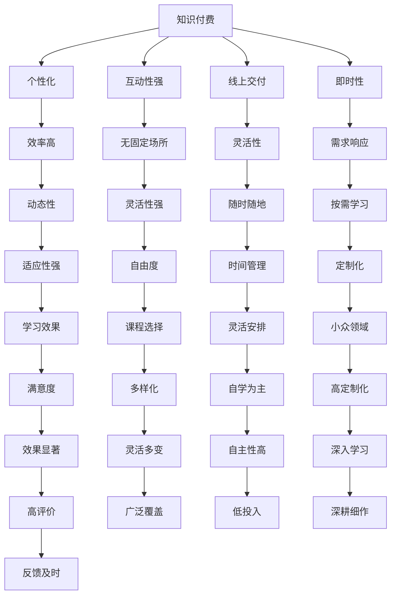

                 

## 1. 背景介绍

随着互联网的普及和知识经济的兴起，知识付费和传统培训已成为全球教育领域的两大主要模式。尽管两者在形式和内容上存在诸多差异，但均旨在传递知识、提升技能，为个人和组织的发展提供支持。然而，随着技术的进步和社会需求的变迁，知识付费与传统培训在目标受众、教学模式、效果评估等方面呈现出不同的优劣。本文将详细对比这两种模式的利弊，并探讨其在未来发展中的趋势和挑战。

## 2. 核心概念与联系

### 2.1 核心概念概述

- **知识付费（Knowledge Paying）**：用户为获取知识、技能或信息而支付费用的模式，通常通过订阅、购买课程或服务等方式实现。知识付费平台如Coursera、Udemy、Khan Academy等提供了丰富的在线课程资源。
- **传统培训（Traditional Training）**：在课堂、面对面工作坊等线下环境中，通过讲师的现场讲解、互动讨论等方式进行教学的培训模式。传统培训常见于企业内部培训、职业资格认证等场景。
- **泛在学习（Ubiquitous Learning）**：在各种环境和情境下通过便携设备进行学习的方式，利用碎片化时间提高学习效率。
- **自适应学习（Adaptive Learning）**：通过个性化学习路径和反馈机制，根据学生的学习表现和进度动态调整教学内容的教学模式。

这些核心概念通过以下Mermaid流程图展示其内在联系：



### 2.2 核心概念原理和架构的 Mermaid 流程图

由于篇幅限制，以下仅展示概念之间的联系图，而不包括详细流程图的生成。


## 3. 核心算法原理 & 具体操作步骤

### 3.1 算法原理概述

知识付费和传统培训的核心算法原理均基于认知科学和行为心理学，旨在通过有效的教学方法和内容设计，提升学习效果。

- **知识付费**：采用先进的在线教育技术，如自适应学习系统、个性化推荐、即时反馈等，以提升学习体验和效果。知识付费平台通过数据驱动的方法，不断优化课程内容和交付方式。
- **传统培训**：侧重于现场互动和实操演练，通过讲师的经验分享和学生的动手实践，达到知识传递和技能培养的目的。传统培训注重课堂氛围和师生互动，提升学习动机和参与度。

### 3.2 算法步骤详解

知识付费与传统培训在具体实施步骤上有所不同。

#### 知识付费的实施步骤：
1. **需求调研**：通过用户调查和数据分析，了解用户的学习需求和偏好。
2. **内容设计**：根据用户需求，设计课程大纲和教学内容，采用多媒体和互动元素丰富课程形式。
3. **平台搭建**：开发和部署在线学习平台，集成视频、测验、讨论板等功能。
4. **学习跟踪**：利用学习管理系统，记录用户的学习进度和行为数据，提供个性化推荐和反馈。
5. **效果评估**：通过在线测试、学习成果评估等手段，测量知识付费的效果。

#### 传统培训的实施步骤：
1. **需求分析**：明确培训目标和内容，设计培训计划和课程大纲。
2. **师资准备**：选拔和培训讲师，确保其具备丰富的专业知识和教学经验。
3. **场地和设备**：准备培训场所和必要的教学设备，如投影仪、互动软件等。
4. **课堂教学**：进行现场授课，采用案例分析、实操演练等方法，提高教学效果。
5. **反馈和改进**：通过问卷调查、现场观察等方式收集反馈，不断改进培训内容和方法。

### 3.3 算法优缺点

**知识付费的优缺点**：
- **优点**：
  - **灵活性**：学习时间和地点自由，适应不同工作和学习节奏。
  - **个性化**：根据用户数据，提供定制化的学习路径和推荐。
  - **便捷性**：随时随地通过手机、电脑等设备进行学习。
- **缺点**：
  - **互动性差**：相对于面对面培训，缺乏即时反馈和互动。
  - **师资质量不一**：课程质量和师资水平参差不齐，存在误导风险。
  - **缺乏即时支持**：问题解决和辅导需要依赖在线客服或社区支持，响应速度较慢。

**传统培训的优缺点**：
- **优点**：
  - **即时反馈**：课堂教学中，讲师能够及时解答学生疑问，提供即时反馈。
  - **互动性强**：师生面对面交流，促进更深入的学习和理解。
  - **经验丰富**：讲师通常具备丰富的行业经验和实际操作能力。
- **缺点**：
  - **时间和地点限制**：线下培训需要固定时间和场所，对地理位置和日程安排有限制。
  - **教学形式单一**：以讲授为主，缺乏多样化的教学手段和互动形式。
  - **成本较高**：场地、设备和师资投入较高，费用成本较大。

### 3.4 算法应用领域

知识付费与传统培训在应用领域上各有侧重：

- **知识付费**：适用于自主学习、技能提升、技术培训等领域，如编程、设计、语言学习等。知识付费平台覆盖面广，适合需要灵活、个性化学习方式的用户。
- **传统培训**：适用于专业认证、职业资格、团队培训等领域，如医疗、金融、管理等。传统培训注重实际操作和专业技能培养，适合需要深度互动和现场实操的场景。

## 4. 数学模型和公式 & 详细讲解 & 举例说明

### 4.1 数学模型构建

知识付费和传统培训的效果评估可以建立数学模型，通过量化指标评估其教学效果和学习成果。

- **知识付费的数学模型**：
  - **学习效果评估**：使用学习成果评估模型，如知识掌握度、技能应用能力等。
  - **学习体验评估**：通过问卷调查、满意度评分等方式，评估用户的学习体验和满意度。
  - **学习路径优化**：采用优化算法，根据用户学习数据，动态调整课程推荐和路径。

- **传统培训的数学模型**：
  - **培训效果评估**：通过考试、实操测试等方式，评估学员的知识掌握和技能应用能力。
  - **培训反馈评估**：通过问卷调查、讲师反馈等方式，评估培训质量和学员满意度。
  - **培训内容优化**：使用数据分析方法，优化课程内容、教学方法和师资配置。

### 4.2 公式推导过程

以知识付费平台的用户满意度评分为例，推导用户满意度的数学模型：

设用户满意度的评分为 $S$，影响因素包括课程质量 $Q$、学习体验 $E$、学习效果 $L$ 等，建立以下数学模型：

$$ S = Q \times E \times L + \epsilon $$

其中 $\epsilon$ 为随机误差项。

### 4.3 案例分析与讲解

假设某知识付费平台提供数据分析课程，平台通过以下公式计算用户满意度：

$$ S = 0.5 \times Q + 0.3 \times E + 0.2 \times L + \epsilon $$

其中：
- $Q$ 为课程质量评分（1-5分）
- $E$ 为学习体验评分（1-5分）
- $L$ 为学习效果评分（1-5分）

通过收集大量用户数据，可以计算出平均满意度评分和各个因素的权重，优化课程设计和平台功能。

## 5. 项目实践：代码实例和详细解释说明

### 5.1 开发环境搭建

开发知识付费和传统培训系统的环境搭建如下：

1. **服务器搭建**：使用AWS或阿里云等云服务，搭建Web服务器和数据库环境。
2. **编程语言选择**：选择Python、JavaScript等主流编程语言。
3. **框架选择**：采用Django、Flask等Web框架，结合TensorFlow、PyTorch等机器学习框架，实现个性化推荐和效果评估功能。
4. **数据管理**：使用MySQL、PostgreSQL等关系型数据库，存储用户数据和课程信息。

### 5.2 源代码详细实现

**知识付费系统开发**：
- **用户注册与登录**：通过OAuth2授权，实现用户注册、登录和第三方认证。
- **课程推荐系统**：基于用户行为数据，使用协同过滤算法、内容推荐算法等，推荐相关课程。
- **学习管理系统**：记录用户学习进度和测试成绩，提供个性化反馈和奖励机制。

**传统培训系统开发**：
- **培训管理平台**：设计讲师管理、课程设置、日程安排等功能模块。
- **互动教学工具**：开发互动白板、案例分析工具等，增强课堂互动和实操体验。
- **学习效果评估**：设计在线测试、实操考核等评估方式，记录和分析培训效果。

### 5.3 代码解读与分析

以下展示知识付费平台的核心代码段：

```python
# 用户注册与登录功能
class UserRegistration:
    def __init__(self, email, password):
        self.email = email
        self.password = password

# 课程推荐系统
class CourseRecommendation:
    def __init__(self, user_id):
        self.user_id = user_id
        self.user_behaviors = load_user_behaviors(user_id)
        self.courses = load_all_courses()
    
    def recommend(self):
        # 使用协同过滤算法推荐课程
        recommended_courses = collaborative_filtering(self.user_behaviors, self.courses)
        return recommended_courses

# 学习管理系统
class LearningManagementSystem:
    def __init__(self, user_id, course_id):
        self.user_id = user_id
        self.course_id = course_id
        self.user_progress = load_user_progress(user_id, course_id)
    
    def update_progress(self):
        # 记录用户学习进度
        update_user_progress(self.user_id, self.course_id, self.user_progress)
    
    def get_feedback(self):
        # 提供个性化反馈
        feedback = generate_feedback(self.user_progress)
        return feedback
```

以上代码展示了知识付费平台的核心功能模块，包括用户注册登录、课程推荐和学习管理系统。通过这些模块，平台可以提供个性化和高效的学习体验。

## 6. 实际应用场景

### 6.1 知识付费系统的应用场景

1. **远程工作培训**：企业利用知识付费平台，为远程员工提供技能培训课程，提升工作效率和团队协作能力。
2. **终身学习平台**：个人利用知识付费平台，持续学习新知识，保持职业竞争力和个人成长。
3. **在线教育市场**：教育机构利用知识付费平台，开设各类在线课程，覆盖K-12、大学教育、职业培训等多个领域。

### 6.2 传统培训系统的应用场景

1. **医疗健康培训**：医疗机构利用传统培训系统，对医护人员进行规范化操作和紧急情况处理的培训。
2. **职业资格认证**：政府和行业协会利用传统培训系统，开展各类职业资格认证和技能考核。
3. **企业内部培训**：企业利用传统培训系统，进行新员工入职培训、团队协作培训、领导力培训等。

## 7. 工具和资源推荐

### 7.1 学习资源推荐

- **Coursera**：提供各类在线课程和证书，覆盖科学、技术、艺术等多个领域。
- **Udemy**：提供个性化课程，覆盖编程、设计、商业等多个方向。
- **Khan Academy**：提供K-12教育课程，覆盖数学、科学、文学等基础学科。

### 7.2 开发工具推荐

- **AWS**：提供云计算平台，支持弹性计算和数据存储，适合开发大型知识付费和传统培训系统。
- **Django**：提供Web开发框架，支持高效的数据管理和用户认证。
- **TensorFlow**：提供机器学习框架，支持深度学习和个性化推荐系统开发。

### 7.3 相关论文推荐

- **《知识付费平台的用户行为分析》**：论文探讨了知识付费平台的用户行为特征，提出基于用户行为的个性化推荐方法。
- **《传统培训系统的设计与实现》**：论文介绍了传统培训系统的设计原理和实现技术，提出通过互动工具增强培训效果。
- **《基于深度学习的知识付费推荐系统》**：论文研究了基于深度学习的推荐系统在知识付费平台中的应用，提出多种优化方法。

## 8. 总结：未来发展趋势与挑战

### 8.1 未来发展趋势

知识付费和传统培训的未来发展趋势如下：

1. **技术融合**：知识付费和传统培训将更多地融合现代信息技术，如人工智能、大数据、区块链等，提升教学效果和学习体验。
2. **个性化学习**：通过大数据分析和个性化推荐算法，知识付费平台将提供更加个性化的学习体验，满足不同用户的需求。
3. **跨界应用**：知识付费和传统培训将跨界融合，拓展到更多领域，如教育、医疗、娱乐等。
4. **全球化扩展**：知识付费和传统培训将走向全球化，利用国际化的内容和师资，提升全球教育水平。

### 8.2 面临的挑战

知识付费和传统培训在发展过程中仍面临以下挑战：

1. **师资资源短缺**：优质师资资源的短缺制约了知识付费和传统培训的发展。
2. **用户隐私保护**：大量用户数据的收集和使用，带来了隐私保护和安全性的挑战。
3. **内容质量保证**：课程内容的质量和科学性，决定了知识付费和传统培训的效果。
4. **用户支付意愿**：用户的支付意愿和课程性价比，影响知识付费平台的用户留存率和转化率。

### 8.3 研究展望

未来的研究将集中在以下几个方面：

1. **师资资源优化**：通过在线评估和认证，提升全球师资质量，解决优质师资资源短缺的问题。
2. **隐私保护机制**：建立健全用户隐私保护机制，保障用户数据的安全性和隐私性。
3. **内容质量保障**：通过智能审核和专家评审，提升课程内容的质量和科学性。
4. **个性化推荐算法**：开发高效的个性化推荐算法，提升知识付费平台的用户体验和学习效果。

## 9. 附录：常见问题与解答

### 常见问题

**Q1: 知识付费和传统培训的主要区别是什么？**

A: 知识付费与传统培训的主要区别在于教学模式和学习方式。知识付费通过在线平台提供课程和资料，用户自主学习，缺乏即时互动和反馈；传统培训通过线下课堂进行面对面的教学，提供即时互动和反馈，但时间和地点限制较大。

**Q2: 知识付费和传统培训各有优缺点，应如何选择？**

A: 选择知识付费还是传统培训，应根据个人需求和情境来决定。知识付费适合需要灵活学习时间和地点的用户，而传统培训适合需要深度互动和实操的场景。

**Q3: 知识付费和传统培训的未来发展方向是什么？**

A: 知识付费和传统培训的未来发展方向是技术融合和个性化学习。通过技术手段提升教学效果和学习体验，通过个性化推荐和互动工具，提供更符合用户需求的课程和服务。

**Q4: 知识付费和传统培训在实际应用中面临哪些挑战？**

A: 知识付费和传统培训在实际应用中面临师资资源短缺、用户隐私保护、内容质量保证、用户支付意愿等挑战。需要多方努力，共同推动行业发展。

**Q5: 知识付费和传统培训如何实现融合？**

A: 知识付费和传统培训可以通过技术融合、内容共享、师资共建等方式实现融合。例如，在线平台上引入线下课程资源，线下课堂加入在线互动和评估工具，提升整体教学效果。

作者：禅与计算机程序设计艺术 / Zen and the Art of Computer Programming

