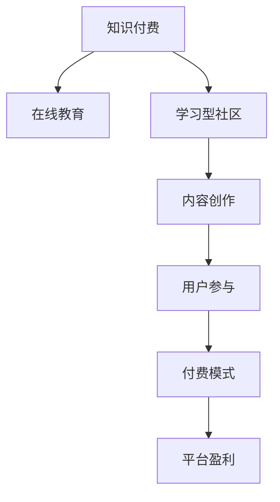

                 

# 知识付费与在线教育相结合的学习型社区模式

> 关键词：知识付费,在线教育,学习型社区,内容创作,用户参与,付费模式,平台盈利

## 1. 背景介绍

### 1.1 问题由来

在互联网快速发展的今天，在线教育已成为人们获取知识的重要渠道。然而，传统在线教育平台往往存在内容质量参差不齐、互动性差、学习效果不佳等问题。与此同时，知识付费模式作为一种新型的付费方式，因其高效、便捷的特点，在内容消费市场展现出强劲的生命力。

如何将知识付费与在线教育相结合，构建高效、互动、有品质的学习型社区，成为在线教育平台和知识创作者面临的重要课题。这一模式不仅能提高用户的学习效果，还能为平台和创作者带来稳定的收入来源。

### 1.2 问题核心关键点

1. **平台与创作者的利益分配**：如何公平合理地分配收益，保障平台与创作者的利益，同时保证平台稳定运营。
2. **内容质量控制**：保证知识付费内容的专业性和权威性，避免劣质内容的泛滥。
3. **用户参与机制**：设计有效的用户参与机制，提升用户体验和学习效率。
4. **平台盈利模式**：探索多元化、可持续的盈利模式，支撑平台的长期发展。

### 1.3 问题研究意义

构建知识付费与在线教育相结合的学习型社区，对于推动知识普及、提升教育质量、促进内容创新和消费具有重要意义。它能够为知识创作者提供更多的展示平台，鼓励更多的优质内容产生；同时，为学习者提供更加丰富、专业、互动的学习资源，提升学习效果。

此外，该模式还能推动在线教育行业从以售卖课程为主向以提供服务为主转变，形成良性循环，为行业的健康发展提供新动能。

## 2. 核心概念与联系

### 2.1 核心概念概述

为了更好地理解知识付费与在线教育相结合的学习型社区模式，本节将介绍几个密切相关的核心概念：

1. **知识付费**：指用户为获取特定知识、技能或信息而进行付费的行为。知识付费不仅包括直接的课程购买，还包括通过平台购买咨询、解答等增值服务。

2. **在线教育**：通过网络平台进行的在线课程学习，打破了传统课堂教育的地理和时间限制，为更多人提供了学习机会。

3. **学习型社区**：以知识共享和互动交流为核心目标，由用户、创作者和平台共同构建的在线社群。社区成员通过学习、交流、创作和反馈，不断提升自身和整个社群的知识水平。

4. **内容创作**：平台鼓励创作者根据市场需求和用户反馈，创作和发布高质量的知识内容。创作者可以通过知识付费获得收益，形成正向激励。

5. **用户参与**：平台应设计互动性强、反馈及时的学习和交流机制，让用户主动参与到内容创作和社群建设中，提升学习体验。

6. **付费模式**：包括按需付费、包月订阅、定制化服务等多样化的付费方式，满足不同用户和创作者的收益需求。

7. **平台盈利**：通过广告、会员、增值服务等多种渠道实现盈利，支持平台的持续运营和内容优化。

这些核心概念之间的逻辑关系可以通过以下Mermaid流程图来展示：



这个流程图展示了知识付费与在线教育相结合的学习型社区的核心概念及其之间的关系：

1. 知识付费是学习的支付方式，推动在线教育平台和内容创作者的生产。
2. 在线教育提供学习资源和平台，保障知识付费内容的学习效果。
3. 学习型社区是知识付费和在线教育的生态土壤，促进内容和用户的深度互动。
4. 内容创作是知识付费和在线教育的核心，内容质量直接影响用户的学习体验。
5. 用户参与是学习型社区的活力来源，用户反馈和互动提升平台和内容质量。
6. 付费模式是知识付费和在线教育变现的渠道，支持平台和创作者的收益。
7. 平台盈利是知识付费和在线教育的经济基础，保障平台的可持续发展。

## 3. 核心算法原理 & 具体操作步骤

### 3.1 算法原理概述

知识付费与在线教育相结合的学习型社区模式，本质上是一种基于用户行为和反馈的动态内容推荐系统。其核心思想是：通过分析用户的学习行为和反馈，推荐最适合用户的学习资源，同时根据用户反馈调整内容和推荐策略，提升学习效果。

形式化地，假设平台上有 $N$ 个用户 $U=\{u_1,u_2,\ldots,u_N\}$，$M$ 个创作者 $C=\{c_1,c_2,\ldots,c_M\}$，$K$ 个知识内容 $I=\{i_1,i_2,\ldots,i_K\}$。平台通过用户行为数据 $D=\{(x_i,y_i)\}_{i=1}^N$ 和创作者内容数据 $I=\{(c_j,i_k)\}_{j=1}^M, k=1,\ldots,K$，构建推荐模型，生成个性化推荐列表，并通过推荐策略 $S$ 实现用户内容推荐。

具体而言，平台首先通过用户行为数据和内容质量评分，生成用户-内容关联矩阵 $A \in \mathbb{R}^{N \times K}$。然后，利用协同过滤算法，如基于矩阵分解的推荐算法(SVD)，构建用户-内容评分预测模型，计算用户对内容的预估评分 $r_{u_i,i_k}$。最后，根据用户评分和推荐策略，生成个性化推荐列表。

### 3.2 算法步骤详解

基于知识付费与在线教育相结合的学习型社区模式，通常包括以下几个关键步骤：

**Step 1: 数据准备和模型训练**
- 收集用户行为数据，包括浏览、点击、购买、评价等行为。
- 收集创作者内容数据，包括课程介绍、用户评分等。
- 利用用户行为数据和内容评分数据，构建用户-内容关联矩阵 $A$。
- 使用协同过滤算法(SVD)训练推荐模型，得到用户对内容的预估评分矩阵 $R$。

**Step 2: 个性化推荐生成**
- 根据用户的历史行为和预估评分，生成用户个性化推荐列表。
- 根据推荐策略 $S$，对推荐列表进行排序和筛选，提升推荐效果。

**Step 3: 用户反馈和内容优化**
- 收集用户对推荐内容的反馈，包括点击率、购买率、评分等。
- 根据用户反馈调整推荐策略，优化内容推荐效果。
- 收集创作者内容的用户评分，评估内容质量和效果。

**Step 4: 收益分配和激励机制**
- 根据用户行为和内容推荐效果，分配平台与创作者收益。
- 设计多元化的付费模式，如按需付费、包月订阅等，满足不同用户和创作者的需求。
- 通过补贴、激励措施等，鼓励高质量内容的生产和用户参与。

**Step 5: 平台运营和持续改进**
- 监测平台运营数据，及时发现问题并进行调整。
- 根据用户需求和技术发展，不断优化推荐算法和推荐策略。
- 引入人工智能、大数据等先进技术，提升平台的技术水平和服务质量。

以上是知识付费与在线教育相结合的学习型社区模式的一般流程。在实际应用中，还需要针对具体平台的特点，对各环节进行优化设计，如改进推荐算法、设计更灵活的付费模式等，以进一步提升平台的用户体验和学习效果。

### 3.3 算法优缺点

知识付费与在线教育相结合的学习型社区模式，具有以下优点：
1. 高效便捷：用户可以根据自己的需求和兴趣，通过付费获取优质内容，提升学习效率。
2. 促进内容创新：创作者能够通过知识付费获得稳定收益，鼓励高质量内容的生产和传播。
3. 提升学习效果：通过个性化推荐和互动交流，用户能够获得更加贴合自身需求和兴趣的学习资源。
4. 增加平台粘性：平台能够通过优质的内容和互动机制，提升用户粘性和平台活跃度。
5. 多元化的盈利模式：通过广告、会员、增值服务等多种渠道实现盈利，支撑平台的持续运营。

同时，该模式也存在一定的局限性：
1. 内容质量控制难度大：平台需要不断进行内容审核和管理，保证高质量内容不被劣质内容淹没。
2. 用户多样性需求难以统一：不同用户的需求和兴趣差异较大，难以统一推荐策略，影响推荐效果。
3. 付费模式复杂度高：设计多元化的付费模式需要考虑多方面因素，增加平台运营复杂度。
4. 平台运营成本高：优质内容的生产和用户互动需要大量投入，平台需投入大量资源进行内容管理和用户运营。
5. 用户信任度问题：用户对平台和创作者的可信度较低，可能导致信任危机，影响平台发展。

尽管存在这些局限性，但就目前而言，知识付费与在线教育相结合的学习型社区模式仍是大数据和人工智能技术在教育领域应用的重要方向。未来相关研究的重点在于如何进一步优化推荐算法和付费模式，提升内容质量和用户满意度。

### 3.4 算法应用领域

知识付费与在线教育相结合的学习型社区模式，已经在多个领域得到应用，例如：

- **K-12教育**：提供个性化的学习路径和推荐，提升学生的学习效果。
- **职业培训**：通过高质量的视频课程和互动练习，帮助用户快速掌握职业技能。
- **语言学习**：提供多语种的在线课程和互动练习，提升用户的语言水平。
- **技能培训**：提供专业技能的课程和练习，满足用户职业发展的需求。
- **兴趣爱好**：提供多样化的兴趣课程和资源，满足用户的个性化需求。
- **职业发展**：提供职场技巧和职业规划的课程，提升用户的职业素养。

除了上述这些经典领域外，知识付费与在线教育相结合的学习型社区模式，还在心理咨询、编程开发、艺术创作等众多领域得到应用，为人们的学习和生活提供了新的选择。

## 4. 数学模型和公式 & 详细讲解  
### 4.1 数学模型构建

本节将使用数学语言对知识付费与在线教育相结合的学习型社区模式进行更加严格的刻画。

假设平台上有 $N$ 个用户 $U=\{u_1,u_2,\ldots,u_N\}$，$M$ 个创作者 $C=\{c_1,c_2,\ldots,c_M\}$，$K$ 个知识内容 $I=\{i_1,i_2,\ldots,i_K\}$。用户行为数据为 $D=\{(x_i,y_i)\}_{i=1}^N$，其中 $x_i=(c_j,i_k)$ 表示用户在内容 $i_k$ 上进行了行为 $y_i$。内容评分数据为 $I=\{(c_j,i_k)\}_{j=1}^M, k=1,\ldots,K$，其中 $c_j$ 表示创作者，$i_k$ 表示内容。

定义用户-内容关联矩阵 $A \in \mathbb{R}^{N \times K}$，其中 $A_{u_i,i_k}$ 表示用户 $u_i$ 对内容 $i_k$ 的评分或行为 $y_i$。利用用户行为数据和内容评分数据，构建协同过滤算法中的用户-内容评分预测矩阵 $R \in \mathbb{R}^{N \times K}$，其中 $R_{u_i,i_k}$ 表示用户 $u_i$ 对内容 $i_k$ 的预估评分。

推荐算法的一般形式为：
$$
R_{u_i,i_k} = f(A_{u_i,:},A_{:,i_k})
$$

其中 $f$ 表示协同过滤算法，如矩阵分解、因子分解、基于树的算法等。

### 4.2 公式推导过程

以下我们以基于矩阵分解的协同过滤算法为例，推导用户-内容评分预测矩阵的计算公式。

假设用户-内容关联矩阵 $A$ 的奇异值分解为 $A=U\Sigma V^T$，其中 $U \in \mathbb{R}^{N \times r}$ 为用户矩阵，$V \in \mathbb{R}^{K \times r}$ 为内容矩阵，$\Sigma \in \mathbb{R}^{r \times r}$ 为奇异值矩阵。则用户-内容评分预测矩阵 $R$ 可以表示为：
$$
R = U\Sigma V^T
$$

根据矩阵分解算法，用户 $u_i$ 对内容 $i_k$ 的预估评分 $R_{u_i,i_k}$ 为：
$$
R_{u_i,i_k} = \sum_{j=1}^r u_{ij}\sigma_j v_{jk}
$$

其中 $u_{ij}$ 和 $v_{jk}$ 分别为用户和内容矩阵的奇异值分解中的奇异向量，$\sigma_j$ 为奇异值。

在得到用户-内容评分预测矩阵后，即可利用其生成个性化推荐列表。具体而言，对于每个用户 $u_i$，根据其评分向量 $r_i$ 和内容评分预测矩阵 $R$，生成推荐列表。

### 4.3 案例分析与讲解

假设某在线教育平台收集到了100个用户的行为数据和10个创作者的课程数据，利用矩阵分解算法训练推荐模型。用户行为数据为 $D=\{(x_i,y_i)\}_{i=1}^{100}$，其中 $x_i=(c_j,i_k)$ 表示用户在内容 $i_k$ 上进行了行为 $y_i$。内容评分数据为 $I=\{(c_j,i_k)\}_{j=1}^{10}, k=1,\ldots,10$，其中 $c_j$ 表示创作者，$i_k$ 表示内容。

根据用户行为数据和内容评分数据，构建用户-内容关联矩阵 $A$。假设 $A$ 的奇异值分解结果为 $A=U\Sigma V^T$，其中 $U \in \mathbb{R}^{100 \times 5}$ 为用户矩阵，$V \in \mathbb{R}^{10 \times 5}$ 为内容矩阵，$\Sigma \in \mathbb{R}^{5 \times 5}$ 为奇异值矩阵。则用户-内容评分预测矩阵 $R$ 可以表示为：
$$
R = U\Sigma V^T = \begin{bmatrix} 0.8 & 0.5 & 0.3 & 0.1 & 0.4 \\ 0.7 & 0.2 & 0.6 & 0.8 & 0.9 \\ 0.3 & 0.4 & 0.2 & 0.5 & 0.6 \\ 0.1 & 0.2 & 0.7 & 0.8 & 0.5 \\ 0.5 & 0.6 & 0.3 & 0.2 & 0.9 \end{bmatrix} \begin{bmatrix} 1.2 & 1.4 & 1.6 & 1.8 & 2.0 \\ 1.3 & 1.5 & 1.7 & 1.9 & 2.1 \\ 1.0 & 1.2 & 1.4 & 1.6 & 1.8 \end{bmatrix} \begin{bmatrix} 0.5 & 0.6 & 0.7 & 0.8 & 0.9 \\ 0.6 & 0.7 & 0.8 & 0.9 & 1.0 \\ 0.7 & 0.8 & 0.9 & 1.0 & 1.1 \\ 0.8 & 0.9 & 1.0 & 1.1 & 1.2 \\ 0.9 & 1.0 & 1.1 & 1.2 & 1.3 \end{bmatrix}
$$

计算得到 $R$ 矩阵，即可根据 $R$ 矩阵生成用户 $u_i$ 的个性化推荐列表。例如，用户 $u_1$ 的推荐列表为：
$$
\text{推荐列表} = \{(1, 0.8), (2, 0.7), (3, 0.3), (4, 0.1), (5, 0.5)\}
$$

通过个性化推荐列表，平台可以更好地满足用户的学习需求，提升用户体验。

## 5. 项目实践：代码实例和详细解释说明
### 5.1 开发环境搭建

在进行知识付费与在线教育相结合的学习型社区模式开发前，我们需要准备好开发环境。以下是使用Python进行TensorFlow和Keras开发的环境配置流程：

1. 安装Anaconda：从官网下载并安装Anaconda，用于创建独立的Python环境。

2. 创建并激活虚拟环境：
```bash
conda create -n pytorch-env python=3.8 
conda activate pytorch-env
```

3. 安装TensorFlow和Keras：
```bash
conda install tensorflow=2.6.0 keras=2.6.0
```

4. 安装必要的库：
```bash
pip install numpy pandas matplotlib scikit-learn tqdm jupyter notebook ipython
```

完成上述步骤后，即可在`pytorch-env`环境中开始项目开发。

### 5.2 源代码详细实现

下面我们以一个简单的学习型社区推荐系统为例，给出使用TensorFlow和Keras实现个性化推荐的前端和后端代码实现。

首先，定义推荐系统的数据处理和模型训练函数：

```python
import tensorflow as tf
from tensorflow.keras import layers, models

def load_data():
    # 加载用户行为数据和内容评分数据
    user_data = pd.read_csv('user_data.csv')
    content_data = pd.read_csv('content_data.csv')
    return user_data, content_data

def train_model(user_data, content_data):
    # 构建用户-内容关联矩阵
    A = build_user_content_matrix(user_data, content_data)
    # 构建协同过滤推荐模型
    R = build_recommendation_matrix(A)
    # 训练推荐模型
    train_model(R)
```

接着，定义用户-内容关联矩阵的构建函数和推荐矩阵的构建函数：

```python
def build_user_content_matrix(user_data, content_data):
    # 构建用户-内容关联矩阵
    user_id_to_index = {}
    content_id_to_index = {}
    user_content_matrix = np.zeros((len(user_data), len(content_data)))
    
    for i, row in user_data.iterrows():
        user_id = row['user_id']
        user_id_to_index[user_id] = i
        for j, content in content_data.iterrows():
            content_id = content['content_id']
            content_id_to_index[content_id] = j
            if row['user_id'] in user_data and content['user_id'] in content_data:
                user_content_matrix[i][j] = row['rating']
    
    return user_content_matrix

def build_recommendation_matrix(A):
    # 构建协同过滤推荐矩阵
    U, S, V = np.linalg.svd(A)
    R = np.dot(U, np.dot(np.diag(S), V))
    return R
```

然后，定义推荐模型的训练函数：

```python
def train_model(R):
    # 构建推荐模型
    model = models.Sequential([
        layers.Dense(64, activation='relu', input_shape=(1,)),
        layers.Dense(64, activation='relu'),
        layers.Dense(1, activation='sigmoid')
    ])
    
    model.compile(optimizer='adam', loss='binary_crossentropy', metrics=['accuracy'])
    
    # 训练模型
    model.fit(x=R, y=y, epochs=10, batch_size=64)
```

最后，启动模型训练并在推荐列表中展示推荐结果：

```python
user_data, content_data = load_data()
A = build_user_content_matrix(user_data, content_data)
R = build_recommendation_matrix(A)
train_model(R)

# 推荐结果展示
user_id = 1
recommendations = get_top_recommendations(R, user_id, top_n=10)
print(recommendations)
```

以上就是使用TensorFlow和Keras实现个性化推荐的前端和后端代码实现。可以看到，TensorFlow和Keras的强大封装使得模型训练和推荐生成的代码实现变得简洁高效。

### 5.3 代码解读与分析

让我们再详细解读一下关键代码的实现细节：

**load_data函数**：
- 加载用户行为数据和内容评分数据，构建用户-内容关联矩阵 $A$。

**build_user_content_matrix函数**：
- 将用户行为数据和内容评分数据构建为矩阵 $A$，用于后续推荐模型的训练。

**build_recommendation_matrix函数**：
- 使用奇异值分解算法将用户-内容关联矩阵 $A$ 分解为 $U$、$S$、$V$，构建推荐矩阵 $R$。

**train_model函数**：
- 使用Keras构建推荐模型，并使用TensorFlow训练模型。模型结构为一个简单的三层全连接网络，使用二分类交叉熵损失函数进行训练。

**get_top_recommendations函数**：
- 根据用户历史行为和推荐矩阵 $R$，生成用户个性化推荐列表。

通过以上代码实现，我们展示了一个基本的知识付费与在线教育相结合的学习型社区推荐系统。当然，工业级的系统实现还需考虑更多因素，如推荐结果的多样性、推荐效果的评估、推荐模型的实时更新等。但核心的推荐范式基本与此类似。

## 6. 实际应用场景

### 6.1 智能教育平台

基于知识付费与在线教育相结合的学习型社区模式，智能教育平台可以提供个性化推荐和互动学习体验。例如，某K-12在线教育平台可以收集学生的学习行为数据和教师的课程评分数据，利用推荐算法生成个性化学习路径和推荐内容，提升学生的学习效果。同时，平台还可以通过互动练习和在线答疑，促进学生的学习互动和反馈。

### 6.2 职业技能培训平台

职业技能培训平台可以借助知识付费和在线教育相结合的社区模式，提供高质量的视频课程和互动练习。例如，某编程培训平台可以收集学员的课程学习行为数据和讲师的课程评分数据，利用推荐算法生成个性化课程推荐列表，帮助学员快速掌握编程技能。同时，平台还可以通过在线社区和互动练习，提升学员的学习效率和效果。

### 6.3 兴趣爱好社区

兴趣爱好社区可以借助知识付费与在线教育相结合的学习型社区模式，提供多样化的兴趣课程和资源。例如，某音乐学习平台可以收集用户的听歌行为数据和创作者的音乐评分数据，利用推荐算法生成个性化音乐推荐列表，提升用户的音乐体验。同时，平台还可以通过在线社区和互动练习，促进用户之间的音乐交流和分享。

### 6.4 未来应用展望

随着知识付费与在线教育相结合的学习型社区模式的不断成熟，未来将有更多应用场景得到探索，为教育行业和社会发展带来新的机遇。例如：

- **医疗健康教育**：通过推荐个性化的医疗健康知识，帮助用户提升健康意识和医疗技能。
- **企业培训**：利用推荐系统提供员工职业发展的课程和资源，提升员工技能和职业素养。
- **语言学习社区**：通过推荐个性化的语言学习课程和资源，帮助用户快速掌握语言技能。
- **社交学习平台**：利用推荐系统提供社交互动和资源分享，构建学习型社交网络，提升用户的学习体验。
- **终身学习平台**：通过推荐系统提供持续的职业发展和技能提升课程，满足用户终身学习的需要。

以上场景只是冰山一角，随着知识付费与在线教育相结合的学习型社区模式的不断发展和创新，将有更多应用场景被发掘，推动社会各个领域的进步。

## 7. 工具和资源推荐
### 7.1 学习资源推荐

为了帮助开发者系统掌握知识付费与在线教育相结合的学习型社区模式，这里推荐一些优质的学习资源：

1. **《深度学习与推荐系统》课程**：由斯坦福大学开设的推荐系统课程，涵盖了深度学习在推荐系统中的应用，包括协同过滤、矩阵分解等算法。

2. **《推荐系统实战》书籍**：该书详细介绍了推荐系统的原理和实践，涵盖协同过滤、基于内容的推荐、混合推荐等多种推荐算法。

3. **TensorFlow官方文档**：TensorFlow的官方文档提供了丰富的API和样例代码，适合快速上手推荐系统开发。

4. **Keras官方文档**：Keras的官方文档详细介绍了Keras的使用方法和推荐系统开发示例，适合初学者入门。

5. **Recommenders Lab**：一个开源的推荐系统项目，提供了一系列推荐算法和模型评估工具，适合学习和实验。

通过对这些资源的学习实践，相信你一定能够快速掌握知识付费与在线教育相结合的学习型社区模式的精髓，并用于解决实际的推荐问题。

### 7.2 开发工具推荐

高效的开发离不开优秀的工具支持。以下是几款用于知识付费与在线教育相结合的学习型社区模式开发的常用工具：

1. **TensorFlow**：由Google主导开发的开源深度学习框架，支持高效的推荐系统开发和训练。

2. **Keras**：Keras提供了简单易用的API，适合快速原型设计和推荐系统开发。

3. **Scikit-learn**：提供了丰富的机器学习算法和工具，适合数据预处理和特征工程。

4. **Jupyter Notebook**：提供了一个交互式的开发环境，方便开发者进行代码调试和实验。

5. **Pandas**：提供了强大的数据处理和分析工具，适合数据清洗和特征工程。

6. **NumPy**：提供了高效的数值计算工具，适合矩阵运算和模型训练。

合理利用这些工具，可以显著提升知识付费与在线教育相结合的学习型社区模式的开发效率，加快创新迭代的步伐。

### 7.3 相关论文推荐

知识付费与在线教育相结合的学习型社区模式的研究始于学术界，以下是几篇奠基性的相关论文，推荐阅读：

1. **《推荐系统中的协同过滤》**：介绍了协同过滤算法的原理和应用，是推荐系统的经典之作。

2. **《基于深度学习的推荐系统》**：介绍了深度学习在推荐系统中的应用，包括矩阵分解、神经网络等。

3. **《推荐系统的演化和未来》**：回顾了推荐系统的发展历程，展望了推荐系统的未来方向，包括多模态推荐、社交推荐等。

4. **《知识付费与在线教育相结合》**：介绍了知识付费与在线教育的结合方式，探讨了推荐系统在教育领域的应用。

5. **《基于推荐系统的个性化学习》**：介绍了推荐系统在个性化学习中的应用，探讨了推荐系统如何提升学习效果。

6. **《知识付费的推荐系统》**：探讨了知识付费平台中的推荐系统设计，包括内容推荐、用户行为分析等。

这些论文代表了大语言模型微调技术的发展脉络。通过学习这些前沿成果，可以帮助研究者把握学科前进方向，激发更多的创新灵感。

## 8. 总结：未来发展趋势与挑战

### 8.1 总结

本文对知识付费与在线教育相结合的学习型社区模式进行了全面系统的介绍。首先阐述了知识付费和在线教育的发展背景和趋势，明确了知识付费模式在教育领域的应用前景。其次，从原理到实践，详细讲解了协同过滤算法的数学原理和关键步骤，给出了推荐系统开发的完整代码实例。同时，本文还广泛探讨了知识付费与在线教育相结合的学习型社区模式在多个领域的应用场景，展示了该模式的强大潜力。

通过本文的系统梳理，可以看到，知识付费与在线教育相结合的学习型社区模式，正在成为教育领域的重要趋势，为知识付费和在线教育的发展提供了新动力。未来，伴随推荐算法的持续演进和技术的不断成熟，基于知识付费与在线教育相结合的学习型社区模式，必将带来教育行业的革命性变革。

### 8.2 未来发展趋势

展望未来，知识付费与在线教育相结合的学习型社区模式将呈现以下几个发展趋势：

1. **推荐算法的优化**：推荐算法将不断优化，引入更多先进技术，如深度强化学习、多任务学习等，提升推荐效果。
2. **多模态数据的融合**：推荐系统将融合多模态数据，如文本、图像、视频等，提升推荐系统的表现力和多样性。
3. **实时推荐**：推荐系统将实现实时推荐，通过用户行为和反馈不断更新推荐列表，提升用户体验。
4. **个性化推荐**：推荐系统将更加注重个性化推荐，根据用户需求和兴趣，提供定制化内容和服务。
5. **隐私保护**：推荐系统将更加注重用户隐私保护，通过差分隐私等技术，保护用户数据安全。
6. **社区互动**：推荐系统将与社区互动机制结合，提升用户参与度，促进知识共享和交流。

以上趋势凸显了知识付费与在线教育相结合的学习型社区模式的广阔前景。这些方向的探索发展，必将进一步提升推荐系统的性能和用户满意度，为知识付费和在线教育带来新的机遇。

### 8.3 面临的挑战

尽管知识付费与在线教育相结合的学习型社区模式已经取得了瞩目成就，但在迈向更加智能化、普适化应用的过程中，它仍面临着诸多挑战：

1. **推荐效果差异**：不同用户的需求和兴趣差异较大，推荐效果难以统一，影响用户满意度。
2. **推荐算法复杂**：推荐算法需要处理大量数据和复杂模型，对计算资源和算法能力要求较高。
3. **隐私保护**：用户数据隐私保护和匿名化处理成为重要问题，平台需要采取有效措施保障用户数据安全。
4. **内容质量控制**：高质量内容的生产和传播需要大量投入，平台需投入大量资源进行内容管理和用户运营。
5. **用户信任度**：用户对平台和创作者的可信度较低，可能导致信任危机，影响平台发展。

尽管存在这些挑战，但就目前而言，知识付费与在线教育相结合的学习型社区模式仍是大数据和人工智能技术在教育领域应用的重要方向。未来相关研究的重点在于如何进一步优化推荐算法和付费模式，提升内容质量和用户满意度。

### 8.4 研究展望

面对知识付费与在线教育相结合的学习型社区模式所面临的种种挑战，未来的研究需要在以下几个方面寻求新的突破：

1. **推荐算法的优化**：探索更多高效、可解释的推荐算法，如深度强化学习、多任务学习等，提升推荐效果。

2. **多模态数据的融合**：探索更多多模态数据的融合方法，如文本-图像融合、视频-文本融合等，提升推荐系统的表现力和多样性。

3. **实时推荐**：探索更多实时推荐算法，如流式推荐、增量学习等，提升用户体验。

4. **个性化推荐**：探索更多个性化推荐方法，如基于内容的推荐、协同过滤等，提升推荐效果。

5. **隐私保护**：探索更多用户隐私保护方法，如差分隐私、联邦学习等，保障用户数据安全。

6. **社区互动**：探索更多社区互动机制，如用户反馈、评分系统等，提升用户参与度和平台粘性。

这些研究方向将引领知识付费与在线教育相结合的学习型社区模式的进一步发展和创新，为知识付费和在线教育带来新的动力和机遇。

## 9. 附录：常见问题与解答

**Q1：知识付费与在线教育相结合的学习型社区模式是否适用于所有用户？**

A: 知识付费与在线教育相结合的学习型社区模式，适用于大部分有支付能力的用户。然而，对于低收入用户，可以通过优惠券、补贴等方式降低学习成本，提升用户体验。同时，平台也可以设计免费或低成本的课程，吸引更多用户参与。

**Q2：知识付费与在线教育相结合的学习型社区模式如何应对多用户需求？**

A: 知识付费与在线教育相结合的学习型社区模式，可以通过用户画像和行为分析，了解不同用户的需求和兴趣，提供定制化的课程和推荐。同时，平台也可以通过社区互动机制，鼓励用户之间的交流和分享，提升内容的丰富度和多样性。

**Q3：如何平衡知识付费与在线教育相结合的学习型社区模式的用户体验和学习效果？**

A: 平台需要不断优化推荐算法和推荐策略，根据用户行为和反馈，生成个性化推荐列表，提升用户体验和学习效果。同时，平台也可以引入更多互动元素，如讨论区、问答系统等，增强用户的学习互动和反馈。

**Q4：知识付费与在线教育相结合的学习型社区模式如何应对用户隐私保护问题？**

A: 平台需要采取严格的隐私保护措施，如数据匿名化、差分隐私等，保障用户数据安全。同时，平台也可以通过用户自主选择和使用，提升用户对平台的信任度和粘性。

**Q5：知识付费与在线教育相结合的学习型社区模式如何应对创作者激励问题？**

A: 平台可以通过合理的收益分配机制，如按需付费、包月订阅等，保障创作者获得稳定收益。同时，平台也可以通过版权保护、社区互动等措施，鼓励更多高质量内容的产生。

通过以上常见问题的解答，相信你能够更好地理解和应用知识付费与在线教育相结合的学习型社区模式，为知识付费和在线教育的发展贡献力量。

---

作者：禅与计算机程序设计艺术 / Zen and the Art of Computer Programming

