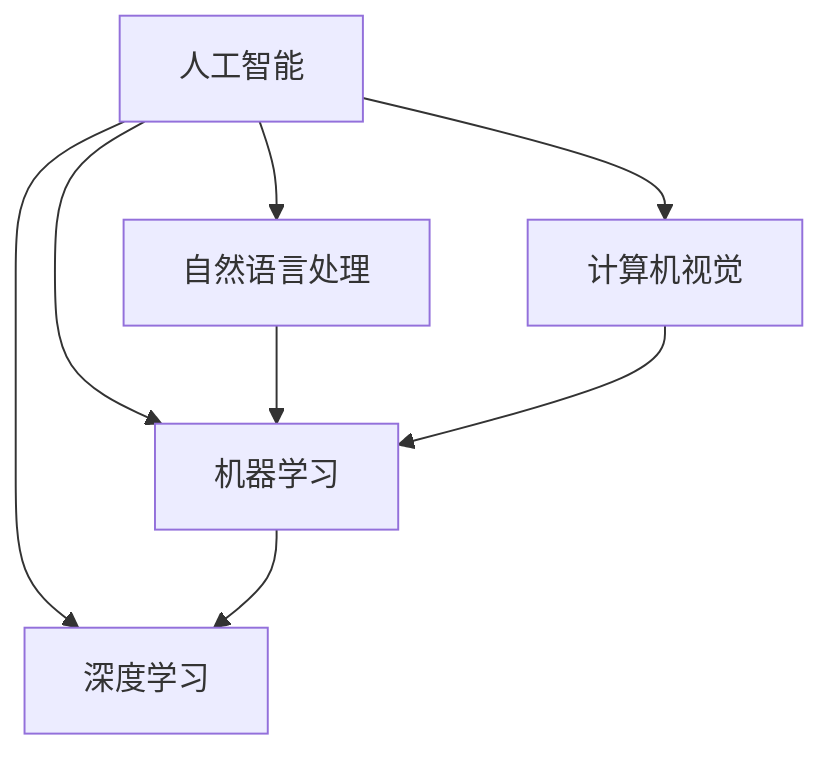

                 

**人工智能的未来愿景**

**作者：禅与计算机程序设计艺术 / Zen and the Art of Computer Programming**

## 1. 背景介绍

人工智能（AI）自诞生以来，就一直是计算机科学领域最具前途和挑战的研究方向之一。从早期的专家系统到当今的深度学习，AI技术已经渗透到我们的日常生活中，从搜索引擎到自动驾驶汽车，无处不在。本文将探讨人工智能的未来愿景，包括其核心概念、算法原理、数学模型，以及实际应用场景。我们还将提供项目实践的代码实例，并推荐相关的学习资源和工具。

## 2. 核心概念与联系

人工智能的核心概念包括机器学习、深度学习、自然语言处理、计算机视觉等。这些概念是相互关联的，共同构成了人工智能的基础。下面是这些概念的简要介绍和它们的关系：

- **机器学习（Machine Learning，ML）**：机器学习是人工智能的一个分支，它使得计算机能够从数据中学习，而无需被明确编程。
- **深度学习（Deep Learning，DL）**：深度学习是机器学习的一个子集，它使用神经网络模型来学习数据的表示，这些模型由多层非线性处理单元组成。
- **自然语言处理（Natural Language Processing，NLP）**：自然语言处理是人工智能的一个分支，它处理计算机和人类语言之间的交互。
- **计算机视觉（Computer Vision，CV）**：计算机视觉是人工智能的另一个分支，它处理计算机如何从数字图像和视频中提取信息。

这些概念的关系如下所示：



## 3. 核心算法原理 & 具体操作步骤

### 3.1 算法原理概述

人工智能的核心算法包括神经网络、决策树、支持向量机等。本节将重点介绍神经网络算法原理。

### 3.2 算法步骤详解

神经网络算法的步骤如下：

1. **输入层（Input Layer）**：接收输入数据。
2. **隐藏层（Hidden Layers）**：对输入数据进行特征提取和表示。
3. **输出层（Output Layer）**：生成输出结果。
4. **前向传播（Forward Propagation）**：计算网络的输出。
5. **反向传播（Backpropagation）**：计算梯度，更新权重和偏置。
6. **优化（Optimization）**：使用优化算法（如梯度下降）更新权重和偏置。

### 3.3 算法优缺点

神经网络算法的优点包括：

- 可以学习复杂的非线性关系。
- 可以自动提取特征。
- 可以处理大规模数据。

缺点包括：

- 训练时间长。
- 易于过拟合。
- 缺乏解释性。

### 3.4 算法应用领域

神经网络算法广泛应用于图像分类、目标检测、语音识别、自然语言处理等领域。

## 4. 数学模型和公式 & 详细讲解 & 举例说明

### 4.1 数学模型构建

神经网络的数学模型可以表示为：

$$y = f(wx + b)$$

其中，$x$是输入，$y$是输出，$w$是权重，$b$是偏置，$f$是激活函数。

### 4.2 公式推导过程

神经网络的梯度可以使用链式法则推导：

$$\frac{\partial E}{\partial w} = \frac{\partial E}{\partial y} \frac{\partial y}{\partial w}$$

$$\frac{\partial E}{\partial b} = \frac{\partial E}{\partial y} \frac{\partial y}{\partial b}$$

其中，$E$是误差函数。

### 4.3 案例分析与讲解

例如，在图像分类任务中，输入$x$是图像的像素值，输出$y$是图像的类别。神经网络可以学习从像素值中提取特征，并将其映射到相应的类别。

## 5. 项目实践：代码实例和详细解释说明

### 5.1 开发环境搭建

本项目使用Python和TensorFlow框架。首先，安装必要的库：

```bash
pip install tensorflow numpy matplotlib
```

### 5.2 源代码详细实现

以下是一个简单的神经网络实现，用于分类手写数字（MNIST数据集）：

```python
import tensorflow as tf
from tensorflow.keras.datasets import mnist
from tensorflow.keras.models import Sequential
from tensorflow.keras.layers import Dense, Flatten

# Load data
(x_train, y_train), (x_test, y_test) = mnist.load_data()
x_train, x_test = x_train / 255.0, x_test / 255.0

# Define model
model = Sequential([
  Flatten(input_shape=(28, 28)),
  Dense(128, activation='relu'),
  Dense(10, activation='softmax')
])

# Compile model
model.compile(optimizer='adam',
              loss='sparse_categorical_crossentropy',
              metrics=['accuracy'])

# Train model
model.fit(x_train, y_train, epochs=5)

# Evaluate model
model.evaluate(x_test, y_test)
```

### 5.3 代码解读与分析

这段代码使用TensorFlow框架定义了一个简单的神经网络模型，用于分类手写数字。模型由一个flatten层和两个dense层组成。模型使用Adam优化器和交叉熵损失函数进行编译。然后，模型在MNIST数据集上进行训练，并评估其准确性。

### 5.4 运行结果展示

运行这段代码后，模型的准确性应该在90%以上。

## 6. 实际应用场景

### 6.1 当前应用

人工智能当前广泛应用于各种领域，包括：

- **计算机视觉**：图像分类、目标检测、人脸识别等。
- **自然语言处理**：语音识别、机器翻译、文本分类等。
- **推荐系统**：个性化推荐、广告目标定位等。

### 6.2 未来应用展望

未来，人工智能的应用将更加广泛，包括自动驾驶汽车、医疗诊断、城市规划等。此外，人工智能还将与物联网、大数据、云计算等技术结合，构成新的技术体系。

## 7. 工具和资源推荐

### 7.1 学习资源推荐

- **书籍**："Deep Learning" by Ian Goodfellow, Yoshua Bengio, and Aaron Courville
- **在线课程**：Coursera的"Deep Learning Specialization"课程
- **博客**：Andrej Karpathy's blog (https://karpathy.github.io/)

### 7.2 开发工具推荐

- **编程语言**：Python
- **框架**：TensorFlow, PyTorch, Keras
- **开发环境**：Jupyter Notebook, Google Colab

### 7.3 相关论文推荐

- "A Neural Algorithm of Artistic Style" by Gatys et al.
- "ImageNet Classification with Deep Convolutional Neural Networks" by Krizhevsky et al.

## 8. 总结：未来发展趋势与挑战

### 8.1 研究成果总结

人工智能已经取得了巨大的成就，从图像分类到语音识别，无处不在。然而，仍然存在许多挑战需要解决。

### 8.2 未来发展趋势

未来，人工智能的发展趋势包括：

- **自监督学习**：自监督学习可以帮助模型从未标记的数据中学习。
- **生成式模型**：生成式模型可以生成新的、看起来真实的数据。
- **可解释的人工智能**：可解释的人工智能可以帮助我们理解模型的决策过程。

### 8.3 面临的挑战

人工智能面临的挑战包括：

- **数据隐私**：人工智能模型需要大量的数据，但获取这些数据可能会侵犯隐私。
- **偏见**：人工智能模型可能会受到训练数据的偏见影响。
- **计算资源**：训练大型模型需要大量的计算资源。

### 8.4 研究展望

未来，人工智能的研究将集中在解决上述挑战，并开发新的算法和模型，以提高人工智能的性能和可解释性。

## 9. 附录：常见问题与解答

**Q：什么是人工智能？**

A：人工智能是计算机科学的一个分支，旨在使计算机能够执行通常需要人类智能的任务。

**Q：人工智能有哪些应用领域？**

A：人工智能有许多应用领域，包括计算机视觉、自然语言处理、推荐系统等。

**Q：人工智能面临哪些挑战？**

A：人工智能面临的挑战包括数据隐私、偏见、计算资源等。

## 结束语

人工智能是当今最具前途和挑战的技术之一。本文介绍了人工智能的核心概念、算法原理、数学模型，并提供了项目实践的代码实例。我们还推荐了相关的学习资源和工具。未来，人工智能的发展将面临许多挑战，但我们相信，通过不断的研究和创新，人工智能将继续取得巨大的成就。

**作者：禅与计算机程序设计艺术 / Zen and the Art of Computer Programming**

