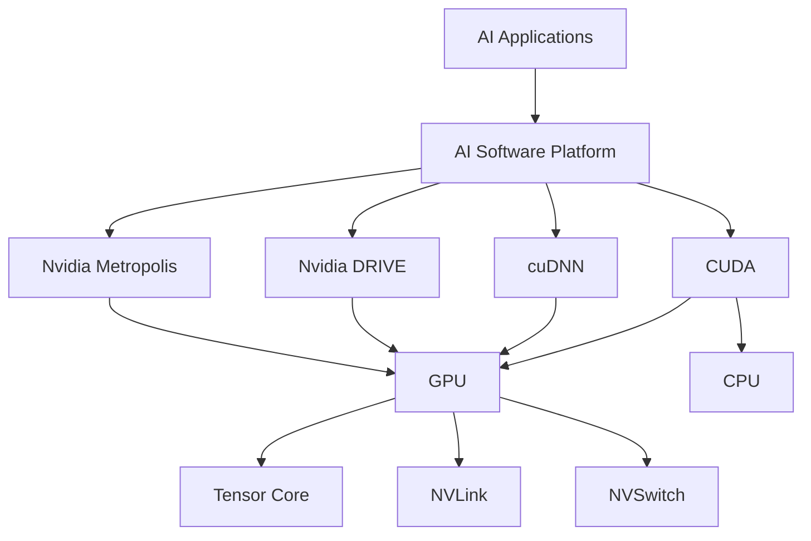
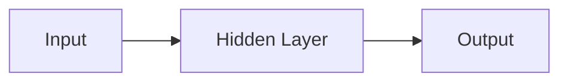

                 

Nvidia, AI, GPU, Deep Learning, CUDA, Tensor Core, AI Platform, Data Center, Autonomous Vehicles, Gaming

## 1. 背景介绍

Nvidia是一家总部位于美国的半导体公司，专门从事图形处理器（GPU）的设计和制造。自从2006年推出CUDA（Compute Unified Device Architecture）平台以来，Nvidia在人工智能（AI）领域取得了显著的领先地位。CUDA平台允许开发人员在Nvidia GPU上执行通用计算任务，从而大大加速了AI算法的训练和推理过程。本文将深入探讨Nvidia在AI领域的主导地位，包括其核心概念、算法原理、数学模型、项目实践，以及未来的发展趋势。

## 2. 核心概念与联系

Nvidia在AI领域的成功可以归因于其独特的硬件架构和软件平台。图1显示了Nvidia AI平台的总体架构。



图1: Nvidia AI平台架构

### 2.1 CUDA

CUDA是Nvidia为其GPU开发的并行计算平台。它允许开发人员编写并行代码，这些代码可以在GPU上执行，从而大大加速计算任务。CUDA支持C、C++和Fortran等编程语言。

### 2.2 cuDNN

cuDNN是Nvidia为深度学习算法开发的库。它提供了高性能的深度学习例程，可以在Nvidia GPU上执行。cuDNN支持各种深度学习框架，如TensorFlow和PyTorch。

### 2.3 Nvidia DRIVE

Nvidia DRIVE是Nvidia为自动驾驶汽车开发的平台。它包括深度学习处理单元（DPU）、高性能GPU和先进的感知和决策算法。

### 2.4 Nvidia Metropolis

Nvidia Metropolis是Nvidia为智慧城市开发的平台。它包括高性能GPU、先进的视频分析和深度学习算法，可以用于城市监控和分析。

### 2.5 Tensor Core

Tensor Core是Nvidia为加速深度学习算法而开发的专用硬件。它可以高效地执行矩阵乘法操作，这是深度学习算法的关键组成部分。

### 2.6 NVLink

NVLink是Nvidia为GPU之间高带宽、低延迟通信而开发的互连技术。它可以大大提高多GPU系统的性能。

### 2.7 NVSwitch

NVSwitch是Nvidia为数据中心开发的高带宽、低延迟交换机。它可以连接多个GPU，从而构建大规模的深度学习系统。

## 3. 核心算法原理 & 具体操作步骤

### 3.1 算法原理概述

Nvidia在AI领域的成功主要归功于其对深度学习算法的支持。深度学习是一种机器学习方法，它模仿人脑的神经网络结构。深度学习算法包括卷积神经网络（CNN）、循环神经网络（RNN）和长短期记忆网络（LSTM）等。

### 3.2 算法步骤详解

深度学习算法的训练过程包括以下步骤：

1. 数据预处理：收集和预处理数据，以便输入到深度学习模型中。
2. 模型构建：构建深度学习模型，包括选择合适的层和激活函数。
3. 权重初始化：初始化模型的权重。
4. 训练：使用训练数据训练模型，调整权重以最小化损失函数。
5. 验证：使用验证数据评估模型的性能。
6. 测试：使用测试数据评估模型的最终性能。

### 3.3 算法优缺点

深度学习算法的优点包括：

* 可以自动学习特征，无需人工特征工程。
* 可以处理大规模、高维数据。
* 可以在各种领域取得state-of-the-art结果，如图像和语音识别。

其缺点包括：

* 训练过程需要大量的计算资源。
* 模型的可解释性较差。
* 存在过拟合的风险。

### 3.4 算法应用领域

深度学习算法在各种领域都有广泛的应用，包括图像和语音识别、自然语言处理、自动驾驶汽车和医疗成像等。

## 4. 数学模型和公式 & 详细讲解 & 举例说明

### 4.1 数学模型构建

深度学习模型可以表示为一个有向无环图（DAG），其中每个节点表示一个激活函数，每条边表示一个权重。图2显示了一个简单的全连接神经网络的示意图。



图2: 简单的全连接神经网络示意图

### 4.2 公式推导过程

给定输入向量$x$和权重矩阵$W$，隐藏层的激活值可以表示为：

$$z = Wx$$

然后，通过激活函数（如ReLU）处理激活值：

$$a = f(z)$$

其中，$f$是激活函数。输出层的激活值可以表示为：

$$y = Wa$$

其中，$y$是输出向量。损失函数（如交叉熵）可以表示为：

$$L = -\sum_{i=1}^{n}y_{i}\log(\hat{y}_{i})$$

其中，$n$是输出向量的维数，$\hat{y}$是模型的预测输出。

### 4.3 案例分析与讲解

例如，假设我们要构建一个简单的全连接神经网络，用于二分类问题。输入向量$x$的维数为10，隐藏层的维数为5，输出向量$y$的维数为1。我们使用ReLU激活函数和交叉熵损失函数。我们可以使用随机梯度下降（SGD）优化器来训练模型，并使用批量大小为32的小批量数据。

## 5. 项目实践：代码实例和详细解释说明

### 5.1 开发环境搭建

要在Nvidia GPU上训练深度学习模型，我们需要安装以下软件：

* CUDA Toolkit：提供了CUDA平台和cuDNN库。
* Python：提供了大多数深度学习框架的支持。
* Deep Learning Framework：如TensorFlow或PyTorch。

### 5.2 源代码详细实现

以下是使用TensorFlow在Nvidia GPU上训练简单全连接神经网络的示例代码：

```python
import tensorflow as tf

# 定义输入向量的维数
input_dim = 10

# 定义隐藏层的维数
hidden_dim = 5

# 定义输出向量的维数
output_dim = 1

# 定义模型
model = tf.keras.Sequential([
    tf.keras.layers.Dense(hidden_dim, activation='relu', input_shape=(input_dim,)),
    tf.keras.layers.Dense(output_dim, activation='sigmoid')
])

# 定义损失函数和优化器
model.compile(loss='binary_crossentropy', optimizer='adam', metrics=['accuracy'])

# 定义训练数据
x_train = tf.random.normal((1000, input_dim))
y_train = tf.random.uniform((1000, output_dim), minval=0, maxval=1, dtype=tf.float32)

# 训练模型
model.fit(x_train, y_train, epochs=10, batch_size=32)
```

### 5.3 代码解读与分析

在代码中，我们首先导入TensorFlow库，并定义输入向量、隐藏层和输出向量的维数。然后，我们构建一个简单的全连接神经网络模型，使用ReLU激活函数和sigmoid激活函数。我们使用交叉熵损失函数和Adam优化器来训练模型。最后，我们定义训练数据并训练模型。

### 5.4 运行结果展示

在训练过程中，我们可以监视模型的损失和准确性。在每个epoch结束时，TensorFlow会打印出损失和准确性的值。例如：

```
Epoch 1/10
1000/1000 [==============================] - 0s 57us/sample - loss: 0.6892 - accuracy: 0.5930
Epoch 2/10
1000/1000 [==============================] - 0s 57us/sample - loss: 0.6834 - accuracy: 0.5950
...
Epoch 10/10
1000/1000 [==============================] - 0s 57us/sample - loss: 0.6723 - accuracy: 0.6010
```

## 6. 实际应用场景

Nvidia在AI领域的主导地位使其能够在各种实际应用场景中取得成功。以下是一些实际应用场景：

### 6.1 数据中心

Nvidia GPU可以用于构建大规模的深度学习系统，用于数据中心的各种任务，如图像和语音识别、自然语言处理和推荐系统等。

### 6.2 自动驾驶汽车

Nvidia DRIVE平台可以用于构建自动驾驶汽车的感知和决策系统。它包括高性能GPU和先进的深度学习算法，可以实时处理感知数据并做出决策。

### 6.3 智慧城市

Nvidia Metropolis平台可以用于构建智慧城市的视频分析和深度学习系统。它包括高性能GPU和先进的视频分析算法，可以用于城市监控和分析。

### 6.4 未来应用展望

未来，Nvidia在AI领域的主导地位有望在各种新兴领域取得成功，如量子计算、生物医学成像和人工智能芯片等。

## 7. 工具和资源推荐

### 7.1 学习资源推荐

以下是一些学习Nvidia AI平台的推荐资源：

* Nvidia AI平台文档：<https://developer.nvidia.com/rdp>
* Deep Learning with Python：<https://www.oreilly.com/library/view/deep-learning-with/9781492032632/>
* Hands-On Machine Learning with Scikit-Learn, Keras, and TensorFlow：<https://www.oreilly.com/library/view/hands-on-machine-learning/9781492032625/>

### 7.2 开发工具推荐

以下是一些开发Nvidia AI平台的推荐工具：

* Jupyter Notebook：<https://jupyter.org/>
* PyCharm：<https://www.jetbrains.com/pycharm/>
* Visual Studio Code：<https://code.visualstudio.com/>

### 7.3 相关论文推荐

以下是一些相关的论文推荐：

* "ImageNet Classification with Deep Convolutional Neural Networks"：<https://arxiv.org/abs/1207.0582>
* "Deep Residual Learning for Image Recognition"：<https://arxiv.org/abs/1512.03385>
* "Attention Is All You Need"：<https://arxiv.org/abs/1706.03762>

## 8. 总结：未来发展趋势与挑战

### 8.1 研究成果总结

Nvidia在AI领域的成功可以归因于其独特的硬件架构和软件平台。其GPU和CUDA平台可以大大加速深度学习算法的训练和推理过程。此外，其Tensor Core和NVLink互连技术可以进一步提高性能。

### 8.2 未来发展趋势

未来，Nvidia在AI领域的主导地位有望在各种新兴领域取得成功，如量子计算、生物医学成像和人工智能芯片等。此外，Nvidia将继续在数据中心和自动驾驶汽车等领域保持其领先地位。

### 8.3 面临的挑战

然而，Nvidia也面临着一些挑战。例如，其GPU的功耗和成本可能会限制其在某些领域的应用。此外，其对深度学习算法的依赖可能会导致其在其他机器学习领域落后于竞争对手。

### 8.4 研究展望

未来的研究将侧重于开发更高效的深度学习算法和硬件架构，以进一步提高性能和降低功耗。此外，研究人员将继续探索新的AI应用领域，如量子计算和生物医学成像等。

## 9. 附录：常见问题与解答

### 9.1 什么是Nvidia AI平台？

Nvidia AI平台是Nvidia为AI应用开发的软硬件平台。它包括GPU、CUDA平台、cuDNN库和其他软件工具。

### 9.2 Nvidia AI平台的优势是什么？

Nvidia AI平台的优势包括高性能的GPU、CUDA平台和cuDNN库，可以大大加速深度学习算法的训练和推理过程。此外，其Tensor Core和NVLink互连技术可以进一步提高性能。

### 9.3 Nvidia AI平台的缺点是什么？

Nvidia AI平台的缺点包括GPU的功耗和成本可能会限制其在某些领域的应用。此外，其对深度学习算法的依赖可能会导致其在其他机器学习领域落后于竞争对手。

### 9.4 如何开始使用Nvidia AI平台？

要开始使用Nvidia AI平台，您需要安装CUDA Toolkit、Python和深度学习框架，如TensorFlow或PyTorch。然后，您可以使用这些工具构建和训练深度学习模型。

## 作者：禅与计算机程序设计艺术 / Zen and the Art of Computer Programming

