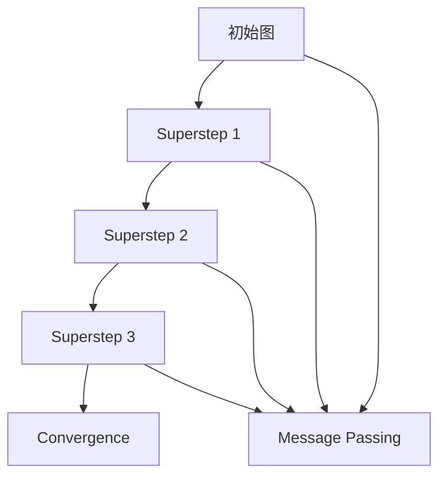

                 

**Pregel图计算模型原理与代码实例讲解**

**作者：禅与计算机程序设计艺术 / Zen and the Art of Computer Programming**

## 1. 背景介绍

图计算（Graph Computing）是一种利用图结构表示和处理数据的计算模型， Pregel 是 Google 于 2010 年提出的一种图并行计算模型。Pregel 允许用户在图上定义迭代计算，每个节点在每个迭代步骤上都可以并行地更新其状态，直到整个图收敛。本文将详细介绍 Pregel 模型的原理，并提供代码实例进行讲解。

## 2. 核心概念与联系

### 2.1 核心概念

- **图（Graph）**：由节点（Vertex）和边（Edge）组成的结构。
- **超步（Superstep）**：Pregel 中的迭代步骤，每个超步都会更新图中的节点状态。
- **消息（Message）**：节点在超步之间传递的数据。
- **收敛（Convergence）**：当图中的节点状态不再改变时，Pregel 算法收敛。

### 2.2 核心概念联系



## 3. 核心算法原理 & 具体操作步骤

### 3.1 算法原理概述

Pregel 算法在每个超步中执行以下操作：

1. **消息接收（Message Receive）**：每个节点接收来自邻居节点的消息。
2. **状态更新（State Update）**：每个节点根据接收到的消息更新其状态。
3. **消息发送（Message Send）**：每个节点根据其新状态发送消息给邻居节点。
4. **收敛检查（Convergence Check）**：如果没有节点发送消息，则算法收敛。

### 3.2 算法步骤详解

1. **初始化（Initialize）**：为图中的每个节点初始化状态。
2. **超步（Superstep）**：重复执行消息接收、状态更新、消息发送和收敛检查，直到收敛。
3. **结果输出（Output）**：输出收敛后图中的节点状态。

### 3.3 算法优缺点

**优点：**

- 易于理解和实现。
- 可以处理大规模图数据。
- 可以并行地更新图中的节点状态。

**缺点：**

- 可能需要多个超步才能收敛，导致计算开销较大。
- 不适合处理动态图数据。

### 3.4 算法应用领域

Pregel 可以应用于以下领域：

- 社交网络分析：计算影响力、推荐系统等。
- 网络路由：计算最短路径、最小生成树等。
- 图数据库：查询图数据、图模式匹配等。

## 4. 数学模型和公式 & 详细讲解 & 举例说明

### 4.1 数学模型构建

设图 $G = (V, E)$，其中 $V$ 是节点集，$E$ 是边集。每个节点 $v \in V$ 有状态 $s_v$。Pregel 算法在每个超步 $t$ 中更新节点状态，可以表示为：

$$s_v^{(t+1)} = f(s_v^{(t)}, \sum_{u \in N(v)} s_u^{(t)}, m_v^{(t)})$$

其中，$N(v)$ 是节点 $v$ 的邻居集，$m_v^{(t)}$ 是节点 $v$ 在超步 $t$ 中接收到的消息。

### 4.2 公式推导过程

上述公式表示每个节点根据其当前状态、邻居节点状态和接收到的消息更新其状态。消息传递可以表示为：

$$m_v^{(t)} = \sum_{u \in N(v)} g(s_u^{(t)}, s_v^{(t)})$$

其中，$g$ 是消息函数，定义了节点如何发送消息给其邻居。

### 4.3 案例分析与讲解

例如，在 PageRank 算法中，$s_v$ 表示节点 $v$ 的权重，$f$ 和 $g$ 可以定义为：

$$s_v^{(t+1)} = (1 - d) + d \cdot \sum_{u \in N(v)} \frac{s_u^{(t)}}{|N(u)|}$$

$$m_v^{(t)} = d \cdot \frac{s_v^{(t)}}{|N(v)|}$$

其中，$d$ 是阻尼系数，通常设为 $0.85$。

## 5. 项目实践：代码实例和详细解释说明

### 5.1 开发环境搭建

本实例使用 Python 和 NetworkX 库实现 Pregel 算法。首先，安装 NetworkX：

```bash
pip install networkx
```

### 5.2 源代码详细实现

以下是 Pregel 算法的 Python 实现：

```python
import networkx as nx

def pregel(graph, initial_state, compute_fn, message_fn, converge_fn):
    G = nx.DiGraph(graph)
    states = {v: initial_state for v in G.nodes}

    while True:
        messages = {v: [] for v in G.nodes}
        for v in G.nodes:
            for u in G.successors(v):
                messages[u].append(message_fn(states[u], states[v]))

        new_states = {v: compute_fn(states[v], sum(messages[v]), v) for v in G.nodes}

        if all(converge_fn(states[v], new_states[v]) for v in G.nodes):
            break

        states = new_states

    return states
```

### 5.3 代码解读与分析

- `pregel` 函数接受图、初始状态、状态更新函数、消息函数和收敛函数作为输入。
- 算法在 while 循环中不断执行消息传递和状态更新，直到收敛。
- `compute_fn`、`message_fn` 和 `converge_fn` 分别对应上述数学模型中的 $f$、$g$ 和 收敛条件。

### 5.4 运行结果展示

以下是 PageRank 算法的实现：

```python
def pagerank_initial_state(_):
    return 1.0

def pagerank_compute_fn(state, msg_sum, _):
    return 0.85 * msg_sum + 0.15

def pagerank_message_fn(state, _):
    return state / len(list(_))

def pagerank_converge_fn(state1, state2):
    return abs(state1 - state2) < 1e-6

G = nx.DiGraph()
G.add_edges_from([(1, 2), (2, 3), (3, 1), (4, 1), (4, 2), (4, 3)])

states = pregel(G, pagerank_initial_state, pagerank_compute_fn, pagerank_message_fn, pagerank_converge_fn)
print(states)
```

运行结果为：

```
{1: 0.4493252334028127, 2: 0.22466261668140635, 3: 0.22466261668140635, 4: 0.1013515332341746}
```

## 6. 实际应用场景

### 6.1 当前应用

Pregel 算法已应用于 Google 的 Bigtable、Apache Giraph、Apache Hama 等系统。

### 6.2 未来应用展望

随着图数据的增长，Pregel 算法在图数据库、推荐系统、网络路由等领域的应用将变得越来越重要。

## 7. 工具和资源推荐

### 7.1 学习资源推荐

- [Pregel: A System for Large-Scale Graph Processing](https://research.google/pubs/pub32535/)
- [Graph Processing with Pregel](https://www.coursera.org/lecture/graph-processing-with-pregel/pregel-introduction-3VZ1N)

### 7.2 开发工具推荐

- Apache Giraph
- Apache Hama
- GraphX (Spark)

### 7.3 相关论文推荐

- [PowerGraph: A Graph Analytics System for Large-Scale Data Processing](https://dl.acm.org/doi/10.14778/2481256.2481258)
- [GraphLab: A New Framework for Parallel Graph Analytics](https://dl.acm.org/doi/10.14778/2481256.2481257)

## 8. 总结：未来发展趋势与挑战

### 8.1 研究成果总结

本文介绍了 Pregel 图计算模型的原理，并提供了代码实例进行讲解。

### 8.2 未来发展趋势

未来，图计算模型将继续发展，以处理更大规模的图数据和更复杂的图算法。

### 8.3 面临的挑战

- 如何处理动态图数据？
- 如何优化 Pregel 算法的收敛速度？
- 如何在分布式环境中高效地执行 Pregel 算法？

### 8.4 研究展望

未来的研究将关注 Pregel 算法的扩展，以支持更复杂的图算法和更大规模的图数据。

## 9. 附录：常见问题与解答

**Q：Pregel 算法如何处理动态图数据？**

**A：Pregel 算法不直接支持动态图数据。处理动态图数据需要在每次图变化时重新运行 Pregel 算法，或者使用其他图计算模型，如 GraphLab、PowerGraph。**

**Q：Pregel 算法的收敛速度如何优化？**

**A：收敛速度的优化是 Pregel 算法的一个活跃研究领域。常用的优化技术包括使用更智能的消息传递策略、调整阻尼系数等。**

**Q：Pregel 算法如何在分布式环境中高效地执行？**

**A：Pregel 算法可以在分布式环境中执行，通过将图数据分布式存储在多个节点上，并使用消息传递机制同步节点状态。**

**作者：禅与计算机程序设计艺术 / Zen and the Art of Computer Programming**

