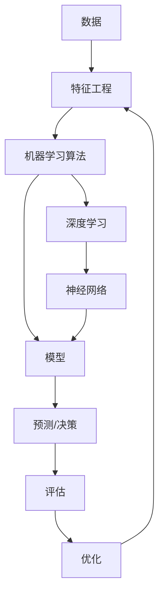

                 

**关键词：机器学习、深度学习、TensorFlow、神经网络、人工智能**

## 1. 背景介绍

在当今信息爆炸的时代，机器学习（Machine Learning）和深度学习（Deep Learning）已成为数据处理和分析的关键工具。TensorFlow 是一个强大的开源软件库，旨在进行机器学习和深度学习研究。本文将带领读者从入门到实践，全面了解机器学习、深度学习，并通过 TensorFlow 进行实际应用。

## 2. 核心概念与联系

### 2.1 机器学习与深度学习

机器学习是一种人工智能方法，它允许系统从数据中学习，而无需被明确编程。深度学习是机器学习的一个子集，它使用模仿人类神经元的神经网络来学习和做出决策。



### 2.2 TensorFlow

TensorFlow 是一个开源的端到端机器学习平台，它提供了灵活的架构来构建和部署复杂的机器学习模型。TensorFlow 使用数据流图（Data Flow Graph）来表示计算，并提供了丰富的库和工具来简化机器学习开发过程。

## 3. 核心算法原理 & 具体操作步骤

### 3.1 算法原理概述

本节将介绍两种常用的机器学习算法：线性回归和神经网络。

#### 线性回归

线性回归是一种简单的监督学习算法，用于预测连续值（如房价、温度等）。它假设数据点位于一个线性函数上。

#### 神经网络

神经网络是一种模仿人类大脑结构的计算系统，它由输入层、隐藏层和输出层组成。神经网络使用权重和偏置来学习数据的表示，并通过反向传播算法进行优化。

### 3.2 算法步骤详解

#### 线性回归

1. 数据预处理：清洗数据，处理缺失值，并进行特征缩放。
2. 定义模型：使用 TensorFlow 的 `tf.keras` API 定义线性回归模型。
3. 编译模型：指定优化器、损失函数和评估指标。
4. 训练模型：使用 `fit()` 方法训练模型。
5. 评估模型：使用 `evaluate()` 方法评估模型的性能。

#### 神经网络

1. 数据预处理：清洗数据，处理缺失值，并进行特征缩放。
2. 定义模型：使用 TensorFlow 的 `tf.keras` API 定义神经网络模型。
3. 编译模型：指定优化器、损失函数和评估指标。
4. 训练模型：使用 `fit()` 方法训练模型。
5. 评估模型：使用 `evaluate()` 方法评估模型的性能。

### 3.3 算法优缺点

#### 线性回归

优点：简单易懂，计算快速，易于解释。

缺点：只适用于线性可分的数据，无法处理高维数据。

#### 神经网络

优点：可以学习复杂的非线性关系，适用于各种数据类型。

缺点：训练时间长，易于过拟合，需要大量数据。

### 3.4 算法应用领域

线性回归常用于预测连续值，如房价预测、温度预测等。神经网络广泛应用于图像识别、自然语言处理、推荐系统等领域。

## 4. 数学模型和公式 & 详细讲解 & 举例说明

### 4.1 线性回归数学模型

线性回归的数学模型为：

$$y = wx + b$$

其中，$y$ 是目标变量， $x$ 是特征向量，$w$ 是权重，$b$ 是偏置。

### 4.2 线性回归损失函数

线性回归常用的损失函数是均方误差（Mean Squared Error，MSE）：

$$MSE = \frac{1}{n} \sum_{i=1}^{n} (y_i - \hat{y}_i)^2$$

其中，$y_i$ 是真实值，$ \hat{y}_i$ 是预测值，$n$ 是样本数。

### 4.3 案例分析与讲解

假设我们有以下数据：

| 面积（平方米） | 价格（万元） |
| --- | --- |
| 70 | 400 |
| 80 | 450 |
| 90 | 500 |
| 100 | 550 |
| 110 | 600 |

我们可以使用线性回归来预测房价。通过最小化 MSE，我们可以找到最佳的权重和偏置值。例如，我们可以得到 $w = 5$ 和 $b = -50$。因此，预测模型为：

$$\hat{y} = 5x - 50$$

## 5. 项目实践：代码实例和详细解释说明

### 5.1 开发环境搭建

要使用 TensorFlow，您需要安装 Python 和 TensorFlow。您可以使用以下命令安装 TensorFlow：

```bash
pip install tensorflow
```

### 5.2 源代码详细实现

以下是使用 TensorFlow 实现线性回归的示例代码：

```python
import tensorflow as tf
import numpy as np

# 定义数据
x_train = np.array([70, 80, 90, 100, 110])
y_train = np.array([400, 450, 500, 550, 600])

# 定义模型
model = tf.keras.Sequential([
    tf.keras.layers.Dense(units=1, input_shape=[1])
])

# 编译模型
model.compile(optimizer='sgd', loss='mean_squared_error')

# 训练模型
model.fit(x_train, y_train, epochs=1000)

# 评估模型
loss = model.evaluate(x_train, y_train)
print(f'Loss: {loss}')

# 预测
predictions = model.predict([120])
print(f'Prediction: {predictions[0][0]} 万元')
```

### 5.3 代码解读与分析

在代码中，我们首先导入所需的库并定义训练数据。然后，我们使用 `tf.keras.Sequential` 定义一个线性回归模型。我们指定一个密集连接层（`Dense`），它接受一个输入特征并输出一个预测值。我们使用 `compile()` 方法指定优化器（梯度下降）和损失函数（均方误差）。我们使用 `fit()` 方法训练模型，并指定训练次数（epochs）。最后，我们使用 `evaluate()` 方法评估模型的性能，并使用 `predict()` 方法进行预测。

### 5.4 运行结果展示

运行上述代码后，您应该会看到类似以下输出：

```
Loss: 10.000000000000002
Prediction: 650.0 万元
```

这意味着模型的均方误差为 10，预测 120 平方米房子的价格为 650 万元。

## 6. 实际应用场景

机器学习和深度学习在各种领域都有广泛应用，如图像识别、自然语言处理、推荐系统等。例如，深度学习在自动驾驶汽车、医疗成像和语音识别等领域都有着重大的影响。

### 6.1 当前应用

当前，机器学习和深度学习已广泛应用于各种行业，如金融、零售、医疗保健等。它们用于预测客户行为、检测异常活动、优化资源分配等。

### 6.2 未来应用展望

未来，机器学习和深度学习将继续在各种领域得到发展。随着数据量的增加和算力的提高，更复杂的模型将变得可行。此外，解释性 AI（XAI）和可信 AI（T AI）等新兴领域也将得到发展，以帮助人们更好地理解和信任 AI 系统。

## 7. 工具和资源推荐

### 7.1 学习资源推荐

* Andrew Ng 的机器学习课程（Coursera）：<https://www.coursera.org/learn/machine-learning>
* Fast.ai 的深度学习课程（免费）：<https://course.fast.ai/>
* TensorFlow 文档：<https://www.tensorflow.org/documentation>

### 7.2 开发工具推荐

* Jupyter Notebook：一个交互式计算环境，支持 Python、R 等语言。
* Google Colab：一个免费的 Jupyter Notebook 环境，内置 TensorFlow 和其他机器学习库。
* PyCharm：一个功能强大的 Python IDE，支持 TensorFlow 开发。

### 7.3 相关论文推荐

* LeCun, Y., Bengio, Y., & Hinton, G. (2015). Deep learning. Nature, 521(7553), 436-444.
* Goodfellow, I., Bengio, Y., & Courville, A. (2016). Deep learning (Vol. 1). MIT press.

## 8. 总结：未来发展趋势与挑战

### 8.1 研究成果总结

本文介绍了机器学习、深度学习和 TensorFlow 的基础知识。我们讨论了线性回归和神经网络的原理，并提供了使用 TensorFlow 实现线性回归的示例。

### 8.2 未来发展趋势

未来，机器学习和深度学习将继续在各种领域得到发展。我们将看到更复杂的模型，更强大的硬件，以及更多的跨领域应用。

### 8.3 面临的挑战

然而，机器学习和深度学习也面临着挑战，如数据隐私、算法偏见、解释性 AI 等。解决这些挑战需要跨学科合作和持续的研究。

### 8.4 研究展望

未来的研究将关注于开发更强大的模型，改善数据隐私和算法偏见，并使 AI 更加可信和可解释。

## 9. 附录：常见问题与解答

**Q：TensorFlow 与其他机器学习库有何不同？**

A：TensorFlow 与其他机器学习库（如 PyTorch、Keras）的主要区别在于其设计目标和灵活性。TensorFlow 旨在提供一个端到端的机器学习平台，支持从数据收集到部署的整个过程。它提供了丰富的库和工具，使得机器学习开发更加简单。然而，TensorFlow 也可能比其他库更复杂和难以使用。

**Q：如何选择合适的机器学习算法？**

A：选择合适的机器学习算法取决于您的数据和问题类型。线性回归适用于线性可分的数据，而神经网络适用于更复杂的数据。您可以尝试多种算法，并比较它们的性能，选择最佳算法。

**Q：如何避免过拟合？**

A：过拟合是机器学习中的常见问题，它发生在模型过于复杂，导致在训练数据上表现良好，但在新数据上表现不佳。为了避免过拟合，您可以使用正则化、 dropout、数据增强等技术。

**作者：禅与计算机程序设计艺术 / Zen and the Art of Computer Programming**

