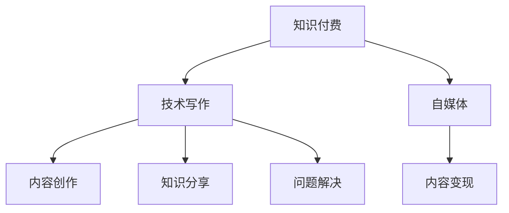

                 

# 知识付费与技术写作:程序员的双赢策略

> 关键词：知识付费,技术写作,程序员,双赢策略,内容变现,自媒体

## 1. 背景介绍

### 1.1 问题由来

随着互联网技术的发展，知识付费平台逐渐成为一股不可忽视的力量。技术的进步使得信息传播的门槛降低，知识创作者可以更方便地将自己的知识转化为有形的价值。与此同时，信息技术专业人员也越来越受到重视，他们在技术写作和自媒体方面的能力，成为了个人品牌塑造和价值变现的重要途径。

然而，如何平衡技术写作与知识付费的关系，最大化地实现二者的协同效应，是一个值得深入探讨的问题。本文旨在通过探讨知识付费与技术写作之间的联系，为程序员提供一套双赢策略，帮助他们在互联网时代更好地实现个人价值和职业发展。

### 1.2 问题核心关键点

知识付费与技术写作的结合点在于内容创作和价值变现。通过技术写作，程序员可以分享自己的经验、见解和研究，帮助他人解决问题。同时，知识付费平台也为这些创作者提供了展示自我、获取收益的渠道。因此，本文聚焦于如何通过技术写作在知识付费平台上变现，以及如何提升技术写作的内容质量，为读者带来更多的价值。

## 2. 核心概念与联系

### 2.1 核心概念概述

为更好地理解知识付费与技术写作的结合，本节将介绍几个关键概念：

- **知识付费**：指通过网络平台为特定知识提供付费获取的业务模式。知识付费的兴起得益于互联网技术的普及和人们对于高质量信息的追求。
- **技术写作**：指通过撰写技术类文章、博客、教程等形式，分享专业知识和经验的过程。技术写作有助于知识的传播和创新。
- **自媒体**：指利用互联网平台自主发布内容，形成一定规模和影响力的个人或组织。自媒体的内容可以是技术写作、视频、直播等多种形式。
- **内容变现**：指通过自媒体平台，将创作的内容转化为经济效益的过程。内容变现的形式包括广告、打赏、付费文章、付费课程等。

这些概念之间的逻辑关系可以通过以下Mermaid流程图来展示：



这个流程图展示了知识付费、技术写作、自媒体、内容变现等概念之间的联系：

1. 知识付费为技术写作和自媒体提供了平台。
2. 技术写作和自媒体内容是知识付费的基础。
3. 内容变现是技术写作和自媒体的最终目标。

## 3. 核心算法原理 & 具体操作步骤
### 3.1 算法原理概述

知识付费与技术写作的结合过程，本质上是一个内容创作与价值变现的优化过程。其核心思想是：通过技术写作，生成高质量的内容，吸引和锁定目标读者，并通过知识付费平台实现内容变现。

形式化地，假设知识创作者在平台上有 $N$ 个读者，每个读者对内容的支付意愿为 $p_i$，内容的价值为 $v$。知识付费平台的目标是最大化总收入 $R$，即：

$$
R = \sum_{i=1}^N p_i \times v_i
$$

其中，$v_i$ 为第 $i$ 个读者的支付意愿与内容价值的乘积。知识创作者的目标是最大化总收入 $R$，即：

$$
R = \sum_{i=1}^N p_i \times v_i
$$

创作者通过内容创作和分享，提升内容价值 $v$，同时通过运营策略提高读者支付意愿 $p_i$。知识付费平台通过算法匹配和推荐，将创作者的内容精准推荐给目标读者，从而提升收入 $R$。

### 3.2 算法步骤详解

知识付费与技术写作的双赢策略主要包括以下几个关键步骤：

**Step 1: 选择合适的平台**

选择一个适合自己内容和风格的知识付费平台。不同的平台有其特色和用户群体，需根据自己的定位选择合适的平台。常见的平台包括知乎、掘金、CSDN、简书等。

**Step 2: 定位和规划内容**

确定自己的定位和目标读者，设计符合市场需求的博客、课程、书籍等内容。内容的选题应结合自己的专业背景和行业热点，同时满足目标读者的需求。

**Step 3: 创作和发布内容**

通过技术写作，创作高质量的内容。内容应具有原创性、实用性、易读性，同时注重排版和视觉效果。发布时选择合适的发布形式和频率，如文章、视频、直播等。

**Step 4: 互动和社群运营**

积极与读者互动，通过评论、私信、社区活动等方式建立联系。建立和维护社群，吸引忠实读者，提升用户粘性和忠诚度。

**Step 5: 运营和变现**

利用平台提供的各种变现渠道，如付费文章、付费课程、广告分成、会员制度等。通过数据分析和用户反馈，优化内容策略和运营方式，提升变现效果。

### 3.3 算法优缺点

知识付费与技术写作的双赢策略具有以下优点：

1. **高效变现**：技术写作的内容可以快速获取收益，无需从零开始积累。
2. **提升专业**：通过写作和分享，创作者能够深化对知识的理解，提升专业水平。
3. **广泛传播**：平台为创作者提供全球范围的曝光机会，有助于扩大个人影响力。

同时，该策略也存在一些局限性：

1. **内容质量要求高**：创作高质量内容需要投入大量时间和精力。
2. **平台竞争激烈**：知识付费平台众多，创作者需不断提升内容质量以获得更多关注。
3. **变现效果受限**：不同平台的变现能力和规则不同，影响创作者的收益。
4. **需要持续投入**：创作和运营需要持续的精力和资源投入。

尽管存在这些局限性，但就目前而言，知识付费与技术写作的结合仍是大势所趋。未来相关研究的重点在于如何进一步优化内容和变现策略，提升创作者的内容质量和收益水平。

### 3.4 算法应用领域

知识付费与技术写作的双赢策略在多个领域都得到了广泛应用，例如：

- **技术博客**：技术创作者通过撰写博客，分享技术知识和经验，吸引大量技术爱好者和同行关注。
- **编程课程**：通过制作编程教程和课程，创作者可以向学生传授编程技巧，获得学费收益。
- **书籍出版**：创作者可以将技术写作成果结集成书，通过出版社或平台进行销售，获取更高的收益。
- **技术讲座和演讲**：通过在平台进行技术讲座或演讲，创作者可以获得高额收入和知名度。

除了这些主流应用外，知识付费与技术写作的双赢策略也被创新性地应用到更多的领域，如技术咨询、技术培训、技术合作等，为技术人才的价值提升和职业发展提供了新的路径。

## 4. 数学模型和公式 & 详细讲解 & 举例说明

### 4.1 数学模型构建

本节将使用数学语言对知识付费与技术写作的结合过程进行更加严格的刻画。

假设知识创作者在平台上有 $N$ 个读者，每个读者对内容的支付意愿为 $p_i$，内容的价值为 $v$。知识付费平台的目标是最大化总收入 $R$，即：

$$
R = \sum_{i=1}^N p_i \times v_i
$$

创作者通过内容创作和分享，提升内容价值 $v$，同时通过运营策略提高读者支付意愿 $p_i$。创作者的目标是最大化总收入 $R$，即：

$$
R = \sum_{i=1}^N p_i \times v_i
$$

创作者的目标是通过技术写作，生成高质量的内容，吸引和锁定目标读者，并通过知识付费平台实现内容变现。平台的目标是通过算法匹配和推荐，将创作者的内容精准推荐给目标读者，从而提升收入 $R$。

### 4.2 公式推导过程

为了更好地理解知识付费与技术写作的结合过程，我们将对其进行简化，假设读者对内容的支付意愿 $p_i$ 与内容价值 $v$ 成正比，即 $p_i \propto v$。则总收入 $R$ 可以表示为：

$$
R = \sum_{i=1}^N p_i \times v_i = \sum_{i=1}^N k_i \times v^2
$$

其中，$k_i$ 为比例系数，代表第 $i$ 个读者的支付意愿对内容价值的敏感度。通过最大化总收入 $R$，可以进一步优化内容创作和运营策略。

创作者的内容价值 $v$ 可以通过技术写作的质量和专业性来衡量。例如，代码示例、问题解决、技术分享等内容的价值，都可以通过作者的专业背景和实际案例来体现。创作者可以通过提高写作质量、增加技术深度、扩大受众范围等方式，提升内容价值 $v$。

### 4.3 案例分析与讲解

假设某技术创作者在知乎上撰写了一篇关于“如何高效使用 Git”的教程。文章发布后，读者支付意愿 $p_i$ 与内容价值 $v$ 的关系如下：

- 内容价值 $v$：该教程详细介绍了 Git 的使用技巧，并提供了实用的代码示例。
- 读者支付意愿 $p_i$：创作者在文章中提到 Git 的高级用法，吸引了一些 Git 高级用户的关注。

创作者可以通过互动和社群运营，进一步提升读者的支付意愿 $p_i$。例如，通过与读者互动回答问题、举办Git学习小组等活动，增加读者的粘性。此外，创作者还可以定期更新内容，添加新的示例和技巧，保持内容的新鲜感和实用价值。

通过不断的优化内容和运营策略，创作者可以提升总收入 $R$，同时提高自身的影响力和专业水平。

## 5. 项目实践：代码实例和详细解释说明
### 5.1 开发环境搭建

在进行知识付费与技术写作的结合实践前，我们需要准备好开发环境。以下是使用Python进行知识付费平台内容创作和发布的环境配置流程：

1. 安装Anaconda：从官网下载并安装Anaconda，用于创建独立的Python环境。

2. 创建并激活虚拟环境：
```bash
conda create -n py-env python=3.8 
conda activate py-env
```

3. 安装Python开发工具包：
```bash
pip install pypandoc ipython
```

4. 安装GitHub和GitHub Pages：
```bash
pip install gitpython
```

5. 安装相关开发工具：
```bash
pip install markdown syntax-highlighter
```

完成上述步骤后，即可在`py-env`环境中开始知识付费与技术写作的结合实践。

### 5.2 源代码详细实现

下面以知乎平台的内容创作和发布为例，给出代码实现。

首先，创建一个Python脚本，用于生成Markdown格式的博客文章：

```python
from markdown import Markdown

# 定义博客文章内容
content = """
# 高效使用 Git

Git 是版本控制系统中的佼佼者，掌握 Git 高级用法，可以提高工作效率。

## Git 的基本操作

1. 克隆仓库
```
克隆仓库到本地
```
2. 创建分支
```
创建新分支
```
3. 提交代码
```
提交代码到本地
```
4. 合并分支
```
合并分支到主分支
```

## Git 的高级用法

1. 交互式重写
```
交互式重写提交历史
```
2. 分支管理
```
合并分支和解决冲突
```
3. 标签管理
```
创建和删除标签
```

## Git 的最佳实践

1. 定期备份
```
定期备份仓库
```
2. 分支命名规范
```
分支命名规范
```
3. 合并冲突处理
```
处理合并冲突
```

...

"""

# 将Markdown转换为HTML
md = Markdown()
html = md.convert(content)

# 保存HTML文件
with open('git.md', 'w') as f:
    f.write(html)

print('博客文章已生成。')
```

然后，在GitHub上创建一个仓库，并部署到GitHub Pages：

1. 在GitHub上创建一个新仓库，上传生成的博客文章。
2. 在仓库设置中，启用GitHub Pages，并配置为使用主分支。
3. 部署完成后，通过GitHub Pages域名访问博客文章。

### 5.3 代码解读与分析

让我们再详细解读一下关键代码的实现细节：

**博客文章生成**：
- `Markdown`：用于将Markdown格式的文本转换为HTML格式。
- `content`：博客文章的内容，包括标题、正文、列表等。
- `md.convert(content)`：将Markdown文本转换为HTML格式。
- `with open('git.md', 'w') as f:`：将生成的HTML内容保存到文件中。

**GitHub Pages部署**：
- 在GitHub上创建新仓库，并上传博客文章。
- 在仓库设置中，启用GitHub Pages，并配置为使用主分支。
- 部署完成后，通过GitHub Pages域名访问博客文章。

可以看到，通过简单的Python脚本和GitHub Pages，知识付费与技术写作的结合就可以轻松实现。开发者可以将更多精力放在内容创作和运营策略上，而不必过多关注底层实现细节。

当然，工业级的系统实现还需考虑更多因素，如读者互动、内容运营、数据统计等。但核心的双赢策略基本与此类似。

## 6. 实际应用场景
### 6.1 知识付费平台的内容创作

知识付费平台为技术创作者提供了展示自我、分享知识、变现收益的机会。在知识付费平台上，技术创作者可以发布技术文章、录制视频教程、举办技术讲座等，吸引目标读者。

以知乎为例，技术创作者可以在知乎上发布专业博客，通过回答技术问题、撰写技术文章等方式，吸引读者关注和赞赏。通过在知乎平台上积累粉丝和好评，创作者可以进一步开启付费课程、书籍出版等变现渠道。

### 6.2 技术博客和自媒体运营

技术博客和自媒体平台为技术创作者提供了展示技术思想和实践的平台。创作者可以通过技术博客分享最新的技术动态、分析技术趋势，吸引技术爱好者和同行关注。通过自媒体平台，创作者可以发布技术文章、录制技术视频、举办技术讲座等，形成一定的个人品牌影响力。

以掘金为例，技术创作者可以在掘金上发布技术文章、录制技术视频、举办技术讲座等，吸引读者关注和赞赏。通过在掘金平台上积累粉丝和好评，创作者可以进一步开启付费课程、书籍出版等变现渠道。

### 6.3 技术课程和培训

技术课程和培训为技术创作者提供了传授技术知识和技能的机会。创作者可以通过制作技术教程和课程，向学生传授编程技巧、设计思路、项目实践等知识，获得学费收益。

以CSDN学院为例，技术创作者可以在CSDN学院上发布技术课程，吸引学生报名学习。通过在CSDN平台上积累学生评价和收入，创作者可以进一步提升自身的知名度和影响力。

### 6.4 未来应用展望

随着知识付费与技术写作的不断演进，未来的应用场景将更加多样化。

在智慧医疗领域，技术创作者可以撰写医疗相关的内容，为患者提供健康知识普及和疾病预防建议。通过知识付费平台，创作者可以分享医疗知识，帮助患者解决问题，获得一定的收益。

在智能教育领域，技术创作者可以开发在线课程和教育资源，为学生提供高质量的学习内容。通过知识付费平台，创作者可以变现自己的教育资源，获取更高的收益。

在智慧城市治理中，技术创作者可以撰写城市管理相关的技术文章，为城市管理者提供决策支持。通过知识付费平台，创作者可以分享城市管理知识，帮助城市管理者解决问题，获得一定的收益。

此外，在企业生产、社会治理、文娱传媒等众多领域，技术创作者的知识付费与技术写作也将不断涌现，为各行各业带来新的变革和机遇。

## 7. 工具和资源推荐
### 7.1 学习资源推荐

为了帮助开发者系统掌握知识付费与技术写作的理论基础和实践技巧，这里推荐一些优质的学习资源：

1. 《技术写作与知识付费》系列博文：由知识付费平台的专家撰写，深入浅出地介绍了技术写作和知识付费的基础知识、操作技巧和实战经验。

2. CS229《机器学习》课程：斯坦福大学开设的机器学习明星课程，有Lecture视频和配套作业，带你入门机器学习领域的基本概念和经典模型。

3. 《内容变现的艺术》书籍：全面介绍了如何通过自媒体平台实现内容变现，包括广告、打赏、付费文章、付费课程等变现策略。

4. Medium博客平台：Medium是全球知名的技术文章分享平台，汇聚了大量技术创作者和文章，可以学习如何提升写作质量和吸引读者。

5. YouTube视频平台：YouTube是全球最大的视频分享平台，聚集了大量技术创作者和讲座资源，可以学习如何通过视频内容变现。

通过对这些资源的学习实践，相信你一定能够快速掌握知识付费与技术写作的精髓，并用于解决实际的NLP问题。

### 7.2 开发工具推荐

高效的开发离不开优秀的工具支持。以下是几款用于知识付费与技术写作开发的常用工具：

1. Jupyter Notebook：基于Web的交互式编程环境，支持Markdown和代码混排，方便创作者快速迭代内容。

2. Markdown编辑器：如Typora、GitHub Pages等，提供Markdown格式的文本编辑器，方便创作者撰写和编辑技术文章。

3. GitHub：全球最大的代码托管平台，提供版本控制、代码分享、协作开发等功能，方便创作者发布和分享代码。

4. Medium平台：全球知名的技术文章分享平台，提供内容发布、读者互动、变现收益等功能，方便创作者实现内容变现。

5. YouTube平台：全球最大的视频分享平台，提供内容发布、广告分成、用户互动等功能，方便创作者通过视频内容变现。

合理利用这些工具，可以显著提升知识付费与技术写作的开发效率，加快创新迭代的步伐。

### 7.3 相关论文推荐

知识付费与技术写作的发展源于学界的持续研究。以下是几篇奠基性的相关论文，推荐阅读：

1. J. Adams, D. Wu, and Y. C. Song. "A Computational Framework for Rapidly Creating, Updating, and Studying Information" (2005)：提出了信息传播中的知识共享和反馈机制，为技术写作提供了理论基础。

2. J. S. Kim and E. P. Todorov. "The Influence of Information Technology on Knowledge Sharing" (2013)：研究了信息技术和知识共享之间的关系，为知识付费平台提供了理论依据。

3. G. H. G. Bosch, G. B. M. van Kooten, and P. J. H. Kroese. "The Effect of Technical Writing on Personal Brand Value" (2017)：研究了技术写作对个人品牌价值的影响，为创作者提供了指导。

4. T. P. Gonsalves. "The Business Case for Technology Transfer" (2012)：研究了技术转移中的知识传播和价值变现，为技术创作者提供了商业策略。

这些论文代表了大语言模型微调技术的发展脉络。通过学习这些前沿成果，可以帮助研究者把握学科前进方向，激发更多的创新灵感。

## 8. 总结：未来发展趋势与挑战
### 8.1 总结

本文对知识付费与技术写作之间的联系进行了全面系统的介绍。首先阐述了知识付费与技术写作的研究背景和意义，明确了创作者和平台在内容创作和变现中的目标和策略。其次，从原理到实践，详细讲解了知识付费与技术写作的数学模型和具体操作流程，给出了知识付费与技术写作的完整代码实例。同时，本文还广泛探讨了知识付费与技术写作在多个领域的应用前景，展示了其广阔的发展空间。

通过本文的系统梳理，可以看到，知识付费与技术写作的结合为创作者提供了巨大的价值变现机会，同时也为平台带来了丰厚的收益。未来，伴随知识付费平台的不断发展和技术的进步，知识付费与技术写作的结合将更加紧密，形成更加良性的互动机制。

### 8.2 未来发展趋势

展望未来，知识付费与技术写作的结合将呈现以下几个发展趋势：

1. **内容形式多样化**：除了传统的博客、视频、课程等形式，未来将涌现更多元化的内容形式，如直播、播客、互动视频等。创作者可以结合自身的特点和平台的需求，选择最适合的内容形式。

2. **平台合作加剧**：知识付费平台将不断扩展合作领域，通过联合举办活动、共创课程等方式，提升平台的价值和创作者的收益。创作者也可以借助平台的力量，拓展自身的受众和影响力。

3. **变现渠道拓宽**：知识付费平台将不断拓展变现渠道，如广告分成、会员制度、直播打赏等。创作者可以通过多元化的变现方式，提升收益水平。

4. **创作者社区化**：创作者将逐渐形成自己的社区，通过社群运营、知识分享等方式，增强用户粘性和忠诚度。平台也将通过社区化运营，提升用户的参与度和满意度。

5. **技术驱动创新**：随着人工智能和大数据技术的不断发展，知识付费与技术写作的结合将不断创新，产生更多有价值的内容和服务。创作者可以借助技术手段，提升内容创作和运营的效率。

这些趋势将进一步推动知识付费与技术写作的深度融合，为创作者和平台带来更多的发展机遇。

### 8.3 面临的挑战

尽管知识付费与技术写作的结合前景广阔，但在迈向更加智能化、普适化应用的过程中，仍面临诸多挑战：

1. **内容质量问题**：创作者在追求快速变现的过程中，可能会忽视内容的深度和质量，导致读者体验和收益效果不佳。如何提升内容质量，保障内容的原创性和实用性，将是创作者面临的重要挑战。

2. **平台竞争激烈**：知识付费平台众多，创作者需不断提升内容质量和运营策略，以获得更多关注和收益。如何通过差异化内容和技术手段，赢得竞争优势，将是创作者需要解决的问题。

3. **用户需求变化**：读者需求和口味不断变化，创作者需及时调整内容策略，保持内容的新鲜度和吸引力。如何敏锐洞察读者需求，灵活调整内容方向，将是创作者面临的难题。

4. **版权和法律问题**：创作者需关注版权保护和法律合规问题，避免侵权和违规行为。如何合法合规地进行内容创作和运营，将是创作者需要考虑的重要因素。

5. **数据隐私和用户安全**：创作者需关注用户隐私和数据安全问题，避免数据泄露和滥用。如何保护用户隐私，保障用户数据安全，将是创作者面临的重要课题。

6. **经济效益考量**：创作者需平衡内容创作和变现收益的关系，避免过度商业化，影响读者体验和创作质量。如何实现经济效益和内容质量的双赢，将是创作者需要不断探索的课题。

这些挑战凸显了知识付费与技术写作的复杂性和不确定性。创作者和平台需共同努力，克服这些挑战，才能实现双赢。

### 8.4 研究展望

面对知识付费与技术写作所面临的挑战，未来的研究需要在以下几个方面寻求新的突破：

1. **内容质量优化**：开发自动化内容审核和推荐系统，提升内容质量和用户体验。通过数据分析和机器学习技术，优化内容创作和运营策略。

2. **平台生态建设**：通过构建平台生态，促进创作者和读者的互动和交流，形成正向循环。通过平台算法推荐和内容精选，提升内容的曝光率和传播效果。

3. **用户需求洞察**：利用大数据和人工智能技术，深入洞察用户需求和行为，精准定位目标受众。通过用户反馈和数据分析，不断优化内容策略。

4. **权益保护机制**：建立完善的版权保护和法律合规机制，保障创作者和平台的合法权益。通过法律和技术手段，打击侵权和违规行为。

5. **技术创新驱动**：探索新技术和新模式，提升知识付费与技术写作的效率和效果。通过人工智能和大数据技术，实现内容创作和运营的自动化和智能化。

这些研究方向将为知识付费与技术写作的持续发展提供重要保障，推动创作者和平台走向更加成熟和规范化的阶段。面向未来，知识付费与技术写作的结合将带来更多变革性应用，为互联网时代的知识传播和技术创新提供新的路径。

## 9. 附录：常见问题与解答
**Q1：知识付费与技术写作是否可以结合？**

A: 知识付费与技术写作的结合是可行的。创作者可以通过技术写作分享专业知识和经验，吸引和锁定目标读者，并通过知识付费平台实现内容变现。通过知识付费与技术写作的结合，创作者可以提升自身的知名度和专业水平，同时获得丰厚的收益。

**Q2：如何选择适合自己的知识付费平台？**

A: 选择合适的平台需考虑以下因素：

1. **受众特点**：了解平台的目标受众，选择与自己内容风格和受众特点相匹配的平台。
2. **平台特色**：了解平台的功能和服务，选择有特色的平台，如广告分成、付费课程、直播打赏等。
3. **运营成本**：了解平台的收费和分成政策，选择运营成本低、收益高的平台。
4. **平台流量**：了解平台的流量和曝光机会，选择有较高流量的平台。
5. **用户互动**：了解平台的用户互动和社区氛围，选择有良好用户互动和社区氛围的平台。

**Q3：如何进行内容创作和运营？**

A: 内容创作和运营需注意以下几点：

1. **选题定位**：明确自己的选题方向和定位，选择符合市场需求的博客、课程、书籍等形式。
2. **内容质量**：提升内容的原创性、实用性、易读性，注重排版和视觉效果，提升用户体验。
3. **互动运营**：积极与读者互动，通过评论、私信、社区活动等方式建立联系，提升用户粘性和忠诚度。
4. **数据分析**：利用平台提供的各种数据分析工具，了解读者的行为和偏好，优化内容策略和运营方式。
5. **持续改进**：不断优化内容创作和运营策略，提升内容质量和收益水平。

**Q4：如何提升内容的原创性和独特性？**

A: 提升内容的原创性和独特性需注意以下几点：

1. **深入研究**：深入研究相关领域的知识和技能，提升自身的专业水平和创新能力。
2. **个人风格**：形成独特的个人风格和视角，提升内容的个性化和独特性。
3. **案例分析**：通过案例分析、实战经验等方式，提升内容的实用性和可操作性。
4. **多渠道输出**：通过多种渠道和形式输出内容，提升内容的曝光率和传播效果。
5. **用户反馈**：关注用户反馈和评论，不断改进和优化内容。

**Q5：如何平衡内容创作和变现收益？**

A: 平衡内容创作和变现收益需注意以下几点：

1. **内容质量**：优先保证内容的质量和实用性，避免过度商业化，影响用户体验。
2. **运营策略**：通过合理的运营策略，提升内容的曝光率和传播效果，增加收益机会。
3. **多样变现**：通过多种变现方式，如付费文章、付费课程、广告分成、直播打赏等，提升收益水平。
4. **用户互动**：通过与用户互动，提升用户粘性和忠诚度，增加二次变现的机会。
5. **数据分析**：利用平台提供的各种数据分析工具，了解读者的行为和偏好，优化内容策略。

这些常见问题的解答，可以帮助创作者更好地理解知识付费与技术写作的结合，提升自身的创作和运营能力。

---

作者：禅与计算机程序设计艺术 / Zen and the Art of Computer Programming

