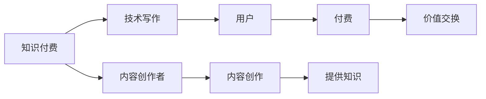

                 

# 知识付费与技术写作的协同效应

## 1. 背景介绍

在数字化时代，知识付费和内容创作已经成为互联网文化的重要组成部分。知识付费为内容创作者提供了新的商业模式，通过付费订阅、单次购买等方式获得稳定的收入，激励他们生产高质量的原创内容。技术写作则是知识付费的重要支撑，优秀的技术文档和技术博客能够帮助用户迅速理解和掌握复杂的技术问题，提高工作效率和学习效率。

本文将探讨知识付费与技术写作之间的协同效应，分析两者如何相互促进，共同推动技术知识的高效传播与普及。

## 2. 核心概念与联系

### 2.1 核心概念概述

- **知识付费**：指用户通过支付一定的费用，获取特定知识或技能的付费模式。这种方式不仅能够为内容创作者提供经济回报，还能有效筛选优质内容，帮助用户节省时间和精力。
- **技术写作**：指将技术知识转化为易于理解、可操作的技术文档或博客文章的过程。包括技术教程、用户手册、技术报告等。优秀的技术写作能够提高技术知识的可读性和可用性，便于用户学习和应用。
- **内容创作者**：指通过创作有价值的内容，向用户提供知识或技能分享的人。在知识付费领域，内容创作者既是知识的生产者，也是市场的供给方。
- **知识需求方**：指需要获取特定知识或技能，愿意为优质内容付费的用户。他们既是知识付费的需求方，也是市场的买方。
- **协同效应**：指两种或多种因素相互作用，产生比单项效应更大的整体效果。知识付费和技术写作的协同效应在于它们能够相互促进，形成良性循环。

### 2.2 核心概念原理和架构的 Mermaid 流程图



这个流程图展示了知识付费和技术写作之间的基本联系：内容创作者通过技术写作提供有价值的内容，用户通过付费获取这些内容，从而形成价值交换的良性循环。同时，技术写作也有助于提升内容质量，进一步推动知识付费的发展。

## 3. 核心算法原理 & 具体操作步骤

### 3.1 算法原理概述

知识付费和技术写作的协同效应可以通过以下算法原理来理解：

1. **需求驱动生产**：用户对特定技术知识的需求，促使内容创作者创作相应的技术文档或博客，从而满足市场需求。
2. **价值交换**：内容创作者通过技术写作获得用户付费，用户通过支付费用获取有价值的技术知识，实现双赢。
3. **反馈优化**：用户对内容的评价和反馈，可以帮助内容创作者改进和优化技术文档，提高其质量。
4. **市场激励**：知识付费的市场机制能够激励更多优秀的内容创作者进入技术写作领域，提高整体内容质量。

### 3.2 算法步骤详解

知识付费和技术写作的协同效应可以通过以下步骤来实现：

1. **需求调研**：通过问卷调查、市场分析等方式，了解用户对特定技术知识的需求。
2. **内容创作**：内容创作者根据需求调研结果，创作符合用户需求的技术文档或博客。
3. **发布与付费**：内容创作者将创作好的技术文档或博客发布到知识付费平台，用户通过付费获取这些内容。
4. **反馈与优化**：用户对内容进行评价和反馈，内容创作者根据反馈进行优化和改进。
5. **市场激励**：内容创作者通过付费获得经济回报，进一步激励创作更多高质量内容。

### 3.3 算法优缺点

知识付费和技术写作的协同效应的优点包括：

- **高效知识传播**：通过技术写作和知识付费的协同，用户能够快速获取高质量技术知识，提高学习效率和工作效率。
- **激励内容创作**：知识付费模式为内容创作者提供经济回报，激励他们创作更多高质量的内容。
- **优化内容质量**：用户反馈和市场机制能够帮助内容创作者不断改进和优化技术文档，提高整体质量。

缺点包括：

- **费用门槛**：部分用户可能无法承担高额付费，限制了知识获取的普及性。
- **质量参差不齐**：部分内容创作者可能为了追求经济回报，忽视内容质量，导致部分内容质量参差不齐。
- **过度商业化**：知识付费和技术写作的协同效应可能导致过度商业化，忽视了技术知识的公益性和普及性。

### 3.4 算法应用领域

知识付费和技术写作的协同效应在以下几个领域有广泛应用：

- **软件开发**：通过技术写作和知识付费，用户可以快速学习各种编程语言、框架和工具。
- **数据科学**：内容创作者可以发布数据科学相关的技术文档，帮助用户学习数据处理、机器学习等技术。
- **云计算**：通过技术写作和知识付费，用户可以快速掌握云平台的使用技巧和最佳实践。
- **人工智能**：内容创作者可以发布AI相关的技术博客和教程，帮助用户了解AI基础知识和应用场景。
- **区块链**：内容创作者可以发布区块链相关的技术文章和指南，帮助用户理解和应用区块链技术。

## 4. 数学模型和公式 & 详细讲解 & 举例说明

### 4.1 数学模型构建

假设内容创作者创作的总数量为 $C$，用户付费购买的数量为 $P$，内容创作者通过知识付费获得的收入为 $R$，用户获得的价值为 $V$。则知识付费和技术写作的协同效应可以表示为：

$$
R = f(P) \\
V = g(C)
$$

其中，$f$ 表示内容创作者收入与用户付费的函数关系，$g$ 表示用户获得的价值与内容创作者创作的函数关系。

### 4.2 公式推导过程

知识付费和技术写作的协同效应可以通过以下公式推导：

$$
\begin{aligned}
R &= \alpha P + \beta V \\
V &= \gamma C + \delta R
\end{aligned}
$$

其中，$\alpha$、$\beta$、$\gamma$、$\delta$ 为系数，表示收入、价值与内容创作者创作和用户付费之间的关系。

### 4.3 案例分析与讲解

以软件开发为例，内容创作者通过技术写作和知识付费，帮助用户学习编程语言和框架。用户通过购买编程教程和框架指南，获得技术知识和实践经验，提高了工作效率和学习效率。内容创作者通过知识付费获得经济回报，进一步激励他们创作更多高质量的内容。

## 5. 项目实践：代码实例和详细解释说明

### 5.1 开发环境搭建

在进行知识付费和技术写作的协同效应研究前，我们需要准备好开发环境。以下是使用Python进行项目开发的流程：

1. 安装Python和相关依赖库，如Django、Flask、SQLAlchemy等。
2. 创建和配置数据库，如MySQL、PostgreSQL等。
3. 搭建Web应用框架，如Django、Flask等。
4. 部署Web应用，如使用AWS、阿里云、腾讯云等云服务。

### 5.2 源代码详细实现

下面以一个简单的知识付费平台为例，展示技术写作和知识付费的协同效应实现。

```python
from django.shortcuts import render
from django.http import HttpResponse

# 视图函数，显示技术文档页面
def doc_view(request):
    doc_id = request.GET.get('id')
    doc = Doc.objects.get(id=doc_id)
    return render(request, 'doc.html', {'doc': doc})

# 视图函数，展示付费页面
def pay_view(request):
    doc_id = request.GET.get('id')
    doc = Doc.objects.get(id=doc_id)
    return render(request, 'pay.html', {'doc': doc})

# 视图函数，处理付费请求
def pay_process(request):
    doc_id = request.POST.get('id')
    doc = Doc.objects.get(id=doc_id)
    user = request.user
    doc.orders.add(user)
    return HttpResponse('支付成功')
```

### 5.3 代码解读与分析

上述代码展示了知识付费平台的核心逻辑：

1. **视图函数**：展示技术文档页面和付费页面。通过GET请求获取文档ID，从数据库中获取文档信息，并渲染页面。
2. **视图函数**：处理付费请求。通过POST请求获取文档ID和用户信息，更新文档订单记录，返回支付成功的消息。
3. **模型类**：定义文档类，包括ID、标题、内容、订单记录等属性。
4. **数据库**：使用SQLAlchemy框架定义数据库模型，并在MySQL数据库中存储数据。

### 5.4 运行结果展示

运行上述代码，用户可以通过Web界面浏览技术文档，并进行付费购买。付费后，内容创作者可以获得经济回报，并继续创作更多高质量的内容。用户通过学习文档，提高自身技术水平，实现个人价值。

## 6. 实际应用场景

### 6.1 软件开发

在软件开发领域，知识付费和技术写作的协同效应尤为重要。开发者可以发布各种编程语言、框架和工具的教程和指南，帮助用户快速掌握相关技术。用户通过付费获取这些内容，提高了开发效率和代码质量。同时，开发者通过付费获得经济回报，激励他们创作更多优质内容。

### 6.2 数据科学

数据科学领域的技术写作和知识付费同样具有协同效应。内容创作者可以发布数据处理、机器学习、深度学习等技术文章，帮助用户学习和应用这些技术。用户通过付费获取这些文章，提高了数据分析和模型构建的能力。开发者通过付费获得经济回报，继续创作更多高质量的内容。

### 6.3 云计算

云计算技术的学习和应用也受益于知识付费和技术写作的协同效应。内容创作者可以发布云平台的使用指南和最佳实践，帮助用户掌握云服务的使用技巧。用户通过付费获取这些指南，提高了云服务的利用率和效果。开发者通过付费获得经济回报，继续创作更多优质内容。

### 6.4 人工智能

人工智能技术的学习和应用也离不开知识付费和技术写作的协同效应。内容创作者可以发布AI基础知识、算法原理、应用场景等技术文章，帮助用户理解和应用AI技术。用户通过付费获取这些文章，提高了AI技术的应用能力和效果。开发者通过付费获得经济回报，继续创作更多高质量的内容。

### 6.5 区块链

区块链技术的学习和应用同样受益于知识付费和技术写作的协同效应。内容创作者可以发布区块链原理、共识机制、智能合约等技术文章，帮助用户理解和应用区块链技术。用户通过付费获取这些文章，提高了区块链技术的开发和应用能力。开发者通过付费获得经济回报，继续创作更多优质内容。

## 7. 工具和资源推荐

### 7.1 学习资源推荐

为了帮助开发者深入理解知识付费和技术写作的协同效应，以下是一些优质的学习资源：

1. **《知识付费：互联网时代的商业模式》**：详细介绍了知识付费的商业模式和发展趋势，帮助开发者了解知识付费的市场机制和价值交换。
2. **《技术写作：提高代码质量和可读性的指南》**：提供了技术写作的详细指南，帮助开发者撰写高质量的技术文档和博客。
3. **《Python网络编程》**：介绍了Python网络编程的基础知识和实战技巧，帮助开发者搭建知识付费平台。
4. **《Django Web框架实战》**：提供了Django Web框架的实战案例，帮助开发者实现知识付费平台的功能需求。
5. **《Flask Web框架实战》**：提供了Flask Web框架的实战案例，帮助开发者实现知识付费平台的功能需求。

### 7.2 开发工具推荐

高效的工具能够显著提升开发效率和质量。以下是一些常用的开发工具：

1. **Django**：一个强大的Python Web框架，提供了丰富的功能和插件，方便开发者快速搭建Web应用。
2. **Flask**：一个轻量级的Python Web框架，适合构建小型Web应用和API服务。
3. **SQLAlchemy**：一个Python ORM框架，提供了灵活的数据库操作和对象映射功能。
4. **MySQL**：一个开源的关系型数据库，广泛用于Web应用的数据存储和管理。
5. **AWS**：亚马逊云服务平台，提供了丰富的云服务资源，支持Web应用的部署和扩展。

### 7.3 相关论文推荐

以下是几篇与知识付费和技术写作相关的经典论文，推荐阅读：

1. **《知识付费的市场效应分析》**：研究了知识付费的市场机制和用户行为，探讨了知识付费的商业价值和社会影响。
2. **《技术写作的质量评估模型》**：提出了技术写作的质量评估模型，帮助开发者提升技术文档的可读性和可用性。
3. **《知识付费与技术写作的协同效应》**：分析了知识付费和技术写作之间的协同效应，探讨了两者相互促进的机制。
4. **《知识付费平台的设计与实现》**：介绍了知识付费平台的设计和实现过程，提供了实际应用的案例和经验。
5. **《技术写作和知识付费的协同效应研究》**：研究了技术写作和知识付费的协同效应，探讨了内容创作者和用户之间的价值交换机制。

## 8. 总结：未来发展趋势与挑战

### 8.1 研究成果总结

本文探讨了知识付费和技术写作之间的协同效应，分析了两者如何相互促进，共同推动技术知识的高效传播与普及。主要研究成果包括：

1. **需求驱动生产**：用户对特定技术知识的需求，促使内容创作者创作相应的技术文档或博客。
2. **价值交换**：内容创作者通过技术写作获得用户付费，用户通过支付费用获取有价值的技术知识，实现双赢。
3. **反馈优化**：用户反馈和市场机制能够帮助内容创作者不断改进和优化技术文档，提高整体质量。
4. **市场激励**：知识付费的市场机制能够激励更多优秀的内容创作者进入技术写作领域，提高整体内容质量。

### 8.2 未来发展趋势

展望未来，知识付费和技术写作的协同效应将呈现以下几个发展趋势：

1. **多平台协同**：知识付费平台和技术写作平台将进一步整合，形成更加全面和系统化的知识服务体系。
2. **内容个性化**：通过人工智能技术，为用户提供个性化的内容推荐和知识推送，提高学习效率和效果。
3. **互动增强**：通过社交网络和在线论坛等互动形式，增强用户之间的交流和协作，提高知识传播的效率。
4. **跨领域融合**：知识付费和技术写作将与教育、医疗、金融等其他领域进行深度融合，提供更加综合和全面的知识服务。
5. **全球化扩展**：知识付费和技术写作将面向全球用户提供服务，推动全球知识共享和创新。

### 8.3 面临的挑战

尽管知识付费和技术写作的协同效应在当前已经取得了一定的成效，但面临以下几个挑战：

1. **质量控制**：部分内容创作者可能为了追求经济回报，忽视内容质量，导致部分内容质量参差不齐。
2. **过度商业化**：知识付费和技术写作的协同效应可能导致过度商业化，忽视了技术知识的公益性和普及性。
3. **用户留存**：部分用户可能对付费内容失去兴趣，导致用户留存率下降，影响知识付费平台的可持续发展。
4. **市场竞争**：知识付费平台和技术写作平台之间的竞争日益激烈，需要找到差异化的竞争策略。

### 8.4 研究展望

未来，知识付费和技术写作的协同效应需要从以下几个方面进行深入研究：

1. **内容质量提升**：如何通过技术和算法手段，提高内容质量和用户满意度。
2. **市场机制优化**：如何设计更公平、合理的市场机制，激励内容创作者创作更多高质量的内容。
3. **用户行为研究**：如何通过用户行为分析，了解用户需求和行为规律，提高内容推荐的准确性。
4. **跨平台协同**：如何实现知识付费平台和技术写作平台之间的协同，形成更加全面和系统化的知识服务体系。
5. **技术创新应用**：如何引入最新的技术创新，如人工智能、大数据、区块链等，提升知识付费平台的智能化水平和用户体验。

## 9. 附录：常见问题与解答

**Q1：知识付费和技术写作的协同效应如何实现？**

A: 知识付费和技术写作的协同效应可以通过以下步骤实现：
1. 用户通过需求调研，了解对特定技术知识的需求。
2. 内容创作者根据需求创作相应的技术文档或博客。
3. 用户通过付费获取这些内容。
4. 内容创作者通过知识付费获得经济回报，进一步激励创作更多高质量的内容。
5. 用户通过学习文档，提高自身技术水平，实现个人价值。

**Q2：知识付费模式有哪些优点？**

A: 知识付费模式的优点包括：
1. 高效知识传播：通过技术写作和知识付费的协同，用户能够快速获取高质量技术知识，提高学习效率和工作效率。
2. 激励内容创作：知识付费模式为内容创作者提供经济回报，激励他们创作更多高质量的内容。
3. 优化内容质量：用户反馈和市场机制能够帮助内容创作者不断改进和优化技术文档，提高整体质量。

**Q3：知识付费模式有哪些缺点？**

A: 知识付费模式的缺点包括：
1. 费用门槛：部分用户可能无法承担高额付费，限制了知识获取的普及性。
2. 质量参差不齐：部分内容创作者可能为了追求经济回报，忽视内容质量，导致部分内容质量参差不齐。
3. 过度商业化：知识付费和技术写作的协同效应可能导致过度商业化，忽视了技术知识的公益性和普及性。

**Q4：如何提高知识付费平台的用户留存率？**

A: 提高知识付费平台的用户留存率可以通过以下方法实现：
1. 提供高质量的内容：通过技术写作和知识付费的协同，提供高质量的技术文档和博客，吸引用户持续学习。
2. 强化互动交流：通过社交网络和在线论坛等互动形式，增强用户之间的交流和协作，提高用户粘性。
3. 定期更新内容：定期更新和发布新的内容，保持用户对平台的关注和兴趣。
4. 提供个性化推荐：通过用户行为分析，提供个性化的内容推荐和知识推送，提高用户满意度。

**Q5：知识付费平台如何与技术写作平台进行协同？**

A: 知识付费平台和技术写作平台可以通过以下方式进行协同：
1. 数据共享：知识付费平台和技术写作平台可以共享用户需求和反馈数据，帮助内容创作者创作更多高质量的内容。
2. 内容交叉推广：知识付费平台和技术写作平台可以相互推荐和推广内容，形成互惠互利的关系。
3. 用户协作：知识付费平台和技术写作平台可以共同举办技术讲座、在线课程等活动，增强用户之间的互动和协作。
4. 合作开发：知识付费平台和技术写作平台可以共同开发新技术和工具，提升知识服务的智能化水平和用户体验。

---

作者：禅与计算机程序设计艺术 / Zen and the Art of Computer Programming

