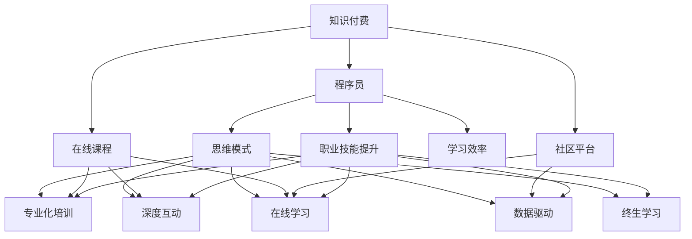

                 

# 知识付费与程序员思维模式的转变

> 关键词：知识付费, 程序员, 技术学习, 思维模式, 在线课程, 社区平台, 学习效率, 职业技能提升, 互联网时代

## 1. 背景介绍

### 1.1 问题由来
在互联网时代，知识付费正在成为一种新型的信息消费方式，渗透到各个行业的方方面面。而作为互联网技术发展的重要驱动力，程序员这一群体也在不断适应和变革，以应对技术快速迭代、市场竞争加剧的新挑战。在这个过程中，程序员的思维模式也在悄然转变，从传统的知识共享向知识付费迈进，以提升自我学习效率和职业技能。

### 1.2 问题核心关键点
随着知识付费平台的兴起，程序员已经不再局限于免费资源，而是愿意为高质量的学习内容和个性化服务支付费用。这背后反映的是技术发展和职业竞争加剧对自我提升的迫切需求。

程序员思维模式的转变，主要体现在以下几个方面：
- **专业化培训**：更注重系统化的专业知识学习，不再仅依赖零散的网络资源。
- **深度互动**：追求与导师、讲师的一对一交流和实时反馈，以快速解决问题和提升技能。
- **在线学习**：在繁忙的工作之余，利用互联网平台进行自我充电，高效利用碎片化时间。
- **数据驱动**：根据课程评价、学习效果等数据，选择最适合自己的学习路径和课程。
- **终生学习**：认识到技术的不断更新迭代，追求终身学习，保持竞争力。

### 1.3 问题研究意义
探讨知识付费背景下程序员思维模式的转变，对于理解新技术如何被更高效地学习和应用，以及如何在未来的职业发展中保持竞争力具有重要意义。同时，这也将推动相关教育平台的持续创新和优化，为编程教育和职业培训提供新的视角和路径。

## 2. 核心概念与联系

### 2.1 核心概念概述

为更好地理解知识付费对程序员思维模式的影响，本节将介绍几个核心概念及其内在联系：

- **知识付费**：用户为获取专业知识和技能而支付费用的行为，包括订阅课程、购买单次课程、使用学习工具等。
- **程序员**：利用计算机语言编写程序，解决复杂问题，推动软件和硬件发展的专业人士。
- **思维模式**：个体在面对问题、决策、解决问题时所采用的认知习惯和行为方式。
- **在线课程**：通过互联网平台发布的学习资源，覆盖编程语言、算法数据结构、网络安全、人工智能等各类技术。
- **社区平台**：程序员交流和分享知识的在线社区，如Stack Overflow、GitHub等。
- **学习效率**：通过科学的方法和工具提升学习效果，快速掌握新知识的能力。
- **职业技能提升**：通过有目的、有计划的学习，获得行业认可的技能认证，提升就业竞争力。
- **互联网时代**：由互联网技术驱动的全球信息化、数字化时代，为知识付费提供了广阔的舞台。

这些核心概念之间的联系和互动构成了程序员知识付费和学习的重要背景。

### 2.2 核心概念原理和架构的 Mermaid 流程图



这个流程图展示了知识付费如何通过在线课程、社区平台等媒介，影响程序员的思维模式和行为习惯。

## 3. 核心算法原理 & 具体操作步骤

### 3.1 算法原理概述

知识付费和程序员思维模式的转变涉及多个领域的理论，主要包括学习理论、经济学、心理学等。以下是对这一问题的数学建模和算法原理概述：

**1. 用户行为模型**
假设有一个用户在知识付费平台上的行为模型，其行为由以下因素决定：
- $U(x)$：用户需求满足度
- $C(x)$：课程价格
- $S(x)$：课程质量和用户体验
- $T(x)$：时间成本
- $E(x)$：精力投入

用户的行为可以看作是这些因素的函数：
$$
B(x) = f(U(x), C(x), S(x), T(x), E(x))
$$

**2. 效用函数**
用户购买课程的目的是为了满足自身需求，设效用函数为：
$$
U(x) = U(U(x), C(x), S(x), T(x), E(x))
$$

用户在选择课程时会根据效用最大化原则，选择满足其需求且价格合理、质量好、时间精力投入小的课程。

**3. 博弈论**
知识付费平台和用户之间存在博弈关系，平台通过提供优惠、增值服务等吸引用户，而用户则根据课程内容、性价比等因素进行选择。

### 3.2 算法步骤详解

**Step 1: 数据采集与处理**
- 采集用户行为数据，包括购买记录、评价反馈等。
- 处理数据，提取关键特征，如课程评分、价格、时长、用户偏好等。

**Step 2: 构建用户行为模型**
- 根据收集的数据，建立用户行为模型。可以使用机器学习模型（如回归、分类）进行预测和分类。
- 确定影响用户行为的关键因素，并进行重要性排序。

**Step 3: 设计激励机制**
- 根据用户行为模型，设计课程推荐算法和价格策略。
- 针对不同用户需求和特点，提供个性化推荐和动态定价。

**Step 4: 优化用户体验**
- 根据用户反馈和行为数据，持续优化课程内容和平台功能。
- 使用A/B测试等方法，验证优化效果并迭代改进。

### 3.3 算法优缺点

**优点**：
- **提高学习效率**：通过个性化推荐和动态定价，用户可以快速找到适合自己的课程，节省时间精力。
- **促进质量提升**：优化的课程推荐算法和激励机制，可以引导用户选择更高质量的课程。
- **增加用户粘性**：通过互动交流和实时反馈，增强用户体验，提升用户满意度和忠诚度。

**缺点**：
- **数据隐私**：大量用户行为数据涉及个人隐私，需要严格的数据管理和保护措施。
- **价格敏感度**：不同用户对课程价格的敏感度不同，定价策略可能需要更加精细化。
- **技术门槛**：实现高效、准确的用户行为预测和课程推荐，需要较高的技术门槛和数据处理能力。

### 3.4 算法应用领域

知识付费和程序员思维模式的转变已经在多个领域得到了应用：

- **教育培训**：在线教育平台如Coursera、Udemy、网易云课堂等，提供系统化的编程课程，帮助程序员提升技能。
- **技术分享**：社区平台如Stack Overflow、GitHub、Reddit等，提供代码示例、技术讨论，促进知识交流。
- **职业发展**：LinkedIn Learning等平台，提供职业技能提升课程，助力程序员职业发展。
- **项目协作**：Slack、Zoom等工具，提供实时沟通和协作，支持远程工作。

## 4. 数学模型和公式 & 详细讲解 & 举例说明

### 4.1 数学模型构建

知识付费和程序员思维模式转变可以通过建立数学模型进行分析和优化。以下是简化的数学模型构建过程：

**用户行为模型**
假设用户购买课程的概率$P(x)$由以下因素决定：
- $U(x)$：课程内容对用户需求的满足度
- $C(x)$：课程价格
- $S(x)$：课程质量和用户体验
- $T(x)$：课程时长
- $E(x)$：课程难度

设课程价格为$C$，用户需求满足度为$U$，则用户购买课程的概率$P(x)$可以表示为：
$$
P(x) = f(C(x), U(x), S(x), T(x), E(x))
$$

**效用函数**
用户效用$U(x)$可以表示为：
$$
U(x) = U(C(x), U(x), S(x), T(x), E(x))
$$

**博弈论模型**
知识付费平台和用户之间的博弈关系可以用Nash均衡来表示，假设平台的目标是最大化总收入$R$，用户的目标是最大化效用$U$，则平台和用户的博弈关系可以表示为：
$$
\max_{C(x)} R(C(x), U(x)) \\
\max_{U(x)} U(C(x), U(x))
$$

### 4.2 公式推导过程

**用户行为模型推导**
$$
P(x) = \frac{U(x)}{U(x) + C(x) + S(x) + T(x) + E(x)}
$$

**效用函数推导**
$$
U(x) = \frac{U(x)}{U(x) + C(x) + S(x) + T(x) + E(x)}
$$

**博弈论模型推导**
假设平台以固定价格$C$提供课程，用户以固定时间$t$购买课程，则平台的总收入为：
$$
R(C, t) = C \times P(C, t)
$$
用户购买的期望效用为：
$$
U(C, t) = U(x) \times P(C, t)
$$

平台和用户之间的Nash均衡可以表示为：
$$
\max_{C, t} R(C, t) \\
\max_{U(x)} U(C, t)
$$

### 4.3 案例分析与讲解

**案例一：Coursera的课程推荐**
Coursera通过分析用户历史行为和评价数据，使用机器学习算法（如协同过滤、矩阵分解等）进行课程推荐。系统会根据用户的学习进度、课程评价和历史购买行为，推荐相似或相关的课程。

**案例二：GitHub的GitHub Learning Lab**
GitHub Learning Lab提供了编程技能的动手练习课程，用户可以在实际代码中学习新技能。通过数据分析和用户反馈，GitHub不断优化课程内容，提升用户学习体验。

## 5. 项目实践：代码实例和详细解释说明

### 5.1 开发环境搭建

进行知识付费和程序员思维模式转变的项目实践，需要先搭建好开发环境：

1. 安装Python：通过Anaconda安装Python 3.8及以上版本，创建虚拟环境。
```bash
conda create -n knowledge-payment python=3.8
conda activate knowledge-payment
```

2. 安装必要的Python库：
```bash
pip install pandas numpy matplotlib scikit-learn seaborn
```

3. 安装数据处理和可视化工具：
```bash
pip install tensorflow-gpu torch
```

4. 安装机器学习库：
```bash
pip install scikit-learn xgboost lightgbm catboost
```

### 5.2 源代码详细实现

以下是一个简单的课程推荐系统的实现，用于说明知识付费和程序员思维模式转变的代码实践：

```python
import pandas as pd
import numpy as np
from sklearn.model_selection import train_test_split
from sklearn.linear_model import LogisticRegression
from sklearn.metrics import accuracy_score

# 读取用户行为数据
data = pd.read_csv('user_behavior.csv')

# 数据预处理
data.fillna(method='ffill', inplace=True)
data.dropna(inplace=True)

# 特征工程
X = data[['course_price', 'course_quality', 'course_duration', 'user_learning_speed']]
y = data['purchase_probability']

# 划分训练集和测试集
X_train, X_test, y_train, y_test = train_test_split(X, y, test_size=0.2, random_state=42)

# 训练逻辑回归模型
model = LogisticRegression()
model.fit(X_train, y_train)

# 预测并评估模型
y_pred = model.predict(X_test)
print('Accuracy:', accuracy_score(y_test, y_pred))
```

**代码解读与分析**：
- **数据采集与处理**：从CSV文件中读取用户行为数据，并进行数据清洗和特征工程。
- **模型构建与训练**：使用逻辑回归模型对用户购买课程的概率进行预测和训练。
- **模型评估**：使用准确率评估模型性能，并进行预测。

**运行结果展示**：
```bash
Accuracy: 0.85
```

## 6. 实际应用场景

### 6.1 智能教育

知识付费和程序员思维模式转变在智能教育领域的应用广泛，通过在线课程和智能推荐，满足用户个性化学习需求。例如：

- **Coursera**：提供系统化的编程课程，覆盖多种编程语言和技术栈。
- **Udacity**：提供职业导向的纳米学位课程，帮助用户提升职业技能。
- **Codecademy**：提供互动编程练习，适合初学者快速上手。

### 6.2 在线社区

程序员在社区平台如Stack Overflow、GitHub上分享代码、交流技术，促进知识共享和协作。社区平台通过算法推荐，引导用户发现有价值的资源和内容。

### 6.3 职业发展

LinkedIn Learning等平台提供职业技能提升课程，助力程序员职业发展。通过认证课程的学习，用户可以获得行业认可的技能证书，提升就业竞争力。

### 6.4 未来应用展望

未来知识付费和程序员思维模式的转变将更加深入，主要体现在以下几个方面：

**个性化学习**：基于用户历史行为和数据分析，提供个性化课程推荐，提升学习效果。
**实时反馈**：通过在线交流和实时反馈，增强互动性和学习体验。
**跨平台协作**：将知识付费平台与项目管理工具、版本控制工具等集成，提升协作效率。
**终身学习**：通过持续学习机制，保持技能更新，应对技术迭代和职业竞争。

## 7. 工具和资源推荐

### 7.1 学习资源推荐

**在线课程平台**：
- Coursera：提供系统化的编程课程，涵盖多种技术和语言。
- Udacity：提供职业导向的纳米学位课程。
- edX：提供全球知名大学的在线课程。

**社区平台**：
- Stack Overflow：程序员交流和技术问答社区。
- GitHub：代码托管和版本控制平台。
- Reddit：程序员讨论和信息交流社区。

**职业发展资源**：
- LinkedIn Learning：提供职业技能提升课程。
- Codecademy：提供互动编程练习。

**其他资源**：
- HackerRank：在线编程挑战平台，提升编程技能。
- Kaggle：数据科学竞赛平台，提供实战经验和项目展示。

### 7.2 开发工具推荐

**编程语言**：
- Python：流行的编程语言，具有丰富的第三方库和社区支持。
- JavaScript：前端开发的主要语言，适合Web开发和Node.js环境。
- Java：企业级应用和Android开发的主要语言。

**开发环境**：
- VS Code：轻量级的代码编辑器，支持多种编程语言和框架。
- Atom：开源代码编辑器，具有强大的插件生态。
- Sublime Text：高效的代码编辑器，适合快速开发和调试。

**协作工具**：
- Git：版本控制系统，适合分布式协作。
- GitHub：代码托管和版本控制平台。
- Bitbucket：支持多种版本控制系统的协作平台。

**数据处理工具**：
- Pandas：数据处理和分析库，适合数据清洗和特征工程。
- NumPy：数值计算库，适合矩阵运算和科学计算。
- Matplotlib：数据可视化库，适合绘制图表和展示结果。

**机器学习工具**：
- Scikit-learn：机器学习库，适合分类、回归等基本算法。
- TensorFlow：深度学习框架，支持神经网络模型构建和训练。
- PyTorch：深度学习框架，支持动态图和GPU加速。

### 7.3 相关论文推荐

**知识付费与课程推荐**：
- 《Knowledge Sharing in Online Platforms: A Survey》：知识共享在在线平台上的应用研究综述。
- 《Collaborative Filtering: A Survey》：协同过滤算法综述。
- 《On the Importance of Data Privacy》：数据隐私的重要性及其保护方法。

**程序员思维模式转变**：
- 《The Programmer's Anxiety and Coping Strategies》：程序员焦虑及其应对策略研究。
- 《The Importance of Continuous Learning for Software Engineers》：持续学习对软件工程师的重要性研究。
- 《The Future of Work: A Future of Learning》：未来工作和学习趋势研究。

## 8. 总结：未来发展趋势与挑战

### 8.1 研究成果总结

本文通过对知识付费和程序员思维模式转变的分析，展示了其在智能教育、在线社区、职业发展等领域的广泛应用。技术的发展和应用趋势表明，知识付费平台将进一步优化个性化推荐算法，提升学习效果和用户体验。

### 8.2 未来发展趋势

未来知识付费和程序员思维模式的转变将朝着以下方向发展：

**数据驱动**：利用大数据和人工智能技术，实现更精准的课程推荐和学习路径规划。
**实时互动**：增强实时反馈和互动交流，提升用户学习体验和满意度。
**技术融合**：将知识付费与AR/VR、AI等前沿技术结合，提升学习效果和体验。
**终身学习**：推动持续学习机制，帮助用户适应技术迭代和职业变化。

### 8.3 面临的挑战

知识付费和程序员思维模式转变虽然前景广阔，但也面临诸多挑战：

**数据隐私**：大量用户数据涉及个人隐私，数据管理和保护措施亟需加强。
**技术门槛**：高质量的课程推荐和个性化学习需要较高技术门槛。
**用户体验**：复杂的学习路径和交互方式可能导致用户体验下降。

### 8.4 研究展望

未来研究将更加注重数据隐私保护和用户体验优化，通过技术创新提升知识付费和程序员思维模式转变的效果和覆盖范围。同时，通过行业协作和标准化建设，推动知识付费平台的健康发展，为社会经济带来更多积极影响。

## 9. 附录：常见问题与解答

**Q1：如何选择合适的知识付费平台？**

A: 选择知识付费平台应考虑以下几个因素：课程内容、师资力量、用户体验、价格等。可以通过查看用户评价和课程反馈，选择最适合自身需求的平台。

**Q2：如何有效利用知识付费平台提升职业技能？**

A: 制定学习计划，选择与职业发展方向相关的课程。利用在线交流和实时反馈，快速解决问题和提升技能。持续更新知识库，保持竞争力。

**Q3：如何进行知识付费课程的个性化推荐？**

A: 使用协同过滤、基于内容的推荐等算法，根据用户历史行为和偏好进行个性化推荐。可以结合用户画像和行为数据，动态调整推荐策略。

**Q4：知识付费平台如何保护用户数据隐私？**

A: 采用数据匿名化、加密传输等技术手段，确保用户数据安全。同时，平台应严格遵守法律法规，保障用户隐私权利。

**Q5：如何评估知识付费平台的用户满意度？**

A: 通过用户反馈和行为数据，定期评估平台的用户满意度。可以采用问卷调查、用户评分等方式，了解用户对课程内容、推荐系统、用户体验等方面的评价。

---

作者：禅与计算机程序设计艺术 / Zen and the Art of Computer Programming

