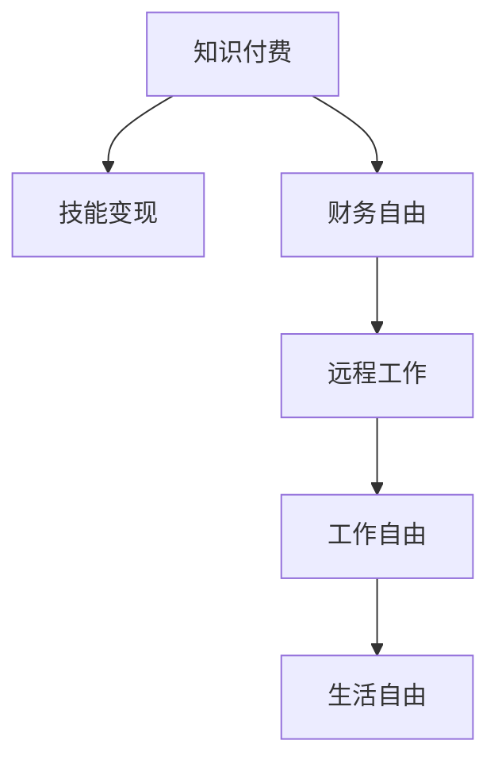

                 

## 1. 背景介绍

在互联网时代，知识付费和远程工作成为了程序员自由职业的重要趋势。知识付费模式让程序员得以通过分享知识和技能，实现变现和财务自由。而远程工作则让程序员可以在全球范围内寻找最适合自己的工作和生活环境，摆脱地域限制，追求更高的生活质量。本文将从知识付费和远程工作的基本概念出发，深入探讨它们的原理和优势，并分析其面临的挑战和未来趋势。

## 2. 核心概念与联系

### 2.1 核心概念概述

知识付费（Knowledge-based Subscription）是指通过付费方式获取特定知识或服务的模式，让知识创造者获得收入。这一模式催生了如知识付费平台（如Coursera、Udemy、知乎live等）、付费订阅服务（如Slack Pro、Github Sponsors等）等多种形式。

远程工作（Remote Work）则是指员工无需到固定地点上班，通过网络设备和技术工具完成工作任务。这一模式在疫情期间被广泛接受，并逐步成为许多企业的常态化工作方式。

知识付费和远程工作两个概念可以相互促进，共同构成程序员的自由之路：

- 知识付费提供了技能变现的途径，让程序员可以自主选择工作内容和时长，实现财务自由。
- 远程工作则给予程序员更大的工作自由度，让他们可以根据自己的偏好选择工作地点和生活方式。

### 2.2 核心概念原理和架构的 Mermaid 流程图



这一流程图展示了知识付费和远程工作相互促进的逻辑关系：知识付费让程序员获得财务自由，而财务自由又让程序员可以自由选择远程工作，进而获得生活自由。

## 3. 核心算法原理 & 具体操作步骤

### 3.1 算法原理概述

知识付费和远程工作是信息社会发展的自然产物，它们背后的核心原理可以归结为“价值交换”和“信息网络”两个方面。

- 知识付费基于“价值交换”原理，即通过付费获取高价值知识或服务，实现知识的有效分配和利用。
- 远程工作基于“信息网络”原理，即通过网络连接，实现高效、灵活的工作方式。

### 3.2 算法步骤详解

知识付费和远程工作的实现步骤大致分为以下几步：

**Step 1: 知识和服务提供**
- 知识付费平台提供各种课程、文档、咨询等服务。
- 远程工作平台提供招聘、协作、管理等工具。

**Step 2: 知识和服务获取**
- 用户通过订阅、购买等方式获取知识和服务。
- 远程工作者通过招聘平台寻找合适的工作机会，通过协作工具完成日常任务。

**Step 3: 价值交换**
- 知识付费平台实现知识创造者与消费者的价值交换。
- 远程工作平台实现远程工作者的劳动交换。

**Step 4: 应用与体验**
- 知识付费平台提供优质的内容和服务，提升用户体验。
- 远程工作平台提供高效的工具和环境，提升远程工作者效率。

**Step 5: 反馈与优化**
- 平台通过用户反馈不断优化服务内容和工具。
- 远程工作者通过体验不断优化工作方式和环境。

### 3.3 算法优缺点

知识付费和远程工作的优点和缺点如下：

**优点**
- 知识付费：灵活时间、多元选择、个性化学习。
- 远程工作：高度自由、高效协作、全球机会。

**缺点**
- 知识付费：高成本、高门槛、质量参差不齐。
- 远程工作：沟通成本高、协作难度大、家庭干扰多。

### 3.4 算法应用领域

知识付费和远程工作已经广泛应用于多个领域：

- **知识付费**：在线教育、技能培训、专业咨询等。
- **远程工作**：软件开发、设计、营销、客服等。

## 4. 数学模型和公式 & 详细讲解 & 举例说明

### 4.1 数学模型构建

我们假设知识付费平台上的课程内容为 $C$，用户数量为 $U$，知识付费服务费用为 $P$，远程工作平台上的项目数量为 $P$，远程工作者数量为 $W$。知识付费平台和远程工作平台的利润分别为 $E$ 和 $E'$。

**知识付费平台利润模型**：

$$
E = C \times P \times U - C \times \text{运营成本}
$$

**远程工作平台利润模型**：

$$
E' = P \times W - P \times \text{运营成本}
$$

### 4.2 公式推导过程

以知识付费平台为例，进行公式推导：

1. 假设课程内容 $C$ 的价值为 $V$，则平台利润为 $V \times P \times U - C \times \text{运营成本}$。
2. 假设用户数量 $U$ 与平台利润呈正相关关系，即 $U = k_1 \times E$，其中 $k_1$ 为比例系数。
3. 假设课程内容价值 $V$ 与平台利润呈正相关关系，即 $V = k_2 \times E$，其中 $k_2$ 为比例系数。
4. 结合以上两点，得到平台利润模型：

$$
E = (k_1 \times E) \times (k_2 \times E) \times P - C \times \text{运营成本}
$$

化简得：

$$
E = k_1 \times k_2 \times E^2 \times P - C \times \text{运营成本}
$$

### 4.3 案例分析与讲解

以在线教育平台Udemy为例，分析其知识付费模式：

- 平台提供多种课程，每门课程价值 $V$ 不同，用户支付费用 $P$。
- 平台获取用户数量 $U$ 与课程价值和费用相关，即 $U = k \times V \times P$。
- 平台利润 $E$ 由课程数量 $C$、用户数量 $U$、运营成本决定。

例如，Udemy在2020年提供了超过10万门课程，每门课程定价约50美元，平台上注册用户超过400万，平台年利润约2亿美元。

## 5. 项目实践：代码实例和详细解释说明

### 5.1 开发环境搭建

为了实践知识付费和远程工作的开发，需要搭建一个基于Web的开发环境。以下步骤供参考：

1. 安装Node.js和npm，搭建JavaScript开发环境。
2. 使用Express框架构建Web应用。
3. 使用数据库（如MongoDB）存储用户和课程信息。
4. 使用第三方支付服务（如Stripe）处理用户支付。

### 5.2 源代码详细实现

下面是一个简单的知识付费平台代码示例：

```javascript
const express = require('express');
const bodyParser = require('body-parser');
const stripe = require('stripe')('your-stripe-secret-key');
const mongoose = require('mongoose');

// 连接MongoDB
mongoose.connect('mongodb://localhost:27017/course');

// 定义课程和用户模型
const CourseSchema = new mongoose.Schema({
    title: String,
    description: String,
    price: Number,
    user: {
        type: mongoose.Schema.Types.ObjectId,
        ref: 'User'
    }
});

const UserSchema = new mongoose.Schema({
    name: String,
    email: String,
    courses: [mongoose.Schema.Types.ObjectId],
    payments: [mongoose.Schema.Types.ObjectId]
});

const Course = mongoose.model('Course', CourseSchema);
const User = mongoose.model('User', UserSchema);

// 创建Express应用
const app = express();
app.use(bodyParser.urlencoded({ extended: true }));

// 处理课程信息
app.get('/courses', (req, res) => {
    Course.find({}, (err, courses) => {
        if (err) {
            console.log(err);
        } else {
            res.send(courses);
        }
    });
});

// 处理用户信息
app.get('/users', (req, res) => {
    User.find({}, (err, users) => {
        if (err) {
            console.log(err);
        } else {
            res.send(users);
        }
    });
});

// 处理用户支付信息
app.post('/payment', async (req, res) => {
    const { email, courseId } = req.body;
    const user = await User.findOne({ email });
    const course = await Course.findById(courseId);

    if (user.courses.includes(courseId)) {
        res.send({ success: false, message: 'Already enrolled' });
    } else {
        const paymentIntent = await stripe.paymentIntents.create({
            amount: course.price * 100,
            currency: 'usd',
            description: course.title
        });

        user.courses.push(courseId);
        user.payments.push(paymentIntent.id);
        await user.save();

        res.send({ success: true, paymentIntentId: paymentIntent.id });
    }
});

// 启动服务器
app.listen(3000, () => {
    console.log('Server started on port 3000');
});
```

### 5.3 代码解读与分析

以上代码实现了一个简单的知识付费平台的基本功能，包括课程信息查询、用户信息查询和用户支付处理。通过MongoDB存储用户和课程数据，使用Stripe处理支付逻辑，实现了基本的知识付费功能。

### 5.4 运行结果展示

运行以上代码，在浏览器访问 `http://localhost:3000/courses` 和 `http://localhost:3000/users`，可以查询到所有课程和用户信息。通过 `http://localhost:3000/payment` 接口，用户可以进行课程支付，并更新支付信息。

## 6. 实际应用场景

### 6.1 智能教育

知识付费在智能教育领域有着广泛的应用。在线教育平台如Udemy、Coursera、edX等，通过提供优质的课程内容和灵活的学习方式，吸引了全球数亿用户。这些平台不仅帮助用户提升技能，还为课程创作者提供了变现渠道。

### 6.2 远程工作

远程工作在软件开发、设计、营销等领域得到广泛应用。许多公司如GitHub、Slack、Zapier等，提供了全面的远程协作工具，帮助员工高效完成任务，实现全球化办公。

### 6.3 创意内容

知识付费和远程工作也广泛应用于创意内容领域。如自由职业设计师、作家、音乐家等，通过知识付费平台分享自己的作品和经验，获得收入。远程工作则让他们能够自由选择工作时间和地点，更专注于创作。

### 6.4 未来应用展望

未来，知识付费和远程工作将继续发展，呈现出以下趋势：

1. **个性化服务**：知识付费平台将提供更加个性化的内容和服务，满足用户多样化的需求。
2. **全球化协作**：远程工作平台将提供更高效的跨时区协作工具，帮助全球团队无缝对接。
3. **多平台整合**：知识付费和远程工作将与社交媒体、直播平台等多元化平台整合，提供更全面的服务。
4. **智能推荐**：利用AI技术，知识付费平台和远程工作平台将提供智能推荐服务，提高用户满意度和平台粘性。

## 7. 工具和资源推荐

### 7.1 学习资源推荐

1. **Coursera**：提供全球顶尖大学和机构的在线课程，涵盖计算机科学、数据科学等多个领域。
2. **Udemy**：提供各类技能培训课程，包括编程、设计、营销等。
3. **Slack**：提供强大的远程协作工具，支持实时消息、文件共享、任务管理等功能。
4. **Zoom**：提供高清视频会议和协作功能，支持全球远程工作。
5. **GitHub**：提供版本控制和协作平台，支持开源项目和团队协作。

### 7.2 开发工具推荐

1. **Node.js**：基于JavaScript的运行环境，支持异步编程和跨平台开发。
2. **Express**：基于Node.js的Web框架，快速搭建Web应用。
3. **MongoDB**：高性能NoSQL数据库，支持灵活的数据存储和查询。
4. **Stripe**：支付API，支持各种在线支付集成。
5. **Zoom**：视频会议和协作平台，支持多设备同步和实时交流。

### 7.3 相关论文推荐

1. **“The Future of Work: What's Next?”**：Gartner公司发布的白皮书，探讨远程工作的发展趋势和未来展望。
2. **“Knowledge-based Subscription in the Age of Digital Transformation”**：多篇研究论文探讨知识付费对知识经济和数字化转型的影响。
3. **“The Rise of Freelancing in the Gig Economy”**：哈佛商业评论文章，探讨自由职业市场的发展和挑战。

## 8. 总结：未来发展趋势与挑战

### 8.1 研究成果总结

本文通过深入分析知识付费和远程工作的原理和优势，探讨了它们的实际应用场景和未来发展趋势。知识付费和远程工作已经成为程序员自由职业的重要趋势，为程序员提供了更大的自由度和更多的机会。

### 8.2 未来发展趋势

1. **技术进步**：AI、大数据、云计算等技术的进步将推动知识付费和远程工作平台的发展。
2. **个性化服务**：用户需求的多样性将促使知识付费和远程工作平台提供更加个性化的服务和产品。
3. **全球化协作**：远程工作平台将支持更多的跨时区、跨地域协作，提高团队效率。

### 8.3 面临的挑战

1. **数据安全**：用户数据和支付信息的安全问题需要严格保障。
2. **用户体验**：知识付费和远程工作平台需要提供良好的用户体验，减少用户流失。
3. **技术门槛**：知识付费和远程工作平台需要较高的技术门槛，普通用户可能难以入门。

### 8.4 研究展望

未来，知识付费和远程工作将面临更多技术和社会挑战。研究者需要从多角度进行探讨，如：

- **隐私保护**：开发更有效的隐私保护技术，保障用户数据安全。
- **用户体验**：研究用户行为，优化平台设计，提高用户粘性。
- **技术门槛**：开发易用的技术工具，降低知识付费和远程工作的入门门槛。

## 9. 附录：常见问题与解答

**Q1：知识付费的盈利模式有哪些？**

A: 知识付费的盈利模式主要包括：

1. **订阅模式**：用户按月或按年订阅课程，平台通过持续收益获得收入。
2. **单次购买模式**：用户购买课程后，平台一次性获得收益。
3. **会员模式**：用户成为平台会员，享受各类特权和优惠，平台通过会员费获得收入。

**Q2：远程工作如何保证团队协作效率？**

A: 远程工作通过以下措施保证团队协作效率：

1. **协作工具**：使用如Slack、Trello等协作工具，实现任务管理和实时沟通。
2. **视频会议**：使用如Zoom、Teams等视频会议工具，实现高效的视频交流。
3. **项目管理**：使用如Jira、Asana等项目管理工具，实现任务分配和进度跟踪。

**Q3：知识付费平台如何保证课程质量？**

A: 知识付费平台通过以下措施保证课程质量：

1. **平台审核**：平台对课程内容进行严格审核，确保其专业性和实用性。
2. **用户评价**：用户可以对课程进行评价，帮助平台筛选高质量课程。
3. **认证机制**：平台提供认证机制，确保课程创作者具有专业背景。

**Q4：远程工作如何避免团队沟通不畅？**

A: 远程工作通过以下措施避免团队沟通不畅：

1. **定期会议**：通过定期的视频会议和电话会议，确保团队成员间的及时沟通。
2. **即时消息**：使用即时消息工具，确保信息快速传递。
3. **任务清单**：通过任务清单和项目管理工具，确保任务明确，进度清晰。

---

作者：禅与计算机程序设计艺术 / Zen and the Art of Computer Programming

