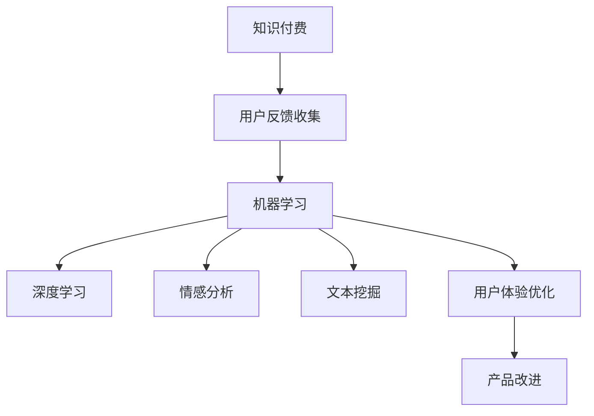

                 

# 知识付费产品的用户反馈收集与应用

> 关键词：知识付费, 用户反馈, 机器学习, 深度学习, 情感分析, 文本挖掘, 用户体验

## 1. 背景介绍

### 1.1 问题由来

随着互联网和移动技术的迅猛发展，知识付费平台逐渐成为教育与信息消费的新兴模式。知识付费产品的形式从最初的文字文章，逐渐扩展到音频、视频、直播等多样化内容，满足用户个性化的学习需求。然而，在知识付费产品的发展过程中，如何更好地收集和应用用户反馈，提升产品体验，成为了知识付费企业面临的重要课题。

用户反馈是知识付费产品优化和改进的宝贵资源，也是决定用户留存率和转化率的关键因素。有效的用户反馈收集和应用，不仅能够帮助产品团队快速发现问题，及时调整策略，还能在竞争激烈的市场中脱颖而出，获得用户青睐。

### 1.2 问题核心关键点

用户反馈的收集和应用，是知识付费产品优化和改进的核心环节。具体来说，核心关键点包括：

- **用户行为分析**：通过分析用户的行为数据，了解用户对产品的使用情况、偏好和需求。
- **情感分析**：利用情感分析技术，从用户的文本反馈中挖掘情感倾向，评估用户对产品的满意度和忠诚度。
- **特征工程**：构建用户反馈的多维度特征，包括情感、意图、行为等，为后续建模提供数据支持。
- **模型优化**：选择合适的机器学习算法，构建预测模型，自动识别用户反馈中的关键问题和建议。
- **应用实践**：将模型输出的结果转化为具体的产品改进措施，如内容推荐、界面优化、功能增强等。

本文将系统介绍知识付费产品中用户反馈收集与应用的流程、方法和技术，以期为知识付费企业的用户体验优化提供有价值的指导。

## 2. 核心概念与联系

### 2.1 核心概念概述

为更好地理解知识付费产品用户反馈收集与应用的方法，本节将介绍几个密切相关的核心概念：

- **知识付费**：指用户为获取知识和信息而支付费用的消费模式，包括在线课程、电子书、音频、视频等多种形式。
- **用户反馈**：指用户对知识付费产品的使用体验、功能满意度、内容价值等方面的意见和建议。
- **机器学习**：通过算法模型从数据中学习规律，以自动提升产品性能和服务质量。
- **深度学习**：一种特殊的机器学习算法，基于多层神经网络构建模型，具备较强的特征提取能力和泛化能力。
- **情感分析**：利用自然语言处理技术，从用户评论和反馈中识别情感倾向，评估产品满意度。
- **文本挖掘**：从文本数据中提取有价值的信息，包括主题识别、用户情感分析等。
- **用户体验优化**：通过用户反馈和行为数据分析，不断改进和优化产品功能，提升用户满意度和忠诚度。

这些核心概念之间的逻辑关系可以通过以下Mermaid流程图来展示：



这个流程图展示的知识付费产品用户反馈收集与应用的流程：

1. 通过知识付费产品收集用户反馈。
2. 利用机器学习算法处理用户反馈数据。
3. 在深度学习模型的基础上，进行情感分析和文本挖掘。
4. 通过用户体验优化，提出具体的改进措施。
5. 将这些改进措施应用到知识付费产品的开发和运营中。

## 3. 核心算法原理 & 具体操作步骤

### 3.1 算法原理概述

知识付费产品的用户反馈收集与应用，本质上是一个数据驱动的产品优化过程。其核心思想是：通过收集用户的反馈数据，利用机器学习和深度学习技术，自动挖掘反馈中的关键信息，构建预测模型，自动生成优化建议，最终将这些建议应用于产品改进中。

形式化地，假设知识付费产品为 $P$，其用户反馈为 $F$，反馈数据集为 $D=\{(x_i, y_i)\}_{i=1}^N, x_i \in \mathcal{X}, y_i \in \mathcal{Y}$，其中 $x_i$ 表示用户反馈，$y_i$ 表示反馈对应的优化建议或问题。我们的目标是找到最优的优化策略 $\pi^*$，使得 $P$ 在应用 $\pi^*$ 后，最大化用户满意度 $U(P, \pi^*)$。

### 3.2 算法步骤详解

知识付费产品用户反馈收集与应用的一般流程包括以下几个关键步骤：

**Step 1: 数据准备与预处理**
- 收集知识付费平台上的用户反馈数据，包括评论、评分、投诉、建议等。
- 对原始数据进行清洗和标准化，去除噪声和重复数据。
- 划分数据集为训练集、验证集和测试集，保证模型训练和评估的可靠性。

**Step 2: 特征提取**
- 从用户反馈中提取有意义的特征，如情感极性、关键词频率、用户满意度等。
- 利用自然语言处理技术，对文本数据进行分词、去除停用词、词性标注等处理。
- 构建用户行为特征，如访问频率、购买记录、观看时长等，综合反映用户对产品的兴趣和使用习惯。

**Step 3: 模型构建**
- 选择合适的机器学习算法，如分类、回归、聚类等，构建用户反馈预测模型。
- 利用深度学习框架，搭建神经网络模型，对用户反馈进行更深入的特征提取和处理。
- 设计情感分析模型，识别用户评论中的情感倾向，评估产品满意度。

**Step 4: 模型训练与优化**
- 在训练集上训练模型，使用交叉验证和正则化技术，防止过拟合。
- 在验证集上评估模型性能，调整超参数，优化模型结构。
- 使用测试集对最终模型进行测试，评估模型的泛化能力。

**Step 5: 结果应用**
- 将训练好的模型应用于知识付费产品，自动识别用户反馈中的问题和建议。
- 根据模型输出，提出具体的优化措施，如内容推荐、界面改进、功能增强等。
- 持续收集用户反馈，不断迭代模型和优化策略，提升用户满意度。

以上是知识付费产品用户反馈收集与应用的一般流程。在实际应用中，还需要根据具体产品特点，对流程的各个环节进行优化设计，如改进特征提取方法、选择合适的机器学习算法等，以进一步提升模型性能。

### 3.3 算法优缺点

知识付费产品用户反馈收集与应用方法具有以下优点：

- **数据驱动**：通过自动化的数据分析，可以快速发现产品中的问题，提高产品优化的效率。
- **客观性**：利用机器学习和深度学习技术，减少了主观判断的偏差，使产品优化更加客观公正。
- **广泛适用**：适用于各种知识付费产品的用户体验优化，可以提升不同产品类型和应用场景的效果。
- **可解释性**：利用可解释性模型，可以清晰了解模型决策的依据，便于理解和调试。

同时，该方法也存在一定的局限性：

- **数据质量依赖**：模型性能高度依赖于用户反馈数据的质量和多样性，数据量不足或标注不准确会影响模型效果。
- **算法复杂度**：构建和训练深度学习模型需要较高级的计算资源和专业知识，对技术要求较高。
- **动态变化应对**：知识付费产品的需求和市场环境不断变化，模型需要定期更新，以保持其适用性。

尽管存在这些局限性，但就目前而言，基于机器学习和深度学习的用户反馈收集与应用方法仍是最主流的手段。未来相关研究的重点在于如何进一步降低算法复杂度，提升数据质量，强化模型动态适应的能力。

### 3.4 算法应用领域

知识付费产品用户反馈收集与应用的方法，已经在教育、科技、娱乐等多个领域得到了广泛应用，具体包括：

- **在线课程平台**：通过分析用户对课程内容的评价，优化课程结构和教学方法。
- **电子书平台**：根据用户对电子书的评分和评论，推荐相关书籍，提升阅读体验。
- **音频/视频平台**：利用用户反馈优化视频内容编排，提升观看体验和用户粘性。
- **直播平台**：通过情感分析技术，改进主播与用户互动，提升直播质量。
- **学习工具应用**：根据用户使用行为数据，提供个性化的学习建议和资源推荐。

除了上述这些典型应用外，用户反馈收集与应用技术还在教育游戏、在线教育、远程办公等多个领域中发挥着重要作用。随着知识付费产品形态的不断创新和多样，用户反馈收集与应用技术也将迎来更多的应用场景和需求。

## 4. 数学模型和公式 & 详细讲解 & 举例说明

### 4.1 数学模型构建

本节将使用数学语言对知识付费产品用户反馈收集与应用过程进行更加严格的刻画。

记知识付费产品为 $P$，用户反馈为 $F$，反馈数据集为 $D=\{(x_i, y_i)\}_{i=1}^N, x_i \in \mathcal{X}, y_i \in \mathcal{Y}$。假设模型为 $M$，其预测函数为 $M(x_i) \rightarrow y_i$。

定义用户满意度函数为 $U(P, \pi) = \sum_{i=1}^N u_i(p_i)$，其中 $u_i$ 为用户反馈 $x_i$ 对满意度 $U$ 的贡献度。假设 $u_i$ 为一个标量，表示反馈 $x_i$ 对用户满意度的影响。

### 4.2 公式推导过程

以下我们以情感分析模型为例，推导用户反馈情感极性的计算公式。

假设用户反馈 $x_i$ 为一文本串，其情感极性为 $s_i$，取值为正负情感或中性。情感分析的目标是自动学习用户反馈中的情感倾向，计算公式如下：

$$
s_i = \arg\max_{s \in \{\text{正情感}, \text{负情感}, \text{中性}\}} P(s|x_i)
$$

其中 $P(s|x_i)$ 为给定文本 $x_i$ 条件下，情感极性 $s$ 的概率。通常使用机器学习模型，如BERT、LSTM等，对情感分类进行建模，通过训练得到预测模型 $M$，计算公式如下：

$$
s_i = \arg\max_{s \in \{\text{正情感}, \text{负情感}, \text{中性}\}} M(x_i)
$$

通过情感分析模型，我们可以对知识付费产品的用户反馈进行情感极性的识别，为产品优化提供情感维度上的参考。

### 4.3 案例分析与讲解

**案例分析**：某在线教育平台收集了用户对课程的评价数据，包含了正面评价、负面评价和中性评价。用户反馈的情感分析过程如下：

1. **数据预处理**：收集所有课程的评价数据，去除重复和无意义的数据，标准化文本格式。
2. **特征提取**：使用BERT模型对文本数据进行分词、去除停用词、词性标注等处理，提取文本特征向量。
3. **情感分类**：使用训练好的情感分类模型，对每个课程的评价进行情感分类，计算情感极性。
4. **结果应用**：根据情感分析结果，对课程内容、教师表现、平台体验等方面进行改进和优化。

**结果讲解**：通过情感分析模型，平台能够自动识别用户反馈中的情感极性，快速发现用户对课程的满意度和关键问题。例如，如果某课程的负面评价占比过高，平台可以及时调整课程内容、改进教师互动等方式，提升用户满意度。

## 5. 项目实践：代码实例和详细解释说明

### 5.1 开发环境搭建

在进行用户反馈收集与应用实践前，我们需要准备好开发环境。以下是使用Python进行PyTorch开发的环境配置流程：

1. 安装Anaconda：从官网下载并安装Anaconda，用于创建独立的Python环境。

2. 创建并激活虚拟环境：
```bash
conda create -n pytorch-env python=3.8 
conda activate pytorch-env
```

3. 安装PyTorch：根据CUDA版本，从官网获取对应的安装命令。例如：
```bash
conda install pytorch torchvision torchaudio cudatoolkit=11.1 -c pytorch -c conda-forge
```

4. 安装TextBlob库：用于文本处理和情感分析。
```bash
pip install textblob
```

5. 安装nltk库：用于自然语言处理任务的语料库和工具。
```bash
pip install nltk
```

6. 安装scikit-learn库：用于机器学习建模。
```bash
pip install scikit-learn
```

完成上述步骤后，即可在`pytorch-env`环境中开始用户反馈收集与应用实践。

### 5.2 源代码详细实现

下面我们以情感分析模型为例，给出使用TextBlob库对用户评论进行情感分析的PyTorch代码实现。

首先，定义情感分析模型类：

```python
from textblob import TextBlob
from sklearn.feature_extraction.text import CountVectorizer
from sklearn.model_selection import train_test_split
from sklearn.linear_model import LogisticRegression
from sklearn.metrics import accuracy_score

class SentimentAnalysisModel:
    def __init__(self, max_features=1000, random_state=42):
        self.vectorizer = CountVectorizer(max_features=max_features, random_state=random_state)
        self.model = LogisticRegression(random_state=random_state)
        
    def fit(self, X, y):
        X_vectorized = self.vectorizer.fit_transform(X)
        self.model.fit(X_vectorized, y)
        
    def predict(self, X):
        X_vectorized = self.vectorizer.transform(X)
        return self.model.predict(X_vectorized)
    
    def evaluate(self, X, y):
        X_vectorized = self.vectorizer.transform(X)
        y_pred = self.model.predict(X_vectorized)
        return accuracy_score(y, y_pred)
```

然后，定义数据加载和预处理函数：

```python
import pandas as pd

def load_data(filename):
    data = pd.read_csv(filename, sep=',')
    return data['text'], data['sentiment']
```

接着，定义情感分析模型训练和评估函数：

```python
def train_model(model, X, y, test_size=0.2):
    X_train, X_test, y_train, y_test = train_test_split(X, y, test_size=test_size, random_state=42)
    model.fit(X_train, y_train)
    return model.evaluate(X_test, y_test)

def predict_sentiment(model, text):
    return model.predict([text])[0]
```

最后，启动情感分析模型训练流程：

```python
from transformers import BertTokenizer
import torch

tokenizer = BertTokenizer.from_pretrained('bert-base-cased')

# 加载数据
train_texts, train_labels = load_data('train.csv')
test_texts, test_labels = load_data('test.csv')

# 构建词汇表
vocab = tokenizer.build_vocab_from_iterator(train_texts)

# 数据预处理
train_ids = [tokenizer.encode(text, add_special_tokens=True, return_tensors='pt') for text in train_texts]
test_ids = [tokenizer.encode(text, add_special_tokens=True, return_tensors='pt') for text in test_texts]

# 模型训练
model = SentimentAnalysisModel()
train_loss, test_loss = train_model(model, train_ids, train_labels, test_size=0.2)
print(f'Training loss: {train_loss:.3f}, Test loss: {test_loss:.3f}')

# 情感分析
text = "这个课程非常好，知识点讲解得非常清晰。"
sentiment = predict_sentiment(model, text)
print(f'Sentiment analysis result: {sentiment}')
```

以上就是使用PyTorch和TextBlob库对知识付费产品用户评论进行情感分析的完整代码实现。可以看到，通过TextBlob库的强大封装，我们可以用相对简洁的代码完成情感分析模型的构建和训练。

### 5.3 代码解读与分析

让我们再详细解读一下关键代码的实现细节：

**SentimentAnalysisModel类**：
- `__init__`方法：初始化词汇表和逻辑回归模型。
- `fit`方法：训练模型，将文本数据转换为向量表示，并使用逻辑回归模型进行分类。
- `predict`方法：使用训练好的模型对新的文本数据进行情感分类。
- `evaluate`方法：评估模型的准确度。

**load_data函数**：
- 加载数据集，提取文本和标签。

**train_model函数**：
- 将数据集分为训练集和测试集，训练模型，并返回测试集的准确度。

**predict_sentiment函数**：
- 对新的文本数据进行情感分类。

可以看到，情感分析模型的代码实现相对简洁，且通过TextBlob库的封装，可以进一步简化代码复杂度。然而，实际应用中，情感分析模型需要结合业务场景进行优化，如加入情感词典、使用更先进的模型等。

## 6. 实际应用场景

### 6.1 智能客服系统

智能客服系统通过用户反馈收集与应用技术，可以快速识别和处理用户提出的问题，提供智能化的解决方案，提升用户满意度。

具体而言，智能客服系统通过自然语言处理技术，从用户对话中提取关键信息，自动分类和路由问题。根据用户反馈的情感分析结果，系统能够动态调整对话策略，提升对话效果。例如，对于用户投诉，系统能够快速识别并转接到人工客服，并提供详细的投诉信息，提高问题解决效率。

### 6.2 课程推荐系统

知识付费平台的课程推荐系统通过用户反馈收集与应用技术，能够动态调整推荐策略，提升课程推荐的精准度。

课程推荐系统通过分析用户对课程的评分和评论，构建用户兴趣模型，预测用户可能感兴趣的新课程。根据情感分析结果，系统能够快速发现用户对课程的满意度和关键问题，及时调整课程内容、优化教师互动等方式，提升用户满意度。例如，对于用户反馈强烈的某门课程，系统能够及时调整课程推荐，避免推荐类似课程，提高用户留存率。

### 6.3 视频平台内容审核

视频平台通过用户反馈收集与应用技术，能够及时发现和处理用户投诉内容，提升平台内容质量。

视频平台通过情感分析技术，自动审核用户评论和举报，识别有害信息和违规内容。根据情感分析结果，系统能够快速识别用户对内容的满意度和关键问题，及时调整内容审核策略，提升平台的用户体验和内容质量。例如，对于用户举报的大量负面评论，系统能够及时删除有害内容，并对相关视频进行调整，提升平台的用户口碑。

### 6.4 未来应用展望

随着知识付费产品形态的不断创新和多样，用户反馈收集与应用技术的应用前景也将更加广阔。未来，基于深度学习和机器学习的用户反馈收集与应用方法，将在更多领域得到应用，为产品优化和用户满意度提升提供强有力的支撑。

在智慧医疗领域，通过分析用户对医疗知识的评价，优化医疗内容结构和互动方式，提升用户健康管理体验。在智能教育领域，通过情感分析技术，改进教学方法和课程设计，提升学生的学习效果和满意度。在智能办公领域，通过用户反馈，优化办公工具和流程，提升员工工作效率和体验。

未来，基于用户反馈收集与应用技术，必将构建更加智能化、高效化、个性化的知识付费产品，满足用户的深度学习需求，提升用户体验，推动知识付费行业的持续发展。

## 7. 工具和资源推荐

### 7.1 学习资源推荐

为了帮助开发者系统掌握知识付费产品用户反馈收集与应用的技术基础和实践技巧，这里推荐一些优质的学习资源：

1. 《自然语言处理基础》系列博文：由大语言模型技术专家撰写，深入浅出地介绍了自然语言处理的基本概念和技术方法，适合入门学习。
2. 《深度学习实战》书籍：由深度学习大牛编写，涵盖深度学习算法的实现和应用，适合进阶学习。
3. 《Python自然语言处理》书籍：详细介绍了自然语言处理和情感分析的Python实现，适合实践应用。
4. Kaggle竞赛平台：提供了丰富的自然语言处理和情感分析数据集和竞赛，可以动手实践和提高技能。
5. Coursera和edX在线课程：提供自然语言处理和情感分析的在线课程，由顶尖大学的教授授课，适合系统学习。

通过对这些资源的学习实践，相信你一定能够快速掌握知识付费产品用户反馈收集与应用的精髓，并用于解决实际的NLP问题。

### 7.2 开发工具推荐

高效的开发离不开优秀的工具支持。以下是几款用于知识付费产品用户反馈收集与应用开发的常用工具：

1. Jupyter Notebook：Python编程环境，支持代码运行、数据可视化等功能，适合数据分析和模型训练。
2. TensorFlow和PyTorch：开源深度学习框架，支持高效的神经网络模型构建和训练。
3. Scikit-learn：Python机器学习库，支持分类、回归、聚类等常见任务，适合数据建模和分析。
4. NLTK和SpaCy：自然语言处理库，支持分词、词性标注、情感分析等功能，适合文本处理和特征提取。
5. Gensim：文本处理库，支持主题模型和词向量训练，适合构建用户兴趣模型。

合理利用这些工具，可以显著提升知识付费产品用户反馈收集与应用的开发效率，加快创新迭代的步伐。

### 7.3 相关论文推荐

知识付费产品用户反馈收集与应用技术的发展源于学界的持续研究。以下是几篇奠基性的相关论文，推荐阅读：

1. "Sentiment Analysis with Deep Learning"（深度学习情感分析）：提出基于LSTM和CNN的情感分析模型，利用情感词典提升分类效果。
2. "A Survey on Multi-Aspect Sentiment Analysis"（多方面情感分析综述）：总结了多方面情感分析的研究进展和应用实例，提供了丰富的参考。
3. "Knowledge-Enhanced Deep Learning Models for Sentiment Analysis"（基于知识增强的深度学习模型情感分析）：提出结合知识图谱的情感分析模型，提升情感分类的准确度。
4. "Sequence-to-Sequence Models for Sentiment Analysis"（序列到序列模型情感分析）：利用序列到序列模型，对用户评论进行情感分类。
5. "Attention-Based Sentiment Analysis"（基于注意力机制的情感分析）：提出基于Transformer的情感分析模型，利用注意力机制提升情感分类效果。

这些论文代表了大语言模型微调技术的最新进展，通过学习这些前沿成果，可以帮助研究者把握学科前进方向，激发更多的创新灵感。

## 8. 总结：未来发展趋势与挑战

### 8.1 总结

本文对知识付费产品用户反馈收集与应用的方法进行了全面系统的介绍。首先阐述了知识付费产品用户反馈收集与应用的重要性和核心关键点，明确了用户反馈在产品优化中的重要作用。其次，从原理到实践，详细讲解了用户反馈收集与应用的具体流程、方法和技术，给出了知识付费产品用户反馈收集与应用实践的完整代码实现。同时，本文还广泛探讨了用户反馈收集与应用技术在智能客服、课程推荐、视频内容审核等场景中的应用，展示了技术的多样性和实际价值。最后，本文精选了用户反馈收集与应用技术的各类学习资源，力求为开发者提供全方位的技术指引。

通过本文的系统梳理，可以看到，知识付费产品用户反馈收集与应用技术正在成为知识付费企业的核心竞争力之一，极大地提升了用户体验和产品竞争力。未来，随着用户反馈收集与应用技术的不断发展，知识付费产品将迎来更加智能化、个性化的用户体验，满足用户的深度学习需求，推动知识付费行业的持续发展。

### 8.2 未来发展趋势

展望未来，知识付费产品用户反馈收集与应用技术将呈现以下几个发展趋势：

1. **深度学习与自然语言处理结合**：利用深度学习技术，提升用户反馈的情感分析和文本挖掘效果，进一步提高产品优化的智能化水平。
2. **多模态反馈融合**：结合语音、视频等多种反馈形式，构建综合的用户反馈模型，提升反馈分析的全面性和准确性。
3. **用户行为分析**：通过深度学习技术，构建用户行为特征模型，预测用户未来行为和需求，提前进行产品优化。
4. **情感与社会计算结合**：结合情感分析与社会计算技术，从宏观角度分析用户情感和行为趋势，为产品优化提供更全面的数据支持。
5. **自动化反馈处理**：通过自动化技术，实时处理和分析用户反馈，提高反馈处理的效率和响应速度。

这些趋势凸显了知识付费产品用户反馈收集与应用技术的广阔前景，为知识付费企业提供更加精准、高效的产品优化方案，提升用户满意度和忠诚度。

### 8.3 面临的挑战

尽管知识付费产品用户反馈收集与应用技术已经取得了显著进展，但在迈向更加智能化、普适化应用的过程中，它仍面临诸多挑战：

1. **数据质量和多样性**：用户反馈数据的质量和多样性直接影响反馈分析的效果，如何获取更多高质量、多维度的反馈数据，是技术应用的关键。
2. **模型复杂度和可解释性**：深度学习模型的复杂度较高，且缺乏可解释性，难以理解和调试模型的决策过程。如何降低模型复杂度，提升可解释性，是未来研究的重点。
3. **实时性和动态适应**：用户反馈的处理和应用需要具备实时性和动态适应的能力，如何提升反馈处理的速度和效率，是技术应用的难点。
4. **跨领域应用**：不同领域的产品需求和用户行为差异较大，如何构建通用的用户反馈分析框架，适用于多领域产品，是技术应用的重要方向。
5. **用户隐私和安全**：用户反馈中可能包含敏感信息，如何保护用户隐私和安全，避免数据泄露和滥用，是技术应用的重要保障。

这些挑战需要我们从数据、算法、工程、伦理等多个维度进行深入研究和持续优化，以实现知识付费产品用户反馈收集与应用的更广泛应用和更深层次优化。

### 8.4 研究展望

面对知识付费产品用户反馈收集与应用技术面临的种种挑战，未来的研究需要在以下几个方面寻求新的突破：

1. **高效数据采集和预处理**：开发高效的数据采集和预处理技术，提升数据质量和多样性，降低数据采集成本。
2. **可解释性模型研究**：研究可解释性模型，提高模型的可解释性和可理解性，便于用户和开发者理解和使用。
3. **实时反馈处理技术**：开发高效的实时反馈处理技术，提升反馈处理的效率和响应速度，提高用户满意度。
4. **跨领域反馈分析框架**：构建通用的用户反馈分析框架，适用于多领域产品的用户反馈分析，提升模型的泛化能力。
5. **用户隐私保护机制**：研究用户隐私保护机制，保护用户反馈数据的隐私和安全，增强用户信任度。

这些研究方向将为知识付费产品用户反馈收集与应用技术的深入研究提供方向，推动技术在更多场景下的广泛应用，为知识付费企业的持续发展和用户满意度的提升提供有力支持。

## 9. 附录：常见问题与解答

**Q1：知识付费产品用户反馈收集与应用的主要步骤是什么？**

A: 知识付费产品用户反馈收集与应用的主要步骤包括：

1. 数据准备与预处理：收集用户反馈数据，进行清洗和标准化处理。
2. 特征提取：从用户反馈中提取有意义的特征，如情感极性、关键词频率等。
3. 模型构建：选择合适的机器学习算法，构建用户反馈预测模型。
4. 模型训练与优化：在训练集上训练模型，调整超参数，优化模型结构。
5. 结果应用：将训练好的模型应用于知识付费产品，自动识别用户反馈中的问题和建议。
6. 持续优化：不断收集新的用户反馈，更新和优化模型，提升产品体验。

**Q2：情感分析模型的构建过程是什么？**

A: 情感分析模型的构建过程如下：

1. 收集用户评论数据，将其作为训练集。
2. 使用自然语言处理技术，对评论进行分词、去除停用词、词性标注等处理。
3. 利用机器学习模型（如Logistic Regression、SVM等），构建情感分类模型。
4. 在测试集上评估模型的准确度，调整模型参数。
5. 将训练好的模型应用于新的用户评论，预测情感极性。

**Q3：如何提升知识付费产品用户反馈收集与应用的效果？**

A: 提升知识付费产品用户反馈收集与应用的效果，可以从以下几个方面入手：

1. 数据质量提升：获取更多高质量、多维度的用户反馈数据，提高数据的多样性和代表性。
2. 特征工程优化：构建更全面、更有意义的用户反馈特征，提升模型性能。
3. 模型算法改进：选择合适的算法，进行特征选择、模型结构优化，提高模型的泛化能力和可解释性。
4. 实时反馈处理：开发高效的实时反馈处理系统，提高反馈处理的效率和响应速度。
5. 多模态反馈融合：结合语音、视频等多种反馈形式，构建综合的用户反馈模型，提升反馈分析的全面性和准确性。

**Q4：用户反馈分析对知识付费产品有哪些影响？**

A: 用户反馈分析对知识付费产品有以下几方面的影响：

1. 产品优化：通过情感分析和文本挖掘，快速发现用户反馈中的问题和建议，提升产品优化效率。
2. 用户留存率提升：通过精准的内容推荐和界面优化，提升用户满意度和忠诚度，提高用户留存率。
3. 课程推荐精准度提高：通过分析用户反馈，构建用户兴趣模型，提升课程推荐的精准度。
4. 平台内容质量提升：通过情感分析，及时发现和处理有害信息和违规内容，提升平台内容质量。

**Q5：知识付费产品用户反馈收集与应用技术的应用场景有哪些？**

A: 知识付费产品用户反馈收集与应用技术的应用场景包括：

1. 智能客服系统：通过自然语言处理技术，快速识别和处理用户问题，提供智能化的解决方案。
2. 课程推荐系统：通过情感分析技术，改进教学方法和课程设计，提升学生的学习效果和满意度。
3. 视频平台内容审核：通过情感分析技术，自动审核用户评论和举报，提升平台内容质量。
4. 产品优化决策：通过用户反馈分析，优化产品功能和服务质量，提升用户体验。
5. 用户行为预测：通过深度学习技术，预测用户行为和需求，提前进行产品优化。

通过本文的系统梳理，可以看到，知识付费产品用户反馈收集与应用技术正在成为知识付费企业的核心竞争力之一，极大地提升了用户体验和产品竞争力。未来，随着用户反馈收集与应用技术的不断发展，知识付费产品将迎来更加智能化、个性化的用户体验，满足用户的深度学习需求，推动知识付费行业的持续发展。

