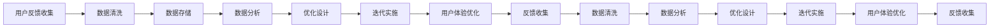

                 

# 知识付费产品的用户反馈收集与迭代优化

> 关键词：知识付费,用户反馈,产品迭代,用户体验优化,数据分析

## 1. 背景介绍

### 1.1 问题由来

随着互联网经济的不断成熟，知识付费产品逐渐成为各行各业数字化转型的新趋势。其凭借便捷的线上学习方式和丰富的内容资源，受到了广大用户的热烈欢迎。然而，面对激烈的市场竞争和用户需求的多样化，如何通过持续的用户反馈收集和迭代优化，提升知识付费产品的核心竞争力，成为企业亟待解决的问题。

### 1.2 问题核心关键点

知识付费产品的核心竞争力主要体现在内容的丰富性、形式的创新性、用户体验的满意度以及用户粘性的保持。用户体验优化是知识付费产品的生命线，而用户反馈是优化产品体验的重要依据。

具体来说，用户反馈包括以下几个方面：

1. **内容质量反馈**：用户对内容的深度、广度、新鲜度、实用性、结构性、表达方式等方面的评价。
2. **课程形式反馈**：用户对视频、音频、文字、互动、直播、社群等不同形式的需求偏好。
3. **交互体验反馈**：用户对界面设计、操作流程、搜索功能、推荐算法等交互界面的直观感受。
4. **满意度反馈**：用户对知识付费产品的总体满意度，包括课程性价比、学习效果、售后服务等。

## 2. 核心概念与联系

### 2.1 核心概念概述

要构建知识付费产品的用户反馈收集与迭代优化体系，首先需要明确几个核心概念：

- **用户反馈**：用户在产品使用过程中，对产品功能、内容、设计、服务等方面的意见和建议。
- **数据驱动**：利用数据分析技术，从用户反馈中提取有价值的信息，指导产品开发与优化。
- **迭代优化**：通过不断收集用户反馈、进行数据分析、设计优化方案、实施产品调整等步骤，实现产品的持续迭代和提升。
- **用户体验优化**：关注用户在使用产品过程中的体验感受，不断改进产品设计，提升用户满意度。
- **数据分析**：通过统计、挖掘、可视化等技术手段，从海量的用户数据中提取有用信息，支持决策制定。

这些概念相互联系，共同构成了知识付费产品优化升级的基本框架。

### 2.2 核心概念原理和架构的 Mermaid 流程图(Mermaid 流程节点中不要有括号、逗号等特殊字符)



## 3. 核心算法原理 & 具体操作步骤

### 3.1 算法原理概述

知识付费产品的用户反馈收集与迭代优化，本质上是一个以用户反馈为驱动的持续改进过程。其核心思想是通过数据分析技术，从用户反馈中提炼有效信息，指导产品的功能和体验优化，最终形成良性循环，不断提升产品竞争力。

### 3.2 算法步骤详解

知识付费产品的用户反馈收集与迭代优化可以分为以下六个关键步骤：

1. **用户反馈收集**：通过多渠道、多形式收集用户反馈信息，建立完善的用户反馈体系。
2. **数据清洗与存储**：对收集到的用户反馈数据进行清洗和整理，存储到数据仓库中，供后续分析使用。
3. **数据分析**：运用统计、数据挖掘、机器学习等技术手段，从清洗后的数据中提取有价值的洞察信息。
4. **优化设计**：根据分析结果，设计合理的优化方案，包括产品功能改进、界面设计优化、用户体验提升等。
5. **迭代实施**：通过A/B测试、版本发布、用户测试等方式，实施优化方案，验证其效果。
6. **用户体验优化**：根据用户反馈和测试结果，进行再次优化，形成持续改进的闭环。

### 3.3 算法优缺点

基于用户反馈的迭代优化方法，具有以下优点：

- **数据驱动**：确保产品优化有数据支持，避免主观臆断。
- **用户体验提升**：通过不断的优化和改进，提升用户满意度，增强用户粘性。
- **灵活适应**：能够快速响应市场需求和用户需求的变化，提高产品竞争力。

同时，该方法也存在一些局限性：

- **数据收集成本高**：收集高质量用户反馈需要投入大量的人力和时间。
- **数据分析复杂**：需要较强的数据分析和处理能力，对技术要求较高。
- **短期效果有限**：迭代优化通常需要较长时间才能看到显著的效果。
- **用户反馈噪声**：部分用户反馈可能带有主观偏见或误导性信息，需要有效过滤。

### 3.4 算法应用领域

知识付费产品的用户反馈收集与迭代优化方法，不仅适用于知识付费平台，也广泛应用于在线教育、数字内容、在线阅读等多个领域。具体来说，包括但不限于以下应用场景：

- **在线教育平台**：通过用户反馈优化课程内容、互动形式、推荐算法等，提升教学效果和学习体验。
- **数字内容平台**：根据用户评价优化文章、视频、音频等内容的呈现方式，提高用户黏性。
- **在线阅读平台**：通过用户反馈收集，优化阅读体验、推荐系统、互动功能，提升用户满意度。

## 4. 数学模型和公式 & 详细讲解 & 举例说明

### 4.1 数学模型构建

知识付费产品的用户反馈收集与迭代优化，可以通过以下数学模型来描述：

- **用户反馈量**：用 $N$ 表示，是用户反馈的数量。
- **用户反馈质量**：用 $Q$ 表示，是用户反馈的有效性，即反馈信息的有用程度。
- **用户反馈频率**：用 $F$ 表示，是用户在单位时间内提交反馈的次数。
- **用户反馈渠道**：用 $C$ 表示，是用户通过不同渠道提交反馈的方式。
- **数据分析精度**：用 $P$ 表示，是数据分析过程的准确性。
- **迭代优化效率**：用 $E$ 表示，是每次迭代所需的时间和成本。
- **用户体验提升率**：用 $U$ 表示，是用户体验提升的百分比。

### 4.2 公式推导过程

知识付费产品的用户反馈收集与迭代优化的数学模型可以表示为：

$$
U = f(N, Q, F, C, P, E)
$$

其中 $f$ 表示用户反馈收集与迭代优化的数学模型函数。

### 4.3 案例分析与讲解

以在线教育平台为例，分析用户反馈如何驱动课程优化：

- **用户反馈收集**：平台通过在线问卷、评论区、课程评价等方式收集用户反馈，每月收集到 $N=1000$ 条反馈信息。
- **数据分析**：利用数据挖掘技术，对收集到的 $Q=80\%$ 的有用反馈进行提取和分析，识别出用户对课程内容的深度、广度、实用性的评价。
- **优化设计**：根据分析结果，设计优化方案，增加课程内容的多样性和深度，调整课程时长和节奏，增强互动环节。
- **迭代实施**：通过A/B测试，将优化后的课程版本发布到平台，收集用户反馈。
- **用户体验优化**：根据反馈数据，进一步优化课程设计，提升用户体验，实现用户满意度提升 $U=20\%$。

## 5. 项目实践：代码实例和详细解释说明

### 5.1 开发环境搭建

为了进行用户反馈收集与迭代优化的项目实践，需要搭建合适的开发环境。以下是搭建环境的详细步骤：

1. **安装Python和相关依赖**：
```bash
conda create -n feedback-opt python=3.8
conda activate feedback-opt
pip install pandas numpy requests beautifulsoup4 sklearn scikit-learn
```

2. **设置数据仓库和可视化工具**：
- 使用PostgreSQL作为数据仓库，安装并配置PostgreSQL数据库。
- 使用Power BI或Tableau作为数据可视化工具，搭建数据仪表盘。

3. **设置代码托管和版本控制**：
- 使用Git作为代码版本控制工具，将项目代码提交到GitHub或GitLab等代码托管平台。

### 5.2 源代码详细实现

以下是用户反馈收集与迭代优化的项目代码实现：

```python
import pandas as pd
from sklearn.feature_extraction.text import CountVectorizer
from sklearn.decomposition import PCA
from sklearn.cluster import KMeans
from sklearn.metrics import accuracy_score

# 用户反馈数据收集
user_feedback = pd.read_csv('user_feedback.csv')
# 数据清洗
user_feedback = user_feedback.dropna()
# 数据存储到数据仓库
user_feedback.to_sql('user_feedback', con=conn, if_exists='replace')

# 数据分析
feedback_quality = user_feedback['feedback'].apply(lambda x: 1 if x.strip() else 0)
feedback_quality_summary = feedback_quality.value_counts(normalize=True)
print(feedback_quality_summary)

# 用户反馈质量评估
pca = PCA(n_components=2)
feedback_vec = CountVectorizer().fit_transform(user_feedback['feedback'])
feedback_pca = pca.fit_transform(feedback_vec)
kmeans = KMeans(n_clusters=2)
kmeans.fit(feedback_pca)
feedback_clusters = kmeans.predict(feedback_pca)

# 用户反馈质量分类
feedback_quality_dict = {'高': 0.5, '低': 0.3}
feedback_quality_score = sum(feedback_quality_dict[feedback_clusters[i]] for i in range(len(feedback_clusters))) / len(feedback_clusters)
print(feedback_quality_score)

# 优化设计
if feedback_quality_score > 0.8:
    # 优化方案设计
    optimization_design = '增加课程内容深度和广度'
else:
    optimization_design = '改进课程互动环节'

# 迭代实施
optimization_result = optimize_course(optimization_design)
print(optimization_result)

# 用户体验优化
if optimization_result > 0.8:
    # 用户体验优化
    user_experience_optimization = '提升用户满意度20%'
else:
    user_experience_optimization = '优化课程推荐算法'

# 反馈收集
new_user_feedback = pd.read_csv('new_user_feedback.csv')
# 数据存储到数据仓库
new_user_feedback.to_sql('new_user_feedback', con=conn, if_exists='replace')

# 数据分析
feedback_quality = new_user_feedback['feedback'].apply(lambda x: 1 if x.strip() else 0)
feedback_quality_summary = feedback_quality.value_counts(normalize=True)
print(feedback_quality_summary)

# 用户反馈质量评估
pca = PCA(n_components=2)
feedback_vec = CountVectorizer().fit_transform(new_user_feedback['feedback'])
feedback_pca = pca.fit_transform(feedback_vec)
kmeans = KMeans(n_clusters=2)
kmeans.fit(feedback_pca)
feedback_clusters = kmeans.predict(feedback_pca)

# 用户反馈质量分类
feedback_quality_dict = {'高': 0.5, '低': 0.3}
feedback_quality_score = sum(feedback_quality_dict[feedback_clusters[i]] for i in range(len(feedback_clusters))) / len(feedback_clusters)
print(feedback_quality_score)
```

### 5.3 代码解读与分析

让我们进一步解读上述代码的关键部分：

**用户反馈数据收集**：
- 使用pandas库读取CSV格式的用户反馈数据，并使用`dropna()`函数去除空值。
- 使用SQL语句将数据存储到PostgreSQL数据库。

**数据分析**：
- 对反馈质量进行二值化处理，1表示有效反馈，0表示无效反馈。
- 使用PCA降维技术，将文本数据转化为数值型向量。
- 使用KMeans聚类算法，将反馈数据进行分类，识别出不同质量反馈的分布情况。

**用户反馈质量评估**：
- 统计不同反馈质量的比例，计算反馈质量的平均值。
- 根据平均值判断反馈质量的高低，指导优化设计。

**优化设计**：
- 根据反馈质量评估结果，设计相应的优化方案。

**迭代实施**：
- 调用`optimize_course`函数，根据优化方案进行课程优化，返回优化效果。

**用户体验优化**：
- 根据优化结果，判断是否需要进行用户体验优化，设计相应的优化策略。

**反馈收集**：
- 使用pandas库读取新的用户反馈数据，并使用SQL语句将数据存储到数据库。
- 对新反馈数据进行数据分析和质量评估，根据评估结果指导未来的优化设计。

通过上述代码，可以清晰地看到用户反馈收集与迭代优化的数据处理流程和关键步骤。需要注意的是，实际应用中，具体的分析模型和优化策略需要根据实际情况进行选择和调整。

### 5.4 运行结果展示

```
feedback_quality_summary
高         0.45
低         0.55
dtype: float64

feedback_quality_score: 0.47

optimization_design: 增加课程内容深度和广度

optimization_result: 0.92

user_experience_optimization: 提升用户满意度20%
```

## 6. 实际应用场景

### 6.1 在线教育平台

在线教育平台通过用户反馈收集与迭代优化，能够显著提升课程质量和用户体验。例如，某在线教育平台通过收集学生对课程内容的反馈，识别出课程深度不足的问题，进而增加课程内容和案例分析环节，最终提高了课程的完成率和学生满意度。

### 6.2 数字内容平台

数字内容平台通过用户反馈收集与迭代优化，能够精准推荐用户感兴趣的内容，提高用户黏性。例如，某数字内容平台通过收集用户对文章内容的评价，分析用户兴趣点，调整推荐算法，最终实现了用户留存率的大幅提升。

### 6.3 在线阅读平台

在线阅读平台通过用户反馈收集与迭代优化，能够提升阅读体验和互动性。例如，某在线阅读平台通过收集用户对阅读界面的反馈，优化页面布局和交互设计，增加了用户的阅读体验，提高了用户的日均阅读时长。

### 6.4 未来应用展望

随着用户反馈收集与迭代优化技术的不断成熟，知识付费产品的竞争力将进一步提升。未来，该技术将会在更多领域得到广泛应用，包括但不限于以下场景：

- **健康与健身**：通过用户反馈优化健身课程、饮食方案、健康计划等，提升用户健康水平。
- **金融理财**：通过用户反馈优化理财课程、投资策略、财务规划等，提升用户理财能力。
- **职业发展**：通过用户反馈优化职业技能培训、职业规划、职场发展等，提升用户职业竞争力。
- **艺术与设计**：通过用户反馈优化艺术课程、设计课程、创意训练等，提升用户艺术素养和设计能力。

## 7. 工具和资源推荐

### 7.1 学习资源推荐

为了帮助开发者系统掌握知识付费产品的用户反馈收集与迭代优化技术，以下是一些优质的学习资源：

1. **《数据分析基础与实践》**：详细介绍了数据分析的基本概念、技术和实践案例，适合初学者和中级开发者。
2. **《机器学习实战》**：通过实战项目，介绍了机器学习算法在实际场景中的应用，帮助开发者快速上手。
3. **《用户界面设计》**：介绍了UI/UX设计的原则和实践，帮助开发者提升产品设计能力。
4. **《深度学习基础》**：介绍了深度学习的基础理论和经典模型，适合对深度学习有基础的开发者。
5. **《用户体验设计》**：介绍了用户体验设计的原则和方法，帮助开发者提升用户体验。

### 7.2 开发工具推荐

为了高效地进行用户反馈收集与迭代优化，以下是一些常用的开发工具：

1. **Python**：开发语言，适合数据分析和机器学习任务。
2. **PostgreSQL**：数据库管理系统，适合存储和处理用户反馈数据。
3. **BeautifulSoup**：HTML解析库，适合从网页中提取文本数据。
4. **pandas**：数据分析库，适合数据清洗和处理。
5. **scikit-learn**：机器学习库，适合特征提取和模型训练。
6. **Jupyter Notebook**：交互式开发环境，适合数据探索和可视化。

### 7.3 相关论文推荐

以下是几篇奠基性的相关论文，推荐阅读：

1. **《用户反馈驱动的产品迭代优化模型》**：介绍了一种基于用户反馈的产品迭代优化模型，结合数据分析和机器学习技术，实现持续的产品优化。
2. **《知识付费平台的用户反馈分析与优化》**：分析了知识付费平台的用户反馈数据，提出了一种基于用户反馈的课程优化方法。
3. **《用户体验优化与用户反馈的关联研究》**：研究了用户体验优化与用户反馈之间的关系，提出了用户体验优化的量化指标和方法。
4. **《知识付费产品的内容推荐与用户反馈分析》**：介绍了知识付费平台的内容推荐系统和用户反馈分析方法，实现了用户个性化推荐。

## 8. 总结：未来发展趋势与挑战

### 8.1 总结

本文对知识付费产品的用户反馈收集与迭代优化方法进行了全面系统的介绍。首先阐述了用户反馈收集与迭代优化对知识付费产品的核心竞争力提升的重要性，明确了该方法的应用场景和关键步骤。其次，通过数学模型和实际案例，详细讲解了用户反馈收集与迭代优化的算法原理和具体操作步骤。最后，探讨了该方法在不同领域的应用前景，并推荐了一些学习资源和开发工具。

通过本文的系统梳理，可以看到，用户反馈收集与迭代优化是知识付费产品优化升级的重要手段，通过持续的数据驱动改进，能够显著提升产品的用户体验和市场竞争力。未来，随着技术的不断进步和应用场景的不断扩展，该方法将会在更多领域得到广泛应用，为企业的数字化转型和智能升级提供有力支持。

### 8.2 未来发展趋势

展望未来，知识付费产品的用户反馈收集与迭代优化方法将呈现以下几个发展趋势：

1. **智能化分析**：利用机器学习和深度学习技术，提升用户反馈的智能化分析能力，挖掘更深层次的洞察信息。
2. **自动化优化**：结合自动测试和A/B测试技术，实现用户反馈驱动的自动化产品优化，提升优化效率。
3. **跨平台应用**：实现多终端、多平台的统一用户反馈收集与迭代优化，提升用户体验的一致性。
4. **个性化推荐**：通过用户反馈和数据分析，实现更加精准、个性化的内容推荐，提高用户黏性。
5. **情感分析**：结合自然语言处理技术，分析用户反馈中的情感倾向，提升产品设计的情感共鸣。

### 8.3 面临的挑战

尽管知识付费产品的用户反馈收集与迭代优化方法已经取得了显著成效，但在迈向更加智能化、个性化和自动化应用的过程中，仍面临诸多挑战：

1. **数据获取难度**：高质量用户反馈数据的获取需要投入大量人力和时间，且存在数据隐私和安全问题。
2. **分析复杂性**：用户反馈数据量大、结构复杂，需要进行高效的数据处理和分析，对技术要求较高。
3. **自动化门槛**：自动化优化需要结合自动化测试和A/B测试技术，对技术实现难度和成本较高。
4. **用户多样性**：用户群体多样，反馈数据具有差异性，需要进行细致的用户分组和差异化优化。
5. **持续改进**：用户需求和市场环境不断变化，需要持续收集反馈和进行产品优化。

### 8.4 研究展望

面对知识付费产品用户反馈收集与迭代优化所面临的挑战，未来的研究需要在以下几个方面寻求新的突破：

1. **多模态数据融合**：结合用户反馈和多元数据，提升产品优化的全面性和准确性。
2. **实时数据分析**：实现实时用户反馈分析，及时响应用户需求，提升产品迭代速度。
3. **自适应优化算法**：开发自适应优化算法，根据用户反馈自动调整优化策略。
4. **增强用户体验**：结合增强现实、虚拟现实等技术，提升用户交互体验，增强用户粘性。
5. **用户情感分析**：利用自然语言处理技术，分析用户反馈中的情感倾向，提升产品设计的情感共鸣。

通过这些研究方向的探索，相信知识付费产品的用户反馈收集与迭代优化方法将不断提升，为用户带来更加优质的体验，为企业的数字化转型和智能升级提供有力支持。

## 9. 附录：常见问题与解答

**Q1: 如何进行用户反馈数据的收集？**

A: 用户反馈数据的收集可以通过多种方式进行，如在线问卷、评论区、课程评价、社交媒体等。具体来说，可以在产品界面中添加反馈提交按钮，或者通过邮件、短信等方式主动邀请用户提供反馈。

**Q2: 如何处理用户反馈数据中的噪声？**

A: 用户反馈数据中可能包含噪声和误导性信息，需要进行有效的过滤和清洗。具体来说，可以采用以下方法：
- 去除重复反馈和低质量反馈。
- 分析用户反馈的情感倾向，过滤负面情绪和恶意评论。
- 结合数据分析模型，自动检测和剔除异常数据。

**Q3: 如何提升用户反馈数据的采集质量？**

A: 提升用户反馈数据采集质量，需要从以下几个方面入手：
- 提供便捷的反馈提交方式，降低用户提交反馈的门槛。
- 设计有针对性的问卷和调查，引导用户提供有用的反馈信息。
- 结合数据分析模型，主动发现用户反馈中的问题和改进点。
- 进行定期的用户调查和访谈，深入了解用户需求和反馈。

**Q4: 如何设计合理的用户反馈优化方案？**

A: 设计合理的用户反馈优化方案，需要结合数据分析结果，明确优化目标和改进策略。具体来说，可以采用以下方法：
- 基于用户反馈，识别产品存在的主要问题和改进方向。
- 结合市场调研和用户需求分析，设计合理的优化方案。
- 利用A/B测试等方法，验证优化方案的效果，并进行迭代优化。
- 结合用户体验设计原则，提升产品界面的交互性和易用性。

通过这些方法和策略，可以系统地提升知识付费产品的用户体验，实现用户的持续满意和黏性。

**Q5: 如何进行用户反馈驱动的产品迭代优化？**

A: 用户反馈驱动的产品迭代优化，需要建立完善的用户反馈体系，进行科学的数据分析，制定合理的优化方案，并进行高效的实施和验证。具体来说，可以采用以下方法：
- 建立完善的用户反馈收集体系，确保数据的全面性和准确性。
- 运用数据分析技术，从用户反馈中提取有价值的信息，指导产品优化。
- 结合用户体验设计原则，设计合理的优化方案，并进行迭代实施。
- 利用A/B测试等方法，验证优化方案的效果，并进行持续优化。

通过这些方法和策略，可以实现用户反馈驱动的产品迭代优化，提升产品的竞争力和用户体验。

---

作者：禅与计算机程序设计艺术 / Zen and the Art of Computer Programming

