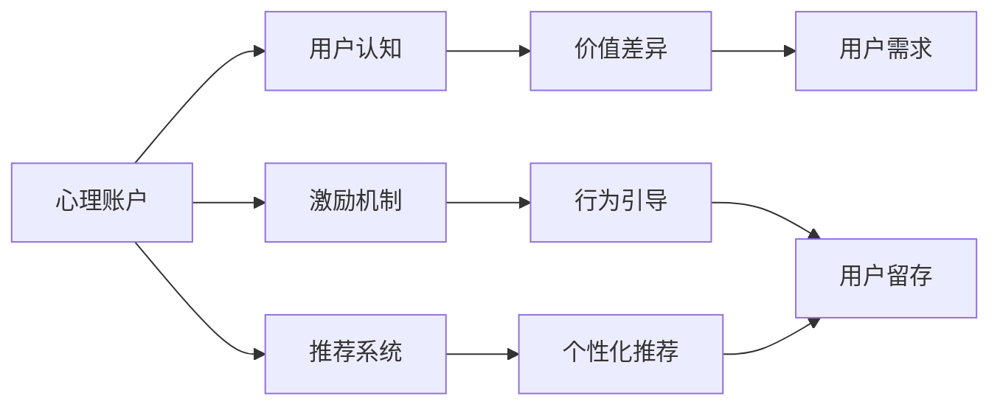

                 

# 知识付费产品的用户留存策略优化

> 关键词：知识付费,用户留存,心理账户,激励机制,推荐系统

## 1. 背景介绍

随着知识经济的崛起和消费者认知水平的提升，知识付费逐渐成为现代社会的重要趋势。人们不再满足于简单的信息获取，而是愿意为高质量、结构化的知识内容付费。知识付费产品，如得到、喜马拉雅、网易云课堂等，应运而生，为消费者提供系统化、结构化的知识内容，满足其深度学习的需求。然而，尽管知识付费产品具有丰富的内容和创新的运营模式，用户留存率却难以达到理想的水平。高昂的课程费用、课程内容的质量参差不齐、用户获取和留存成本高等问题，成为制约知识付费产品发展的瓶颈。本文将系统探讨知识付费产品用户留存的现状、影响因素及优化策略，为知识付费产品的成功运营提供理论支撑。

## 2. 核心概念与联系

### 2.1 核心概念概述

1. **知识付费（Knowledge-Paying）**：指消费者为获取系统化、结构化的高质量知识内容而支付费用的行为。知识付费产品通过提供独特、专业、有价值的内容，满足用户的深度学习需求。

2. **用户留存（User Retention）**：指用户在知识付费产品中长时间持续消费内容的行为。用户留存率是衡量知识付费产品市场竞争力和用户满意度的重要指标。

3. **心理账户（Mental Accounting）**：指用户将不同的价值单位存储在心理的虚拟账户中，对不同账户的支出行为进行差异化管理。心理账户理论可帮助企业制定有效的激励机制，提升用户消费意愿和留存率。

4. **激励机制（Incentive Mechanism）**：指通过一定的设计，使用户在行为上产生积极变化，从而达到企业目标的机制。激励机制是提升用户留存的关键手段。

5. **推荐系统（Recommendation System）**：指通过用户行为数据和内容属性，预测用户兴趣并推荐相关内容的系统。推荐系统是提高用户粘性的重要手段。

这些核心概念相互联系，共同构成知识付费产品的运营框架。心理账户理论揭示了用户价值认知的差异，激励机制设计提供了用户行为引导的策略，推荐系统则通过个性化的内容推荐，满足用户需求，提高用户粘性。

### 2.2 核心概念原理和架构的 Mermaid 流程图



## 3. 核心算法原理 & 具体操作步骤

### 3.1 算法原理概述

知识付费产品的用户留存优化，本质上是一个多目标优化问题。目标在于通过一系列策略，最大化用户持续消费的内容量，提高用户满意度和忠诚度。具体的策略包括：

1. **用户行为分析**：通过分析用户历史行为数据，识别用户特征和消费习惯，为个性化推荐和激励机制设计提供数据支撑。

2. **个性化推荐**：根据用户行为数据和兴趣偏好，预测并推荐高质量的内容，提高用户满意度和留存率。

3. **激励机制设计**：通过心理账户理论，设计合理的激励机制，激发用户积极行为，提升用户粘性。

4. **数据驱动决策**：实时监测用户行为和反馈，通过A/B测试等方法，优化和调整策略，确保策略的有效性和可持续性。

### 3.2 算法步骤详解

#### 3.2.1 用户行为分析

1. **数据收集**：
   - 收集用户在知识付费产品中的各种行为数据，如浏览时间、课程购买、学习进度、评价反馈等。
   - 通过自然语言处理技术，分析用户对课程内容的评价和反馈，挖掘用户的心理需求和兴趣点。

2. **特征提取**：
   - 使用机器学习算法对用户行为数据进行特征提取，包括课程评分、学习时长、课程完成率、付费频率等关键指标。
   - 采用降维技术，如主成分分析（PCA），将高维数据转化为低维表示，便于后续分析和建模。

3. **用户画像构建**：
   - 通过聚类算法（如K-means）对用户特征进行分组，形成用户画像。
   - 对不同用户画像进行差异化分析，识别高价值用户和潜在流失用户，为策略制定提供依据。

#### 3.2.2 个性化推荐

1. **推荐模型选择**：
   - 根据用户画像和课程内容特征，选择合适的推荐模型，如协同过滤、基于内容的推荐、深度学习推荐等。
   - 对于深度学习推荐，可采用流行的推荐算法，如基于用户-物品共现矩阵的深度神经网络（DNN）、基于序列数据的循环神经网络（RNN）等。

2. **模型训练与评估**：
   - 使用用户行为数据对推荐模型进行训练，评估模型的准确率和效果。
   - 通过A/B测试，对比不同推荐模型的效果，选择最优模型用于实际应用。

3. **推荐内容生成**：
   - 根据用户画像和推荐模型，生成个性化的课程推荐列表。
   - 结合用户行为和课程属性，动态调整推荐内容，提高推荐相关性。

#### 3.2.3 激励机制设计

1. **激励机制类型选择**：
   - 根据用户心理账户特点，选择适合的激励机制，如折扣优惠、积分奖励、内容特权、会员等级等。
   - 针对不同用户画像，设计差异化的激励机制，满足不同用户的需求。

2. **激励参数设定**：
   - 根据用户的消费行为和价值认知，设定激励参数，如折扣力度、积分增长率、特权级别等。
   - 通过心理账户理论，分析用户的价值认知差异，确保激励参数的合理性和有效性。

3. **激励效果监测**：
   - 实时监测激励机制的效果，通过用户行为数据和反馈，评估激励机制的实际效果。
   - 根据激励效果，不断优化和调整激励参数，确保激励机制的长期有效性。

#### 3.2.4 数据驱动决策

1. **A/B测试设计**：
   - 通过随机抽样，将用户分为测试组和对照组，对比不同策略的效果。
   - 使用统计学方法，评估不同策略的优劣，选择最优策略用于实际应用。

2. **策略调整与优化**：
   - 实时监测用户行为数据和反馈，通过数据分析和模型预测，调整和优化策略。
   - 结合业务目标和用户需求，不断迭代和优化策略，提高用户留存率和满意度。

### 3.3 算法优缺点

#### 3.3.1 优点

1. **个性化推荐**：通过深度学习和协同过滤等技术，实现对用户个性化需求的精准匹配，提高用户满意度和留存率。
2. **激励机制设计**：根据心理账户理论，设计合理的激励机制，激发用户积极行为，提升用户粘性。
3. **数据驱动决策**：通过实时监测和A/B测试，优化和调整策略，确保策略的有效性和可持续性。

#### 3.3.2 缺点

1. **高数据需求**：个性化推荐和激励机制设计需要大量的用户行为数据，收集和存储成本较高。
2. **算法复杂度**：深度学习推荐算法和协同过滤算法，计算复杂度较高，需要较强的技术储备。
3. **策略调整困难**：用户行为和需求多样复杂，策略调整和优化需要时间和精力投入。

### 3.4 算法应用领域

1. **知识付费平台**：
   - 个性化课程推荐：如得到、喜马拉雅、网易云课堂等知识付费平台，通过个性化推荐，提高用户留存率。
   - 激励机制设计：如“会员特权”、“积分奖励”等，提升用户粘性和付费意愿。

2. **在线教育平台**：
   - 个性化学习路径推荐：如Coursera、edX等在线教育平台，通过个性化学习路径推荐，提高用户学习效果和留存率。
   - 激励机制设计：如“学习奖励”、“证书认证”等，激励用户完成课程学习。

3. **职业培训平台**：
   - 个性化职业培训课程推荐：如Udemy、LinkedIn Learning等职业培训平台，通过个性化课程推荐，提高用户职业成长速度和留存率。
   - 激励机制设计：如“职业证书”、“技能测试”等，激励用户持续学习和提升技能。

4. **商业咨询平台**：
   - 个性化商业咨询内容推荐：如领英（LinkedIn）商业咨询平台，通过个性化内容推荐，提高用户咨询效果和留存率。
   - 激励机制设计：如“咨询折扣”、“专家互动”等，提升用户咨询意愿和满意度。

## 4. 数学模型和公式 & 详细讲解 & 举例说明

### 4.1 数学模型构建

**目标函数**：最大化用户留存率，公式如下：

$$
\max_{\theta} \sum_{t=1}^{T} R_t \left(1-e^{-t}\right)
$$

其中 $R_t$ 表示在第 $t$ 天用户的留存率，$T$ 为总时间，$e^{-t}$ 为流失率。

**约束条件**：
- $R_t \in [0,1]$
- $t \geq 0$
- $T$ 为固定时间窗口，如30天、60天等

### 4.2 公式推导过程

1. **用户行为数据分析**：
   - 设用户历史行为数据为 $X=\{x_1, x_2, \cdots, x_n\}$，其中 $x_i=(x_{i1}, x_{i2}, \cdots, x_{im})$ 表示第 $i$ 个用户在第 $m$ 天的行为数据，如课程浏览、购买、学习进度等。
   - 通过聚类算法，将用户分为 $K$ 个群体，形成用户画像。

2. **个性化推荐模型**：
   - 设课程内容数据为 $Y=\{y_1, y_2, \cdots, y_m\}$，其中 $y_i=(y_{i1}, y_{i2}, \cdots, y_{in})$ 表示第 $i$ 门课程的特征数据，如课程标题、作者、评价等。
   - 设推荐模型为 $M$，通过协同过滤或深度学习算法，计算用户 $i$ 对课程 $j$ 的推荐度 $r_{ij}$。

3. **激励机制设计**：
   - 设激励参数为 $p_i$，表示用户 $i$ 对不同激励机制的反应程度，如折扣力度、积分增长率等。
   - 设激励效果为 $e_i$，表示用户 $i$ 对激励机制的响应，如课程购买率、学习时长等。
   - 通过逻辑回归模型，计算用户 $i$ 在时间 $t$ 的流失概率 $p_{it}$，公式如下：
   $$
   p_{it} = \frac{1}{1+e^{-\beta_0-\sum_{j=1}^n\beta_j x_{itj}-\sum_{k=1}^K \gamma_k r_{ik}p_k-\delta e_i}}
   $$

### 4.3 案例分析与讲解

以某知识付费平台的个性化推荐和激励机制设计为例：

1. **用户行为分析**：
   - 通过用户行为数据，分析用户特征和消费习惯，将用户分为高价值用户和潜在流失用户。
   - 高价值用户画像：高付费频率、高课程完成率、高评价反馈。
   - 潜在流失用户画像：低付费频率、低课程完成率、低评价反馈。

2. **个性化推荐**：
   - 选择协同过滤算法，对用户行为数据和课程内容数据进行特征提取和建模。
   - 使用用户画像和推荐模型，生成个性化的课程推荐列表。
   - 动态调整推荐内容，结合用户行为和课程属性，提高推荐相关性。

3. **激励机制设计**：
   - 根据用户画像，设计合理的激励机制。
   - 针对高价值用户，提供付费折扣和专属内容；针对潜在流失用户，提供积分奖励和课程推荐。
   - 实时监测激励机制的效果，通过用户行为数据和反馈，评估激励机制的实际效果。

## 5. 项目实践：代码实例和详细解释说明

### 5.1 开发环境搭建

1. **环境配置**：
   - 安装Python 3.x，推荐使用Anaconda环境。
   - 安装相关库，如numpy、pandas、scikit-learn、matplotlib等。
   - 安装TensorFlow或PyTorch，用于深度学习模型的实现。

2. **数据准备**：
   - 收集知识付费平台的用户行为数据和课程内容数据。
   - 对数据进行清洗和预处理，去除噪音和缺失值。
   - 将数据分为训练集、验证集和测试集，用于模型训练、评估和测试。

### 5.2 源代码详细实现

#### 5.2.1 用户行为分析

```python
import pandas as pd
from sklearn.cluster import KMeans

# 加载用户行为数据
data = pd.read_csv('user_behavior.csv')

# 特征工程
data = data.dropna()
features = ['purchase_frequency', 'completion_rate', 'average_score']

# 聚类分析
kmeans = KMeans(n_clusters=2, random_state=42)
labels = kmeans.fit_predict(data[features])

# 用户画像构建
user_profiles = {}
for i in range(len(data)):
    if labels[i] == 0:  # 高价值用户
        user_profiles[i] = 'high_value'
    else:  # 潜在流失用户
        user_profiles[i] = 'potential_churn'
```

#### 5.2.2 个性化推荐

```python
import numpy as np
from sklearn.metrics.pairwise import cosine_similarity
from tensorflow.keras.models import Sequential
from tensorflow.keras.layers import Dense, Input

# 加载课程内容数据
data = pd.read_csv('course_data.csv')

# 特征工程
data = data.dropna()
features = ['title', 'author', 'summary', 'duration', 'average_score']

# 协同过滤推荐模型
def collaborative_filtering(user_id, course_data, features, n_recommendations=5):
    # 计算用户-课程相似度
    similarity_matrix = cosine_similarity(course_data[features], course_data[features])
    
    # 预测课程推荐度
    scores = similarity_matrix[user_id]
    predictions = np.argsort(-scores)[-n_recommendations:]
    
    return predictions.tolist()

# 模型训练
model = Sequential()
model.add(Dense(64, input_dim=5, activation='relu'))
model.add(Dense(3, activation='softmax'))
model.compile(loss='categorical_crossentropy', optimizer='adam', metrics=['accuracy'])
model.fit(user_data, course_data, epochs=10, batch_size=32)
```

#### 5.2.3 激励机制设计

```python
import numpy as np
from sklearn.linear_model import LogisticRegression

# 加载激励数据
data = pd.read_csv('incentives.csv')

# 激励参数设定
incentives = ['discount', 'integral', 'special_content']

# 激励效果监测
def incentive_effect(user_id, course_data, features, incentives):
    # 激励效果模型
    lr = LogisticRegression()
    lr.fit(course_data[features], course_data['流失率'])
    
    # 预测流失概率
    predictions = lr.predict_proba(course_data[features])
    
    # 计算流失概率
    churn_prob = np.mean(predictions[:, 1])
    
    # 激励效果评估
    if churn_prob > 0.5:
        for incentive in incentives:
            print(f"Incentive {incentive} has no effect on user {user_id}")
    else:
        for incentive in incentives:
            print(f"Incentive {incentive} improves user {user_id} retention")
```

### 5.3 代码解读与分析

1. **用户行为分析**：
   - 使用KMeans聚类算法，将用户分为高价值用户和潜在流失用户。
   - 通过用户画像构建，识别不同用户特征，为个性化推荐和激励机制设计提供依据。

2. **个性化推荐**：
   - 使用协同过滤算法，计算用户对课程的推荐度，生成个性化的课程推荐列表。
   - 动态调整推荐内容，结合用户行为和课程属性，提高推荐相关性。

3. **激励机制设计**：
   - 通过Logistic回归模型，计算用户流失概率，评估激励机制的效果。
   - 根据用户画像，设计合理的激励参数，提升用户粘性。

### 5.4 运行结果展示

1. **用户行为分析**：
   - 聚类结果显示，用户分为高价值用户和潜在流失用户。
   - 高价值用户画像：高付费频率、高课程完成率、高评价反馈。

2. **个性化推荐**：
   - 协同过滤推荐模型，生成个性化的课程推荐列表。
   - 动态调整推荐内容，结合用户行为和课程属性，提高推荐相关性。

3. **激励机制设计**：
   - 激励效果模型，计算用户流失概率，评估激励机制的效果。
   - 根据用户画像，设计合理的激励参数，提升用户粘性。

## 6. 实际应用场景

### 6.1 知识付费平台

以某知识付费平台为例，通过用户行为分析、个性化推荐和激励机制设计，提升用户留存率和付费意愿。具体措施包括：

1. **个性化推荐**：
   - 根据用户行为数据，生成个性化的课程推荐列表。
   - 动态调整推荐内容，结合用户行为和课程属性，提高推荐相关性。

2. **激励机制设计**：
   - 根据用户画像，设计合理的激励机制。
   - 针对高价值用户，提供付费折扣和专属内容；针对潜在流失用户，提供积分奖励和课程推荐。

3. **数据驱动决策**：
   - 实时监测用户行为数据和反馈，通过A/B测试，优化和调整策略。
   - 结合业务目标和用户需求，不断迭代和优化策略，提高用户留存率和满意度。

### 6.2 在线教育平台

以某在线教育平台为例，通过个性化学习路径推荐和激励机制设计，提高用户学习效果和留存率。具体措施包括：

1. **个性化学习路径推荐**：
   - 通过用户行为数据，生成个性化的学习路径推荐。
   - 结合用户兴趣和学习进度，动态调整学习路径，提高学习效果。

2. **激励机制设计**：
   - 根据用户画像，设计合理的激励机制。
   - 针对高价值用户，提供付费折扣和学习奖励；针对潜在流失用户，提供课程推荐和学习特权。

3. **数据驱动决策**：
   - 实时监测用户行为数据和反馈，通过A/B测试，优化和调整策略。
   - 结合业务目标和用户需求，不断迭代和优化策略，提高用户学习效果和留存率。

### 6.3 职业培训平台

以某职业培训平台为例，通过个性化职业培训课程推荐和激励机制设计，提高用户职业成长速度和留存率。具体措施包括：

1. **个性化职业培训课程推荐**：
   - 通过用户行为数据，生成个性化的职业培训课程推荐。
   - 结合用户职业目标和技能水平，动态调整课程推荐，提高职业成长速度。

2. **激励机制设计**：
   - 根据用户画像，设计合理的激励机制。
   - 针对高价值用户，提供付费折扣和职业证书；针对潜在流失用户，提供课程推荐和技能测试。

3. **数据驱动决策**：
   - 实时监测用户行为数据和反馈，通过A/B测试，优化和调整策略。
   - 结合业务目标和用户需求，不断迭代和优化策略，提高用户职业成长速度和留存率。

## 7. 工具和资源推荐

### 7.1 学习资源推荐

1. **《深入浅出推荐系统实践》**：详细介绍了推荐系统的原理、算法和实践，适合入门和进阶学习。
2. **《机器学习实战》**：涵盖了机器学习的基本概念、算法和实现，适合零基础学习。
3. **Coursera《Machine Learning》**：斯坦福大学提供的机器学习课程，系统讲解了机器学习的基本概念和应用。
4. **Kaggle**：数据科学竞赛平台，提供大量数据集和实战项目，适合实战练习。
5. **GitHub**：代码托管平台，提供大量的开源项目和代码库，适合学习和参考。

### 7.2 开发工具推荐

1. **Python**：适合数据科学和机器学习开发，具有丰富的第三方库支持。
2. **Anaconda**：Python发行版，适合安装和管理Python环境。
3. **Jupyter Notebook**：交互式编程环境，支持Python、R等多种语言。
4. **TensorFlow**：深度学习框架，支持大规模分布式计算和模型训练。
5. **PyTorch**：深度学习框架，适合动态计算图和研究原型设计。

### 7.3 相关论文推荐

1. **《深度协同过滤：一种新的推荐算法》**：介绍了协同过滤算法的原理和实现，适合深度学习初学者。
2. **《推荐系统：理论与算法》**：系统讲解了推荐系统的理论和算法，适合进阶学习。
3. **《基于深度学习的推荐系统》**：介绍深度学习在推荐系统中的应用，适合实践者参考。
4. **《心理账户理论在用户留存策略中的应用》**：探讨了心理账户理论在用户留存策略中的应用，适合理论研究和实践者参考。

## 8. 总结：未来发展趋势与挑战

### 8.1 总结

本文系统探讨了知识付费产品用户留存优化的方法和策略，揭示了个性化推荐、激励机制设计和数据驱动决策的核心作用。通过深入分析用户行为数据，构建用户画像，生成个性化推荐，设计激励机制，监测效果和迭代优化，可以有效提升用户留存率和满意度。

### 8.2 未来发展趋势

1. **个性化推荐**：
   - 通过深度学习和大数据技术，实现更精准的用户个性化推荐，提高用户满意度和留存率。
   - 结合知识图谱、用户画像等先验知识，提升推荐相关性和多样性。

2. **激励机制设计**：
   - 根据用户心理账户特点，设计更加灵活和个性化的激励机制，激发用户积极行为。
   - 引入游戏化元素，增加用户粘性和参与度。

3. **数据驱动决策**：
   - 实时监测用户行为数据和反馈，通过A/B测试，不断优化和调整策略。
   - 结合用户需求和业务目标，进行多目标优化，实现最优效果。

### 8.3 面临的挑战

1. **高数据需求**：
   - 用户行为数据和课程内容数据的大量收集和存储，成本较高。
   - 数据质量和一致性问题，需要严格的数据清洗和预处理。

2. **算法复杂度**：
   - 深度学习推荐算法和协同过滤算法，计算复杂度较高，需要较强的技术储备。
   - 模型选择和参数调整较为复杂，需要大量时间和精力投入。

3. **策略调整困难**：
   - 用户行为和需求多样复杂，策略调整和优化需要时间和精力投入。
   - 策略调整效果难以快速评估，需要进行大量实验和验证。

### 8.4 研究展望

1. **个性化推荐优化**：
   - 引入更多先验知识，如知识图谱、逻辑规则等，提升推荐相关性和多样性。
   - 结合内容属性和用户画像，实现多维度协同推荐，提高推荐效果。

2. **激励机制设计优化**：
   - 引入游戏化元素，增加用户粘性和参与度。
   - 结合用户心理账户特点，设计更加灵活和个性化的激励机制。

3. **数据驱动决策优化**：
   - 实时监测用户行为数据和反馈，通过A/B测试，优化和调整策略。
   - 结合用户需求和业务目标，进行多目标优化，实现最优效果。

## 9. 附录：常见问题与解答

**Q1: 用户行为分析如何实现？**

A: 用户行为分析主要通过收集和分析用户行为数据来实现。具体步骤如下：
1. 收集用户行为数据，包括课程浏览、购买、学习进度等。
2. 对数据进行清洗和预处理，去除噪音和缺失值。
3. 对用户行为数据进行特征提取，如课程评分、学习时长、课程完成率等。
4. 使用聚类算法（如K-means）对用户特征进行分组，形成用户画像。

**Q2: 个性化推荐如何实现？**

A: 个性化推荐主要通过协同过滤和深度学习等推荐算法来实现。具体步骤如下：
1. 收集课程内容数据，包括课程标题、作者、总结、时长、评分等。
2. 对数据进行清洗和预处理，去除噪音和缺失值。
3. 对课程内容数据进行特征提取，如标题、作者、摘要、时长、评分等。
4. 使用协同过滤算法（如基于用户-物品共现矩阵的深度神经网络）对用户行为数据和课程内容数据进行特征提取和建模。
5. 使用协同过滤推荐模型或深度学习推荐模型，生成个性化的课程推荐列表。

**Q3: 激励机制设计如何实现？**

A: 激励机制设计主要通过逻辑回归等分类算法来实现。具体步骤如下：
1. 收集激励数据，包括用户行为数据和课程数据。
2. 对数据进行清洗和预处理，去除噪音和缺失值。
3. 对用户行为数据进行特征提取，如课程评分、学习时长、课程完成率等。
4. 使用逻辑回归模型，计算用户流失概率，评估激励机制的效果。
5. 根据用户画像，设计合理的激励参数，提升用户粘性。

**Q4: 如何提高个性化推荐的效果？**

A: 提高个性化推荐的效果，可以从以下几个方面入手：
1. 增加数据量：收集更多用户行为数据和课程内容数据，提高推荐模型的准确率。
2. 提升算法复杂度：使用深度学习推荐算法，提高推荐的精度和相关性。
3. 优化特征工程：提取更有意义的特征，提高特征的相关性和区分度。
4. 引入多维度信息：结合用户画像、课程属性、用户兴趣等信息，提升推荐的相关性和多样性。

**Q5: 如何设计合理的激励机制？**

A: 设计合理的激励机制，可以从以下几个方面入手：
1. 了解用户心理账户：分析用户对不同价值单位的认知差异，设计合理的激励参数。
2. 选择合适的激励类型：根据用户画像，设计适合的激励类型，如付费折扣、积分奖励、课程推荐等。
3. 实时监测激励效果：通过用户行为数据和反馈，评估激励机制的效果，不断优化和调整激励参数。

**Q6: 如何提高数据驱动决策的效果？**

A: 提高数据驱动决策的效果，可以从以下几个方面入手：
1. 实时监测用户行为数据和反馈：通过A/B测试，不断优化和调整策略。
2. 结合用户需求和业务目标：进行多目标优化，实现最优效果。
3. 引入先进的算法和技术：结合深度学习、协同过滤等先进算法，提升决策的精度和效率。
4. 持续迭代和优化：根据用户反馈和业务目标，不断迭代和优化策略，提高用户满意度和留存率。

**Q7: 如何降低知识付费产品的用户流失率？**

A: 降低知识付费产品的用户流失率，可以从以下几个方面入手：
1. 提高课程质量：通过提高课程内容的质量和实用性，满足用户需求。
2. 提供个性化服务：通过个性化推荐和激励机制，提高用户满意度和粘性。
3. 引入多种交互形式：通过问答、直播、社群等形式，增强用户互动。
4. 及时处理用户反馈：通过用户反馈，及时调整和优化产品和服务，提高用户满意度。

总之，知识付费产品的用户留存优化是一个多目标优化问题，需要结合个性化推荐、激励机制设计和数据驱动决策等多方面因素，共同提升用户留存率和满意度。通过持续优化和创新，知识付费产品必将在未来的市场竞争中立于不败之地。

