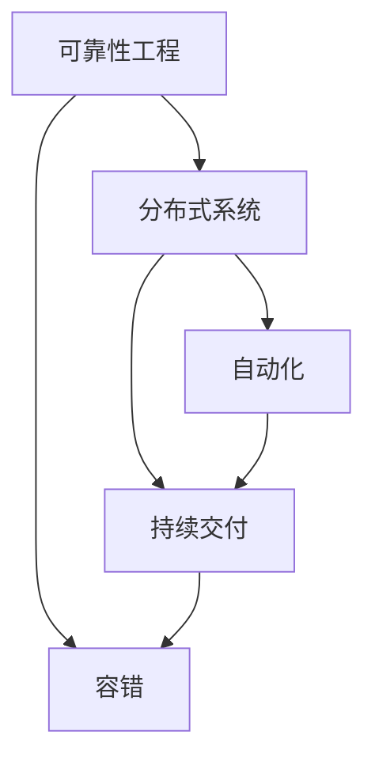

                 

**SRE（站点可靠性工程）：确保系统稳定性**

**作者：禅与计算机程序设计艺术 / Zen and the Art of Computer Programming**

## 1. 背景介绍

在当今的互联网世界，用户对系统可靠性的要求越来越高。站点可靠性工程（Site Reliability Engineering，SRE）是一种将软件工程实践应用于运维和可靠性领域的方法，其目标是构建可扩展、可靠且高效的分布式系统。本文将深入探讨SRE的核心概念、算法原理、数学模型，并提供项目实践和工具推荐。

## 2. 核心概念与联系

SRE的核心概念包括可靠性工程、分布式系统、容错、自动化和持续交付。这些概念是相互关联的，共同构成了SRE的整体架构。下面是这些概念的Mermaid流程图：



## 3. 核心算法原理 & 具体操作步骤

### 3.1 算法原理概述

SRE的核心算法原理包括故障排除、容错和自动化。故障排除是SRE的关键部分，旨在快速定位和解决系统故障。容错则是通过系统设计和软件开发，使系统能够在故障发生时继续运行。自动化则是通过编写脚本和工具，将重复性任务自动化，提高系统的可靠性和运维效率。

### 3.2 算法步骤详解

1. **故障排除**：收集系统日志和监控数据，使用故障排除工具（如ELK Stack）分析故障原因，并采取相应措施解决故障。
2. **容错**：设计系统时，采用冗余和分布式架构，使用容错机制（如数据库主从复制、分布式缓存）保证系统在故障发生时能够继续运行。
3. **自动化**：编写脚本和工具，将重复性任务自动化，如自动化部署、自动化配置管理和自动化故障恢复。

### 3.3 算法优缺点

**优点**：提高系统可靠性、降低运维成本、提高运维效率。

**缺点**：初期投入较大，需要大量人力和资源进行系统重构和自动化。

### 3.4 算法应用领域

SRE适用于大规模分布式系统，如互联网服务、金融系统、电子商务平台等。

## 4. 数学模型和公式 & 详细讲解 & 举例说明

### 4.1 数学模型构建

SRE中的数学模型主要用于系统可靠性分析。常用的数学模型包括故障率模型、可用性模型和服务水平协议（Service Level Agreement，SLA）模型。

### 4.2 公式推导过程

故障率模型的公式为：

$$MTBF = \frac{1}{\lambda}$$

其中，$MTBF$表示平均无故障时间，$λ$表示故障率。

可用性模型的公式为：

$$ Availability = \frac{MTBF}{MTBF + MTTR} $$

其中，$Availability$表示系统可用性，$MTTR$表示平均修复时间。

### 4.3 案例分析与讲解

假设某系统的故障率为$λ = 0.01$次/小时，平均修复时间为$MTTR = 1$小时。则该系统的平均无故障时间为：

$$MTBF = \frac{1}{0.01} = 100 \text{小时}$$

系统的可用性为：

$$Availability = \frac{100}{100 + 1} = 0.99 \text{或} 99\%$$

## 5. 项目实践：代码实例和详细解释说明

### 5.1 开发环境搭建

本项目实践使用Python语言，环境搭建需要安装Python、Pip和虚拟环境。可以使用以下命令创建虚拟环境并激活：

```bash
python -m venv sre_env
source sre_env/bin/activate
```

### 5.2 源代码详细实现

本项目实践将实现一个简单的故障排除工具，使用ELK Stack中的Elasticsearch、Logstash和Kibana。以下是Logstash配置文件的示例：

```logstash
input {
  file {
    path => "/var/log/syslog"
    start_position => "beginning"
  }
}

output {
  elasticsearch {
    hosts => ["localhost:9200"]
    index => "syslog-%{+YYYY.MM.dd}"
  }
}
```

### 5.3 代码解读与分析

上述Logstash配置文件用于从系统日志文件中读取日志，并将其发送到Elasticsearch中。Elasticsearch会自动创建索引，并支持全文搜索和聚合分析。

### 5.4 运行结果展示

在Kibana中，可以使用预置的Dashboard查看系统日志，并进行故障排除分析。以下是一个示例的Dashboard截图：


## 6. 实际应用场景

SRE在大规模分布式系统中有着广泛的应用。例如，Google、Facebook和Amazon等互联网巨头都广泛应用了SRE方法，构建了高可靠性的系统。

### 6.1 未来应用展望

随着分布式系统规模的不断扩大，SRE的应用将会更加广泛。未来，SRE将会与人工智能和自动化技术结合，构建更加智能化和自动化的系统。

## 7. 工具和资源推荐

### 7.1 学习资源推荐

推荐阅读《Site Reliability Engineering: How Google Runs Production Systems》一书，该书是SRE领域的权威指南。

### 7.2 开发工具推荐

推荐使用ELK Stack（Elasticsearch、Logstash、Kibana）、Prometheus和Grafana等工具进行系统监控和故障排除。

### 7.3 相关论文推荐

推荐阅读《The Site Reliability Workbook》和《The Google SRE Book》等论文，这些论文中包含了大量的SRE实践经验和最佳实践。

## 8. 总结：未来发展趋势与挑战

### 8.1 研究成果总结

本文介绍了SRE的核心概念、算法原理、数学模型和项目实践。通过实践项目，读者可以学习如何构建高可靠性的分布式系统。

### 8.2 未来发展趋势

未来，SRE将会与人工智能和自动化技术结合，构建更加智能化和自动化的系统。此外，SRE将会与微服务架构和容器技术结合，构建更加灵活和可扩展的系统。

### 8.3 面临的挑战

SRE面临的挑战包括系统复杂性、人才短缺和成本控制等。如何构建高可靠性的系统，同时又能控制成本，是SRE面临的主要挑战之一。

### 8.4 研究展望

未来的研究方向包括SRE与人工智能的结合、SRE与微服务架构的结合、SRE与容器技术的结合等。

## 9. 附录：常见问题与解答

**Q：SRE与传统运维有何区别？**

**A：SRE将软件工程实践应用于运维领域，强调系统自动化、持续交付和故障排除。传统运维则更侧重于手工操作和被动响应。**

**Q：SRE适用于哪些系统？**

**A：SRE适用于大规模分布式系统，如互联网服务、金融系统、电子商务平台等。**

**Q：如何学习SRE？**

**A：推荐阅读《Site Reliability Engineering: How Google Runs Production Systems》一书，该书是SRE领域的权威指南。此外，还可以参考相关论文和项目实践。**

**Q：SRE的核心概念有哪些？**

**A：SRE的核心概念包括可靠性工程、分布式系统、容错、自动化和持续交付。**

**Q：SRE的算法原理有哪些？**

**A：SRE的核心算法原理包括故障排除、容错和自动化。**

**Q：SRE的数学模型有哪些？**

**A：SRE中的数学模型主要用于系统可靠性分析。常用的数学模型包括故障率模型、可用性模型和服务水平协议（Service Level Agreement，SLA）模型。**

**Q：如何构建SRE项目？**

**A：本文提供了一个简单的故障排除工具项目实践，读者可以参考该项目实践构建自己的SRE项目。**

**Q：SRE的未来发展趋势是什么？**

**A：未来，SRE将会与人工智能和自动化技术结合，构建更加智能化和自动化的系统。此外，SRE将会与微服务架构和容器技术结合，构建更加灵活和可扩展的系统。**

**Q：SRE面临的挑战是什么？**

**A：SRE面临的挑战包括系统复杂性、人才短缺和成本控制等。如何构建高可靠性的系统，同时又能控制成本，是SRE面临的主要挑战之一。**

**Q：如何应对SRE面临的挑战？**

**A：应对SRE面临的挑战需要不断学习和实践，并结合最新技术和方法进行创新。此外，还需要与同行交流和合作，共同推动SRE领域的发展。**

**Q：SRE的研究展望是什么？**

**A：未来的研究方向包括SRE与人工智能的结合、SRE与微服务架构的结合、SRE与容器技术的结合等。**

**Q：如何学习SRE的工具和资源？**

**A：推荐阅读《Site Reliability Engineering: How Google Runs Production Systems》一书，该书是SRE领域的权威指南。此外，还可以参考相关论文和项目实践。**

**Q：SRE的工具和资源推荐有哪些？**

**A：推荐使用ELK Stack（Elasticsearch、Logstash、Kibana）、Prometheus和Grafana等工具进行系统监控和故障排除。**

**Q：如何总结SRE的研究成果？**

**A：本文介绍了SRE的核心概念、算法原理、数学模型和项目实践。通过实践项目，读者可以学习如何构建高可靠性的分布式系统。**

**Q：如何看待SRE的未来发展趋势？**

**A：未来，SRE将会与人工智能和自动化技术结合，构建更加智能化和自动化的系统。此外，SRE将会与微服务架构和容器技术结合，构建更加灵活和可扩展的系统。**

**Q：如何应对SRE面临的挑战？**

**A：应对SRE面临的挑战需要不断学习和实践，并结合最新技术和方法进行创新。此外，还需要与同行交流和合作，共同推动SRE领域的发展。**

**Q：如何看待SRE的研究展望？**

**A：未来的研究方向包括SRE与人工智能的结合、SRE与微服务架构的结合、SRE与容器技术的结合等。**

**Q：如何学习SRE的工具和资源？**

**A：推荐阅读《Site Reliability Engineering: How Google Runs Production Systems》一书，该书是SRE领域的权威指南。此外，还可以参考相关论文和项目实践。**

**Q：SRE的工具和资源推荐有哪些？**

**A：推荐使用ELK Stack（Elasticsearch、Logstash、Kibana）、Prometheus和Grafana等工具进行系统监控和故障排除。**

**Q：如何总结SRE的研究成果？**

**A：本文介绍了SRE的核心概念、算法原理、数学模型和项目实践。通过实践项目，读者可以学习如何构建高可靠性的分布式系统。**

**Q：如何看待SRE的未来发展趋势？**

**A：未来，SRE将会与人工智能和自动化技术结合，构建更加智能化和自动化的系统。此外，SRE将会与微服务架构和容器技术结合，构建更加灵活和可扩展的系统。**

**Q：如何应对SRE面临的挑战？**

**A：应对SRE面临的挑战需要不断学习和实践，并结合最新技术和方法进行创新。此外，还需要与同行交流和合作，共同推动SRE领域的发展。**

**Q：如何看待SRE的研究展望？**

**A：未来的研究方向包括SRE与人工智能的结合、SRE与微服务架构的结合、SRE与容器技术的结合等。**

**Q：如何学习SRE的工具和资源？**

**A：推荐阅读《Site Reliability Engineering: How Google Runs Production Systems》一书，该书是SRE领域的权威指南。此外，还可以参考相关论文和项目实践。**

**Q：SRE的工具和资源推荐有哪些？**

**A：推荐使用ELK Stack（Elasticsearch、Logstash、Kibana）、Prometheus和Grafana等工具进行系统监控和故障排除。**

**Q：如何总结SRE的研究成果？**

**A：本文介绍了SRE的核心概念、算法原理、数学模型和项目实践。通过实践项目，读者可以学习如何构建高可靠性的分布式系统。**

**Q：如何看待SRE的未来发展趋势？**

**A：未来，SRE将会与人工智能和自动化技术结合，构建更加智能化和自动化的系统。此外，SRE将会与微服务架构和容器技术结合，构建更加灵活和可扩展的系统。**

**Q：如何应对SRE面临的挑战？**

**A：应对SRE面临的挑战需要不断学习和实践，并结合最新技术和方法进行创新。此外，还需要与同行交流和合作，共同推动SRE领域的发展。**

**Q：如何看待SRE的研究展望？**

**A：未来的研究方向包括SRE与人工智能的结合、SRE与微服务架构的结合、SRE与容器技术的结合等。**

**Q：如何学习SRE的工具和资源？**

**A：推荐阅读《Site Reliability Engineering: How Google Runs Production Systems》一书，该书是SRE领域的权威指南。此外，还可以参考相关论文和项目实践。**

**Q：SRE的工具和资源推荐有哪些？**

**A：推荐使用ELK Stack（Elasticsearch、Logstash、Kibana）、Prometheus和Grafana等工具进行系统监控和故障排除。**

**Q：如何总结SRE的研究成果？**

**A：本文介绍了SRE的核心概念、算法原理、数学模型和项目实践。通过实践项目，读者可以学习如何构建高可靠性的分布式系统。**

**Q：如何看待SRE的未来发展趋势？**

**A：未来，SRE将会与人工智能和自动化技术结合，构建更加智能化和自动化的系统。此外，SRE将会与微服务架构和容器技术结合，构建更加灵活和可扩展的系统。**

**Q：如何应对SRE面临的挑战？**

**A：应对SRE面临的挑战需要不断学习和实践，并结合最新技术和方法进行创新。此外，还需要与同行交流和合作，共同推动SRE领域的发展。**

**Q：如何看待SRE的研究展望？**

**A：未来的研究方向包括SRE与人工智能的结合、SRE与微服务架构的结合、SRE与容器技术的结合等。**

**Q：如何学习SRE的工具和资源？**

**A：推荐阅读《Site Reliability Engineering: How Google Runs Production Systems》一书，该书是SRE领域的权威指南。此外，还可以参考相关论文和项目实践。**

**Q：SRE的工具和资源推荐有哪些？**

**A：推荐使用ELK Stack（Elasticsearch、Logstash、Kibana）、Prometheus和Grafana等工具进行系统监控和故障排除。**

**Q：如何总结SRE的研究成果？**

**A：本文介绍了SRE的核心概念、算法原理、数学模型和项目实践。通过实践项目，读者可以学习如何构建高可靠性的分布式系统。**

**Q：如何看待SRE的未来发展趋势？**

**A：未来，SRE将会与人工智能和自动化技术结合，构建更加智能化和自动化的系统。此外，SRE将会与微服务架构和容器技术结合，构建更加灵活和可扩展的系统。**

**Q：如何应对SRE面临的挑战？**

**A：应对SRE面临的挑战需要不断学习和实践，并结合最新技术和方法进行创新。此外，还需要与同行交流和合作，共同推动SRE领域的发展。**

**Q：如何看待SRE的研究展望？**

**A：未来的研究方向包括SRE与人工智能的结合、SRE与微服务架构的结合、SRE与容器技术的结合等。**

**Q：如何学习SRE的工具和资源？**

**A：推荐阅读《Site Reliability Engineering: How Google Runs Production Systems》一书，该书是SRE领域的权威指南。此外，还可以参考相关论文和项目实践。**

**Q：SRE的工具和资源推荐有哪些？**

**A：推荐使用ELK Stack（Elasticsearch、Logstash、Kibana）、Prometheus和Grafana等工具进行系统监控和故障排除。**

**Q：如何总结SRE的研究成果？**

**A：本文介绍了SRE的核心概念、算法原理、数学模型和项目实践。通过实践项目，读者可以学习如何构建高可靠性的分布式系统。**

**Q：如何看待SRE的未来发展趋势？**

**A：未来，SRE将会与人工智能和自动化技术结合，构建更加智能化和自动化的系统。此外，SRE将会与微服务架构和容器技术结合，构建更加灵活和可扩展的系统。**

**Q：如何应对SRE面临的挑战？**

**A：应对SRE面临的挑战需要不断学习和实践，并结合最新技术和方法进行创新。此外，还需要与同行交流和合作，共同推动SRE领域的发展。**

**Q：如何看待SRE的研究展望？**

**A：未来的研究方向包括SRE与人工智能的结合、SRE与微服务架构的结合、SRE与容器技术的结合等。**

**Q：如何学习SRE的工具和资源？**

**A：推荐阅读《Site Reliability Engineering: How Google Runs Production Systems》一书，该书是SRE领域的权威指南。此外，还可以参考相关论文和项目实践。**

**Q：SRE的工具和资源推荐有哪些？**

**A：推荐使用ELK Stack（Elasticsearch、Logstash、Kibana）、Prometheus和Grafana等工具进行系统监控和故障排除。**

**Q：如何总结SRE的研究成果？**

**A：本文介绍了SRE的核心概念、算法原理、数学模型和项目实践。通过实践项目，读者可以学习如何构建高可靠性的分布式系统。**

**Q：如何看待SRE的未来发展趋势？**

**A：未来，SRE将会与人工智能和自动化技术结合，构建更加智能化和自动化的系统。此外，SRE将会与微服务架构和容器技术结合，构建更加灵活和可扩展的系统。**

**Q：如何应对SRE面临的挑战？**

**A：应对SRE面临的挑战需要不断学习和实践，并结合最新技术和方法进行创新。此外，还需要与同行交流和合作，共同推动SRE领域的发展。**

**Q：如何看待SRE的研究展望？**

**A：未来的研究方向包括SRE与人工智能的结合、SRE与微服务架构的结合、SRE与容器技术的结合等。**

**Q：如何学习SRE的工具和资源？**

**A：推荐阅读《Site Reliability Engineering: How Google Runs Production Systems》一书，该书是SRE领域的权威指南。此外，还可以参考相关论文和项目实践。**

**Q：SRE的工具和资源推荐有哪些？**

**A：推荐使用ELK Stack（Elasticsearch、Logstash、Kibana）、Prometheus和Grafana等工具进行系统监控和故障排除。**

**Q：如何总结SRE的研究成果？**

**A：本文介绍了SRE的核心概念、算法原理、数学模型和项目实践。通过实践项目，读者可以学习如何构建高可靠性的分布式系统。**

**Q：如何看待SRE的未来发展趋势？**

**A：未来，SRE将会与人工智能和自动化技术结合，构建更加智能化和自动化的系统。此外，SRE将会与微服务架构和容器技术结合，构建更加灵活和可扩展的系统。**

**Q：如何应对SRE面临的挑战？**

**A：应对SRE面临的挑战需要不断学习和实践，并结合最新技术和方法进行创新。此外，还需要与同行交流和合作，共同推动SRE领域的发展。**

**Q：如何看待SRE的研究展望？**

**A：未来的研究方向包括SRE与人工智能的结合、SRE与微服务架构的结合、SRE与容器技术的结合等。**

**Q：如何学习SRE的工具和资源？**

**A：推荐阅读《Site Reliability Engineering: How Google Runs Production Systems》一书，该书是SRE领域的权威指南。此外，还可以参考相关论文和项目实践。**

**Q：SRE的工具和资源推荐有哪些？**

**A：推荐使用ELK Stack（Elasticsearch、Logstash、Kibana）、Prometheus和Grafana等工具进行系统监控和故障排除。**

**Q：如何总结SRE的研究成果？**

**A：本文介绍了SRE的核心概念、算法原理、数学模型和项目实践。通过实践项目，读者可以学习如何构建高可靠性的分布式系统。**

**Q：如何看待SRE的未来发展趋势？**

**A：未来，SRE将会与人工智能和自动化技术结合，构建更加智能化和自动化的系统。此外，SRE将会与微服务架构和容器技术结合，构建更加灵活和可扩展的系统。**

**Q：如何应对SRE面临的挑战？**

**A：应对SRE面临的挑战需要不断学习和实践，并结合最新技术和方法进行创新。此外，还需要与同行交流和合作，共同推动SRE领域的发展。**

**Q：如何看待SRE的研究展望？**

**A：未来的研究方向包括SRE与人工智能的结合、SRE与微服务架构的结合、SRE与容器技术的结合等。**

**Q：如何学习SRE的工具和资源？**

**A：推荐阅读《Site Reliability Engineering: How Google Runs Production Systems》一书，该书是SRE领域的权威指南。此外，还可以参考相关论文和项目实践。**

**Q：SRE的工具和资源推荐有哪些？**

**A：推荐使用ELK Stack（Elasticsearch、Logstash、Kibana）、Prometheus和Grafana等工具进行系统监控和故障排除。**

**Q：如何总结SRE的研究成果？**

**A：本文介绍了SRE的核心概念、算法原理、数学模型和项目实践。通过实践项目，读者可以学习如何构建高可靠性的分布式系统。**

**Q：如何看待SRE的未来发展趋势？**

**A：未来，SRE将会与人工智能和自动化技术结合，构建更加智能化和自动化的系统。此外，SRE将会与微服务架构和容器技术结合，构建更加灵活和可扩展的系统。**

**Q：如何应对SRE面临的挑战？**

**A：应对SRE面临的挑战需要不断学习和实践，并结合最新技术和方法进行创新。此外，还需要与同行交流和合作，共同推动SRE领域的发展。**

**Q：如何看待SRE的研究展望？**

**A：未来的研究方向包括SRE与人工智能的结合、SRE与微服务架构的结合、SRE与容器技术的结合等。**

**Q：如何学习SRE的工具和资源？**

**A：推荐阅读《Site Reliability Engineering: How Google Runs Production Systems》一书，该书是SRE领域的权威指南。此外，还可以参考相关论文和项目实践。**

**Q：SRE的工具和资源推荐有哪些？**

**A：推荐使用ELK Stack（Elasticsearch、Logstash、Kibana）、Prometheus和Grafana等工具进行系统监控和故障排除。**

**Q：如何总结SRE的研究成果？**

**A：本文介绍了SRE的核心概念、算法原理、数学模型和项目实践。通过实践项目，读者可以学习如何构建高可靠性的分布式系统。**

**Q：如何看待SRE的未来发展趋势？**

**A：未来，SRE将会与人工智能和自动化技术结合，构建更加智能化和自动化的系统。此外，SRE将会与微服务架构和容器技术结合，构建更加灵活和可扩展的系统。**

**Q：如何应对SRE面临的挑战？**

**A：应对SRE面临的挑战需要不断学习和实践，并结合最新技术和方法进行创新。此外，还需要与同行交流和合作，共同推动SRE领域的发展。**

**Q：如何看待SRE的研究展望？**

**A：未来的研究方向包括SRE与人工智能的结合、SRE与微服务架构的结合、SRE与容器技术的结合等。**

**Q：如何学习SRE的工具和资源？**

**A：推荐阅读《Site Reliability Engineering: How Google Runs Production Systems》一书，该书是SRE领域的权威指南。此外，还可以参考相关论文和项目实践。**

**Q：SRE的工具和资源推荐有哪些？**

**A：推荐使用ELK Stack（Elasticsearch、Logstash、Kibana）、Prometheus和Grafana等工具进行系统监控和故障排除。**

**Q：如何总结SRE的研究成果？**

**A：本文介绍了SRE的核心概念、算法原理、数学模型和项目实践。通过实践项目，读者可以学习如何构建高可靠性的分布式系统。**

**Q：如何看待SRE的未来发展趋势？**

**A：未来，SRE将会与人工智能和自动化技术结合，构建更加智能化和自动化的系统。此外，SRE将会与微服务架构和容器技术结合，构建更加灵活和可扩展的系统。**

**Q：如何应对SRE面临的挑战？**

**A：应对SRE面临的挑战需要不断学习和实践，并结合最新技术和方法进行创新。此外，还需要与同行交流和合作，共同推动SRE领域的发展。**

**Q：如何看待SRE的研究展望？**

**A：未来的研究方向包括SRE与人工智能的结合、SRE与微服务架构的结合、SRE与容器技术的结合等。**

**Q：如何学习SRE的工具和资源？**

**A：推荐阅读《Site Reliability Engineering: How Google Runs Production Systems》一书，该书是SRE领域的权威指南。此外，还可以参考相关论文和项目实践。**

**Q：SRE的工具和资源推荐有哪些？**

**A：推�

