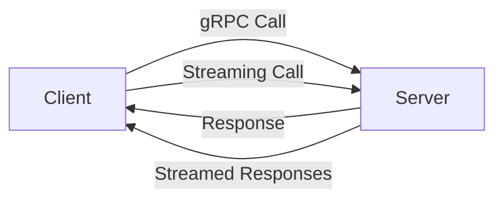

                 

**gRPC：高性能跨语言RPC框架**

**作者：禅与计算机程序设计艺术 / Zen and the Art of Computer Programming**

## 1. 背景介绍

在分布式系统中，远程过程调用（Remote Procedure Call，RPC）是一种常见的通信模式。传统的RPC框架，如JSON-RPC和XML-RPC，使用HTTP作为传输协议，但这导致了性能和开发效率的问题。为了解决这些问题，Google开发了gRPC，一个高性能、通用的RPC框架，支持多种语言和传输协议。

## 2. 核心概念与联系

gRPC是基于HTTP/2的，它提供了丰富的特性，如流控制、多路复用、头部压缩等。gRPC使用Protocol Buffers（protobuf）作为接口定义语言（IDL），并提供了生成客户端和服务端代码的工具。



图1：gRPC的基本工作原理

## 3. 核心算法原理 & 具体操作步骤

### 3.1 算法原理概述

gRPC使用HTTP/2作为传输协议，并提供了基于protobuf的接口定义。客户端和服务端使用gRPC生成的代码进行通信。gRPC支持同步和异步调用，以及流式调用。

### 3.2 算法步骤详解

1. 定义服务接口使用protobuf。
2. 运行 protoc 编译器生成客户端和服务端代码。
3. 在客户端，创建一个gRPC客户端对象，并调用服务方法。
4. 在服务端，实现服务方法，处理客户端的请求。
5. 客户端和服务端通过HTTP/2进行通信。

### 3.3 算法优缺点

**优点：**

- 基于HTTP/2，具有流控制、多路复用等特性。
- 使用protobuf，序列化和反序列化效率高。
- 支持同步、异步和流式调用。

**缺点：**

- 依赖于HTTP/2，可能会受到网络环境的影响。
- protobuf学习曲线相对较高。

### 3.4 算法应用领域

gRPC适用于需要高性能、低延迟的分布式系统，如微服务架构、实时通信等。它也可以用于构建跨语言的应用程序。

## 4. 数学模型和公式 & 详细讲解 & 举例说明

### 4.1 数学模型构建

gRPC使用protobuf定义服务接口，protobuf使用二进制格式存储数据。假设请求数据大小为$D$字节，则传输时间$T$可以表示为：

$$T = \frac{D}{B} + L$$

其中，$B$是带宽，单位为字节/秒，$L$是延迟，单位为秒。

### 4.2 公式推导过程

传输时间$T$由两部分组成：传输数据所需的时间和延迟。数据传输时间等于数据大小除以带宽，延迟是网络环境的固有属性。

### 4.3 案例分析与讲解

假设请求数据大小为1KB（1024字节），带宽为100Mbps（12500000字节/秒），延迟为0.5秒。则传输时间为：

$$T = \frac{1024}{12500000} + 0.5 \approx 0.500004 \text{秒}$$

## 5. 项目实践：代码实例和详细解释说明

### 5.1 开发环境搭建

- 安装gRPC：`go get -u github.com/grpc/grpc-go`
- 安装protobuf：`go get -u google.golang.org/protobuf/proto`
- 安装protoc-gen-go-grpc插件：`go get -u github.com/golang/protobuf/protoc-gen-go-grpc`

### 5.2 源代码详细实现

创建一个简单的服务接口`service.proto`：

```protobuf
syntax = "proto3";

package service;

service Greeter {
  rpc SayHello (HelloRequest) returns (HelloReply) {}
}

message HelloRequest {
  string name = 1;
}

message HelloReply {
  string message = 1;
}
```

生成客户端和服务端代码：

```bash
protoc --go_out=. --go-grpc_out=. service.proto
```

### 5.3 代码解读与分析

服务端代码`service_server.go`中，实现了`SayHello`方法：

```go
func (s *server) SayHello(ctx context.Context, in *pb.HelloRequest) (*pb.HelloReply, error) {
    return &pb.HelloReply{Message: "Hello " + in.Name}, nil
}
```

客户端代码`service_client.go`中，调用了`SayHello`方法：

```go
resp, err := client.SayHello(context.Background(), &pb.HelloRequest{Name: "Alice"})
if err!= nil {
    log.Fatalf("Could not greet: %v", err)
}
log.Printf("Greeting: %s", resp.Message)
```

### 5.4 运行结果展示

运行服务端和客户端代码，客户端应该打印出：

```
Greeting: Hello Alice
```

## 6. 实际应用场景

### 6.1 当前应用

gRPC被广泛应用于微服务架构中，如Uber、Square、CoreOS等公司都在使用gRPC。它也被用于构建实时通信应用程序，如Google的Protocol Buffers。

### 6.2 未来应用展望

随着HTTP/2的普及，gRPC有望成为RPC领域的标准。它也可以与其他技术结合，如gRPC-Web可以在浏览器中使用gRPC。

## 7. 工具和资源推荐

### 7.1 学习资源推荐

- gRPC官方文档：<https://grpc.io/docs/>
- gRPC中文文档：<https://www.grpc.io/docs/grpc/cpp/>
- Protocol Buffers官方文档：<https://developers.google.com/protocol-buffers>

### 7.2 开发工具推荐

- protoc：protobuf编译器
- protoc-gen-go-grpc：生成gRPC代码的插件
- grpcurl：命令行工具，用于调试gRPC服务

### 7.3 相关论文推荐

- [gRPC: High-Performance Remote Procedure Call for Modern Application Development](https://www.usenix.org/system/files/login/articles/login_summer16_07_rochko.pdf)
- [Protocol Buffers](https://research.google/pubs/pub35215/)

## 8. 总结：未来发展趋势与挑战

### 8.1 研究成果总结

gRPC提供了高性能、通用的RPC解决方案，它使用HTTP/2和protobuf，支持多种语言和传输协议。

### 8.2 未来发展趋势

随着HTTP/2的普及，gRPC有望成为RPC领域的标准。它也可以与其他技术结合，如gRPC-Web可以在浏览器中使用gRPC。

### 8.3 面临的挑战

gRPC依赖于HTTP/2，可能会受到网络环境的影响。protobuf学习曲线相对较高。

### 8.4 研究展望

未来的研究可以探索gRPC在其他领域的应用，如物联网、边缘计算等。也可以研究如何进一步提高gRPC的性能和可靠性。

## 9. 附录：常见问题与解答

**Q：gRPC与其他RPC框架有何不同？**

**A：gRPC使用HTTP/2作为传输协议，提供了流控制、多路复用等特性。它使用protobuf作为接口定义语言，序列化和反序列化效率高。它支持同步、异步和流式调用。**

**Q：gRPC支持哪些语言？**

**A：gRPC支持多种语言，包括但不限于Go、Java、C++、Python、Ruby、PHP、Objective-C、Swift等。**

**Q：gRPC如何处理错误？**

**A：gRPC使用HTTP/2的错误码和状态码来处理错误。它也支持自定义错误码。**

**Q：gRPC如何处理安全？**

**A：gRPC支持TLS/SSL加密，并提供了身份验证机制。它也支持互操作性，可以与其他安全机制结合使用。**

**作者：禅与计算机程序设计艺术 / Zen and the Art of Computer Programming**

