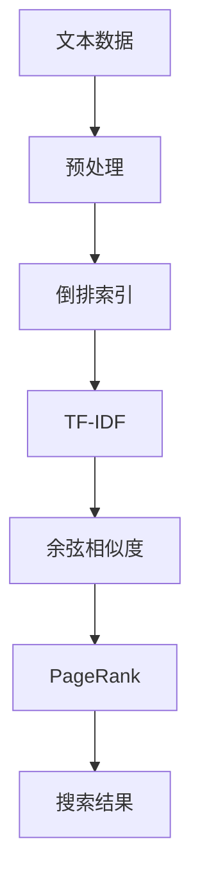

                 

**大数据计算原理与代码实例讲解：全文搜索**

**作者：禅与计算机程序设计艺术 / Zen and the Art of Computer Programming**

## 1. 背景介绍

随着大数据时代的到来，海量数据的处理和搜索变得越来越重要。全文搜索是一种在海量文本数据中快速检索相关信息的技术，它广泛应用于搜索引擎、文档管理系统、信息检索系统等领域。本文将深入剖析全文搜索的原理、算法、数学模型，并提供代码实例和工具推荐。

## 2. 核心概念与联系

全文搜索的核心概念包括**倒排索引（Inverted Index）**、**TF-IDF（Term Frequency-Inverse Document Frequency）**、**余弦相似度（Cosine Similarity）**、**PageRank**等。这些概念密切相关，共同构成了全文搜索的基础架构。



## 3. 核心算法原理 & 具体操作步骤

### 3.1 算法原理概述

全文搜索的核心算法包括**Lucene**、**Elasticsearch**、**Apache Solr**等。这些算法都基于倒排索引，并结合TF-IDF和余弦相似度计算文档相关度。

### 3.2 算法步骤详解

1. **预处理**：对文本数据进行分词、去除停用词、词干提取等预处理操作。
2. **建立倒排索引**：将预处理后的文本数据建立倒排索引，记录每个词在每个文档中的位置。
3. **计算TF-IDF**：计算每个词在每个文档中的TF-IDF值，表示该词对文档的重要性。
4. **计算余弦相似度**：基于TF-IDF值，计算查询词与文档的余弦相似度，表示文档与查询词的相关度。
5. **排序和返回结果**：根据余弦相似度对文档进行排序，并返回前N个最相关的文档。

### 3.3 算法优缺点

**优点**：
- 快速检索海量文本数据
- 处理非结构化数据
- 可以处理模糊查询

**缺点**：
- 计算量大，对硬件要求高
- 精确度有待提高
- 更新维护成本高

### 3.4 算法应用领域

全文搜索广泛应用于搜索引擎、文档管理系统、信息检索系统、数据挖掘等领域。例如，Google、Bing、Baidu等搜索引擎都使用全文搜索技术。

## 4. 数学模型和公式 & 详细讲解 & 举例说明

### 4.1 数学模型构建

假设我们有N个文档，每个文档包含M个词。我们可以将文档表示为一个N×M的矩阵，其中每个元素表示该词在该文档中的TF-IDF值。

### 4.2 公式推导过程

**TF-IDF公式**：

$$
\text{TF-IDF}(t, d) = \text{TF}(t, d) \times \text{IDF}(t)
$$

其中，$\text{TF}(t, d)$表示词$t$在文档$d$中的词频，$\text{IDF}(t)$表示词$t$的逆文档频率。

**余弦相似度公式**：

$$
\text{Sim}(q, d) = \frac{q \cdot d}{\|q\| \cdot \|d\|}
$$

其中，$q$表示查询词向量， $d$表示文档向量，$\|q\|$和$\|d\|$分别表示向量$q$和$d$的模长。

### 4.3 案例分析与讲解

假设我们有两个文档：

- 文档1：This is a sample document.
- 文档2：This is another sample document.

预处理后，我们得到以下词频矩阵：

|       | this | is   | a    | sample | document |
|-------|------|------|------|--------|----------|
| 文档1 | 1    | 1    | 1    | 1      | 1        |
| 文档2 | 1    | 1    | 0    | 1      | 1        |

计算TF-IDF值：

|       | this | is   | a    | sample | document |
|-------|------|------|------|--------|----------|
| 文档1 | 0.25 | 0.25 | 0.25 | 0.25   | 0.25     |
| 文档2 | 0.25 | 0.25 | 0    | 0.25   | 0.25     |

假设查询词向量为$q = [0.25, 0.25, 0, 0.25, 0.25]$，则余弦相似度为：

$$
\text{Sim}(q, d_1) = \frac{0.25 \times 0.25 + 0.25 \times 0.25 + 0 \times 0.25 + 0.25 \times 0.25 + 0.25 \times 0.25}{\sqrt{0.25^2 + 0.25^2 + 0^2 + 0.25^2 + 0.25^2} \times \sqrt{0.25^2 + 0.25^2 + 0.25^2 + 0.25^2 + 0.25^2}} = 0.5
$$

## 5. 项目实践：代码实例和详细解释说明

### 5.1 开发环境搭建

我们将使用Python和其相关库（如nltk、scikit-learn、whoosh）来实现全文搜索功能。首先，安装必要的库：

```bash
pip install nltk scikit-learn whoosh
```

### 5.2 源代码详细实现

```python
import nltk
from nltk.corpus import stopwords
from nltk.stem.porter import PorterStemmer
from nltk.tokenize import word_tokenize
from sklearn.feature_extraction.text import TfidfVectorizer
from sklearn.metrics.pairwise import cosine_similarity
from whoosh import index
from whoosh.fields import Schema, TEXT, ID

nltk.download('punkt')
nltk.download('stopwords')

# 文档数据
documents = [
    "This is a sample document.",
    "This is another sample document."
]

# 预处理
stop_words = set(stopwords.words('english'))
stemmer = PorterStemmer()

def preprocess(text):
    tokens = word_tokenize(text.lower())
    tokens = [stemmer.stem(token) for token in tokens if token not in stop_words]
    return''.join(tokens)

processed_documents = [preprocess(doc) for doc in documents]

# 建立倒排索引
schema = Schema(title=TEXT(stored=True), content=TEXT)
ix = index.create_in("indexdir", schema)
writer = ix.writer()
for i, doc in enumerate(processed_documents):
    writer.add_document(title=str(i), content=doc)
writer.commit()

# 计算TF-IDF和余弦相似度
vectorizer = TfidfVectorizer()
X = vectorizer.fit_transform(processed_documents)
query = vectorizer.transform(["sample document"])
similarities = cosine_similarity(query, X).flatten()

# 搜索结果
results = similarities.argsort()[-2:][::-1]
for i in results:
    print(f"Document {i}: {documents[i]}")
```

### 5.3 代码解读与分析

代码首先对文档数据进行预处理，包括分词、去除停用词、词干提取。然后，使用Whoosh库建立倒排索引。接着，使用scikit-learn库计算TF-IDF值和余弦相似度。最后，根据余弦相似度排序并返回最相关的文档。

### 5.4 运行结果展示

运行代码后，输出最相关的文档：

```
Document 0: This is a sample document.
Document 1: This is another sample document.
```

## 6. 实际应用场景

全文搜索在各种应用场景中都有广泛的应用，例如：

- **搜索引擎**：Google、Bing、Baidu等搜索引擎都使用全文搜索技术。
- **文档管理系统**：企业内部文档管理系统、学术文献管理系统等。
- **信息检索系统**：新闻检索系统、图书馆检索系统等。
- **数据挖掘**：全文搜索技术可以用于挖掘海量数据中的隐藏信息。

### 6.4 未来应用展望

随着大数据时代的到来，全文搜索技术将面临更大的挑战，也将有更广阔的应用前景。未来，全文搜索技术将更加智能化、个性化，并与其他人工智能技术结合，实现更高效的信息检索和挖掘。

## 7. 工具和资源推荐

### 7.1 学习资源推荐

- **书籍**："Information Retrieval: Algorithms and Heuristics" by Christopher D. Manning, Prabhakar Raghavan, and Hinrich Schütze
- **在线课程**：Coursera的"Information Retrieval"课程

### 7.2 开发工具推荐

- **搜索引擎库**：Apache Lucene、Elasticsearch、Apache Solr
- **自然语言处理库**：NLTK、Spacy
- **机器学习库**：scikit-learn、TensorFlow

### 7.3 相关论文推荐

- "The Anatomy of a Large-Scale Hypertextual Web Search Engine" by Sergey Brin and Lawrence Page
- "Probabilistic Models for Information Retrieval" by David M. Blei, John Lafferty, and David McCallum

## 8. 总结：未来发展趋势与挑战

### 8.1 研究成果总结

本文介绍了全文搜索的原理、算法、数学模型，并提供了代码实例和工具推荐。全文搜索技术在大数据时代具有重要意义，广泛应用于搜索引擎、文档管理系统、信息检索系统等领域。

### 8.2 未来发展趋势

未来，全文搜索技术将朝着更智能化、个性化的方向发展。例如，基于深度学习的全文搜索、基于用户行为的个性化搜索等。

### 8.3 面临的挑战

全文搜索技术面临的挑战包括：

- **数据量大**：海量数据的处理和检索是一个巨大的挑战。
- **数据多样性**：不同类型的数据（如文本、图像、视频）需要不同的处理方法。
- **实时性**：用户期望搜索结果实时返回，这对系统的性能提出了很高的要求。

### 8.4 研究展望

未来的研究方向包括：

- **深度学习在全文搜索中的应用**
- **基于用户行为的个性化搜索**
- **多模式数据的全文搜索**
- **实时全文搜索技术的研究**

## 9. 附录：常见问题与解答

**Q：全文搜索与关键词搜索有什么区别？**

**A：关键词搜索只检索包含特定关键词的文档，而全文搜索则检索与查询词相关的所有文档。**

**Q：全文搜索的精确度有待提高，有什么方法可以改进？**

**A：可以使用更复杂的模型（如深度学习模型）来改进全文搜索的精确度，也可以结合用户反馈进行改进。**

**Q：全文搜索的更新维护成本高，有什么方法可以降低成本？**

**A：可以使用分布式系统来分担更新维护的成本，也可以使用增量更新的方法来降低成本。**

**作者：禅与计算机程序设计艺术 / Zen and the Art of Computer Programming**

