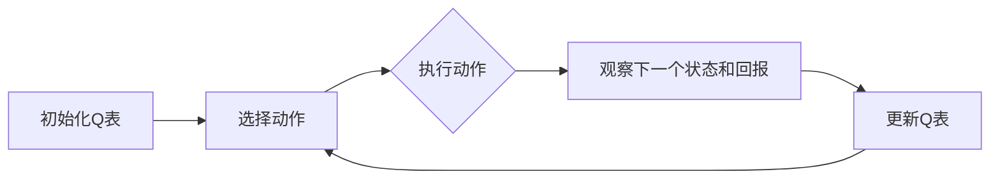

                 

**强化学习**, **Q-learning**, **工业控制**, **智能控制**, **动态系统**, **环境模型**, **算法改进**, **实时控制**

## 1. 背景介绍

在工业控制领域，控制系统需要不断适应动态环境，以实现预期的系统行为。传统的控制方法通常基于预先建立的环境模型，但这些模型可能不精确或难以获取。强化学习（Reinforcement Learning，RL）提供了一种无模型的学习方法，它可以直接从环境中学习，并适应动态变化的系统。本文将介绍如何将强化学习中的Q-learning算法应用于工业控制，以实现智能控制系统。

## 2. 核心概念与联系

### 2.1 强化学习与Q-learning

强化学习是一种机器学习方法，它允许智能体（agent）在与环境交互的过程中学习，以最大化某个回报函数。Q-learning是一种常见的强化学习算法，它使用Q函数来估计状态-动作对的期望回报。Q-learning算法的流程图如下：



### 2.2 工业控制与智能控制

工业控制系统旨在控制工业过程，以实现预期的系统行为。智能控制系统使用人工智能技术，如强化学习，来适应动态环境和提高控制性能。智能控制系统的目标是学习最优控制策略，以最大化系统性能指标。

## 3. 核心算法原理 & 具体操作步骤

### 3.1 算法原理概述

Q-learning是一种无模型的强化学习算法，它使用Q函数来估计状态-动作对的期望回报。Q-learning算法的核心是更新Q表，以反映学习到的状态-动作对的期望回报。

### 3.2 算法步骤详解

1. 初始化Q表：为每个状态-动作对初始化Q值。
2. 选择动作：根据当前状态选择一个动作。常见的策略包括ε-贪婪策略和软件策略。
3. 执行动作：执行选择的动作，并观察下一个状态和回报。
4. 更新Q表：使用下式更新Q表：

   $$Q(s, a) \leftarrow (1 - \alpha) \cdot Q(s, a) + \alpha \cdot (r + \gamma \cdot \max_{a'} Q(s', a'))$$

   其中，$\alpha$是学习率，$\gamma$是折扣因子，$r$是回报，$s$和$a$分别是当前状态和动作，$s'$是下一个状态，$a'$是下一个动作。

5. 重复步骤2-4，直到收敛或达到预定的迭代次数。

### 3.3 算法优缺点

**优点：**

* 无模型：Q-learning不需要预先建立环境模型。
* 适应性强：Q-learning可以适应动态变化的系统。
* 稳定性：Q-learning具有收敛性，可以保证找到最优策略。

**缺点：**

* 计算开销：Q-learning需要维护一个Q表，这可能会导致计算开销。
* 学习时间：Q-learning可能需要大量的学习时间才能收敛。
* 状态空间：Q-learning需要一个有限的状态空间，这可能会限制其应用领域。

### 3.4 算法应用领域

Q-learning可以应用于各种工业控制领域，包括：

* 机器人控制：Q-learning可以用于学习机器人控制策略，以实现预期的机器人行为。
* 电力系统控制：Q-learning可以用于学习电力系统控制策略，以实现预期的电力系统行为。
* 制造过程控制：Q-learning可以用于学习制造过程控制策略，以实现预期的制造过程行为。

## 4. 数学模型和公式 & 详细讲解 & 举例说明

### 4.1 数学模型构建

强化学习的数学模型包括状态空间、动作空间、回报函数和状态转移函数。在工业控制领域，状态空间通常是系统的状态向量，动作空间是可用的控制输入，回报函数是系统性能指标，状态转移函数描述系统的动态行为。

### 4.2 公式推导过程

Q-learning算法的更新规则可以推导如下：

1. 状态-动作对的期望回报定义为：

   $$Q(s, a) = E[R_{t+1} + \gamma R_{t+2} + \gamma^2 R_{t+3} + \ldots | S_t = s, A_t = a]$$

2. 使用Bellman方程，可以将期望回报表示为：

   $$Q(s, a) = E[R_{t+1} + \gamma \max_{a'} Q(S_{t+1}, a') | S_t = s, A_t = a]$$

3. 使用经验回放和 temporal difference (TD) 学习，可以得到Q-learning的更新规则：

   $$Q(s, a) \leftarrow (1 - \alpha) \cdot Q(s, a) + \alpha \cdot (r + \gamma \cdot \max_{a'} Q(s', a'))$$

### 4.3 案例分析与讲解

考虑一个简单的工业控制系统，即单位阻尼二阶系统：

$$m \ddot{x} + b \dot{x} + kx = u$$

其中，$m$是质量，$b$是阻尼系数，$k$是刚度，$u$是控制输入，$x$是系统状态。我们可以将系统状态表示为状态空间，控制输入表示为动作空间，系统性能指标表示为回报函数。我们可以使用Q-learning来学习最优控制策略，以实现预期的系统行为。

## 5. 项目实践：代码实例和详细解释说明

### 5.1 开发环境搭建

我们将使用Python和Gym库来实现Q-learning算法。首先，安装必要的库：

```bash
pip install gym numpy matplotlib
```

### 5.2 源代码详细实现

以下是Q-learning算法的Python实现：

```python
import numpy as np
import gym
import matplotlib.pyplot as plt

# 定义Q-learning参数
alpha = 0.1
gamma = 0.95
epsilon = 0.1
num_episodes = 1000

# 创建环境
env = gym.make('CartPole-v0')

# 初始化Q表
Q = np.zeros((env.observation_space.n, env.action_space.n))

# 学习循环
for episode in range(num_episodes):
    state = env.reset()
    done = False
    total_reward = 0

    while not done:
        # 选择动作
        if np.random.uniform(0, 1) < epsilon:
            action = env.action_space.sample()  # 探索
        else:
            action = np.argmax(Q[state, :])  # 开发

        # 执行动作
        next_state, reward, done, _ = env.step(action)
        total_reward += reward

        # 更新Q表
        Q[state, action] = (1 - alpha) * Q[state, action] + alpha * (reward + gamma * np.max(Q[next_state, :]))

        # 更新状态
        state = next_state

    # 打印进度
    if episode % 100 == 0:
        print(f'Episode {episode}: Total reward = {total_reward}')

# 绘制Q表
plt.imshow(Q, cmap='hot', interpolation='nearest')
plt.colorbar()
plt.title('Q-table')
plt.show()
```

### 5.3 代码解读与分析

代码首先定义Q-learning参数，然后创建环境并初始化Q表。学习循环中，代码选择动作（使用ε-贪婪策略），执行动作，更新Q表，并更新状态。最后，代码打印进度并绘制Q表。

### 5.4 运行结果展示

运行代码后，Q表会显示学习到的状态-动作对的期望回报。随着学习次数的增加，Q表会变得更加明确，从而反映最优控制策略。

## 6. 实际应用场景

### 6.1 工业控制系统

Q-learning可以应用于各种工业控制系统，包括机器人控制、电力系统控制和制造过程控制。在每种情况下，Q-learning都可以学习最优控制策略，以实现预期的系统行为。

### 6.2 智能控制系统

智能控制系统使用人工智能技术，如强化学习，来适应动态环境和提高控制性能。Q-learning是智能控制系统的关键组成部分，因为它可以学习最优控制策略，以最大化系统性能指标。

### 6.3 未来应用展望

未来，Q-learning将继续在工业控制领域得到广泛应用。随着人工智能技术的发展，Q-learning将与其他人工智能技术结合，以实现更智能的控制系统。此外，Q-learning还将应用于其他领域，如自动驾驶和医疗保健。

## 7. 工具和资源推荐

### 7.1 学习资源推荐

* 书籍：
	+ "Reinforcement Learning: An Introduction" by Richard S. Sutton and Andrew G. Barto
	+ "Deep Reinforcement Learning Hands-On" by Maxim Lapan
* 在线课程：
	+ "Reinforcement Learning" by Andrew Ng on Coursera
	+ "Deep Reinforcement Learning" by UC Berkeley on edX

### 7.2 开发工具推荐

* Python：强化学习的开发通常使用Python，因为它具有丰富的库和简单的语法。
* Gym：Gym是一个开源的机器学习环境，它提供了各种强化学习环境，包括Atari 2600、CartPole和Mountain Car。
* TensorFlow和PyTorch：这些是深度学习的流行框架，它们可以与强化学习结合，以实现更智能的控制系统。

### 7.3 相关论文推荐

* "Q-Learning" by Christopher D. Richards
* "Deep Q-Network" by DeepMind
* "Proximal Policy Optimization" by John Schulman et al.

## 8. 总结：未来发展趋势与挑战

### 8.1 研究成果总结

本文介绍了如何将Q-learning应用于工业控制，以实现智能控制系统。我们讨论了Q-learning的核心概念、算法原理、数学模型和公式，并提供了代码实例和实际应用场景。我们还推荐了学习资源、开发工具和相关论文。

### 8.2 未来发展趋势

未来，Q-learning将继续在工业控制领域得到广泛应用。随着人工智能技术的发展，Q-learning将与其他人工智能技术结合，以实现更智能的控制系统。此外，Q-learning还将应用于其他领域，如自动驾驶和医疗保健。

### 8.3 面临的挑战

虽然Q-learning在工业控制领域取得了成功，但它仍然面临一些挑战。这些挑战包括：

* 状态空间：Q-learning需要一个有限的状态空间，这可能会限制其应用领域。
* 学习时间：Q-learning可能需要大量的学习时间才能收敛。
* 计算开销：Q-learning需要维护一个Q表，这可能会导致计算开销。

### 8.4 研究展望

未来的研究将关注如何改进Q-learning算法，以克服其挑战。这些改进可能包括：

* 使用深度学习技术来扩展Q-learning的状态空间。
* 使用经验回放和优先经验回放来减少学习时间。
* 使用函数逼近方法来减少计算开销。

## 9. 附录：常见问题与解答

**Q：Q-learning需要多少时间才能收敛？**

A：Q-learning的收敛时间取决于环境的复杂性和Q-learning参数的选择。在理想情况下，Q-learning应该在有限的时间内收敛。然而，在现实世界的环境中，Q-learning可能需要大量的学习时间才能收敛。

**Q：Q-learning可以应用于连续状态空间吗？**

A：标准的Q-learning算法需要一个有限的状态空间。然而，使用深度学习技术，如深度神经网络，可以扩展Q-learning的状态空间，从而应用于连续状态空间。

**Q：Q-learning可以与其他人工智能技术结合吗？**

A：是的，Q-learning可以与其他人工智能技术结合，以实现更智能的控制系统。例如，Q-learning可以与深度学习结合，以实现更智能的控制系统。

## 作者：禅与计算机程序设计艺术 / Zen and the Art of Computer Programming

