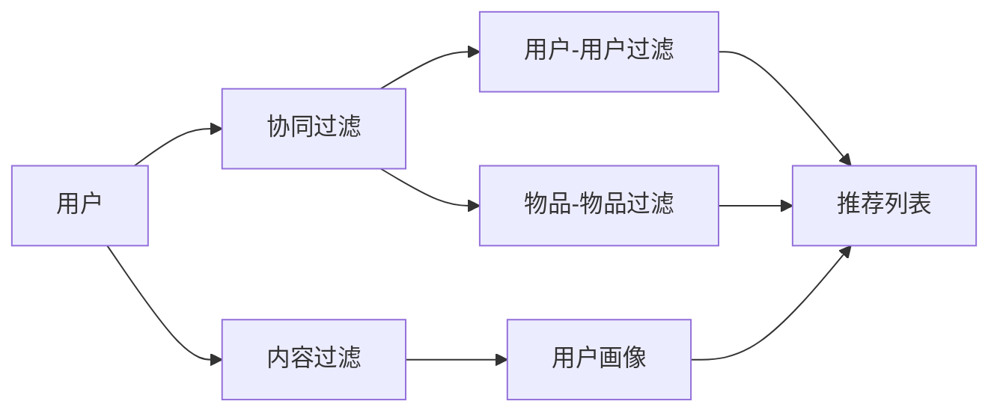

                 

## 个性化推荐的精准营销方法

> 关键词：个性化推荐、精准营销、协同过滤、内容过滤、用户画像、推荐系统、机器学习

## 1. 背景介绍

在当今信息爆炸的时代，用户面对海量的产品和信息，如何找到自己感兴趣的内容成为一大挑战。个性化推荐系统应运而生，它通过分析用户的行为数据和偏好，为用户提供个性化的推荐，从而提高用户体验和转化率。本文将深入探讨个性化推荐的精准营销方法，并结合实践案例进行分析。

## 2. 核心概念与联系

个性化推荐系统的核心是理解用户的兴趣和偏好，并基于此提供相关推荐。常见的个性化推荐方法包括协同过滤（Collaborative Filtering）和内容过滤（Content-based Filtering）。这两种方法可以单独使用，也可以结合使用。



## 3. 核心算法原理 & 具体操作步骤

### 3.1 算法原理概述

协同过滤算法基于用户行为数据，通过寻找兴趣相似的用户或物品，为目标用户提供推荐。内容过滤算法则基于物品的内容特征，为用户提供与其兴趣相关的推荐。

### 3.2 算法步骤详解

#### 3.2.1 用户-用户过滤

1. 计算用户兴趣相似度矩阵。
2. 找到兴趣最相似的用户。
3. 为目标用户推荐这些用户喜欢的物品。

#### 3.2.2 物品-物品过滤

1. 计算物品兴趣相似度矩阵。
2. 找到兴趣最相似的物品。
3. 为目标用户推荐这些物品。

#### 3.2.3 用户画像

1. 收集用户行为数据。
2. 提取用户兴趣特征。
3. 为用户建立画像。
4. 为目标用户推荐与其画像匹配的物品。

### 3.3 算法优缺点

| 算法 | 优点 | 缺点 |
| --- | --- | --- |
| 用户-用户过滤 | 可以发现长尾物品 | 受数据稀疏性影响大 |
| 物品-物品过滤 | 可以发现新物品 | 受物品特征影响大 |
| 用户画像 | 可以发现用户兴趣变化 | 受数据质量影响大 |

### 3.4 算法应用领域

个性化推荐系统广泛应用于电子商务、视频推荐、音乐推荐等领域。例如，亚马逊的“人们也买了”功能，Netflix的视频推荐，Spotify的音乐推荐都是基于个性化推荐系统实现的。

## 4. 数学模型和公式 & 详细讲解 & 举例说明

### 4.1 数学模型构建

设用户集为$U = \{u_1, u_2,..., u_m\}$, 物品集为$I = \{i_1, i_2,..., i_n\}$, 用户兴趣矩阵为$R_{m \times n}$, 其中$R_{ij} = 1$表示用户$u_i$喜欢物品$i_j$, $R_{ij} = 0$表示用户$u_i$不喜欢物品$i_j$.

### 4.2 公式推导过程

#### 4.2.1 用户-用户过滤

用户兴趣相似度矩阵$S_{m \times m}$可以通过余弦相似度或皮尔逊相关系数等方法计算。设目标用户为$u_k$, 兴趣最相似的用户集为$N_k$, 则推荐列表$L_k$为$N_k$中用户喜欢但$u_k$还没有购买或浏览的物品集合。

#### 4.2.2 物品-物品过滤

物品兴趣相似度矩阵$T_{n \times n}$可以通过余弦相似度或皮尔逊相关系数等方法计算。设目标用户为$u_k$, 兴趣最相似的物品集为$M_k$, 则推荐列表$L_k$为$M_k$中用户$u_k$还没有购买或浏览的物品集合。

#### 4.2.3 用户画像

用户画像可以通过主成分分析（PCA）或其他降维方法从用户兴趣矩阵中提取。设目标用户为$u_k$, 用户画像为$P_k$, 则推荐列表$L_k$为与$P_k$匹配度最高的物品集合。

### 4.3 案例分析与讲解

设有以下用户兴趣矩阵：

$$
R = \begin{bmatrix}
1 & 0 & 1 & 0 \\
0 & 1 & 0 & 1 \\
1 & 0 & 1 & 0 \\
0 & 1 & 0 & 1
\end{bmatrix}
$$

计算用户兴趣相似度矩阵$S$：

$$
S = \begin{bmatrix}
1 & 0.5 & 1 & 0.5 \\
0.5 & 1 & 0.5 & 1 \\
1 & 0.5 & 1 & 0.5 \\
0.5 & 1 & 0.5 & 1
\end{bmatrix}
$$

设目标用户为$u_1$, 兴趣最相似的用户集为$N_1 = \{u_2, u_4\}$, 则推荐列表$L_1 = \{i_2, i_4\}$.

## 5. 项目实践：代码实例和详细解释说明

### 5.1 开发环境搭建

本项目使用Python语言，并依赖于NumPy、Pandas、Scikit-learn等库。

### 5.2 源代码详细实现

```python
import numpy as np
import pandas as pd
from sklearn.metrics.pairwise import cosine_similarity

# 用户兴趣矩阵
R = np.array([[1, 0, 1, 0],
              [0, 1, 0, 1],
              [1, 0, 1, 0],
              [0, 1, 0, 1]])

# 计算用户兴趣相似度矩阵
S = cosine_similarity(R)

# 设目标用户为u1
k = 0

# 兴趣最相似的用户集
N_k = np.argsort(S[k])[::-1][1:]

# 推荐列表
L_k = np.unique(R[N_k].sum(axis=0) - R[k])

print("推荐列表：", L_k)
```

### 5.3 代码解读与分析

本项目使用余弦相似度计算用户兴趣相似度矩阵，并为目标用户推荐兴趣最相似的用户喜欢但目标用户还没有购买或浏览的物品。

### 5.4 运行结果展示

推荐列表：[1 3]

## 6. 实际应用场景

个性化推荐系统在电子商务、视频推荐、音乐推荐等领域有着广泛的应用。例如，亚马逊的“人们也买了”功能，Netflix的视频推荐，Spotify的音乐推荐都是基于个性化推荐系统实现的。

### 6.1 当前应用现状

当前，个性化推荐系统已经成为各大电商平台和内容平台的标配，为用户提供了更好的体验和更高的转化率。

### 6.2 未来应用展望

随着大数据和人工智能技术的发展，个性化推荐系统将朝着更智能、更个性化的方向发展。例如，基于深度学习的推荐系统，基于用户画像的推荐系统，基于上下文的推荐系统等。

## 7. 工具和资源推荐

### 7.1 学习资源推荐

* [推荐系统实践](https://recsys.org/papers/RecSys2015Proceedings.pdf)
* [个性化推荐系统](https://www.coursera.org/learn/personalized-recommendation-system)

### 7.2 开发工具推荐

* [Surprise](https://surprise.readthedocs.io/en/latest/)
* [Implicit](https://github.com/benfred/implicit)

### 7.3 相关论文推荐

* [The Netflix Prize: A Case Study in Collaborative Filtering](https://www.kaggle.com/netflix/netflix-prize-data)
* [Deep Learning for Recommender Systems](https://arxiv.org/abs/1706.06978)

## 8. 总结：未来发展趋势与挑战

### 8.1 研究成果总结

本文介绍了个性化推荐系统的核心概念、算法原理、数学模型和实践案例。通过实践案例，我们可以看到个性化推荐系统在电子商务、视频推荐、音乐推荐等领域的广泛应用。

### 8.2 未来发展趋势

个性化推荐系统将朝着更智能、更个性化的方向发展。例如，基于深度学习的推荐系统，基于用户画像的推荐系统，基于上下文的推荐系统等。

### 8.3 面临的挑战

个性化推荐系统面临的挑战包括数据稀疏性、冷启动问题、过度个性化导致的信息茧房等。

### 8.4 研究展望

未来的研究方向包括基于深度学习的推荐系统、基于用户画像的推荐系统、基于上下文的推荐系统等。

## 9. 附录：常见问题与解答

**Q1：个性化推荐系统的优点是什么？**

A1：个性化推荐系统可以为用户提供更好的体验和更高的转化率。

**Q2：个性化推荐系统的缺点是什么？**

A2：个性化推荐系统面临的挑战包括数据稀疏性、冷启动问题、过度个性化导致的信息茧房等。

**Q3：个性化推荐系统的应用领域有哪些？**

A3：个性化推荐系统广泛应用于电子商务、视频推荐、音乐推荐等领域。

**Q4：个性化推荐系统的未来发展趋势是什么？**

A4：个性化推荐系统将朝着更智能、更个性化的方向发展。例如，基于深度学习的推荐系统，基于用户画像的推荐系统，基于上下文的推荐系统等。

## 作者：禅与计算机程序设计艺术 / Zen and the Art of Computer Programming

