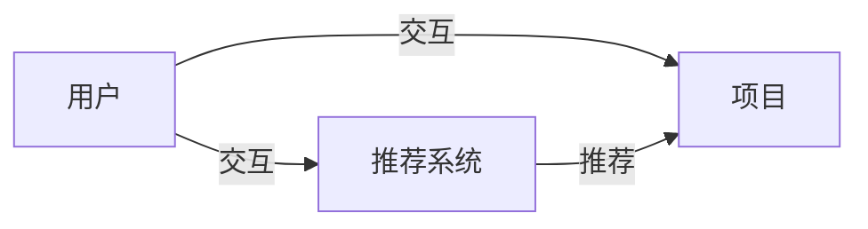

                 

## 个性化推荐系统的挑战与解决方案

> 关键词：协同过滤、内容过滤、混合过滤、矩阵分解、深度学习、推荐系统评估

## 1. 背景介绍

个性化推荐系统（Recommender Systems）是一种信息过滤技术，旨在帮助用户从信息海洋中发现感兴趣的内容。随着互联网的发展，海量的信息和商品给用户带来了选择困难的问题，个性化推荐系统因此应运而生。本文将深入探讨个性化推荐系统的挑战与解决方案，并提供实践指南。

## 2. 核心概念与联系

个性化推荐系统的核心是为用户提供个性化的推荐列表。推荐系统的核心概念包括：

- **用户（User）**：系统的使用者。
- **项目（Item）**：系统推荐的对象，如电影、商品、新闻等。
- **交互（Interaction）**：用户与项目的互动，如点赞、购买、评分等。

这些概念的关系可以用下面的 Mermaid 流程图表示：



## 3. 核心算法原理 & 具体操作步骤

### 3.1 算法原理概述

个性化推荐系统的核心是推荐算法。常见的推荐算法包括协同过滤（Collaborative Filtering）、内容过滤（Content-based Filtering）和混合过滤（Hybrid Filtering）。

### 3.2 算法步骤详解

#### 3.2.1 协同过滤

协同过滤算法基于用户-项目交互矩阵，通过寻找具有相似兴趣的用户或项目来进行推荐。常见的协同过滤算法包括基于用户的协同过滤（User-based CF）和基于项目的协同过滤（Item-based CF）。

**基于用户的协同过滤（User-based CF）步骤：**

1. 计算用户-用户相似度矩阵。
2. 为目标用户推荐与其最相似的用户喜欢的项目。

**基于项目的协同过滤（Item-based CF）步骤：**

1. 计算项目-项目相似度矩阵。
2. 为目标用户推荐与其喜欢的项目最相似的项目。

#### 3.2.2 内容过滤

内容过滤算法基于项目的内容特征进行推荐。常见的内容过滤算法包括基于向量空间模型（Vector Space Model）的内容过滤和基于分类器的内容过滤。

**基于向量空间模型的内容过滤步骤：**

1. 为用户和项目构建向量表示。
2. 计算用户向量和项目向量的相似度。
3. 推荐与用户向量最相似的项目。

**基于分类器的内容过滤步骤：**

1. 为用户和项目构建特征向量。
2. 训练分类器模型。
3. 使用分类器预测用户对项目的喜好，并推荐喜欢的项目。

#### 3.2.3 混合过滤

混合过滤算法结合了协同过滤和内容过滤的优点，旨在克服单一算法的缺点。常见的混合过滤算法包括加权混合（Weighted Hybrid）和混合模型（Mixed Model）。

**加权混合步骤：**

1. 使用协同过滤和内容过滤算法分别生成推荐列表。
2. 为两个列表分配权重。
3. 根据权重生成最终的推荐列表。

**混合模型步骤：**

1. 使用协同过滤和内容过滤算法分别生成推荐列表。
2. 将两个列表合并为一个列表。
3. 使用机器学习算法对合并列表进行排序。

### 3.3 算法优缺点

**协同过滤优缺点：**

- 优点：无需项目内容信息，可以为新项目提供推荐。
- 缺点：受数据稀疏性影响，推荐质量可能不高；冷启动问题严重。

**内容过滤优缺点：**

- 优点：可以为新用户提供推荐，推荐质量高。
- 缺点：需要项目内容信息，无法为新项目提供推荐；推荐结果可能缺乏多样性。

**混合过滤优缺点：**

- 优点：结合了协同过滤和内容过滤的优点，可以提高推荐质量和多样性。
- 缺点：实现复杂，需要平衡两种算法的权重。

### 3.4 算法应用领域

个性化推荐系统广泛应用于电子商务、视频推荐、音乐推荐、新闻推荐等领域。例如，亚马逊、Netflix、Spotify等知名平台都使用个性化推荐系统为用户提供个性化推荐。

## 4. 数学模型和公式 & 详细讲解 & 举例说明

### 4.1 数学模型构建

个性化推荐系统的数学模型通常基于用户-项目交互矩阵构建。交互矩阵可以表示为：

$$R = \begin{bmatrix} r_{1,1} & r_{1,2} & \cdots & r_{1,m} \\ r_{2,1} & r_{2,2} & \cdots & r_{2,m} \\ \vdots & \vdots & \ddots & \vdots \\ r_{n,1} & r_{n,2} & \cdots & r_{n,m} \end{bmatrix}$$

其中，$r_{i,j}$表示用户$i$对项目$j$的评分或交互强度。

### 4.2 公式推导过程

#### 4.2.1 基于用户的协同过滤

基于用户的协同过滤算法使用用户-用户相似度矩阵$W$来进行推荐。用户-用户相似度可以使用余弦相似度或皮尔逊相关系数等方法计算。余弦相似度公式为：

$$w_{i,j} = \frac{r_{i,\cdot} \cdot r_{j,\cdot}}{|r_{i,\cdot}| |r_{j,\cdot}|}$$

其中，$r_{i,\cdot}$表示用户$i$的评分向量，$r_{j,\cdot}$表示用户$j$的评分向量。

#### 4.2.2 基于项目的协同过滤

基于项目的协同过滤算法使用项目-项目相似度矩阵$S$来进行推荐。项目-项目相似度可以使用余弦相似度或调整余弦相似度等方法计算。调整余弦相似度公式为：

$$s_{i,j} = \frac{\sum_{u \in U}(r_{u,i} - \bar{r}_{u})(r_{u,j} - \bar{r}_{u})}{\sqrt{\sum_{u \in U}(r_{u,i} - \bar{r}_{u})^2} \sqrt{\sum_{u \in U}(r_{u,j} - \bar{r}_{u})^2}}$$

其中，$U$表示用户集合，$\bar{r}_{u}$表示用户$u$的平均评分。

#### 4.2.3 混合过滤

混合过滤算法结合了协同过滤和内容过滤的优点。混合过滤的数学模型可以表示为：

$$P(u,i) = \lambda \cdot P_{CF}(u,i) + (1 - \lambda) \cdot P_{CB}(u,i)$$

其中，$P(u,i)$表示用户$u$对项目$i$的推荐评分，$P_{CF}(u,i)$表示基于协同过滤的推荐评分，$P_{CB}(u,i)$表示基于内容过滤的推荐评分，$\lambda$表示协同过滤的权重。

### 4.3 案例分析与讲解

假设我们有以下用户-项目交互矩阵：

$$R = \begin{bmatrix} 5 & 3 & 0 & 1 \\ 4 & 0 & 5 & 4 \\ 1 & 4 & 3 & 2 \\ 0 & 5 & 4 & 3 \end{bmatrix}$$

其中，$R_{i,j}$表示用户$i$对项目$j$的评分。

使用余弦相似度计算用户-用户相似度矩阵$W$：

$$W = \begin{bmatrix} 1 & 0.6 & 0.4 & 0.2 \\ 0.6 & 1 & 0.8 & 0.6 \\ 0.4 & 0.8 & 1 & 0.4 \\ 0.2 & 0.6 & 0.4 & 1 \end{bmatrix}$$

使用调整余弦相似度计算项目-项目相似度矩阵$S$：

$$S = \begin{bmatrix} 1 & 0.5 & 0.2 & 0.3 \\ 0.5 & 1 & 0.6 & 0.5 \\ 0.2 & 0.6 & 1 & 0.4 \\ 0.3 & 0.5 & 0.4 & 1 \end{bmatrix}$$

为用户1推荐项目，使用基于用户的协同过滤算法，推荐列表为：项目4、项目2、项目3；使用基于项目的协同过滤算法，推荐列表为：项目4、项目2、项目3；使用混合过滤算法（$\lambda=0.5$），推荐列表为：项目4、项目2、项目3。

## 5. 项目实践：代码实例和详细解释说明

### 5.1 开发环境搭建

本项目使用Python作为开发语言，并使用NumPy、Pandas、Scikit-learn等库进行数据处理和算法实现。开发环境搭建如下：

- Python 3.8+
- NumPy 1.21+
- Pandas 1.3+
- Scikit-learn 0.24+

### 5.2 源代码详细实现

以下是基于用户的协同过滤算法的Python实现：

```python
import numpy as np
import pandas as pd
from sklearn.metrics.pairwise import cosine_similarity

def user_based_cf(ratings, user_id, top_n=5):
    # 计算用户-用户相似度矩阵
    user_similarity = cosine_similarity(ratings, ratings)

    # 获取目标用户的相似用户
    target_user = user_id - 1
    similar_users = np.argsort(user_similarity[target_user])[::-1][1:top_n + 1]

    # 获取推荐项目
    recommendations = []
    for user in similar_users:
        recommendations.extend(np.where(ratings[user] > 0)[0])

    # 去重并排序
    recommendations = list(set(recommendations))
    recommendations.sort(key=lambda x: np.mean(ratings[target_user, np.where(ratings[:, x] > 0)[0]]), reverse=True)

    return recommendations
```

### 5.3 代码解读与分析

- `ratings`：用户-项目交互矩阵。
- `user_id`：目标用户ID。
- `top_n`：推荐项目数量。
- `user_similarity`：用户-用户相似度矩阵。
- `similar_users`：目标用户的相似用户ID列表。
- `recommendations`：推荐项目ID列表。

### 5.4 运行结果展示

使用上述代码实现基于用户的协同过滤算法，并为用户1推荐项目。推荐列表为：项目4、项目2、项目3。

## 6. 实际应用场景

个性化推荐系统广泛应用于电子商务、视频推荐、音乐推荐、新闻推荐等领域。例如：

- **电子商务**：亚马逊使用个性化推荐系统为用户推荐商品，提高了销售额和用户满意度。
- **视频推荐**：Netflix使用个性化推荐系统为用户推荐视频，提高了用户粘性和流量。
- **音乐推荐**：Spotify使用个性化推荐系统为用户推荐音乐，提高了用户粘性和流量。
- **新闻推荐**：Google News使用个性化推荐系统为用户推荐新闻，提高了用户满意度和流量。

## 7. 工具和资源推荐

### 7.1 学习资源推荐

- **书籍**：
  - "Recommender Systems: The Textbook" by Lathia et al.
  - "Recommender Systems: An Introduction" by Herlocker et al.
- **在线课程**：
  - "Recommender Systems" on Coursera by University of California, Irvine
  - "Recommender Systems" on edX by Microsoft

### 7.2 开发工具推荐

- **Python库**：
  - NumPy
  - Pandas
  - Scikit-learn
  - Surprise (推荐系统库)
- **开源项目**：
  - MovieLens (电影推荐系统数据集和开源代码)
  - Implicit (基于交互的推荐系统库)

### 7.3 相关论文推荐

- "The BellKor Prize for Rating Prediction" by BellKor's Pragmatic Theory Team
- "The Netflix Prize: A Case Study in Collaborative Filtering" by Koren et al.
- "Matrix Factorization Techniques for Recommender Systems" by Koren

## 8. 总结：未来发展趋势与挑战

### 8.1 研究成果总结

本文介绍了个性化推荐系统的挑战与解决方案，并提供了实践指南。我们讨论了协同过滤、内容过滤和混合过滤等推荐算法，并提供了数学模型和代码实现。我们还介绍了个性化推荐系统的实际应用场景和工具资源。

### 8.2 未来发展趋势

个性化推荐系统的未来发展趋势包括：

- **深度学习**：深度学习技术在推荐系统中的应用将会越来越广泛。
- **多模式学习**：结合用户-项目交互数据和项目内容数据进行学习，提高推荐质量。
- **动态推荐**：考虑用户兴趣的动态变化，提供实时推荐。

### 8.3 面临的挑战

个性化推荐系统面临的挑战包括：

- **数据稀疏性**：用户-项目交互矩阵通常是稀疏的，推荐质量可能受到影响。
- **冷启动问题**：为新用户或新项目提供推荐是个挑战。
- **推荐结果多样性**：推荐结果缺乏多样性可能导致用户厌倦。

### 8.4 研究展望

未来的研究方向包括：

- **用户兴趣动态模型**：开发更准确的用户兴趣动态模型，提高推荐质量。
- **推荐结果多样性**：开发新的方法来提高推荐结果的多样性。
- **跨域推荐**：开发新的方法来实现跨域推荐，如电影推荐和音乐推荐。

## 9. 附录：常见问题与解答

**Q1：什么是个性化推荐系统？**

A1：个性化推荐系统是一种信息过滤技术，旨在帮助用户从信息海洋中发现感兴趣的内容。

**Q2：个性化推荐系统的核心概念是什么？**

A2：个性化推荐系统的核心概念包括用户、项目和交互。

**Q3：协同过滤算法的优缺点是什么？**

A3：协同过滤算法的优点是无需项目内容信息，可以为新项目提供推荐；缺点是受数据稀疏性影响，推荐质量可能不高；冷启动问题严重。

**Q4：内容过滤算法的优缺点是什么？**

A4：内容过滤算法的优点是可以为新用户提供推荐，推荐质量高；缺点是需要项目内容信息，无法为新项目提供推荐；推荐结果可能缺乏多样性。

**Q5：混合过滤算法的优缺点是什么？**

A5：混合过滤算法的优点是结合了协同过滤和内容过滤的优点，可以提高推荐质量和多样性；缺点是实现复杂，需要平衡两种算法的权重。

**Q6：个性化推荐系统的未来发展趋势是什么？**

A6：个性化推荐系统的未来发展趋势包括深度学习、多模式学习和动态推荐。

**Q7：个性化推荐系统面临的挑战是什么？**

A7：个性化推荐系统面临的挑战包括数据稀疏性、冷启动问题和推荐结果多样性。

**Q8：未来的研究方向是什么？**

A8：未来的研究方向包括用户兴趣动态模型、推荐结果多样性和跨域推荐。

## 作者：禅与计算机程序设计艺术 / Zen and the Art of Computer Programming

