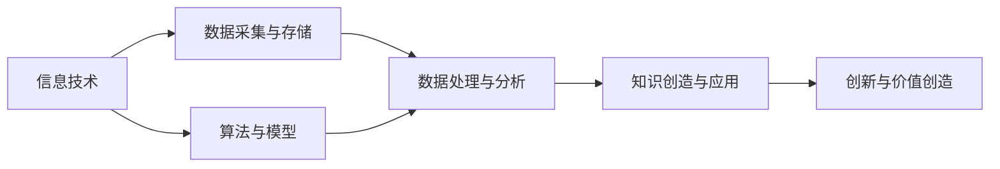

                 

**关键词：**新质生产力、人工智能、数字经济、中国现代化、算法、数据、创新

## 1. 背景介绍

中国正处于现代化进程中，面临着巨大的发展机遇和挑战。在新一轮科技革命和产业变革的背景下，人工智能、大数据、云计算等新技术新应用快速发展，为中国现代化进程注入了新的动能。其中，新质生产力的发展成为推动中国现代化的关键因素之一。

新质生产力是指以新技术、新业态、新模式为基础，具有新特征的生产力。它不同于传统的物质生产力，而是以信息、知识、数据等非物质要素为核心，具有高度的创新性、网络化和智能化特征。新质生产力的发展，将重塑中国的产业结构、就业格局和国际竞争力。

本文将从新质生产力的核心概念、算法原理、数学模型、项目实践、实际应用场景等方面，深入剖析新质生产力在中国现代化进程中的作用，并为其未来发展提供参考。

## 2. 核心概念与联系

### 2.1 新质生产力的核心概念

新质生产力的核心是信息、知识和数据。它以信息技术为基础，以数据为关键要素，以知识为核心资源，通过算法和模型实现创新和价值创造。新质生产力具有以下特征：

- **创新性**：新质生产力以创新为驱动，不断涌现新的技术、业态和模式。
- **网络化**：新质生产力高度依赖网络，通过网络实现资源共享、协同创新和价值传递。
- **智能化**：新质生产力以智能技术为支撑，通过算法和模型实现智能决策、自动化和个性化。

### 2.2 新质生产力与中国现代化的联系

新质生产力与中国现代化的联系主要体现在以下几个方面：

- **推动产业转型升级**：新质生产力通过技术创新和业态变革，推动中国传统产业转型升级，提高产业竞争力。
- **带动就业结构调整**：新质生产力催生大量新职业和新岗位，带动就业结构调整，推动劳动力市场升级。
- **提高国际竞争力**：新质生产力通过技术创新和国际合作，提高中国在全球产业链中的地位，增强国际竞争力。

### 2.3 新质生产力发展的架构

新质生产力发展的架构如下图所示：



## 3. 核心算法原理 & 具体操作步骤

### 3.1 算法原理概述

新质生产力的核心算法包括机器学习算法、深度学习算法、自然语言处理算法等。本节以机器学习算法为例，介绍其原理。

机器学习算法的原理是通过学习数据中的模式，建立模型，并使用该模型对新数据进行预测。其核心是学习算法，常见的学习算法包括监督学习、无监督学习和强化学习。

### 3.2 算法步骤详解

机器学习算法的步骤如下：

1. **数据预处理**：清洗、标准化、特征提取等。
2. **模型选择**：根据任务选择合适的学习算法。
3. **模型训练**：使用训练数据训练模型。
4. **模型评估**：使用验证数据评估模型性能。
5. **模型优化**：调整模型参数，提高模型性能。
6. **模型部署**：将模型部署到生产环境，对新数据进行预测。

### 3.3 算法优缺点

机器学习算法的优点包括：

- **自动化**：机器学习算法可以自动从数据中学习模式，无需人工干预。
- **泛化能力**：机器学习算法可以对新数据进行预测，具有良好的泛化能力。
- **适应性**：机器学习算法可以适应数据的变化，具有良好的适应性。

机器学习算法的缺点包括：

- **数据依赖**：机器学习算法对数据质量和数量要求高，数据缺失或噪声会影响模型性能。
- **解释性差**：机器学习算法的决策过程往往是黑箱的，难以解释其决策过程。
- **计算资源需求**：机器学习算法往往需要大量计算资源，对硬件要求高。

### 3.4 算法应用领域

机器学习算法广泛应用于自然语言处理、图像识别、推荐系统、金融风控等领域。在新质生产力发展中，机器学习算法是关键技术之一。

## 4. 数学模型和公式 & 详细讲解 & 举例说明

### 4.1 数学模型构建

新质生产力的数学模型包括线性回归模型、逻辑回归模型、支持向量机模型等。本节以线性回归模型为例，介绍其数学模型构建过程。

线性回归模型的数学模型如下：

$$y = \beta_0 + \beta_1x_1 + \beta_2x_2 + \ldots + \beta_nx_n + \epsilon$$

其中，$y$是目标变量，$x_1, x_2, \ldots, x_n$是特征变量，$\beta_0, \beta_1, \ldots, \beta_n$是模型参数，$\epsilon$是误差项。

### 4.2 公式推导过程

线性回归模型的参数可以通过最小二乘法推导出来。最小二乘法的目标是最小化误差平方和：

$$\min_{\beta_0, \beta_1, \ldots, \beta_n} \sum_{i=1}^{n} (y_i - \hat{y}_i)^2$$

其中，$y_i$是第$i$个样本的目标变量，$ \hat{y}_i$是模型预测的目标变量。通过求导数并设置为零，可以得到参数的解析解：

$$\beta = (X^TX)^{-1}X^Ty$$

其中，$X$是特征矩阵，$y$是目标变量向量。

### 4.3 案例分析与讲解

例如，假设我们要预测房价，特征变量包括房屋面积、房龄等。我们可以构建如下线性回归模型：

$$price = \beta_0 + \beta_1 \times area + \beta_2 \times age + \epsilon$$

通过收集数据并训练模型，我们可以得到模型参数$\beta_0, \beta_1, \beta_2$。然后，我们可以使用该模型预测新数据的房价。

## 5. 项目实践：代码实例和详细解释说明

### 5.1 开发环境搭建

本项目使用Python作为开发语言，并使用Anaconda作为开发环境。我们需要安装以下库：

- NumPy：数值计算库
- Pandas：数据处理库
- Matplotlib：数据可视化库
- Scikit-learn：机器学习库

### 5.2 源代码详细实现

以下是线性回归模型的Python实现代码：

```python
import numpy as np
import pandas as pd
from sklearn.model_selection import train_test_split
from sklearn.linear_model import LinearRegression
from sklearn.metrics import mean_squared_error

# 加载数据
data = pd.read_csv('housing.csv')
X = data[['area', 'age']]
y = data['price']

# 划分训练集和测试集
X_train, X_test, y_train, y_test = train_test_split(X, y, test_size=0.2, random_state=42)

# 训练模型
model = LinearRegression()
model.fit(X_train, y_train)

# 预测测试集
y_pred = model.predict(X_test)

# 评估模型
mse = mean_squared_error(y_test, y_pred)
print('Mean Squared Error:', mse)
```

### 5.3 代码解读与分析

代码首先加载数据，并将其划分为训练集和测试集。然后，使用线性回归模型训练模型，并使用测试集预测房价。最后，使用均方误差评估模型性能。

### 5.4 运行结果展示

运行代码后，我们可以得到均方误差，从而评估模型性能。例如，均方误差为1000000，说明模型预测误差较大，需要进一步优化模型。

## 6. 实际应用场景

### 6.1 新质生产力在制造业的应用

新质生产力在制造业的应用包括智能制造、柔性制造等。例如，通过传感器收集数据，并使用机器学习算法预测设备故障，实现智能维护。又如，通过数字孪生技术模拟生产过程，实现柔性制造。

### 6.2 新质生产力在服务业的应用

新质生产力在服务业的应用包括智能客服、个性化推荐等。例如，通过自然语言处理技术实现智能客服，提高客服效率。又如，通过机器学习算法实现个性化推荐，提高用户体验。

### 6.3 新质生产力在农业的应用

新质生产力在农业的应用包括智能农业、精准农业等。例如，通过传感器收集数据，并使用机器学习算法预测作物病虫害，实现精准防治。又如，通过无人机技术实现精准喷药，提高农业效率。

### 6.4 未来应用展望

未来，新质生产力将广泛应用于各个领域，推动中国现代化进程。例如，新质生产力将推动中国制造业转型升级，提高制造业竞争力。又如，新质生产力将推动中国服务业创新发展，提高服务业质量和效率。再如，新质生产力将推动中国农业现代化，提高农业生产效率和质量。

## 7. 工具和资源推荐

### 7.1 学习资源推荐

- **书籍**：《机器学习》作者：Tom Mitchell、《深度学习》作者：Ian Goodfellow、Yoshua Bengio、Aaron Courville
- **在线课程**：Coursera、Udacity、edX
- **论坛**：Stack Overflow、KDnuggets、Towards Data Science

### 7.2 开发工具推荐

- **编程语言**：Python、R
- **开发环境**：Anaconda、Jupyter Notebook
- **库和框架**：TensorFlow、PyTorch、Keras

### 7.3 相关论文推荐

- **机器学习**：《支持向量机》作者：Vladimir N. Vapnik、《神经网络》作者：Rumelhart、Hinton、Williams
- **新质生产力**：《新质生产力与中国现代化》作者：王勇、《新质生产力与数字经济》作者：张维迎

## 8. 总结：未来发展趋势与挑战

### 8.1 研究成果总结

新质生产力是推动中国现代化进程的关键因素之一。本文从核心概念、算法原理、数学模型、项目实践、实际应用场景等方面，深入剖析了新质生产力在中国现代化进程中的作用。

### 8.2 未来发展趋势

未来，新质生产力将呈现以下发展趋势：

- **智能化**：新质生产力将更加智能化，通过人工智能技术实现智能决策、自动化和个性化。
- **网络化**：新质生产力将更加网络化，通过互联网和物联网实现资源共享、协同创新和价值传递。
- **创新性**：新质生产力将更加创新性，不断涌现新的技术、业态和模式。

### 8.3 面临的挑战

新质生产力发展面临以下挑战：

- **数据安全**：新质生产力高度依赖数据，数据安全成为关键挑战。
- **算法偏见**：新质生产力的决策过程往往是黑箱的，算法偏见成为关键挑战。
- **技术鸿沟**：新质生产力发展需要大量技术人才，技术鸿沟成为关键挑战。

### 8.4 研究展望

未来，新质生产力研究将呈现以下展望：

- **跨学科研究**：新质生产力研究将更加跨学科，涉及计算机科学、数学、经济学、管理学等多个学科。
- **实践导向**：新质生产力研究将更加实践导向，注重实际应用和产业转化。
- **国际合作**：新质生产力研究将更加国际化，通过国际合作推动中国新质生产力发展。

## 9. 附录：常见问题与解答

**Q1：新质生产力与传统生产力有何区别？**

A1：新质生产力与传统生产力的区别在于，新质生产力以信息、知识、数据等非物质要素为核心，具有高度的创新性、网络化和智能化特征。而传统生产力以物质要素为核心，具有低度创新性和网络化特征。

**Q2：新质生产力的核心是信息、知识和数据，如何管理和保护这些要素？**

A2：管理和保护信息、知识和数据的关键是建立完善的数据治理体系，包括数据收集、存储、处理、分析、共享和保护等环节。同时，还需要建立完善的知识产权保护机制，保护知识创新。

**Q3：新质生产力的发展对中国现代化进程有何影响？**

A3：新质生产力的发展将推动中国产业转型升级，带动就业结构调整，提高国际竞争力，从而推动中国现代化进程。同时，新质生产力的发展也将带来新的挑战，需要中国积极应对。

**Q4：新质生产力的发展面临哪些挑战？**

A4：新质生产力的发展面临数据安全、算法偏见、技术鸿沟等挑战。需要中国积极应对，推动新质生产力健康发展。

**Q5：如何推动新质生产力在中国的发展？**

A5：推动新质生产力在中国发展需要政府、企业和学术界的共同努力。政府需要完善政策法规，营造良好的发展环境。企业需要加大投入，推动技术创新和业态变革。学术界需要加强研究，推动理论创新和人才培养。

**作者：禅与计算机程序设计艺术 / Zen and the Art of Computer Programming**

