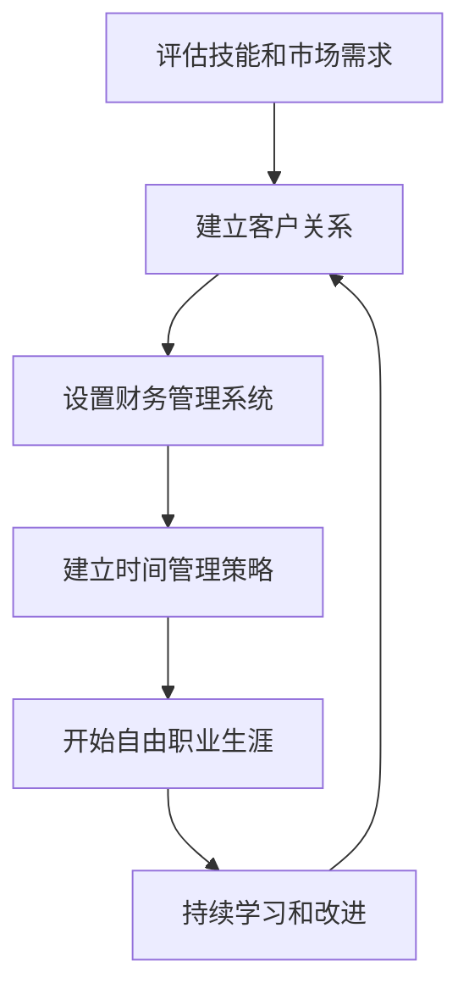

                 

**从员工到自由职业者的转型指南**

**作者：禅与计算机程序设计艺术 / Zen and the Art of Computer Programming**

## 1. 背景介绍

在当今快速变化的数字经济中，越来越多的技术专业人士正在考虑从传统的雇员身份转变为自由职业者。这一转变可以带来更大的灵活性、更高的收入和更丰富的职业经历。然而，成功转型为自由职业者需要计划、技能和正确的心态。本指南将指导您完成这一转型，帮助您建立成功的自由职业生涯。

## 2. 核心概念与联系

### 2.1 转型的关键因素

转型为自由职业者需要考虑的关键因素包括：

- **技能和市场需求**：您的技能是否符合市场需求？自由职业者的成功取决于您能够提供什么样的独特价值。
- **客户关系管理**：您需要建立和维护客户关系，以确保稳定的工作量。
- **财务管理**：您需要管理自己的收入和支出，可能还需要处理税务问题。
- **时间管理**：您需要平衡工作和生活，确保高效利用时间。

### 2.2 转型流程图



## 3. 核心算法原理 & 具体操作步骤

### 3.1 转型算法原理概述

转型为自由职业者的过程可以看作是一个算法，其目标是最大化您的职业满意度和收入。这个算法包括评估、计划、执行和持续改进等步骤。

### 3.2 转型算法步骤详解

1. **评估技能和市场需求**
   - 列出您的技能和经验。
   - 研究市场需求，找出哪些技能最有价值。
   - 评估您的技能是否符合市场需求，如果不符，考虑学习新技能。

2. **建立客户关系**
   - 确定您的目标客户群。
   - 创建个人品牌，展示您的技能和经验。
   - 通过在线平台（如LinkedIn、Upwork、Freelancer）或网络营销建立客户关系。

3. **设置财务管理系统**
   - 确定您的目标收入。
   - 设置预算，跟踪收入和支出。
   - 学习并遵循当地的税务法规。

4. **建立时间管理策略**
   - 设置工作时间表，平衡工作和生活。
   - 学习说“不”，避免过度承诺。
   - 使用时间跟踪工具（如Toggl、RescueTime）提高效率。

### 3.3 转型算法优缺点

**优点**：转型算法可以帮助您有计划地转型为自由职业者，最大化成功的可能性。

**缺点**：转型过程可能会很困难，需要大量的努力和适应。

### 3.4 转型算法应用领域

转型算法适用于任何技术专业人士，包括但不限于程序员、数据科学家、UI/UX设计师和数字营销专家。

## 4. 数学模型和公式 & 详细讲解 & 举例说明

### 4.1 财务管理模型构建

财务管理是自由职业者成功的关键因素。一个简单的财务管理模型可以表示为：

$$ Income_{t} = Revenue_{t} - Expenses_{t} $$

其中，$Income_{t}$表示在时间$t$的净收入，$Revenue_{t}$表示在时间$t$的收入，$Expenses_{t}$表示在时间$t$的支出。

### 4.2 公式推导过程

净收入可以用于计算自由职业者的利润率：

$$ Profit_{t} = \frac{Income_{t}}{Revenue_{t}} $$

利润率可以帮助您评估您的定价是否合理，以及是否需要调整支出。

### 4.3 案例分析与讲解

假设您是一名自由职业程序员，您的月收入为$Revenue_{t} = $5,000美元，月支出为$Expenses_{t} = $3,000美元。那么，您的月净收入为：

$$ Income_{t} = 5,000 - 3,000 = $2,000 $$

您的利润率为：

$$ Profit_{t} = \frac{2,000}{5,000} = 0.4 \text{ or } 40\% $$

这意味着您的定价和支出水平是合理的。

## 5. 项目实践：代码实例和详细解释说明

### 5.1 开发环境搭建

为了跟踪您的时间和财务，您需要设置一个简单的开发环境。您可以使用Python和Jupyter Notebook来创建一个简单的跟踪工具。

### 5.2 源代码详细实现

```python
import pandas as pd

# 创建一个简单的数据框来跟踪收入和支出
financial_tracker = pd.DataFrame(columns=['Date', 'Revenue', 'Expenses', 'Income', 'Profit'])

# 添加新的记录
def add_record(date, revenue, expenses):
    income = revenue - expenses
    profit = income / revenue
    new_record = pd.DataFrame({'Date': [date], 'Revenue': [revenue], 'Expenses': [expenses], 'Income': [income], 'Profit': [profit]})
    global financial_tracker
    financial_tracker = pd.concat([financial_tracker, new_record], ignore_index=True)

# 示例：添加新记录
add_record('2022-01-01', 5000, 3000)
```

### 5.3 代码解读与分析

这个简单的代码片段创建了一个数据框来跟踪您的收入和支出。`add_record`函数允许您添加新的记录，并计算净收入和利润率。

### 5.4 运行结果展示

运行这个代码片段后，`financial_tracker`数据框将包含您添加的记录。您可以使用Pandas的各种功能（如`groupby`、`mean`等）来分析您的财务数据。

## 6. 实际应用场景

### 6.1 成功转型的故事

成功转型为自由职业者的故事可以提供灵感和指导。例如，您可以学习如何建立客户关系，如何定价，如何平衡工作和生活。

### 6.2 未来应用展望

未来，自由职业者的数量预计会继续增长。随着技术的发展，新的机会将出现，但也会有新的挑战。自由职业者需要不断学习和适应。

## 7. 工具和资源推荐

### 7.1 学习资源推荐

- **Books**: "The 4-Hour Workweek" by Timothy Ferriss, "The Freelancer's Bible" by Sara Horowitz
- **Online Courses**: Udemy, Coursera, LinkedIn Learning
- **Blogs**: Freelancers Union, Upwork, Freelancer

### 7.2 开发工具推荐

- **Time Tracking**: Toggl, RescueTime
- **Accounting**: QuickBooks, FreshBooks
- **Project Management**: Asana, Trello

### 7.3 相关论文推荐

- "The Rise of the Freelance Economy" by Upwork and Freelancers Union
- "Freelancing in America" by Upwork and Freelancers Union

## 8. 总结：未来发展趋势与挑战

### 8.1 研究成果总结

转型为自由职业者需要计划、技能和正确的心态。成功的转型需要评估技能和市场需求，建立客户关系，设置财务管理系统，并建立时间管理策略。

### 8.2 未来发展趋势

未来，自由职业者的数量预计会继续增长。新的技术和市场需求将带来新的机会。

### 8.3 面临的挑战

自由职业者面临的挑战包括不稳定的收入、缺乏福利和社保，以及需要不断学习和适应。

### 8.4 研究展望

未来的研究可以关注自由职业者的心理健康、工作满意度和技能发展。

## 9. 附录：常见问题与解答

**Q：转型为自由职业者需要多长时间？**

**A：转型时间取决于您的技能、市场需求和您的个人情况。通常，转型需要几个月到一年。**

**Q：如何定价我的服务？**

**A：定价取决于您的技能、市场需求和您的成本结构。您可以研究市场价格，并根据您的经验和技能调整定价。**

**Q：如何管理我的时间？**

**A：时间管理是关键。您需要设置工作时间表，学习说“不”，并使用时间跟踪工具提高效率。**

## 结束语

转型为自由职业者是一个兴奋但也很挑战的过程。成功的转型需要计划、技能和正确的心态。本指南提供了一个结构化的框架，帮助您评估技能和市场需求，建立客户关系，设置财务管理系统，并建立时间管理策略。祝您转型成功！

**作者：禅与计算机程序设计艺术 / Zen and the Art of Computer Programming**

