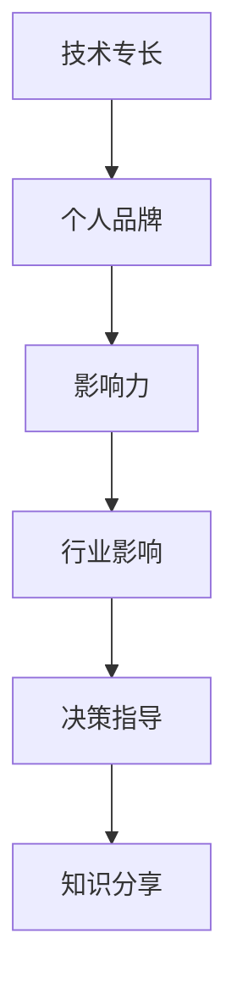

                 

**从技术大牛到科技界意见领袖的蜕变**

**作者：禅与计算机程序设计艺术 / Zen and the Art of Computer Programming**

## 1. 背景介绍

在当今快速变化的科技世界中，技术专家的角色正在发生转变。传统上，技术大牛专注于技术本身，但现在，他们也需要成为意见领袖，影响行业方向，指导决策，并与同行和公众分享知识。本文将探讨从技术大牛转变为科技界意见领袖的关键步骤，包括构建个人品牌，发展沟通技巧，参与行业对话，并创造有影响力的内容。

## 2. 核心概念与联系

### 2.1 个人品牌与影响力

个人品牌是意见领袖的基础。它是你的专业形象、价值观和个性的总和。有效的个人品牌可以帮助你建立信誉，吸引同行和雇主，并扩大你的影响力。



### 2.2 沟通技巧与内容创作

有效的沟通是意见领袖的关键技能。这包括清晰明确地表达想法，适应不同受众，并创造有吸引力的内容。内容创作，如博客文章、社交媒体帖子和演讲，可以帮助你分享知识，建立信誉，并扩大你的影响力。

## 3. 核心算法原理 & 具体操作步骤

### 3.1 算法原理概述

转变为意见领袖的过程可以看作一个算法，它包括几个关键步骤。这些步骤不是线性的，而是互相关联，需要反复迭代。

### 3.2 算法步骤详解

1. **自省与定位（Self-Reflection and Positioning）：** 确定你的技术专长，价值观，和个性。根据这些因素，定位你的个人品牌。

2. **内容创作与分享（Content Creation and Sharing）：** 创造有价值的内容，如博客文章、社交媒体帖子、视频和演讲。分享你的知识和见解，帮助他人解决问题。

3. **参与行业对话（Engage in Industry Dialogues）：** 加入行业讨论，参加会议，参加在线论坛。与同行交流，学习新的想法，并分享你的见解。

4. **建立关系网（Build a Network）：** 结识同行，建立联系。关系网可以帮助你获得新的机会，并扩大你的影响力。

5. **持续学习与成长（Continuous Learning and Growth）：** 保持技术和行业知识的更新。意见领袖需要不断学习，以保持领先地位。

### 3.3 算法优缺点

**优点：**

- 系统化的方法可以帮助你有意识地建立影响力。
- 反复迭代的过程可以帮助你不断改进和提高。

**缺点：**

- 成为意见领袖需要时间和努力。结果可能不会立即显现。
- 这个过程需要平衡，避免过度自hton或过度推销自己。

### 3.4 算法应用领域

这个算法可以应用于任何技术领域，并可以扩展到其他专业领域。它适用于任何想要扩大影响力，分享知识，并指导行业方向的人。

## 4. 数学模型和公式 & 详细讲解 & 举例说明

### 4.1 数学模型构建

影响力可以看作一个函数，它取决于个人品牌的强度（$P$）、内容质量（$C$）、参与度（$E$）、关系网的大小（$N$），和持续学习的程度（$L$）。这个函数可以表示为：

$$I = f(P, C, E, N, L)$$

### 4.2 公式推导过程

这个函数的具体形式取决于个人情况。但它应该是一个正函数，即所有变量的增加都会导致影响力的增加。它也应该是一个凸函数，即边际收益递减，鼓励平衡发展。

### 4.3 案例分析与讲解

例如，假设你的个人品牌强度为5（满分10），内容质量为7，参与度为6，关系网的大小为4，持续学习的程度为8。那么你的影响力可以表示为：

$$I = f(5, 7, 6, 4, 8)$$

具体的函数形式可能是：

$$I = 10 \times (P^2 + C^2 + E^2 + N^2 + L^2)^{1/2}$$

那么你的影响力为：

$$I = 10 \times (5^2 + 7^2 + 6^2 + 4^2 + 8^2)^{1/2} \approx 21.6$$

## 5. 项目实践：代码实例和详细解释说明

### 5.1 开发环境搭建

要开始这个转变，你需要一个平台来分享你的内容。这可以是一个博客，一个YouTube频道，或一个推特账号。选择一个平台，并设置你的账号。

### 5.2 源代码详细实现

以下是一个简单的Python脚本，它可以帮助你跟踪你的进度，并计算你的影响力指数。

```python
class Influencer:
    def __init__(self, P, C, E, N, L):
        self.P = P
        self.C = C
        self.E = E
        self.N = N
        self.L = L

    def influence(self):
        return 10 * (self.P**2 + self.C**2 + self.E**2 + self.N**2 + self.L**2)**0.5

# 创建一个 Influencer 对象，并计算影响力指数
influencer = Influencer(5, 7, 6, 4, 8)
print(influencer.influence())  # 输出：21.60246899465085
```

### 5.3 代码解读与分析

这个脚本定义了一个`Influencer`类，它有五个属性：个人品牌强度（$P$）、内容质量（$C$）、参与度（$E$）、关系网的大小（$N$），和持续学习的程度（$L$）。`influence`方法计算影响力指数，使用了之前定义的数学模型。

### 5.4 运行结果展示

当你创建一个`Influencer`对象，并调用`influence`方法时，它会输出你的影响力指数。这个指数可以帮助你跟踪你的进度，并指导你的努力方向。

## 6. 实际应用场景

### 6.1 个人转变

这个转变过程可以应用于任何个人。它可以帮助你扩大影响力，分享知识，并指导行业方向。

### 6.2 组织转变

这个过程也可以应用于组织。组织可以鼓励员工发展为意见领袖，并从中受益。组织也可以通过分享知识，参与行业对话，并建立关系网来扩大自己的影响力。

### 6.3 未来应用展望

未来，意见领袖的角色将变得越来越重要。技术的发展速度越来越快，我们需要更多的人来指导方向，分享知识，并帮助我们理解和适应这些变化。

## 7. 工具和资源推荐

### 7.1 学习资源推荐

- **Books:**
  - "Influence: The Psychology of Persuasion" by Robert Cialdini
  - "Captivate: The Science of Succeeding with People" by Vanessa Van Edwards
  - "Dare to Lead" by Brené Brown

- **Online Courses:**
  - "Personal Branding" on Udemy
  - "Content Marketing" on Coursera
  - "Public Speaking" on LinkedIn Learning

### 7.2 开发工具推荐

- **Blogging Platforms:**
  - WordPress
  - Medium
  - Wix

- **Social Media Management Tools:**
  - Hootsuite
  - Buffer
  - Sprout Social

- **Video Creation Tools:**
  - iMovie
  - Adobe Premiere Pro
  - Camtasia

### 7.3 相关论文推荐

- "The Anatomy of Influencers" by K. Kietzmann, K. Hermkens, and I. McCarthy
- "The Science of Social Influence" by J. P. Forgas, M. P. Baumeister, and D. M. Jones
- "The Psychology of Persuasion" by R. B. Cialdini

## 8. 总结：未来发展趋势与挑战

### 8.1 研究成果总结

本文提出了一个系统化的方法，帮助技术大牛转变为意见领袖。它包括构建个人品牌，发展沟通技巧，参与行业对话，并创造有影响力的内容。数学模型和Python脚本提供了量化的方法来跟踪进度。

### 8.2 未来发展趋势

未来，意见领袖的角色将变得越来越重要。我们需要更多的人来指导技术方向，分享知识，并帮助我们理解和适应技术变化。个人品牌将变得越来越重要，内容创作将变得越来越多样化。

### 8.3 面临的挑战

转变为意见领袖需要时间和努力。结果可能不会立即显现。个人需要平衡，避免过度自hton或过度推销自己。组织也需要平衡，鼓励员工发展为意见领袖，但又不至于分散注意力。

### 8.4 研究展望

未来的研究可以扩展到意见领袖的影响力测量方法，意见领袖的动机和动态，以及意见领袖在组织中的作用。我们也需要更多的实践指南，帮助个人和组织转变为意见领袖。

## 9. 附录：常见问题与解答

**Q1：我该如何开始我的转变？**

**A1：开始创造内容。这可以是博客文章，社交媒体帖子，或视频。开始参与行业对话，参加会议，参加在线论坛。开始建立关系网，结识同行。**

**Q2：我该如何量化我的进度？**

**A2：你可以使用本文提供的数学模型和Python脚本来量化你的进度。你也可以跟踪你的内容阅读量，社交媒体关注者数量，和行业参与度。**

**Q3：我该如何平衡我的转变和我的工作？**

**A3：转变为意见领袖需要时间和努力。你需要平衡你的转变和你的工作，确保你的转变不会分散你的注意力。你也需要平衡你的个人品牌，确保它不会过度自hton或过度推销自己。**

**作者：禅与计算机程序设计艺术 / Zen and the Art of Computer Programming**

