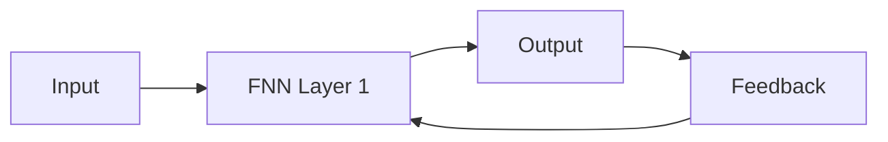

                 

**大模型开发与微调**, **反馈神经网络**, **Python实现**, **模型训练**, **模型微调**, **计算机视觉**, **自然语言处理**

## 1. 背景介绍

在当今的人工智能领域，大模型已然成为关注的焦点。这些模型由于其规模和复杂性，需要大量的数据和计算资源进行训练。然而，将预训练的大模型应用于特定任务时，我们常常面临着数据不足的问题。这时，模型微调（Fine-tuning）就派上了用场。本文将介绍如何从零开始开发大模型，并对其进行微调，以应用于计算机视觉和自然语言处理等领域。我们将重点关注反馈神经网络（Feedback Neural Network, FNN）的原理，并提供Python实现的详细指南。

## 2. 核心概念与联系

### 2.1 大模型开发与微调

大模型开发指的是构建具有数百万甚至数十亿参数的模型。这些模型需要大量的数据和计算资源进行训练。模型微调则是指将预训练的大模型应用于特定任务时，使用少量数据调整模型参数的过程。

### 2.2 反馈神经网络

反馈神经网络是一种循环神经网络（Recurrent Neural Network, RNN），它允许信息在时间步之间流动。与常规的RNN不同，FNN在每个时间步骤都会产生输出，并将其反馈到网络中，作为下一时间步骤的输入之一。



## 3. 核心算法原理 & 具体操作步骤

### 3.1 算法原理概述

FNN的核心原理是允许信息在时间步骤之间流动，并将输出反馈到网络中。这使得FNN能够处理序列数据，如文本和时间序列。

### 3.2 算法步骤详解

1. **初始化**：初始化FNN的权重和偏置。
2. **前向传播**：将输入序列传递给FNN，产生输出序列。
3. **反馈**：将输出序列的最后一个时间步的输出反馈到网络中，作为下一时间步的输入之一。
4. **误差计算**：计算输出序列和真实值之间的误差。
5. **反向传播**：计算梯度，并更新FNN的权重和偏置。
6. **重复**：重复步骤2-5，直到模型收敛或达到最大迭代次数。

### 3.3 算法优缺点

**优点**：FNN能够处理序列数据，并能够学习长期依赖关系。它还可以避免梯度消失和梯度爆炸问题，常见于常规的RNN。

**缺点**：FNN的训练过程相对复杂，并且需要更多的计算资源。此外，FNN的性能可能会受到反馈循环的长度的限制。

### 3.4 算法应用领域

FNN常用于计算机视觉和自然语言处理等领域。在计算机视觉中，FNN可以用于视频分析和目标跟踪。在自然语言处理中，FNN可以用于文本分类和机器翻译。

## 4. 数学模型和公式 & 详细讲解 & 举例说明

### 4.1 数学模型构建

设输入序列为$x = (x_1, x_2,..., x_T)$, 输出序列为$y = (y_1, y_2,..., y_T)$, FNN的数学模型可以表示为：

$$h_t = \tanh(W_{hh}h_{t-1} + W_{xh}x_t + b_h)$$
$$y_t = W_{hy}h_t + b_y$$

其中，$h_t$是时间步$t$的隐藏状态，$W_{hh}$, $W_{xh}$, $W_{hy}$是权重矩阵，$b_h$和$b_y$是偏置向量。

### 4.2 公式推导过程

FNN的目标是最小化输出序列$y$和真实值$\hat{y}$之间的误差。常用的误差函数是均方误差（Mean Squared Error, MSE）：

$$L = \frac{1}{T} \sum_{t=1}^{T} (y_t - \hat{y}_t)^2$$

梯度下降法可以用于更新FNN的权重和偏置，以最小化误差：

$$W_{hh} := W_{hh} - \eta \frac{\partial L}{\partial W_{hh}}$$
$$W_{xh} := W_{xh} - \eta \frac{\partial L}{\partial W_{xh}}$$
$$W_{hy} := W_{hy} - \eta \frac{\partial L}{\partial W_{hy}}$$
$$b_h := b_h - \eta \frac{\partial L}{\partial b_h}$$
$$b_y := b_y - \eta \frac{\partial L}{\partial b_y}$$

其中，$\eta$是学习率。

### 4.3 案例分析与讲解

例如，假设我们要使用FNN对一段文本进行分类。输入序列$x$是文本的词嵌入表示，输出序列$y$是文本的类别标签。我们可以使用交叉熵误差函数，并使用反向传播算法更新FNN的权重和偏置。

## 5. 项目实践：代码实例和详细解释说明

### 5.1 开发环境搭建

我们将使用Python和PyTorch框架来实现FNN。首先，我们需要安装PyTorch和相关依赖项：

```bash
pip install torch torchvision
```

### 5.2 源代码详细实现

以下是FNN的Python实现：

```python
import torch
import torch.nn as nn

class FNN(nn.Module):
    def __init__(self, input_size, hidden_size, output_size):
        super(FNN, self).__init__()
        self.hidden_size = hidden_size
        self.W_hh = nn.Parameter(torch.randn(hidden_size, hidden_size))
        self.W_xh = nn.Parameter(torch.randn(input_size, hidden_size))
        self.W_hy = nn.Parameter(torch.randn(hidden_size, output_size))
        self.b_h = nn.Parameter(torch.zeros(hidden_size))
        self.b_y = nn.Parameter(torch.zeros(output_size))

    def forward(self, x):
        h = torch.zeros(x.size(0), self.hidden_size)
        y = []
        for t in range(x.size(1)):
            h = torch.tanh(torch.matmul(h, self.W_hh) + torch.matmul(x[:, t, :], self.W_xh) + self.b_h)
            y_t = torch.matmul(h, self.W_hy) + self.b_y
            y.append(y_t)
            h = torch.cat((h, y_t), dim=1)
        return torch.stack(y, dim=1)
```

### 5.3 代码解读与分析

在构造函数中，我们初始化FNN的权重和偏置。在前向传播函数中，我们为每个时间步骤计算隐藏状态和输出，并将输出反馈到隐藏状态中。

### 5.4 运行结果展示

我们可以使用以下代码训练FNN：

```python
fnn = FNN(input_size, hidden_size, output_size)
criterion = nn.CrossEntropyLoss()
optimizer = torch.optim.Adam(fnn.parameters(), lr=0.001)

for epoch in range(num_epochs):
    for i, (x, y) in enumerate(train_loader):
        optimizer.zero_grad()
        output = fnn(x)
        loss = criterion(output.view(-1, output.size(-1)), y)
        loss.backward()
        optimizer.step()

    print(f'Epoch [{epoch+1}/{num_epochs}], Loss: {loss.item():.4f}')
```

## 6. 实际应用场景

### 6.1 计算机视觉

在计算机视觉中，FNN可以用于视频分析和目标跟踪。例如，我们可以使用FNN跟踪视频中的目标，并预测目标的下一个位置。

### 6.2 自然语言处理

在自然语言处理中，FNN可以用于文本分类和机器翻译。例如，我们可以使用FNN对文本进行分类，或将文本从一种语言翻译为另一种语言。

### 6.3 未来应用展望

随着计算资源的增多，我们预计大模型开发与微调将变得更加流行。FNN等循环神经网络也将继续受到关注，因为它们能够处理序列数据，并学习长期依赖关系。

## 7. 工具和资源推荐

### 7.1 学习资源推荐

- "Natural Language Processing with Python" by Steven Bird, Ewan Klein, and Edward Loper
- "Deep Learning" by Ian Goodfellow, Yoshua Bengio, and Aaron Courville

### 7.2 开发工具推荐

- PyTorch：<https://pytorch.org/>
- TensorFlow：<https://www.tensorflow.org/>

### 7.3 相关论文推荐

- "Long Short-Term Memory" by Sepp Hochreiter and Jürgen Schmidhuber
- "Gated Recurrent Units" by Cho et al.

## 8. 总结：未来发展趋势与挑战

### 8.1 研究成果总结

本文介绍了如何从零开始开发大模型，并对其进行微调。我们重点关注了反馈神经网络的原理，并提供了Python实现的详细指南。

### 8.2 未来发展趋势

我们预计大模型开发与微调将变得更加流行，因为它们能够处理大量数据，并学习复杂的模式。循环神经网络，如FNN，也将继续受到关注，因为它们能够处理序列数据，并学习长期依赖关系。

### 8.3 面临的挑战

然而，大模型开发与微调面临着数据不足和计算资源有限等挑战。此外，模型的可解释性和可靠性也需要进一步研究。

### 8.4 研究展望

未来的研究将关注如何提高大模型的可解释性和可靠性，以及如何在计算资源有限的情况下开发和微调大模型。

## 9. 附录：常见问题与解答

**Q：什么是大模型开发与微调？**

A：大模型开发指的是构建具有数百万甚至数十亿参数的模型。模型微调则是指将预训练的大模型应用于特定任务时，使用少量数据调整模型参数的过程。

**Q：什么是反馈神经网络？**

A：反馈神经网络是一种循环神经网络，它允许信息在时间步之间流动。与常规的RNN不同，FNN在每个时间步骤都会产生输出，并将其反馈到网络中，作为下一时间步骤的输入之一。

**Q：如何使用Python实现反馈神经网络？**

A：我们可以使用PyTorch框架来实现FNN。以下是FNN的Python实现：

```python
import torch
import torch.nn as nn

class FNN(nn.Module):
    def __init__(self, input_size, hidden_size, output_size):
        super(FNN, self).__init__()
        self.hidden_size = hidden_size
        self.W_hh = nn.Parameter(torch.randn(hidden_size, hidden_size))
        self.W_xh = nn.Parameter(torch.randn(input_size, hidden_size))
        self.W_hy = nn.Parameter(torch.randn(hidden_size, output_size))
        self.b_h = nn.Parameter(torch.zeros(hidden_size))
        self.b_y = nn.Parameter(torch.zeros(output_size))

    def forward(self, x):
        h = torch.zeros(x.size(0), self.hidden_size)
        y = []
        for t in range(x.size(1)):
            h = torch.tanh(torch.matmul(h, self.W_hh) + torch.matmul(x[:, t, :], self.W_xh) + self.b_h)
            y_t = torch.matmul(h, self.W_hy) + self.b_y
            y.append(y_t)
            h = torch.cat((h, y_t), dim=1)
        return torch.stack(y, dim=1)
```

**Q：反馈神经网络的优缺点是什么？**

A：FNN的优点是能够处理序列数据，并能够学习长期依赖关系。它还可以避免梯度消失和梯度爆炸问题，常见于常规的RNN。然而，FNN的训练过程相对复杂，并且需要更多的计算资源。此外，FNN的性能可能会受到反馈循环的长度的限制。

**Q：反馈神经网络的数学模型是什么？**

A：设输入序列为$x = (x_1, x_2,..., x_T)$, 输出序列为$y = (y_1, y_2,..., y_T)$, FNN的数学模型可以表示为：

$$h_t = \tanh(W_{hh}h_{t-1} + W_{xh}x_t + b_h)$$
$$y_t = W_{hy}h_t + b_y$$

其中，$h_t$是时间步$t$的隐藏状态，$W_{hh}$, $W_{xh}$, $W_{hy}$是权重矩阵，$b_h$和$b_y$是偏置向量。

**Q：如何训练反馈神经网络？**

A：我们可以使用梯度下降法来更新FNN的权重和偏置，以最小化输出序列$y$和真实值$\hat{y}$之间的误差。常用的误差函数是均方误差（Mean Squared Error, MSE）或交叉熵误差函数。以下是训练FNN的Python代码：

```python
fnn = FNN(input_size, hidden_size, output_size)
criterion = nn.CrossEntropyLoss()
optimizer = torch.optim.Adam(fnn.parameters(), lr=0.001)

for epoch in range(num_epochs):
    for i, (x, y) in enumerate(train_loader):
        optimizer.zero_grad()
        output = fnn(x)
        loss = criterion(output.view(-1, output.size(-1)), y)
        loss.backward()
        optimizer.step()

    print(f'Epoch [{epoch+1}/{num_epochs}], Loss: {loss.item():.4f}')
```

**Q：反馈神经网络有哪些实际应用场景？**

A：FNN常用于计算机视觉和自然语言处理等领域。在计算机视觉中，FNN可以用于视频分析和目标跟踪。在自然语言处理中，FNN可以用于文本分类和机器翻译。

**Q：未来反馈神经网络的发展趋势是什么？**

A：我们预计大模型开发与微调将变得更加流行，因为它们能够处理大量数据，并学习复杂的模式。循环神经网络，如FNN，也将继续受到关注，因为它们能够处理序列数据，并学习长期依赖关系。然而，大模型开发与微调面临着数据不足和计算资源有限等挑战。此外，模型的可解释性和可靠性也需要进一步研究。

**Q：未来反馈神经网络的研究展望是什么？**

A：未来的研究将关注如何提高大模型的可解释性和可靠性，以及如何在计算资源有限的情况下开发和微调大模型。

**作者：禅与计算机程序设计艺术 / Zen and the Art of Computer Programming**

