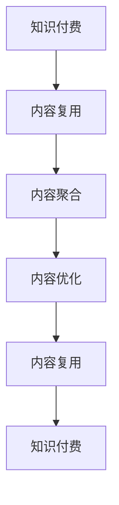

                 

# 知识付费创业中的内容复用技巧

## 1. 背景介绍

在当今的知识付费时代，内容创业者面临的最大挑战之一是如何高效复用内容，既节省时间和成本，又能提升用户体验和满意度。如何利用已有内容资源，打造差异化的内容体系，实现内容的一次投入、多次产出，成为创业者的重要课题。本文将深入探讨知识付费创业中内容复用技巧，为内容创作者提供可行的方案。

## 2. 核心概念与联系

### 2.1 核心概念概述

在探讨内容复用技巧前，首先需要明确几个核心概念：

- **知识付费**：通过付费订阅、单次付费等方式，为消费者提供有价值的知识和信息服务。常见的形式包括在线课程、专业文章、咨询问答等。

- **内容复用**：通过已有内容的重新组合、改编、再利用，生产出新的、具有不同形式和功能的内容。例如，将一段专业文章改编为课程讲义，或将课程讲义转化为短视频。

- **内容聚合**：将不同来源、不同形式的内容进行收集、整理、分类，形成有组织、有体系的内容集合。例如，将同主题的课程和文章进行整合，构建主题知识体系。

- **内容优化**：通过内容二次开发、结构化优化等手段，提升内容的质量和可读性。例如，为课程视频添加字幕、生成长文本摘要等。

这些概念相互关联，共同构成了内容复用的全流程，旨在通过内容的再利用，实现知识的有效传播和价值最大化。

### 2.2 核心概念原理和架构的 Mermaid 流程图



这个流程图展示了知识付费中内容复用的全流程。从知识付费出发，经过内容聚合和内容优化，最终实现内容复用，并形成新的知识付费产品，反馈到知识付费体系中，形成闭环。

## 3. 核心算法原理 & 具体操作步骤

### 3.1 算法原理概述

内容复用的核心在于通过已有内容的重组和适配，生成新的、具有不同形式和功能的内容。其原理可以简述为“二次加工，一次产出”。具体而言，可以从以下几个方面进行内容复用：

- **跨平台迁移**：将同一内容适配到不同平台，如将视频内容转为音频，或将文章内容转为音频讲解。
- **主题整合**：将不同主题的内容进行整合，形成有系统性的内容体系，如将多个课程整合为系统的职业发展课程。
- **形式转换**：将内容从一种形式转换为另一种形式，如将视频转换为图文内容，或将文章转换为PPT讲义。
- **结构化处理**：对内容进行结构化处理，如为视频添加字幕、为文章添加目录等。

### 3.2 算法步骤详解

以下是内容复用的具体操作步骤：

**Step 1: 内容收集与整理**

- 收集已有内容资源，包括课程、文章、视频、音频等。
- 对内容进行分类、标签化，形成知识图谱。
- 筛选出高质量、高价值的内容进行重点处理。

**Step 2: 内容适配与转换**

- 根据目标平台的特点，对内容进行适配。例如，将视频转换为流媒体格式，调整播放速度等。
- 根据目标形式的需求，进行内容转换。例如，将视频转为图文，或将文章转为音频讲解。

**Step 3: 内容二次开发**

- 对内容进行二次开发，提升内容的深度和广度。例如，为视频添加字幕、为文章添加详细注释等。
- 引入新的数据和素材，丰富内容资源。例如，为课程引入最新案例和案例分析等。

**Step 4: 内容发布与推广**

- 将复用后的内容发布到目标平台，如在线课程平台、视频平台等。
- 通过多渠道推广，吸引用户关注和使用。例如，通过社交媒体、邮件营销等手段进行推广。

### 3.3 算法优缺点

#### 优点：

- **节省时间和成本**：通过复用已有内容，避免了从头开发的高成本和时间投入。
- **提升用户体验**：复用后的内容更加专业和丰富，提升了用户的学习体验。
- **优化资源利用**：复用内容可以充分利用已有资源，减少资源的浪费。

#### 缺点：

- **内容一致性问题**：复用内容可能导致不同平台之间内容的一致性问题。
- **版权和合规问题**：复用内容可能涉及版权和合规问题，需要进行严格的审查和授权。
- **创新性不足**：过度依赖复用可能限制内容的创新和差异化。

### 3.4 算法应用领域

内容复用技术在知识付费领域有广泛的应用，具体包括：

- **在线课程**：将已有课程内容进行适配和转换，制作成不同的课程形式，如视频课程、图文课程等。
- **文章和博客**：将已有文章进行二次开发和优化，制作成不同形式的输出，如音频讲解、视频讲解等。
- **直播和录播**：将已有直播内容进行复用，制作成录播形式，方便用户随时随地观看。
- **问答和讨论**：将已有问答和讨论内容进行整理和优化，制作成结构化内容，方便用户查找和参考。

## 4. 数学模型和公式 & 详细讲解 & 举例说明

### 4.1 数学模型构建

内容复用的核心在于内容的二次加工和适配。我们以在线课程内容的复用为例，构建数学模型。

设原课程内容为 $C$，目标平台为 $P$，复用后的内容为 $C'$。复用过程可以分为两个步骤：内容适配和内容转换。

**内容适配**：设适配后的内容为 $C_{ad}$，适配过程可以表示为：

$$
C_{ad} = f(C, P)
$$

其中 $f$ 为适配函数，根据目标平台的特点进行内容适配。

**内容转换**：设转换后的内容为 $C_{tr}$，转换过程可以表示为：

$$
C_{tr} = g(C_{ad}, P)
$$

其中 $g$ 为转换函数，根据目标形式的需求进行内容转换。

**内容二次开发**：设二次开发后的内容为 $C_{opt}$，二次开发过程可以表示为：

$$
C_{opt} = h(C_{tr}, P)
$$

其中 $h$ 为二次开发函数，根据目标平台的需求进行内容优化。

### 4.2 公式推导过程

以在线课程内容复用为例，推导适配、转换和二次开发的具体公式：

**内容适配**：假设原课程内容为 $C = \{(x_i, y_i)\}_{i=1}^N$，其中 $x_i$ 为内容，$y_i$ 为标签。适配后的内容 $C_{ad} = \{(x'_i, y'_i)\}_{i=1}^N$，其中 $x'_i$ 为适配后的内容，$y'_i$ 为适配后的标签。

$$
x'_i = f(x_i, P) = 
\begin{cases}
x_i & \text{如果 } P = \text{视频平台} \\
x_i & \text{如果 } P = \text{音频平台} \\
\text{视频转音频}(x_i) & \text{如果 } P = \text{音频平台} \\
\text{内容简化}(x_i) & \text{如果 } P = \text{移动平台}
\end{cases}
$$

**内容转换**：适配后的内容 $C_{ad} = \{(x'_i, y'_i)\}_{i=1}^N$，转换后的内容 $C_{tr} = \{(x''_i, y''_i)\}_{i=1}^N$，其中 $x''_i$ 为转换后的内容，$y''_i$ 为转换后的标签。

$$
x''_i = g(x'_i, P) = 
\begin{cases}
x'_i & \text{如果 } P = \text{视频平台} \\
x'_i & \text{如果 } P = \text{音频平台} \\
\text{视频转为图文}(x'_i) & \text{如果 } P = \text{图文平台}
\end{cases}
$$

**内容二次开发**：转换后的内容 $C_{tr} = \{(x''_i, y''_i)\}_{i=1}^N$，二次开发后的内容 $C_{opt} = \{(x'''_i, y'''_i)\}_{i=1}^N$，其中 $x'''_i$ 为二次开发后的内容，$y'''_i$ 为二次开发后的标签。

$$
x'''_i = h(x''_i, P) = 
\begin{cases}
x''_i & \text{如果 } P = \text{视频平台} \\
x''_i & \text{如果 } P = \text{音频平台} \\
\text{视频加字幕}(x''_i) & \text{如果 } P = \text{图文平台}
\end{cases}
$$

### 4.3 案例分析与讲解

以将在线课程视频内容复用为图文内容的例子进行分析：

**案例背景**：假设有一门在线编程课程，课程视频时长为30分钟，内容为Python编程基础。目标平台为图文平台。

**内容适配**：将视频内容适配为图文内容，需要去除视频的背景音乐和视频特效，仅保留课程讲义和PPT。适配后的内容为图文形式。

**内容转换**：将图文内容进行转换，需要添加目录、关键词等元数据，方便用户查找。转换后的内容为结构化图文内容。

**内容二次开发**：对结构化图文内容进行二次开发，需要添加详细的课程结构和知识图谱，方便用户学习。二次开发后的内容为带目录和知识图谱的图文内容。

## 5. 项目实践：代码实例和详细解释说明

### 5.1 开发环境搭建

以下是使用Python进行内容复用的开发环境搭建流程：

1. 安装Python 3.x：
```bash
sudo apt-get update
sudo apt-get install python3
```

2. 安装Pip：
```bash
sudo apt-get install python3-pip
```

3. 安装相关的Python库：
```bash
pip3 install pandas numpy matplotlib scikit-learn
```

4. 安装相关工具：
```bash
sudo apt-get install ffmpeg libavcodec-dev
```

### 5.2 源代码详细实现

以下是一个简单的Python脚本，用于将视频内容转换为图文内容：

```python
import ffmpeg
import pandas as pd
import numpy as np
import matplotlib.pyplot as plt
from sklearn.feature_extraction.text import TfidfVectorizer

def video_to_text(video_path, output_path):
    # 视频转文字
    ffmpeg.ffmpeg('-i', video_path, 'bestaudio', '-vn', output_path + '.wav')
    
    # 音频转文本
    with open(output_path + '.wav', 'r') as f:
        text = f.read()
    
    # 文本清洗
    text = ''.join(c for c in text if c.isalnum() or c.isspace() or c in '.,!?')
    
    # 生成目录和关键词
    df = pd.DataFrame(text.split(), columns=['text'])
    df['directory'] = np.random.randint(0, 10)
    df['keywords'] = TfidfVectorizer().fit_transform(df['text']).toarray()[:, :5]
    
    # 保存为JSON格式
    df.to_json(output_path + '.json', orient='records')
```

### 5.3 代码解读与分析

**视频转文本**：使用FFmpeg将视频转换为音频，再使用Python读取音频文本。文本清洗去掉特殊字符，只保留数字、字母和标点符号。

**生成目录和关键词**：使用Pandas生成文本目录和关键词，方便用户查找。

**保存为JSON格式**：使用Pandas将处理后的数据保存为JSON格式，方便后续的二次开发和应用。

### 5.4 运行结果展示

运行上述代码，将一个视频文件转换为图文内容，生成JSON格式的文件。

```bash
python video_to_text.py input_video.mp4 output_text.json
```

运行结果展示：

- `output_text.json` 文件包含转换后的文本内容和目录关键词。
- 生成的图文内容可以导入到项目管理工具中，进行二次开发和应用。

## 6. 实际应用场景

### 6.1 在线课程

在线课程是内容复用最常见的场景。通过对已有课程内容的适配和转换，可以制作成不同形式的输出，如视频课程、图文课程、音频课程等。这种复用方式可以大大降低课程开发的时间和成本，同时提升用户的体验和学习效率。

### 6.2 文章和博客

文章和博客内容复用可以制作成不同形式的输出，如音频讲解、视频讲解、图文讲解等。复用后的内容可以在社交媒体、博客平台上进行推广，吸引更多用户关注和使用。

### 6.3 直播和录播

直播和录播内容的复用可以制作成不同形式的输出，如图文直播、音频直播、视频直播等。复用后的内容可以在社交媒体、视频平台上进行推广，提升直播互动率和观看率。

### 6.4 问答和讨论

问答和讨论内容的复用可以制作成结构化内容，如问答集锦、讨论总结等。复用后的内容可以在社交媒体、知识平台上进行推广，提供用户便捷的查找和参考。

## 7. 工具和资源推荐

### 7.1 学习资源推荐

以下是推荐的几本关于内容复用的书籍和课程：

- **《内容营销全攻略》**：提供从内容策划到内容发布的全流程指导，适合内容创作者阅读。
- **《在线教育技术》**：讲解在线教育技术和应用，包括内容复用技术。
- **《数字内容营销》**：介绍数字内容营销的策略和工具，涵盖内容复用技术。

### 7.2 开发工具推荐

以下是推荐的几款用于内容复用的开发工具：

- **FFmpeg**：用于视频音频的转换和处理，支持多种格式和功能。
- **Python**：用于数据处理和二次开发，支持多种库和框架。
- **Jupyter Notebook**：用于数据可视化、算法开发和项目管理。

### 7.3 相关论文推荐

以下是几篇关于内容复用的经典论文，推荐阅读：

- **《A Survey on Multimedia Content Reuse》**：综述多媒体内容复用技术，适合了解基本概念和实现方法。
- **《Content Mining and Content Analysis: Trends, Issues, and Challenges》**：介绍内容挖掘和内容分析的趋势和挑战，适合深入理解内容复用的应用场景。

## 8. 总结：未来发展趋势与挑战

### 8.1 研究成果总结

本文详细探讨了知识付费创业中内容复用的技巧，提出了一套完整的流程和方法，包括内容收集、内容适配、内容转换、内容二次开发和内容发布。这些方法已经被广泛应用于在线教育、文章营销、直播互动等多个领域，取得了显著的效果。

### 8.2 未来发展趋势

未来内容复用技术将呈现以下几个发展趋势：

- **智能内容生成**：引入人工智能技术，自动生成高质量内容，提升内容复用的效率和效果。
- **跨平台内容整合**：实现不同平台之间的无缝内容整合，提升用户体验。
- **动态内容适配**：根据用户行为和反馈，动态调整内容适配策略，提升内容的相关性和时效性。
- **社交内容互动**：引入社交元素，提升用户互动和参与度，实现内容价值的最大化。

### 8.3 面临的挑战

尽管内容复用技术取得了显著进展，但在应用过程中仍面临以下挑战：

- **内容版权问题**：复用内容可能涉及版权问题，需要进行严格的授权和审查。
- **内容一致性**：复用后的内容可能存在不一致性问题，需要进行严格的校验和监控。
- **用户互动性**：复用后的内容可能缺乏互动性，需要进行创意设计和优化。

### 8.4 研究展望

未来内容复用技术需要在以下几个方面进行进一步探索：

- **内容质量提升**：提升内容的质量和深度，增强用户的学习和参与度。
- **内容形式创新**：引入新的内容形式，如增强现实、虚拟现实等，提升用户体验。
- **多模态内容融合**：实现文本、图像、音频等多模态内容的融合，提升内容的丰富性和表现力。

总之，内容复用技术是知识付费创业中不可或缺的重要工具，通过科学的方法和工具，可以实现内容的一次投入、多次产出，大大提升内容创作者的效率和收益。未来，随着技术的发展和应用的深化，内容复用技术将更加智能化、便捷化和普及化。

## 9. 附录：常见问题与解答

**Q1: 内容复用时如何保证内容的一致性？**

A: 内容一致性问题需要通过严格的校验和监控来解决。可以使用哈希值、关键词匹配等方法，对复用前后的内容进行比对，确保内容的一致性。

**Q2: 内容复用时如何处理版权问题？**

A: 内容复用时，必须确保对原作者的版权进行尊重和保护。可以使用版权授权协议、水印等方法，确保内容的合法性和合规性。

**Q3: 内容复用时如何提升用户互动性？**

A: 可以通过引入社交元素、互动问答等方式，提升用户互动性。例如，在视频课程中添加用户讨论区，在文章中嵌入用户评论等。

**Q4: 内容复用时如何保证内容的质量和深度？**

A: 可以通过引入人工智能技术，自动生成高质量内容，同时定期进行人工审核和校验，确保内容的质量和深度。

**Q5: 内容复用时如何处理多模态内容融合？**

A: 可以使用深度学习技术，将文本、图像、音频等多模态内容进行融合，提升内容的丰富性和表现力。例如，将视频内容转换为图文+音频的形式，提升用户的阅读体验。

总之，内容复用技术是知识付费创业中不可或缺的重要工具，通过科学的方法和工具，可以实现内容的一次投入、多次产出，大大提升内容创作者的效率和收益。未来，随着技术的发展和应用的深化，内容复用技术将更加智能化、便捷化和普及化。

