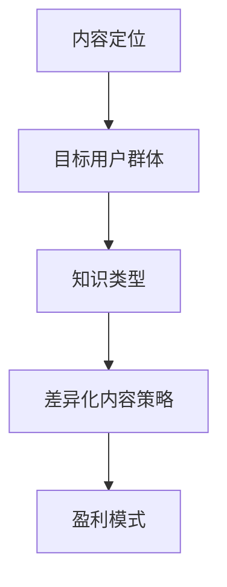

                 

# 知识付费创业中的内容定位策略

## 1. 背景介绍

随着互联网的普及和知识经济的发展，知识付费作为一种新兴的商业模式，迅速崛起并成为增长迅速的行业。近年来，各大知识付费平台如雨后春笋般涌现，提供了丰富的课程、电子书、音频等知识产品，满足了用户对深度学习、职业发展、娱乐休闲等多样化需求。但同时，行业内也存在内容同质化严重、用户粘性低、盈利模式单一等问题。

内容定位作为知识付费创业的核心战略，决定着平台的用户群体、知识类型、商业模式等关键要素。本文将从内容定位的重要性出发，系统分析内容定位的战略框架，并提供一系列基于核心概念的思考和建议。

## 2. 核心概念与联系

### 2.1 核心概念概述

- **内容定位（Content Positioning）**：指的是知识付费平台在市场竞争中明确自己的独特定位，包括目标用户群体、主打知识类型和差异化内容策略等。
- **目标用户群体（Target Audience）**：根据平台定位和内容特色，锁定并吸引特定的用户群体，如职场新人、高收入人群、学生等。
- **知识类型（Knowledge Types）**：包括专业技能、思维模式、生活常识、娱乐休闲等各类知识，根据用户需求和平台定位选择合适的知识类型。
- **差异化内容策略（Differentiated Content Strategy）**：通过内容创新、知识深度、用户体验等维度，打造与竞争对手不同的差异化内容，提升用户粘性和忠诚度。
- **盈利模式（Revenue Models）**：结合平台定位和用户需求，设计多样化的盈利模式，如按需付费、会员制、广告分成等。

这些核心概念之间的联系通过以下Mermaid流程图展示：



通过上述流程可以看出，内容定位贯穿于知识付费平台的构建和运营全过程，是平台成功与否的关键因素之一。

## 3. 核心算法原理 & 具体操作步骤
### 3.1 算法原理概述

内容定位的核心在于利用数据和算法，从用户需求、市场竞争、自身资源等方面综合分析，确定平台的内容特色和差异化策略。主要包括以下步骤：

1. **数据收集与分析**：通过问卷调查、用户行为分析、市场调研等方式，收集目标用户群体的需求和偏好，识别市场竞争态势，评估自身资源和能力。
2. **用户画像构建**：基于收集到的数据，构建用户画像，包括用户年龄、性别、职业、兴趣、购买力等特征，帮助理解目标用户群体。
3. **内容分类与匹配**：根据用户画像和市场需求，分类选择合适的知识类型，并通过算法匹配推荐给用户。
4. **差异化内容策略制定**：结合自身资源和平台特色，制定差异化的内容策略，如创新课程设计、打造深度内容、提升用户体验等。
5. **盈利模式设计**：根据内容定位和用户需求，设计多样化的盈利模式，确保平台可持续发展。

### 3.2 算法步骤详解

#### 步骤1：数据收集与分析
- **问卷调查**：设计针对性的问卷，通过线上线下渠道收集用户反馈，了解用户需求和痛点。
- **用户行为分析**：分析平台用户的浏览、购买、评价等行为数据，识别热门课程和用户偏好。
- **市场调研**：通过行业报告、竞品分析等方式，了解市场趋势和竞争态势。

#### 步骤2：用户画像构建
- **特征提取**：从用户行为数据中提取关键特征，如活跃度、消费频次、偏好类型等。
- **聚类分析**：使用K-means、层次聚类等算法对用户进行聚类分析，划分不同的用户群体。
- **画像描述**：根据聚类结果，构建用户画像，如职场新人、高收入人群、学生等。

#### 步骤3：内容分类与匹配
- **知识类型选择**：根据用户画像和市场调研结果，选择适合的内容类型，如职场技能、心理建设、生活技巧等。
- **算法匹配**：使用协同过滤、深度学习等算法，根据用户画像和内容特征，推荐合适的课程和文章。

#### 步骤4：差异化内容策略制定
- **创新设计**：推出独家课程或定制内容，如邀请专家授课、制作实验课程等。
- **深度内容制作**：制作深入浅出、易于理解的高质量内容，提升用户学习体验。
- **用户体验优化**：改进课程界面、增加互动元素、优化购买流程等，提升用户满意度。

#### 步骤5：盈利模式设计
- **按需付费**：提供高性价比的付费课程，按课时或模块收费。
- **会员制**：推出高级会员服务，提供更多增值内容、专属服务等。
- **广告分成**：与品牌合作，在课程中嵌入广告，通过广告分成增加收益。

### 3.3 算法优缺点

内容定位的算法具有以下优点：
- **数据驱动决策**：通过数据和算法分析，准确把握用户需求和市场动态，做出科学决策。
- **高效匹配推荐**：使用算法匹配用户和内容，减少用户搜索时间和平台运营成本。
- **差异化策略制定**：通过算法分析，制定与竞争对手不同的差异化策略，提升竞争力。

同时，内容定位算法也存在以下缺点：
- **数据偏差**：如果数据收集和分析存在偏差，可能导致用户画像和内容匹配不准确。
- **算法复杂度**：复杂的算法实现可能增加技术难度和成本。
- **更新不及时**：算法模型需要定期更新，以应对市场变化和用户需求变化，增加了运营复杂性。

### 3.4 算法应用领域

内容定位算法在知识付费平台中的应用非常广泛，具体包括：

- **课程推荐系统**：根据用户画像和历史行为，推荐适合的课程和文章。
- **广告精准投放**：通过用户画像和内容匹配，精准投放广告，提高广告效果。
- **会员服务设计**：根据用户画像和消费行为，设计差异化的会员服务，提升用户粘性。
- **内容创作指导**：利用数据和算法分析，指导内容创作者优化内容设计，提升内容质量。

## 4. 数学模型和公式 & 详细讲解 & 举例说明
### 4.1 数学模型构建

内容定位的数学模型主要基于用户画像和内容特征的相似度计算。假设用户画像为 $U=(u_1,u_2,...,u_n)$，内容特征为 $C=(c_1,c_2,...,c_m)$，其中 $u_i$ 表示第 $i$ 个用户画像特征，$c_j$ 表示第 $j$ 个内容特征。

设用户画像与内容特征的相似度为 $S(U,C)$，模型目标是最小化用户画像与内容特征之间的相似度差异，即：

$$
\min_{U,C} \sum_{i=1}^n \sum_{j=1}^m (u_i - c_j)^2
$$

其中 $(u_i - c_j)^2$ 表示用户画像特征与内容特征的差异度，通过最小化差异度，实现用户画像与内容特征的精准匹配。

### 4.2 公式推导过程

在实际计算中，用户画像和内容特征的相似度可以采用余弦相似度、欧式距离等方法计算。这里以余弦相似度为例，推导用户画像与内容特征的相似度公式：

设用户画像 $U$ 和内容特征 $C$ 的向量表示分别为 $u=(u_1,u_2,...,u_n)$ 和 $c=(c_1,c_2,...,c_m)$，则余弦相似度公式为：

$$
S(U,C) = \frac{u \cdot c}{||u|| \cdot ||c||}
$$

其中 $u \cdot c$ 表示向量 $u$ 和 $c$ 的点积，$||u||$ 和 $||c||$ 分别表示向量 $u$ 和 $c$ 的模长。

### 4.3 案例分析与讲解

以一个简单的用户画像和内容匹配为例，假设用户画像 $U=(1,0,1,0)$，内容特征 $C=(1,1,0,1)$，则计算余弦相似度：

- $u \cdot c = 1 \times 1 + 0 \times 1 + 1 \times 0 + 0 \times 1 = 2$
- $||u|| = \sqrt{1^2 + 0^2 + 1^2 + 0^2} = \sqrt{2}$
- $||c|| = \sqrt{1^2 + 1^2 + 0^2 + 1^2} = \sqrt{3}$
- $S(U,C) = \frac{2}{\sqrt{2} \cdot \sqrt{3}} = \frac{2\sqrt{6}}{6} \approx 0.77$

通过计算得知用户画像与内容特征的相似度为 0.77，表明用户画像与内容特征之间具有较高的匹配度，适合推荐该内容。

## 5. 项目实践：代码实例和详细解释说明
### 5.1 开发环境搭建

要进行内容定位算法的项目实践，需要搭建一个包含数据处理、模型训练和推荐系统的开发环境。

#### 5.1.1 数据收集
- **问卷调查**：设计问卷，使用在线调查工具（如问卷星、腾讯问卷）进行数据收集。
- **用户行为数据**：使用网站统计工具（如Google Analytics、Mixpanel）收集用户行为数据。
- **市场调研**：使用竞品分析工具（如App Annie、SimilarWeb）进行市场调研。

#### 5.1.2 数据预处理
- **数据清洗**：去除无效和重复数据，处理缺失值和异常值。
- **特征提取**：根据业务需求，提取关键特征，如用户活跃度、课程评分等。
- **数据标准化**：对特征进行标准化处理，使其符合算法要求。

#### 5.1.3 环境搭建
- **Python环境**：安装Python 3.8及以上版本，使用虚拟环境（如conda）管理依赖包。
- **数据处理库**：安装numpy、pandas、scikit-learn等数据处理库。
- **机器学习库**：安装scikit-learn、tensorflow等机器学习库。
- **推荐系统库**：安装surprise、lightfm等推荐系统库。

### 5.2 源代码详细实现

以下是一个简单的用户画像和内容匹配代码示例，使用numpy和scikit-learn库实现余弦相似度计算：

```python
import numpy as np
from sklearn.metrics.pairwise import cosine_similarity

# 定义用户画像和内容特征
user_profiles = np.array([[1, 0, 1, 0],
                         [0, 1, 0, 1],
                         [1, 1, 0, 0]])
content_features = np.array([[1, 1, 0, 1],
                            [0, 0, 1, 1],
                            [1, 1, 1, 0]])

# 计算余弦相似度
similarity_matrix = cosine_similarity(user_profiles, content_features)
print(similarity_matrix)
```

### 5.3 代码解读与分析

上述代码中，我们使用了numpy和scikit-learn库实现了用户画像与内容特征的余弦相似度计算。具体步骤如下：

1. 定义用户画像和内容特征的数组。
2. 使用scikit-learn的cosine_similarity函数计算相似度矩阵。
3. 输出相似度矩阵，即用户画像与内容特征之间的相似度。

## 6. 实际应用场景
### 6.1 智能推荐系统

内容定位算法在智能推荐系统中的应用非常广泛。通过分析用户画像和内容特征，智能推荐系统可以精准推荐用户感兴趣的内容，提升用户满意度。

以在线教育平台为例，平台可以根据用户的学习历史、成绩、兴趣等信息，构建用户画像，并匹配适合的学习资源，如课程、视频、练习题等。通过持续优化推荐算法，平台可以实现个性化推荐，满足用户多样化的学习需求。

### 6.2 广告精准投放

在广告领域，内容定位算法可以帮助广告主精准投放广告，提高广告效果。

广告主可以根据目标用户画像，选择与用户画像相似的内容特征，投放与内容相关的广告。通过优化广告投放策略，广告主可以避免浪费资源，提高广告转化率。

### 6.3 社交媒体推荐

社交媒体平台如微博、微信等，也可以通过内容定位算法进行内容推荐，提升用户体验和平台活跃度。

平台可以根据用户的浏览历史、点赞评论等行为数据，构建用户画像，并推荐与用户画像相似的内容。通过精准推荐，平台可以提升用户粘性，增加用户互动。

## 7. 工具和资源推荐
### 7.1 学习资源推荐

- **Coursera《机器学习》课程**：由斯坦福大学教授Andrew Ng主讲的经典课程，涵盖机器学习基础知识和算法应用。
- **Kaggle机器学习竞赛**：通过参加Kaggle竞赛，实战练习数据预处理、模型训练等技能。
- **TensorFlow官方文档**：学习TensorFlow库的推荐系统实现，掌握推荐算法和特征工程。
- **Surprise推荐系统库**：学习Surprise库的使用，掌握推荐系统的主要算法和评价指标。

### 7.2 开发工具推荐

- **Jupyter Notebook**：支持代码编写和数据可视化，方便模型训练和结果展示。
- **GitHub**：开源代码托管平台，方便团队协作和代码共享。
- **Hadoop/Spark**：大数据处理框架，支持大规模数据处理和分布式计算。
- **AWS/Azure/GCP**：云计算平台，提供丰富的云计算资源和弹性计算能力。

### 7.3 相关论文推荐

- **User-Based Collaborative Filtering Recommendation Algorithms**：介绍协同过滤算法的基本原理和应用，是推荐系统研究的基础。
- **Deep Learning for Recommender Systems**：介绍深度学习在推荐系统中的应用，包括基于神经网络的推荐模型。
- **The Surprise Library**：Surprise库的官方文档，详细介绍推荐系统算法的实现和应用。

## 8. 总结：未来发展趋势与挑战
### 8.1 研究成果总结

内容定位算法作为知识付费创业的核心战略，对于平台的发展和用户的满意度具有重要影响。通过科学的数据分析和算法设计，可以实现精准的内容匹配，提升用户体验和平台盈利能力。

### 8.2 未来发展趋势

内容定位算法的发展趋势如下：

- **数据驱动决策**：随着数据量的增加和算法的进步，内容定位将更加依赖数据驱动的决策。
- **深度学习应用**：深度学习技术在内容定位中的应用将越来越广泛，提高内容推荐的精准度。
- **个性化推荐**：个性化推荐将成为内容定位的重要手段，满足用户多样化的需求。
- **实时推荐**：实时推荐技术的应用将提升用户满意度，增加平台的竞争力。

### 8.3 面临的挑战

尽管内容定位算法已经取得了一定的进展，但仍然面临以下挑战：

- **数据质量问题**：数据收集和处理中可能存在偏差和噪声，影响内容定位的准确性。
- **算法复杂度**：复杂的内容定位算法可能增加技术难度和成本。
- **隐私和安全**：用户数据的隐私保护和数据安全是内容定位算法的关键问题，需采取有效的防护措施。

### 8.4 研究展望

未来内容定位算法的方向包括：

- **跨平台推荐**：将内容定位算法应用于多平台之间，实现跨平台内容推荐，提升用户体验。
- **多模态推荐**：结合图像、语音、视频等多模态数据，提升推荐系统的智能化水平。
- **实时数据处理**：利用流式计算和大数据技术，实现实时数据处理和内容推荐。
- **增强学习**：引入增强学习算法，提高内容推荐的灵活性和自适应能力。

## 9. 附录：常见问题与解答

**Q1：内容定位算法的核心是什么？**

A: 内容定位算法的核心在于利用数据和算法，从用户需求、市场竞争、自身资源等方面综合分析，确定平台的内容特色和差异化策略。

**Q2：如何构建准确的用户画像？**

A: 构建准确的用户画像需要从多个维度收集用户数据，如行为数据、社交数据、属性数据等，并使用聚类分析、特征工程等方法进行处理。

**Q3：内容定位算法有哪些应用场景？**

A: 内容定位算法在知识付费、广告投放、社交媒体推荐等领域都有广泛应用，能够提升推荐精度和用户体验。

**Q4：内容定位算法面临哪些挑战？**

A: 数据质量问题、算法复杂度和隐私安全问题是内容定位算法面临的主要挑战，需采取有效措施解决。

**Q5：如何提升内容推荐的精准度？**

A: 通过数据驱动决策、深度学习应用、个性化推荐等手段，可以提高内容推荐的精准度。

---

作者：禅与计算机程序设计艺术 / Zen and the Art of Computer Programming

