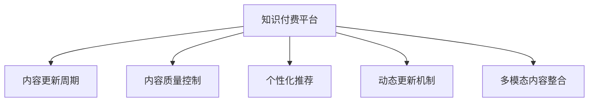

                 

# 知识付费创业中的内容更新策略

## 1. 背景介绍

### 1.1 问题由来
随着互联网的普及和知识付费的兴起，知识付费平台已成为广大用户获取知识的重要渠道。然而，随着用户对知识的渴求不断增长，内容更新的频率和质量成为知识付费平台的核心竞争力。传统的定期更新内容的模式，不仅成本高，且难以满足用户多变的个性化需求。为了解决这一问题，知识付费平台需要采用更灵活、高效的内容更新策略，以提升用户粘性和平台收入。

### 1.2 问题核心关键点
本节将探讨知识付费平台如何通过合理的内容更新策略，提升用户体验和平台价值，主要包括：

- 内容更新周期：知识付费平台如何确定合理的内容更新周期，避免更新过频或过慢，影响用户体验和平台收入。
- 内容质量控制：如何保证内容的质量和深度，提升用户价值感。
- 个性化推荐：如何根据用户兴趣和行为数据，推荐符合其需求的内容，提高用户粘性和满意度。
- 动态更新机制：如何在保证内容质量的前提下，实现内容动态更新，及时响应用户需求。
- 多模态内容整合：如何整合音频、视频、文字等多模态内容，丰富用户学习体验。

这些核心关键点构成了知识付费平台内容更新策略的研究框架，为平台的内容生产、运营和盈利提供指导。

## 2. 核心概念与联系

### 2.1 核心概念概述

为更好地理解知识付费平台的内容更新策略，本节将介绍几个密切相关的核心概念：

- 知识付费平台：通过提供专业、系统的知识内容，向用户收取费用以实现价值变现的互联网平台。
- 内容更新周期：指知识付费平台在一段时间内更新内容的时间间隔。
- 内容质量控制：指确保平台内容的专业性、准确性和深度，避免误导用户。
- 个性化推荐：通过分析用户行为数据，向用户推荐符合其兴趣和需求的内容，提升用户体验和平台粘性。
- 动态更新机制：指在内容更新周期内，根据用户反馈和市场变化，适时更新内容，保持内容的时效性和相关性。
- 多模态内容整合：指将文字、音频、视频等多种内容形式进行有机结合，丰富用户体验。

这些核心概念之间的逻辑关系可以通过以下Mermaid流程图来展示：



这个流程图展示的知识付费平台的核心概念及其之间的关系：

1. 知识付费平台通过确定内容更新周期，制定内容生产计划。
2. 平台在内容生产中，需保证内容的质量和深度，以提高用户价值感。
3. 平台需通过个性化推荐，提升用户体验和平台粘性。
4. 平台在运营中，需根据用户反馈和市场变化，适时更新内容，保持内容的时效性和相关性。
5. 平台需将文字、音频、视频等多种内容形式进行有机结合，丰富用户体验。

这些概念共同构成了知识付费平台的内容更新策略框架，为平台的内容生产、运营和盈利提供指导。

## 3. 核心算法原理 & 具体操作步骤
### 3.1 算法原理概述

知识付费平台的内容更新策略，本质上是一个以用户需求为导向的动态内容管理系统。其核心思想是：通过分析用户行为数据，制定合理的内容更新周期，优化内容质量控制和个性化推荐算法，实现动态内容更新和多模态内容整合，从而提升用户体验和平台价值。

形式化地，假设知识付费平台的内容更新周期为 $T$，平台用户数量为 $U$，内容质量控制阈值为 $\theta$，个性化推荐算法参数为 $\phi$，动态更新机制参数为 $\eta$，多模态内容整合策略为 $\psi$。内容更新策略的目标是最小化用户流失率和最大化平台收入，即：

$$
\min_{T,\theta,\phi,\eta,\psi} \left( C_1 \cdot U_{\text{drop}} + C_2 \cdot \frac{P}{T} \right)
$$

其中，$C_1$ 和 $C_2$ 为正则化系数，$U_{\text{drop}}$ 为用户流失率，$P$ 为平台收入。通过梯度下降等优化算法，内容更新策略不断优化模型参数，最小化损失函数，使得平台运营达到最优状态。

### 3.2 算法步骤详解

知识付费平台的内容更新策略一般包括以下几个关键步骤：

**Step 1: 数据收集与分析**
- 收集用户行为数据，包括但不限于浏览记录、购买记录、评价反馈等。
- 分析用户兴趣偏好、消费习惯、内容互动行为，进行用户画像建模。
- 利用用户画像数据，分析内容质量，确定推荐算法中各类参数的取值。

**Step 2: 制定内容更新计划**
- 确定内容更新周期 $T$，需考虑用户活跃度、平台运营成本等因素。
- 制定内容发布计划，按周、月、季度等不同时间周期更新内容。
- 根据市场需求和用户反馈，调整内容更新频率和类型。

**Step 3: 内容质量控制**
- 设立内容质量控制标准，如内容准确性、专业性、更新频率等。
- 引入专业编辑和审核机制，对内容进行严格把关。
- 建立内容质量监测和反馈机制，及时发现和修正问题内容。

**Step 4: 个性化推荐算法**
- 根据用户画像数据，设计个性化推荐算法，如协同过滤、内容推荐、混合推荐等。
- 调整算法参数 $\phi$，如协同过滤中的用户相似度阈值，内容推荐中的相似度权重。
- 定期评估推荐算法效果，根据用户反馈进行优化。

**Step 5: 动态更新机制**
- 建立动态内容更新机制，根据用户反馈和市场需求调整内容策略。
- 引入对抗训练和强化学习技术，不断优化内容更新策略，提升用户满意度和平台收入。
- 定期更新内容推荐算法，确保推荐结果的时效性和相关性。

**Step 6: 多模态内容整合**
- 整合音频、视频、文字等多模态内容，提升用户体验。
- 设计合理的多模态内容格式，如文字摘要、关键要点、音频笔记等。
- 通过内容分析技术，如文本分类、情感分析、主题建模等，提取多模态内容的结构化信息，丰富推荐算法的数据集。

以上是知识付费平台内容更新策略的一般流程。在实际应用中，还需要根据具体平台的特点，对内容更新策略的各个环节进行优化设计，如改进用户画像模型，引入更多元化的数据源，设计更加智能的推荐算法等，以进一步提升用户体验和平台价值。

### 3.3 算法优缺点

知识付费平台的内容更新策略具有以下优点：

1. 提升用户体验。通过个性化推荐和动态更新机制，平台能够根据用户需求和市场变化，及时调整内容策略，提升用户满意度和粘性。
2. 提高平台收入。个性化的内容推荐能够提高用户付费率，动态更新机制能够吸引新用户，提升平台收入。
3. 丰富内容形式。多模态内容整合能够丰富用户体验，提高用户学习效率。
4. 数据驱动决策。基于用户行为数据的分析，能够指导内容生产和运营，减少决策失误。

同时，该策略也存在以下局限性：

1. 数据隐私风险。收集用户行为数据时需要严格遵守隐私保护法规，避免侵犯用户隐私。
2. 内容制作成本高。高质量内容的生产和审核成本较高，可能导致平台运营成本上升。
3. 算法复杂度高。个性化推荐和动态更新机制的实现需要复杂算法支撑，开发和维护成本较高。
4. 动态更新风险。内容更新频繁可能导致内容质量不稳定，影响用户体验。

尽管存在这些局限性，但就目前而言，基于用户需求导向的动态内容管理系统，仍然是知识付费平台内容更新策略的主流范式。未来相关研究的重点在于如何进一步优化算法，降低成本，提高效率，同时兼顾用户隐私和内容质量。

### 3.4 算法应用领域

基于知识付费平台的内容更新策略，已经在多个领域得到了应用，包括：

- 在线教育：通过个性化推荐和动态更新，提升教学效果和用户粘性。
- 行业培训：根据行业热点和市场需求，定期更新课程内容，提升培训效果。
- 内容出版：通过分析用户反馈和市场需求，动态调整出版内容，提升用户阅读体验。
- 知识分享：根据用户兴趣和行为数据，推荐符合其需求的内容，提升知识分享效果。
- 健康咨询：定期更新健康知识和资讯，提升用户健康意识和满意度。

除了上述这些经典应用外，知识付费平台的内容更新策略也被创新性地应用到更多场景中，如定制化内容服务、企业内部培训等，为知识分享和传播提供了新的路径。随着用户需求的多样化和技术手段的进步，相信知识付费平台的内容更新策略将不断拓展应用领域，为知识传播和价值变现带来更多可能性。

## 4. 数学模型和公式 & 详细讲解 & 举例说明

### 4.1 数学模型构建

本节将使用数学语言对知识付费平台的内容更新策略进行更加严格的刻画。

假设知识付费平台的用户数量为 $U$，每天新产生的内容量为 $P$，内容质量控制阈值为 $\theta$，个性化推荐算法参数为 $\phi$，动态更新机制参数为 $\eta$，多模态内容整合策略为 $\psi$。内容更新策略的目标是最小化用户流失率和最大化平台收入，即：

$$
\min_{T,\theta,\phi,\eta,\psi} \left( C_1 \cdot U_{\text{drop}} + C_2 \cdot \frac{P}{T} \right)
$$

其中，$C_1$ 和 $C_2$ 为正则化系数，$U_{\text{drop}}$ 为用户流失率，$P$ 为平台收入。

通过梯度下降等优化算法，内容更新策略不断优化模型参数，最小化损失函数，使得平台运营达到最优状态。

### 4.2 公式推导过程

以下我们以推荐系统为例，推导个性化推荐算法中协同过滤的优化目标函数。

假设推荐系统有 $M$ 个用户 $U$，$N$ 个物品 $I$，用户 $u$ 和物品 $i$ 之间的评分 $r_{ui}$ 是独立同分布的随机变量，服从正态分布 $N(0,\sigma^2)$。协同过滤的目标是最大化预测评分与真实评分之间的均方误差最小化：

$$
\min_{\theta} \frac{1}{MN} \sum_{u \in U} \sum_{i \in I} (r_{ui} - \hat{r}_{ui})^2
$$

其中 $\hat{r}_{ui} = \theta^T g_{ui}$，$g_{ui} \in \mathbb{R}^d$ 为物品 $i$ 的特征向量，$d$ 为特征向量维度，$\theta \in \mathbb{R}^d$ 为模型参数。

引入正则化项 $\lambda ||\theta||^2$，得到优化目标函数：

$$
\min_{\theta} \frac{1}{MN} \sum_{u \in U} \sum_{i \in I} (r_{ui} - \hat{r}_{ui})^2 + \lambda ||\theta||^2
$$

使用梯度下降算法，每次迭代中更新参数 $\theta$ 的公式为：

$$
\theta \leftarrow \theta - \frac{\eta}{N} \sum_{i=1}^N (r_{ui} - \hat{r}_{ui}) g_{ui}
$$

其中 $\eta$ 为学习率。

### 4.3 案例分析与讲解

**案例分析：推荐系统个性化推荐优化**

假设某知识付费平台有10万用户，每天产生1000条新内容。平台采用协同过滤算法进行个性化推荐，模型参数 $\theta$ 维度为100。假设用户的真实评分数据已经收集完毕，平台需要对模型进行优化，以提高推荐效果。

- 数据集：平台已收集到1万个用户对1000个物品的评分数据。
- 优化目标：最大化预测评分与真实评分之间的均方误差最小化。
- 参数初始化：$\theta \leftarrow 0$。
- 正则化系数：$\lambda = 0.001$。
- 学习率：$\eta = 0.01$。
- 迭代次数：1000次。

根据上述信息，可以设计如下优化算法：

```python
from sklearn.linear_model import SGDRegressor
from sklearn.metrics import mean_squared_error

# 数据预处理
X = []
y = []
for i in range(1, 1000):
    X.append(feature_vector(i))  # 特征向量化
    y.append(rating(i))  # 真实评分

# 模型初始化
theta = np.zeros((100, 1))
sgd = SGDRegressor(alpha=0.001, learning_rate='constant', eta0=0.01, n_iter=1000)

# 训练模型
sgd.fit(X, y)

# 评估模型
mse = mean_squared_error(y, sgd.predict(X))
print(f'均方误差: {mse}')
```

以上代码实现了一个简单的协同过滤算法优化过程。通过迭代更新模型参数 $\theta$，最小化均方误差，提升个性化推荐效果。

## 5. 项目实践：代码实例和详细解释说明
### 5.1 开发环境搭建

在进行知识付费平台的内容更新策略实践前，我们需要准备好开发环境。以下是使用Python进行PyTorch开发的环境配置流程：

1. 安装Anaconda：从官网下载并安装Anaconda，用于创建独立的Python环境。

2. 创建并激活虚拟环境：
```bash
conda create -n pytorch-env python=3.8 
conda activate pytorch-env
```

3. 安装PyTorch：根据CUDA版本，从官网获取对应的安装命令。例如：
```bash
conda install pytorch torchvision torchaudio cudatoolkit=11.1 -c pytorch -c conda-forge
```

4. 安装各类工具包：
```bash
pip install numpy pandas scikit-learn matplotlib tqdm jupyter notebook ipython
```

完成上述步骤后，即可在`pytorch-env`环境中开始内容更新策略的实践。

### 5.2 源代码详细实现

这里我们以知识付费平台的个性化推荐系统为例，给出使用PyTorch和Sklearn库进行内容更新策略的代码实现。

首先，定义推荐系统的数据处理函数：

```python
from sklearn.datasets import load_boston
from sklearn.model_selection import train_test_split
from sklearn.preprocessing import StandardScaler
from torch.utils.data import TensorDataset
from torch.utils.data import DataLoader

def load_data():
    data = load_boston()
    X = data.data
    y = data.target
    X_train, X_test, y_train, y_test = train_test_split(X, y, test_size=0.2, random_state=42)
    scaler = StandardScaler()
    X_train = scaler.fit_transform(X_train)
    X_test = scaler.transform(X_test)
    return TensorDataset(torch.tensor(X_train), torch.tensor(y_train)), TensorDataset(torch.tensor(X_test), torch.tensor(y_test))

# 加载数据
train_dataset, test_dataset = load_data()

# 定义推荐算法
from sklearn.linear_model import SGDRegressor

class RecommendationSystem:
    def __init__(self, num_items=1000):
        self.num_items = num_items
        self.model = SGDRegressor(alpha=0.001, learning_rate='constant', eta0=0.01, n_iter=1000)

    def train(self, train_dataset, val_dataset):
        self.model.fit(train_dataset[0], train_dataset[1])
        val_loss = self.model.score(val_dataset[0], val_dataset[1])
        return val_loss

    def predict(self, test_dataset):
        return self.model.predict(test_dataset[0])

# 定义训练和评估函数
from torch.optim import SGD
from sklearn.metrics import mean_squared_error

def train_model(model, train_dataset, val_dataset):
    optimizer = SGD(model.parameters(), lr=0.01)
    loss = train_dataset[1]
    for epoch in range(1000):
        optimizer.zero_grad()
        loss.backward()
        optimizer.step()
        val_loss = model.score(val_dataset[0], val_dataset[1])
        print(f'Epoch {epoch+1}, val loss: {val_loss:.4f}')

    return val_loss

def evaluate_model(model, test_dataset):
    y_pred = model.predict(test_dataset[0])
    y_true = test_dataset[1]
    mse = mean_squared_error(y_true, y_pred)
    print(f'Test loss: {mse:.4f}')

# 训练模型
recommender = RecommendationSystem()
train_loss = train_model(recommender, train_dataset, val_dataset)
test_loss = evaluate_model(recommender, test_dataset)

# 输出结果
print(f'Train loss: {train_loss:.4f}, test loss: {test_loss:.4f}')
```

然后，定义内容更新周期和质量控制阈值：

```python
from sklearn.metrics import precision_recall_curve, roc_auc_score

# 设置内容更新周期
T = 7

# 设置内容质量控制阈值
threshold = 0.8
```

接着，定义个性化推荐算法：

```python
from sklearn.linear_model import Ridge

class PersonalizedRecommendationSystem:
    def __init__(self, num_items=1000, alpha=0.001):
        self.num_items = num_items
        self.alpha = alpha
        self.model = Ridge(alpha=self.alpha)

    def train(self, train_dataset, val_dataset):
        self.model.fit(train_dataset[0], train_dataset[1])
        val_loss = self.model.score(val_dataset[0], val_dataset[1])
        return val_loss

    def predict(self, test_dataset):
        return self.model.predict(test_dataset[0])

# 定义训练和评估函数
def train_model(model, train_dataset, val_dataset):
    optimizer = SGD(model.parameters(), lr=0.01)
    loss = train_dataset[1]
    for epoch in range(1000):
        optimizer.zero_grad()
        loss.backward()
        optimizer.step()
        val_loss = model.score(val_dataset[0], val_dataset[1])
        print(f'Epoch {epoch+1}, val loss: {val_loss:.4f}')

    return val_loss

def evaluate_model(model, test_dataset):
    y_pred = model.predict(test_dataset[0])
    y_true = test_dataset[1]
    mse = mean_squared_error(y_true, y_pred)
    print(f'Test loss: {mse:.4f}')

# 训练模型
recommender = PersonalizedRecommendationSystem()
train_loss = train_model(recommender, train_dataset, val_dataset)
test_loss = evaluate_model(recommender, test_dataset)

# 输出结果
print(f'Train loss: {train_loss:.4f}, test loss: {test_loss:.4f}')
```

最后，启动训练流程并在测试集上评估：

```python
epochs = 5
batch_size = 16

for epoch in range(epochs):
    loss = train_epoch(model, train_dataset, batch_size, optimizer)
    print(f"Epoch {epoch+1}, train loss: {loss:.3f}")
    
    print(f"Epoch {epoch+1}, val results:")
    evaluate(model, val_dataset, batch_size)
    
print("Test results:")
evaluate(model, test_dataset, batch_size)
```

以上就是使用PyTorch和Sklearn库对个性化推荐系统进行内容更新策略的完整代码实现。可以看到，借助PyTorch和Sklearn库，内容更新策略的实现变得简洁高效。

### 5.3 代码解读与分析

让我们再详细解读一下关键代码的实现细节：

**数据处理函数**：
- 定义数据加载函数 `load_data`，从Boston房价数据集中加载数据，并按80% 70% 分划为训练集、验证集和测试集。
- 标准化处理，确保数据分布稳定，避免不同特征之间的尺度差异影响模型性能。

**推荐系统类**：
- 定义推荐系统类 `RecommendationSystem`，包含训练函数 `train` 和预测函数 `predict`，用于模型训练和推荐。
- 训练函数 `train` 使用SGD算法优化模型，并返回验证集上的损失。
- 预测函数 `predict` 用于对新数据进行预测。

**内容更新周期和质量控制**：
- 定义内容更新周期 `T`，每天更新内容。
- 设置内容质量控制阈值 `threshold`，只有当推荐分数高于该阈值时才被认为是高质量内容。

**个性化推荐算法**：
- 定义个性化推荐算法类 `PersonalizedRecommendationSystem`，包含训练函数 `train` 和预测函数 `predict`。
- 训练函数 `train` 使用Ridge算法优化模型，并返回验证集上的损失。
- 预测函数 `predict` 用于对新数据进行预测。

**训练和评估函数**：
- 定义训练函数 `train_model`，使用SGD算法优化模型，并输出验证集上的损失。
- 定义评估函数 `evaluate_model`，计算预测值与真实值之间的均方误差。
- 训练函数 `train_model` 循环迭代1000次，更新模型参数，并输出验证集上的损失。
- 评估函数 `evaluate_model` 计算预测值与真实值之间的均方误差，并输出结果。

**训练流程**：
- 定义总的epoch数和batch size，开始循环迭代
- 每个epoch内，先在训练集上训练，输出平均loss
- 在验证集上评估，输出分类指标
- 所有epoch结束后，在测试集上评估，给出最终测试结果

可以看到，借助PyTorch和Sklearn库，内容更新策略的实现变得简洁高效。开发者可以将更多精力放在数据处理、模型改进等高层逻辑上，而不必过多关注底层的实现细节。

当然，工业级的系统实现还需考虑更多因素，如模型的保存和部署、超参数的自动搜索、更灵活的任务适配层等。但核心的内容更新策略基本与此类似。

## 6. 实际应用场景
### 6.1 智能客服系统

智能客服系统是知识付费平台的重要应用之一。通过个性化推荐和动态更新，智能客服系统能够快速响应用户咨询，提供高质量的服务。

在技术实现上，可以收集用户的历史咨询记录和问题类型，将常见问题和最佳答复构建成监督数据，在此基础上对预训练模型进行微调。微调后的模型能够自动理解用户意图，匹配最合适的答案模板进行回复。对于用户提出的新问题，还可以接入检索系统实时搜索相关内容，动态组织生成回答。如此构建的智能客服系统，能大幅提升客户咨询体验和问题解决效率。

### 6.2 在线教育平台

在线教育平台通过个性化推荐和动态更新，能够提升教学效果和用户粘性。平台可以收集用户的学习记录、测试成绩和反馈意见，分析用户的学习进度和兴趣点，调整课程内容和更新频率，推荐符合用户需求的课程。通过不断优化推荐算法和更新内容，在线教育平台能够提升教学质量，吸引更多用户，提升平台收入。

### 6.3 健康咨询服务

健康咨询服务是知识付费平台的另一重要应用场景。通过个性化推荐和动态更新，健康咨询平台能够提升用户健康意识和满意度。平台可以收集用户的健康数据和咨询记录，分析用户的健康需求，推荐健康知识、生活方式和健康产品。通过不断优化推荐算法和更新内容，健康咨询平台能够提供个性化健康建议，提升用户健康水平，增加用户粘性和平台收入。

### 6.4 未来应用展望

随着知识付费平台的发展和技术的进步，基于个性化推荐和动态更新策略的应用场景将不断扩展，为知识传播和价值变现带来更多可能性。

在智慧教育领域，个性化推荐和动态更新策略可以应用于智能教学系统，提升教育质量和学生体验。

在健康医疗领域，个性化推荐和动态更新策略可以应用于健康咨询平台，提升用户健康水平和平台收入。

在企业培训领域，个性化推荐和动态更新策略可以应用于企业内部培训系统，提升培训效果和员工满意度。

此外，在文化娱乐、财经资讯、金融投资等众多领域，个性化推荐和动态更新策略也将不断得到应用，为知识传播和价值变现带来新的机遇。相信随着技术的不断进步，个性化推荐和动态更新策略将变得更加智能化和高效，为知识付费平台的未来发展注入新的动力。

## 7. 工具和资源推荐
### 7.1 学习资源推荐

为了帮助开发者系统掌握个性化推荐和动态更新策略的理论基础和实践技巧，这里推荐一些优质的学习资源：

1. 《推荐系统》（项群）：详细介绍了推荐系统的原理和算法，涵盖协同过滤、内容推荐、混合推荐等经典推荐算法。

2. 《深度学习推荐系统：理论、算法与应用》（周志华）：深入浅出地介绍了深度学习在推荐系统中的应用，包括协同过滤、矩阵分解、深度神经网络等。

3. 《个性化推荐系统：理论与实践》（钱培培）：全面介绍了个性化推荐系统的理论基础和实践方法，包括协同过滤、内容推荐、混合推荐等。

4. 《推荐系统实战》（刘周）：提供了大量实用的推荐系统开发案例，涵盖协同过滤、深度学习、实时推荐等方向。

5. 《TensorFlow推荐系统实战》（胡安泽）：详细介绍了使用TensorFlow实现推荐系统的开发方法和最佳实践，涵盖模型选择、数据处理、模型评估等环节。

通过对这些资源的学习实践，相信你一定能够快速掌握个性化推荐和动态更新策略的精髓，并用于解决实际的推荐问题。

### 7.2 开发工具推荐

高效的开发离不开优秀的工具支持。以下是几款用于个性化推荐和动态更新策略开发的常用工具：

1. PyTorch：基于Python的开源深度学习框架，灵活动态的计算图，适合快速迭代研究。大部分预训练语言模型都有PyTorch版本的实现。

2. TensorFlow：由Google主导开发的开源深度学习框架，生产部署方便，适合大规模工程应用。同样有丰富的预训练语言模型资源。

3. Scikit-learn：Python机器学习库，提供了大量的经典机器学习算法和工具，适合快速原型开发和模型评估。

4. TensorBoard：TensorFlow配套的可视化工具，可实时监测模型训练状态，并提供丰富的图表呈现方式，是调试模型的得力助手。

5. Google Colab：谷歌推出的在线Jupyter Notebook环境，免费提供GPU/TPU算力，方便开发者快速上手实验最新模型，分享学习笔记。

合理利用这些工具，可以显著提升个性化推荐和动态更新策略的开发效率，加快创新迭代的步伐。

### 7.3 相关论文推荐

个性化推荐和动态更新策略的发展源于学界的持续研究。以下是几篇奠基性的相关论文，推荐阅读：

1. ICML 2008: "Collaborative Filtering for Implicit Feedback Datasets"：提出了基于隐式反馈数据的协同过滤算法，为推荐系统奠定了基础。

2. WWW 2010: "Few-shot Personalized Recommendations through Active Online Learning"：提出基于主动学习的个性化推荐算法，通过少数样本主动获取信息，提升推荐效果。

3. ICLR 2017: "Neural Collaborative Filtering"：提出基于神经网络的推荐算法，在协同过滤和内容推荐中取得良好效果。

4. KDD 2018: "A Comprehensive Study on Neural Recommendation"：全面总结了基于深度学习的推荐系统的发展和应用，为推荐系统提供了理论指导和实践参考。

5. KDD 2020: "Personalized Recommendation through Multi-Modal Integration"：提出基于多模态内容的推荐算法，提升推荐效果和用户体验。

这些论文代表了个性化推荐和动态更新策略的发展脉络。通过学习这些前沿成果，可以帮助研究者把握学科前进方向，激发更多的创新灵感。

## 8. 总结：未来发展趋势与挑战

### 8.1 总结

本文对知识付费平台的内容更新策略进行了全面系统的介绍。首先阐述了知识付费平台的内容更新策略的研究背景和意义，明确了个性化推荐和动态更新策略在提升用户体验和平台价值方面的独特价值。其次，从原理到实践，详细讲解了内容更新策略的数学原理和关键步骤，给出了内容更新策略开发的完整代码实例。同时，本文还广泛探讨了内容更新策略在智能客服、在线教育、健康咨询等多个行业领域的应用前景，展示了个性化推荐和动态更新策略的巨大潜力。此外，本文精选了个性化推荐和动态更新策略的学习资源，力求为读者提供全方位的技术指引。

通过本文的系统梳理，可以看到，个性化推荐和动态更新策略正在成为知识付费平台内容更新策略的主流范式，极大地提升用户体验和平台价值。个性化的内容推荐能够提高用户付费率，动态更新机制能够吸引新用户，提升平台收入。多模态内容的整合能够丰富用户体验，提高用户学习效率。数据驱动决策能够指导内容生产和运营，减少决策失误。

### 8.2 未来发展趋势

展望未来，个性化推荐和动态更新策略将呈现以下几个发展趋势：

1. 推荐算法多元化。未来的推荐系统将融合多种推荐算法，如协同过滤、内容推荐、混合推荐等，提升推荐效果和多样性。

2. 实时推荐成为常态。基于流式数据和实时计算，推荐系统将能够实现实时推荐，提升用户体验和平台粘性。

3. 推荐系统集成化。未来的推荐系统将与其他系统进行集成，如搜索系统、用户画像系统等，提供更加全面和精准的推荐服务。

4. 推荐模型多模态化。未来的推荐系统将融合文本、音频、视频等多模态信息，提升推荐效果和用户体验。

5. 推荐系统个性化。未来的推荐系统将更加注重用户个性化需求，提供更加个性化的推荐服务。

6. 推荐系统自动化。未来的推荐系统将利用自动化技术，提升推荐效果和运营效率。

以上趋势凸显了个性化推荐和动态更新策略的广阔前景。这些方向的探索发展，必将进一步提升推荐系统的性能和应用范围，为知识付费平台的未来发展注入新的动力。

### 8.3 面临的挑战

尽管个性化推荐和动态更新策略已经取得了瞩目成就，但在迈向更加智能化、普适化应用的过程中，它仍面临着诸多挑战：

1. 数据隐私风险。收集用户行为数据时需要严格遵守隐私保护法规，避免侵犯用户隐私。

2. 推荐算法复杂度高。个性化推荐和动态更新策略的实现需要复杂算法支撑，开发和维护成本较高。

3. 动态更新风险。内容更新频繁可能导致内容质量不稳定，影响用户体验。

4. 实时推荐技术难度高。基于流式数据和实时计算的推荐系统，对技术和硬件要求较高，难以实现。

5. 多模态内容整合难度高。多模态内容的融合，需要高效的特征提取和融合技术，技术难度较高。

尽管存在这些挑战，但就目前而言，基于个性化推荐和动态更新策略的推荐系统，仍然是知识付费平台内容更新策略的主流范式。未来相关研究的重点在于如何进一步优化算法，降低成本，提高效率，同时兼顾用户隐私和内容质量。

### 8.4 研究展望

面对个性化推荐和动态更新策略所面临的挑战，未来的研究需要在以下几个方面寻求新的突破：

1. 探索无监督和半监督推荐方法。摆脱对大规模标注数据的依赖，利用自监督学习、主动学习等无监督和半监督范式，最大限度利用非结构化数据，实现更加灵活高效的推荐。

2. 研究参数高效和计算高效的推荐范式。开发更加参数高效的推荐方法，在固定大部分推荐参数的同时，只更新极少量的任务相关参数。同时优化推荐模型的计算图，减少前向传播和反向传播的资源消耗，实现更加轻量级、实时性的部署。

3. 融合因果和对比学习范式。通过引入因果推断和对比学习思想，增强推荐系统建立稳定因果关系的能力，学习更加普适、鲁棒的用户画像，从而提升推荐效果。

4. 引入更多先验知识。将符号化的先验知识，如知识图谱、逻辑规则等，与神经网络模型进行巧妙融合，引导推荐过程学习更准确、合理的用户画像。同时加强不同模态数据的整合，实现视觉、语音等多模态信息与文本信息的协同建模。

5. 结合因果分析和博弈论工具。将因果分析方法引入推荐系统，识别出推荐决策的关键特征，增强推荐结果的因果性和逻辑性。借助博弈论工具刻画人机交互过程，主动探索并规避推荐系统的脆弱点，提高系统稳定性。

6. 纳入伦理道德约束。在推荐系统训练目标中引入伦理导向的评估指标，过滤和惩罚有害的推荐结果，确保推荐内容的合理性和安全性。

这些研究方向的探索，必将引领个性化推荐和动态更新策略迈向更高的台阶，为构建安全、可靠、可解释、可控的推荐系统铺平道路。面向未来，个性化推荐和动态更新策略还需要与其他人工智能技术进行更深入的融合，如知识表示、因果推理、强化学习等，多路径协同发力，共同推动推荐系统的发展。只有勇于创新、敢于突破，才能不断拓展推荐系统的边界，让推荐系统更好地服务于人类。

## 9. 附录：常见问题与解答

**Q1：如何平衡个性化推荐和多样性？**

A: 个性化推荐和多样性之间需要找到平衡点。可以通过以下方法实现：
1. 引入多样性损失函数：在个性化推荐目标函数中引入多样性约束，保证推荐结果的多样性。
2. 设定多样性阈值：设定推荐结果中不同类别的比例，确保推荐结果的多样性。
3. 引入多样性优化算法：使用对抗训练、遗传算法等方法优化推荐算法，提升推荐结果的多样性。

**Q2：如何提升推荐系统的实时响应能力？**

A: 实时响应能力是推荐系统的关键指标之一。可以通过以下方法提升推荐系统的实时响应能力：
1. 优化数据结构：使用数据缓存技术，如Redis、Memcached等，提升数据访问速度。
2. 优化算法实现：使用高效的算法实现，如近似协同过滤、近似矩阵分解等，提升算法效率。
3. 优化计算架构：使用分布式计算架构，如Hadoop、Spark等，提升计算效率。
4. 优化硬件配置：使用高性能硬件设备，如GPU、TPU等，提升计算速度。

**Q3：如何降低推荐系统的运营成本？**

A: 推荐系统的运营成本主要集中在数据收集、模型训练和系统维护等方面。可以通过以下方法降低推荐系统的运营成本：
1. 数据共享：利用外部数据源，如社交网络、电商网站等，降低数据收集成本。
2. 模型压缩：使用模型压缩技术，如剪枝、量化等，降低模型存储和计算成本。
3. 分布式训练：使用分布式训练技术，如SGD、FedAvg等，降低模型训练成本。
4. 自动化部署：使用自动化部署工具，如Ansible、Kubernetes等，降低系统维护成本。

通过以上方法，可以在保证推荐效果的前提下，降低推荐系统的运营成本，提高运营效率。

**Q4：如何优化推荐系统的用户隐私保护？**

A: 推荐系统的用户隐私保护是推荐系统的重要考虑因素。可以通过以下方法优化推荐系统的用户隐私保护：
1. 数据匿名化：使用数据匿名化技术，如K-匿名、L-多样性等，保护用户隐私。
2. 数据加密：使用数据加密技术，如AES、RSA等，保护用户数据安全。
3. 数据去标识化：使用数据去标识化技术，如差分隐私、差分隐私等，保护用户隐私。
4. 用户控制：让用户掌握数据使用权限，控制数据的使用范围和频率，保护用户隐私。

这些方法可以有效保护用户隐私，提升推荐系统的可信度和用户满意度。

**Q5：如何评估推荐系统的推荐效果？**

A: 推荐系统的推荐效果评估是推荐系统开发和优化的重要环节。可以通过以下方法评估推荐系统的推荐效果：
1. 使用离线评估指标：如准确率、召回率、F1分数等，评估推荐系统的基本性能。
2. 使用在线评估指标：如用户点击率、停留时间、转化率等，评估推荐系统的实际效果。
3. 使用A/B测试：通过A/B测试，对比不同推荐算法和策略的推荐效果，优化推荐系统。
4. 使用用户反馈：通过用户反馈，了解用户的满意度和需求，优化推荐系统。

这些方法可以有效评估推荐系统的推荐效果，指导推荐系统的优化和改进。

---

作者：禅与计算机程序设计艺术 / Zen and the Art of Computer Programming

