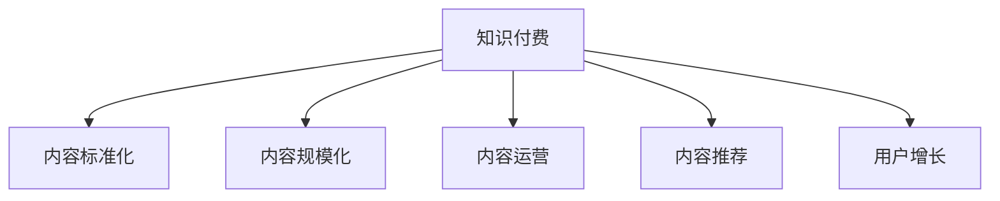

                 

# 知识付费创业中的内容标准化与规模化

> 关键词：知识付费, 内容标准化, 内容生产, 内容运营, 用户增长, 内容推荐

## 1. 背景介绍

### 1.1 问题由来
随着互联网的普及和知识经济的发展，知识付费已成为教育领域的新趋势。在线教育平台、知识分享社区、专业技能培训等，都在不断涌现。内容是知识付费的核心，但内容生产的标准化与规模化问题，也日益成为行业发展的瓶颈。

一方面，高质量内容的生产成本高，专业性强。许多高水平专家和学者，不愿花时间撰写普及型的文章，导致知识付费平台上的内容良莠不齐。另一方面，随着知识付费用户基数的扩大，内容规模的增长对内容运营能力提出了更高要求。如何高效产出和管理内容，成为创业公司面临的重大挑战。

## 2. 核心概念与联系

### 2.1 核心概念概述

为更好地理解知识付费创业中的内容标准化与规模化，本节将介绍几个密切相关的核心概念：

- 知识付费(Knowledge Pricing)：指用户为获取专业知识和经验，通过付费方式获取学习资源的商业模式。内容是知识付费的基础，如何生产高效益、高质量的内容，是平台发展的关键。

- 内容标准化(Content Standardization)：指制定统一的评价标准和生产规范，确保内容的质量和风格统一，提升用户体验。标准化能提升内容运营效率，降低人工审核成本。

- 内容规模化(Content Scalability)：指通过技术手段和流程优化，实现内容的快速生产和广泛分发，满足用户对知识增长的需求。规模化能支撑平台的高速发展，提升用户粘性和平台价值。

- 内容运营(Content Operation)：指通过精细化运营手段，提高内容的覆盖面和传播力，增强用户获取知识的便利性和有效性。运营是连接内容生产和用户需求的重要环节。

- 内容推荐(Content Recommendation)：指利用算法技术，根据用户兴趣和行为数据，智能推荐相关内容。推荐能提升内容的使用效率，增加用户的参与度和满意度。

- 用户增长(User Acquisition)：指通过市场推广、社群运营、课程优化等手段，吸引更多用户加入平台，形成良性循环。用户规模的扩大，为内容的规模化生产和运营提供保障。

这些核心概念之间的逻辑关系可以通过以下Mermaid流程图来展示：



这个流程图展示的知识付费创业中内容标准化与规模化的核心概念及其之间的关系：

1. 知识付费以内容为媒介，为内容标准化和规模化提供需求。
2. 内容标准化是提升内容质量、降低运营成本的关键。
3. 内容规模化是实现内容快速生产和广泛传播的保障。
4. 内容运营是连接内容生产与用户需求的桥梁，提高内容的传播力和用户粘性。
5. 内容推荐是提高内容使用效率和用户满意度的重要手段。
6. 用户增长为内容规模化生产和运营提供用户基础。

## 3. 核心算法原理 & 具体操作步骤
### 3.1 算法原理概述

知识付费创业中的内容标准化与规模化，本质上是内容生产的优化问题。其核心思想是：通过技术手段和流程优化，制定内容标准，提升内容质量和运营效率，实现内容生产的快速化和规模化。

形式化地，假设知识付费平台的内容集为 $C=\{c_i\}_{i=1}^N$，其中 $c_i$ 为内容对象。内容标准为 $S=\{s_j\}_{j=1}^M$，其中 $s_j$ 为评价指标。内容运营流程为 $O=\{o_k\}_{k=1}^K$，其中 $o_k$ 为运营步骤。内容推荐的模型为 $R$，用于根据用户行为数据推荐相关内容。

内容标准化与规模化的优化目标为：
$$
\min_{S,O,R} \max_{c \in C} \{ s_j(c) \}_{j=1}^M \text{  subject to  } \{ o_k \}_{k=1}^K
$$

其中，$S$ 和 $O$ 需通过技术手段和运营策略进行优化，以最大化评价指标 $s_j$，同时满足运营步骤 $o_k$ 的约束。$R$ 需通过算法模型进行优化，以提高推荐效果，增强用户对内容的利用率。

### 3.2 算法步骤详解

知识付费创业中的内容标准化与规模化，一般包括以下几个关键步骤：

**Step 1: 内容标准制定**
- 明确内容评价指标：如文章的原创性、准确性、易读性、互动性等，定义各指标的权重和评分标准。
- 制定内容风格规范：如文章长度、语言风格、标题设计等，确保内容风格一致。
- 设计内容审核流程：如内容初审、专家审核、用户反馈等，建立多层次审核机制。

**Step 2: 内容生产优化**
- 建立内容生产团队：根据内容类型和风格，建立专业化的内容生产团队，确保内容的专业性和一致性。
- 引入内容管理系统：通过CMS系统，实现内容编辑、版本控制、质量管理等，提高内容生产的效率和规范性。
- 设计内容协作工具：如协作编辑器、版本对比工具等，支持多人协同编辑，提高内容生产的协作性。

**Step 3: 内容运营策略**
- 建立用户画像模型：通过用户行为数据，建立用户兴趣和需求画像，为内容推荐提供依据。
- 制定内容推广策略：如SEO优化、社交媒体推广、KOL合作等，提高内容的曝光率和参与度。
- 设计内容分发渠道：如APP、网站、邮件、社交平台等，实现内容的广泛传播。

**Step 4: 内容推荐优化**
- 收集用户行为数据：如浏览记录、点击率、互动反馈等，用于训练推荐模型。
- 设计推荐算法模型：如协同过滤、内容基推荐、混合推荐等，提高推荐的个性化和精准度。
- 优化推荐模型参数：通过A/B测试、多臂老虎机等技术，优化模型参数，提升推荐效果。

**Step 5: 效果评估与迭代**
- 定义评估指标：如阅读量、互动率、转化率等，评估内容生产和运营的效果。
- 进行数据分析与监控：通过数据监控工具，实时监测内容表现，及时发现和解决问题。
- 持续优化和迭代：根据评估结果和用户反馈，不断优化内容标准、生产流程、运营策略和推荐模型，实现持续改进。

以上是知识付费创业中内容标准化与规模化的一般流程。在实际应用中，还需要根据具体平台的特点，对各个环节进行优化设计，如改进推荐算法、引入自动审核技术、引入更多用户互动等，以进一步提升内容运营效果。

### 3.3 算法优缺点

知识付费创业中的内容标准化与规模化方法具有以下优点：
1. 提升内容质量：通过制定统一标准，规范内容生产和审核流程，提升内容的专业性和一致性。
2. 降低运营成本：通过内容管理系统和协作工具，提高内容生产的效率，降低人工审核和校对成本。
3. 提高内容利用率：通过推荐算法和运营策略，提高内容的使用效率，增强用户粘性。
4. 增强用户满意度：通过个性化推荐和用户互动，提升用户的参与度和满意度。

同时，该方法也存在一定的局限性：
1. 对内容创作者的要求高：专业化的内容创作者难以找到，平台需投入大量资源进行培养。
2. 内容生产速度受限：复杂内容的生产周期长，难以快速满足用户需求。
3. 推荐模型依赖数据：推荐效果受限于用户行为数据的丰富性和质量。
4. 运营策略需不断调整：用户需求和市场环境变化快，运营策略需持续迭代和优化。
5. 需要持续投入技术资源：内容管理系统、协作工具、推荐算法等技术资源的维护成本较高。

尽管存在这些局限性，但就目前而言，内容标准化与规模化方法仍是知识付费平台发展的重要手段。未来相关研究的重点在于如何进一步降低内容生产成本，提高内容生产效率，同时兼顾内容质量和用户满意度的平衡。

### 3.4 算法应用领域

基于内容标准化与规模化的方法，在知识付费领域已经得到了广泛的应用，覆盖了几乎所有常见场景，例如：

- 在线课程：通过内容标准和课程评估，提升课程质量和用户满意度。
- 博客文章：通过内容管理系统和协作工具，快速生成和发布高质量文章。
- 技术分享：通过内容推荐和用户互动，提高分享内容的传播力和参与度。
- 职业技能培训：通过内容生产和运营策略，满足学员的实际需求，提高培训效果。
- 教育测评：通过内容标准化，实现教育测评的公正性和标准化，提升测评效果。
- 内容付费平台：通过内容生产和运营，实现内容变现，打造盈利模式。

除了上述这些经典场景外，内容标准化与规模化技术也被创新性地应用到更多场景中，如知识图谱构建、智能推荐系统、个性化学习推荐等，为知识付费平台带来新的突破。随着内容生产技术的不断进步，相信知识付费平台的内容标准化与规模化将取得更大的成效。

## 4. 数学模型和公式 & 详细讲解  
### 4.1 数学模型构建

本节将使用数学语言对知识付费创业中的内容标准化与规模化过程进行更加严格的刻画。

记知识付费平台的内容集为 $C=\{c_i\}_{i=1}^N$，其中 $c_i$ 为内容对象。内容标准为 $S=\{s_j\}_{j=1}^M$，其中 $s_j$ 为评价指标。内容运营流程为 $O=\{o_k\}_{k=1}^K$，其中 $o_k$ 为运营步骤。内容推荐的模型为 $R$，用于根据用户行为数据推荐相关内容。

内容标准化与规模化的优化目标为：
$$
\min_{S,O,R} \max_{c \in C} \{ s_j(c) \}_{j=1}^M \text{  subject to  } \{ o_k \}_{k=1}^K
$$

在实践中，我们通常使用基于梯度的优化算法（如SGD、Adam等）来近似求解上述最优化问题。设 $\eta$ 为学习率，$\lambda$ 为正则化系数，则参数的更新公式为：

$$
S \leftarrow S - \eta \nabla_{S}\mathcal{L}(S) - \eta\lambda S
$$
$$
O \leftarrow O - \eta \nabla_{O}\mathcal{L}(O) - \eta\lambda O
$$
$$
R \leftarrow R - \eta \nabla_{R}\mathcal{L}(R) - \eta\lambda R
$$

其中 $\nabla_{S}\mathcal{L}(S)$、$\nabla_{O}\mathcal{L}(O)$、$\nabla_{R}\mathcal{L}(R)$ 为损失函数对各参数的梯度，可通过反向传播算法高效计算。

### 4.2 公式推导过程

以下我们以内容推荐系统为例，推导协同过滤推荐算法的基本公式。

设用户 $u$ 对 $c_i$ 的评分记为 $r_{ui}$，初始化为随机值。协同过滤算法分为基于用户的矩阵分解和基于物品的矩阵分解两种形式，这里我们以基于用户的矩阵分解为例进行推导。

设用户 $u$ 的潜在因子为 $h_u \in \mathbb{R}^d$，物品 $c_i$ 的潜在因子为 $l_i \in \mathbb{R}^d$。协同过滤算法的目标是最小化预测评分与实际评分之间的均方误差：

$$
\min_{h_u,l_i} \sum_{u=1}^U \sum_{i=1}^N (r_{ui} - \langle h_u, l_i \rangle)^2
$$

其中 $\langle h_u, l_i \rangle$ 为内积，表示用户 $u$ 对物品 $c_i$ 的预测评分。

设 $H \in \mathbb{R}^{U \times d}$ 为用户的潜在因子矩阵，$L \in \mathbb{R}^{N \times d}$ 为物品的潜在因子矩阵。协同过滤算法的目标函数为：

$$
\mathcal{L}(H,L) = \frac{1}{2} \sum_{u=1}^U \sum_{i=1}^N (r_{ui} - \langle H_u, L_i \rangle)^2
$$

最小化目标函数，可得到潜在因子矩阵 $H$ 和 $L$ 的更新公式为：

$$
H \leftarrow H - \eta \nabla_{H}\mathcal{L}(H,L) - \eta\lambda H
$$
$$
L \leftarrow L - \eta \nabla_{L}\mathcal{L}(H,L) - \eta\lambda L
$$

其中 $\nabla_{H}\mathcal{L}(H,L)$、$\nabla_{L}\mathcal{L}(H,L)$ 为损失函数对潜在因子矩阵的梯度，可通过矩阵求导计算。

在得到损失函数的梯度后，即可带入参数更新公式，完成协同过滤算法的迭代优化。重复上述过程直至收敛，最终得到适合用户 $u$ 的推荐物品集合 $c_r$。

## 5. 项目实践：代码实例和详细解释说明
### 5.1 开发环境搭建

在进行内容标准化与规模化实践前，我们需要准备好开发环境。以下是使用Python进行TensorFlow开发的环境配置流程：

1. 安装Anaconda：从官网下载并安装Anaconda，用于创建独立的Python环境。

2. 创建并激活虚拟环境：
```bash
conda create -n tf-env python=3.8 
conda activate tf-env
```

3. 安装TensorFlow：根据CUDA版本，从官网获取对应的安装命令。例如：
```bash
conda install tensorflow=2.5
```

4. 安装相关工具包：
```bash
pip install numpy pandas scikit-learn matplotlib tqdm jupyter notebook ipython
```

完成上述步骤后，即可在`tf-env`环境中开始内容标准化与规模化实践。

### 5.2 源代码详细实现

下面我们以推荐系统为例，给出使用TensorFlow进行协同过滤推荐系统的PyTorch代码实现。

首先，定义协同过滤算法的核心参数和变量：

```python
import tensorflow as tf

# 定义协同过滤算法的参数
num_users = 1000  # 用户数
num_items = 1000  # 物品数
dim = 10  # 潜在因子维度
learning_rate = 0.01  # 学习率
reg_lambda = 0.01  # 正则化系数

# 定义协同过滤算法的变量
H = tf.Variable(tf.random.normal([num_users, dim]))
L = tf.Variable(tf.random.normal([num_items, dim]))
```

然后，定义协同过滤算法的目标函数和损失函数：

```python
# 定义协同过滤算法的目标函数
def collab_filter_loss(h, l):
    user_num = tf.shape(H)[0]
    item_num = tf.shape(L)[0]
    
    # 定义评分矩阵R
    R = tf.matmul(H, l, transpose_b=True)
    
    # 计算预测评分与实际评分之间的均方误差
    error = tf.reduce_mean(tf.square(R - tf.constant(tf.random.normal([num_users, num_items])))
    
    # 定义正则化项
    reg = tf.reduce_sum(tf.square(H)) + tf.reduce_sum(tf.square(l))
    
    # 返回损失函数
    return error + reg_lambda * reg

# 计算目标函数值
loss = collab_filter_loss(H, L)
```

接着，定义协同过滤算法的训练函数：

```python
# 定义协同过滤算法的训练函数
def collab_filter_train(h, l, num_epochs):
    optimizer = tf.optimizers.Adam(learning_rate=learning_rate)
    
    for epoch in range(num_epochs):
        with tf.GradientTape() as tape:
            loss_value = loss(h, l)
        
        # 计算梯度
        grads = tape.gradient(loss_value, [H, L])
        
        # 更新参数
        optimizer.apply_gradients(zip(grads, [H, L]))
        
        # 打印当前损失值
        print(f'Epoch {epoch+1}, loss={loss_value.numpy():.4f}')

# 训练协同过滤算法
collab_filter_train(H, L, num_epochs=100)
```

最后，定义协同过滤算法的推荐函数：

```python
# 定义协同过滤算法的推荐函数
def collab_filter_recommend(u, num_recommend_items):
    # 计算用户u对物品的评分
    user_score = tf.matmul(H, l, transpose_b=True)
    
    # 对评分矩阵进行归一化处理
    user_score = user_score / tf.reduce_sum(tf.square(user_score))
    
    # 选取前num_recommend_items个评分最高的物品进行推荐
    top_items = tf.argsort(user_score, axis=1)[:, -num_recommend_items:]
    
    return top_items.numpy()
```

以上就是使用TensorFlow进行协同过滤推荐系统的完整代码实现。可以看到，借助TensorFlow的高效矩阵运算能力，协同过滤推荐系统的实现相对简单。

### 5.3 代码解读与分析

让我们再详细解读一下关键代码的实现细节：

**协同过滤算法参数**：
- `num_users` 和 `num_items` 分别表示用户数和物品数，用于构建评分矩阵 $R$。
- `dim` 表示潜在因子维度，决定了用户和物品的潜在因子矩阵的大小。
- `learning_rate` 和 `reg_lambda` 分别表示学习率和正则化系数，用于控制算法训练过程的收敛速度和稳定性。

**协同过滤算法的目标函数**：
- 通过矩阵乘法计算预测评分 $R$，并计算预测评分与实际评分之间的均方误差 $error$。
- 通过正则化项 $reg$ 对用户和物品的潜在因子矩阵进行约束，避免过拟合。
- 将 $error$ 和 $reg$ 相加，得到损失函数 $\mathcal{L}$。

**协同过滤算法的训练函数**：
- 使用Adam优化器进行参数更新，并记录每个epoch的损失值。
- 通过反向传播算法计算梯度，并使用 `optimizer.apply_gradients` 函数更新参数。
- 每轮训练后打印当前损失值，用于监测算法收敛情况。

**协同过滤算法的推荐函数**：
- 使用用户 $u$ 的潜在因子矩阵 $H$ 和物品的潜在因子矩阵 $L$，计算用户 $u$ 对物品的评分。
- 对评分矩阵进行归一化处理，将评分转化为概率分布。
- 选取评分最高的 $num_recommend_items$ 个物品进行推荐。

可以看到，TensorFlow提供了强大的矩阵运算和优化器支持，使得协同过滤推荐系统的实现变得高效简洁。开发者可以专注于算法设计，而不必过多关注底层的计算细节。

当然，工业级的系统实现还需考虑更多因素，如模型保存和部署、超参数自动搜索、多用户并行训练等。但核心的推荐范式基本与此类似。

## 6. 实际应用场景
### 6.1 内容推荐平台

内容推荐是知识付费平台的重要功能之一。用户通过推荐算法，可以发现更多高质量内容，提高学习效率。推荐算法不仅能提升内容的使用率，还能降低平台运营成本，增强用户粘性。

推荐算法可应用于个性化推荐、热门内容推荐、相关内容推荐等场景。通过收集用户行为数据，如浏览记录、点击率、互动反馈等，训练协同过滤、内容基推荐、混合推荐等算法模型，为不同用户推荐个性化内容。平台可根据用户画像模型和行为数据，动态调整推荐策略，提高推荐效果。

### 6.2 课程推荐系统

在线课程推荐是知识付费平台的重要应用。用户通过课程推荐系统，可以找到感兴趣的课程，提升学习体验。推荐算法可应用于课程推荐、新课推荐、个性化课程推荐等场景。通过收集用户学习行为数据，如课程完成率、学习时长、课程评分等，训练协同过滤、内容基推荐、混合推荐等算法模型，为不同用户推荐个性化课程。平台可根据用户画像模型和行为数据，动态调整推荐策略，提高课程推荐效果。

### 6.3 书籍推荐系统

在线书籍推荐是知识付费平台的另一重要应用。用户通过书籍推荐系统，可以找到感兴趣的书籍，丰富知识结构。推荐算法可应用于书籍推荐、新书推荐、个性化书籍推荐等场景。通过收集用户阅读行为数据，如阅读记录、阅读时长、书籍评分等，训练协同过滤、内容基推荐、混合推荐等算法模型，为不同用户推荐个性化书籍。平台可根据用户画像模型和行为数据，动态调整推荐策略，提高书籍推荐效果。

### 6.4 未来应用展望

随着知识付费平台的不断成熟，内容标准化与规模化技术将发挥越来越重要的作用。

在智慧城市治理中，内容标准化与规模化技术可用于智能舆情分析、公共服务推荐、在线教育等场景，构建智慧城市治理的新模式。

在文化创意产业中，内容标准化与规模化技术可用于内容创作、版权管理、智能编辑等环节，提升文化创意产业的创新能力。

在教育科技中，内容标准化与规模化技术可用于在线教育、虚拟教室、智慧课堂等场景，推动教育科技的快速发展。

此外，内容标准化与规模化技术也将广泛应用于金融、医疗、娱乐、旅游等多个领域，为各行各业带来智能化、数字化的新突破。随着技术的不断进步，内容标准化与规模化技术将进一步提升知识付费平台的服务质量和用户粘性，推动知识付费行业的可持续发展。

## 7. 工具和资源推荐
### 7.1 学习资源推荐

为了帮助开发者系统掌握内容标准化与规模化技术，这里推荐一些优质的学习资源：

1. 《深度学习与推荐系统》系列课程：斯坦福大学和DeepLearning.AI合作开设的推荐系统课程，深入浅出地介绍了推荐系统的理论基础和实现技术。

2. CS231n《深度学习与计算机视觉》课程：斯坦福大学开设的深度学习课程，涵盖推荐系统、内容基推荐等内容，适合深度学习初学者。

3. 《推荐系统实战》书籍：推荐系统领域知名专家撰写，介绍了推荐系统的核心算法和工程实践，适合实战学习和项目开发。

4. 《内容推荐算法》博客：内容推荐领域的专家博客，详细介绍了协同过滤、内容基推荐、混合推荐等算法的原理和实现。

5. Kaggle推荐系统竞赛：Kaggle上丰富的推荐系统竞赛，提供大量数据和竞赛环境，适合实践和提高。

通过对这些资源的学习实践，相信你一定能够快速掌握内容标准化与规模化的精髓，并用于解决实际的内容推荐问题。
### 7.2 开发工具推荐

高效的开发离不开优秀的工具支持。以下是几款用于内容推荐开发的常用工具：

1. TensorFlow：由Google主导开发的深度学习框架，支持分布式训练和高效的矩阵运算，适合大规模推荐系统的开发。

2. PyTorch：由Facebook主导开发的深度学习框架，支持动态图和静态图，适合灵活的模型设计和实验。

3. Jupyter Notebook：基于IPython的交互式编程环境，支持代码的交互式调试和展示，适合快速迭代开发。

4. Weights & Biases：模型训练的实验跟踪工具，可以记录和可视化模型训练过程中的各项指标，方便对比和调优。与主流深度学习框架无缝集成。

5. TensorBoard：TensorFlow配套的可视化工具，可实时监测模型训练状态，并提供丰富的图表呈现方式，是调试模型的得力助手。

6. PyTorch Lightning：基于PyTorch的深度学习框架，提供便捷的模型构建和调优功能，适合快速原型开发。

合理利用这些工具，可以显著提升内容推荐系统的开发效率，加快创新迭代的步伐。

### 7.3 相关论文推荐

内容标准化与规模化技术的发展源于学界的持续研究。以下是几篇奠基性的相关论文，推荐阅读：

1. The Bell-Karabashic Algorithm for Estimating Missing Values：提出基于矩阵分解的协同过滤算法，为推荐系统奠定了基础。

2. Collaborative Filtering for Implicit Feedback Datasets：提出协同过滤算法的基本原理，并对比分析了多种推荐算法。

3. Content-Based Recommendation Algorithms for eCommerce Platforms：介绍内容基推荐算法，并分析其在电商平台的实际应用效果。

4. Learning from Sparse Data with Cross-Entropy：介绍混合推荐算法的基本原理，并分析其在推荐系统中的效果。

5. Matrix Factorization Techniques for Recommender Systems：总结了矩阵分解推荐算法的发展，分析了各种算法在推荐系统中的应用。

这些论文代表了大语言模型微调技术的发展脉络。通过学习这些前沿成果，可以帮助研究者把握学科前进方向，激发更多的创新灵感。

## 8. 总结：未来发展趋势与挑战

### 8.1 总结

本文对知识付费创业中的内容标准化与规模化方法进行了全面系统的介绍。首先阐述了知识付费创业对内容标准化与规模化技术的需求，明确了内容标准化与规模化在提升内容质量、降低运营成本、提高内容利用率等方面的独特价值。其次，从原理到实践，详细讲解了内容标准化与规模化的数学原理和关键步骤，给出了内容推荐系统的完整代码实现。同时，本文还广泛探讨了内容标准化与规模化技术在内容推荐、课程推荐、书籍推荐等多个行业领域的应用前景，展示了内容标准化与规模化技术的巨大潜力。最后，本文精选了内容标准化与规模化技术的各类学习资源，力求为开发者提供全方位的技术指引。

通过本文的系统梳理，可以看到，内容标准化与规模化技术是知识付费平台发展的重要保障。这些技术的合理应用，能够显著提升内容运营效率，降低运营成本，增强用户粘性，推动知识付费平台向更高的水平发展。未来，伴随内容标准化与规模化技术的不断进步，知识付费平台的内容运营将更加高效、智能化，用户的学习体验将得到进一步提升。

### 8.2 未来发展趋势

展望未来，内容标准化与规模化技术将呈现以下几个发展趋势：

1. 深度学习模型的广泛应用。随着深度学习技术的发展，更多复杂的推荐模型将被应用于知识付费平台，如深度学习、迁移学习、生成对抗网络等，提高推荐的准确性和个性化水平。

2. 多模态数据的融合。未来的推荐系统将融合视觉、语音、文本等多种模态的数据，提供更加全面和准确的内容推荐。

3. 实时推荐系统的构建。实时推荐系统能够根据用户即时行为数据，进行动态推荐，提高推荐的及时性和效果。

4. 冷启动问题的解决。冷启动问题是指新用户或新物品缺乏历史行为数据，难以进行推荐。未来的推荐系统将引入更多方法，如基于上下文推荐、隐式反馈挖掘等，解决冷启动问题。

5. 推荐系统的解释性和可解释性。推荐系统需要提高其透明度，解释其推荐理由，增强用户的信任度和满意度。

6. 推荐系统的公平性和公正性。推荐系统需要避免偏见和歧视，确保内容的公平性和公正性，保护用户隐私和权益。

以上趋势凸显了内容标准化与规模化技术的广阔前景。这些方向的探索发展，必将进一步提升知识付费平台的内容运营效率，提高用户的学习体验，推动知识付费行业的创新和进步。

### 8.3 面临的挑战

尽管内容标准化与规模化技术已经取得了显著成效，但在迈向更加智能化、普适化应用的过程中，它仍面临诸多挑战：

1. 数据隐私保护。推荐系统需要收集大量用户行为数据，如何保护用户隐私和数据安全，是亟需解决的问题。

2. 算法偏见和歧视。推荐系统可能会因数据偏见、模型选择等原因，产生不公平的推荐结果，如何消除偏见和歧视，是推荐系统面临的重要挑战。

3. 内容质量管理。推荐系统需要确保推荐内容的质量和多样性，避免推荐低质量、低信度的内容，如何高效管理和监控内容质量，是内容推荐平台的关键。

4. 推荐系统的鲁棒性。推荐系统需要在复杂、变化的环境中保持稳定，如何提高推荐系统的鲁棒性和可靠性，是亟需解决的问题。

5. 推荐算法的复杂度。复杂的推荐算法虽然效果更好，但实现难度大、计算成本高，如何平衡算法效果和实现复杂度，是推荐系统需要考虑的问题。

6. 推荐系统与业务目标的融合。推荐系统需要与业务目标相结合，提供有针对性的推荐服务，如何提高推荐系统的业务价值，是推荐系统需要解决的问题。

这些挑战需要学界和产业界共同努力，探索新的技术手段和优化策略，以进一步提升内容推荐的效果和质量。

### 8.4 研究展望

面向未来，内容标准化与规模化技术的研究需要在以下几个方面寻求新的突破：

1. 探索无监督推荐算法。摆脱对大量标注数据的依赖，利用无监督学习技术，如半监督学习、聚类等，提升推荐系统的可解释性和可扩展性。

2. 研究多模态推荐技术。将视觉、语音、文本等多种模态的数据进行融合，提供更加全面和准确的推荐结果。

3. 引入多层次推荐系统。构建多层次推荐体系，如兴趣-行为-社交推荐，提高推荐系统的深度和广度。

4. 结合专家知识。将专家知识与推荐算法结合，提高推荐系统的知识融合能力和智能化水平。

5. 引入动态推荐策略。根据用户行为数据，动态调整推荐策略，提高推荐的及时性和个性化水平。

6. 构建推荐系统的解释模型。建立推荐系统的解释模型，提高推荐的透明度和可解释性，增强用户信任度。

这些研究方向将引领内容标准化与规模化技术迈向更高的台阶，为知识付费平台带来新的突破。通过深入研究这些技术，我们可以构建更加智能、高效、公平的推荐系统，提升用户的学习体验，推动知识付费平台的可持续发展。

## 9. 附录：常见问题与解答

**Q1：内容标准化与规模化技术能否应用到所有知识付费平台？**

A: 内容标准化与规模化技术适用于大多数知识付费平台，尤其是在用户规模较大、内容生产需求强烈的情况下，能显著提升运营效率和用户体验。但不同平台的运营模式和用户需求存在差异，需要在标准化与规模化的基础上进行适当的调整和优化。

**Q2：内容标准化与规模化技术能否应对多模态数据的应用需求？**

A: 内容标准化与规模化技术目前主要应用于文本数据，对于多模态数据的应用需求，如图片、视频、语音等，需要结合不同模态的数据特点进行单独处理。可以探索基于深度学习的多模态推荐技术，提高推荐系统的泛化能力和智能化水平。

**Q3：内容标准化与规模化技术能否解决冷启动问题？**

A: 内容标准化与规模化技术可以通过引入多层次推荐系统、基于上下文的推荐策略等方法，一定程度上缓解冷启动问题。但完全解决冷启动问题还需更多创新性的技术手段，如基于协同过滤的初始推荐策略、基于用户画像的推荐模型等。

**Q4：内容标准化与规模化技术能否保证推荐系统的公平性和公正性？**

A: 内容标准化与规模化技术需要结合多层次推荐策略、知识融合技术、专家知识图谱等手段，消除推荐系统中的偏见和歧视，确保内容的公平性和公正性。同时，需建立严格的推荐算法审查机制，定期评估推荐系统的公平性。

**Q5：内容标准化与规模化技术能否实现实时推荐？**

A: 内容标准化与规模化技术可以通过构建实时推荐系统，结合用户即时行为数据进行动态推荐。但实时推荐系统需要高效的数据处理和算法计算能力，适用于数据量较大、实时性要求较高的场景。

正视内容标准化与规模化技术面临的这些挑战，积极应对并寻求突破，将是大语言模型微调走向成熟的必由之路。相信随着学界和产业界的共同努力，这些挑战终将一一被克服，内容标准化与规模化技术必将在构建人机协同的智能时代中扮演越来越重要的角色。面向未来，内容标准化与规模化技术还需要与其他人工智能技术进行更深入的融合，如知识表示、因果推理、强化学习等，多路径协同发力，共同推动自然语言理解和智能交互系统的进步。只有勇于创新、敢于突破，才能不断拓展内容推荐的边界，让智能技术更好地造福人类社会。

