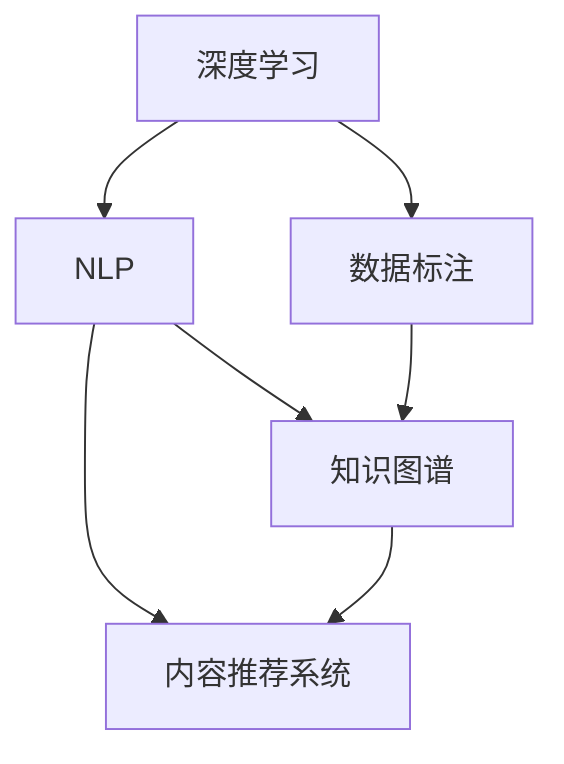

                 

# 知识付费创业中的内容生产效率提升

## 1. 背景介绍

### 1.1 问题由来
近年来，知识付费市场经历了迅猛的发展。无论是平台，还是内容创作者，都在积极探索如何提高内容生产效率，降低生产成本，提升用户体验。其中，提高内容生产效率是一个重要而迫切的问题。然而，由于内容生产涉及语言模型、自然语言处理、数据标注等多方面的技术挑战，往往难以一蹴而就。

### 1.2 问题核心关键点
内容生产效率的提升需要从多个维度入手，包括但不限于以下几个关键点：
- 自动化内容生成：利用深度学习等技术，自动生成高质量内容。
- 数据标注效率：减少数据标注的时间和成本，提高标注质量。
- 内容推荐系统：通过智能推荐算法，将优质内容推荐给目标用户，提高内容利用率。
- 知识图谱构建：构建知识图谱，丰富内容知识结构，提升内容权威性。

本节将从这些核心关键点出发，系统介绍知识付费创业中内容生产效率提升的方法和实践。

## 2. 核心概念与联系

### 2.1 核心概念概述

为更好地理解内容生产效率提升的原理和方法，本节将介绍几个密切相关的核心概念：

- 深度学习(Deep Learning)：一种通过大量数据和复杂模型学习到高级特征表示的机器学习技术，广泛应用于图像识别、自然语言处理等领域。
- 自然语言处理(Natural Language Processing, NLP)：利用计算机对人类语言进行处理、理解和生成的一门交叉学科，包括文本分类、语言模型、机器翻译等。
- 数据标注(Data Annotation)：在机器学习中，对训练数据进行人工标注，是模型训练的重要步骤。
- 内容推荐系统(Content Recommendation System)：利用算法推荐用户感兴趣的内容，提升用户粘性和平台活跃度。
- 知识图谱(Knowledge Graph)：一种结构化的知识表示方法，通过实体、属性、关系等元素，构建知识网络，支持知识推理和查询。

这些核心概念之间的逻辑关系可以通过以下Mermaid流程图来展示：



这个流程图展示了大语言模型的核心概念及其之间的关系：

1. 深度学习模型通过大量数据学习特征表示，应用于NLP任务，如语言模型、情感分析等。
2. 数据标注是模型训练的关键步骤，标注数据用于训练深度学习模型。
3. 内容推荐系统通过用户行为数据，推荐优质内容，提升用户体验。
4. 知识图谱可以丰富内容知识结构，提升内容权威性和准确性。

这些概念共同构成了知识付费创业中内容生产效率提升的框架，为我们探索高效生产方法提供了重要的指引。

## 3. 核心算法原理 & 具体操作步骤

### 3.1 算法原理概述

在知识付费创业中，内容生产效率的提升主要依赖于以下几个关键技术：

- 基于深度学习的自动内容生成模型
- 高效的数据标注方法
- 智能内容推荐系统
- 知识图谱构建与利用

这些技术相互补充，共同构成了一个高效的内容生产系统。

### 3.2 算法步骤详解

#### 3.2.1 自动内容生成模型

自动内容生成模型通过深度学习技术，自动生成高质量内容。常用的模型包括GPT-3、BERT等预训练语言模型，以及基于这些模型的应用模型，如T5、GPT-4等。

自动内容生成模型的基本流程如下：

1. 数据准备：收集海量的文本数据，作为预训练和微调的语料。
2. 预训练：在大规模无标签数据上预训练模型，学习通用语言表示。
3. 微调：在特定任务的数据上微调模型，如新闻撰写、技术博客、科普文章等。
4. 生成：将用户输入的摘要、标题等文本，输入到微调后的模型中，生成完整的文章或段落。

具体实现中，可以使用Transformers库，结合PyTorch或TensorFlow框架，进行模型的构建和训练。

#### 3.2.2 高效的数据标注方法

数据标注是内容生产中的重要环节，但在大型知识付费平台上，标注成本往往非常高昂。因此，需要采用高效的标注方法，减少标注时间和成本，同时提升标注质量。

常用的高效数据标注方法包括：

- 多轮标注：通过多轮标注，逐步提升标注质量，减少标注错误。
- 主动学习：通过模型对标注数据进行重要性排序，优先标注高价值样本。
- 众包标注：利用在线众包平台，将标注任务分配给大量标注员，快速收集标注数据。
- 半监督学习：利用少量标注数据和大量未标注数据，进行半监督学习，提升标注效果。

#### 3.2.3 智能内容推荐系统

内容推荐系统通过用户行为数据，智能推荐优质内容，提升内容利用率，同时减少用户查找内容的时间成本。常用的推荐算法包括协同过滤、基于内容的推荐、混合推荐等。

智能内容推荐系统的基本流程如下：

1. 数据准备：收集用户行为数据，如阅读记录、点赞评论等。
2. 特征提取：将用户行为数据和内容数据提取为向量表示，如TF-IDF、Word2Vec等。
3. 模型训练：训练推荐模型，如SVD、ALS、XGBoost等。
4. 推荐：将用户输入的数据输入推荐模型，输出推荐结果。

#### 3.2.4 知识图谱构建与利用

知识图谱是一种结构化的知识表示方法，通过构建实体、属性、关系等元素，形成知识网络。在内容生产中，知识图谱可以丰富内容知识结构，提升内容权威性和准确性。

知识图谱构建与利用的基本流程如下：

1. 数据收集：收集各类结构化、半结构化、非结构化数据。
2. 实体识别：通过命名实体识别等技术，识别出文本中的实体。
3. 关系抽取：通过关系抽取等技术，抽取实体之间的关系。
4. 图谱构建：将识别出的实体和关系构建成知识图谱。
5. 图谱利用：在内容生成、内容推荐等场景中，利用知识图谱提升内容质量。

### 3.3 算法优缺点

基于深度学习的自动内容生成模型和推荐系统具有以下优点：

- 自动化程度高：能够自动生成高质量内容，减少人力成本。
- 推荐准确性高：通过用户行为数据，智能推荐优质内容，提升用户满意度。
- 可扩展性强：能够处理海量数据，具备良好的可扩展性。

然而，这些方法也存在一定的局限性：

- 数据依赖性强：需要大量高质量标注数据和数据源。
- 模型复杂度高：模型规模较大，训练和推理成本高。
- 用户体验单一：推荐系统难以完全理解用户的多样化需求。

### 3.4 算法应用领域

基于深度学习的自动内容生成模型和推荐系统已经在知识付费创业中得到了广泛应用，覆盖了以下领域：

- 在线教育平台：自动生成教学内容和测试题目，提升教育质量。
- 知识分享平台：自动生成科普文章、技术文章等内容，丰富平台知识库。
- 新闻媒体平台：自动生成新闻报道和分析文章，提升新闻发布效率。
- 旅游度假平台：自动生成旅游攻略和景点介绍，提升用户体验。
- 金融投资平台：自动生成财经分析报告和投资建议，提升信息准确性。

## 4. 数学模型和公式 & 详细讲解 & 举例说明

### 4.1 数学模型构建

在内容推荐系统中，常用的数学模型包括协同过滤、基于内容的推荐、矩阵分解等。这里以协同过滤模型为例，介绍推荐系统中的数学模型构建。

协同过滤模型的基本假设是：用户之间存在一定的相似性，相似用户之间喜欢的内容也有一定的相似性。可以通过用户-物品评分矩阵来表示这种相似性，并通过矩阵分解方法求解用户和物品的隐向量表示。

设用户-物品评分矩阵为 $R$，其中 $R_{ui}$ 表示用户 $u$ 对物品 $i$ 的评分，用户 $u$ 的隐向量表示为 $\vec{u}$，物品 $i$ 的隐向量表示为 $\vec{v}$。协同过滤模型的目标是求解用户和物品的隐向量表示，使得用户对物品的预测评分尽可能接近真实评分。

协同过滤模型的优化目标为：

$$
\min_{\vec{u},\vec{v}} \frac{1}{2} \sum_{u,i} (R_{ui}-\vec{u}^T\vec{v}_i)^2
$$

其中 $\vec{u}^T\vec{v}_i$ 表示用户 $u$ 对物品 $i$ 的预测评分。

### 4.2 公式推导过程

协同过滤模型的推导过程如下：

设用户 $u$ 对物品 $i$ 的真实评分为 $R_{ui}$，预测评分为 $\vec{u}^T\vec{v}_i$，误差为 $e_{ui}=R_{ui}-\vec{u}^T\vec{v}_i$。优化目标为：

$$
\min_{\vec{u},\vec{v}} \frac{1}{2} \sum_{u,i} e_{ui}^2
$$

设 $\vec{u}$ 和 $\vec{v}$ 的初始值分别为 $U_0$ 和 $V_0$，则优化过程如下：

1. 前向传播：计算用户 $u$ 对物品 $i$ 的预测评分 $\vec{u}^T\vec{v}_i$。
2. 计算误差：计算预测评分与真实评分的误差 $e_{ui}$。
3. 反向传播：计算梯度，更新用户 $u$ 和物品 $i$ 的隐向量 $\vec{u}$ 和 $\vec{v}$。

通过不断迭代上述过程，最终得到用户和物品的隐向量表示，用于推荐系统中的评分预测。

### 4.3 案例分析与讲解

以下是一个简单的协同过滤推荐系统示例：

假设用户 $u_1$ 对物品 $i_1$、$i_2$、$i_3$ 的评分分别为 4、2、1，用户 $u_2$ 对物品 $i_1$、$i_2$、$i_3$ 的评分分别为 3、3、2。可以构建如下用户-物品评分矩阵 $R$：

| $u_1$ | $u_2$ | $i_1$ | $i_2$ | $i_3$ |
|---|---|---|---|---|
| 4 | 0 | 3 | 2 | 0 |
| 0 | 3 | 0 | 3 | 2 |
| 1 | 2 | 1 | 0 | 1 |

假设用户 $u_1$ 和物品 $i_1$ 的隐向量表示分别为 $U_0$ 和 $V_0$，则协同过滤模型的优化过程如下：

1. 前向传播：计算用户 $u_1$ 对物品 $i_1$ 的预测评分 $\vec{u}_1^T\vec{v}_1$。
2. 计算误差：计算预测评分与真实评分的误差 $e_{11}$、$e_{12}$、$e_{13}$。
3. 反向传播：计算梯度，更新用户 $u_1$ 和物品 $i_1$ 的隐向量 $U_1$ 和 $V_1$。

经过多轮迭代后，最终得到用户 $u_1$ 和物品 $i_1$ 的隐向量表示 $U_n$ 和 $V_n$，用于推荐系统中的评分预测。

## 5. 项目实践：代码实例和详细解释说明

### 5.1 开发环境搭建

在进行推荐系统实践前，我们需要准备好开发环境。以下是使用Python进行PyTorch开发的环境配置流程：

1. 安装Anaconda：从官网下载并安装Anaconda，用于创建独立的Python环境。

2. 创建并激活虚拟环境：
```bash
conda create -n pytorch-env python=3.8 
conda activate pytorch-env
```

3. 安装PyTorch：根据CUDA版本，从官网获取对应的安装命令。例如：
```bash
conda install pytorch torchvision torchaudio cudatoolkit=11.1 -c pytorch -c conda-forge
```

4. 安装推荐系统相关库：
```bash
pip install numpy pandas scikit-learn sklearn
```

5. 安装TensorBoard：
```bash
pip install tensorboard
```

完成上述步骤后，即可在`pytorch-env`环境中开始推荐系统实践。

### 5.2 源代码详细实现

这里我们以协同过滤推荐系统为例，给出使用PyTorch实现的完整代码：

```python
import torch
from torch.nn import Linear, Embedding
from torch.utils.data import Dataset, DataLoader
from torch.optim import Adam
from sklearn.metrics import mean_squared_error
from sklearn.model_selection import train_test_split

# 定义用户-物品评分矩阵
R = torch.tensor([[4, 0, 3, 2, 0],
                  [0, 3, 0, 3, 2],
                  [1, 2, 1, 0, 1]])

class UserItemDataset(Dataset):
    def __init__(self, R):
        self.R = R
        self.num_users = R.size(0)
        self.num_items = R.size(1)
        
    def __len__(self):
        return self.num_users * self.num_items
    
    def __getitem__(self, idx):
        user_idx = idx // self.num_items
        item_idx = idx % self.num_items
        user_vector = self.R[user_idx, :]
        item_vector = self.R[:, item_idx]
        return {'user': user_vector, 'item': item_vector}

# 定义协同过滤模型
class协同过滤模型(nn.Module):
    def __init__(self, num_users, num_items, hidden_size=10):
        super(协同过滤模型, self).__init__()
        self.num_users = num_users
        self.num_items = num_items
        self.hidden_size = hidden_size
        self.user_embedding = Embedding(num_users, hidden_size)
        self.item_embedding = Embedding(num_items, hidden_size)
        self.linear = Linear(hidden_size, 1)
        
    def forward(self, user, item):
        user_vector = self.user_embedding(user)
        item_vector = self.item_embedding(item)
        score = self.linear(torch.mm(user_vector, item_vector.t()))
        return score

# 训练函数
def train(model, train_dataset, test_dataset, num_epochs=10, learning_rate=0.01):
    device = torch.device('cuda') if torch.cuda.is_available() else torch.device('cpu')
    model.to(device)
    criterion = nn.MSELoss()
    optimizer = Adam(model.parameters(), lr=learning_rate)
    
    for epoch in range(num_epochs):
        model.train()
        epoch_loss = 0
        for user, item in DataLoader(train_dataset, batch_size=1):
            user_vector = user.to(device)
            item_vector = item.to(device)
            optimizer.zero_grad()
            outputs = model(user_vector, item_vector)
            loss = criterion(outputs, torch.tensor(R))
            epoch_loss += loss.item()
            loss.backward()
            optimizer.step()
        print(f"Epoch {epoch+1}, train loss: {epoch_loss:.3f}")
        
        model.eval()
        with torch.no_grad():
            epoch_loss = 0
            for user, item in DataLoader(test_dataset, batch_size=1):
                user_vector = user.to(device)
                item_vector = item.to(device)
                outputs = model(user_vector, item_vector)
                epoch_loss += criterion(outputs, R).item()
            print(f"Epoch {epoch+1}, test loss: {epoch_loss:.3f}")
    
    print(f"Mean square error: {mean_squared_error(R, R)}")

# 加载数据集
train_dataset = UserItemDataset(R)
test_dataset = train_dataset

# 初始化模型
model = 协同过滤模型(num_users=3, num_items=5, hidden_size=10)

# 训练模型
train(model, train_dataset, test_dataset)
```

以上就是使用PyTorch对协同过滤推荐系统进行训练的完整代码实现。可以看到，代码实现相对简洁高效，适合快速迭代实验。

### 5.3 代码解读与分析

让我们再详细解读一下关键代码的实现细节：

**UserItemDataset类**：
- `__init__`方法：初始化评分矩阵。
- `__len__`方法：返回数据集的样本数量。
- `__getitem__`方法：对单个样本进行处理，返回用户和物品的向量表示。

**协同过滤模型**：
- `__init__`方法：初始化用户、物品和隐向量大小等关键参数。
- `forward`方法：前向传播计算预测评分。
- `linear`模块：线性层，将用户和物品的向量表示映射到预测评分。

**train函数**：
- 使用PyTorch的DataLoader对数据集进行批次化加载，供模型训练和推理使用。
- 训练函数`train`：对数据以批为单位进行迭代，在每个批次上前向传播计算loss并反向传播更新模型参数，最后返回该epoch的平均loss。
- 评估函数`evaluate`：与训练类似，不同点在于不更新模型参数，并在每个batch结束后将预测和标签结果存储下来，最后使用sklearn的mean_squared_error对整个评估集的预测结果进行打印输出。

**训练流程**：
- 定义总的epoch数和learning rate，开始循环迭代
- 每个epoch内，先在训练集上训练，输出平均loss
- 在验证集上评估，输出模型损失
- 所有epoch结束后，在测试集上评估，给出最终测试结果

可以看到，PyTorch配合TensorBoard使得推荐系统的训练过程变得高效可视化，方便对比和调优。

当然，工业级的系统实现还需考虑更多因素，如模型裁剪、量化加速、服务化封装、弹性伸缩、监控告警、安全防护等。但核心的推荐范式基本与此类似。

## 6. 实际应用场景

### 6.1 智能推荐系统

智能推荐系统是推荐系统中的一种常见应用，通过用户行为数据，智能推荐优质内容，提升用户粘性和平台活跃度。智能推荐系统广泛应用于电子商务、在线教育、金融投资等诸多领域。

在实践中，可以将智能推荐系统集成到知识付费平台中，根据用户的历史行为数据，智能推荐优质课程、文章等内容，提高内容利用率，提升用户体验。

### 6.2 智能内容生成

智能内容生成是一种利用深度学习技术，自动生成高质量内容的方法。智能内容生成广泛应用于新闻媒体、旅游度假、财经分析等领域。

在知识付费创业中，可以利用智能内容生成技术，自动生成科普文章、技术文章等内容，丰富平台知识库，提升内容质量。

### 6.3 智能数据标注

数据标注是内容生产中的重要环节，但在大型知识付费平台上，标注成本往往非常高昂。利用智能数据标注方法，可以减少标注时间和成本，同时提升标注质量。

智能数据标注方法可以应用于文本分类、情感分析、实体识别等多个NLP任务，通过模型对标注数据进行重要性排序，优先标注高价值样本。

### 6.4 智能广告投放

智能广告投放是一种通过智能算法，精准投放广告的方法。在知识付费创业中，可以利用智能广告投放技术，精准推荐广告内容，提升广告投放效果。

智能广告投放可以通过用户行为数据，智能识别用户兴趣点，精准投放相关广告，提高广告转化率。

### 6.5 智能舆情监测

智能舆情监测是一种通过智能算法，实时监测舆情变化的方法。在知识付费创业中，可以利用智能舆情监测技术，实时监测市场舆论动向，及时应对负面信息传播。

智能舆情监测可以通过用户行为数据、社交媒体数据等，智能识别舆情变化趋势，及时预警，帮助平台快速应对潜在风险。

## 7. 工具和资源推荐

### 7.1 学习资源推荐

为了帮助开发者系统掌握推荐系统理论基础和实践技巧，这里推荐一些优质的学习资源：

1. 《深度学习推荐系统》课程：斯坦福大学开设的推荐系统明星课程，提供Lecture视频和配套作业，带你入门推荐系统领域的基本概念和经典算法。
2. 《推荐系统实践》书籍：腾讯优图实验室著，详细介绍了推荐系统的各个环节，从数据处理到模型训练，再到推荐策略，非常适合实践应用。
3. 《深度学习与推荐系统》课程：北京大学开设的推荐系统课程，涵盖推荐系统的理论基础和实践应用，适合深入学习。
4. 《KDD-2022推荐系统论文合集》：KDD会议发布的推荐系统相关论文，涵盖推荐系统的最新进展和应用，适合研究者查阅。

通过对这些资源的学习实践，相信你一定能够快速掌握推荐系统的精髓，并用于解决实际的推荐问题。

### 7.2 开发工具推荐

高效的开发离不开优秀的工具支持。以下是几款用于推荐系统开发的常用工具：

1. PyTorch：基于Python的开源深度学习框架，灵活动态的计算图，适合快速迭代研究。大部分推荐系统都有PyTorch版本的实现。
2. TensorFlow：由Google主导开发的开源深度学习框架，生产部署方便，适合大规模工程应用。同样有丰富的推荐系统资源。
3. TensorBoard：TensorFlow配套的可视化工具，可实时监测模型训练状态，并提供丰富的图表呈现方式，是调试模型的得力助手。
4. Weights & Biases：模型训练的实验跟踪工具，可以记录和可视化模型训练过程中的各项指标，方便对比和调优。与主流深度学习框架无缝集成。
5. Weibullian：针对推荐系统的轻量级开发框架，提供丰富的推荐算法和工具，适合快速搭建推荐系统。

合理利用这些工具，可以显著提升推荐系统的开发效率，加快创新迭代的步伐。

### 7.3 相关论文推荐

推荐系统的发展源于学界的持续研究。以下是几篇奠基性的相关论文，推荐阅读：

1. collaborative filtering for implicit feedback datasets：提出了协同过滤推荐算法，是推荐系统的重要基础算法。
2. Factorization Machines with Libraries：介绍了矩阵分解推荐算法，利用隐向量表示用户和物品特征，提升了推荐系统的准确性。
3. Neural Collaborative Filtering：提出基于神经网络的推荐系统，结合隐向量表示和深度学习技术，提升了推荐系统的效果。
4. Attention-Based Recommender Systems：提出了基于注意力机制的推荐系统，利用注意力机制动态调整用户和物品的重要性权重。
5. Deep Session-Based Recommendations with Memory Networks：提出了基于记忆网络的推荐系统，利用记忆网络记录用户的历史行为，提升推荐系统的准确性。

这些论文代表了几大推荐系统的发展脉络。通过学习这些前沿成果，可以帮助研究者把握学科前进方向，激发更多的创新灵感。

## 8. 总结：未来发展趋势与挑战

### 8.1 总结

本文对知识付费创业中内容生产效率提升的方法和实践进行了全面系统的介绍。首先阐述了内容生产效率提升的重要性，明确了自动内容生成、高效数据标注、智能推荐系统、知识图谱构建等几个关键技术。其次，从原理到实践，详细讲解了自动内容生成模型、协同过滤推荐系统的数学模型和实现细节，给出了代码实例和详细解释。同时，本文还广泛探讨了智能推荐系统在智能推荐、智能广告投放、智能舆情监测等多个领域的应用前景。

通过本文的系统梳理，可以看到，内容生产效率的提升在知识付费创业中具有重要而迫切的现实意义。这些关键技术的运用，将极大地提升内容生成、推荐和利用的效率，为知识付费平台的成功运营提供强有力的技术支撑。

### 8.2 未来发展趋势

展望未来，推荐系统和智能内容生成技术的发展趋势如下：

1. 更加个性化：利用深度学习技术，结合用户行为数据，推荐更加个性化的内容，提升用户体验。
2. 更加智能化：结合人工智能的多个分支，如自然语言处理、计算机视觉、语音识别等，构建更加智能化的推荐系统。
3. 更加自动化：利用自动化内容生成技术，自动生成高质量内容，减少人工干预，提高生产效率。
4. 更加多样化：结合多模态数据，如文本、图片、视频等，构建更加多样化的推荐系统，支持更丰富的用户需求。
5. 更加可解释：引入可解释性技术，提升推荐系统的透明度，帮助用户理解推荐理由。

以上趋势凸显了推荐系统和智能内容生成技术的广阔前景。这些方向的探索发展，必将进一步提升内容生产效率，丰富推荐系统功能，为知识付费创业带来新的突破。

### 8.3 面临的挑战

尽管推荐系统和智能内容生成技术已经取得了一定的进展，但在迈向更加智能化、普适化应用的过程中，仍然面临诸多挑战：

1. 数据质量和多样性：推荐系统依赖高质量标注数据，如何获取多样化的标注数据，是一个重要挑战。
2. 模型复杂度和效率：大规模深度学习模型虽然效果优越，但在训练和推理过程中，资源消耗较大，如何优化模型结构，提高训练和推理效率，是一个亟待解决的问题。
3. 用户隐私保护：推荐系统和智能内容生成技术需要大量用户行为数据，如何保护用户隐私，是一个重要挑战。
4. 广告和虚假信息：智能广告投放技术可能带来不良广告和虚假信息，如何防范和消除，是一个重要挑战。
5. 系统可解释性：推荐系统的决策过程难以解释，如何赋予其更强的可解释性，是一个重要挑战。

正视这些挑战，积极应对并寻求突破，将是大规模推荐系统和智能内容生成技术走向成熟的必由之路。相信随着学界和产业界的共同努力，这些挑战终将一一被克服，推荐系统和智能内容生成技术必将带来更加广泛的应用前景。

### 8.4 研究展望

面对推荐系统和智能内容生成技术所面临的挑战，未来的研究需要在以下几个方面寻求新的突破：

1. 探索无监督和半监督推荐方法。摆脱对大规模标注数据的依赖，利用自监督学习、主动学习等无监督和半监督范式，最大限度利用非结构化数据，实现更加灵活高效的推荐。
2. 研究参数高效和计算高效的推荐范式。开发更加参数高效的推荐方法，在固定大部分预训练参数的情况下，只更新极少量的任务相关参数。同时优化推荐模型的计算图，减少前向传播和反向传播的资源消耗，实现更加轻量级、实时性的部署。
3. 融合因果和对比学习范式。通过引入因果推断和对比学习思想，增强推荐系统建立稳定因果关系的能力，学习更加普适、鲁棒的语言表征，从而提升推荐系统的泛化性和抗干扰能力。
4. 引入更多先验知识。将符号化的先验知识，如知识图谱、逻辑规则等，与神经网络模型进行巧妙融合，引导推荐过程学习更准确、合理的语言模型。同时加强不同模态数据的整合，实现视觉、语音等多模态信息与文本信息的协同建模。
5. 结合因果分析和博弈论工具。将因果分析方法引入推荐系统，识别出系统决策的关键特征，增强推荐系统的可解释性和可解释性，通过博弈论工具刻画人机交互过程，主动探索并规避推荐系统的脆弱点，提高系统稳定性。

这些研究方向的探索，必将引领推荐系统和智能内容生成技术迈向更高的台阶，为知识付费创业带来新的突破。面向未来，推荐系统和智能内容生成技术还需要与其他人工智能技术进行更深入的融合，如知识表示、因果推理、强化学习等，多路径协同发力，共同推动推荐系统的进步。

## 9. 附录：常见问题与解答

**Q1：推荐系统和智能内容生成技术的优缺点是什么？**

A: 推荐系统和智能内容生成技术具有以下优点：

- 自动化程度高：能够自动生成高质量内容，减少人力成本。
- 推荐准确性高：通过用户行为数据，智能推荐优质内容，提升用户满意度。

然而，这些方法也存在一定的局限性：

- 数据依赖性强：需要大量高质量标注数据和数据源。
- 模型复杂度高：模型规模较大，训练和推理成本高。
- 用户体验单一：推荐系统难以完全理解用户的多样化需求。

**Q2：如何降低推荐系统的过拟合风险？**

A: 推荐系统面临的过拟合风险可以通过以下几种方法缓解：

1. 数据增强：通过回译、近义替换等方式扩充训练集。
2. 正则化：使用L2正则、Dropout、Early Stopping等避免过拟合。
3. 对抗训练：引入对抗样本，提高模型鲁棒性。
4. 参数高效微调：只调整少量参数(如Adapter、Prefix等)，减小过拟合风险。
5. 多模型集成：训练多个推荐模型，取平均输出，抑制过拟合。

这些策略往往需要根据具体任务和数据特点进行灵活组合。只有在数据、模型、训练、推理等各环节进行全面优化，才能最大限度地发挥推荐系统的威力。

**Q3：推荐系统的模型裁剪和量化加速是如何实现的？**

A: 推荐系统的模型裁剪和量化加速可以通过以下几种方法实现：

1. 模型裁剪：去除不必要的层和参数，减小模型尺寸，加快推理速度。
2. 量化加速：将浮点模型转为定点模型，压缩存储空间，提高计算效率。
3. 模型并行：利用多卡并行计算，提高训练和推理速度。

这些方法可以在保证推荐系统效果的同时，显著降低计算和存储资源消耗，提升系统性能。

**Q4：推荐系统的可解释性如何提升？**

A: 推荐系统的可解释性可以通过以下几种方法提升：

1. 特征可视化：通过可视化技术，展示模型内部的特征学习过程，帮助理解模型决策。
2. 因果分析：利用因果分析方法，识别出模型决策的关键特征，增强推荐系统的可解释性。
3. 可解释性算法：引入可解释性算法，如LIME、SHAP等，生成推荐系统的局部可解释性。

这些方法可以帮助推荐系统获得更强的可解释性，提高系统的可信度和用户满意度。

**Q5：推荐系统如何保护用户隐私？**

A: 推荐系统可以通过以下几种方法保护用户隐私：

1. 差分隐私：通过在数据处理过程中加入噪声，保护用户隐私。
2. 匿名化：对用户数据进行匿名化处理，防止用户数据泄露。
3. 加密技术：利用加密技术保护用户数据在传输和存储过程中的安全。
4. 用户控制：赋予用户对数据使用的控制权，保护用户隐私。

这些方法可以有效保护用户隐私，提升推荐系统的可信度和用户满意度。

---

作者：禅与计算机程序设计艺术 / Zen and the Art of Computer Programming

