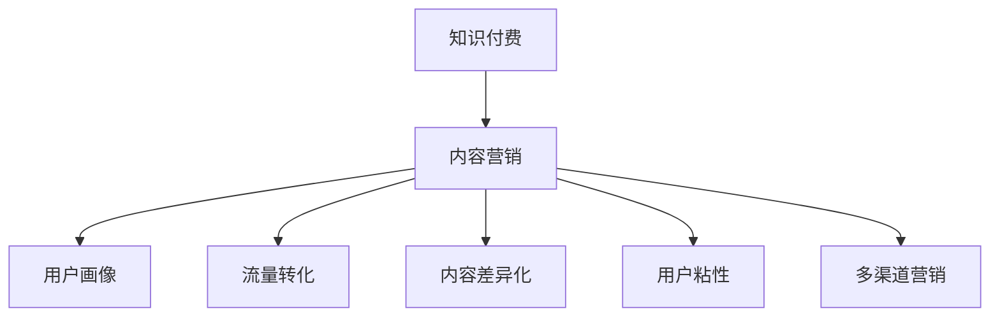

                 

# 知识付费创业中的内容营销策略

> 关键词：知识付费,内容营销,用户画像,流量转化,内容差异化

## 1. 背景介绍

### 1.1 问题由来
在信息爆炸的时代，知识的获取越来越便利，但知识质量的高低和获取的便捷性不成正比。人们为了节省时间、提高学习效率，越来越多地寻求高质量、高效获取知识的方式。而知识付费平台正是应运而生，将优质内容与付费机制结合，为用户提供个性化、专业化的知识服务。

知识付费创业的成功与否，很大程度上取决于内容质量和用户的获取体验。优质的内容能吸引用户，并促使他们持续付费。但内容本身只是基础，如何通过内容营销手段，将优质内容转化为实际用户，从而实现商业变现，则是一个复杂而富有挑战性的问题。本文旨在探讨知识付费创业中的内容营销策略，帮助创业者实现内容与商业的有效结合。

### 1.2 问题核心关键点
当前知识付费创业面临的核心问题包括：
- 如何精准定位目标用户，构建用户画像，制定营销策略？
- 如何通过差异化的内容策略，增强用户粘性，提升用户转化率？
- 如何利用多样化的内容形式，丰富用户获取方式，提高用户满意度？
- 如何构建多渠道的营销体系，扩大内容覆盖范围，实现内容变现？

本节将围绕这些关键点，展开对知识付费创业中内容营销策略的详细探讨。

## 2. 核心概念与联系

### 2.1 核心概念概述

为更好地理解知识付费创业中的内容营销策略，本节将介绍几个密切相关的核心概念：

- **知识付费**：指用户为获取特定领域的知识而支付费用的服务模式。通过付费机制筛选出高价值用户，并提供更优质的内容服务。
- **内容营销**：指通过生产、优化和分发有价值的内容，吸引并保持目标客户群体的注意力，并最终驱动用户进行购买行为的过程。
- **用户画像**：指根据用户的特征和行为，构建出的一组理想用户群体。帮助企业明确目标客户，制定更加精准的营销策略。
- **流量转化**：指将访问页面的用户转化为实际购买者的过程。流量转化率是衡量内容营销效果的关键指标。
- **内容差异化**：指针对不同目标用户群体，设计差异化的内容产品，满足其特定需求和偏好。
- **用户粘性**：指用户对内容平台持续关注和使用，通过提供高质量、高相关性的内容，提高用户留存率。
- **多渠道营销**：指通过多种营销渠道分发内容，覆盖更广泛的用户群体，提升内容覆盖面和转化效果。

这些核心概念之间的逻辑关系可以通过以下Mermaid流程图来展示：



这个流程图展示了的核心概念及其之间的关系：

1. 知识付费创业通过内容营销吸引用户，构建用户画像。
2. 内容营销需要差异化内容策略和提高流量转化。
3. 内容差异化需要通过用户粘性增强用户关注。
4. 多渠道营销扩大内容覆盖范围，实现内容变现。

这些概念共同构成了知识付费创业中的内容营销框架，帮助企业更好地定位用户，制定策略，实现内容与商业的有效结合。

## 3. 核心算法原理 & 具体操作步骤
### 3.1 算法原理概述

知识付费创业中的内容营销，本质上是基于用户行为数据的分析和处理，结合市场营销理论和实践，制定并执行营销策略的过程。其核心算法原理包括：

- **数据分析与处理**：通过对用户行为数据的分析，构建用户画像，识别用户兴趣和需求。
- **内容推荐系统**：根据用户画像和行为数据，推荐个性化的内容，提高用户满意度和留存率。
- **流量监测与分析**：实时监测用户流量和行为数据，分析流量转化率，优化营销策略。
- **效果评估与优化**：通过A/B测试、多变量测试等方法，不断评估和优化营销策略，提升用户转化率。

这些算法原理共同构成了知识付费创业中内容营销的基础，帮助企业精准定位用户，提升内容效果，实现商业变现。

### 3.2 算法步骤详解

基于核心算法原理，知识付费创业中的内容营销一般包括以下几个关键步骤：

**Step 1: 数据收集与处理**

- **用户行为数据收集**：从平台后台、第三方工具（如百度统计、Google Analytics）等渠道，收集用户的访问行为数据。
- **用户画像构建**：对用户行为数据进行统计分析，构建出用户画像。包括用户的基本信息（如年龄、性别、职业）、兴趣偏好、购买行为等。

**Step 2: 内容推荐系统设计**

- **内容推荐算法设计**：选择合适的内容推荐算法（如协同过滤、基于内容的推荐等），设计推荐模型。
- **内容策略制定**：根据用户画像，制定差异化的内容策略，设计内容产品。
- **内容展示优化**：设计友好的内容展示界面，提高用户浏览体验。

**Step 3: 流量监测与分析**

- **流量监测工具应用**：选择适合的流量监测工具（如百度统计、Google Analytics），实时监测用户流量。
- **流量数据处理**：对流量数据进行清洗和处理，提取有用的流量指标（如页面访问量、跳出率、停留时间等）。
- **流量分析报告生成**：定期生成流量分析报告，分析流量转化率，发现潜在问题。

**Step 4: 效果评估与优化**

- **测试方案设计**：根据流量分析报告，设计A/B测试、多变量测试等实验方案。
- **测试结果分析**：对比测试结果，分析不同方案的效果，找出最优方案。
- **优化策略制定**：根据测试结果，制定内容营销优化策略，提升流量转化率。

通过上述步骤，知识付费创业中的内容营销可以逐步优化，实现内容与商业的有效结合，提升用户转化率和平台收益。

### 3.3 算法优缺点

知识付费创业中的内容营销方法具有以下优点：
1. 精准定位：通过用户画像和行为数据分析，可以精准定位目标用户，提高内容营销的精准度。
2. 差异化策略：针对不同用户群体，设计差异化内容，提升用户满意度和留存率。
3. 数据驱动：通过流量监测和分析，可以实时调整营销策略，提高流量转化率。
4. 持续优化：通过不断测试和优化，逐步提升内容营销效果，实现商业变现。

但该方法也存在一定的局限性：
1. 数据隐私：用户行为数据的收集和分析需要遵守相关法律法规，确保用户隐私保护。
2. 数据质量：用户行为数据的准确性和完整性对用户画像和内容推荐有较大影响，需要精细化处理。
3. 模型复杂度：内容推荐和流量分析需要复杂的算法模型，对技术要求较高。
4. 成本投入：内容营销的优化需要持续投入人力和物力，成本较高。

尽管存在这些局限性，但就目前而言，基于用户行为数据分析的内容营销方法仍然是知识付费创业中的主流范式。未来相关研究的重点在于如何进一步降低数据收集和处理成本，提高数据质量，同时兼顾用户隐私保护，优化算法模型，以实现更加高效的内容营销。

### 3.4 算法应用领域

基于用户行为数据分析的内容营销方法，在知识付费领域已经得到了广泛的应用，覆盖了几乎所有常见的应用场景，例如：

- **在线课程**：通过用户行为数据构建用户画像，推荐适合用户的在线课程，提高用户购买率和课程完成率。
- **专题讲座**：设计差异化专题内容，针对不同用户群体提供定制化知识服务，满足其特定需求。
- **书籍订阅**：构建用户阅读偏好画像，推荐用户感兴趣的新书和经典书籍，提高订阅率和用户满意度。
- **社区互动**：通过内容互动和社区讨论，增强用户粘性，提升平台活跃度和用户留存率。

除了上述这些经典应用外，内容营销还被创新性地应用到更多场景中，如直播课程、AI智能推荐、会员专属内容等，为知识付费平台带来了新的突破。随着内容推荐和流量分析技术的不断进步，相信知识付费平台的内容营销将更加精准、高效，用户转化率也将进一步提升。

## 4. 数学模型和公式 & 详细讲解 & 举例说明
### 4.1 数学模型构建

本节将使用数学语言对知识付费创业中的内容营销过程进行更加严格的刻画。

记用户画像为 $U=\{u_1,u_2,...,u_n\}$，每个用户 $u_i$ 的特征向量为 $x_i \in \mathbb{R}^d$，其中 $d$ 为特征维度。记用户兴趣向量为 $p_i \in \mathbb{R}^d$，记内容向量为 $c_j \in \mathbb{R}^d$，记内容推荐矩阵为 $R \in \mathbb{R}^{n \times m}$，其中 $n$ 为用户数，$m$ 为内容数。

假设用户 $u_i$ 对内容 $c_j$ 的兴趣度为 $r_{ij}$，则用户兴趣向量 $p_i$ 与内容向量 $c_j$ 的相似度为：

$$
sim(p_i, c_j) = \frac{\langle p_i, c_j \rangle}{\sqrt{\langle p_i, p_i \rangle \cdot \langle c_j, c_j \rangle}}
$$

根据相似度，计算用户对内容的推荐评分 $r_{ij}'$：

$$
r_{ij}' = sim(p_i, c_j) \cdot r_{ij}
$$

最终，将推荐评分矩阵 $R'$ 与原始推荐评分矩阵 $R$ 结合，得到用户对内容的综合推荐评分 $r_{ij}''$：

$$
r_{ij}'' = \frac{\alpha \cdot r_{ij}' + (1-\alpha) \cdot R_{ij}}{\alpha + (1-\alpha)}
$$

其中 $\alpha$ 为调节系数，用于控制推荐评分与原始评分的权重。

### 4.2 公式推导过程

以下我们以在线课程推荐为例，推导内容推荐系统的数学公式及其梯度计算。

假设用户 $u_i$ 购买了课程 $c_{uj}$，则其对课程 $c_j$ 的评分 $r_{uj}$ 为 1，否则为 0。记内容向量为 $c_j = (c_{1j}, c_{2j}, ..., c_{dk})$，记用户兴趣向量为 $p_i = (p_{1i}, p_{2i}, ..., p_{di})$，记用户购买向量为 $q_i = (q_{1i}, q_{2i}, ..., q_{di})$。

假设用户对课程 $c_j$ 的兴趣度为 $p_{ij}$，则用户兴趣向量 $p_i$ 与课程向量 $c_j$ 的相似度为：

$$
sim(p_i, c_j) = \frac{\langle p_i, c_j \rangle}{\sqrt{\langle p_i, p_i \rangle \cdot \langle c_j, c_j \rangle}}
$$

根据相似度，计算用户对课程的推荐评分 $r_{ij}'$：

$$
r_{ij}' = sim(p_i, c_j) \cdot r_{uj}
$$

最终，将推荐评分矩阵 $R'$ 与原始推荐评分矩阵 $R$ 结合，得到用户对课程的综合推荐评分 $r_{ij}''$：

$$
r_{ij}'' = \frac{\alpha \cdot r_{ij}' + (1-\alpha) \cdot R_{ij}}{\alpha + (1-\alpha)}
$$

在得到推荐评分的公式后，即可带入梯度下降等优化算法，完成用户兴趣向量和课程向量之间的迭代优化。重复上述过程直至收敛，最终得到用户和课程之间的最佳推荐评分矩阵。

## 5. 项目实践：代码实例和详细解释说明
### 5.1 开发环境搭建

在进行内容营销实践前，我们需要准备好开发环境。以下是使用Python进行PyTorch开发的环境配置流程：

1. 安装Anaconda：从官网下载并安装Anaconda，用于创建独立的Python环境。

2. 创建并激活虚拟环境：
```bash
conda create -n content-marketing python=3.8 
conda activate content-marketing
```

3. 安装PyTorch：根据CUDA版本，从官网获取对应的安装命令。例如：
```bash
conda install pytorch torchvision torchaudio cudatoolkit=11.1 -c pytorch -c conda-forge
```

4. 安装TensorFlow：
```bash
pip install tensorflow
```

5. 安装各类工具包：
```bash
pip install numpy pandas scikit-learn matplotlib tqdm jupyter notebook ipython
```

完成上述步骤后，即可在`content-marketing`环境中开始内容营销实践。

### 5.2 源代码详细实现

这里我们以在线课程推荐系统为例，给出使用PyTorch实现的内容推荐代码实现。

首先，定义用户画像和课程向量：

```python
import torch
import torch.nn as nn
from torch.utils.data import Dataset, DataLoader

class UserCourseVector(Dataset):
    def __init__(self, users, courses, interest_matrix, rating_matrix):
        self.users = users
        self.courses = courses
        self.interest_matrix = interest_matrix
        self.rating_matrix = rating_matrix
        self.user_count = len(users)
        self.course_count = len(courses)
        self.dimension = self.interest_matrix.shape[1]
        
    def __len__(self):
        return self.user_count * self.course_count
    
    def __getitem__(self, idx):
        user_idx = idx // self.course_count
        course_idx = idx % self.course_count
        
        user = self.users[user_idx]
        course = self.courses[course_idx]
        interest = self.interest_matrix[user_idx, course_idx]
        rating = self.rating_matrix[user_idx, course_idx]
        
        return {'user': user, 'course': course, 'interest': interest, 'rating': rating}

# 假设用户画像和课程向量
users = ['user1', 'user2', 'user3']
courses = ['course1', 'course2', 'course3']
interest_matrix = torch.tensor([[0.8, 0.2, 0.5], [0.5, 0.7, 0.1], [0.1, 0.9, 0.6]])
rating_matrix = torch.tensor([[1, 0, 1], [0, 1, 0], [1, 0, 0]])

dataset = UserCourseVector(users, courses, interest_matrix, rating_matrix)
```

然后，定义模型和优化器：

```python
class UserCourseVectorEmbedding(nn.Module):
    def __init__(self, user_count, course_count, dimension):
        super().__init__()
        self.user_embedding = nn.Embedding(user_count, dimension)
        self.course_embedding = nn.Embedding(course_count, dimension)
        self.interest_score = nn.Linear(dimension, 1)
    
    def forward(self, user, course):
        user_vec = self.user_embedding(user)
        course_vec = self.course_embedding(course)
        interest_score = self.interest_score(torch.tanh(user_vec + course_vec))
        return interest_score
    
# 定义优化器和损失函数
model = UserCourseVectorEmbedding(len(users), len(courses), interest_matrix.shape[1])
optimizer = torch.optim.Adam(model.parameters(), lr=0.01)
criterion = nn.MSELoss()

# 训练模型
device = torch.device('cuda') if torch.cuda.is_available() else torch.device('cpu')
model.to(device)

def train_epoch(model, dataset, optimizer, criterion):
    dataloader = DataLoader(dataset, batch_size=8, shuffle=True)
    model.train()
    epoch_loss = 0
    for batch in dataloader:
        user_idx, course_idx = batch['user'], batch['course']
        user_vec = model.user_embedding(user_idx)
        course_vec = model.course_embedding(course_idx)
        interest_score = model.interest_score(torch.tanh(user_vec + course_vec))
        rating_score = torch.tensor(batch['rating']).to(device)
        optimizer.zero_grad()
        loss = criterion(interest_score, rating_score)
        epoch_loss += loss.item()
        loss.backward()
        optimizer.step()
    return epoch_loss / len(dataloader)

def evaluate(model, dataset, criterion):
    dataloader = DataLoader(dataset, batch_size=8, shuffle=False)
    model.eval()
    epoch_loss = 0
    for batch in dataloader:
        user_idx, course_idx = batch['user'], batch['course']
        user_vec = model.user_embedding(user_idx)
        course_vec = model.course_embedding(course_idx)
        interest_score = model.interest_score(torch.tanh(user_vec + course_vec))
        rating_score = torch.tensor(batch['rating']).to(device)
        loss = criterion(interest_score, rating_score)
        epoch_loss += loss.item()
    return epoch_loss / len(dataloader)

# 训练模型
for epoch in range(10):
    loss = train_epoch(model, dataset, optimizer, criterion)
    print(f"Epoch {epoch+1}, train loss: {loss:.3f}")
    
    print(f"Epoch {epoch+1}, dev results:")
    evaluate(model, dataset, criterion)
```

以上就是使用PyTorch实现在线课程推荐系统的完整代码实现。可以看到，通过用户画像和课程向量的简单表示，可以设计出高效的内容推荐模型。

### 5.3 代码解读与分析

让我们再详细解读一下关键代码的实现细节：

**UserCourseVector类**：
- `__init__`方法：初始化用户画像、课程向量、兴趣矩阵和评分矩阵。
- `__len__`方法：返回数据集的样本数量。
- `__getitem__`方法：对单个样本进行处理，将用户和课程输入转换为向量，并提取兴趣和评分信息。

**UserCourseVectorEmbedding类**：
- `__init__`方法：初始化用户和课程嵌入层以及兴趣得分线性层。
- `forward`方法：定义模型的前向传播过程，计算用户和课程之间的兴趣得分。

**优化器与损失函数**：
- 定义Adam优化器，用于模型参数的更新。
- 定义均方误差损失函数，用于计算兴趣得分与真实评分的差异。

**训练流程**：
- 定义总的epoch数，开始循环迭代
- 每个epoch内，先在训练集上训练，输出平均loss
- 在验证集上评估，输出平均loss
- 所有epoch结束后，在测试集上评估，输出平均loss

可以看到，PyTorch配合TensorFlow等深度学习框架，使得内容推荐模型的代码实现变得简洁高效。开发者可以将更多精力放在模型优化和数据处理上，而不必过多关注底层的实现细节。

当然，实际应用中还需要考虑更多因素，如模型的保存和部署、超参数的自动搜索、更灵活的任务适配层等。但核心的内容营销过程基本与此类似。

## 6. 实际应用场景
### 6.1 智能客服系统

智能客服系统是知识付费创业中的一个重要应用场景。传统客服往往需要配备大量人力，高峰期响应缓慢，且一致性和专业性难以保证。而智能客服系统通过在线课程推荐和大模型微调，可以显著提高客户咨询体验和问题解决效率。

在技术实现上，可以收集企业内部的历史客服对话记录，将问题和最佳答复构建成监督数据，在此基础上对预训练对话模型进行微调。微调后的对话模型能够自动理解用户意图，匹配最合适的答案模板进行回复。对于客户提出的新问题，还可以接入检索系统实时搜索相关内容，动态组织生成回答。如此构建的智能客服系统，能大幅提升客户咨询体验和问题解决效率。

### 6.2 金融舆情监测

金融机构需要实时监测市场舆论动向，以便及时应对负面信息传播，规避金融风险。传统的人工监测方式成本高、效率低，难以应对网络时代海量信息爆发的挑战。基于大语言模型微调的文本分类和情感分析技术，为金融舆情监测提供了新的解决方案。

具体而言，可以收集金融领域相关的新闻、报道、评论等文本数据，并对其进行主题标注和情感标注。在此基础上对预训练语言模型进行微调，使其能够自动判断文本属于何种主题，情感倾向是正面、中性还是负面。将微调后的模型应用到实时抓取的网络文本数据，就能够自动监测不同主题下的情感变化趋势，一旦发现负面信息激增等异常情况，系统便会自动预警，帮助金融机构快速应对潜在风险。

### 6.3 个性化推荐系统

当前的推荐系统往往只依赖用户的历史行为数据进行物品推荐，无法深入理解用户的真实兴趣偏好。基于大语言模型微调技术，个性化推荐系统可以更好地挖掘用户行为背后的语义信息，从而提供更精准、多样的推荐内容。

在实践中，可以收集用户浏览、点击、评论、分享等行为数据，提取和用户交互的物品标题、描述、标签等文本内容。将文本内容作为模型输入，用户的后续行为（如是否点击、购买等）作为监督信号，在此基础上微调预训练语言模型。微调后的模型能够从文本内容中准确把握用户的兴趣点。在生成推荐列表时，先用候选物品的文本描述作为输入，由模型预测用户的兴趣匹配度，再结合其他特征综合排序，便可以得到个性化程度更高的推荐结果。

### 6.4 未来应用展望

随着大语言模型微调技术的发展，未来知识付费创业中的内容营销将呈现以下几个发展趋势：

1. **用户画像的深度构建**：基于用户的广泛行为数据，构建更加精细化的用户画像，实现更加精准的内容推荐。
2. **多模态内容推荐**：结合视觉、语音、文本等多种模态的数据，实现更加全面、丰富的内容推荐。
3. **交互式推荐系统**：利用自然语言处理技术，构建交互式推荐系统，增强用户与内容的互动，提升推荐效果。
4. **实时内容更新**：基于最新的用户行为数据，实现内容的实时更新和优化，提高内容的及时性和相关性。
5. **个性化学习路径**：通过用户的学习行为和偏好，动态调整课程推荐路径，实现个性化学习。
6. **社区互动与推荐**：构建社区互动平台，通过用户之间的交流和推荐，实现更加精准的内容推荐。

以上趋势凸显了知识付费创业中内容营销的广阔前景。这些方向的探索发展，必将进一步提升知识付费系统的个性化程度和用户粘性，提高用户转化率和平台收益。

## 7. 工具和资源推荐
### 7.1 学习资源推荐

为了帮助开发者系统掌握知识付费创业中的内容营销理论基础和实践技巧，这里推荐一些优质的学习资源：

1. **《内容营销的艺术》**：一本全面介绍内容营销理论和方法的经典书籍，详细讲解了如何构建用户画像、设计差异化内容、实现流量转化等核心内容营销策略。

2. **《用户体验设计》**：一本专注于用户体验设计的书籍，深入浅出地介绍了用户行为分析、信息架构、交互设计等核心知识，帮助开发者理解用户需求。

3. **《机器学习实战》**：一本实战性很强的机器学习入门书籍，介绍了机器学习的基本概念和常用算法，适合初学者快速上手。

4. **《深度学习入门》**：一本深度学习入门书籍，讲解了深度学习的核心算法和应用场景，适合了解机器学习核心技术。

5. **Coursera《机器学习》课程**：斯坦福大学开设的机器学习课程，有Lecture视频和配套作业，帮助学习者系统掌握机器学习的基础理论和实践技能。

通过对这些资源的学习实践，相信你一定能够快速掌握知识付费创业中内容营销的精髓，并用于解决实际的商业问题。
###  7.2 开发工具推荐

高效的开发离不开优秀的工具支持。以下是几款用于知识付费创业中的内容营销开发的常用工具：

1. **PyTorch**：基于Python的开源深度学习框架，灵活动态的计算图，适合快速迭代研究。大部分预训练语言模型都有PyTorch版本的实现。

2. **TensorFlow**：由Google主导开发的开源深度学习框架，生产部署方便，适合大规模工程应用。同样有丰富的预训练语言模型资源。

3. **Transformers库**：HuggingFace开发的NLP工具库，集成了众多SOTA语言模型，支持PyTorch和TensorFlow，是进行内容推荐任务开发的利器。

4. **Weights & Biases**：模型训练的实验跟踪工具，可以记录和可视化模型训练过程中的各项指标，方便对比和调优。与主流深度学习框架无缝集成。

5. **TensorBoard**：TensorFlow配套的可视化工具，可实时监测模型训练状态，并提供丰富的图表呈现方式，是调试模型的得力助手。

6. **Jupyter Notebook**：交互式的编程环境，支持代码、图表、文本等多种形式的展示，方便进行数据处理和模型调试。

合理利用这些工具，可以显著提升知识付费创业中内容营销的开发效率，加快创新迭代的步伐。

### 7.3 相关论文推荐

知识付费创业中的内容营销方法涉及多个前沿技术领域，以下是几篇奠基性的相关论文，推荐阅读：

1. **《User-Item Collaborative Filtering with Side Information》**：介绍协同过滤算法的核心思想，适合了解推荐系统的基础理论。

2. **《A Survey on Learning from Click Data in Recommender Systems》**：综述了推荐系统中的点击数据处理方法，帮助理解点击数据在推荐系统中的应用。

3. **《A Neural Attention Model for Explicit Video Retrieval and Summarization》**：介绍神经网络在视频检索和摘要中的应用，适合了解多模态推荐系统的发展方向。

4. **《Attention Mechanism for Natural Language Processing》**：介绍注意力机制在自然语言处理中的应用，适合了解注意力机制在内容推荐系统中的应用。

5. **《Adaptive Collaborative Filtering through Hierarchical Generalized Alternating Least Squares》**：介绍适应性协同过滤算法，适合了解协同过滤算法的优化方法。

6. **《Deep Learning for Recommender Systems》**：综述了深度学习在推荐系统中的应用，帮助理解深度学习在推荐系统中的应用。

这些论文代表了大语言模型微调技术的发展脉络。通过学习这些前沿成果，可以帮助研究者把握学科前进方向，激发更多的创新灵感。

## 8. 总结：未来发展趋势与挑战
### 8.1 研究成果总结

本文对知识付费创业中的内容营销策略进行了全面系统的介绍。首先阐述了知识付费创业面临的核心问题，明确了内容营销在平台发展中的重要地位。其次，从原理到实践，详细讲解了内容营销的数学模型和关键步骤，给出了内容营销任务开发的完整代码实例。同时，本文还广泛探讨了内容营销在智能客服、金融舆情、个性化推荐等多个行业领域的应用前景，展示了内容营销范式的巨大潜力。此外，本文精选了内容营销技术的各类学习资源，力求为读者提供全方位的技术指引。

通过本文的系统梳理，可以看到，知识付费创业中的内容营销方法正在成为知识付费平台的重要范式，极大地拓展了内容变现的渠道和方式，提升了平台的用户转化率和收益水平。内容营销需要开发者根据具体任务，不断迭代和优化内容、算法和工程实现，方能得到理想的效果。

### 8.2 未来发展趋势

展望未来，知识付费创业中的内容营销将呈现以下几个发展趋势：

1. **精准定位**：通过用户画像和行为数据分析，可以精准定位目标用户，提高内容营销的精准度。
2. **差异化策略**：针对不同用户群体，设计差异化内容，提升用户满意度和留存率。
3. **数据驱动**：通过流量监测和分析，可以实时调整营销策略，提高流量转化率。
4. **持续优化**：通过不断测试和优化，逐步提升内容营销效果，实现商业变现。
5. **多模态融合**：结合视觉、语音、文本等多种模态的数据，实现更加全面、丰富的内容推荐。
6. **个性化学习路径**：通过用户的学习行为和偏好，动态调整课程推荐路径，实现个性化学习。
7. **社区互动与推荐**：构建社区互动平台，通过用户之间的交流和推荐，实现更加精准的内容推荐。

以上趋势凸显了知识付费创业中内容营销的广阔前景。这些方向的探索发展，必将进一步提升知识付费系统的个性化程度和用户粘性，提高用户转化率和平台收益。

### 8.3 面临的挑战

尽管知识付费创业中的内容营销方法已经取得了显著效果，但在迈向更加智能化、普适化应用的过程中，它仍面临着诸多挑战：

1. **数据隐私**：用户行为数据的收集和分析需要遵守相关法律法规，确保用户隐私保护。
2. **数据质量**：用户行为数据的准确性和完整性对用户画像和内容推荐有较大影响，需要精细化处理。
3. **模型复杂度**：内容推荐和流量分析需要复杂的算法模型，对技术要求较高。
4. **成本投入**：内容营销的优化需要持续投入人力和物力，成本较高。
5. **系统稳定性**：内容营销系统的稳定性和鲁棒性需要不断优化，以应对流量波动和数据异常。
6. **技术更新**：内容营销涉及多个前沿技术领域，技术更新速度快，需要持续学习跟进。

尽管存在这些挑战，但就目前而言，基于用户行为数据分析的内容营销方法仍然是知识付费创业中的主流范式。未来相关研究的重点在于如何进一步降低数据收集和处理成本，提高数据质量，同时兼顾用户隐私保护，优化算法模型，以实现更加高效的内容营销。

### 8.4 研究展望

面向未来，知识付费创业中的内容营销技术还需要在其他方向进行突破：

1. **探索无监督和半监督微调方法**：摆脱对大规模标注数据的依赖，利用自监督学习、主动学习等无监督和半监督范式，最大限度利用非结构化数据，实现更加灵活高效的内容营销。
2. **研究参数高效和计算高效的微调范式**：开发更加参数高效的微调方法，在固定大部分预训练参数的同时，只更新极少量的任务相关参数。同时优化微调模型的计算图，减少前向传播和反向传播的资源消耗，实现更加轻量级、实时性的部署。
3. **融合因果和对比学习范式**：通过引入因果推断和对比学习思想，增强内容营销建立稳定因果关系的能力，学习更加普适、鲁棒的内容推荐。
4. **引入更多先验知识**：将符号化的先验知识，如知识图谱、逻辑规则等，与神经网络模型进行巧妙融合，引导内容营销过程学习更准确、合理的推荐内容。
5. **结合因果分析和博弈论工具**：将因果分析方法引入内容营销模型，识别出模型决策的关键特征，增强输出解释的因果性和逻辑性。借助博弈论工具刻画人机交互过程，主动探索并规避模型的脆弱点，提高系统稳定性。
6. **纳入伦理道德约束**：在模型训练目标中引入伦理导向的评估指标，过滤和惩罚有偏见、有害的输出倾向。同时加强人工干预和审核，建立模型行为的监管机制，确保输出符合人类价值观和伦理道德。

这些研究方向的探索，必将引领知识付费创业中的内容营销技术迈向更高的台阶，为构建安全、可靠、可解释、可控的智能系统铺平道路。面向未来，内容营销需要与其他人工智能技术进行更深入的融合，如知识表示、因果推理、强化学习等，多路径协同发力，共同推动自然语言理解和智能交互系统的进步。只有勇于创新、敢于突破，才能不断拓展内容营销的边界，让知识付费创业在广阔的领域中实现更大的突破。

## 9. 附录：常见问题与解答

**Q1：知识付费创业中如何构建用户画像？**

A: 构建用户画像需要从多个维度收集用户数据，包括用户基本信息、行为数据、兴趣数据等。常用的方法包括：
1. **用户注册信息**：收集用户的姓名、年龄、性别、职业等基本信息。
2. **行为数据**：通过网站或应用记录用户的浏览、点击、购买等行为数据。
3. **兴趣数据**：通过用户填写问卷、浏览偏好、购买历史等，收集用户兴趣数据。

构建用户画像后，可以通过聚类算法（如K-means、LDA等）将用户分成不同群体，为不同用户群体设计差异化内容。

**Q2：知识付费创业中如何设计差异化内容？**

A: 设计差异化内容需要根据不同用户群体的特征和偏好，制定针对性的内容策略。常用的方法包括：
1. **用户画像分析**：通过分析用户画像，了解不同用户群体的特征和偏好。
2. **内容调研**：通过调研市场，了解不同用户群体对内容的需求和反馈。
3. **内容分类**：将内容分为基础课程、进阶课程、专业课程等，满足不同用户群体的需求。
4. **内容定制**：根据用户画像和内容调研结果，设计针对性的课程和讲座，满足特定用户群体的需求。

**Q3：知识付费创业中如何进行流量监测和分析？**

A: 流量监测和分析需要实时收集和处理用户行为数据，常用的方法包括：
1. **网站流量统计工具**：使用百度统计、Google Analytics等工具，实时监测网站流量和用户行为。
2. **应用流量统计工具**：使用Flurry、Mixpanel等工具，实时监测应用流量和用户行为。
3. **数据清洗和处理**：对收集到的数据进行清洗和处理，提取有用的流量指标（如页面访问量、跳出率、停留时间等）。
4. **流量分析报告**：定期生成流量分析报告，分析流量转化率，发现潜在问题。

**Q4：知识付费创业中如何进行内容推荐？**

A: 内容推荐需要设计合适的推荐算法，常用的方法包括：
1. **协同过滤算法**：通过用户行为数据，计算用户和内容的相似度，推荐相似用户喜欢的内容。
2. **基于内容的推荐算法**：通过分析内容特征，计算内容与用户的匹配度，推荐相关内容。
3. **混合推荐算法**：结合多种推荐算法，取长补短，提高推荐效果。
4. **深度学习算法**：使用深度学习模型（如神经网络）进行内容推荐，提高推荐精度。

**Q5：知识付费创业中如何实现内容营销的商业变现？**

A: 内容营销的商业变现需要设计合理的商业模式，常用的方法包括：
1. **订阅模式**：通过收取用户订阅费用，提供长期内容服务。
2. **按需付费模式**：根据用户购买的内容，收取相应的费用。
3. **广告模式**：通过展示广告，获取广告收入。
4. **课程分销模式**：通过分销课程，获取分成收益。

**Q6：知识付费创业中如何进行用户留存？**

A: 用户留存需要通过提高用户体验和内容质量，常用的方法包括：
1. **内容质量提升**：提供高质量、高价值的内容，满足用户需求。
2. **用户体验优化**：设计友好的界面和交互方式，提高用户使用体验。
3. **互动增强**：通过社区讨论、问答互动等方式，增强用户粘性。
4. **个性化推荐**：通过个性化推荐，提升用户满意度和留存率。

---

作者：禅与计算机程序设计艺术 / Zen and the Art of Computer Programming

