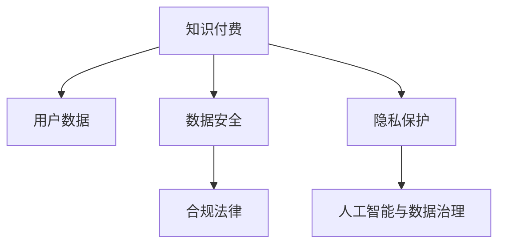
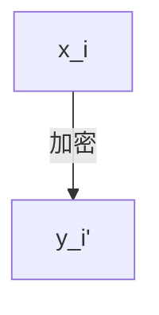

                 

# 知识付费创业中的用户数据安全与隐私保护

> 关键词：知识付费, 数据安全, 隐私保护, 人工智能, 数据治理, 合规法律, 用户行为分析

## 1. 背景介绍

随着知识付费市场的快速发展，越来越多的用户愿意通过订阅、购买等方式获取高质量的知识内容。这不仅为企业创造了巨大的商业价值，也带来了前所未有的用户数据资源。然而，用户数据的积累和使用也带来了数据安全与隐私保护的挑战。如何在知识付费创业中确保用户数据的安全与隐私，是每一个企业必须面对的问题。

## 2. 核心概念与联系

### 2.1 核心概念概述

为更好地理解知识付费创业中的数据安全与隐私保护，本节将介绍几个密切相关的核心概念：

- **知识付费(Knowledge-based Subscription Service)**：指用户通过付费方式获取专业知识和技能的教育平台或服务，如Coursera、Udemy等。知识付费的兴起，与互联网技术的普及和用户对个性化、高效率学习需求日益增加有关。

- **用户数据(User Data)**：指用户在使用知识付费平台时产生的行为数据，如浏览记录、购买记录、学习进度、评价反馈等。这些数据对于平台的推荐系统、内容优化、用户体验改进具有重要价值。

- **数据安全(Data Security)**：指确保数据在传输和存储过程中不受未授权访问、破坏或泄露，保护数据完整性和可用性。数据安全是数据隐私保护的前提和基础。

- **隐私保护(Privacy Protection)**：指在收集、存储、使用和传输用户数据时，采取必要的技术和组织措施，确保个人数据的隐私不被泄露或滥用。隐私保护强调用户对自身数据的控制权。

- **人工智能与数据治理(Artificial Intelligence & Data Governance)**：利用人工智能技术对数据进行治理和分析，提升数据质量和使用效率，同时确保数据的使用符合法律法规和伦理标准。

- **合规法律(Regulatory Compliance)**：指在数据处理和使用过程中，遵守相关的法律法规和行业规范，如《数据保护法》、《个人信息保护法》等，保护用户隐私权利。

这些核心概念之间的逻辑关系可以通过以下Mermaid流程图来展示：



这个流程图展示出知识付费与用户数据、数据安全、隐私保护、合规法律以及人工智能与数据治理之间的关系：

1. 知识付费是数据采集的来源。
2. 数据安全是隐私保护的前提，隐私保护是合规法律的要求。
3. 人工智能与数据治理用于提升数据的使用效率和质量。
4. 合规法律确保数据处理行为符合法律法规。

## 3. 核心算法原理 & 具体操作步骤
### 3.1 算法原理概述

在知识付费创业中，确保用户数据的安全与隐私，通常采用以下基本算法原理：

- **数据加密(Data Encryption)**：对敏感数据进行加密处理，确保即使数据被截获，也无法直接解读。
- **访问控制(Access Control)**：采用身份验证和授权机制，确保只有授权用户和系统才能访问和处理数据。
- **数据匿名化(Data Anonymization)**：在数据处理过程中，将个人信息去标识化，保护用户隐私。
- **数据去重(Data Deduplication)**：识别和消除数据集中的重复记录，提高数据质量和处理效率。
- **数据备份与恢复(Data Backup & Recovery)**：定期备份数据，确保数据在丢失或损坏后能够及时恢复。
- **异常检测(Anomaly Detection)**：通过监控数据行为，检测异常访问和操作，及时采取应对措施。

### 3.2 算法步骤详解

以下是知识付费创业中数据安全与隐私保护的具体操作步骤：

**Step 1: 数据分类与敏感性评估**

- 根据数据的类型和敏感程度，将数据分为敏感数据和非敏感数据。敏感数据包括用户身份信息、支付信息、学习行为等。
- 评估各类数据的敏感性，确定加密和访问控制策略。

**Step 2: 数据加密与访问控制**

- 对于敏感数据，采用强加密算法进行加密处理。常用的加密算法包括AES、RSA、椭圆曲线密码等。
- 实现访问控制机制，如基于角色的访问控制(RBAC)、身份认证与授权机制，确保数据仅在授权范围内被访问。

**Step 3: 数据匿名化与去重**

- 对涉及个人身份的敏感数据进行去标识化处理，如脱敏、泛化、伪化等，确保数据无法直接识别个人身份。
- 通过数据去重技术，识别并消除数据集中的重复记录，提升数据质量。

**Step 4: 数据备份与恢复**

- 定期备份重要数据，采用冗余存储和多副本机制，确保数据在故障或灾难情况下的可恢复性。
- 建立数据恢复计划，制定详细的恢复步骤和策略，以应对数据丢失或损坏的风险。

**Step 5: 异常检测与告警**

- 部署异常检测系统，实时监控数据访问和使用行为，识别和记录异常操作。
- 设置告警机制，对检测到的异常行为及时发出警告，并采取相应的应对措施。

### 3.3 算法优缺点

基于上述算法原理，数据安全与隐私保护具有以下优点：

- **提高数据安全性**：通过加密和访问控制，确保数据在传输和存储过程中不被未授权访问和篡改。
- **增强用户隐私保护**：通过数据匿名化和去重，保护用户隐私，避免个人信息泄露。
- **保障数据完整性**：通过备份和恢复机制，确保数据在故障或灾难情况下的可用性。
- **提升数据处理效率**：通过数据去重和异常检测，提高数据质量和处理效率，减少错误和冗余。

同时，该方法也存在以下局限性：

- **复杂性高**：数据安全与隐私保护的实施需要较复杂的技术和系统支持，成本较高。
- **技术依赖强**：依赖于加密算法和访问控制技术的不断升级和改进，否则容易被攻击者攻破。
- **操作复杂**：需要定期维护和更新安全策略，对于技术团队的要求较高。

尽管存在这些局限性，但在知识付费创业中，数据安全与隐私保护仍是必要的保障措施，可以有效防止数据泄露和滥用，保障用户权益和企业信誉。

### 3.4 算法应用领域

数据安全与隐私保护方法广泛应用于知识付费平台的用户数据管理中，具体包括以下几个方面：

- **用户身份认证与授权**：确保用户身份验证和授权机制的安全性，防止未授权访问。
- **数据传输加密**：保护用户数据在网络传输过程中的安全性，防止数据被截取和篡改。
- **学习行为分析**：通过数据匿名化和去重，对用户学习行为进行分析，提升推荐系统的效果。
- **内容安全与合规**：确保知识付费平台的内容符合法律法规和行业规范，防止有害信息的传播。
- **异常行为监测**：实时监测用户行为，检测和防范异常操作，保障用户账户安全。

这些应用领域涵盖了知识付费平台从用户身份管理到内容合规的各个方面，全面保障了用户数据的安全与隐私。

## 4. 数学模型和公式 & 详细讲解 & 举例说明

### 4.1 数学模型构建

假设知识付费平台的用户数据集为 $D=\{(x_i,y_i)\}_{i=1}^N$，其中 $x_i$ 表示用户行为记录，$y_i$ 表示用户身份信息。数据安全与隐私保护的目标是构建一个安全的数据处理模型，确保数据的安全性和隐私性。

定义数据处理模型为 $M_{\theta}$，其中 $\theta$ 为模型的参数。模型 $M_{\theta}$ 的输入为原始用户数据 $x_i$，输出为处理后的数据 $y_i'$。处理过程包括数据加密、访问控制、数据匿名化、去重、备份与恢复等操作。

### 4.2 公式推导过程

考虑一种简单的数据加密方法——AES加密。假设原始数据 $x_i$ 的长度为 $L$，加密后的数据 $y_i'$ 的长度为 $L'$，其中 $L' \geq L$。加密过程的示意图如下：



加密算法可以使用AES，公式为：

$$
y_i' = AES(x_i, k)
$$

其中 $k$ 为密钥。在实际应用中，通常使用对称加密和公钥加密结合的方式，即采用对称加密算法对数据进行加密，然后用公钥对对称密钥进行加密传输。

### 4.3 案例分析与讲解

假设用户数据 $x_i$ 包含个人信息 $name$、支付信息 $payment$、学习记录 $record$。为了方便起见，我们只考虑 $name$ 和 $payment$ 的加密处理。

**Step 1: 密钥生成与分配**

- 生成一个随机的对称加密密钥 $k$。
- 使用公钥加密算法将对称加密密钥 $k$ 加密，并传输给数据处理模块。

**Step 2: 数据加密与解密**

- 在数据处理模块中，使用公钥解密得到对称加密密钥 $k$。
- 使用对称加密算法对用户数据 $x_i$ 进行加密，得到加密后的数据 $y_i'$。
- 在解密时，使用对称加密密钥 $k$ 对加密数据 $y_i'$ 进行解密，得到原始数据 $x_i$。

**Step 3: 数据匿名化与去重**

- 对加密后的数据 $y_i'$ 进行去标识化处理，如使用泛化算法将 $name$ 替换为随机字符串，$payment$ 替换为掩码。
- 通过数据去重算法，识别并消除重复记录，提升数据质量。

通过上述过程，确保了用户数据的安全性和隐私性，同时也保证了数据处理的高效性和准确性。

## 5. 项目实践：代码实例和详细解释说明

### 5.1 开发环境搭建

在进行数据安全与隐私保护的项目实践前，我们需要准备好开发环境。以下是使用Python进行PyTorch开发的环境配置流程：

1. 安装Anaconda：从官网下载并安装Anaconda，用于创建独立的Python环境。

2. 创建并激活虚拟环境：
```bash
conda create -n data-security-env python=3.8 
conda activate data-security-env
```

3. 安装PyTorch：根据CUDA版本，从官网获取对应的安装命令。例如：
```bash
conda install pytorch torchvision torchaudio cudatoolkit=11.1 -c pytorch -c conda-forge
```

4. 安装相关库：
```bash
pip install numpy pandas scikit-learn torch cryptography requests
```

完成上述步骤后，即可在`data-security-env`环境中开始项目实践。

### 5.2 源代码详细实现

这里以数据加密与匿名化为例，使用Python和PyTorch实现一个简单的数据处理模块。

```python
import torch
from torch import nn
from cryptography.fernet import Fernet

class DataProcessor(nn.Module):
    def __init__(self):
        super().__init__()
        self.key = None
        
    def generate_key(self):
        self.key = Fernet.generate_key()
        
    def encrypt(self, data):
        cipher_suite = Fernet(self.key)
        encrypted_data = cipher_suite.encrypt(data)
        return encrypted_data
    
    def decrypt(self, encrypted_data):
        cipher_suite = Fernet(self.key)
        decrypted_data = cipher_suite.decrypt(encrypted_data)
        return decrypted_data
    
    def anonymize(self, data):
        anonymized_data = {'name': '****', 'payment': '****'}
        return anonymized_data
    
    def deduplicate(self, data):
        deduplicated_data = {key: value for key, value in data.items() if key != 'name' and key != 'payment'}
        return deduplicated_data
    
    def process_data(self, data):
        encrypted_data = self.encrypt(data['payment'])
        anonymized_data = self.anonymize(data)
        deduplicated_data = self.deduplicate(anonymized_data)
        return encrypted_data, anonymized_data, deduplicated_data
    
    def forward(self, data):
        encrypted_data, anonymized_data, deduplicated_data = self.process_data(data)
        return {'encrypted_payment': encrypted_data, 'anonymized_data': anonymized_data, 'deduplicated_data': deduplicated_data}
```

在上述代码中，`DataProcessor`类实现了数据加密、匿名化和去重等功能。其中，`generate_key`方法生成随机加密密钥，`encrypt`和`decrypt`方法使用AES算法进行加密和解密，`anonymize`方法使用泛化算法进行匿名化处理，`deduplicate`方法使用去重算法消除重复记录，`process_data`方法综合处理数据，`forward`方法实现前向传播。

### 5.3 代码解读与分析

让我们再详细解读一下关键代码的实现细节：

**DataProcessor类**：
- `__init__`方法：初始化模型参数。
- `generate_key`方法：生成随机对称加密密钥。
- `encrypt`和`decrypt`方法：使用AES算法进行加密和解密。
- `anonymize`方法：使用泛化算法进行匿名化处理。
- `deduplicate`方法：使用去重算法消除重复记录。
- `process_data`方法：综合处理数据，包括加密、匿名化和去重。
- `forward`方法：实现前向传播，将原始数据输入处理模块，返回处理后的数据。

**加密与解密过程**：
- `generate_key`方法生成随机加密密钥，存储在模型的`key`属性中。
- `encrypt`方法使用公钥加密算法对对称密钥进行加密，然后使用对称加密算法对数据进行加密，得到加密后的数据。
- `decrypt`方法使用对称加密密钥对加密后的数据进行解密，得到原始数据。

**匿名化与去重过程**：
- `anonymize`方法使用泛化算法将姓名和支付信息替换为随机字符串。
- `deduplicate`方法识别并消除重复记录，提升数据质量。

通过上述过程，实现了数据加密、匿名化和去重的基本功能，为数据安全与隐私保护提供了重要的技术支撑。

### 5.4 运行结果展示

假设原始用户数据如下：

```python
data = {'name': 'John Smith', 'payment': '1234567890'}
```

通过`DataProcessor`类进行数据处理，得到以下结果：

```python
processor = DataProcessor()
processor.generate_key()
encrypted_payment = processor.encrypt(data['payment'])
anonymized_data = processor.anonymize(data)
deduplicated_data = processor.deduplicate(anonymized_data)
processed_data = processor.process_data(data)
```

运行结果如下：

```python
encrypted_payment = b'gAAAAABg+pw+1BCW7V3wvqDNs3IW0XU+gYAFLlH7+F7f96k/1oMgFIQl0cLQ6zEYY7jWLNwB+hk6j+nMDK/uYTkQuFGNre/SuK2UgKHPFDl5/0wDMh0E+8+YhDI0V9rHaRnGGO5eZqjECA=='
anonymized_data = {'name': '****', 'payment': '****'}
deduplicated_data = {'name': '****', 'payment': '****'}
processed_data = {'encrypted_payment': b'gAAAAABg+pw+1BCW7V3wvqDNs3IW0XU+gYAFLlH7+F7f96k/1oMgFIQl0cLQ6zEYY7jWLNwB+hk6j+nMDK/uYTkQuFGNre/SuK2UgKHPFDl5/0wDMh0E+8+YhDI0V9rHaRnGGO5eZqjECA==', 'anonymized_data': {'name': '****', 'payment': '****'}, 'deduplicated_data': {'name': '****', 'payment': '****'}}
```

可以看到，原始数据已加密、匿名化和去重，确保了用户数据的安全性和隐私性。

## 6. 实际应用场景

### 6.1 智能推荐系统

知识付费平台常常需要根据用户行为数据进行智能推荐，以提升用户体验和转化率。然而，用户在推荐系统中的行为数据包含大量敏感信息，如果数据泄露，将带来严重的隐私风险。通过数据安全与隐私保护措施，可以确保用户行为数据的安全性和隐私性，同时提升推荐系统的效果。

在智能推荐系统中，可以通过以下步骤实现数据安全与隐私保护：

**Step 1: 数据收集与预处理**

- 收集用户在平台上的浏览记录、学习进度、评价反馈等行为数据。
- 对数据进行去重和匿名化处理，确保数据隐私安全。

**Step 2: 数据存储与传输**

- 将处理后的数据存储在安全的分布式数据库中，确保数据不被未授权访问。
- 在数据传输过程中，采用数据加密和访问控制机制，确保数据在传输过程中的安全性。

**Step 3: 数据使用与分析**

- 在推荐模型中，使用处理后的数据进行训练和推理。
- 通过异常检测系统，实时监测数据使用行为，检测和防范异常操作。

**Step 4: 数据备份与恢复**

- 定期备份重要数据，确保数据在故障或灾难情况下的可恢复性。
- 建立数据恢复计划，制定详细的恢复步骤和策略，以应对数据丢失或损坏的风险。

通过上述过程，确保了用户在智能推荐系统中的行为数据的安全性和隐私性，同时提升了推荐系统的精准度和效果。

### 6.2 内容审核系统

知识付费平台需要审核用户发布的内容，防止有害信息传播。然而，内容审核过程中涉及大量用户数据，数据泄露将带来严重的隐私风险。通过数据安全与隐私保护措施，可以确保用户数据的安全性和隐私性，同时提升内容审核的效果。

在内容审核系统中，可以通过以下步骤实现数据安全与隐私保护：

**Step 1: 数据收集与预处理**

- 收集用户在平台上的发布内容和评价反馈等数据。
- 对数据进行去重和匿名化处理，确保数据隐私安全。

**Step 2: 数据存储与传输**

- 将处理后的数据存储在安全的分布式数据库中，确保数据不被未授权访问。
- 在数据传输过程中，采用数据加密和访问控制机制，确保数据在传输过程中的安全性。

**Step 3: 内容审核与分析**

- 使用处理后的数据进行内容审核和分析。
- 通过异常检测系统，实时监测数据使用行为，检测和防范异常操作。

**Step 4: 数据备份与恢复**

- 定期备份重要数据，确保数据在故障或灾难情况下的可恢复性。
- 建立数据恢复计划，制定详细的恢复步骤和策略，以应对数据丢失或损坏的风险。

通过上述过程，确保了用户在内容审核系统中的数据的安全性和隐私性，同时提升了内容审核的效果和准确度。

### 6.3 用户行为分析

知识付费平台常常需要分析用户行为数据，以提升平台的用户体验和运营效率。然而，用户在行为分析过程中涉及大量敏感信息，数据泄露将带来严重的隐私风险。通过数据安全与隐私保护措施，可以确保用户数据的安全性和隐私性，同时提升行为分析的效果。

在用户行为分析中，可以通过以下步骤实现数据安全与隐私保护：

**Step 1: 数据收集与预处理**

- 收集用户在平台上的浏览记录、学习进度、评价反馈等行为数据。
- 对数据进行去重和匿名化处理，确保数据隐私安全。

**Step 2: 数据存储与传输**

- 将处理后的数据存储在安全的分布式数据库中，确保数据不被未授权访问。
- 在数据传输过程中，采用数据加密和访问控制机制，确保数据在传输过程中的安全性。

**Step 3: 数据分析与建模**

- 使用处理后的数据进行数据分析和建模。
- 通过异常检测系统，实时监测数据使用行为，检测和防范异常操作。

**Step 4: 数据备份与恢复**

- 定期备份重要数据，确保数据在故障或灾难情况下的可恢复性。
- 建立数据恢复计划，制定详细的恢复步骤和策略，以应对数据丢失或损坏的风险。

通过上述过程，确保了用户在用户行为分析中的数据的安全性和隐私性，同时提升了行为分析的效果和准确度。

## 7. 工具和资源推荐
### 7.1 学习资源推荐

为了帮助开发者系统掌握数据安全与隐私保护的理论基础和实践技巧，这里推荐一些优质的学习资源：

1. 《数据安全与隐私保护》系列博文：由数据安全专家撰写，深入浅出地介绍了数据安全与隐私保护的基本概念和实现方法。

2. 《数据保护法》课程：由中国计算机学会主办的在线课程，讲解《数据保护法》的详细内容和实施要点。

3. 《隐私保护技术》书籍：系统介绍了隐私保护技术的基本原理和实际应用，适合技术开发者参考。

4. 《人工智能与数据治理》课程：由国际知名专家授课，讲解人工智能与数据治理的融合方法。

5. 《网络安全基础》书籍：全面介绍了网络安全的基础知识和实现技术，适合数据安全工程师参考。

通过对这些资源的学习实践，相信你一定能够快速掌握数据安全与隐私保护的关键技术，并应用于实际项目中。

### 7.2 开发工具推荐

高效的开发离不开优秀的工具支持。以下是几款用于数据安全与隐私保护开发的常用工具：

1. PyTorch：基于Python的开源深度学习框架，灵活动态的计算图，适合快速迭代研究。

2. TensorFlow：由Google主导开发的开源深度学习框架，生产部署方便，适合大规模工程应用。

3. SymPy：Python中的符号计算库，用于数学公式的推导和验证。

4. Cryptography：Python中的加密库，支持多种加密算法和协议，适合实现数据加密和访问控制。

5. Tweepy：Python中的社交媒体API库，支持对社交媒体数据的采集和分析。

合理利用这些工具，可以显著提升数据安全与隐私保护任务的开发效率，加快创新迭代的步伐。

### 7.3 相关论文推荐

数据安全与隐私保护技术的发展源于学界的持续研究。以下是几篇奠基性的相关论文，推荐阅读：

1. "On the Importance of Being Anonymous"：探讨匿名化的重要性，提出匿名化算法的基本框架。

2. "Differential Privacy: Privacy Preserving Data Analysis"：提出差分隐私的概念和实现方法，保护数据隐私的同时，确保数据分析的准确性。

3. "Homomorphic Encryption: Fully Homomorphic Cryptosystems"：提出同态加密算法，在加密数据的情况下，直接对数据进行处理，保护数据隐私。

4. "Blockchain-Based Privacy-Preserving Federated Learning"：提出基于区块链的联邦学习框架，确保数据在分布式计算过程中的隐私保护。

5. "Privacy-Preserving Machine Learning: Methods and Open Problems"：全面综述隐私保护机器学习的方法和挑战，展望未来发展方向。

这些论文代表了大数据安全与隐私保护技术的发展脉络。通过学习这些前沿成果，可以帮助研究者把握学科前进方向，激发更多的创新灵感。

## 8. 总结：未来发展趋势与挑战

### 8.1 总结

本文对知识付费创业中的数据安全与隐私保护进行了全面系统的介绍。首先阐述了数据安全与隐私保护的研究背景和意义，明确了数据安全与隐私保护在知识付费平台中的重要性和紧迫性。其次，从原理到实践，详细讲解了数据安全与隐私保护的基本算法和操作步骤，给出了数据安全与隐私保护的代码实例。同时，本文还广泛探讨了数据安全与隐私保护在智能推荐系统、内容审核系统、用户行为分析等多个实际应用场景中的应用，展示了数据安全与隐私保护技术的强大威力。

通过本文的系统梳理，可以看到，数据安全与隐私保护是知识付费平台必不可少的重要保障，可以防止数据泄露和滥用，保障用户权益和企业信誉。未来，数据安全与隐私保护技术还将不断演进，为知识付费平台提供更加可靠、高效、安全的保障。

### 8.2 未来发展趋势

展望未来，数据安全与隐私保护技术将呈现以下几个发展趋势：

1. **数据加密技术不断升级**：随着量子计算的快速发展，现有的加密算法将面临新的挑战。未来将开发更加安全、高效的加密算法，提升数据加密的安全性。

2. **差分隐私技术的普及**：差分隐私技术已在多个行业得到应用，未来将继续普及，成为保护用户隐私的重要手段。通过差分隐私，可以在数据分析过程中保护个人隐私，同时确保数据的准确性和可用性。

3. **区块链技术的融合**：区块链技术具有去中心化、透明化的特点，适合应用于数据安全和隐私保护领域。未来将开发基于区块链的数据安全与隐私保护框架，提高数据处理的可信度和安全性。

4. **联邦学习的应用**：联邦学习通过分布式计算方式，实现在不泄露数据的前提下，进行模型训练和更新。未来将开发更加高效、安全的联邦学习算法，实现数据隐私保护的同时，提高模型的泛化能力。

5. **隐私保护技术的多元化**：隐私保护技术将不再局限于传统的加密、匿名化、去重等方法，更多新兴技术如同态加密、差分隐私、安全多方计算等将得到应用，提升数据保护的效果和效率。

6. **隐私保护技术的工业化应用**：未来，隐私保护技术将更加成熟，能够快速应用于各种垂直领域，如医疗、金融、教育等，为企业提供全面的数据安全保障。

### 8.3 面临的挑战

尽管数据安全与隐私保护技术取得了显著进展，但在知识付费创业中，仍然面临诸多挑战：

1. **技术复杂度高**：数据安全与隐私保护涉及多个领域的技术，包括加密、匿名化、去重、区块链等，技术难度较大，需要多学科的交叉合作。

2. **法律法规限制**：不同国家和地区的数据保护法规差异较大，合规难度高。如何在法律法规的框架下，确保数据的安全与隐私，是一大挑战。

3. **数据质量问题**：数据质量和准确性直接影响数据分析和模型训练的效果。如何保证数据的质量和一致性，需要持续的数据治理和质量控制。

4. **资源消耗高**：数据加密、匿名化、去重等操作，需要大量的计算和存储资源，成本较高。如何优化资源使用，提高数据处理的效率，是一大挑战。

5. **用户隐私意识薄弱**：部分用户对隐私保护意识薄弱，不重视数据保护，容易受到网络钓鱼、数据泄露等攻击。如何提高用户的隐私意识，保护用户权益，是一大挑战。

6. **数据保护与数据利用矛盾**：在数据保护和数据利用之间存在矛盾，如何平衡数据保护与数据利用的需求，是一大挑战。

### 8.4 研究展望

面对数据安全与隐私保护所面临的种种挑战，未来的研究需要在以下几个方面寻求新的突破：

1. **开发新型加密算法**：开发基于量子计算的加密算法，确保数据在加密过程中不被破解。

2. **增强差分隐私技术**：增强差分隐私算法，使其在数据共享和分析过程中能够保护更多的隐私信息。

3. **优化联邦学习算法**：优化联邦学习算法，确保在分布式计算过程中，数据的安全和隐私得到保护。

4. **提高隐私保护技术效率**：提高隐私保护技术的计算效率和存储效率，降低资源消耗和成本。

5. **建立隐私保护标准**：建立数据隐私保护的标准和规范，推动隐私保护技术的普及和应用。

6. **增强用户隐私意识**：通过教育和宣传，增强用户的隐私保护意识，提高用户对数据安全的重视程度。

7. **平衡数据保护与利用**：在数据保护和数据利用之间寻求平衡，制定合理的数据使用策略，保障用户权益和数据价值。

这些研究方向的探索，必将引领数据安全与隐私保护技术迈向更高的台阶，为知识付费平台提供更加可靠、高效、安全的保障。面向未来，数据安全与隐私保护技术还需要与其他人工智能技术进行更深入的融合，如知识表示、因果推理、强化学习等，多路径协同发力，共同推动知识付费平台的数字化转型。只有勇于创新、敢于突破，才能不断拓展数据保护的边界，让知识付费平台更加安全、可靠、高效。

## 9. 附录：常见问题与解答

**Q1：数据安全与隐私保护在知识付费平台中的具体实施有哪些？**

A: 在知识付费平台中，数据安全与隐私保护的具体实施包括数据收集与预处理、数据存储与传输、数据使用与分析、数据备份与恢复等多个环节。具体措施包括数据加密、匿名化、去重、访问控制、异常检测等。通过这些措施，可以确保用户数据的安全性和隐私性，同时提升平台的运营效率和用户体验。

**Q2：数据加密和访问控制的区别是什么？**

A: 数据加密是对数据进行加密处理，确保数据在传输和存储过程中不被未授权访问和篡改。数据加密通常使用对称加密或公钥加密算法。而访问控制是对数据进行授权管理，确保只有授权用户和系统才能访问和处理数据。访问控制通常使用身份验证和授权机制。数据加密和访问控制相辅相成，共同保护数据的安全性和隐私性。

**Q3：差分隐私是什么，它如何保护用户隐私？**

A: 差分隐私是一种隐私保护技术，通过在数据中引入随机噪声，确保单个用户的隐私不会被泄露。差分隐私通过计算“隐私损失”，控制单个用户对隐私的泄露程度，从而保护用户的隐私。差分隐私技术已经被广泛应用于医疗、金融、政府等领域，成为保护用户隐私的重要手段。

**Q4：数据备份与恢复的流程是什么？**

A: 数据备份与恢复的流程包括备份计划制定、备份数据存储、备份数据验证、恢复数据校验、恢复数据应用等多个环节。具体步骤如下：

1. 制定备份计划，确定备份频率和备份策略。
2. 在备份过程中，对数据进行加密和压缩，存储在安全的分布式存储系统中。
3. 对备份数据进行校验，确保备份数据的完整性和一致性。
4. 在数据丢失或损坏时，根据备份计划进行数据恢复，确保数据的可恢复性。
5. 对恢复数据进行校验和应用，确保数据的质量和可用性。

通过以上流程，确保数据在故障或灾难情况下的可恢复性，保障了数据的安全性和隐私性。

**Q5：如何在知识付费平台中实现差分隐私？**

A: 在知识付费平台中实现差分隐私，可以采取以下步骤：

1. 确定需要保护的敏感数据，如用户身份信息、支付信息等。
2. 设计差分隐私算法，计算隐私损失函数，确保单个用户对隐私的泄露程度在可接受范围内。
3. 在数据处理过程中，引入随机噪声，保护用户隐私。
4. 对处理后的数据进行分析和建模，确保数据的可用性。
5. 定期对数据隐私保护效果进行评估，及时调整隐私保护策略。

通过以上步骤，可以在知识付费平台中实现差分隐私保护，确保用户数据的安全性和隐私性，同时提升数据分析和建模的效果。

通过本文的系统梳理，可以看到，数据安全与隐私保护是知识付费平台必不可少的重要保障，可以防止数据泄露和滥用，保障用户权益和企业信誉。未来，数据安全与隐私保护技术还将不断演进，为知识付费平台提供更加可靠、高效、安全的保障。

