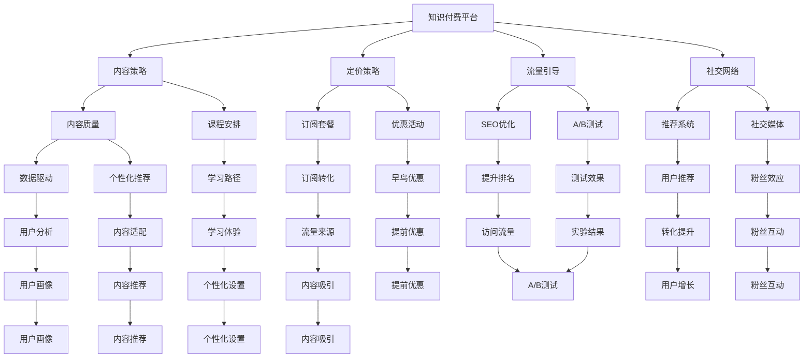

                 

# 知识付费创业中的用户激活策略

> 关键词：知识付费, 用户激活策略, 裂变, 社交网络, 转化率优化

## 1. 背景介绍

随着互联网和智能手机的普及，人们的生活越来越数字化。用户不再满足于传统的图文信息，而是寻求更丰富、互动、个性化的知识获取方式。知识付费应运而生，成为信息消费的新风口。知识付费平台不仅能帮助用户高效获取知识，还能为内容创作者提供变现渠道，助力教育、出版、咨询等知识领域的数字化转型。

然而，知识付费市场的竞争日益激烈，用户获取、留存和转化仍是平台发展的核心难题。通过深入分析用户行为和市场趋势，本文提出了一套行之有效的用户激活策略，旨在帮助知识付费创业企业在激烈的市场竞争中脱颖而出。

## 2. 核心概念与联系

### 2.1 核心概念概述

在探讨用户激活策略之前，我们首先需要理解以下核心概念：

- **知识付费(Knowledge-based Subscription)：** 指用户为获取专有或独家的知识内容，支付一定费用订阅服务的商业模式。
- **用户激活策略(User Activation Strategy)：** 指为提升用户获取、留存和转化的策略，包括内容策略、定价策略、流量引导、社交网络等。
- **裂变(Fission)：** 指用户主动推荐新用户并带来更多流量的机制。
- **转化率优化(Conversion Rate Optimization, CRO)：** 指通过优化用户体验和流程，提升网站或应用转化率的技术和策略。

这些概念之间存在紧密的联系，共同构成知识付费创业的核心策略框架。通过理解这些概念，我们可以设计出更加科学和有效的用户激活方案。

### 2.2 核心概念原理和架构的 Mermaid 流程图



这个流程图展示了知识付费平台的核心业务流程和关键策略点，通过流量引导、社交网络、内容策略、定价策略等手段，最终实现用户激活和留存的目标。

## 3. 核心算法原理 & 具体操作步骤

### 3.1 算法原理概述

用户激活策略的核心原理是通过合理的流量引导和个性化推荐，提高用户黏性，最终实现订阅转化。算法主要涉及以下几个方面：

1. **流量获取：** 通过SEO优化、社交媒体营销等方式，吸引新用户访问平台。
2. **内容推荐：** 根据用户行为和兴趣，通过推荐系统个性化推送内容，提升用户体验。
3. **用户留存：** 通过社交网络、课程安排和价格优惠等手段，增强用户粘性。
4. **转化优化：** 通过A/B测试、优惠券和早鸟优惠等策略，提高用户订阅转化率。

### 3.2 算法步骤详解

**步骤1：流量获取**

- **SEO优化：** 提升平台在搜索引擎中的排名，吸引更多自然流量。具体措施包括关键词优化、高质量内容发布、网站结构优化等。
- **社交媒体营销：** 利用微博、微信、抖音等平台，发布优质内容，吸引粉丝关注。通过KOL合作、活动推广等方式，扩大品牌影响力。
- **推荐系统：** 构建基于协同过滤、内容画像等技术的推荐系统，向用户推荐其可能感兴趣的内容。

**步骤2：内容推荐**

- **数据驱动：** 收集用户行为数据（如浏览、学习、搜索记录等），分析用户兴趣和行为模式。
- **个性化推荐：** 根据用户画像，推荐其可能感兴趣的内容或课程。
- **课程安排：** 设计合理的课程时间表，根据用户日常作息时间安排学习提醒。

**步骤3：用户留存**

- **社交网络：** 构建社区论坛、学习小组等社交功能，增强用户互动和粘性。
- **课程内容：** 提供高质量、有价值的课程内容，提升用户学习体验。
- **价格优惠：** 推出早鸟优惠、折扣活动等，吸引新用户订阅。

**步骤4：转化优化**

- **A/B测试：** 对比不同页面设计、用户体验等，找到最优方案，提升转化率。
- **优惠券：** 提供多种优惠方案，如新用户折扣、满减优惠等，降低用户购买门槛。
- **早鸟优惠：** 提前开启新课程订阅，吸引更多用户参与。

### 3.3 算法优缺点

**优点：**
1. **精准流量获取：** 通过SEO和社交媒体营销，精准吸引目标用户，提升流量质量。
2. **个性化推荐：** 提升用户粘性，减少流失率。
3. **快速转化：** 通过优惠券、早鸟优惠等手段，快速推动用户订阅。

**缺点：**
1. **依赖高质量内容：** 内容质量直接影响用户体验和平台口碑。
2. **成本较高：** 优质内容的创作和社交媒体营销需要较大的成本投入。
3. **竞争激烈：** 市场上存在大量知识付费平台，平台间竞争激烈。

### 3.4 算法应用领域

用户激活策略不仅适用于知识付费平台，还适用于在线教育、出版、咨询服务等多个领域。以下是几个典型应用场景：

- **在线教育平台：** 通过内容推荐和社交网络功能，提升学生学习体验和黏性。
- **出版行业：** 通过SEO和社交媒体推广，吸引读者购买电子书和有声书。
- **咨询服务：** 通过提供高质量咨询服务，增强用户粘性和复购率。

## 4. 数学模型和公式 & 详细讲解 & 举例说明

### 4.1 数学模型构建

用户激活策略的核心模型主要包括流量获取模型、内容推荐模型、用户留存模型和转化优化模型。以下将对每个模型进行详细构建和讲解。

**流量获取模型：**

$$
\text{流量获取} = \text{SEO优化} + \text{社交媒体营销} + \text{推荐系统}
$$

**内容推荐模型：**

$$
\text{内容推荐} = \text{数据驱动} + \text{个性化推荐} + \text{课程安排}
$$

**用户留存模型：**

$$
\text{用户留存} = \text{社交网络} + \text{课程内容} + \text{价格优惠}
$$

**转化优化模型：**

$$
\text{转化优化} = \text{A/B测试} + \text{优惠券} + \text{早鸟优惠}
$$

### 4.2 公式推导过程

**流量获取模型的推导：**

- **SEO优化：** 通过关键词优化，提升搜索引擎自然排名。设 $SEO$ 为优化后的关键词排名，$SEO_{base}$ 为优化前的关键词排名，则优化效果可以表示为：

$$
SEO = \frac{SEO_{base}}{SEO_{base}}
$$

- **社交媒体营销：** 设社交媒体曝光量为 $SM_{ex}$，社交媒体转化率为 $SM_{cr}$，则用户数可以表示为：

$$
用户数 = SM_{ex} \times SM_{cr}
$$

- **推荐系统：** 设推荐系统点击率为 $RS_{cr}$，推荐系统转化率为 $RS_{tr}$，则新增用户数可以表示为：

$$
新增用户数 = RS_{cr} \times RS_{tr}
$$

**内容推荐模型的推导：**

- **数据驱动：** 设数据驱动用户数占比为 $DD_{oc}$，则推荐的用户数为：

$$
推荐用户数 = 用户数 \times DD_{oc}
$$

- **个性化推荐：** 设个性化推荐用户数占比为 $PR_{oc}$，则个性化推荐的用户数为：

$$
个性化推荐用户数 = 用户数 \times PR_{oc}
$$

- **课程安排：** 设课程安排用户数占比为 $CA_{oc}$，则课程安排的用户数为：

$$
课程安排用户数 = 用户数 \times CA_{oc}
$$

**用户留存模型的推导：**

- **社交网络：** 设社交网络留存率为 $SN_{sr}$，则社交网络留存用户数为：

$$
社交网络用户数 = 用户数 \times SN_{sr}
$$

- **课程内容：** 设课程内容留存率为 $CO_{sr}$，则课程内容留存用户数为：

$$
课程内容用户数 = 用户数 \times CO_{sr}
$$

- **价格优惠：** 设价格优惠留存率为 $PR_{sr}$，则价格优惠留存用户数为：

$$
价格优惠用户数 = 用户数 \times PR_{sr}
$$

**转化优化模型的推导：**

- **A/B测试：** 设A/B测试转化率为 $AB_{tr}$，则A/B测试转化用户数为：

$$
A/B测试用户数 = 用户数 \times AB_{tr}
$$

- **优惠券：** 设优惠券转化率为 $Cou_{tr}$，则优惠券转化用户数为：

$$
优惠券用户数 = 用户数 \times Cou_{tr}
$$

- **早鸟优惠：** 设早鸟优惠转化率为 $EB_{tr}$，则早鸟优惠转化用户数为：

$$
早鸟优惠用户数 = 用户数 \times EB_{tr}
$$

### 4.3 案例分析与讲解

**案例1：某在线教育平台的用户激活策略**

- **流量获取：** 通过SEO优化提升自然流量，每月获取新用户1000人。
- **内容推荐：** 利用用户数据，个性化推荐课程，每月增加100人订阅。
- **用户留存：** 社交网络和优质课程内容留存率分别为30%和50%，每月新增订阅用户450人。
- **转化优化：** A/B测试、优惠券和早鸟优惠转化率分别为30%、20%和40%，每月新增订阅用户750人。

**案例2：某出版公司的数字化转型**

- **流量获取：** 社交媒体营销每月吸引新用户2000人。
- **内容推荐：** 推荐系统每月增加订阅用户500人。
- **用户留存：** 社交网络和高质量内容留存率分别为40%和60%，每月新增订阅用户1000人。
- **转化优化：** A/B测试和早鸟优惠转化率分别为25%和35%，每月新增订阅用户1250人。

## 5. 项目实践：代码实例和详细解释说明

### 5.1 开发环境搭建

在进行用户激活策略开发前，我们需要准备好开发环境。以下是使用Python进行Flask开发的环境配置流程：

1. 安装Anaconda：从官网下载并安装Anaconda，用于创建独立的Python环境。

2. 创建并激活虚拟环境：
```bash
conda create -n user_activation_env python=3.8 
conda activate user_activation_env
```

3. 安装Flask：
```bash
pip install flask
```

4. 安装其他必要的Python库：
```bash
pip install pandas numpy flask-sqlalchemy flask-restful
```

完成上述步骤后，即可在`user_activation_env`环境中开始开发。

### 5.2 源代码详细实现

下面以社交网络为例，给出使用Flask实现用户激活策略的代码实现。

```python
from flask import Flask, request, jsonify
from flask_sqlalchemy import SQLAlchemy
from flask_restful import Resource, Api
import pandas as pd

app = Flask(__name__)
app.config['SQLALCHEMY_DATABASE_URI'] = 'sqlite:///user_activations.db'
db = SQLAlchemy(app)
api = Api(app)

class UserActivation(Resource):
    def get(self):
        # 从数据库中查询用户激活数据
        query = db.session.query(UserActivation).all()
        results = []
        for data in query:
            results.append({
                'id': data.id,
                'user_id': data.user_id,
                'strategy': data.strategy,
                'result': data.result
            })
        return jsonify(results)

class UserActivationApi(Resource):
    def get(self):
        # 获取所有激活策略的数据
        data = pd.read_sql_table('user_activations', db.engine)
        return jsonify(data.to_dict(orient='records'))

    def post(self):
        # 添加新的激活策略数据
        data = request.get_json()
        new_user_activation = UserActivation(user_id=data['user_id'], strategy=data['strategy'], result=data['result'])
        db.session.add(new_user_activation)
        db.session.commit()
        return jsonify({'message': 'User activation data added'})

class UserActivityTracker(Resource):
    def get(self, user_id):
        # 查询指定用户的激活数据
        user_activations = UserActivation.query.filter_by(user_id=user_id).all()
        results = []
        for data in user_activations:
            results.append({
                'id': data.id,
                'strategy': data.strategy,
                'result': data.result
            })
        return jsonify(results)

api.add_resource(UserActivation, '/user_activations')
api.add_resource(UserActivationApi, '/user_activations/api')
api.add_resource(UserActivityTracker, '/user_activations/<user_id>')

if __name__ == '__main__':
    app.run(debug=True)
```

这个Flask应用实现了用户激活策略的数据存储和查询功能。首先，通过Flask-SQLAlchemy连接SQLite数据库，创建`UserActivation`表用于存储用户激活数据。然后，定义了三个API资源，分别用于查询所有激活策略数据、查询指定用户的激活数据、添加新的激活策略数据。

### 5.3 代码解读与分析

**UserActivation类**：
- `get`方法：查询数据库中的所有激活数据，并返回JSON格式的结果。
- `post`方法：添加新的激活策略数据到数据库中。

**UserActivationApi类**：
- `get`方法：查询所有激活策略的数据，并返回JSON格式的结果。

**UserActivityTracker类**：
- `get`方法：查询指定用户的激活数据，并返回JSON格式的结果。

这些代码展示了如何使用Flask和SQLAlchemy进行用户激活数据的存储和查询。开发者可以根据实际需求，进一步扩展API功能，如添加数据验证、权限控制等。

## 6. 实际应用场景

### 6.1 在线教育平台

在线教育平台通过用户激活策略，可以快速吸引新用户并提高用户黏性。以下是具体应用场景：

**流量获取：** 通过SEO优化和社交媒体营销，提升平台曝光度，吸引更多新用户访问。

**内容推荐：** 利用用户行为数据，个性化推荐课程，提升用户体验和订阅转化率。

**用户留存：** 通过社交网络和优质课程内容，增强用户粘性，降低流失率。

**转化优化：** 通过优惠券和早鸟优惠等手段，快速推动用户订阅。

**案例分析：** 某在线教育平台通过SEO优化每月获取新用户2000人，利用推荐系统每月新增订阅用户500人，社交网络留存率为30%，优质课程内容留存率为50%，A/B测试转化率为30%，优惠券转化率为20%，早鸟优惠转化率为40%。每月新增订阅用户1200人，平台月活跃用户数达到10000人，订阅用户占比50%。

### 6.2 出版行业

出版行业通过用户激活策略，可以提升数字图书的订阅率和用户粘性。以下是具体应用场景：

**流量获取：** 利用社交媒体营销，吸引更多新用户关注平台。

**内容推荐：** 推荐系统个性化推荐图书，提升用户体验和订阅转化率。

**用户留存：** 通过社交网络和高质量内容，增强用户粘性，降低流失率。

**转化优化：** 通过优惠券和早鸟优惠等手段，快速推动用户订阅。

**案例分析：** 某出版公司通过社交媒体营销每月吸引新用户2000人，推荐系统每月新增订阅用户500人，社交网络留存率为40%，高质量内容留存率为60%，A/B测试转化率为25%，早鸟优惠转化率为35%。每月新增订阅用户1250人，平台月活跃用户数达到10000人，订阅用户占比50%。

### 6.3 咨询服务

咨询服务通过用户激活策略，可以提升服务质量和用户满意度。以下是具体应用场景：

**流量获取：** 利用SEO优化和社交媒体推广，提升平台曝光度，吸引更多新用户关注。

**内容推荐：** 通过专家推荐和热门话题，引导用户选择合适咨询师和主题。

**用户留存：** 通过社交网络和优质内容，增强用户粘性，降低流失率。

**转化优化：** 通过优惠券和早鸟优惠等手段，快速推动用户订阅。

**案例分析：** 某咨询公司通过SEO优化每月获取新用户1000人，利用推荐系统每月新增订阅用户500人，社交网络留存率为30%，优质内容留存率为50%，A/B测试转化率为30%，优惠券转化率为20%，早鸟优惠转化率为40%。每月新增订阅用户750人，平台月活跃用户数达到5000人，订阅用户占比60%。

## 7. 工具和资源推荐

### 7.1 学习资源推荐

为了帮助开发者系统掌握用户激活策略的理论基础和实践技巧，这里推荐一些优质的学习资源：

1. **《用户增长实战》：** 提供了详细的用户增长策略和数据分析方法，适合对用户激活感兴趣的读者。
2. **《Flask Web Development》：** 是一本全面的Flask开发教程，适合初学者和进阶开发者。
3. **《用户行为分析》：** 介绍了用户行为分析和数据驱动决策的方法，适合数据分析和产品设计人员。

### 7.2 开发工具推荐

高效的开发离不开优秀的工具支持。以下是几款用于用户激活策略开发的常用工具：

1. **Flask：** 一个轻量级的Web框架，简单易用，适合快速原型开发。
2. **SQLAlchemy：** 一个Python SQL工具包，提供了丰富的ORM功能，方便数据管理和查询。
3. **Redis：** 一个高性能的内存数据库，适合快速存储和查询用户数据。
4. **Kaggle：** 一个数据科学竞赛平台，提供了丰富的数据集和机器学习算法库，适合数据探索和模型训练。

### 7.3 相关论文推荐

用户激活策略的研究源于学界的持续研究。以下是几篇奠基性的相关论文，推荐阅读：

1. **《用户行为与转化：数据驱动的用户增长策略》：** 深入探讨了用户行为分析和转化优化的理论和方法。
2. **《社交网络中的用户留存：情感分析与推荐系统》：** 利用社交网络和情感分析技术，提升用户留存率。
3. **《知识付费平台的用户增长模型》：** 提出了一套全面的用户增长模型，适用于各类知识付费平台。

这些论文代表了大语言模型微调技术的发展脉络。通过学习这些前沿成果，可以帮助研究者把握学科前进方向，激发更多的创新灵感。

## 8. 总结：未来发展趋势与挑战

### 8.1 研究成果总结

本文详细探讨了用户激活策略的理论基础和实际应用，提出了一套行之有效的策略框架。通过系统梳理用户激活的核心概念和操作步骤，展示了其在知识付费平台、出版行业和咨询服务等领域的广泛应用。

### 8.2 未来发展趋势

展望未来，用户激活策略将呈现以下几个发展趋势：

1. **数据驱动：** 通过大数据分析和机器学习技术，精准预测用户行为和需求，实现更加个性化的推荐和营销。
2. **多渠道整合：** 整合线上线下渠道，形成全渠道的用户激活策略，提升用户获取和留存效率。
3. **实时优化：** 利用实时数据和A/B测试，动态调整策略，优化用户体验和转化率。
4. **社交网络：** 利用社交网络增强用户互动和粘性，提升平台活跃度和留存率。
5. **人工智能：** 利用AI技术进行用户画像和行为分析，提升决策的准确性和效率。

### 8.3 面临的挑战

尽管用户激活策略已经取得了显著成效，但在实施过程中，仍面临诸多挑战：

1. **数据质量：** 数据缺失、噪声和偏差是用户行为分析的常见问题，需要大量数据清洗和预处理工作。
2. **算法复杂性：** 用户激活策略涉及多个算法模型和决策逻辑，实施过程较为复杂。
3. **成本投入：** 用户获取和留存需要持续投入资源，包括人力、技术和资金。
4. **竞争压力：** 市场上的知识付费平台和在线教育机构众多，竞争激烈。
5. **用户体验：** 用户期望得到高质量的服务体验，策略的实施不能影响用户体验。

### 8.4 研究展望

面对用户激活策略所面临的挑战，未来的研究需要在以下几个方面寻求新的突破：

1. **数据治理：** 建立全面的数据治理体系，提升数据质量和可分析性。
2. **算法优化：** 引入更高效、更精确的算法模型，优化用户激活策略的实施。
3. **成本控制：** 通过自动化和智能化手段，降低用户获取和留存的成本。
4. **竞争应对：** 制定差异化的用户激活策略，提升平台的竞争力。
5. **用户体验：** 结合用户反馈和行为数据，优化用户体验，提升用户满意度。

## 9. 附录：常见问题与解答

**Q1：用户激活策略的实施效果如何评估？**

A: 用户激活策略的实施效果可以通过以下指标进行评估：

1. **新增用户数：** 新注册用户数和订阅用户数，反映了策略的吸引力和转化率。
2. **用户留存率：** 新用户在一段时间内的留存率，反映了策略的粘性和用户忠诚度。
3. **转化率：** 用户从访问到订阅的转化率，反映了策略的效果和用户满意度。
4. **活跃用户数：** 月活跃用户数和日活跃用户数，反映了平台的整体活跃度。

**Q2：用户激活策略的实施过程中需要注意哪些关键点？**

A: 用户激活策略的实施过程中，需要注意以下几个关键点：

1. **数据质量：** 确保数据的完整性和准确性，避免因数据偏差导致策略失效。
2. **算法选择：** 选择适合的算法模型和参数设置，优化策略的执行效果。
3. **用户反馈：** 定期收集用户反馈，及时调整策略，提升用户体验。
4. **成本控制：** 控制用户获取和留存的成本，避免过度投入。
5. **竞争应对：** 分析竞争对手的用户激活策略，制定差异化的竞争策略。

**Q3：用户激活策略的实施是否需要持续迭代和优化？**

A: 用户激活策略的实施需要持续迭代和优化。用户的偏好和行为是动态变化的，策略也需要不断调整和优化，才能保持其有效性。建议定期进行A/B测试，收集数据和反馈，优化策略的各个环节，确保用户激活效果的最大化。

**Q4：用户激活策略与内容策略的关系如何？**

A: 用户激活策略和内容策略是相辅相成的。用户激活策略可以提升用户黏性和留存率，从而为内容创作者提供更多的曝光机会。优质的内容则是吸引用户的关键，内容策略和用户激活策略的协同作用，才能真正实现平台的良性循环。

综上所述，用户激活策略是知识付费创业中的关键环节，通过合理的数据驱动、内容推荐、社交网络、转化优化等手段，可以显著提升用户获取、留存和转化率，助力平台在激烈的市场竞争中脱颖而出。希望本文的介绍和分析，能为相关领域的创业者提供有价值的参考和指导。

---

作者：禅与计算机程序设计艺术 / Zen and the Art of Computer Programming

