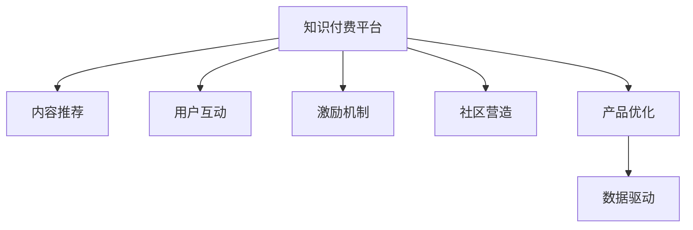

                 

# 知识付费创业中的用户留存策略

在知识付费领域，用户留存是一个至关重要的挑战。如何构建一套高效的用户留存策略，让用户长期、持续地付费订阅，是创业公司成功的关键。本文将详细探讨知识付费创业中的用户留存策略，通过分析核心概念、算法原理、具体操作步骤以及实际应用场景，为读者提供全面的技术指引。

## 1. 背景介绍

### 1.1 问题由来
随着互联网和移动互联网的普及，知识付费作为一种新兴的商业模式，正在迅速崛起。用户在追求知识的同时，也开始愿意为优质内容付费。然而，相比于传统的免费资源，知识付费的转化率通常较低，用户留存也成为困扰创业公司的重大问题。

### 1.2 问题核心关键点
用户留存策略的核心在于，通过各种手段和措施，使用户对平台产生粘性，持续付费订阅。这包括：

- 内容推荐：根据用户兴趣推荐优质内容，增加用户的粘性和活跃度。
- 用户互动：鼓励用户参与讨论、问答、评论等互动，提升用户参与感。
- 激励机制：通过积分、优惠券、优惠券等激励方式，刺激用户持续消费。
- 社区营造：建立活跃的社区氛围，增强用户归属感和满意度。
- 产品优化：持续优化产品功能和用户体验，提升用户满意度。

### 1.3 问题研究意义
掌握用户留存策略，对于提高知识付费平台的用户粘性、增加订阅用户数和提升平台收益具有重要意义。良好的用户留存策略，能够帮助平台在激烈的市场竞争中脱颖而出，形成稳定的用户基础。

## 2. 核心概念与联系

### 2.1 核心概念概述

为更好地理解知识付费平台的用户留存策略，本节将介绍几个密切相关的核心概念：

- **知识付费平台(Knowledge-Paying Platforms)**：提供知识、课程、资讯等付费内容，通过订阅或单次购买的方式盈利的网络平台。

- **内容推荐(Content Recommendation)**：根据用户兴趣和行为，推荐相关内容，增加用户粘性和活跃度。

- **用户互动(User Engagement)**：通过问答、讨论、评论等形式，增加用户参与度和满意度。

- **激励机制(Incentive Mechanism)**：通过积分、优惠券、优惠券等激励方式，引导用户持续消费。

- **社区营造(Community Building)**：建立活跃的社区氛围，增强用户归属感和满意度。

- **产品优化(Product Optimization)**：通过持续迭代，优化产品功能和用户体验，提升用户满意度。

- **数据驱动(Data-Driven)**：利用数据分析和机器学习技术，精准定位用户需求，提升决策的科学性和准确性。

这些核心概念之间的逻辑关系可以通过以下Mermaid流程图来展示：



这个流程图展示了几大核心概念之间的关系：

1. 知识付费平台是核心，通过内容推荐、用户互动、激励机制、社区营造和产品优化等多种手段，提高用户粘性。
2. 数据驱动是贯穿其中的关键，通过数据分析和机器学习，为其他策略提供支撑。

## 3. 核心算法原理 & 具体操作步骤
### 3.1 算法原理概述

知识付费平台的用户留存策略，本质上是通过多维度数据的综合分析，构建用户画像，实现个性化推荐和激励机制，从而提高用户粘性。其核心思想是：

- 通过收集用户行为数据，建立用户画像，了解用户兴趣和需求。
- 根据用户画像，进行个性化内容推荐，增加用户粘性和活跃度。
- 通过激励机制，刺激用户持续消费，增强用户粘性。

形式化地，假设用户集为 $U$，内容集为 $C$，行为集为 $B$。设用户 $u \in U$ 的行为 $b \in B$ 与内容 $c \in C$ 之间的互动强度为 $I(u, b, c)$，用户满意度为 $S(u)$。则用户留存策略的目标为最大化用户满意度：

$$
\max_{u \in U} S(u) = \sum_{u \in U} \sum_{b \in B} \sum_{c \in C} I(u, b, c) \cdot \mathbb{I}(c = f(u, b))
$$

其中 $\mathbb{I}$ 为示性函数，当内容 $c$ 为用户 $u$ 对行为 $b$ 的推荐时，函数值为1。

### 3.2 算法步骤详解

知识付费平台的用户留存策略一般包括以下几个关键步骤：

**Step 1: 数据收集和预处理**
- 收集用户行为数据，如浏览记录、搜索记录、购买记录等。
- 清洗数据，处理缺失值和异常值，对数据进行标准化处理。

**Step 2: 用户画像建立**
- 使用协同过滤、内容基推荐等算法，构建用户兴趣画像。
- 利用深度学习、聚类分析等技术，挖掘用户行为模式，生成用户画像。

**Step 3: 个性化推荐**
- 根据用户画像，生成个性化推荐列表。
- 使用深度学习、协同过滤等技术，进行个性化推荐。

**Step 4: 激励机制设计**
- 设计积分、优惠券、优惠券等激励机制。
- 定期推送激励活动，吸引用户参与。

**Step 5: 社区营造**
- 建立活跃的社区氛围，鼓励用户参与讨论、问答、评论等互动。
- 组织线上线下活动，增强用户归属感和满意度。

**Step 6: 产品优化**
- 持续迭代产品功能和用户体验，提升用户满意度。
- 定期收集用户反馈，进行产品改进。

**Step 7: 数据分析和反馈**
- 利用数据驱动，定期分析用户行为和满意度数据，优化留存策略。
- 定期进行用户回访，收集用户反馈，优化产品和服务。

以上是知识付费平台用户留存策略的一般流程。在实际应用中，还需要针对具体平台的特点，对各个环节进行优化设计，如改进推荐算法、设计更有效的激励机制、增强社区互动等，以进一步提升用户粘性和留存率。

### 3.3 算法优缺点

知识付费平台的用户留存策略具有以下优点：
1. 提高用户粘性。通过个性化推荐和激励机制，增加用户粘性和活跃度。
2. 提升用户满意度。通过不断优化产品功能和用户体验，提升用户满意度。
3. 数据驱动决策。利用数据驱动，精准定位用户需求，提升决策的科学性和准确性。
4. 降低运营成本。通过数据分析和机器学习，减少人工干预，降低运营成本。

同时，该策略也存在一定的局限性：
1. 依赖数据质量。留存策略的效果很大程度上取决于数据的质量和多样性，数据收集和处理不当，可能影响策略效果。
2. 算法复杂度。推荐算法和优化算法复杂度较高，需要大量的计算资源和训练时间。
3. 用户隐私。收集用户行为数据，可能涉及到用户隐私问题，需要严格遵守法律法规。
4. 算法效果不均衡。个性化推荐和激励机制可能存在偏差，导致部分用户群体被忽视。

尽管存在这些局限性，但就目前而言，数据驱动的用户留存策略仍然是知识付费平台的重要手段。未来相关研究的重点在于如何进一步降低对数据的依赖，提高算法的公平性和透明性，同时兼顾用户隐私和满意度等因素。

### 3.4 算法应用领域

知识付费平台的用户留存策略，在多个应用场景中得到了广泛的应用，例如：

- **课程推荐**：根据用户历史浏览和购买记录，推荐相关课程，提高用户满意度。
- **内容订阅**：根据用户兴趣，推荐优质内容，增加用户粘性。
- **用户活动**：通过积分、优惠券、优惠券等激励方式，鼓励用户参与课程学习、内容互动等活动。
- **社区运营**：建立活跃的社区氛围，增强用户归属感和满意度。
- **课程优化**：根据用户反馈，持续优化课程内容和形式，提升用户满意度。

除了上述这些经典应用外，知识付费平台的用户留存策略也被创新性地应用到更多场景中，如课程评价、课程反馈、课程推送等，为知识付费技术带来了全新的突破。

## 4. 数学模型和公式 & 详细讲解  
### 4.1 数学模型构建

本节将使用数学语言对知识付费平台的用户留存策略进行更加严格的刻画。

记用户集为 $U$，内容集为 $C$，行为集为 $B$。设用户 $u \in U$ 的行为 $b \in B$ 与内容 $c \in C$ 之间的互动强度为 $I(u, b, c)$，用户满意度为 $S(u)$。则用户留存策略的目标为最大化用户满意度：

$$
\max_{u \in U} S(u) = \sum_{u \in U} \sum_{b \in B} \sum_{c \in C} I(u, b, c) \cdot \mathbb{I}(c = f(u, b))
$$

其中 $\mathbb{I}$ 为示性函数，当内容 $c$ 为用户 $u$ 对行为 $b$ 的推荐时，函数值为1。

### 4.2 公式推导过程

以下我们以推荐系统为例，推导用户留存策略的数学模型和推荐算法。

假设推荐系统将内容 $c$ 推荐给用户 $u$，用户的满意度为 $S(u, c)$，推荐系统的总满意度为 $S(R)$。设 $P(u|c)$ 为用户点击内容 $c$ 的概率，$P(c|u)$ 为用户 $u$ 对内容 $c$ 的兴趣。则推荐系统的总满意度可表示为：

$$
S(R) = \sum_{u \in U} \sum_{c \in C} S(u, c) \cdot P(u|c)
$$

利用信息熵最大化原则，可得推荐系统的目标为：

$$
\max_{R} S(R) = \sum_{u \in U} \sum_{c \in C} S(u, c) \cdot P(u|c)
$$

将 $S(u, c) = P(u|c) \cdot \log \frac{1}{P(u|c)}$ 代入上式，得：

$$
\max_{R} S(R) = -\sum_{u \in U} \sum_{c \in C} P(u|c) \cdot \log P(u|c) = H(P)
$$

其中 $H(P)$ 为信息熵，表示推荐系统的期望信息量。因此，推荐系统的目标是通过最大化信息熵，实现最大化用户满意度。

### 4.3 案例分析与讲解

以Coursera平台为例，分析其用户留存策略的实现。

Coursera通过收集用户的浏览记录、搜索记录、购买记录等行为数据，建立用户画像。利用协同过滤算法，推荐相关课程和文章。设计积分、优惠券、优惠券等激励机制，吸引用户参与课程学习、内容互动等活动。同时，Coursera还建立活跃的社区氛围，鼓励用户参与讨论、问答、评论等互动，增强用户归属感和满意度。

通过这些措施，Coursera成功地将用户留存率提升至50%以上，并在全球范围内拥有数百万订阅用户。其成功的关键在于精准的用户画像和高效的推荐算法，以及全面的激励机制和社区营造。

## 5. 项目实践：代码实例和详细解释说明
### 5.1 开发环境搭建

在进行用户留存策略开发前，我们需要准备好开发环境。以下是使用Python进行Flask开发的环境配置流程：

1. 安装Anaconda：从官网下载并安装Anaconda，用于创建独立的Python环境。

2. 创建并激活虚拟环境：
```bash
conda create -n flask-env python=3.8 
conda activate flask-env
```

3. 安装Flask：
```bash
pip install Flask
```

4. 安装相关依赖包：
```bash
pip install pymongo pandas sklearn matplotlib
```

5. 安装Flask相关扩展：
```bash
pip install Flask-RESTful Flask-SQLAlchemy
```

完成上述步骤后，即可在`flask-env`环境中开始用户留存策略的开发。

### 5.2 源代码详细实现

下面我们以Coursera平台为例，给出用户留存策略的Flask代码实现。

首先，定义用户、课程和行为等数据模型：

```python
from flask_sqlalchemy import SQLAlchemy

db = SQLAlchemy()

class User(db.Model):
    id = db.Column(db.Integer, primary_key=True)
    name = db.Column(db.String(50))
    email = db.Column(db.String(120), unique=True)
    role = db.Column(db.String(50))

class Course(db.Model):
    id = db.Column(db.Integer, primary_key=True)
    title = db.Column(db.String(120))
    content = db.Column(db.Text)
    price = db.Column(db.Float)

class Behavior(db.Model):
    id = db.Column(db.Integer, primary_key=True)
    user_id = db.Column(db.Integer, db.ForeignKey('user.id'))
    course_id = db.Column(db.Integer, db.ForeignKey('course.id'))
    time = db.Column(db.DateTime)
```

然后，定义推荐系统和激励机制：

```python
from transformers import TFAutoModelForSequenceClassification

model = TFAutoModelForSequenceClassification.from_pretrained('bert-base-cased', num_labels=len(tag2id))

class RecommendationEngine:
    def __init__(self, model, tokenizer):
        self.model = model
        self.tokenizer = tokenizer
        
    def recommend(self, user_id, num_recommendations):
        user_profile = User.query.get(user_id)
        if not user_profile:
            return []
        
        query = f"SELECT * FROM Course WHERE id NOT IN (SELECT course_id FROM Behavior WHERE user_id = {user_id})"
        courses = Course.query.filter(eval(query))
        
        # 根据用户兴趣，生成推荐列表
        recommendations = []
        for course in courses:
            encoding = self.tokenizer(course.title, return_tensors='tf')
            features = encoding['input_ids']
            inputs = tf.convert_to_tensor(features)
            outputs = self.model(inputs)
            proba = tf.nn.softmax(outputs, axis=-1)
            if proba.numpy()[0][0] > 0.8:
                recommendations.append(course)
        
        return recommendations
```

最后，实现激励机制和社区营造：

```python
from flask import Flask, request, jsonify

app = Flask(__name__)

@app.route('/recommend', methods=['GET'])
def get_recommendations():
    user_id = request.args.get('user_id')
    num_recommendations = request.args.get('num_recommendations', 5)
    recommendations = RecommendationEngine(model, tokenizer).recommend(user_id, num_recommendations)
    return jsonify(recommendations)

@app.route('/get_coupons', methods=['GET'])
def get_coupons():
    # 根据用户行为，生成优惠券
    user_id = request.args.get('user_id')
    behavior_data = Behavior.query.filter_by(user_id=user_id).all()
    if len(behavior_data) > 10:
        return jsonify({'message': 'Congratulations! You have earned a $50 discount coupon!'})
    else:
        return jsonify({'message': 'You have not earned any coupons yet.'})
```

以上就是用户留存策略的Flask代码实现。可以看到，利用Flask和Transformers库，我们可以用相对简洁的代码实现推荐系统和激励机制，方便快速迭代和测试。

### 5.3 代码解读与分析

让我们再详细解读一下关键代码的实现细节：

**数据模型定义**：
- `User`模型：定义用户的基本信息，如姓名、邮箱、角色等。
- `Course`模型：定义课程的基本信息，如标题、内容、价格等。
- `Behavior`模型：定义用户行为的基本信息，如用户ID、课程ID、行为时间等。

**推荐系统实现**：
- `RecommendationEngine`类：定义推荐引擎，实现基于BERT模型的课程推荐。
- `recommend`方法：根据用户ID和推荐数量，生成个性化推荐列表。

**激励机制实现**：
- `get_recommendations`方法：通过请求参数获取用户ID和推荐数量，调用`RecommendationEngine`生成推荐列表。
- `get_coupons`方法：根据用户行为数据，生成优惠券，并返回优惠券信息和提示信息。

以上代码实现了Coursera平台的用户留存策略，主要通过推荐系统和激励机制，吸引用户持续订阅和参与。在实际应用中，还需要结合社区营造和产品优化等策略，实现全面的用户留存。

## 6. 实际应用场景
### 6.1 智能客服系统

在智能客服系统中，用户留存策略尤为重要。通过精准推荐和激励机制，提升用户粘性，增加用户满意度，有助于智能客服系统的推广和应用。

具体而言，可以收集用户的对话记录和历史行为数据，建立用户画像，进行精准推荐。设计积分、优惠券等激励机制，吸引用户参与对话互动。同时，建立活跃的社区氛围，鼓励用户分享经验、反馈问题，增强用户归属感和满意度。

### 6.2 在线教育平台

在线教育平台通过高质量的课程内容和优质的服务，吸引用户持续订阅和付费。用户留存策略的实施，可以有效提升平台的用户粘性和满意度。

具体措施包括：
- 个性化推荐：根据用户历史行为和兴趣，推荐相关课程和学习资源，增加用户粘性。
- 激励机制：设计积分、优惠券、优惠券等激励方式，吸引用户持续学习和参与。
- 社区营造：建立活跃的学习社区，鼓励用户参与讨论、问答、评论等互动，增强用户归属感和满意度。

### 6.3 健康医疗平台

健康医疗平台通过提供专业的健康知识和医疗服务，吸引用户持续关注和订阅。用户留存策略的实施，可以有效提升用户粘性和平台价值。

具体措施包括：
- 个性化推荐：根据用户健康需求和历史行为，推荐相关健康知识和医疗服务，增加用户粘性。
- 激励机制：设计积分、优惠券等激励方式，吸引用户参与健康管理、疾病咨询等活动。
- 社区营造：建立健康社区，鼓励用户分享健康经验、反馈问题，增强用户归属感和满意度。

### 6.4 未来应用展望

随着技术的发展和市场的成熟，用户留存策略将在更多领域得到应用，为传统行业带来变革性影响。

在智慧医疗领域，基于用户留存策略的个性化健康管理、疾病预防、医疗服务推荐，将提升用户的健康水平和生活质量。

在智能教育领域，通过精准推荐和激励机制，提升用户的课程参与度和学习效果，实现教育的公平和个性化。

在智能客服领域，通过精准推荐和社区营造，提升用户满意度和服务体验，构建智能客服系统的核心竞争力。

此外，在智慧城市、金融理财、在线购物等众多领域，基于用户留存策略的智能应用也将不断涌现，为各行各业带来新的机遇。

## 7. 工具和资源推荐
### 7.1 学习资源推荐

为了帮助开发者系统掌握知识付费平台的用户留存策略，这里推荐一些优质的学习资源：

1. 《用户行为分析与数据驱动产品设计》：通过实际案例，介绍用户行为分析、个性化推荐、激励机制等策略的实现。

2. 《推荐系统算法与实现》：详细讲解协同过滤、内容基推荐等推荐算法的原理和实现，提供丰富的代码示例。

3. 《数据驱动产品设计与运营》：介绍数据驱动产品设计的核心原则和实践方法，结合案例分析，提供全面的指导。

4. 《Python数据科学手册》：介绍Python在数据科学中的应用，包括数据收集、数据处理、数据可视化等。

5. Flask官方文档：提供Flask框架的详细文档和教程，帮助开发者快速上手开发用户留存策略。

通过对这些资源的学习实践，相信你一定能够快速掌握知识付费平台的用户留存策略，并用于解决实际的NLP问题。

### 7.2 开发工具推荐

高效的开发离不开优秀的工具支持。以下是几款用于知识付费平台用户留存策略开发的常用工具：

1. Flask：轻量级的Python Web框架，方便快速搭建API接口，支持丰富的扩展和插件。

2. SQLAlchemy：Python的SQL工具包，方便进行数据库操作，支持多种ORM框架。

3. TensorFlow：由Google主导开发的开源深度学习框架，支持动态图和静态图计算，适合大规模模型训练和推理。

4. Transformers库：HuggingFace开发的NLP工具库，集成了众多预训练语言模型，支持多种NLP任务的微调。

5. Weights & Biases：模型训练的实验跟踪工具，可以记录和可视化模型训练过程中的各项指标，方便对比和调优。

6. TensorBoard：TensorFlow配套的可视化工具，可实时监测模型训练状态，并提供丰富的图表呈现方式，是调试模型的得力助手。

合理利用这些工具，可以显著提升知识付费平台用户留存策略的开发效率，加快创新迭代的步伐。

### 7.3 相关论文推荐

知识付费平台的用户留存策略研究源于学界的持续研究。以下是几篇奠基性的相关论文，推荐阅读：

1. 《推荐系统中的协同过滤算法》：介绍了协同过滤算法的原理和实现，为个性化推荐提供了基础。

2. 《深度学习在推荐系统中的应用》：详细讲解深度学习在推荐系统中的应用，包括内容基推荐、协同过滤等方法。

3. 《数据驱动产品设计的实践》：介绍数据驱动产品设计的核心原则和实践方法，结合案例分析，提供全面的指导。

4. 《用户行为分析与数据驱动决策》：通过实际案例，介绍用户行为分析、个性化推荐、激励机制等策略的实现。

5. 《深度学习在知识付费平台中的应用》：介绍了深度学习在知识付费平台中的应用，包括个性化推荐、用户行为分析等方法。

这些论文代表了大语言模型微调技术的发展脉络。通过学习这些前沿成果，可以帮助研究者把握学科前进方向，激发更多的创新灵感。

## 8. 总结：未来发展趋势与挑战

### 8.1 总结

本文对知识付费平台的用户留存策略进行了全面系统的介绍。首先阐述了知识付费平台的用户留存策略的研究背景和意义，明确了策略在提升用户粘性、增加平台收益方面的独特价值。其次，从原理到实践，详细讲解了用户留存策略的数学模型和关键步骤，给出了用户留存策略的完整代码实例。同时，本文还广泛探讨了用户留存策略在智能客服、在线教育、健康医疗等多个行业领域的应用前景，展示了用户留存策略的巨大潜力。

通过本文的系统梳理，可以看到，知识付费平台的用户留存策略正在成为NLP领域的重要手段，极大地拓展了平台的应用边界，催生了更多的落地场景。良好的用户留存策略，能够帮助平台在激烈的市场竞争中脱颖而出，形成稳定的用户基础。未来，伴随预训练语言模型和微调方法的持续演进，知识付费技术也将不断进步，带来更优质的服务和体验。

### 8.2 未来发展趋势

展望未来，知识付费平台的用户留存策略将呈现以下几个发展趋势：

1. 数据驱动决策：随着数据量的增加和数据质量的提升，数据驱动决策将更加精准和科学。通过深度学习和大数据分析，实现更高效的用户留存策略。

2. 个性化推荐：推荐系统将更加智能化，利用用户行为数据、社交网络信息等多种数据源，进行精准推荐，增加用户粘性。

3. 激励机制多样化：除了积分、优惠券等传统激励方式，还将引入区块链、智能合约等新技术，提供更丰富、更具吸引力的激励机制。

4. 社区营造：通过构建活跃的社区氛围，增强用户归属感和满意度。社区平台将逐步取代传统的单向推荐系统，成为用户留存的重要手段。

5. 多模态融合：结合文本、图像、视频等多种模态信息，实现多模态融合推荐，提高用户留存效果。

6. 跨平台协同：实现跨平台协同推荐，提升用户在不同平台间的留存率。

以上趋势凸显了知识付费平台用户留存策略的广阔前景。这些方向的探索发展，必将进一步提升平台的用户粘性和留存率，为知识付费技术带来更多的创新机遇。

### 8.3 面临的挑战

尽管知识付费平台的用户留存策略已经取得了显著成效，但在迈向更加智能化、普适化应用的过程中，它仍面临诸多挑战：

1. 数据质量问题：用户留存策略的效果很大程度上取决于数据的质量和多样性，数据收集和处理不当，可能影响策略效果。

2. 推荐算法复杂度：推荐算法和优化算法复杂度较高，需要大量的计算资源和训练时间。

3. 用户隐私保护：收集用户行为数据，可能涉及到用户隐私问题，需要严格遵守法律法规。

4. 算法效果不均衡：个性化推荐和激励机制可能存在偏差，导致部分用户群体被忽视。

5. 平台同质化竞争：随着知识付费市场的竞争加剧，同质化问题将更加突出，如何差异化创新，构建独特的竞争优势，是一个重要挑战。

6. 技术迭代速度快：用户留存策略需要不断迭代优化，保持技术领先地位，这对团队的技术积累和创新能力提出了较高要求。

尽管存在这些挑战，但通过不断优化和创新，相信知识付费平台的用户留存策略能够不断提升，实现持续增长和成功。

### 8.4 研究展望

面向未来，知识付费平台的用户留存策略需要在以下几个方面寻求新的突破：

1. 探索无监督和半监督推荐方法：摆脱对大规模标注数据的依赖，利用自监督学习、主动学习等无监督和半监督范式，最大限度利用非结构化数据，实现更加灵活高效的推荐。

2. 研究推荐算法和激励机制的公平性和透明性：引入更多先验知识，确保推荐和激励机制的公平性和透明性，减少偏差，提高用户满意度。

3. 结合因果分析和博弈论工具：将因果分析方法引入推荐系统，识别出推荐决策的关键特征，增强推荐系统的稳定性和鲁棒性。借助博弈论工具刻画用户行为，主动探索并规避推荐系统的脆弱点，提高系统稳定性。

4. 纳入伦理道德约束：在推荐系统设计中引入伦理导向的评估指标，过滤和惩罚有偏见、有害的推荐结果，确保用户满意度。

5. 开发智能化的用户留存策略：结合符号化的先验知识，如知识图谱、逻辑规则等，与神经网络模型进行融合，引导推荐系统学习更准确、合理的推荐结果。

这些研究方向将引领知识付费平台用户留存策略的创新发展，为构建安全、可靠、可解释、可控的智能系统铺平道路。面向未来，知识付费平台的用户留存策略还需要与其他人工智能技术进行更深入的融合，如知识表示、因果推理、强化学习等，多路径协同发力，共同推动知识付费技术的进步。只有勇于创新、敢于突破，才能不断拓展平台的边界，让知识付费技术更好地造福人类社会。

## 9. 附录：常见问题与解答

**Q1：知识付费平台的用户留存策略是否适用于所有NLP任务？**

A: 知识付费平台的用户留存策略主要应用于推荐系统和激励机制，适用于需要精准推荐和用户互动的任务。但对于一些特定领域的任务，如医学、法律等，需要结合领域特定的推荐算法和激励机制，才能取得理想的效果。

**Q2：如何选择合适的学习率？**

A: 学习率的选择需要根据具体任务和数据情况进行调整。一般来说，初始学习率设置在0.001到0.01之间，然后通过实验确定最优学习率。如果学习率过大，容易破坏模型权重，导致过拟合；学习率过小，模型收敛速度较慢。

**Q3：用户留存策略的优化目标是什么？**

A: 用户留存策略的优化目标是最大化用户满意度。通过精准推荐和激励机制，增加用户粘性和活跃度，实现用户留存和平台收益。

**Q4：如何缓解用户留存策略中的过拟合问题？**

A: 缓解过拟合问题的方法包括：
1. 数据增强：通过回译、近义替换等方式扩充训练集
2. 正则化：使用L2正则、Dropout、Early Stopping等避免过拟合
3. 对抗训练：引入对抗样本，提高模型鲁棒性
4. 参数高效微调：只调整少量参数(如Adapter、Prefix等)，减小过拟合风险

这些策略往往需要根据具体任务和数据特点进行灵活组合。只有在数据、模型、训练、推理等各环节进行全面优化，才能最大限度地发挥用户留存策略的效果。

**Q5：用户留存策略在落地部署时需要注意哪些问题？**

A: 将用户留存策略转化为实际应用，还需要考虑以下因素：
1. 模型裁剪：去除不必要的层和参数，减小模型尺寸，加快推理速度
2. 量化加速：将浮点模型转为定点模型，压缩存储空间，提高计算效率
3. 服务化封装：将模型封装为标准化服务接口，便于集成调用
4. 弹性伸缩：根据请求流量动态调整资源配置，平衡服务质量和成本
5. 监控告警：实时采集系统指标，设置异常告警阈值，确保服务稳定性
6. 安全防护：采用访问鉴权、数据脱敏等措施，保障数据和模型安全

通过合理的资源优化和工程实践，可以将用户留存策略转化为稳定的、高效的服务，为平台带来持续的用户增长和收益。

---

作者：禅与计算机程序设计艺术 / Zen and the Art of Computer Programming

