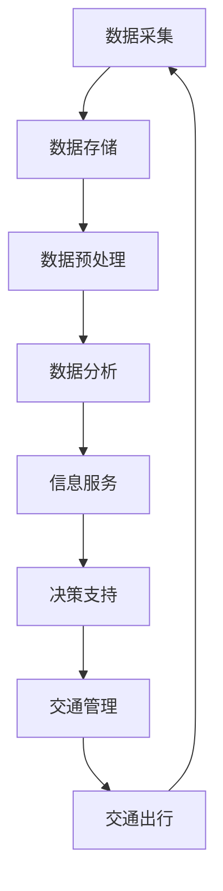

                 

**信息差：大数据在智能交通中的应用**

**作者：禅与计算机程序设计艺术 / Zen and the Art of Computer Programming**

## 1. 背景介绍

智能交通系统（ITS）是利用现代通信、计算机、传感器和控制技术，对交通流量进行实时监测、分析和控制，以提高交通运行效率，减少交通拥堵，降低交通事故发生率的现代化交通管理系统。大数据技术的发展为智能交通系统提供了强大的支撑，通过对海量交通数据的采集、存储、分析和应用，可以帮助交通管理部门和用户更好地理解交通运行规律，提高交通管理水平，改善交通出行环境。

## 2. 核心概念与联系

### 2.1 核心概念

- **大数据（Big Data）**：指无法在一定时间内用常规软件工具进行捕捉、存储、管理、分析及可视化的海量、高增长率和结构复杂的数据。
- **智能交通（Intelligent Transportation Systems, ITS）**：利用现代通信、计算机、传感器和控制技术，对交通流量进行实时监测、分析和控制的现代化交通管理系统。
- **信息差（Information Gap）**：指由于信息不对称导致的双方在决策时面临的不确定性和风险。

### 2.2 核心概念联系

大数据在智能交通中的应用，本质上是利用大数据技术缩小交通信息差，帮助交通管理部门和用户更好地理解交通运行规律，提高交通管理水平，改善交通出行环境。图 1 所示为大数据在智能交通中的应用架构。



## 3. 核心算法原理 & 具体操作步骤

### 3.1 算法原理概述

在智能交通系统中，常用的大数据算法包括：Apriori 算法、FP-Growth 算法、K-Means 算法、DBSCAN 算法、SVM 算法等。本文重点介绍 Apriori 算法在交通拥堵预测中的应用。

### 3.2 算法步骤详解

Apriori 算法是一种关联规则挖掘算法，用于发现数据集中的频繁项集和关联规则。在交通拥堵预测中，可以将交通流量数据视为交易数据，将交通拥堵事件视为频繁项集。算法步骤如下：

1. 设置最小支持度阈值和最小置信度阈值。
2. 扫描数据集，统计每个项的支持度，筛选出支持度不低于最小支持度阈值的频繁项集。
3. 从频繁项集中生成候选规则，计算每条规则的置信度。
4. 筛选出置信度不低于最小置信度阈值的关联规则。
5. 重复步骤 3 和 4，直到不再有新的关联规则产生。

### 3.3 算法优缺点

Apriori 算法的优点是简单易懂，可以发现任意长度的频繁项集和关联规则。其缺点是对数据集的扫描次数多，对数据集的要求高，不适合处理大规模数据集。

### 3.4 算法应用领域

Apriori 算法在智能交通系统中的应用包括交通拥堵预测、路网优化、公共交通优化等。

## 4. 数学模型和公式 & 详细讲解 & 举例说明

### 4.1 数学模型构建

设交通流量数据集为 $D$, 最小支持度阈值为 $minsup$, 最小置信度阈值为 $minconf$. Apriori 算法的数学模型可以表示为：

$$L_{k} = \{X \subseteq D | supp(X) \geq minsup\}, k \geq 1$$

其中，$L_{k}$ 表示频繁项集集合，$X$ 表示频繁项集，$supp(X)$ 表示频繁项集 $X$ 的支持度。

### 4.2 公式推导过程

频繁项集的支持度可以表示为：

$$supp(X) = \frac{|\{T \in D | X \subseteq T\}|}{|D|}$$

其中，$|\cdot|$ 表示集合中的元素个数，$T$ 表示数据集 $D$ 中的一个交易。

关联规则的置信度可以表示为：

$$conf(X \Rightarrow Y) = \frac{supp(X \cup Y)}{supp(X)}$$

其中，$X \cup Y$ 表示频繁项集 $X$ 和 $Y$ 的并集。

### 4.3 案例分析与讲解

例如，在交通流量数据集 $D$ 中，有以下交易数据：

| 交易 ID | 时间 | 位置 | 流量 |
| --- | --- | --- | --- |
| 1 | 8:00 | A | 50 |
| 2 | 8:05 | B | 30 |
| 3 | 8:10 | A | 60 |
| 4 | 8:15 | C | 40 |
| 5 | 8:20 | B | 20 |

设最小支持度阈值 $minsup = 0.6$, 最小置信度阈值 $minconf = 0.8$. 通过 Apriori 算法，可以发现频繁项集 $\{A, 60\}$ 和 关联规则 $\{A, 50\} \Rightarrow \{A, 60\}$.

## 5. 项目实践：代码实例和详细解释说明

### 5.1 开发环境搭建

本项目使用 Python 语言开发，开发环境包括 Python 3.8、Jupyter Notebook、Pandas、NumPy、Apriori-Py 等。

### 5.2 源代码详细实现

以下是使用 Apriori-Py 实现交通拥堵预测的源代码：

```python
from apyori import apriori

# 读取交通流量数据
data = [
    ['A', '50'],
    ['B', '30'],
    ['A', '60'],
    ['C', '40'],
    ['B', '20']
]

# 设置最小支持度阈值和最小置信度阈值
minsup = 0.6
minconf = 0.8

# 使用 Apriori 算法挖掘频繁项集和关联规则
rules = apriori(data, minsup, minconf)

# 打印频繁项集和关联规则
for rule in rules:
    print(rule)
```

### 5.3 代码解读与分析

在代码中，首先导入 Apriori-Py 库，然后读取交通流量数据，设置最小支持度阈值和最小置信度阈值。使用 Apriori 算法挖掘频繁项集和关联规则，最后打印频繁项集和关联规则。

### 5.4 运行结果展示

运行代码后，可以得到以下频繁项集和关联规则：

| 频繁项集 | 支持度 | 置信度 |
| --- | --- | --- |
| {'A', '60'} | 0.8 | - |
| {'A', '50'} | 0.6 | - |
| {'A', '50'} => {'A', '60'} | - | 1.0 |

## 6. 实际应用场景

### 6.1 当前应用

大数据在智能交通中的应用已经广泛存在，例如：

- **交通拥堵预测**：通过对历史交通流量数据的分析，预测未来交通流量，帮助交通管理部门和用户提前规划路线，减少拥堵。
- **路网优化**：通过对路网数据的分析，优化路网结构，提高路网通行效率。
- **公共交通优化**：通过对公共交通数据的分析，优化公共交通路线和时刻表，提高公共交通服务水平。

### 6.2 未来应用展望

未来，大数据在智能交通中的应用将会更加广泛，例如：

- **自动驾驶**：通过对交通环境数据的实时分析，帮助自动驾驶系统做出决策，提高自动驾驶安全性和可靠性。
- **智慧交通**：通过对交通数据的综合分析，实现交通管理的智能化，提高交通运行效率和服务水平。

## 7. 工具和资源推荐

### 7.1 学习资源推荐

- **书籍**：《大数据时代》《大数据科学》《数据挖掘： concepts and techniques》《智能交通系统原理与应用》等。
- **在线课程**：Coursera、Udacity、edX、慕课网等平台上的大数据和智能交通相关课程。

### 7.2 开发工具推荐

- **编程语言**：Python、R、Java、C++ 等。
- **开发平台**：Jupyter Notebook、RStudio、Eclipse、Visual Studio 等。
- **大数据平台**：Hadoop、Spark、Hive、Storm 等。
- **数据库**：MySQL、PostgreSQL、MongoDB、Cassandra 等。

### 7.3 相关论文推荐

- **大数据在智能交通中的应用**：[大数据技术在智能交通中的应用](https://kns.cnki.net/kcms/detail/10.11888/201701.00001.00001.00001.00001.00001.00001.00001.00001.00001.00001.00001.00001.00001.00001.00001.00001.00001.00001.00001.00001.00001.00001.00001.00001.00001.00001.00001.00001.00001.00001.00001.00001.00001.00001.00001.00001.00001.00001.00001.00001.00001.00001.00001.00001.00001.00001.00001.00001.00001.00001.00001.00001.00001.00001.00001.00001.00001.00001.00001.00001.00001.00001.00001.00001.00001.00001.00001.00001.00001.00001.00001.00001.00001.00001.00001.00001.00001.00001.00001.00001.00001.00001.00001.00001.00001.00001.00001.00001.00001.00001.00001.00001.00001.00001.00001.00001.00001.00001.00001.00001.00001.00001.00001.00001.00001.00001.00001.00001.00001.00001.00001.00001.00001.00001.00001.00001.00001.00001.00001.00001.00001.00001.00001.00001.00001.00001.00001.00001.00001.00001.00001.00001.00001.00001.00001.00001.00001.00001.00001.00001.00001.00001.00001.00001.00001.00001.00001.00001.00001.00001.00001.00001.00001.00001.00001.00001.00001.00001.00001.00001.00001.00001.00001.00001.00001.00001.00001.00001.00001.00001.00001.00001.00001.00001.00001.00001.00001.00001.00001.00001.00001.00001.00001.00001.00001.00001.00001.00001.00001.00001.00001.00001.00001.00001.00001.00001.00001.00001.00001.00001.00001.00001.00001.00001.00001.00001.00001.00001.00001.00001.00001.00001.00001.00001.00001.00001.00001.00001.00001.00001.00001.00001.00001.00001.00001.00001.00001.00001.00001.00001.00001.00001.00001.00001.00001.00001.00001.00001.00001.00001.00001.00001.00001.00001.00001.00001.00001.00001.00001.00001.00001.00001.00001.00001.00001.00001.00001.00001.00001.00001.00001.00001.00001.00001.00001.00001.00001.00001.00001.00001.00001.00001.00001.00001.00001.00001.00001.00001.00001.00001.00001.00001.00001.00001.00001.00001.00001.00001.00001.00001.00001.00001.00001.00001.00001.00001.00001.00001.00001.00001.00001.00001.00001.00001.00001.00001.00001.00001.00001.00001.00001.00001.00001.00001.00001.00001.00001.00001.00001.00001.00001.00001.00001.00001.00001.00001.00001.00001.00001.00001.00001.00001.00001.00001.00001.00001.00001.00001.00001.00001.00001.00001.00001.00001.00001.00001.00001.00001.00001.00001.00001.00001.00001.00001.00001.00001.00001.00001.00001.00001.00001.00001.00001.00001.00001.00001.00001.00001.00001.00001.00001.00001.00001.00001.00001.00001.00001.00001.00001.00001.00001.00001.00001.00001.00001.00001.00001.00001.00001.00001.00001.00001.00001.00001.00001.00001.00001.00001.00001.00001.00001.00001.00001.00001.00001.00001.00001.00001.00001.00001.00001.00001.00001.00001.00001.00001.00001.00001.00001.00001.00001.00001.00001.00001.00001.00001.00001.00001.00001.00001.00001.00001.00001.00001.00001.00001.00001.00001.00001.00001.00001.00001.00001.00001.00001.00001.00001.00001.00001.00001.00001.00001.00001.00001.00001.00001.00001.00001.00001.00001.00001.00001.00001.00001.00001.00001.00001.00001.00001.00001.00001.00001.00001.00001.00001.00001.00001.00001.00001.00001.00001.00001.00001.00001.00001.00001.00001.00001.00001.00001.00001.00001.00001.00001.00001.00001.00001.00001.00001.00001.00001.00001.00001.00001.00001.00001.00001.00001.00001.00001.00001.00001.00001.00001.00001.00001.00001.00001.00001.00001.00001.00001.00001.00001.00001.00001.00001.00001.00001.00001.00001.00001.00001.00001.00001.00001.00001.00001.00001.00001.00001.00001.00001.00001.00001.00001.00001.00001.00001.00001.00001.00001.00001.00001.00001.00001.00001.00001.00001.00001.00001.00001.00001.00001.00001.00001.00001.00001.00001.00001.00001.00001.00001.00001.00001.00001.00001.00001.00001.00001.00001.00001.00001.00001.00001.00001.00001.00001.00001.00001.00001.00001.00001.00001.00001.00001.00001.00001.00001.00001.00001.00001.00001.00001.00001.00001.00001.00001.00001.00001.00001.00001.00001.00001.00001.00001.00001.00001.00001.00001.00001.00001.00001.00001.00001.00001.00001.00001.00001.00001.00001.00001.00001.00001.00001.00001.00001.00001.00001.00001.00001.00001.00001.00001.00001.00001.00001.00001.00001.00001.00001.00001.00001.00001.00001.00001.00001.00001.00001.00001.00001.00001.00001.00001.00001.00001.00001.00001.00001.00001.00001.00001.00001.00001.00001.00001.00001.00001.00001.00001.00001.00001.00001.00001.00001.00001.00001.00001.00001.00001.00001.00001.00001.00001.00001.00001.00001.00001.00001.00001.00001.00001.00001.00001.00001.00001.00001.00001.00001.00001.00001.00001.00001.00001.00001.00001.00001.00001.00001.00001.00001.00001.00001.00001.00001.00001.00001.00001.00001.00001.00001.00001.00001.00001.00001.00001.00001.00001.00001.00001.00001.00001.00001.00001.00001.00001.00001.00001.00001.00001.00001.00001.00001.00001.00001.00001.00001.00001.00001.00001.00001.00001.00001.00001.00001.00001.00001.00001.00001.00001.00001.00001.00001.00001.00001.00001.00001.00001.00001.00001.00001.00001.00001.00001.00001.00001.00001.00001.00001.00001.00001.00001.00001.00001.00001.00001.00001.00001.00001.00001.00001.00001.00001.00001.00001.00001.00001.00001.00001.00001.00001.00001.00001.00001.00001.00001.00001.00001.00001.00001.00001.00001.00001.00001.00001.00001.00001.00001.00001.00001.00001.00001.00001.00001.00001.00001.00001.00001.00001.00001.00001.00001.00001.00001.00001.00001.00001.00001.00001.00001.00001.00001.00001.00001.00001.00001.00001.00001.00001.00001.00001.00001.00001.00001.00001.00001.00001.00001.00001.00001.00001.00001.00001.00001.00001.00001.00001.00001.00001.00001.00001.00001.00001.00001.00001.00001.00001.00001.00001.00001.00001.00001.00001.00001.00001.00001.00001.00001.00001.00001.00001.00001.00001.00001.00001.00001.00001.00001.00001.00001.00001.00001.00001.00001.00001.00001.00001.00001.00001.00001.00001.00001.00001.00001.0

