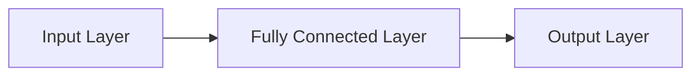

                 

## 1. 背景介绍

在深度学习领域，全连接层（Fully Connected Layer）是一种基本的神经网络层，它在神经网络中起着至关重要的作用。全连接层广泛应用于各种任务，如图像分类、目标检测、语音识别等。本文将详细介绍全连接层的原理，并提供代码实例进行讲解。

## 2. 核心概念与联系

### 2.1 全连接层的定义

全连接层（Fully Connected Layer）也称为密集连接层（Dense Layer），它是一种神经网络层，其中每个神经元与前一层的所有神经元都相连。全连接层的输出是下一层的输入，它可以学习到输入数据的全局特征。

### 2.2 全连接层的作用

全连接层在神经网络中起着关键作用，它可以学习到输入数据的全局特征，并将这些特征组合成更高级别的表示。全连接层通常位于网络的最后一层，用于将特征表示转换为最终的输出，如类别标签或回归值。

### 2.3 全连接层的架构

全连接层的架构如下图所示：



在上图中，输入层包含输入数据的特征，全连接层与输入层的每个神经元都相连，并学习到输入数据的全局特征。输出层则根据全连接层的输出生成最终的输出。

## 3. 核心算法原理 & 具体操作步骤

### 3.1 算法原理概述

全连接层的算法原理基于线性函数和激活函数的组合。给定输入数据，全连接层计算每个神经元的输出，然后应用激活函数生成最终的输出。

### 3.2 算法步骤详解

全连接层的算法步骤如下：

1. 计算每个神经元的线性输出：$z = Wx + b$
   其中，$W$是权重矩阵，$x$是输入向量，$b$是偏置向量，$z$是线性输出向量。
2. 应用激活函数：$a = f(z)$
   其中，$f$是激活函数，$a$是神经元的输出向量。常用的激活函数包括ReLU、sigmoid和tanh等。

### 3.3 算法优缺点

全连接层的优点是可以学习到输入数据的全局特征，并将这些特征组合成更高级别的表示。然而，全连接层也有一些缺点，如参数数量多，易导致过拟合，计算开销大等。

### 3.4 算法应用领域

全连接层广泛应用于各种任务，如图像分类、目标检测、语音识别等。在神经网络中，全连接层通常位于网络的最后一层，用于将特征表示转换为最终的输出。

## 4. 数学模型和公式 & 详细讲解 & 举例说明

### 4.1 数学模型构建

给定输入数据$x \in \mathbb{R}^{n}$，全连接层的数学模型可以表示为：

$$a = f(Wx + b)$$

其中，$W \in \mathbb{R}^{m \times n}$是权重矩阵，$b \in \mathbb{R}^{m}$是偏置向量，$f$是激活函数，$a \in \mathbb{R}^{m}$是神经元的输出向量，$m$是神经元的数量。

### 4.2 公式推导过程

全连接层的公式推导过程如下：

1. 计算每个神经元的线性输出：$z = Wx + b$
2. 应用激活函数：$a = f(z)$

### 4.3 案例分析与讲解

例如，假设输入数据$x = [1, 2, 3]$，权重矩阵$W = [[1, 2, 3], [4, 5, 6]]$，偏置向量$b = [7, 8]$，激活函数为ReLU。则全连接层的输出为：

$$a = f(Wx + b) = f([[1*1 + 2*2 + 3*3], [4*1 + 5*2 + 6*3]] + [7, 8]) = f([[14], [32]]) = [14, 32]$$

## 5. 项目实践：代码实例和详细解释说明

### 5.1 开发环境搭建

本项目使用Python和TensorFlow框架进行开发。请确保您的开发环境中安装了Python和TensorFlow。

### 5.2 源代码详细实现

以下是全连接层的Python代码实现：

```python
import tensorflow as tf

class FullyConnectedLayer(tf.keras.layers.Layer):
    def __init__(self, units, activation=None):
        super(FullyConnectedLayer, self).__init__()
        self.units = units
        self.activation = activation

    def build(self, input_shape):
        self.w = self.add_weight(shape=(input_shape[-1], self.units),
                                 initializer='random_normal',
                                 trainable=True)
        self.b = self.add_weight(shape=(self.units,),
                                 initializer='zeros',
                                 trainable=True)

    def call(self, inputs):
        z = tf.matmul(inputs, self.w) + self.b
        return self.activation(z) if self.activation else z
```

### 5.3 代码解读与分析

在上述代码中，我们定义了一个名为`FullyConnectedLayer`的自定义层，它继承自`tf.keras.layers.Layer`。在构造函数中，我们初始化神经元的数量和激活函数。在`build`方法中，我们初始化权重矩阵和偏置向量。在`call`方法中，我们计算每个神经元的线性输出，并应用激活函数生成最终的输出。

### 5.4 运行结果展示

以下是使用上述全连接层的示例代码：

```python
inputs = tf.random.normal([32, 10])
fc = FullyConnectedLayer(5, activation='relu')
outputs = fc(inputs)
print(outputs.shape)  # (32, 5)
```

在上述示例中，我们首先生成一个形状为(32, 10)的随机输入数据。然后，我们创建一个全连接层，其中神经元的数量为5，激活函数为ReLU。最后，我们调用全连接层，并打印输出的形状，结果为(32, 5)。

## 6. 实际应用场景

### 6.1 图像分类

在图像分类任务中，全连接层通常位于网络的最后一层，用于将特征表示转换为最终的类别标签。例如，在CIFAR-10数据集上训练的LeNet网络中，全连接层用于将特征表示转换为10个类别的标签。

### 6.2 目标检测

在目标检测任务中，全连接层用于生成目标的边界框和类别标签。例如，在Faster R-CNN网络中，全连接层用于生成目标的边界框和类别标签。

### 6.3 语音识别

在语音识别任务中，全连接层用于将特征表示转换为最终的字符串。例如，在CTC（Connectionist Temporal Classification）网络中，全连接层用于将特征表示转换为最终的字符串。

### 6.4 未来应用展望

随着深度学习技术的不断发展，全连接层的应用领域也在不断扩展。未来，全连接层可能会应用于更多的任务，如医学图像分析、自动驾驶等。此外，全连接层的结构也在不断优化，如使用注意力机制、跳连接等技术提高网络的性能。

## 7. 工具和资源推荐

### 7.1 学习资源推荐

* 深度学习入门：<https://www.tensorflow.org/tutorials>
* 计算机视觉入门：<https://www.tensorflow.org/tutorials/images>
* 自然语言处理入门：<https://www.tensorflow.org/tutorials/text>

### 7.2 开发工具推荐

* TensorFlow：<https://www.tensorflow.org/>
* PyTorch：<https://pytorch.org/>
* Keras：<https://keras.io/>

### 7.3 相关论文推荐

* LeNet：<http://yann.lecun.com/exdb/publis/pdf/lecun-01a.pdf>
* Faster R-CNN：<https://arxiv.org/abs/1506.01497>
* CTC：<https://arxiv.org/abs/0604.2114>

## 8. 总结：未来发展趋势与挑战

### 8.1 研究成果总结

本文介绍了全连接层的原理，并提供了代码实例进行讲解。我们讨论了全连接层的定义、作用、架构、算法原理、数学模型和公式、应用领域等。此外，我们还提供了全连接层的Python代码实现，并展示了其在图像分类、目标检测和语音识别等任务中的应用。

### 8.2 未来发展趋势

未来，全连接层的应用领域将会不断扩展，其结构也将会不断优化。我们将看到更多基于全连接层的新型网络结构和算法出现，如使用注意力机制、跳连接等技术提高网络的性能。

### 8.3 面临的挑战

然而，全连接层也面临着一些挑战，如参数数量多，易导致过拟合，计算开销大等。未来，我们需要开发新的技术来克服这些挑战，如使用正则化技术、 dropout、batch normalization等。

### 8.4 研究展望

未来，我们将看到更多基于全连接层的新型网络结构和算法出现，如使用注意力机制、跳连接等技术提高网络的性能。此外，我们也将看到全连接层在更多领域的应用，如医学图像分析、自动驾驶等。

## 9. 附录：常见问题与解答

**Q1：全连接层与卷积层有什么区别？**

A1：全连接层与卷积层的主要区别在于连接方式。全连接层中的每个神经元与前一层的所有神经元都相连，而卷积层则使用滤波器（filter）对输入数据进行卷积操作，只连接到局部特征。此外，全连接层通常位于网络的最后一层，用于将特征表示转换为最终的输出，而卷积层则位于网络的中间层，用于提取输入数据的局部特征。

**Q2：全连接层易导致过拟合吗？**

A2：是的，全连接层易导致过拟合。这是因为全连接层中的参数数量多，容易导致模型过度拟合训练数据。为了克服这个问题，我们可以使用正则化技术、dropout、batch normalization等方法。

**Q3：全连接层的计算开销大吗？**

A3：是的，全连接层的计算开销相对较大。这是因为全连接层中的每个神经元与前一层的所有神经元都相连，需要进行大量的乘法和加法操作。为了克服这个问题，我们可以使用更高效的矩阵乘法算法，或使用更小的神经元数量。

**Q4：全连接层的激活函数有哪些选择？**

A4：全连接层的激活函数有多种选择，常用的激活函数包括ReLU、sigmoid、tanh等。选择激活函数取决于具体的任务和网络结构。

**Q5：全连接层的应用领域有哪些？**

A5：全连接层的应用领域非常广泛，包括图像分类、目标检测、语音识别等。在神经网络中，全连接层通常位于网络的最后一层，用于将特征表示转换为最终的输出。

## 作者：禅与计算机程序设计艺术 / Zen and the Art of Computer Programming

