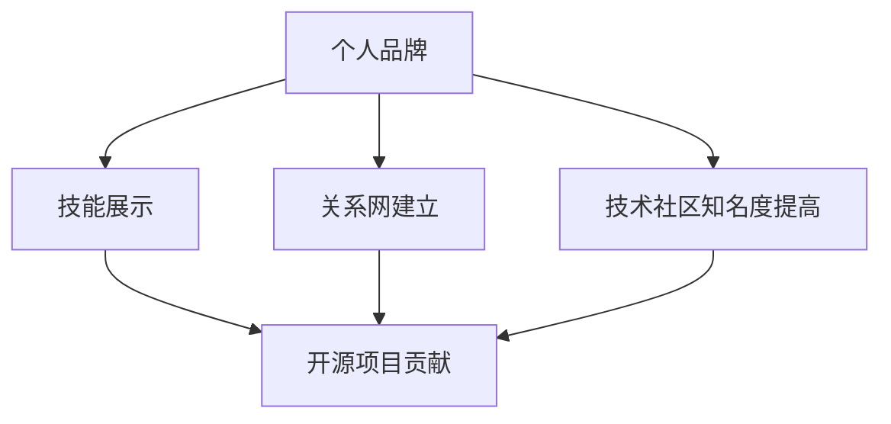

                 

**利用开源项目打造个人品牌**

**作者：禅与计算机程序设计艺术 / Zen and the Art of Computer Programming**

## 1. 背景介绍

在当今的技术世界中，开源项目已经成为软件开发的主流。开源项目不仅提供了大量的可用代码，还为个人和组织提供了展示技能和建立品牌的机会。本文将探讨如何利用开源项目打造个人品牌，从而提高个人知名度，增强就业竞争力，并为未来的职业发展奠定基础。

## 2. 核心概念与联系

### 2.1 个人品牌的定义

个人品牌是指个体在职业生涯中建立的声誉和形象，它反映了个体的技能、价值观和工作态度。在技术领域，个人品牌有助于吸引雇主、客户和合作伙伴。

### 2.2 开源项目的定义

开源项目是指任何人都可以访问、使用、修改和分发的软件项目。开源项目鼓励协作和共享，为个人提供了展示技能和学习的机会。

### 2.3 个人品牌与开源项目的联系

个人品牌和开源项目的联系在于，参与开源项目可以帮助个人建立和提高个人品牌。通过在开源项目中做出贡献，个人可以展示其技能，建立关系网，并提高其在技术社区中的知名度。



## 3. 核心算法原理 & 具体操作步骤

### 3.1 算法原理概述

打造个人品牌的算法可以总结为以下几个步骤：选择合适的开源项目、贡献代码、建立关系网、维护个人品牌。这些步骤是建立和提高个人品牌的关键。

### 3.2 算法步骤详解

1. **选择合适的开源项目**：选择与个人技能和兴趣相关的开源项目。项目的受欢迎程度和活跃度也很重要，因为这意味着项目有更多的机会被看到和评估。
2. **贡献代码**：一旦选择了项目，就开始贡献代码。这包括修复bug、添加新功能、改进文档等。贡献代码时要遵循项目的贡献指南，并确保代码质量高、可维护。
3. **建立关系网**：与项目的其他贡献者交流，参与项目的讨论，并与其他开发者建立联系。这有助于建立关系网，并为未来的合作奠定基础。
4. **维护个人品牌**：保持活跃，继续贡献代码，并分享自己的工作。这包括在社交媒体上分享项目进展、撰写博客文章、参加会议等。

### 3.3 算法优缺点

**优点**：参与开源项目可以帮助个人提高技能，建立关系网，并提高其在技术社区中的知名度。此外，开源项目还提供了一个平台，个人可以在这里展示其技能，并为未来的职业发展奠定基础。

**缺点**：参与开源项目需要时间和精力。如果不遵循项目的贡献指南，个人可能会面临被拒绝的风险。此外，开源项目的成功并不总是能够转化为个人品牌的成功。

### 3.4 算法应用领域

个人品牌的打造可以应用于任何技术领域，包括但不限于软件开发、数据科学、人工智能等。任何需要展示技能和建立关系网的领域都可以应用此算法。

## 4. 数学模型和公式 & 详细讲解 & 举例说明

### 4.1 数学模型构建

个人品牌的打造可以视为一个动态系统，其中个人的技能、关系网和知名度是三个关键变量。数学模型可以表示为：

$$P(t) = f(S(t), N(t), R(t))$$

其中，$P(t)$表示个人品牌在时间$t$时的强度，$S(t)$表示个人技能在时间$t$时的水平，$N(t)$表示个人在时间$t$时的知名度，$R(t)$表示个人在时间$t$时的关系网规模，$f$表示个人品牌强度与其他变量的函数关系。

### 4.2 公式推导过程

个人品牌强度$P(t)$随时间$t$的变化可以表示为：

$$\frac{dP}{dt} = k_1 \frac{dS}{dt} + k_2 \frac{dN}{dt} + k_3 \frac{dR}{dt}$$

其中，$k_1, k_2, k_3$表示个人技能、知名度和关系网对个人品牌强度的影响系数。这些系数可以根据个人的具体情况进行调整。

### 4.3 案例分析与讲解

例如，一名软件开发人员想要提高其个人品牌。他可以选择参与开源项目，贡献代码，并与其他开发者建立联系。通过这些活动，他可以提高其技能（$S(t)$），提高其知名度（$N(t)$），并扩大其关系网（$R(t)$）。根据数学模型，这些变化会导致其个人品牌强度的增加（$P(t)$）。

## 5. 项目实践：代码实例和详细解释说明

### 5.1 开发环境搭建

要参与开源项目，首先需要搭建开发环境。这通常包括安装开发工具（如IDE）、配置版本控制系统（如Git）等。具体步骤因项目而异，但大多数项目都提供了详细的设置指南。

### 5.2 源代码详细实现

一旦环境搭建完成，就可以开始贡献代码了。这可能包括修复bug、添加新功能、改进文档等。以下是一个简单的代码示例，展示了如何修复一个假设的bug：

```python
# before.py
def divide(a, b):
    return a / b

# after.py
def divide(a, b):
    if b == 0:
        raise ValueError("Cannot divide by zero")
    return a / b
```

### 5.3 代码解读与分析

在`after.py`中，我们添加了一个条件语句来检查除数`b`是否为零。如果是，则抛出一个`ValueError`异常。否则，代码执行与`before.py`中的代码相同。

### 5.4 运行结果展示

在运行`after.py`之前，如果除数为零，则会导致运行时错误。通过添加条件语句，我们可以避免这种情况，并提供更友好的错误消息。

## 6. 实际应用场景

### 6.1 当前应用

开源项目已经成为软件开发的主流，个人品牌的打造也因此变得越来越重要。开源项目为个人提供了展示技能和学习的机会，并为未来的职业发展奠定了基础。

### 6.2 未来应用展望

随着开源项目的不断发展，个人品牌的打造也将变得越来越重要。未来，开源项目可能会成为雇主评估候选人的标准之一。此外，个人品牌的打造也将为个人带来更多的机会，包括但不限于就业、创业等。

## 7. 工具和资源推荐

### 7.1 学习资源推荐

- **开源指南**：[How to Contribute to Open Source](https://opensource.guide/how-to-contribute/)
- **开源项目列表**：[Up-for-grabs.net](https://up-for-grabs.net/), [Firsttimersonly.com](https://www.firsttimersonly.com/)
- **开源项目指南**：[First Contributions](https://firstcontributions.github.io/)

### 7.2 开发工具推荐

- **集成开发环境（IDE）**：Visual Studio Code, PyCharm, IntelliJ IDEA
- **版本控制系统**：Git, GitHub, GitLab
- **文档编写工具**：Markdown, LaTeX

### 7.3 相关论文推荐

- [The Impacts of Open Source Participation on Software Professionals' Career](https://ieeexplore.ieee.org/document/8458933)
- [The Impact of Open Source Participation on Software Professionals' Career](https://dl.acm.org/doi/10.1145/3318464.3318507)

## 8. 总结：未来发展趋势与挑战

### 8.1 研究成果总结

本文介绍了如何利用开源项目打造个人品牌。我们讨论了个人品牌的定义、开源项目的定义，并提出了个人品牌与开源项目的联系。我们还介绍了打造个人品牌的算法，并提供了数学模型和代码示例。

### 8.2 未来发展趋势

未来，开源项目将继续发展，个人品牌的打造也将变得越来越重要。雇主可能会越来越重视个人在开源项目中的贡献，并将其作为评估候选人的标准之一。

### 8.3 面临的挑战

参与开源项目需要时间和精力。如果不遵循项目的贡献指南，个人可能会面临被拒绝的风险。此外，开源项目的成功并不总是能够转化为个人品牌的成功。

### 8.4 研究展望

未来的研究可以探讨个人品牌的打造与开源项目的关系更深入的问题。例如，个人品牌的打造对开源项目的成功有何影响？开源项目的成功又如何转化为个人品牌的成功？

## 9. 附录：常见问题与解答

**Q：我应该选择哪个开源项目？**

**A：选择与个人技能和兴趣相关的开源项目。项目的受欢迎程度和活跃度也很重要，因为这意味着项目有更多的机会被看到和评估。**

**Q：我应该如何贡献代码？**

**A：遵循项目的贡献指南，并确保代码质量高、可维护。这包括修复bug、添加新功能、改进文档等。**

**Q：我应该如何维护我的个人品牌？**

**A：保持活跃，继续贡献代码，并分享自己的工作。这包括在社交媒体上分享项目进展、撰写博客文章、参加会议等。**

**作者：禅与计算机程序设计艺术 / Zen and the Art of Computer Programming**

