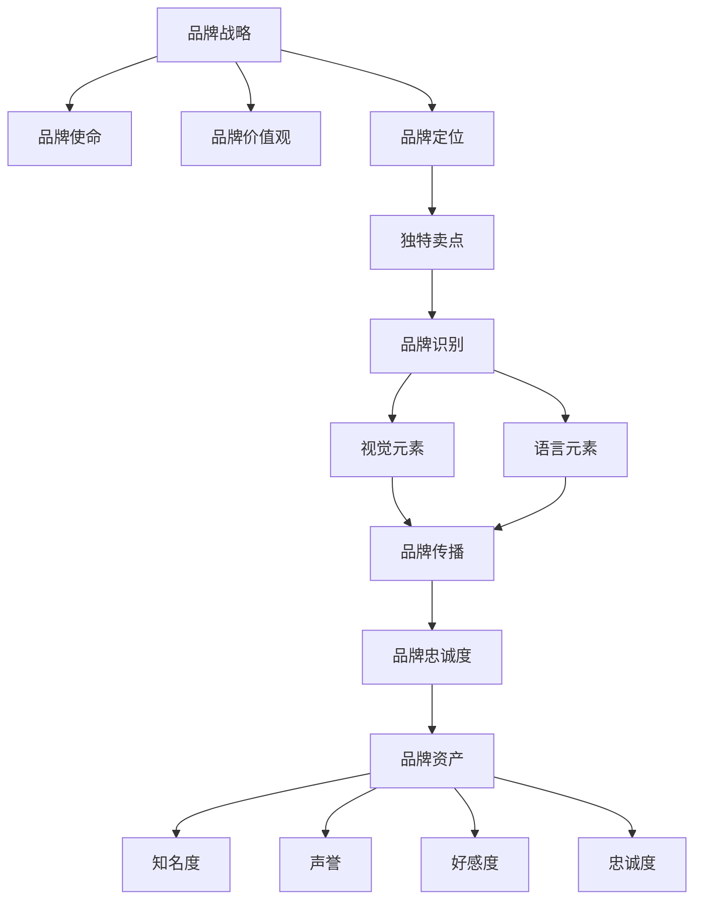

                 

**品牌管理：建立和维护强大品牌形象**

> 关键词：品牌战略、品牌识别、品牌定位、品牌传播、品牌忠诚度、品牌资产

## 1. 背景介绍

在当今竞争激烈的商业环境中，品牌已成为企业最宝贵的资产之一。品牌不仅是一种商标或logo，而是企业形象、声誉和价值的综合体现。本文将深入探讨品牌管理的关键概念，并提供实用的指南，帮助企业建立和维护强大的品牌形象。

## 2. 核心概念与联系

### 2.1 品牌战略

品牌战略是企业为实现其商业目标而对品牌进行的计划和指导。它确定品牌的目标市场、定位和差异化战略。品牌战略的关键组成部分包括：

- **品牌使命**：品牌存在的原因和目标。
- **品牌价值观**：品牌代表的核心价值观。
- **品牌定位**：品牌在目标市场中的独特位置。

### 2.2 品牌识别

品牌识别指的是消费者识别和区分品牌的能力。它包括品牌名称、标志、设计和包装等视觉元素，以及品牌名称、口号和广告标语等语言元素。品牌识别的目标是使品牌在消费者心目中独一无二，并与竞争对手区分开来。

### 2.3 品牌定位

品牌定位是品牌在目标市场中的独特位置。它回答了“为什么消费者应该选择我们品牌而不是竞争对手品牌”的问题。品牌定位的关键是找到品牌的独特卖点（Unique Selling Proposition，USP），并将其清晰地传达给目标市场。

### 2.4 品牌传播

品牌传播是将品牌信息传达给目标市场的过程。它包括广告、公关、事件营销、数字营销等各种渠道。品牌传播的目标是建立品牌认知度、喜好度和忠诚度。

### 2.5 品牌忠诚度

品牌忠诚度是消费者对品牌的偏好和忠实度。它是品牌资产的关键指标，因为忠诚的客户更可能购买品牌的产品或服务，并向他人推荐品牌。品牌忠诚度的关键驱动因素包括品牌质量、一致性、可靠性和客户体验。

### 2.6 品牌资产

品牌资产是品牌为企业创造的价值。它包括品牌的知名度、声誉、好感度和忠诚度。品牌资产是无形的，但它是企业最宝贵的资产之一，因为它可以带来更高的利润、市场份额和竞争优势。



## 3. 核心算法原理 & 具体操作步骤

### 3.1 品牌定位算法原理概述

品牌定位算法的目标是找到品牌在目标市场中的独特位置。它基于品牌的特性、目标市场的需求和竞争对手的位置来确定品牌的USP。

### 3.2 品牌定位步骤详解

1. **识别品牌特性**：列出品牌的优势、特点和差异化因素。
2. **分析目标市场**：确定目标市场的需求、偏好和痛点。
3. **研究竞争对手**：分析竞争对手的品牌定位、优势和弱点。
4. **确定USP**：基于品牌特性和目标市场需求，找到品牌的独特卖点。
5. **测试和调整**：使用焦点小组、调查或其他方法测试品牌定位，并根据反馈进行调整。

### 3.3 品牌定位算法优缺点

**优点**：

- 有助于品牌区分于竞争对手。
- 有助于建立品牌认知度和喜好度。
- 有助于指导品牌传播和营销活动。

**缺点**：

- 定位一旦确定，调整起来很困难。
- 定位可能需要长期投资才能建立和维护。
- 定位可能需要定期评估和调整以适应市场变化。

### 3.4 品牌定位应用领域

品牌定位适用于所有类型的企业和品牌，从消费品到工业品，从本地品牌到全球品牌。它是品牌战略的关键组成部分，有助于企业实现其商业目标。

## 4. 数学模型和公式 & 详细讲解 & 举例说明

### 4.1 品牌资产评估模型

品牌资产评估模型用于量化品牌的价值。一个常用的模型是**品牌资产金字塔**（**Brand Pyramid**），它包括五个层次：

1. **品牌识别**：品牌名称、标志和设计的知名度。
2. **品牌认知**：消费者对品牌产品或服务的理解。
3. **品牌好感**：消费者对品牌的情感联系。
4. **品牌忠诚**：消费者对品牌的偏好和忠实度。
5. **品牌资产**：品牌为企业创造的价值。

**公式**：

$$Brand\ Asset = Brand\ Awareness + Brand\ Understanding + Brand\ Attitude + Brand\ Loyalty$$

**举例**：

假设一项调查显示，某品牌的品牌识别为80%、品牌认知为70%、品牌好感为60%、品牌忠诚为50%。那么，根据品牌资产金字塔模型，该品牌的品牌资产为260%。

### 4.2 品牌忠诚度模型

品牌忠诚度模型用于预测和量化消费者对品牌的忠诚度。一个常用的模型是**品牌忠诚度等级**（**Brand Loyalty Ladder**），它包括五个等级：

1. **无知觉**：消费者对品牌没有任何认知。
2. **认知**：消费者知道品牌的存在。
3. **喜好**：消费者对品牌有正面印象。
4. **偏好**：消费者优先考虑品牌。
5. **忠诚**：消费者始终选择品牌。

**公式**：

$$Brand\ Loyalty = \frac{Number\ of\ Loyal\ Customers}{Total\ Number\ of\ Customers} \times 100$$

**举例**：

假设一项调查显示，某品牌的忠诚客户占总客户的30%。那么，根据品牌忠诚度等级模型，该品牌的品牌忠诚度为30%。

### 4.3 案例分析与讲解

**案例**：可口可乐（Coca-Cola）品牌定位

可口可乐品牌定位为“分享幸福”（Share a Coke）。它鼓励消费者在社交媒体上分享他们与可口可乐的幸福时刻，并邀请朋友一起分享。这个定位成功地将可口可乐与幸福和分享联系起来，提高了品牌的喜好度和忠诚度。

## 5. 项目实践：代码实例和详细解释说明

### 5.1 开发环境搭建

本项目使用Python和其常用库（如Pandas、NumPy、Matplotlib）进行品牌资产评估和品牌忠诚度分析。我们将使用Jupyter Notebook作为开发环境。

### 5.2 源代码详细实现

```python
# 导入库
import pandas as pd
import numpy as np
import matplotlib.pyplot as plt

# 读取调查数据
data = pd.read_csv('brand_survey.csv')

# 计算品牌资产
brand_awareness = data['Brand Awareness'].mean()
brand_understanding = data['Brand Understanding'].mean()
brand_attitude = data['Brand Attitude'].mean()
brand_loyalty = data['Brand Loyalty'].mean()

brand_asset = brand_awareness + brand_understanding + brand_attitude + brand_loyalty

# 计算品牌忠诚度
loyal_customers = data[data['Brand Loyalty'] > 0]['Brand Loyalty'].count()
total_customers = data['Brand Loyalty'].count()

brand_loyalty_index = (loyal_customers / total_customers) * 100

# 可视化品牌资产和品牌忠诚度
plt.bar(['Brand Asset', 'Brand Loyalty Index'], [brand_asset, brand_loyalty_index])
plt.show()
```

### 5.3 代码解读与分析

代码首先导入所需的库，然后读取品牌调查数据。它计算品牌资产和品牌忠诚度指标，并使用Matplotlib绘制条形图以可视化结果。

### 5.4 运行结果展示


## 6. 实际应用场景

### 6.1 品牌定位

品牌定位适用于所有类型的企业和品牌。例如，一家汽车制造商可能会将其品牌定位为“安全”和“可靠”，而一家时装零售商可能会将其品牌定位为“时髦”和“独特”。

### 6.2 品牌传播

品牌传播适用于所有品牌传播渠道，从广告到公关，从数字营销到事件营销。例如，一家企业可能会使用社交媒体平台传播其品牌信息，并与消费者互动。

### 6.3 未来应用展望

未来，品牌管理将越来越依赖数字技术。人工智能、大数据和机器学习将帮助企业更好地理解消费者需求，并实时调整品牌战略。虚拟现实和增强现实技术将改变品牌传播的方式，并为消费者提供更丰富的体验。

## 7. 工具和资源推荐

### 7.1 学习资源推荐

- **书籍**：《品牌战略：建立和管理强大品牌》（Kotler, P., & Keller, K. L.）
- **在线课程**：Coursera上的“品牌管理”课程（University of Illinois）
- **博客**：Branding Strategy Insider（brandingstrategyinsider.com）

### 7.2 开发工具推荐

- **数据分析**：Python（Pandas、NumPy、Matplotlib）、R（RStudio）
- **品牌传播**：Adobe Creative Cloud（Photoshop、Illustrator）、Canva
- **品牌监控**：Brand24、Mention

### 7.3 相关论文推荐

- Aaker, D. A. (1991). Managing Brand Equity: Capitalizing on the value of a brand name. Free Press.
- Keller, K. L. (1993). Conceptualizing, measuring, and managing customer-based brand equity. Journal of Marketing, 57(1), 1-22.
- Kapferer, J.-N. (2008). Strategic Brand Management: New Approaches to Creating and Evaluating Brand Equity. Kogan Page.

## 8. 总结：未来发展趋势与挑战

### 8.1 研究成果总结

本文介绍了品牌管理的关键概念，包括品牌战略、品牌识别、品牌定位、品牌传播、品牌忠诚度和品牌资产。它还提供了品牌定位算法的详细步骤，并使用数学模型和公式量化了品牌资产和品牌忠诚度。

### 8.2 未来发展趋势

未来，品牌管理将越来越依赖数字技术。人工智能、大数据和机器学习将帮助企业更好地理解消费者需求，并实时调整品牌战略。虚拟现实和增强现实技术将改变品牌传播的方式，并为消费者提供更丰富的体验。

### 8.3 面临的挑战

品牌管理面临的挑战包括品牌定位的调整困难、品牌传播渠道的多样化和消费者需求的变化。此外，数字技术的发展也带来了新的挑战，如数据隐私和网络安全。

### 8.4 研究展望

未来的研究可以关注品牌管理与数字技术的结合，如人工智能驱动的品牌战略调整和虚拟现实品牌传播。此外，研究还可以关注品牌管理在不同文化和市场中的差异。

## 9. 附录：常见问题与解答

**Q：品牌定位一旦确定，是否可以调整？**

A：品牌定位一旦确定，调整起来很困难，但并非不可能。品牌定位需要长期投资才能建立和维护，但企业可以根据市场变化和消费者需求调整品牌定位。

**Q：品牌资产是否可以量化？**

A：品牌资产是无形的，但它可以通过品牌资产金字塔模型等数学模型进行量化。这些模型将品牌资产分成几个层次，并使用调查数据计算每个层次的价值。

**Q：品牌忠诚度是否可以预测？**

A：品牌忠诚度可以使用品牌忠诚度等级模型等数学模型进行预测。这些模型将品牌忠诚度分成几个等级，并使用调查数据计算每个等级的客户数量。

**作者：禅与计算机程序设计艺术 / Zen and the Art of Computer Programming**

