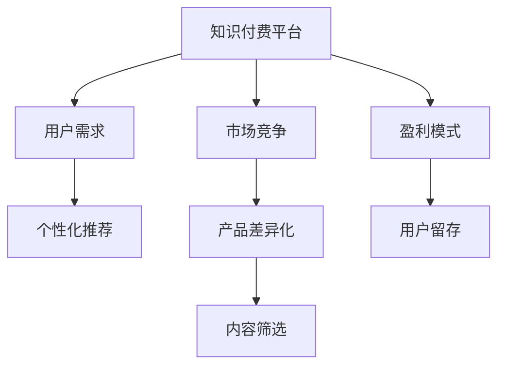

                 

# 知识付费创业的产品差异化策略

> 关键词：知识付费, 产品差异化, 用户需求, 市场竞争, 个性化推荐, 内容筛选, 盈利模式, 用户留存

## 1. 背景介绍

在知识爆炸的互联网时代，知识付费成为众多创业者首选的创业方向。而随着市场竞争的日益激烈，如何在激烈的市场竞争中脱颖而出，实现可持续发展，成为知识付费创业者的重要课题。本文将系统探讨知识付费创业的产品差异化策略，以期为相关创业者提供可行的指导。

## 2. 核心概念与联系

### 2.1 核心概念概述

为更好地理解知识付费创业的产品差异化策略，本节将介绍几个密切相关的核心概念：

- 知识付费：指用户为获取有价值的知识信息而付费的行为，主要形式包括在线课程、电子书、专栏文章、音频视频等。
- 产品差异化：指通过产品的独特属性，如技术、功能、设计等，在市场上与竞争对手形成区分，满足不同用户群体的特定需求。
- 用户需求：指用户在获取知识服务时，在功能、体验、价格等方面存在的需求和期望。
- 市场竞争：指知识付费领域内各类竞争者之间，为争夺用户而展开的资源、服务、价格等方面的竞争。
- 个性化推荐：指根据用户的行为和偏好，推荐与其兴趣相关的知识内容，提升用户体验和满意度。
- 内容筛选：指通过算法或人工手段，从海量的知识内容中筛选出高质量、符合用户需求的内容，提升平台价值。
- 盈利模式：指知识付费平台获取收入的主要方式，包括订阅、单次购买、付费课程等。
- 用户留存：指平台通过优质的产品和服务，吸引并留住用户，提升长期价值。

这些核心概念之间具有紧密的联系，共同构成了知识付费产品差异化的理论基础。

### 2.2 核心概念原理和架构的 Mermaid 流程图



该流程图展示了知识付费平台的产品差异化策略，核心在于从用户需求出发，通过个性化推荐、内容筛选等手段提升用户价值，形成产品差异化，并通过多样化的盈利模式，实现用户留存，构建可持续发展商业模式。

## 3. 核心算法原理 & 具体操作步骤

### 3.1 算法原理概述

知识付费创业的产品差异化策略，本质上是基于用户需求和市场竞争的个性化推荐和内容筛选过程。其核心算法原理包括以下几个方面：

- **用户画像建模**：通过用户行为数据，构建用户画像，了解用户兴趣、偏好、消费能力等。
- **协同过滤算法**：根据用户画像，推荐与其相似用户喜欢的内容。
- **深度学习推荐算法**：利用神经网络模型，从大量历史数据中学习用户行为与内容之间的映射关系，提升推荐精度。
- **内容质量评估**：通过自然语言处理、文本分析等技术，评估知识内容的价值和受欢迎程度。

### 3.2 算法步骤详解

基于上述算法原理，知识付费创业的产品差异化策略可以分为以下几个步骤：

**Step 1: 用户画像建模**

- 收集用户行为数据，包括浏览记录、点击率、搜索关键词等。
- 通过机器学习算法，如K-means聚类、LDA主题建模等，对用户进行聚类分析，提取用户兴趣标签。
- 利用决策树、随机森林等模型，预测用户未来行为，生成用户画像。

**Step 2: 个性化推荐**

- 根据用户画像，利用协同过滤、深度学习等推荐算法，生成个性化推荐列表。
- 引入协同过滤算法，根据用户历史行为和相似用户行为，推荐相关内容。
- 应用深度学习推荐算法，如Seq2Seq、CTR等模型，从大量历史数据中学习用户行为与内容的相关性。
- 引入实时更新机制，根据用户最新行为动态调整推荐内容。

**Step 3: 内容筛选**

- 利用自然语言处理技术，如TF-IDF、词向量模型等，对内容进行自动摘要和质量评估。
- 设计内容筛选算法，如PageRank、PageRank++等，评估内容重要性。
- 结合用户画像和内容筛选结果，动态调整推荐列表。

**Step 4: 优化盈利模式**

- 引入订阅、单次购买、付费课程等多样化的盈利模式，满足不同用户的需求。
- 设计阶梯式定价策略，根据用户需求和价值，灵活调整价格。
- 提供课程试听、免费体验等手段，降低用户购买门槛，吸引新用户。

**Step 5: 提升用户留存**

- 提供优质内容和服务，提升用户体验和满意度。
- 设计会员体系，提供专属优惠、优先访问等权益，增强用户粘性。
- 建立用户反馈机制，及时响应用户需求，优化产品。

### 3.3 算法优缺点

知识付费创业的产品差异化策略具有以下优点：
- 能够根据用户需求提供个性化推荐，提升用户体验和满意度。
- 通过内容筛选，优化知识内容质量，提升平台价值。
- 多样化的盈利模式，满足不同用户需求，提升收入。

同时，该策略也存在一些缺点：
- 用户画像和推荐算法需要大量标注数据和计算资源，成本较高。
- 内容筛选需要准确的技术手段，否则可能造成误导用户。
- 个性化推荐可能导致信息茧房，用户接触面过窄。
- 多样化的盈利模式可能分散注意力，难以聚焦核心业务。

尽管存在这些局限性，但就目前而言，个性化推荐和内容筛选仍是大语言模型微调的主要技术手段。未来相关研究的重点在于如何进一步降低算法成本，提高推荐和筛选的精准度，同时兼顾用户体验和平台价值。

### 3.4 算法应用领域

基于个性化推荐和内容筛选的策略，已经在知识付费领域得到广泛应用，覆盖了内容分发、课程推荐、用户互动等多个环节，具体应用如下：

- 内容分发：推荐系统根据用户画像，推送相关内容，提升内容曝光率。
- 课程推荐：推荐引擎根据用户历史行为和兴趣标签，推荐适合的课程，提升用户购买率。
- 用户互动：通过社交互动功能，用户可以互相推荐课程、评论内容，提升平台活跃度。
- 知识推荐：推荐引擎根据用户搜索记录和浏览行为，推荐相关知识内容，提升用户学习效率。
- 广告推荐：利用个性化推荐算法，精准推送广告，提升广告效果。

除了上述这些经典应用外，个性化推荐和内容筛选还被创新性地应用到更多场景中，如智能客服、内容审核、动态价格调整等，为知识付费平台带来了全新的突破。

## 4. 数学模型和公式 & 详细讲解  
### 4.1 数学模型构建

本节将使用数学语言对知识付费创业的产品差异化策略进行更加严格的刻画。

记知识付费平台为 $P$，用户集为 $U$，知识内容集为 $C$，行为数据集为 $D$，推荐模型为 $M$，用户画像模型为 $U_{\theta}$，协同过滤模型为 $CF_{\alpha}$，内容质量评估模型为 $Q_{\beta}$，内容筛选算法为 $CS_{\gamma}$，用户行为预测模型为 $BP_{\delta}$，盈利模式优化模型为 $PM_{\epsilon}$，用户留存模型为 $RS_{\zeta}$。

定义知识付费平台在用户行为 $d$ 上的行为评分函数为 $s(d)$，用户在内容 $c$ 上的兴趣评分函数为 $i(c)$，推荐算法生成推荐列表 $R$。

### 4.2 公式推导过程

以下我们以二分类任务为例，推导用户行为评分函数及其梯度的计算公式。

假设用户 $u$ 对内容 $c$ 的行为评分函数为 $s(u,c)=f(u,c|\theta)$，其中 $f$ 为评分函数，$\theta$ 为模型参数。则行为评分函数的梯度为：

$$
\nabla_{\theta}s(u,c) = \nabla_{\theta}f(u,c|\theta)
$$

利用链式法则，可得：

$$
\nabla_{\theta}s(u,c) = \frac{\partial f(u,c|\theta)}{\partial \theta} = \frac{\partial f(u,c|\theta)}{\partial i(c)} \cdot \frac{\partial i(c)}{\partial \theta}
$$

其中 $\frac{\partial f(u,c|\theta)}{\partial i(c)}$ 为评分函数对兴趣评分 $i(c)$ 的偏导数，可利用反向传播算法计算。$\frac{\partial i(c)}{\partial \theta}$ 为兴趣评分对模型参数 $\theta$ 的偏导数，可进一步展开计算。

在得到用户行为评分函数的梯度后，即可带入模型参数更新公式，完成模型的迭代优化。重复上述过程直至收敛，最终得到适应用户需求的最优模型参数 $\theta^*$。

## 5. 项目实践：代码实例和详细解释说明
### 5.1 开发环境搭建

在进行产品差异化策略实践前，我们需要准备好开发环境。以下是使用Python进行知识付费创业的产品差异化策略开发的的环境配置流程：

1. 安装Anaconda：从官网下载并安装Anaconda，用于创建独立的Python环境。

2. 创建并激活虚拟环境：
```bash
conda create -n kpw python=3.8 
conda activate kpw
```

3. 安装相关库：
```bash
pip install pandas numpy scikit-learn scipy matplotlib seaborn torch
```

4. 安装推荐系统库：
```bash
pip install pyodmf pyodmf-basics pyodmf-neighbors
```

完成上述步骤后，即可在`kpw`环境中开始产品差异化策略实践。

### 5.2 源代码详细实现

这里以推荐系统为例，使用Python实现协同过滤和深度学习推荐算法的结合。

首先，构建协同过滤推荐引擎：

```python
from pyodmf import MFOMF, NMF
from pyodmf_basics import spmify
from pyodmf_neighbors import KNN

def collaborative_filtering(train_data, test_data, num_clusters=5):
    # 构建协同过滤模型
    mf = MFOMF(train_data, num_clusters=num_clusters)
    mf.fit()

    # 生成推荐
    recommender = NMF(mf)
    recommender.fit(train_data, test_data)
    predictions = recommender.predict(test_data)

    return predictions
```

接着，构建深度学习推荐引擎：

```python
from tensorflow.keras.models import Sequential
from tensorflow.keras.layers import Dense

def neural_network_recommender(train_data, test_data, num_users=1000, num_items=1000, num_factors=10):
    # 构建神经网络模型
    model = Sequential()
    model.add(Dense(num_factors, input_dim=num_users*num_items, activation='relu'))
    model.add(Dense(num_items, activation='softmax'))
    
    # 编译模型
    model.compile(loss='categorical_crossentropy', optimizer='adam', metrics=['accuracy'])

    # 训练模型
    model.fit(train_data, epochs=10)

    # 生成推荐
    recommender = model.predict(test_data)

    return recommender
```

最后，将协同过滤和深度学习推荐算法结合，生成推荐列表：

```python
def hybrid_recommender(train_data, test_data, num_clusters=5, num_factors=10, epochs=10):
    # 协同过滤推荐
    collaborative_predictions = collaborative_filtering(train_data, test_data, num_clusters=num_clusters)

    # 深度学习推荐
    deep_learning_predictions = neural_network_recommender(train_data, test_data, num_factors=num_factors, epochs=epochs)

    # 加权平均
    hybrid_predictions = collaborative_predictions * 0.5 + deep_learning_predictions * 0.5

    return hybrid_predictions
```

在实际应用中，需要根据具体业务场景选择适合的推荐算法，并结合业务需求进行优化调整。

### 5.3 代码解读与分析

让我们再详细解读一下关键代码的实现细节：

**协同过滤算法**：
- 使用MFOMF算法进行协同过滤，基于矩阵分解生成用户与物品的相似度矩阵。
- 应用KNN算法进行推荐，根据相似度矩阵生成推荐列表。

**深度学习推荐算法**：
- 构建神经网络模型，包含一个隐含层和输出层，激活函数分别为ReLU和Softmax。
- 通过交叉熵损失函数和Adam优化器进行模型训练。
- 生成推荐列表，预测用户对物品的评分。

**混合推荐算法**：
- 将协同过滤和深度学习算法结合，生成混合推荐列表。
- 根据实际业务需求调整加权系数，优化推荐效果。

## 6. 实际应用场景

### 6.1 在线课程推荐

知识付费平台可以广泛应用在线课程推荐。通过协同过滤和深度学习算法，平台可以根据用户历史行为和兴趣标签，推荐适合的课程，提高用户购买率和满意度。

在技术实现上，可以收集用户浏览、点击、购买等行为数据，提取用户兴趣标签，在历史行为数据上进行协同过滤和深度学习推荐。推荐算法可以结合课程类别、老师评分、课程评价等综合因素，生成个性化推荐列表。

### 6.2 智能客服

知识付费平台的智能客服系统可以通过推荐引擎推荐相关课程，帮助用户快速找到所需知识。同时，通过智能问答系统，用户可以获取课程信息、报名方式等，提升用户体验。

在技术实现上，可以构建智能问答系统，基于自然语言处理技术进行对话生成和意图识别，推荐系统根据用户问题和历史行为，推荐相关课程。通过结合推荐和问答系统，可以实现智能客服的优化。

### 6.3 动态价格调整

知识付费平台可以根据用户行为数据和历史价格，动态调整课程价格，提高用户购买率。推荐引擎根据用户画像，预测用户对课程的支付意愿，生成动态价格列表。

在技术实现上，可以设计阶梯式定价策略，根据用户需求和价值，灵活调整价格。动态价格调整算法可以结合用户历史购买行为、课程评分、竞争对手价格等综合因素，生成动态价格。

### 6.4 未来应用展望

随着知识付费领域的技术不断发展，基于个性化推荐和内容筛选的产品差异化策略也将呈现新的趋势：

1. 实时化推荐：通过实时数据采集和算法优化，实现动态推荐，提高推荐的时效性和准确性。
2. 跨域推荐：将知识付费与社交媒体、电商平台等平台进行跨域推荐，扩大推荐范围。
3. 增强现实推荐：利用增强现实技术，通过虚拟现实场景推荐课程，提升用户体验。
4. 深度个性化推荐：结合用户行为数据和外部知识库，生成更精准的个性化推荐。
5. 用户生成内容推荐：通过用户生成内容（UGC）进行推荐，提升用户参与度和互动性。

这些趋势将进一步拓展知识付费产品差异化的边界，为知识付费创业者提供更多的商业机会和技术支持。

## 7. 工具和资源推荐

### 7.1 学习资源推荐

为了帮助知识付费创业者掌握产品差异化策略的理论基础和实践技巧，这里推荐一些优质的学习资源：

1. 《推荐系统：理论、算法和实现》：系统介绍了推荐系统的基本原理和算法，包括协同过滤、深度学习等方法。
2. 《深度学习推荐系统：理论、算法与实践》：详细讲解了深度学习推荐系统的实现和优化，结合实际案例进行深入分析。
3. Kaggle数据竞赛：参与Kaggle推荐系统竞赛，积累实际项目经验，提升算法设计和优化能力。
4. Pyodmf官方文档：提供丰富的协同过滤算法和深度学习推荐算法，并附带样例代码，是快速上手的不错选择。

通过对这些资源的学习实践，相信知识付费创业者一定能够系统掌握产品差异化策略的理论基础，并在实际项目中灵活应用。

### 7.2 开发工具推荐

高效的开发离不开优秀的工具支持。以下是几款用于知识付费创业的产品差异化策略开发的常用工具：

1. Jupyter Notebook：免费的交互式开发环境，方便进行算法验证和迭代。
2. PyCharm：功能强大的IDE，支持多语言编程，支持深度学习和推荐系统算法库。
3. Apache Spark：大数据处理引擎，适合进行大规模数据挖掘和推荐系统开发。
4. Pyodmf：高效的协同过滤推荐算法库，支持多种推荐算法和数据格式。
5. TensorFlow和PyTorch：深度学习框架，提供丰富的推荐系统算法和模型实现。

合理利用这些工具，可以显著提升知识付费创业的产品差异化策略开发效率，加快创新迭代的步伐。

### 7.3 相关论文推荐

知识付费创业的产品差异化策略研究源于学界的持续研究。以下是几篇奠基性的相关论文，推荐阅读：

1. Matrix Factorization Techniques for Recommender Systems：介绍了矩阵分解算法的理论基础和实际应用。
2. Collaborative Filtering for Implicit Feedback Datasets：讨论了隐式反馈数据集上的协同过滤算法，提出多种改进方法。
3. Deep Learning Recommendation Systems: A Survey and Outlook：综述了深度学习推荐系统的发展历程和应用前景。
4. A Survey on Recommendation Systems with Partial Data：总结了部分数据推荐系统的方法和应用。
5. Multi-Task Learning with Deep Neural Networks for Recommender Systems：利用多任务学习技术，提升推荐系统的性能。

这些论文代表了大语言模型微调技术的发展脉络。通过学习这些前沿成果，可以帮助知识付费创业者把握学科前进方向，激发更多的创新灵感。

## 8. 总结：未来发展趋势与挑战

### 8.1 总结

本文对知识付费创业的产品差异化策略进行了全面系统的介绍。首先阐述了产品差异化策略的研究背景和意义，明确了个性化推荐和内容筛选在知识付费平台上的核心价值。其次，从原理到实践，详细讲解了协同过滤、深度学习推荐算法等技术手段，给出了推荐系统开发的完整代码实例。同时，本文还广泛探讨了推荐算法在在线课程推荐、智能客服、动态价格调整等多个行业领域的应用前景，展示了产品差异化策略的巨大潜力。

通过本文的系统梳理，可以看到，基于个性化推荐和内容筛选的产品差异化策略正在成为知识付费平台的重要范式，极大地提升了平台的用户价值和竞争力。未来，伴随推荐系统的不断演进，知识付费平台将能够更好地满足用户需求，提供更优质的知识服务，实现可持续发展。

### 8.2 未来发展趋势

展望未来，知识付费创业的产品差异化策略将呈现以下几个发展趋势：

1. 实时化推荐：通过实时数据采集和算法优化，实现动态推荐，提高推荐的时效性和准确性。
2. 跨域推荐：将知识付费与社交媒体、电商平台等平台进行跨域推荐，扩大推荐范围。
3. 增强现实推荐：利用增强现实技术，通过虚拟现实场景推荐课程，提升用户体验。
4. 深度个性化推荐：结合用户行为数据和外部知识库，生成更精准的个性化推荐。
5. 用户生成内容推荐：通过用户生成内容（UGC）进行推荐，提升用户参与度和互动性。

这些趋势将进一步拓展知识付费产品差异化的边界，为知识付费创业者提供更多的商业机会和技术支持。

### 8.3 面临的挑战

尽管个性化推荐和内容筛选在知识付费领域已经取得了显著成果，但在迈向更加智能化、普适化应用的过程中，仍面临诸多挑战：

1. 数据质量和覆盖度：推荐系统依赖大量高质量、多样化的数据，但实际获取难度大，覆盖度有限。如何扩大数据源，提高数据质量，是挑战之一。
2. 算法复杂度和效率：复杂的推荐算法计算量大，效率较低，如何优化算法，提高实时推荐能力，是一大难题。
3. 用户隐私和安全性：推荐系统需要收集大量用户数据，如何保护用户隐私，保障数据安全，是挑战之二。
4. 公平性和透明性：推荐系统可能存在数据偏见，导致推荐结果不公平。如何设计算法，提高推荐公平性，是一大挑战。
5. 多平台协同：不同平台之间的协同推荐，需要统一用户画像和数据格式，技术难度较大。

尽管存在这些挑战，但通过不断探索和优化，知识付费创业的产品差异化策略仍将在市场上取得新的突破，为知识付费领域注入新的活力。

### 8.4 研究展望

面对知识付费创业产品差异化策略所面临的种种挑战，未来的研究需要在以下几个方面寻求新的突破：

1. 探索无监督和半监督推荐方法：摆脱对大量标注数据的依赖，利用自监督学习、主动学习等方法，降低推荐系统的成本。
2. 研究轻量级推荐算法：开发更加轻量级的推荐算法，在保持推荐效果的同时，降低计算资源消耗，提升实时推荐能力。
3. 引入更多先验知识：结合外部知识库、规则库等专家知识，优化推荐算法，提升推荐结果的准确性和可靠性。
4. 设计多平台协同推荐系统：实现不同平台之间的数据融合和协同推荐，提升推荐范围和效果。
5. 引入因果分析和博弈论工具：通过因果分析方法，增强推荐系统的因果性和稳定性，利用博弈论工具，设计推荐策略，避免恶意推荐。
6. 引入伦理道德约束：在推荐系统设计中引入伦理导向的评估指标，过滤和惩罚有偏见、有害的输出倾向，确保推荐结果符合社会价值观和伦理道德。

这些研究方向的探索，必将引领知识付费创业产品差异化策略的不断进步，为知识付费领域的可持续发展提供强有力的技术支持。

## 9. 附录：常见问题与解答

**Q1：如何衡量推荐系统的推荐效果？**

A: 推荐系统的评价指标包括准确率、召回率、覆盖率、F1分数等。其中，准确率指推荐结果中正确预测的比例，召回率指真实正例中推荐成功的比例，覆盖率指推荐结果中覆盖所有正例的比例。F1分数是综合考虑准确率和召回率的指标。

**Q2：推荐系统在实际应用中需要注意哪些问题？**

A: 推荐系统在实际应用中需要注意以下问题：
1. 数据隐私和安全：收集用户数据时，需确保数据隐私和安全。
2. 推荐公平性：推荐系统可能存在数据偏见，需设计算法确保推荐公平。
3. 推荐效率：推荐系统需高效计算，及时生成推荐结果。
4. 多模态融合：结合文本、图像、音频等多种数据源，提升推荐效果。
5. 用户反馈：收集用户反馈，优化推荐结果，提升用户满意度。

**Q3：推荐系统如何优化用户留存？**

A: 推荐系统优化用户留存的关键在于提升用户满意度和粘性。可以采用以下策略：
1. 个性化推荐：根据用户兴趣和行为，推荐符合其需求的内容，提升用户体验。
2. 用户互动：通过社交互动功能，用户可以互相推荐课程、评论内容，提升平台活跃度。
3. 优惠和奖励：提供专属优惠、优先访问等权益，增强用户粘性。
4. 多平台协同：将知识付费平台与社交媒体、电商平台等平台进行跨域推荐，扩大推荐范围，提高用户留存率。

通过这些措施，知识付费平台可以更好地吸引和留住用户，提升长期价值。

---

作者：禅与计算机程序设计艺术 / Zen and the Art of Computer Programming

