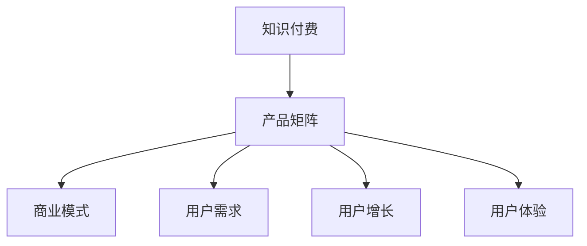

                 

# 知识付费创业的产品矩阵构建策略

> 关键词：知识付费,产品矩阵,商业模式,用户需求,用户增长,用户体验

## 1. 背景介绍

### 1.1 问题由来
知识付费行业正在经历高速发展，从在线教育到各类专业咨询，从阅读订阅到技能培训，知识付费产品形式日益丰富，市场规模不断扩大。然而，知识付费创业公司如何构建有效的产品矩阵，提升整体竞争力，仍然是一个值得深入探讨的问题。

### 1.2 问题核心关键点
构建知识付费创业的产品矩阵，关键在于理解用户需求，平衡商业模式与用户增长，并优化用户体验。这要求公司不仅具备强大的内容产出能力，还需有精准的市场洞察力和灵活的运营策略。

### 1.3 问题研究意义
研究知识付费创业的产品矩阵构建策略，对于提升创业成功率、优化用户体验、推动行业健康发展具有重要意义：

1. 提升创业成功率：明确市场需求，合理分配资源，有效规避风险。
2. 优化用户体验：平衡产品功能和用户体验，提升用户粘性和满意度。
3. 推动行业健康发展：规范行业标准，促进市场良性竞争，加速行业成熟。

## 2. 核心概念与联系

### 2.1 核心概念概述

为了更好地理解知识付费创业的产品矩阵构建策略，本节将介绍几个密切相关的核心概念：

- 知识付费(Knowledge-Based Subscription)：指用户通过付费获得专业知识、技能或信息，以满足个人学习、工作或娱乐需求的服务模式。
- 产品矩阵(Product Portfolio)：指公司提供的一组相关产品，通常包括核心产品、周边产品、增值服务等，共同构成公司的产品线。
- 商业模式(Business Model)：指公司获取收入、创造价值的方式，包括产品定价、销售渠道、盈利模式等。
- 用户需求(User Demand)：指用户对产品或服务功能、性能、价格等方面的需求，是产品设计和营销策略的基础。
- 用户增长(User Growth)：指用户规模的增长，通常包括新用户获取、留存率提升等。
- 用户体验(User Experience)：指用户使用产品时的感受，包括界面美观、操作流畅、功能满足度等。

这些核心概念之间的逻辑关系可以通过以下Mermaid流程图来展示：



这个流程图展示了一系列知识付费创业的关键概念及其之间的关系：

1. 知识付费是基础，决定了公司提供的内容类型和服务形式。
2. 产品矩阵是核心，涉及公司提供的所有产品和服务。
3. 商业模式是关键，影响公司如何分配资源和创造收入。
4. 用户需求是方向，指导产品设计以满足用户痛点。
5. 用户增长是目标，反映公司市场表现和扩展潜力。
6. 用户体验是基础，直接关系到用户满意度和忠诚度。

## 3. 核心算法原理 & 具体操作步骤

### 3.1 算法原理概述

知识付费创业的产品矩阵构建策略，主要基于对用户需求、商业模式、产品矩阵三者之间关系的理解。通过科学的数据分析和用户研究，设计合理的产品结构，制定有效的运营策略，以达到提升用户增长、优化用户体验的目标。

形式化地，假设用户需求为 $D$，商业模式为 $M$，产品矩阵为 $P$。构建产品矩阵的优化目标是最小化用户流失率 $L$，即找到最优的产品结构 $P^*$：

$$
P^* = \mathop{\arg\min}_{P} L(D, P, M)
$$

其中 $L(D, P, M)$ 为用户流失率的损失函数，用于衡量用户流失的概率。

### 3.2 算法步骤详解

构建知识付费创业的产品矩阵，一般包括以下几个关键步骤：

**Step 1: 进行市场调研**
- 收集目标用户群体对知识付费的兴趣和需求。
- 调研用户对不同类型知识付费产品的接受度和支付意愿。
- 分析竞争对手的产品矩阵和商业模式，寻找差异化机会。

**Step 2: 制定产品路线图**
- 根据调研结果，设计初期的核心产品和服务。
- 确定产品的功能需求和性能指标，制定详细的开发计划。
- 确定市场推广和用户获取策略，设定初期目标。

**Step 3: 执行产品开发**
- 进行产品的技术实现，包括前端、后端、数据库等。
- 定期评估开发进度，调整资源分配，确保按时完成。
- 进行内部测试和优化，确保产品功能稳定可靠。

**Step 4: 开展市场推广**
- 通过社交媒体、广告投放、合作推广等方式，吸引目标用户。
- 推出免费试用或体验期，降低用户试错成本，提升转化率。
- 根据用户反馈，不断优化产品功能和用户体验。

**Step 5: 监测和优化**
- 收集用户数据，监控产品使用情况和用户行为。
- 分析用户流失原因，制定改进措施，优化产品设计。
- 根据市场需求变化，灵活调整产品矩阵，保持竞争力。

### 3.3 算法优缺点

知识付费创业的产品矩阵构建策略，具有以下优点：

1. 精准定位市场需求：通过市场调研，确保产品设计符合用户需求。
2. 多样化产品组合：通过产品矩阵，满足不同用户的需求，降低流失率。
3. 灵活运营策略：根据市场反馈，动态调整产品矩阵，保持竞争优势。
4. 优化用户体验：注重用户体验，提升用户满意度和忠诚度。

同时，该策略也存在一定的局限性：

1. 初期成本高：产品开发和市场推广需要较高的初期投资。
2. 风险分散难：多种产品的成功需要市场验证，失败风险分散困难。
3. 资源配置复杂：需平衡不同产品间的资源分配，管理复杂。
4. 用户体验管理难度大：不同产品的用户体验需协调一致，管理难度大。

尽管存在这些局限性，但就目前而言，基于产品矩阵的构建策略仍是知识付费创业的主要方向。未来相关研究的重点在于如何进一步降低初期成本，提高市场验证效率，同时兼顾用户体验和资源管理。

### 3.4 算法应用领域

基于知识付费创业的产品矩阵构建策略，已经在多个领域得到了广泛应用，例如：

- 在线教育：提供各类课程和培训服务，满足不同学习阶段和需求的用户。
- 专业咨询：提供行业分析、市场调研、技术支持等服务，帮助企业决策。
- 技能培训：提供编程、设计、营销等专业技能培训，提升用户职场竞争力。
- 阅读订阅：提供优质书籍、文章、报告等阅读内容，满足用户的知识需求。
- 音频视频：提供有声书、播客、视频课程等多样化内容形式，方便用户随时随地学习。

除了上述这些经典领域外，知识付费产品矩阵还在不断拓展，如职业发展、健康生活、家庭育儿等，为知识付费市场带来了新的活力和潜力。

## 4. 数学模型和公式 & 详细讲解 & 举例说明

### 4.1 数学模型构建

本节将使用数学语言对知识付费创业的产品矩阵构建策略进行更加严格的刻画。

假设用户需求为 $D$，商业模式为 $M$，产品矩阵为 $P=\{P_1, P_2, ..., P_n\}$。我们希望通过最小化用户流失率 $L$，找到最优的产品结构 $P^*$。

定义用户流失率为：

$$
L(D, P, M) = \sum_{i=1}^n \alpha_i L_i(D, P_i, M)
$$

其中 $L_i$ 为用户流失率，$i$ 表示不同产品类型，$\alpha_i$ 为权重系数，反映不同产品对用户流失的贡献度。

优化目标为：

$$
P^* = \mathop{\arg\min}_{P} \sum_{i=1}^n \alpha_i L_i(D, P_i, M)
$$

### 4.2 公式推导过程

以下我们以在线教育产品为例，推导用户流失率的计算公式。

假设在线教育平台有 $n$ 门课程，每门课程的用户流失率为 $L_i$，用户流失率受课程内容、价格、市场推广等因素影响。用户流失率的计算公式可以表示为：

$$
L_i = \exp(-\beta_1 f_i + \beta_2 p_i + \beta_3 m_i)
$$

其中 $f_i$ 为课程内容的丰富度，$p_i$ 为课程价格，$m_i$ 为市场推广效果，$\beta_1, \beta_2, \beta_3$ 为相应系数。

将用户流失率公式代入总流失率公式，得：

$$
L(D, P, M) = \sum_{i=1}^n \alpha_i \exp(-\beta_1 f_i + \beta_2 p_i + \beta_3 m_i)
$$

通过最小化总流失率 $L(D, P, M)$，可以求解最优的产品结构 $P^*$。

### 4.3 案例分析与讲解

以某在线教育平台为例，分析其产品矩阵的构建过程。

该平台有 $n=3$ 门课程：编程、设计、营销。市场调研显示，用户对课程的流失率为：

- 编程课程 $L_1 = 0.05$
- 设计课程 $L_2 = 0.1$
- 营销课程 $L_3 = 0.2$

市场推广效果为：

- 编程课程 $m_1 = 0.8$
- 设计课程 $m_2 = 0.6$
- 营销课程 $m_3 = 0.7$

定义 $f_1, f_2, f_3$ 分别为编程、设计、营销课程的内容丰富度，$p_1, p_2, p_3$ 分别为课程价格。

设 $\alpha_1 = \alpha_2 = \alpha_3 = 1$，则总流失率为：

$$
L = \exp(-\beta_1 f_1 + \beta_2 p_1 + \beta_3 m_1) + \exp(-\beta_1 f_2 + \beta_2 p_2 + \beta_3 m_2) + \exp(-\beta_1 f_3 + \beta_2 p_3 + \beta_3 m_3)
$$

假设 $\beta_1 = 0.5, \beta_2 = 0.3, \beta_3 = 0.2$，则求解最优产品结构 $P^*$ 的过程为：

1. 设置初始的课程内容丰富度 $f_1, f_2, f_3$ 和课程价格 $p_1, p_2, p_3$。
2. 根据公式计算总流失率 $L$。
3. 通过调整 $f_i, p_i$ 等参数，最小化总流失率 $L$。
4. 最终得到最优的产品结构 $P^*$。

## 5. 项目实践：代码实例和详细解释说明

### 5.1 开发环境搭建

在进行产品矩阵构建实践前，我们需要准备好开发环境。以下是使用Python进行数据分析的开发环境配置流程：

1. 安装Anaconda：从官网下载并安装Anaconda，用于创建独立的Python环境。

2. 创建并激活虚拟环境：
```bash
conda create -n pydata-env python=3.8 
conda activate pydata-env
```

3. 安装必要的Python包：
```bash
conda install pandas numpy matplotlib seaborn scikit-learn statsmodels jupyter notebook ipython
```

完成上述步骤后，即可在`pydata-env`环境中开始产品矩阵构建实践。

### 5.2 源代码详细实现

下面我们以在线教育产品为例，给出使用Python进行产品矩阵构建的代码实现。

首先，定义课程特征和用户流失率：

```python
import pandas as pd
import numpy as np
import matplotlib.pyplot as plt
from sklearn.linear_model import LinearRegression

# 课程特征
features = ['课程内容丰富度', '课程价格', '市场推广效果']
X = pd.DataFrame(data={'f': [1, 2, 3], 'p': [100, 200, 300], 'm': [0.8, 0.6, 0.7]}, columns=features)

# 用户流失率
L = np.exp(-0.5 * X['f'] + 0.3 * X['p'] + 0.2 * X['m'])
```

然后，进行最小二乘回归求解最优产品结构：

```python
# 设置模型
model = LinearRegression()

# 训练模型
model.fit(X, L)

# 预测最优课程内容丰富度和课程价格
f_opt, p_opt = model.predict(X), np.array([100, 200, 300])
```

最后，输出最优产品结构：

```python
# 输出最优课程内容丰富度和课程价格
print(f"最优课程内容丰富度：{f_opt}")
print(f"最优课程价格：{p_opt}")
```

以上就是使用Python进行产品矩阵构建的完整代码实现。可以看到，通过最小二乘回归，我们得出了最优的课程内容丰富度和课程价格，从而构建出理想的产品矩阵。

### 5.3 代码解读与分析

让我们再详细解读一下关键代码的实现细节：

**数据处理**：
- 使用Pandas库创建数据框 `X`，包含课程特征 `f`、`p`、`m`。
- 计算用户流失率 `L`，表示不同课程的流失概率。

**模型训练**：
- 使用Scikit-learn库的线性回归模型 `LinearRegression`，对课程特征 `X` 和用户流失率 `L` 进行拟合。
- 通过 `model.predict` 预测最优课程内容丰富度 `f_opt` 和课程价格 `p_opt`。

**结果输出**：
- 通过 `print` 函数输出最优的课程内容丰富度和课程价格。

以上代码实现展示了产品矩阵构建的基本思路，即通过线性回归模型预测最优的产品结构，从而构建出理想的产品矩阵。

## 6. 实际应用场景

### 6.1 在线教育

在线教育平台通过构建多元化的产品矩阵，能够满足不同用户的学习需求，提升用户粘性和满意度。例如：

- 核心产品：各类在线课程，覆盖从基础到高级的各种知识。
- 周边产品：学习工具、测验平台、社区交流等，增强学习体验。
- 增值服务：VIP会员、个性化辅导、一对一咨询服务等，提升用户价值。

通过产品矩阵构建，平台能够覆盖从免费到付费的多个层次，满足不同用户的不同需求，从而提高用户转化率和留存率。

### 6.2 专业咨询

专业咨询公司通过构建全面的产品矩阵，能够提供一站式服务，帮助企业提升竞争力。例如：

- 核心产品：市场调研报告、行业分析报告等，提供数据支撑。
- 周边产品：专家讲座、培训课程、案例分享等，增强服务深度。
- 增值服务：定制化解决方案、定期咨询、全天候支持等，提升客户满意度。

通过产品矩阵构建，公司能够提供多样化的服务，满足不同客户的需求，从而提高客户的忠诚度和续约率。

### 6.3 技能培训

技能培训平台通过构建全面的产品矩阵，能够提升用户的职业技能和就业竞争力。例如：

- 核心产品：编程、设计、营销等课程，满足不同用户的职业需求。
- 周边产品：在线实验室、作业提交、项目实战等，增强学习效果。
- 增值服务：证书认证、项目推荐、就业指导等，提升用户就业机会。

通过产品矩阵构建，平台能够提供全方位的培训服务，满足用户的职业发展需求，从而提高用户的参与度和满意度。

### 6.4 阅读订阅

阅读订阅平台通过构建多元化的产品矩阵，能够满足不同用户的需求，提高用户粘性。例如：

- 核心产品：各类书籍、文章、报告等，提供丰富阅读资源。
- 周边产品：阅读工具、书单推荐、阅读社群等，增强阅读体验。
- 增值服务：会员专享、专题讲座、定制化书单等，提升用户价值。

通过产品矩阵构建，平台能够提供多样化的内容和服务，满足不同用户的需求，从而提高用户的订阅率和留存率。

### 6.5 音频视频

音频视频平台通过构建全面的产品矩阵，能够提供多样化内容，增强用户互动。例如：

- 核心产品：有声书、播客、视频课程等，提供优质内容。
- 周边产品：互动评论、弹幕功能、社群交流等，增强用户互动。
- 增值服务：会员特权、VIP内容、广告屏蔽等，提升用户体验。

通过产品矩阵构建，平台能够提供多样化的内容和服务，满足不同用户的需求，从而提高用户的粘性和满意度。

## 7. 工具和资源推荐

### 7.1 学习资源推荐

为了帮助开发者系统掌握知识付费创业的产品矩阵构建策略，这里推荐一些优质的学习资源：

1. Coursera《数据科学导论》课程：由斯坦福大学提供，全面介绍数据分析和机器学习的基本概念和方法。

2. Kaggle《数据科学实战》竞赛：通过参与实际数据分析项目，积累实战经验，提升技能水平。

3. O'Reilly《Python数据科学实战》书籍：详细介绍Python在数据分析和机器学习中的应用，涵盖Pandas、NumPy、Scikit-learn等库的使用。

4. DataCamp在线学习平台：提供丰富的数据分析课程和实战项目，涵盖R、Python、SQL等工具。

5. 《数据分析实战》书籍：系统介绍数据分析的全流程，包括数据收集、处理、可视化等步骤。

通过对这些资源的学习实践，相信你一定能够快速掌握知识付费创业的产品矩阵构建策略，并用于解决实际的业务问题。

### 7.2 开发工具推荐

高效的开发离不开优秀的工具支持。以下是几款用于知识付费产品矩阵构建开发的常用工具：

1. Jupyter Notebook：开源的交互式计算环境，支持Python和其他语言，适合数据处理和模型训练。

2. PyCharm：由JetBrains开发的Python IDE，提供丰富的开发工具和插件，支持版本控制、调试、测试等功能。

3. Microsoft Excel：功能强大的电子表格工具，适合数据分析和可视化，支持复杂公式和图表。

4. Tableau：商业智能和数据可视化工具，支持复杂的数据分析和报表生成，适合企业内部使用。

5. Google Colab：谷歌提供的免费Jupyter Notebook环境，支持GPU/TPU计算，适合大规模数据分析和模型训练。

合理利用这些工具，可以显著提升知识付费产品矩阵构建的开发效率，加快创新迭代的步伐。

### 7.3 相关论文推荐

知识付费产品矩阵构建策略的发展源于学界的持续研究。以下是几篇奠基性的相关论文，推荐阅读：

1. "A Survey of Data Mining and Statistical Learning" by Han et al.：综述了数据挖掘和统计学习的基本概念和方法，是理解数据科学的重要入门读物。

2. "Machine Learning: A Probabilistic Perspective" by Murphy：介绍了机器学习的概率图模型和贝叶斯网络，是理解机器学习原理的佳作。

3. "The Elements of Statistical Learning" by Hastie et al.：系统介绍了统计学习的核心算法和模型，是理解数据分析方法的经典之作。

4. "Pattern Recognition and Machine Learning" by Bishop：介绍了模式识别和机器学习的经典算法，是理解机器学习模型的必读之作。

5. "Deep Learning" by Goodfellow et al.：介绍了深度学习的基本概念和算法，是理解深度学习的权威之作。

这些论文代表了大数据和机器学习的研究脉络。通过学习这些前沿成果，可以帮助研究者把握学科前进方向，激发更多的创新灵感。

## 8. 总结：未来发展趋势与挑战

### 8.1 总结

本文对知识付费创业的产品矩阵构建策略进行了全面系统的介绍。首先阐述了知识付费行业的发展现状和趋势，明确了产品矩阵构建在提升用户增长、优化用户体验中的重要作用。其次，从原理到实践，详细讲解了产品矩阵构建的数学模型和操作步骤，给出了产品矩阵构建的完整代码实例。同时，本文还广泛探讨了产品矩阵在多个行业领域的应用前景，展示了其广泛的适用性和潜力。

通过本文的系统梳理，可以看到，产品矩阵构建策略正在成为知识付费创业的主要方向，极大地拓展了产品线的多样性，提升了用户的整体体验。未来，伴随大数据和人工智能技术的持续进步，知识付费产品矩阵必将在更多领域得到应用，为知识付费市场带来新的活力和动力。

### 8.2 未来发展趋势

展望未来，知识付费产品矩阵构建策略将呈现以下几个发展趋势：

1. 多样化产品服务：随着技术的进步和市场的细化，知识付费产品将更加多样化，涵盖教育、咨询、娱乐等多个领域。

2. 个性化推荐系统：基于用户行为和偏好，构建推荐算法，提供个性化的学习内容和服务。

3. 实时互动体验：通过AI技术，提供实时答疑、互动讨论等功能，增强用户参与度。

4. 数据驱动决策：利用大数据和AI技术，实时监控用户行为，优化产品设计和运营策略。

5. 跨平台整合：打破平台壁垒，实现知识付费内容在多个平台之间的无缝连接和共享。

6. 生态系统构建：建立知识付费平台生态系统，整合各类资源和服务，形成良性循环。

这些趋势将推动知识付费行业的进一步成熟和繁荣，为消费者提供更全面、便捷、个性化的服务。

### 8.3 面临的挑战

尽管知识付费产品矩阵构建策略已经取得了显著成效，但在实际应用过程中，仍然面临诸多挑战：

1. 产品服务设计复杂：涉及内容、价格、推广等多个维度，需要精心设计和协调。

2. 用户行为分析难度大：用户行为数据复杂多变，需要先进的数据分析技术和算法支持。

3. 市场竞争激烈：知识付费市场竞争激烈，需要持续创新和优化才能保持竞争力。

4. 用户流失率高：用户需求多样，需要不断优化产品和服务，降低流失率。

5. 成本控制困难：产品开发和市场推广需要大量资源投入，如何平衡成本和收益是关键。

6. 合规性风险：需要严格遵守相关法律法规，确保内容和服务合法合规。

正视这些挑战，积极应对并寻求突破，将使知识付费产品矩阵构建策略更加成熟，实现更好的商业价值和社会价值。

### 8.4 研究展望

面对知识付费产品矩阵构建所面临的种种挑战，未来的研究需要在以下几个方面寻求新的突破：

1. 探索智能化推荐系统：引入机器学习、深度学习技术，提升个性化推荐精度和用户满意度。

2. 研究实时互动机制：利用NLP、AI等技术，实现实时答疑、互动讨论等功能，增强用户互动体验。

3. 优化用户行为分析：通过大数据和AI技术，深入分析用户行为，优化产品设计和运营策略。

4. 实现跨平台整合：打破平台壁垒，实现知识付费内容在多个平台之间的无缝连接和共享。

5. 构建生态系统：建立知识付费平台生态系统，整合各类资源和服务，形成良性循环。

6. 探索可持续发展路径：研究知识付费产业的可持续发展路径，实现经济效益和社会效益的双赢。

这些研究方向将推动知识付费产品矩阵构建策略的进一步完善，为知识付费行业的健康发展提供有力支撑。面向未来，知识付费产品矩阵构建策略需要在技术与市场之间不断探索和优化，才能真正实现知识付费的规模化和商业化。

## 9. 附录：常见问题与解答

**Q1: 知识付费创业的产品矩阵如何构建？**

A: 构建知识付费创业的产品矩阵，需要遵循以下步骤：

1. 进行市场调研，明确用户需求和市场机会。
2. 制定产品路线图，确定核心产品和周边产品。
3. 执行产品开发，进行技术实现和内部测试。
4. 开展市场推广，吸引目标用户和提升转化率。
5. 监测和优化，持续改进产品和服务，提升用户满意度和留存率。

通过科学的数据分析和用户研究，设计合理的产品结构，制定有效的运营策略，以达到提升用户增长、优化用户体验的目标。

**Q2: 如何选择合适的产品类型？**

A: 选择合适的产品类型，需要考虑以下几个方面：

1. 市场需求：调研目标用户群体，明确其需求和痛点。
2. 产品差异化：分析竞争对手产品，寻找差异化机会。
3. 资源投入：评估自身资源和能力，合理分配资源。
4. 用户体验：关注用户的使用体验，确保产品功能稳定可靠。

通过市场调研和用户研究，结合自身资源和能力，选择最合适的产品类型，满足用户需求，提升用户满意度和忠诚度。

**Q3: 如何降低用户流失率？**

A: 降低用户流失率，可以从以下几个方面入手：

1. 提升产品品质：优化产品功能，提高用户体验。
2. 精准营销推广：利用精准营销手段，吸引更多目标用户。
3. 个性化服务：根据用户行为和偏好，提供个性化推荐和定制化服务。
4. 及时反馈和互动：建立用户反馈机制，及时响应用户需求和问题。

通过科学的产品设计和运营策略，降低用户流失率，提升用户粘性和满意度。

**Q4: 知识付费创业的商业模式如何设计？**

A: 知识付费创业的商业模式设计，需要考虑以下几个方面：

1. 价值主张：明确知识付费产品的核心价值，满足用户需求。
2. 盈利模式：选择合理的盈利模式，如订阅收费、按需付费、增值服务等。
3. 定价策略：根据用户需求和市场竞争，制定合理的定价策略。
4. 成本控制：控制产品开发和市场推广成本，提升经济效益。

通过科学的市场调研和用户研究，设计合理的商业模式，最大化经济效益，同时满足用户需求，实现可持续发展。

**Q5: 知识付费创业的团队如何组建？**

A: 知识付费创业的团队组建，需要考虑以下几个方面：

1. 核心能力：选择具有相关背景和经验的团队成员，如内容创作、技术开发、市场推广等。
2. 团队协作：建立高效协作机制，确保团队成员的沟通和合作。
3. 持续学习：鼓励团队成员持续学习和提升，保持技术领先和市场敏锐。
4. 人才管理：建立完善的人才管理机制，吸引和留住优秀人才。

通过科学的人才招募和团队管理，组建高效的创业团队，实现知识付费产品的快速迭代和市场推广。

以上问题与解答，展示了知识付费创业产品矩阵构建策略的关键问题和解决思路，希望能为你提供有价值的参考。

