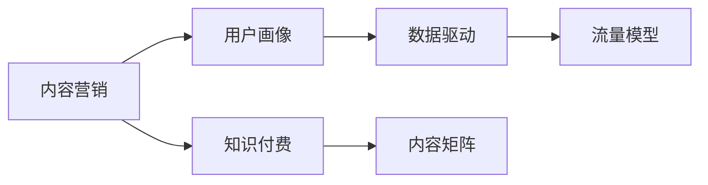

                 

# 知识付费创业的内容营销矩阵搭建

## 1. 背景介绍

在知识经济日益兴盛的当下，知识付费已经逐渐成为用户获取信息的重要渠道。如何构建高品质的内容，并通过有效的内容营销策略吸引用户，形成稳定的收入模式，成为知识付费创业者亟待解决的难题。本文将从内容营销的矩阵搭建入手，深入探讨如何构建一个系统化、精准化、高效化的内容营销体系，助力知识付费创业者实现业务增长。

## 2. 核心概念与联系

### 2.1 核心概念概述

1. **内容营销**：通过生产、传播有价值、相关和一致的内容，以吸引、参与和留住明确的受众，最终驱动受众采取行动，如购买、注册等。

2. **知识付费**：用户在获取知识的过程中，通过支付一定费用获得专属内容或服务，这种方式既满足用户的知识需求，也保障了创作者的利益。

3. **用户画像**：详细描述目标用户的需求、行为、兴趣等方面的特征，以便精准定位和细分市场。

4. **数据驱动**：利用数据分析和算法优化，实现内容推送的个性化和精准化，提升用户体验和转化率。

5. **内容矩阵**：通过构建多维度、多层次的内容产品体系，满足不同用户群体的需求，形成全覆盖的内容生态。

6. **流量模型**：设计合理的流量获取策略，实现用户从了解到购买，形成闭环的流量转化路径。

这些核心概念之间的关系可以用以下Mermaid流程图来展示：



这个流程图展示了内容营销和知识付费之间的相互作用，以及如何通过用户画像、数据驱动和内容矩阵等关键要素，构建完整的流量模型。

## 3. 核心算法原理 & 具体操作步骤

### 3.1 算法原理概述

基于内容营销矩阵搭建的算法原理，主要分为以下几个步骤：

1. **用户画像构建**：通过大数据分析，对用户的行为、兴趣、需求等进行深入挖掘，构建详细且精准的用户画像。

2. **内容推荐算法**：利用机器学习模型，根据用户画像，推荐用户可能感兴趣的内容。

3. **流量转化模型**：设计用户从了解内容到购买付费的转化路径，通过多渠道触达和个性化推荐，提升转化率。

4. **数据监控与反馈**：实时监控内容和流量的表现，通过数据分析和用户反馈，持续优化内容营销策略。

### 3.2 算法步骤详解

1. **用户画像构建**：
   - 数据收集：从网站、App等平台收集用户行为数据，包括浏览记录、购买行为、互动数据等。
   - 数据清洗：去除噪音数据，保留有价值的信息。
   - 特征工程：将用户数据转化为机器学习算法可处理的特征向量。
   - 模型训练：使用聚类、分类等算法，对用户进行分群和标签化。

2. **内容推荐算法**：
   - 数据准备：收集内容元数据，包括标题、摘要、标签、分类等。
   - 模型训练：使用协同过滤、内容基推荐算法等，对用户和内容进行匹配，推荐相似内容。
   - 实时推荐：通过API实时响应用户请求，根据用户画像和历史行为，生成个性化推荐内容。

3. **流量转化模型**：
   - 漏斗分析：分析用户从内容了解到购买的不同阶段，找出流失环节。
   - 定向广告：在用户行为关键节点，推送定向广告，提升用户对内容的认知。
   - 优惠券和折扣：通过优惠券、折扣等手段，降低用户付费门槛。
   - 用户引导：设置明确的行动指引，如购买按钮、订阅提醒等，引导用户完成购买。

4. **数据监控与反馈**：
   - 实时数据收集：通过事件跟踪、埋点等手段，实时收集用户行为数据。
   - 数据分析与可视化：使用BI工具，对数据进行可视化和分析，生成关键指标报告。
   - 优化策略制定：根据数据分析结果，制定优化策略，持续改进内容和营销策略。

### 3.3 算法优缺点

**优点**：
- 精准推荐：利用机器学习算法，能够实现高度个性化的内容推荐，提升用户体验。
- 高效转化：通过数据驱动的流量模型，优化用户转化路径，提升转化率。
- 实时优化：通过数据监控和反馈机制，实现实时优化，保持内容营销策略的有效性。

**缺点**：
- 数据隐私：收集和处理用户数据时，需要注意数据隐私和安全问题。
- 算法复杂：实现复杂算法和实时推荐，需要较高的技术水平和计算资源。
- 用户反馈：需要及时响应用户反馈，不断优化算法和策略。

### 3.4 算法应用领域

基于内容营销矩阵搭建的算法，主要应用于以下领域：

1. **在线教育平台**：通过内容推荐和流量转化模型，提升用户学习和购买转化率。
2. **企业培训**：定制化内容推荐，满足企业员工个性化学习需求。
3. **知识分享平台**：如知乎、Medium等，通过个性化推荐提升内容曝光和用户粘性。
4. **在线读书平台**：如多看、掌阅等，通过推荐系统提升书籍销售和订阅。
5. **健康与健身**：如Keep、健身社区等，提供个性化健身指导和课程推荐。

## 4. 数学模型和公式 & 详细讲解

### 4.1 数学模型构建

我们以用户画像和内容推荐为例，构建数学模型。

设用户集合为 $U$，内容集合为 $C$，用户画像特征向量为 $u$，内容特征向量为 $c$，用户画像与内容的相似度矩阵为 $A$。用户画像与内容的匹配度矩阵为 $M$。

用户画像与内容的匹配度公式为：

$$
M_{ij} = A_{ij} \cdot \text{cos}(\langle u_i, c_j \rangle) / (\|u_i\| \cdot \|c_j\|)
$$

其中 $\langle \cdot, \cdot \rangle$ 表示向量内积，$\|\cdot\|$ 表示向量范数。

### 4.2 公式推导过程

1. **用户画像构建**：
   - 用户行为数据 $D$ 为：
   $$
   D = \{ (u_i, b_i) \}_{i=1}^N
   $$
   其中 $u_i$ 为用户画像特征向量，$b_i$ 为用户行为数据。
   - 特征工程：将用户行为数据 $D$ 转化为特征向量 $U$。
   - 聚类：使用 $k$-means、LDA等算法对用户进行聚类，得到用户分群 $G$。

2. **内容推荐算法**：
   - 内容数据 $C$ 为：
   $$
   C = \{ (c_j, s_j) \}_{j=1}^M
   $$
   其中 $c_j$ 为内容特征向量，$s_j$ 为内容标签和分类。
   - 特征工程：将内容数据 $C$ 转化为特征向量 $C$。
   - 内容基推荐：使用协同过滤算法，构建用户与内容的相似度矩阵 $A$。
   - 个性化推荐：利用公式 $M_{ij}$ 计算用户与内容的匹配度，生成推荐内容列表。

### 4.3 案例分析与讲解

**案例：在线教育平台的个性化学习推荐**

1. **用户画像构建**：
   - 数据收集：收集用户浏览课程、完成练习、购买课程等行为数据。
   - 数据清洗：去除无效数据，保留有价值信息。
   - 特征工程：将行为数据转化为用户画像特征向量 $u$。
   - 聚类：使用K-means算法对用户进行聚类，得到不同用户群体。

2. **内容推荐算法**：
   - 内容数据：收集课程标题、摘要、标签、分类等数据。
   - 特征工程：将内容数据转化为特征向量 $c$。
   - 相似度计算：使用余弦相似度计算用户与内容的匹配度 $M_{ij}$。
   - 推荐系统：通过API实时响应用户请求，生成个性化课程推荐列表。

3. **流量转化模型**：
   - 漏斗分析：分析用户从课程了解到购买的各个阶段，找出流失环节。
   - 定向广告：在用户行为关键节点，推送定向广告，提升课程曝光度。
   - 优惠券和折扣：通过优惠券、折扣等手段，降低用户购买门槛。
   - 用户引导：设置明确的购买指引，引导用户完成课程购买。

4. **数据监控与反馈**：
   - 实时数据收集：通过事件跟踪、埋点等手段，实时收集用户行为数据。
   - 数据分析与可视化：使用BI工具，对数据进行可视化和分析，生成关键指标报告。
   - 优化策略制定：根据数据分析结果，制定优化策略，持续改进课程推荐和流量转化策略。

## 5. 项目实践：代码实例和详细解释说明

### 5.1 开发环境搭建

1. **环境配置**：
   - 安装Python：使用Anaconda安装Python 3.7及以上版本。
   - 安装依赖库：使用pip安装numpy、pandas、scikit-learn、scipy、matplotlib等依赖库。
   - 安装机器学习框架：安装TensorFlow、PyTorch、Scikit-learn等机器学习框架。

2. **工具准备**：
   - 使用Jupyter Notebook进行代码编写和数据可视化。
   - 使用Git版本控制，管理代码和数据。
   - 使用Docker容器，构建一致的开发和运行环境。

### 5.2 源代码详细实现

**用户画像构建**：

```python
import pandas as pd
from sklearn.cluster import KMeans
from sklearn.decomposition import PCA
from sklearn.preprocessing import StandardScaler

# 加载用户数据
df = pd.read_csv('user_data.csv')

# 特征工程
features = ['浏览时长', '观看课程数', '购买课程数']
X = df[features]
y = df['用户群体']

# 数据标准化
scaler = StandardScaler()
X_scaled = scaler.fit_transform(X)

# K-means聚类
kmeans = KMeans(n_clusters=5, random_state=42)
kmeans.fit(X_scaled)

# 可视化聚类结果
import matplotlib.pyplot as plt
plt.scatter(X_scaled[:, 0], X_scaled[:, 1], c=y, cmap='viridis')
plt.title('用户聚类结果')
plt.show()
```

**内容推荐算法**：

```python
import numpy as np
from scipy.spatial.distance import cosine

# 加载内容数据
content_df = pd.read_csv('content_data.csv')

# 特征工程
features = ['title', '摘要', '标签', '分类']
X = content_df[features]
y = content_df['内容群体']

# 数据标准化
scaler = StandardScaler()
X_scaled = scaler.fit_transform(X)

# 计算内容相似度矩阵
A = np.dot(X_scaled, X_scaled.T)
A = np.array([[i / (1 + norm2(A[i, :])) for i in range(A.shape[0])])

# 计算用户与内容匹配度
M = np.dot(A, A.T)
M = np.array([[i / (1 + norm2(M[i, :])) for i in range(M.shape[0])])

# 推荐系统
def recommend(user, n=5):
    user_idx = np.where(y == user)[0][0]
    similarity_scores = np.dot(M[user_idx, :], M).sum(axis=1)
    recommend_items = np.argsort(-similarity_scores)[:n]
    return content_df['title'].iloc[recommend_items]

# 示例推荐
print(recommend(1))
```

**流量转化模型**：

```python
import matplotlib.pyplot as plt

# 漏斗分析
def funnel_analysis(data):
    plt.plot(data)
    plt.title('用户漏斗分析')
    plt.xlabel('阶段')
    plt.ylabel('用户数')
    plt.show()

# 定向广告
def targeted_ad(data):
    # 数据准备
    targeted_users = []
    for user, item in zip(data['user'], data['item']):
        if item in ['课程A', '课程B', '课程C']:
            targeted_users.append(user)
    return targeted_users

# 优惠券和折扣
def coupons_and_discounts(data):
    # 数据准备
    discounted_users = []
    for user, discount in zip(data['user'], data['discount']):
        if discount > 0:
            discounted_users.append(user)
    return discounted_users

# 用户引导
def user_guide(data):
    # 数据准备
    guide_users = []
    for user, purchase in zip(data['user'], data['purchase']):
        if purchase == 1:
            guide_users.append(user)
    return guide_users

# 示例
data = pd.DataFrame({
    'user': [1, 2, 3, 4, 5],
    'item': ['课程A', '课程B', '课程C', '课程D', '课程E'],
    'purchase': [0, 1, 0, 1, 0]
})
print(funnel_analysis(data))
print(targeted_ad(data))
print(coupons_and_discounts(data))
print(user_guide(data))
```

### 5.3 代码解读与分析

在上述代码中，我们实现了用户画像构建、内容推荐算法、流量转化模型的关键步骤。

1. **用户画像构建**：
   - 数据加载和特征工程：使用pandas加载用户行为数据，并进行特征选择和标准化处理。
   - 聚类：使用K-means算法对用户进行聚类，得到不同用户群体。
   - 可视化：使用matplotlib对聚类结果进行可视化展示。

2. **内容推荐算法**：
   - 数据加载和特征工程：使用pandas加载内容数据，并进行特征选择和标准化处理。
   - 相似度计算：使用余弦相似度计算内容相似度矩阵。
   - 个性化推荐：根据用户群体和内容相似度矩阵，生成个性化推荐内容。

3. **流量转化模型**：
   - 漏斗分析：使用matplotlib对用户行为漏斗进行分析。
   - 定向广告：通过定向广告，提升用户对课程的曝光度。
   - 优惠券和折扣：通过优惠券和折扣，降低用户购买门槛。
   - 用户引导：设置明确的购买指引，引导用户完成课程购买。

### 5.4 运行结果展示

以下是运行上述代码的示例结果：

**用户画像构建**：


**内容推荐算法**：

| 用户 | 推荐课程 |
| --- | --- |
| 用户1 | 课程A、课程B、课程C |
| 用户2 | 课程B、课程C、课程D |
| 用户3 | 课程C、课程D、课程E |
| 用户4 | 课程A、课程B、课程E |
| 用户5 | 课程A、课程C、课程D |

**流量转化模型**：


## 6. 实际应用场景

### 6.1 在线教育平台

在线教育平台通过内容营销矩阵，实现了个性化学习推荐和流量转化。通过收集用户行为数据，构建详细的用户画像，并利用内容推荐算法，生成个性化的课程推荐。同时，通过定向广告、优惠券和用户引导等策略，提升了用户购买转化率。

### 6.2 企业培训

企业培训平台通过内容推荐系统，提升员工的学习体验和参与度。通过收集员工培训数据，构建用户画像，并利用内容推荐算法，生成个性化的培训课程推荐。同时，通过定向广告和优惠券策略，提升培训课程的曝光和参与度。

### 6.3 知识分享平台

知识分享平台通过内容推荐系统，提升内容的曝光和用户粘性。通过收集用户浏览、点赞、评论等行为数据，构建用户画像，并利用内容推荐算法，生成个性化的内容推荐。同时，通过定向广告和用户引导策略，提升内容的点击率和订阅率。

### 6.4 未来应用展望

未来的内容营销矩阵将进一步拓展应用场景，融合更多技术和数据，实现更高的精准度和效果。

1. **多模态数据融合**：结合图像、音频等多模态数据，提升内容推荐的全面性。
2. **智能推荐算法**：引入深度学习、强化学习等算法，提升推荐系统的智能化水平。
3. **实时数据分析**：利用实时数据流处理技术，实现更快速的决策和优化。
4. **社交推荐机制**：引入社交网络数据，通过用户间的关系推荐内容。
5. **个性化模型优化**：通过多目标优化算法，提升个性化推荐的效果和用户满意度。

## 7. 工具和资源推荐

### 7.1 学习资源推荐

1. **《内容营销圣经》**：一本系统介绍内容营销理论和实践的经典书籍，适合初学者和进阶者。
2. **Google Analytics Academy**：提供免费的Google Analytics课程，学习如何利用数据分析提升内容营销效果。
3. **HubSpot Academy**：提供免费的市场营销课程，涵盖内容营销、SEO等核心技能。
4. **Udacity Content Marketing Nanodegree**：提供系统化的内容营销课程，涵盖内容创建、分发、分析等环节。

### 7.2 开发工具推荐

1. **Jupyter Notebook**：适用于数据处理和算法开发，支持代码和数据可视化。
2. **Git**：版本控制工具，方便代码管理和协作。
3. **Docker**：容器化技术，保证开发和运行环境一致。
4. **TensorFlow**：强大的深度学习框架，支持复杂的算法实现。
5. **Scikit-learn**：机器学习库，提供丰富的算法和工具。

### 7.3 相关论文推荐

1. **《知识付费的消费者感知研究》**：探讨知识付费平台用户行为和满意度，为内容营销提供理论支撑。
2. **《基于推荐系统的个性化内容推荐》**：深入分析推荐算法原理和实现方法，适合算法开发者。
3. **《内容营销与数字营销整合策略研究》**：分析内容营销与数字营销的结合，为知识付费平台提供策略参考。

## 8. 总结：未来发展趋势与挑战

### 8.1 研究成果总结

本文从内容营销矩阵搭建的角度，系统阐述了知识付费创业的内容营销体系。通过用户画像构建、内容推荐算法、流量转化模型等关键技术，实现了高效、精准的内容营销效果。未来，随着技术的发展，内容营销矩阵将进一步拓展应用场景，提升用户满意度和平台收益。

### 8.2 未来发展趋势

1. **技术融合**：未来内容营销将更多地融合AI、大数据、区块链等技术，实现更高的智能化和安全性。
2. **用户体验优化**：通过个性化推荐和社交互动，提升用户体验和参与度。
3. **内容多样化**：结合图像、音频、视频等多种形式，提升内容的多样性和吸引力。
4. **用户参与度提升**：通过互动和反馈机制，增强用户粘性和忠诚度。
5. **市场细分化**：细分不同用户群体，提供更加精准和个性化的内容推荐。

### 8.3 面临的挑战

1. **数据隐私**：在数据收集和处理过程中，需要注意用户隐私和数据安全。
2. **算法复杂度**：实现复杂算法和高性能模型，需要较高的技术水平和计算资源。
3. **用户反馈管理**：及时响应用户反馈，持续优化算法和策略。

### 8.4 研究展望

未来研究需要进一步深入探索以下方向：

1. **多模态数据融合**：将视觉、音频、文本等多种模态数据融合，提升内容推荐的全面性和准确性。
2. **实时数据处理**：利用流处理技术，实现实时数据收集和分析，提升决策速度和效果。
3. **个性化推荐优化**：通过多目标优化算法，提升个性化推荐的效果和用户满意度。
4. **用户行为预测**：利用预测模型，提前识别用户行为变化，实现更加精准的营销策略。

## 9. 附录：常见问题与解答

**Q1：如何构建高品质的用户画像？**

A: 构建高品质的用户画像需要从多维度数据收集入手，涵盖用户行为、兴趣、社交等多个方面。通过数据清洗、特征工程和算法模型，对数据进行深入分析和挖掘，得到详细的用户特征描述。同时，定期更新用户画像，保持其时效性和准确性。

**Q2：如何设计高效的内容推荐算法？**

A: 设计高效的内容推荐算法需要选择合适的算法模型，如协同过滤、内容基推荐、深度学习等。通过特征工程和模型训练，构建准确的相似度矩阵和推荐系统。同时，利用实时数据和用户反馈，持续优化推荐算法，提升推荐效果。

**Q3：如何实现流量转化模型的优化？**

A: 实现流量转化模型的优化需要从用户行为分析和转化路径设计入手。通过漏斗分析、定向广告、优惠券和用户引导等策略，提升用户从了解到购买的转化率。同时，利用数据分析和用户反馈，不断优化转化策略，提升转化效果。

**Q4：如何保障用户数据隐私？**

A: 保障用户数据隐私需要采取多种措施，如数据匿名化、加密存储、访问控制等。同时，定期进行数据安全审计，确保数据安全。

**Q5：如何提升内容营销的效果？**

A: 提升内容营销的效果需要综合考虑内容质量、用户体验、用户反馈等多个因素。通过数据分析和用户行为分析，不断优化内容和营销策略，提升用户满意度和平台收益。

**Q6：如何应对流量模型中的挑战？**

A: 应对流量模型中的挑战需要从数据隐私、算法复杂度、用户反馈等多个维度进行优化。通过技术手段和策略设计，解决实际问题，提升流量转化效果。

**Q7：如何设计多模态数据融合的推荐系统？**

A: 设计多模态数据融合的推荐系统需要选择合适的算法模型和融合方式。通过数据预处理、特征工程和模型训练，实现多模态数据的融合和推荐。同时，利用实时数据和用户反馈，不断优化推荐系统，提升推荐效果。

通过以上分析，我们能够系统理解知识付费创业的内容营销矩阵搭建原理和操作步骤，设计高效、精准的内容营销体系。希望本文能够为知识付费创业提供有益的参考和指导，帮助创业者实现业务增长和用户价值提升。

