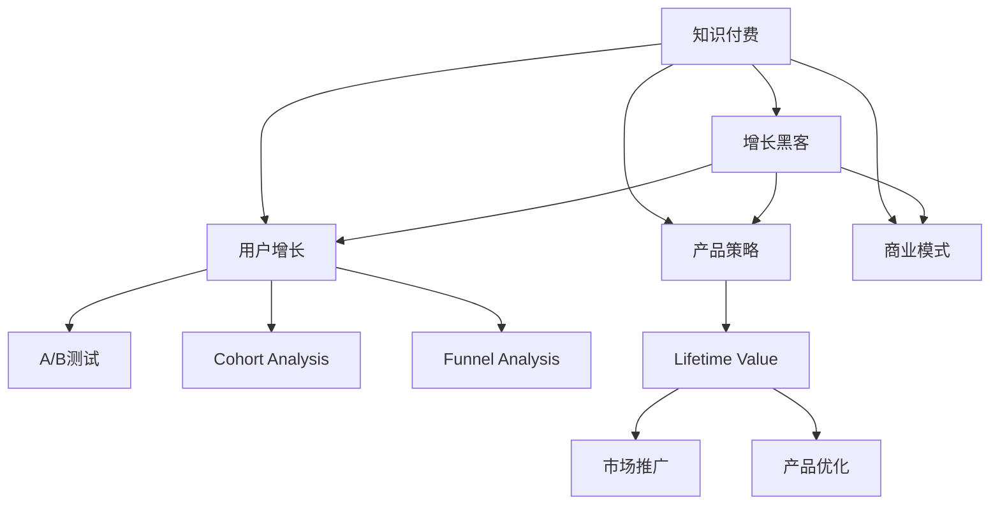

                 

# 知识付费创业的增长黑客策略

> 关键词：知识付费, 增长黑客, 用户增长, 产品策略, 商业模式, 数据驱动

## 1. 背景介绍

### 1.1 问题由来
随着知识经济时代的到来，知识付费成为了一种流行趋势，涌现出大量的知识付费平台和产品。然而，知识付费市场竞争激烈，用户获取成本高，留存难度大，产品模式同质化严重。如何在激烈的市场竞争中脱颖而出，是知识付费创业者面临的重大挑战。

### 1.2 问题核心关键点
知识付费创业的核心在于如何构建一个用户增长的闭环，即通过精准的用户获取、高效的留存、高价值的转化，最终实现产品的商业化变现。增长黑客的方法论为此提供了有力的工具和策略。

### 1.3 问题研究意义
掌握增长黑客的方法，有助于知识付费创业者系统地解决用户增长问题，降低获取和留存成本，提升产品市场竞争力，实现快速商业化变现。同时，通过数据驱动的增长策略，还能最大化产品价值，提升用户体验。

## 2. 核心概念与联系

### 2.1 核心概念概述

为更好地理解知识付费创业的增长黑客策略，本节将介绍几个密切相关的核心概念：

- 知识付费：指用户为获取知识而支付费用的行为，通常涉及在线课程、电子书、咨询、培训等形式。
- 增长黑客：指采用数据驱动的方法，快速设计、测试和优化产品，以实现用户增长的职业群体。
- 用户增长：指通过市场推广、产品优化、数据分析等手段，增加产品用户数量和用户活跃度的过程。
- 产品策略：指产品从设计到上市的全过程策略规划，涵盖用户体验、功能设计、市场推广等各方面。
- 商业模式：指产品或服务的价值创造、传递和获取方式，知识付费创业的核心在于实现知识价值变现。
- A/B测试：指通过对比两个或多个版本的产品功能或设计，找出最优版本的方法。
- Cohort Analysis（群组分析）：指通过对比不同用户群体的行为数据，评估产品策略的效果。
- Funnel Analysis（漏斗分析）：指通过分析用户转化过程中的各个环节，找出阻碍用户转化的关键因素。
- Lifetime Value（LTV）：指用户在整个生命周期内为产品带来的总价值。

这些核心概念之间的逻辑关系可以通过以下Mermaid流程图来展示：



这个流程图展示了这个核心概念之间的联系和作用关系：

1. 知识付费作为产品形态，通过增长黑客的方法论实现用户增长。
2. 增长黑客通过用户增长和产品策略实现用户数量和活跃度的提升。
3. 产品策略通过商业模式，实现知识付费的商业变现。
4. 用户增长、产品策略和商业模式通过A/B测试、Cohort Analysis、Funnel Analysis等方法进行优化。
5. Lifetime Value作为用户价值的度量，引导市场推广和产品优化策略。

## 3. 核心算法原理 & 具体操作步骤
### 3.1 算法原理概述

知识付费创业的增长黑客策略，本质上是通过数据驱动的方法，对用户行为进行分析和优化，以实现用户增长的闭环。其核心思想是：

- 利用数据洞察用户行为和需求，优化产品功能和用户体验。
- 通过A/B测试和群组分析，找到最优的产品策略。
- 利用漏斗分析和生命周期价值，评估产品转化率和用户价值。
- 基于上述分析结果，进行市场推广和产品优化的迭代改进。

### 3.2 算法步骤详解

知识付费创业的增长黑客策略主要包括以下几个关键步骤：

**Step 1: 数据收集与分析**

- 设计用户行为数据收集方案，涵盖产品使用时长、活跃度、转化路径等关键指标。
- 使用SQL、Python等工具对数据进行清洗、处理和分析，生成可用的数据集。

**Step 2: A/B测试与迭代**

- 设定A/B测试的目标，确定测试指标和测试时间。
- 设计测试方案，将产品功能或设计分为两个或多个版本进行对比。
- 收集测试数据，评估不同版本的效果，选择最优版本进行推广。

**Step 3: 用户分群与优化**

- 通过Cohort Analysis，将用户分成不同的群组，如新用户、老用户、高价值用户等。
- 对不同用户群体进行针对性分析，找到导致流失或转化的关键因素。
- 根据分析结果，进行产品功能的优化和调整，提升用户留存率。

**Step 4: 用户转化与漏斗分析**

- 通过Funnel Analysis，构建用户转化漏斗，识别转化过程中各个环节的瓶颈。
- 分析不同环节的用户行为，找出导致转化失败的原因。
- 针对性地进行产品优化，提高用户转化率。

**Step 5: 市场推广与LTV分析**

- 根据Lifetime Value的评估结果，确定市场推广的重点群体和策略。
- 利用数据驱动的方法，进行用户获取和留存成本的优化。
- 定期评估产品策略的效果，进行迭代改进。

### 3.3 算法优缺点

增长黑客的方法论在知识付费创业中具有以下优点：

1. 数据驱动：通过数据洞察用户行为和需求，优化产品功能和用户体验。
2. 迭代改进：通过A/B测试和群组分析，快速验证和优化产品策略。
3. 高效留存：通过用户分群和优化，提高用户留存率。
4. 转化提升：通过漏斗分析和市场推广，提高用户转化率。
5. 商业变现：通过Lifetime Value评估，实现商业变现的最大化。

同时，该方法也存在一些局限性：

1. 数据质量要求高：数据收集和清洗过程复杂，需要高质量的数据源。
2. 实验周期长：A/B测试和群组分析需要较长的时间周期，实验结果可能存在一定的滞后性。
3. 策略复杂度高：需要综合考虑多个因素，策略制定和执行较为复杂。
4. 投入成本高：市场推广和产品优化需要较多的资源投入，投入产出比不一定高。

尽管存在这些局限性，但就目前而言，增长黑客的方法论在知识付费创业中仍然是最主流和有效的策略。未来相关研究的重点在于如何进一步降低数据收集和清洗的复杂度，提高策略执行的效率和准确性，同时兼顾成本和投入产出比等因素。

### 3.4 算法应用领域

增长黑客的方法论在知识付费创业中已经被广泛应用，覆盖了知识付费产品从设计到上市的全过程，例如：

- 用户获取：通过市场推广和广告投放，精准获取潜在用户。
- 用户留存：通过优化产品功能和体验，提高用户留存率。
- 用户转化：通过产品优化和市场推广，提高用户付费转化率。
- 产品优化：通过数据分析和用户反馈，不断改进产品功能和界面。
- 市场推广：通过数据驱动的营销策略，最大化产品市场覆盖率。

除了上述这些核心应用外，增长黑客的方法论还被创新性地应用于产品策略制定、商业模式优化、用户体验提升等多个环节，为知识付费产品的成功落地提供了有力的支撑。

## 4. 数学模型和公式 & 详细讲解 & 举例说明

### 4.1 数学模型构建

本节将使用数学语言对知识付费创业的增长黑客策略进行更加严格的刻画。

设知识付费产品的用户数为 $U(t)$，付费用户数为 $P(t)$，付费收入为 $R(t)$，用户生命周期价值为 $L(t)$，市场推广预算为 $B(t)$。则知识付费创业的增长黑客策略的数学模型可以表示为：

$$
\max_{\{U(t),P(t),R(t),L(t),B(t)\}} \sum_{t=1}^{T} R(t) - \sum_{t=1}^{T} B(t)
$$

其中，$T$ 表示用户生命周期时长，$R(t)$ 表示第 $t$ 期的付费收入，$B(t)$ 表示第 $t$ 期的市场推广预算。

### 4.2 公式推导过程

以用户转化率的优化为例，推导其数学模型和公式：

设用户在第 $t$ 期的转化率为 $\theta(t)$，则在第 $t+1$ 期的转化率为 $\theta(t+1)$。根据用户转化漏斗模型，转化率 $\theta(t+1)$ 可以表示为：

$$
\theta(t+1) = \theta(t) \times f(t) \times \prod_{i=1}^{n} p_i(t)
$$

其中 $f(t)$ 表示第 $t$ 期产品功能的改进效果，$p_i(t)$ 表示第 $i$ 个市场推广策略的效果。

通过优化上述模型，可以找到最优的 $f(t)$ 和 $p_i(t)$，从而提升用户转化率。

### 4.3 案例分析与讲解

假设某知识付费平台每月新增用户 10,000 人，其中 20% 的新用户在第 1 个月内付费，付费用户的月均付费为 50 元。平台每月推广预算为 100,000 元，用户生命周期为 12 个月。则根据上述模型，计算平台的付费收入和推广成本，如下所示：

- 用户总数：$U(1)=10,000$
- 付费用户数：$P(1)=10,000 \times 20\% = 2,000$
- 付费收入：$R(1)=P(1) \times 50 = 2,000 \times 50 = 100,000$ 元
- 推广成本：$B(1)=100,000$ 元

通过迭代计算，可以得到平台在后续月份的付费收入和推广成本，最终计算出平台在用户生命周期内的净收入。

## 5. 项目实践：代码实例和详细解释说明

### 5.1 开发环境搭建

在进行增长黑客的实践前，我们需要准备好开发环境。以下是使用Python进行增长的环境配置流程：

1. 安装Anaconda：从官网下载并安装Anaconda，用于创建独立的Python环境。

2. 创建并激活虚拟环境：
```bash
conda create -n growth-env python=3.8 
conda activate growth-env
```

3. 安装Python的科学计算库：
```bash
conda install numpy pandas scikit-learn statsmodels matplotlib tqdm jupyter notebook ipython
```

4. 安装增长相关的库：
```bash
pip install pyecharts google-cloud-bigquery
```

5. 安装可视化工具：
```bash
pip install plotly dash
```

完成上述步骤后，即可在`growth-env`环境中开始增长黑客的实践。

### 5.2 源代码详细实现

下面以知识付费平台的A/B测试为例，给出使用Python进行增长的代码实现。

首先，设计A/B测试的方案：

```python
import random

# 设定A/B测试的方案
def create_test_cases(n=1000):
    cases = []
    for i in range(n):
        cases.append((i % 2 == 0, "Version A"))
        cases.append((i % 2 == 1, "Version B"))
    return cases
```

然后，模拟用户行为数据，进行A/B测试：

```python
import random

# 模拟用户行为数据
def generate_user_behavior():
    users = set(range(10000))
    for user in users:
        # 20% 的用户在第 1 个月内付费
        if random.random() < 0.2:
            yield {"user_id": user, "pay_time": 1, "amount": 50}
        # 80% 的用户在第 1 个月内不付费
        else:
            yield {"user_id": user, "pay_time": 0, "amount": 0}

# 进行A/B测试
def run_a_b_test(test_cases):
    results = {"A": {}, "B": {}}
    for user, version in test_cases:
        if version == "A":
            # 假设用户付费率为 30%
            results["A"][user] = {"pay_time": 1, "amount": 50}
        else:
            # 假设用户付费率为 20%
            results["B"][user] = {"pay_time": 0, "amount": 0}
    return results
```

最后，统计测试结果，进行对比分析：

```python
# 统计测试结果
def analyze_test_results(results):
    total_paid_A = sum(result["pay_time"] == 1 for result in results["A"].values())
    total_paid_B = sum(result["pay_time"] == 1 for result in results["B"].values())
    total_paid = total_paid_A + total_paid_B
    avg_paid_A = total_paid_A / len(results["A"])
    avg_paid_B = total_paid_B / len(results["B"])
    avg_paid = total_paid / total_paid_A
    return avg_paid_A, avg_paid_B, avg_paid
```

### 5.3 代码解读与分析

让我们再详细解读一下关键代码的实现细节：

**create_test_cases函数**：
- 根据A/B测试的设计，生成不同版本的用户行为数据。

**generate_user_behavior函数**：
- 模拟用户行为数据，生成不同付费时间、金额的用户记录。

**run_a_b_test函数**：
- 根据用户行为数据进行A/B测试，统计不同版本的付费情况。

**analyze_test_results函数**：
- 对测试结果进行统计分析，计算不同版本的平均付费率和总付费率。

以上代码实现展示了知识付费平台的A/B测试过程，通过数据驱动的方法，找到最优的产品策略。

## 6. 实际应用场景

### 6.1 用户获取

知识付费平台可以利用数据洞察，进行精准的用户获取。通过分析用户行为数据，可以找出潜在用户群体，进行定向广告投放，提高用户获取的效率和质量。

### 6.2 用户留存

平台可以通过用户分群和产品优化，提高用户留存率。对于新用户，可以通过优化注册流程、提供免费试用等方式，降低用户流失率。对于老用户，可以通过定期推送高质量内容、个性化推荐等措施，提升用户活跃度。

### 6.3 用户转化

通过A/B测试和群组分析，平台可以不断优化产品功能和市场推广策略，提高用户转化率。对于高价值用户，可以通过提升产品内容质量和用户体验，增强用户的付费意愿。

### 6.4 市场推广

利用Lifetime Value的评估结果，平台可以确定市场推广的重点群体和策略，进行精准的营销推广，最大化用户获取和留存成本的投入产出比。

## 7. 工具和资源推荐

### 7.1 学习资源推荐

为了帮助增长黑客掌握用户增长的理论基础和实践技巧，这里推荐一些优质的学习资源：

1. 《增长黑客》一书：由知名增长专家撰写，全面介绍了用户增长的基本概念和成功案例。
2. 《增长思维》课程：由业界知名增长专家主讲，涵盖用户增长的方法论和工具应用。
3. 《增长实战》课程：由产品增长专家主讲，从市场推广、用户获取、产品优化等方面全面讲解。
4. 《数据分析与增长》课程：由数据科学专家主讲，涵盖数据驱动的增长策略和工具应用。

通过对这些资源的学习实践，相信你一定能够系统掌握知识付费创业的增长黑客策略，并应用于实际的项目开发中。

### 7.2 开发工具推荐

高效的增长黑客实践离不开优秀的工具支持。以下是几款用于增长黑客开发的常用工具：

1. Google Analytics：谷歌提供的网站数据分析工具，可以实时监测用户行为和流量数据。
2. Mixpanel：用户行为分析工具，支持事件追踪、漏斗分析等功能。
3. Amplitude：用户行为分析平台，支持复杂的数据分析和可视化。
4. Tableau：数据可视化工具，支持多维度数据分析和图表展示。
5. Jupyter Notebook：交互式编程环境，方便进行数据处理和代码实现。

合理利用这些工具，可以显著提升增长黑客的开发效率，加速策略的迭代和优化。

### 7.3 相关论文推荐

知识付费创业的增长黑客策略的研究源于学界的持续研究。以下是几篇奠基性的相关论文，推荐阅读：

1. "The Lean Startup"：埃里克·里斯著作，介绍了精益创业的方法论和案例。
2. "Customer Experience Management"：埃里克·莱斯著作，介绍了用户体验管理的理论和实践。
3. "Growth Hacker's Guide to Building World-Class Products"：本篇文章详细介绍了增长黑客的方法论和应用案例。
4. "Designing Growth: Growth Strategies for Product Managers"：本篇文章详细介绍了增长策略的制定和执行。

这些论文代表了这个领域的最新研究成果，通过学习这些前沿成果，可以帮助增长黑客更好地理解和应用用户增长的方法论，实现更高效的用户增长。

## 8. 总结：未来发展趋势与挑战

### 8.1 总结

本文对知识付费创业的增长黑客策略进行了全面系统的介绍。首先阐述了增长黑客的方法论在知识付费创业中的应用，明确了增长黑客策略在用户增长、产品优化和商业变现等方面的独特价值。其次，从原理到实践，详细讲解了用户增长的数学模型和操作步骤，给出了增长黑客任务开发的完整代码实例。同时，本文还广泛探讨了增长黑客策略在用户获取、留存、转化等方面的应用前景，展示了增长黑客范式的巨大潜力。此外，本文精选了增长黑客的各类学习资源，力求为读者提供全方位的技术指引。

通过本文的系统梳理，可以看到，增长黑客的方法论在知识付费创业中已经成为不可或缺的工具，助力企业实现快速增长和商业变现。未来，随着数据科学和人工智能技术的不断发展，增长黑客策略也将不断创新和优化，推动知识付费产品的持续发展和优化。

### 8.2 未来发展趋势

展望未来，知识付费创业的增长黑客策略将呈现以下几个发展趋势：

1. 数据驱动：通过更精准的数据分析和建模，实现用户增长的预测和优化。
2. 实时优化：通过实时数据监测和分析，实现用户增长的动态调整。
3. 自动化：通过自动化工具和算法，实现用户增长的高效执行。
4. 多渠道整合：整合多渠道的营销策略，实现全渠道的用户增长。
5. 个性化：通过个性化推荐和定向投放，提高用户获取和留存的效果。
6. 社交网络：利用社交网络的数据分析，实现用户增长的社交传播。

以上趋势凸显了增长黑客策略的未来发展方向，为知识付费创业带来了新的机遇和挑战。通过持续的技术创新和实践探索，增长黑客策略必将在知识付费领域大放异彩。

### 8.3 面临的挑战

尽管增长黑客策略在知识付费创业中已经取得了显著成效，但在迈向更加智能化、普适化应用的过程中，它仍面临诸多挑战：

1. 数据隐私问题：用户在数据收集和分析过程中可能面临隐私泄露的风险，需要制定严格的数据保护政策。
2. 数据质量问题：数据收集和处理过程中可能存在数据噪声和偏差，影响分析结果的准确性。
3. 策略复杂性：用户增长的策略制定和执行过程较为复杂，需要综合考虑多个因素。
4. 成本投入问题：市场推广和产品优化需要较多的资源投入，可能影响企业的盈利能力。
5. 用户疲劳问题：频繁的市场推广和产品优化可能使用户产生疲劳，降低用户粘性。

这些挑战需要增长黑客在实践中不断探索和优化，找到平衡数据驱动和用户隐私、成本投入和用户体验的策略。

### 8.4 研究展望

面对增长黑客策略所面临的种种挑战，未来的研究需要在以下几个方面寻求新的突破：

1. 探索更高效的数据收集和处理方法，提高数据的准确性和可靠性。
2. 研究更智能的市场推广策略，提高推广的精准度和效率。
3. 引入更多数据科学和人工智能技术，提升策略的执行效果。
4. 建立用户隐私保护机制，保障用户数据安全。
5. 研究用户疲劳问题，提高用户粘性和留存率。

这些研究方向将为知识付费创业的增长黑客策略带来新的突破，推动企业在数据驱动的增长道路上不断前行。

## 9. 附录：常见问题与解答

**Q1：如何选择合适的A/B测试目标？**

A: 选择合适的A/B测试目标，需要根据产品特性和用户需求，选择最关键的性能指标，如付费率、转化率、活跃度等。一般建议选择那些对业务影响最大的指标进行测试。

**Q2：如何进行A/B测试的变量控制？**

A: 在进行A/B测试时，需要对不同版本的功能或设计进行严格控制，避免其他变量的干扰。可以通过创建不同的测试组，并设置相同的用户行为，进行对比分析。

**Q3：如何进行群组分析和用户分群？**

A: 进行群组分析和用户分群，需要根据用户的属性和行为特征，将用户分成不同的群组。一般建议根据用户注册时间、活跃度、付费行为等关键因素进行分群。

**Q4：如何进行漏斗分析和用户转化提升？**

A: 进行漏斗分析，需要构建用户转化漏斗，识别转化过程中的关键环节。一般建议从注册、登录、浏览、购买等环节进行逐个分析，找出阻碍用户转化的因素。

**Q5：如何进行Lifetime Value的评估？**

A: 进行Lifetime Value的评估，需要根据用户的生命周期数据，计算用户在整个生命周期内的总价值。一般建议根据用户的活跃度和付费行为，进行长周期数据分析。

这些常见问题的解答，希望能为你提供有效的指导，帮助你在知识付费创业中顺利实现用户增长和商业变现。

---

作者：禅与计算机程序设计艺术 / Zen and the Art of Computer Programming

