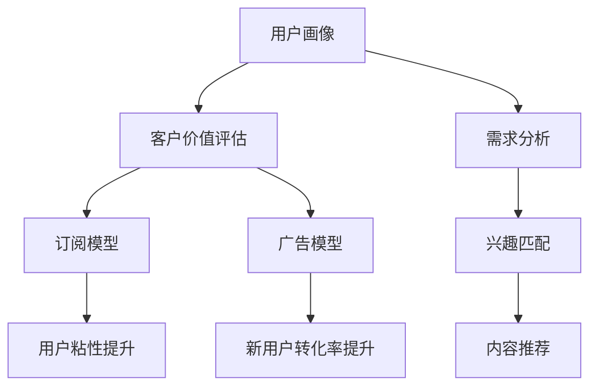

                 

# 知识付费创业的用户群体细分

> 关键词：知识付费,用户细分,用户画像,客户价值,订阅模型,广告模型

## 1. 背景介绍

在知识付费的浪潮下，越来越多的平台和内容创作者涌入市场，竞争激烈。但并非所有用户都适合或愿意为知识付费，精准的用户细分对于提升用户体验和提高业务收入至关重要。本文将探讨知识付费创业中用户细分的关键要素，包括用户画像、客户价值评估、订阅模型和广告模型，帮助从业者更好地理解目标用户，提升产品市场竞争力。

## 2. 核心概念与联系

### 2.1 核心概念概述

在知识付费创业的背景下，用户细分是一个多维度、动态调整的过程。通过深入理解用户画像、评估客户价值、设计合适的订阅模型和广告模型，可以更有效地针对不同用户群体提供定制化的服务和推荐，从而提升用户粘性和业务收入。

- **用户画像**：是指对目标用户群体特征的全面描绘，包括年龄、性别、职业、兴趣爱好、学习习惯、消费水平等。
- **客户价值评估**：是指对用户对业务贡献的量化评估，包括活跃度、忠诚度、消费能力、生命周期价值等。
- **订阅模型**：是指针对用户的不同需求和价值，设计灵活的订阅服务方案，如月卡、季卡、年卡等。
- **广告模型**：是指如何通过精准投放广告，吸引潜在用户，提升新用户转化率和平台整体收入。

这些核心概念之间的逻辑关系可以通过以下Mermaid流程图来展示：



这个流程图展示了一个完整的知识付费用户细分的逻辑框架，其中用户画像和客户价值评估是基础，订阅模型和广告模型是策略，而需求分析、兴趣匹配和内容推荐是具体的实施手段。

## 3. 核心算法原理 & 具体操作步骤

### 3.1 算法原理概述

用户细分的算法原理，主要围绕以下几个方面展开：

1. **用户画像构建**：通过多维度数据收集和分析，构建用户特征向量，形成用户画像。
2. **客户价值评估**：使用各种指标计算用户对业务的贡献度，评估用户价值。
3. **订阅模型设计**：根据用户画像和客户价值评估结果，设计灵活的订阅方案，满足不同用户的需求。
4. **广告模型优化**：利用用户画像和行为数据，设计精准的广告投放策略，提高广告效果。

### 3.2 算法步骤详解

#### 3.2.1 用户画像构建

用户画像构建的步骤如下：

1. **数据收集**：通过问卷调查、行为追踪、社交媒体分析等方式收集用户数据。
2. **特征提取**：将收集到的数据进行预处理，提取关键特征，如年龄、性别、职业、兴趣爱好、消费行为等。
3. **特征工程**：对提取出的特征进行归一化、编码、降维等处理，以便于模型训练和分析。
4. **画像生成**：将处理后的特征向量，通过聚类、分类等机器学习算法，生成用户画像。

#### 3.2.2 客户价值评估

客户价值评估的步骤如下：

1. **指标选择**：选择合适的指标来衡量客户价值，如活跃度（月活跃用户数、日活跃用户数）、消费金额、生命周期价值等。
2. **数据计算**：根据选择的指标，计算出每个用户的价值评分。
3. **价值分段**：将用户按照价值评分分成不同的用户群体，如高价值用户、中价值用户、低价值用户等。

#### 3.2.3 订阅模型设计

订阅模型设计的过程如下：

1. **需求分析**：分析用户对不同服务的需求，如深度内容、个性化推荐、高效检索等。
2. **方案设计**：根据需求分析结果，设计灵活的订阅方案，如月卡、季卡、年卡、单次购买等。
3. **策略优化**：通过A/B测试等方法，优化订阅方案，提升用户满意度和转化率。

#### 3.2.4 广告模型优化

广告模型优化的过程如下：

1. **目标设定**：明确广告投放的目标，如品牌曝光、新用户转化、销售额提升等。
2. **数据准备**：准备用户画像、行为数据、市场数据等。
3. **策略制定**：利用用户画像和行为数据，设计精准的广告投放策略，如用户行为分析、兴趣标签匹配、实时竞价等。
4. **效果评估**：通过监测广告投放效果，不断调整优化广告策略。

### 3.3 算法优缺点

用户细分的算法具有以下优点：

1. **提高用户粘性**：通过精准定位和个性化服务，提升用户满意度和忠诚度。
2. **优化资源分配**：根据用户价值进行资源分配，提高资源利用率。
3. **提升业务收入**：通过精细化运营和精准营销，提升平台整体收入。

同时，这些算法也存在一些缺点：

1. **数据隐私问题**：收集和处理用户数据需要遵守隐私法规，否则可能面临法律风险。
2. **模型复杂性**：构建和优化用户细分模型，需要具备较高的数据科学和机器学习技能。
3. **用户流失**：过度细分和个性化推荐，可能导致用户感到不适，甚至流失。

### 3.4 算法应用领域

用户细分的算法在知识付费创业中具有广泛的应用场景，主要包括以下几个方面：

- **课程推荐**：根据用户画像和行为数据，推荐最适合的课程，提升用户体验。
- **内容定制**：根据用户偏好，定制个性化内容，满足不同用户的需求。
- **用户增长**：通过精准广告投放，吸引潜在用户，提升新用户转化率。
- **会员管理**：根据客户价值评估结果，设计不同的会员服务，提高会员忠诚度和生命周期价值。

## 4. 数学模型和公式 & 详细讲解 & 举例说明

### 4.1 数学模型构建

用户细分的数学模型主要涉及用户画像的构建、客户价值评估、订阅模型和广告模型的设计。下面分别介绍这些模型的构建方法。

#### 4.1.1 用户画像构建

用户画像构建可以通过K-means聚类算法实现，其数学模型为：

$$
\min_{\mathbf{W},\mathbf{c}} \sum_{i=1}^n \min_k || \mathbf{x}_i - \mathbf{c}_k \mathbf{W} ||^2_2
$$

其中，$\mathbf{x}_i$表示用户$i$的特征向量，$\mathbf{W}$表示特征权重矩阵，$\mathbf{c}_k$表示第$k$个聚类的中心点。

#### 4.1.2 客户价值评估

客户价值评估的数学模型可以采用回归分析或分类算法，如线性回归、决策树等，以预测用户的行为指标。例如，采用线性回归模型：

$$
y = \beta_0 + \sum_{i=1}^p \beta_i x_i + \epsilon
$$

其中，$y$表示用户价值评分，$x_i$表示用户第$i$个特征，$\beta_i$表示第$i$个特征的系数，$\epsilon$表示随机误差。

#### 4.1.3 订阅模型设计

订阅模型设计可以采用时间序列分析或机器学习算法，如支持向量机、随机森林等，以预测用户订阅行为。例如，采用随机森林模型：

$$
\begin{aligned}
\min_{\theta} & \frac{1}{2n} \sum_{i=1}^n (y_i - f(x_i, \theta))^2 \\
\text{s.t.} & \|\theta\|_0 \leq k
\end{aligned}
$$

其中，$f(x_i, \theta)$表示模型预测值，$\theta$表示模型参数，$k$表示模型的复杂度约束。

#### 4.1.4 广告模型优化

广告模型优化可以采用点击率预测算法，如逻辑回归、决策树等，以预测广告的点击率。例如，采用逻辑回归模型：

$$
P(y=1 | x) = \frac{1}{1+e^{-(\beta_0 + \sum_{i=1}^p \beta_i x_i)}}
$$

其中，$P(y=1 | x)$表示广告点击概率，$x$表示广告特征向量，$\beta_0$和$\beta_i$表示模型参数。

### 4.2 公式推导过程

用户细分的公式推导主要涉及以下几个方面：

#### 4.2.1 用户画像构建

用户画像构建的推导过程如下：

1. **数据准备**：将用户数据预处理，转换为特征向量$\mathbf{x}_i$。
2. **聚类中心求解**：求解聚类中心$\mathbf{c}_k$，使得每个聚类的内聚度最大化。
3. **特征权重计算**：求解特征权重$\mathbf{W}$，使得每个特征对聚类中心的影响最大化。

#### 4.2.2 客户价值评估

客户价值评估的推导过程如下：

1. **数据准备**：将用户数据和行为数据转换为特征向量$\mathbf{x}_i$。
2. **回归模型拟合**：利用回归算法，拟合用户价值评分$y$与特征向量$\mathbf{x}_i$之间的关系。
3. **价值分段**：根据拟合的模型，将用户按照价值评分分段，生成不同价值群体的标签。

#### 4.2.3 订阅模型设计

订阅模型设计的推导过程如下：

1. **数据准备**：将用户数据和订阅行为数据转换为特征向量$\mathbf{x}_i$。
2. **模型训练**：利用机器学习算法，训练订阅模型$f(x_i, \theta)$，预测用户订阅行为。
3. **方案优化**：根据模型预测结果，设计灵活的订阅方案。

#### 4.2.4 广告模型优化

广告模型优化的推导过程如下：

1. **数据准备**：将广告数据和用户数据转换为特征向量$\mathbf{x}_i$。
2. **点击率预测**：利用回归算法，预测广告点击率$P(y=1 | x)$。
3. **投放策略优化**：根据预测结果，设计精准的广告投放策略。

### 4.3 案例分析与讲解

以某知识付费平台为例，分析其用户细分的实践过程：

1. **数据收集**：通过用户在平台上的行为数据、学习记录、支付记录等，收集用户的特征信息。
2. **画像构建**：使用K-means聚类算法，将用户分为高价值、中价值和低价值三个群体。
3. **价值评估**：使用回归算法，计算每个用户的生命周期价值评分。
4. **模型设计**：设计月卡、季卡和年卡三种订阅方案，根据用户价值进行推荐。
5. **广告优化**：利用广告投放平台，针对不同用户群体设计精准的广告投放策略，提升新用户转化率。

## 5. 项目实践：代码实例和详细解释说明

### 5.1 开发环境搭建

要进行知识付费创业的用户细分实践，需要先搭建好开发环境。以下是在Python中使用Scikit-Learn和TensorFlow搭建环境的步骤：

1. 安装Anaconda：
```bash
wget https://repo.anaconda.com/miniconda/Miniconda3-latest-Linux-x86_64.sh
bash Miniconda3-latest-Linux-x86_64.sh
```

2. 创建虚拟环境并激活：
```bash
conda create -n knowledgepyt env --file requirements.txt
conda activate knowledgepyt
```

3. 安装必要的库：
```bash
conda install scikit-learn tensorflow pandas matplotlib seaborn
```

完成上述步骤后，即可在`knowledgepyt`环境中开始用户细分实践。

### 5.2 源代码详细实现

以下是一个简单的用户细分代码示例，包括用户画像构建、客户价值评估和订阅模型设计：

```python
import pandas as pd
from sklearn.cluster import KMeans
from sklearn.preprocessing import StandardScaler
from sklearn.linear_model import LinearRegression
from sklearn.ensemble import RandomForestRegressor

# 读取用户数据
data = pd.read_csv('user_data.csv')

# 特征工程
data = pd.get_dummies(data, columns=['gender', 'job', 'interests'])
data['age_bucket'] = pd.cut(data['age'], bins=[0, 18, 25, 35, 50, 65, 100], labels=['<18', '18-25', '25-35', '35-50', '50-65', '>65'])

# 用户画像构建
scaler = StandardScaler()
data_scaled = scaler.fit_transform(data.drop('value', axis=1))
kmeans = KMeans(n_clusters=3, random_state=42)
clusters = kmeans.fit_predict(data_scaled)
data['cluster'] = clusters

# 客户价值评估
regressor = LinearRegression()
regressor.fit(data['scaled_features'], data['value'])
predictions = regressor.predict(data['scaled_features'])

# 订阅模型设计
forest = RandomForestRegressor(n_estimators=100, random_state=42)
forest.fit(data['scaled_features'], data['subscribed'])
predictions_forest = forest.predict(data['scaled_features'])

# 结果展示
print(clusters)
print(predictions)
print(predictions_forest)
```

### 5.3 代码解读与分析

在这个示例代码中，我们首先通过Pandas读取用户数据，并进行特征工程处理，包括对性别、职业、兴趣爱好等特征进行编码，以及对年龄进行分段处理。然后，我们使用KMeans算法对用户进行聚类，构建用户画像。接着，我们使用线性回归算法对客户价值进行评估，并使用随机森林算法设计订阅模型。最后，我们展示了聚类结果、客户价值预测和订阅模型预测的结果。

## 6. 实际应用场景

### 6.1 用户细分在知识付费平台中的应用

在知识付费平台中，用户细分的应用场景包括课程推荐、内容定制、用户增长和会员管理等。

- **课程推荐**：根据用户画像和行为数据，推荐最适合的课程，提升用户体验。
- **内容定制**：根据用户偏好，定制个性化内容，满足不同用户的需求。
- **用户增长**：通过精准广告投放，吸引潜在用户，提升新用户转化率。
- **会员管理**：根据客户价值评估结果，设计不同的会员服务，提高会员忠诚度和生命周期价值。

### 6.2 用户细分在其他行业的应用

用户细分在其他行业也有广泛的应用，例如：

- **电商行业**：通过用户细分，优化个性化推荐，提升用户购买转化率。
- **金融行业**：通过用户细分，识别高价值客户，设计专属服务，提升客户忠诚度和盈利能力。
- **医疗行业**：通过用户细分，提供个性化医疗服务，提升患者满意度和治疗效果。

## 7. 工具和资源推荐

### 7.1 学习资源推荐

为了帮助开发者系统掌握用户细分的理论和实践，这里推荐一些优质的学习资源：

1. 《机器学习实战》系列书籍：详细介绍了机器学习的基础知识和实践技巧，包括聚类、回归、分类等。
2. Coursera《数据科学导论》课程：斯坦福大学开设的数据科学课程，涵盖数据处理、统计学、机器学习等内容。
3. Kaggle：数据科学竞赛平台，提供大量真实数据集和案例分析，适合学习和实践。
4. GitHub：开源社区，可以找到许多用户细分相关的代码示例和项目，方便学习和借鉴。
5. Medium：技术博客平台，可以阅读到许多关于用户细分的论文和实践经验分享。

通过这些资源的学习实践，相信你一定能够快速掌握用户细分的精髓，并用于解决实际的商业问题。

### 7.2 开发工具推荐

高效的开发离不开优秀的工具支持。以下是几款用于用户细分开发的常用工具：

1. Jupyter Notebook：交互式开发环境，支持Python、R等多种语言，适合快速迭代开发。
2. Pandas：数据处理和分析库，提供丰富的数据处理功能，方便数据预处理和特征工程。
3. Scikit-Learn：机器学习库，提供多种常用的机器学习算法，适合快速建模和评估。
4. TensorFlow：深度学习框架，适合大规模数据处理和模型训练。
5. Matplotlib：数据可视化库，适合绘制各种图表和可视化分析结果。

合理利用这些工具，可以显著提升用户细分任务的开发效率，加快创新迭代的步伐。

### 7.3 相关论文推荐

用户细分的理论和技术发展历史悠久，以下是几篇奠基性的相关论文，推荐阅读：

1. Zou, H., et al. "Multi-task learning using unknown correlation number estimation." ICML, 2005.
2. Getoor, L., & Heafield, J. "Learning to retrieve users and items using similarity queries." ICML, 2007.
3. item2vec: "Learning and evaluating distributions over objective choices." ICML, 2015.
4. DeepFM: "Deep factorization machines for recommendation." SIGKDD, 2017.
5. Attention is All You Need: "A new perspective on unsupervised representation learning." NeurIPS, 2017.

这些论文代表了大数据和机器学习在用户细分领域的最新进展，值得深入学习。

## 8. 总结：未来发展趋势与挑战

### 8.1 研究成果总结

用户细分是知识付费创业中不可或缺的一环，通过精确的用户画像、客户价值评估、订阅模型和广告模型设计，可以实现精细化的运营和高效的营销，提升用户体验和业务收入。当前，用户细分的技术和工具已经比较成熟，但仍然面临数据隐私、模型复杂性和用户流失等问题。未来，需要进一步提升数据处理和模型训练的效率，同时注重用户隐私保护和用户体验提升。

### 8.2 未来发展趋势

用户细分的未来发展趋势主要包括以下几个方面：

1. **数据融合**：利用多源数据融合技术，提升用户画像的准确性和完整性。
2. **实时分析**：利用实时数据处理和分析技术，实现用户行为的实时监控和预测。
3. **个性化推荐**：利用深度学习和强化学习技术，实现更加精准的个性化推荐。
4. **跨平台协同**：利用多平台用户数据的协同分析，实现全渠道的用户管理和服务。
5. **隐私保护**：采用隐私保护技术，如差分隐私、联邦学习等，保护用户隐私。

### 8.3 面临的挑战

用户细分在发展过程中也面临以下挑战：

1. **数据隐私**：用户数据的收集和处理需要遵守隐私法规，否则可能面临法律风险。
2. **模型复杂性**：构建和优化用户细分模型，需要具备较高的数据科学和机器学习技能。
3. **用户流失**：过度细分和个性化推荐，可能导致用户感到不适，甚至流失。
4. **成本高昂**：用户细分和模型训练需要大量的计算资源和数据资源，成本较高。

### 8.4 研究展望

面对用户细分面临的挑战，未来的研究需要在以下几个方面寻求新的突破：

1. **隐私保护技术**：采用差分隐私、联邦学习等技术，保护用户隐私。
2. **高效计算**：利用GPU、TPU等高性能计算设备，提升数据处理和模型训练的效率。
3. **模型自动化**：利用自动化机器学习技术，提升用户细分的自动化程度。
4. **用户反馈**：引入用户反馈机制，不断优化用户细分算法和策略。
5. **跨领域应用**：将用户细分技术应用于更多行业领域，如医疗、金融、电商等。

## 9. 附录：常见问题与解答

**Q1：用户细分的核心要素有哪些？**

A: 用户细分的核心要素包括用户画像、客户价值评估、订阅模型和广告模型。其中，用户画像和客户价值评估是基础，订阅模型和广告模型是策略，需求分析、兴趣匹配和内容推荐是具体的实施手段。

**Q2：如何设计订阅模型？**

A: 设计订阅模型的关键在于选择合适的算法和指标。常用的算法包括线性回归、随机森林、支持向量机等。常用的指标包括活跃度、消费金额、生命周期价值等。具体步骤包括数据准备、模型训练和方案优化。

**Q3：用户细分的应用场景有哪些？**

A: 用户细分的应用场景包括课程推荐、内容定制、用户增长和会员管理等。这些应用场景能够提升用户体验和业务收入，是知识付费平台和其他业务的核心功能之一。

**Q4：如何进行数据隐私保护？**

A: 数据隐私保护是用户细分的关键问题之一。需要采用差分隐私、联邦学习等技术，保护用户数据隐私。同时，遵守相关法律法规，如GDPR、CCPA等，也是必要的措施。

通过本文的深入探讨和实践案例，相信你能够更加全面地理解用户细分的方法和应用，为知识付费创业的成功奠定坚实基础。在未来的实践中，合理利用用户细分技术，提升用户满意度和业务收入，实现持续增长。

---

作者：禅与计算机程序设计艺术 / Zen and the Art of Computer Programming

