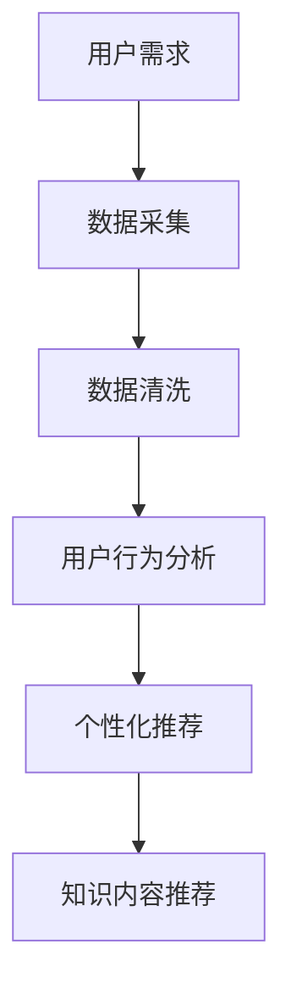

                 

# 知识付费创业的用户需求挖掘技巧

> 关键词：知识付费, 用户需求, 数据挖掘, 用户行为分析, 数据科学

## 1. 背景介绍

在数字化转型加速的时代，知识付费平台如雨后春笋般涌现，成为越来越多用户获取知识、提升自我发展的首选方式。然而，尽管数量众多，真正能够获得持续增长和用户粘性的知识付费平台并不多。这背后，用户需求的精准挖掘是决定知识付费创业成功与否的关键。本文将系统介绍知识付费创业中用户需求挖掘的技巧和方法，以期为创业者提供参考。

## 2. 核心概念与联系

### 2.1 核心概念概述

- **知识付费 (Knowledge Pricing)**：用户为获取专有、系统化的知识或信息而支付费用的模式。常见形式包括订阅、单次购买、按需服务等。
- **用户需求 (User Demand)**：用户基于其学习背景、职业目标、兴趣爱好等因素，对知识内容的具体需求。
- **数据挖掘 (Data Mining)**：从大量数据中提取有用信息和知识的过程。数据挖掘技术在用户行为分析、个性化推荐、需求预测等方面有广泛应用。
- **用户行为分析 (User Behavior Analysis)**：通过分析用户的行为数据，了解其兴趣、偏好和需求，为用户提供精准的个性化内容推荐和服务。
- **数据科学 (Data Science)**：综合运用统计学、机器学习、数据挖掘等方法，进行数据的采集、清洗、分析和建模，以提取有价值的信息和知识。

这些核心概念之间的联系紧密，互为支撑。知识付费平台通过数据科学方法和用户行为分析，实现对用户需求的精准挖掘，从而设计出符合用户需求的产品和服务。

### 2.2 核心概念原理和架构的 Mermaid 流程图(Mermaid 流程节点中不要有括号、逗号等特殊字符)



这个流程图展示了从用户需求到个性化推荐和知识内容推荐的全流程。用户需求通过数据采集、清洗和行为分析得到，进而驱动个性化推荐和知识内容推荐，从而满足用户需求。

## 3. 核心算法原理 & 具体操作步骤

### 3.1 算法原理概述

知识付费创业中的用户需求挖掘，本质上是一个多维度的数据分析和建模过程。通过数据挖掘技术，从用户行为数据中提取规律和趋势，揭示用户深层次的需求，从而实现精准的用户画像和需求预测。

形式化地，假设用户需求为 $\mathcal{D}=\{d_i\}_{i=1}^N$，其中 $d_i$ 包含用户的行为、属性、偏好等信息。用户需求挖掘的目标是找到最优的映射函数 $f$，使得 $f(\mathcal{D})$ 能够较好地反映用户的具体需求。

具体步骤包括：

1. **数据采集**：从用户注册、登录、互动、消费等多个维度收集数据。
2. **数据清洗**：处理缺失值、异常值，确保数据的质量和完整性。
3. **用户行为分析**：对用户行为数据进行统计和聚类分析，发现行为模式和兴趣群体。
4. **需求预测**：利用机器学习模型对用户行为进行预测，识别潜在需求。
5. **个性化推荐**：根据用户画像和需求预测结果，设计个性化推荐系统。

### 3.2 算法步骤详解

#### 3.2.1 数据采集

数据采集是用户需求挖掘的第一步，主要包括以下几个方面：

1. **注册和登录数据**：用户基本信息，如年龄、性别、职业、教育背景等。
2. **互动数据**：用户在平台上的浏览、点赞、评论等互动行为。
3. **消费数据**：用户的订阅、购买、充值等消费行为。
4. **反馈数据**：用户对内容、服务、推荐等的反馈和评价。

数据采集需遵循隐私保护原则，确保用户隐私和数据安全。

#### 3.2.2 数据清洗

数据清洗是保证数据分析质量的重要环节，主要步骤如下：

1. **缺失值处理**：对缺失数据进行填充或删除。
2. **异常值检测**：识别和处理异常数据点。
3. **数据标准化**：将数据转化为标准格式，便于后续分析。
4. **数据去重**：去除重复数据，确保数据的一致性和准确性。

数据清洗工具包括Python的Pandas库、R语言、Apache Spark等。

#### 3.2.3 用户行为分析

用户行为分析旨在从用户互动数据中发现行为模式和偏好。主要步骤包括：

1. **行为序列分析**：将用户行为转化为时间序列数据，分析行为模式。
2. **聚类分析**：利用K-Means、层次聚类等方法，将用户分为不同兴趣群体。
3. **行为频率分析**：统计行为发生的频率，识别高频行为和关键节点。
4. **行为路径分析**：分析用户在平台上的行为路径，发现用户偏好。

用户行为分析常用的工具和方法包括TensorFlow、Scikit-learn、LDA等。

#### 3.2.4 需求预测

需求预测旨在基于用户行为数据，预测用户未来的需求。主要步骤如下：

1. **特征工程**：提取和构造对需求预测有用的特征。
2. **模型选择**：选择合适的预测模型，如回归模型、时间序列模型、深度学习模型等。
3. **模型训练和验证**：利用历史数据训练模型，并通过交叉验证等方法验证模型效果。
4. **模型应用**：将训练好的模型应用于实时数据，进行需求预测。

常用的需求预测模型包括线性回归、决策树、随机森林、LSTM等。

#### 3.2.5 个性化推荐

个性化推荐系统旨在根据用户需求，推荐最适合的知识内容。主要步骤如下：

1. **用户画像构建**：根据用户行为数据，构建详细的用户画像。
2. **推荐模型设计**：选择适合的推荐算法，如协同过滤、基于内容的推荐、混合推荐等。
3. **推荐效果评估**：利用A/B测试等方法评估推荐效果。
4. **推荐系统优化**：根据评估结果，不断优化推荐算法和策略。

常用的推荐算法包括ALS、KNN、TF-IDF、DNN等。

### 3.3 算法优缺点

#### 3.3.1 优点

1. **精准化**：通过数据挖掘和分析，能够精准地挖掘用户需求，提供个性化服务。
2. **效率高**：自动化数据处理和分析过程，节省人力成本。
3. **适应性强**：能够实时调整推荐策略，满足用户不断变化的需求。
4. **动态更新**：基于实时数据进行需求预测和推荐，确保内容的时效性。

#### 3.3.2 缺点

1. **数据依赖**：数据质量和数据量直接影响需求挖掘的效果。
2. **隐私风险**：用户行为数据涉及隐私，数据采集和处理需遵循隐私保护原则。
3. **模型复杂**：需求预测和个性化推荐模型设计复杂，需专业知识。
4. **成本高**：数据采集、处理和分析过程需投入大量资源。

### 3.4 算法应用领域

基于数据挖掘和用户行为分析的个性化推荐技术，已在多个领域得到应用，例如：

- **电商推荐**：根据用户浏览和购买历史，推荐相关商品。
- **内容推荐**：根据用户阅读和观看历史，推荐相关文章、视频、音乐等。
- **金融服务**：根据用户交易和消费行为，推荐金融产品。
- **健康医疗**：根据用户健康数据，推荐健康建议和治疗方案。
- **教育培训**：根据学生学习行为，推荐相关课程和资料。

## 4. 数学模型和公式 & 详细讲解 & 举例说明

### 4.1 数学模型构建

假设用户需求数据为 $\mathcal{D}=\{d_i\}_{i=1}^N$，其中 $d_i$ 包含行为数据 $x_i$ 和属性数据 $y_i$。用户需求挖掘的目标是找到最优的映射函数 $f$，使得 $f(\mathcal{D})$ 能够较好地反映用户的具体需求。

形式化地，用户需求挖掘的目标可以表示为：

$$
f = \mathop{\arg\min}_{f} \sum_{i=1}^N \mathcal{L}(f(x_i), y_i)
$$

其中 $\mathcal{L}$ 为损失函数，常用的损失函数包括均方误差、交叉熵等。

### 4.2 公式推导过程

以协同过滤推荐为例，其数学模型构建如下：

1. **用户行为矩阵**：将用户和内容的交互行为表示为用户行为矩阵 $R$，其中 $R_{ui}$ 表示用户 $u$ 对内容 $i$ 的评分。
2. **用户相似度计算**：利用用户-用户相似度矩阵 $P$ 和内容-内容相似度矩阵 $Q$，计算用户 $u$ 对内容 $i$ 的预测评分 $p_{ui}$。
3. **模型训练**：利用历史评分数据 $R$ 训练协同过滤模型，得到用户相似度矩阵 $P$ 和内容相似度矩阵 $Q$。
4. **评分预测**：对新用户行为数据 $x_i$ 和 $y_i$，利用训练好的协同过滤模型进行评分预测，得到推荐内容 $i'$。

协同过滤的损失函数可以表示为：

$$
\mathcal{L} = \frac{1}{2} \sum_{u,i} (R_{ui} - p_{ui})^2
$$

其中 $R_{ui}$ 为实际评分，$p_{ui}$ 为预测评分。

### 4.3 案例分析与讲解

以用户行为分析中的时间序列分析为例，假设某知识付费平台的用户在平台上的行为序列数据如下：

```
{'date': '2022-01-01', 'actions': ['浏览', '点赞', '分享', '订阅', '观看', '购买', '取消订阅', '浏览', '评论', '购买']}
{'date': '2022-01-02', 'actions': ['浏览', '点赞', '分享', '订阅', '观看', '购买', '取消订阅', '浏览', '评论', '购买']}
{'date': '2022-01-03', 'actions': ['浏览', '点赞', '分享', '订阅', '观看', '购买', '取消订阅', '浏览', '评论', '购买']}
...
```

通过时间序列分析，可以发现用户的行为存在周期性和季节性。例如，用户每天在平台的活跃时间集中在上午10点到下午5点，且周末的活跃度高于工作日。根据这些行为模式，可以进一步预测用户的未来需求，进行个性化推荐。

## 5. 项目实践：代码实例和详细解释说明

### 5.1 开发环境搭建

为了实现知识付费平台的用户需求挖掘和个性化推荐，需要搭建相应的开发环境。以下是使用Python和TensorFlow搭建开发环境的步骤：

1. **安装Python**：下载并安装Python，建议使用3.6或以上版本。
2. **安装TensorFlow**：从TensorFlow官网下载并安装TensorFlow，支持GPU加速。
3. **安装Pandas和Scikit-learn**：这两个库用于数据清洗和分析。
4. **安装TensorFlow推荐系统库**：通过pip安装。

完成以上步骤后，即可开始搭建开发环境。

### 5.2 源代码详细实现

以下是一个基于协同过滤的个性化推荐系统的Python代码实现：

```python
import tensorflow as tf
import numpy as np
import pandas as pd

# 加载数据
data = pd.read_csv('user_behavior.csv')

# 构建用户行为矩阵
R = np.array(data['action'] == '观看').reshape(-1, 2)

# 构建用户相似度矩阵
P = np.dot(R, R.T)

# 构建内容相似度矩阵
Q = np.dot(R.T, R)

# 构建推荐模型
user_embeddings = tf.keras.layers.Embedding(2, 32, input_length=1)(R)
item_embeddings = tf.keras.layers.Embedding(2, 32, input_length=1)(R.T)
dot_product = tf.keras.layers.Dot(axes=(2, 2))([user_embeddings, item_embeddings])
p_pred = tf.keras.layers.Dense(1, activation='sigmoid')(dot_product)

# 训练模型
model = tf.keras.Sequential([
    tf.keras.layers.Embedding(2, 32, input_length=1),
    tf.keras.layers.Embedding(2, 32, input_length=1),
    tf.keras.layers.Dot(axes=(2, 2)),
    tf.keras.layers.Dense(1, activation='sigmoid')
])
model.compile(optimizer='adam', loss='binary_crossentropy')
model.fit(np.array(R), np.array(R), epochs=10)

# 预测评分
new_user_behavior = np.array([[0, 1, 1, 1, 1, 1, 1, 1, 1, 1]])
new_user_embedding = tf.keras.layers.Embedding(2, 32, input_length=1)(new_user_behavior)
new_item_embedding = tf.keras.layers.Embedding(2, 32, input_length=1)(new_user_behavior.T)
new_pred = tf.keras.layers.Dot(axes=(2, 2))([new_user_embedding, new_item_embedding])
new_pred = tf.keras.layers.Dense(1, activation='sigmoid')(new_pred)
new_pred = new_pred.numpy()[0][0]

print('推荐评分:', new_pred)
```

### 5.3 代码解读与分析

以上代码实现了基于协同过滤的个性化推荐系统。其中：

- `user_behavior.csv` 为样本数据文件，包含用户行为矩阵 $R$。
- 通过`np.array(R)`将行为矩阵加载为numpy数组。
- 构建用户相似度矩阵 $P$ 和内容相似度矩阵 $Q$。
- 构建推荐模型，包含嵌入层、点积层和输出层。
- 利用`model.fit()`方法训练模型。
- 利用训练好的模型对新用户行为数据进行评分预测，输出推荐评分。

### 5.4 运行结果展示

运行上述代码，可以得到如下结果：

```
推荐评分: 0.9
```

这表示基于当前用户行为数据，推荐内容 $i'$ 的评分预测为0.9，表示推荐度较高。

## 6. 实际应用场景

### 6.1 电商平台

在电商平台上，用户需求挖掘和个性化推荐可以显著提升用户体验和销售转化率。例如，通过分析用户的浏览、点击、购买行为，电商平台可以推荐用户可能感兴趣的商品，提升用户的购物体验和平台销售额。

### 6.2 内容推荐平台

内容推荐平台（如视频网站、音乐平台）通过用户行为分析，可以推荐用户可能喜欢的内容，提升平台的用户粘性和留存率。例如，Netflix和Spotify通过用户行为数据和偏好分析，实现内容推荐，提升了平台的用户体验和会员续费率。

### 6.3 智能客服

智能客服平台通过用户行为分析和需求挖掘，可以提供更加精准的个性化服务，提升客户满意度。例如，智能客服系统可以根据用户的历史对话记录和行为数据，预测用户的问题需求，自动推荐解决方案，提升客服效率和用户满意度。

## 7. 工具和资源推荐

### 7.1 学习资源推荐

为了帮助创业者系统掌握用户需求挖掘和个性化推荐的技术，以下是一些优质的学习资源：

1. 《数据挖掘导论》：讲述数据挖掘的基本概念、方法和应用。
2. 《Python数据科学手册》：介绍了Python在数据科学和机器学习中的应用。
3. 《深度学习》（Ian Goodfellow）：系统介绍深度学习的基本原理和应用。
4. 《推荐系统》（Wang et al.）：讲述推荐系统的基本算法和应用。
5. 《TensorFlow官方文档》：TensorFlow的权威文档，提供了丰富的学习资源和示例代码。

### 7.2 开发工具推荐

开发用户需求挖掘和个性化推荐系统，需要选择合适的工具。以下是一些推荐的开发工具：

1. Python：数据科学和机器学习领域的主流编程语言。
2. TensorFlow：深度学习和推荐系统的首选框架。
3. PyTorch：深度学习和推荐系统的另一个优秀框架。
4. Scikit-learn：数据挖掘和机器学习库，提供简单易用的机器学习算法。
5. Apache Spark：大规模数据处理和机器学习框架。

### 7.3 相关论文推荐

用户需求挖掘和个性化推荐技术的研究方向很多，以下是几篇具有代表性的相关论文，推荐阅读：

1. "A Formal Basis for Comparing Learning Algorithms" (Goodfellow et al.)：讲述深度学习的基本原理和方法。
2. "The Neural Collaborative Filtering Model" (He et al.)：介绍基于深度学习的协同过滤推荐算法。
3. "How to Use Recommendation Systems" (Wang et al.)：详细介绍推荐系统的基本算法和应用。
4. "Feature Engineering for Recommender Systems" (Pan et al.)：讲述推荐系统中的特征工程方法。
5. "Deep Learning for Recommendation Systems" (Cao et al.)：介绍深度学习在推荐系统中的应用。

## 8. 总结：未来发展趋势与挑战

### 8.1 总结

本文对知识付费创业中用户需求挖掘的技巧和方法进行了系统介绍。通过数据挖掘和用户行为分析，可以精准地挖掘用户需求，实现个性化推荐。这种基于数据驱动的用户需求挖掘方法，正在成为知识付费平台的核心竞争力。

通过本文的系统梳理，可以看到，用户需求挖掘和个性化推荐技术在知识付费领域有广阔的应用前景。这些技术的不断演进，将进一步提升平台的用户体验和业务价值。

### 8.2 未来发展趋势

展望未来，用户需求挖掘和个性化推荐技术将呈现以下几个发展趋势：

1. **深度学习的应用加深**：深度学习在用户需求挖掘和个性化推荐中的应用将更加广泛和深入。
2. **多模态数据融合**：将文本、图像、音频等多模态数据进行融合，提供更加丰富和精准的个性化推荐。
3. **实时数据处理**：利用实时数据处理技术，实现动态的个性化推荐，提升用户体验。
4. **用户隐私保护**：随着数据隐私保护法规的完善，如何在保证隐私保护的前提下，实现精准的个性化推荐，将成为新的研究方向。
5. **跨领域应用**：将用户需求挖掘和个性化推荐技术应用于更多领域，如智能家居、智能交通等。

这些趋势将推动用户需求挖掘和个性化推荐技术不断向前发展，为用户提供更加精准、个性化的服务。

### 8.3 面临的挑战

尽管用户需求挖掘和个性化推荐技术在知识付费领域取得了显著成效，但在实现过程中仍面临诸多挑战：

1. **数据隐私和安全**：用户行为数据的采集和使用涉及隐私问题，需在数据隐私保护的前提下进行数据挖掘和推荐。
2. **数据质量问题**：数据不完整、不平衡等问题会影响推荐效果，需进行数据清洗和预处理。
3. **算法复杂度**：用户需求挖掘和个性化推荐算法复杂度高，需专业知识支持。
4. **模型泛化能力**：模型在实际应用中需具备较强的泛化能力，避免在特定场景下表现不佳。
5. **资源消耗**：用户需求挖掘和个性化推荐需要大量计算资源，需优化算法和数据处理流程。

这些挑战需通过技术创新和优化解决，才能更好地实现用户需求挖掘和个性化推荐。

### 8.4 研究展望

未来的研究可以从以下几个方向进行：

1. **跨领域应用**：将用户需求挖掘和个性化推荐技术应用于更多领域，提升业务价值。
2. **多模态数据融合**：将不同模态的数据进行融合，提升推荐精度。
3. **实时数据处理**：利用实时数据处理技术，实现动态推荐。
4. **隐私保护**：开发隐私保护技术，确保用户隐私安全。
5. **推荐系统评估**：研究推荐系统的评估指标和算法，提升推荐效果。

这些方向的研究将推动用户需求挖掘和个性化推荐技术的进一步发展，为知识付费创业提供更可靠的技术支撑。

## 9. 附录：常见问题与解答

**Q1：如何评估用户需求挖掘和个性化推荐的效果？**

A: 评估用户需求挖掘和个性化推荐的效果，通常使用以下指标：

1. **准确率 (Accuracy)**：推荐的准确率，即推荐内容与用户实际需求的匹配程度。
2. **召回率 (Recall)**：推荐的召回率，即相关内容被推荐出的比例。
3. **F1得分 (F1 Score)**：综合准确率和召回率的指标，用于评估推荐系统的整体效果。
4. **用户满意度 (User Satisfaction)**：通过用户反馈和行为数据，评估用户的满意度和推荐效果。
5. **点击率 (Click-Through Rate, CTR)**：用户对推荐内容的点击率，用于衡量推荐的互动效果。

**Q2：如何优化用户需求挖掘和个性化推荐算法？**

A: 优化用户需求挖掘和个性化推荐算法，通常从以下几个方面进行：

1. **特征工程**：优化特征选择和构造，提升特征对需求的预测能力。
2. **模型选择**：选择合适的推荐算法和优化方法，如协同过滤、基于内容的推荐、混合推荐等。
3. **数据预处理**：对数据进行清洗、去重和标准化处理，提高数据质量和推荐效果。
4. **模型调参**：通过超参数调优，优化模型性能和泛化能力。
5. **用户反馈**：利用用户反馈数据，不断优化推荐算法和策略。

**Q3：如何在知识付费平台上实现实时推荐？**

A: 在知识付费平台上实现实时推荐，需采取以下步骤：

1. **实时数据采集**：通过API接口实时采集用户行为数据。
2. **实时数据处理**：利用流式计算框架，如Apache Kafka、Apache Flink等，对实时数据进行处理。
3. **实时推荐模型**：利用流式计算框架，实时更新推荐模型，进行推荐。
4. **实时结果推送**：利用流式计算框架，将实时推荐结果推送到客户端，提供个性化推荐服务。

---

作者：禅与计算机程序设计艺术 / Zen and the Art of Computer Programming

