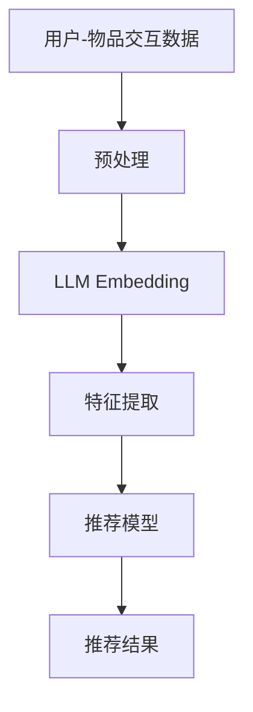

                 

## 1. 背景介绍

在当今信息爆炸的时代，用户面对海量的数据和信息，亟需一种有效的方式来获取相关和有用的内容。推荐系统因此应运而生，它通过分析用户的行为和偏好，为用户提供个性化的推荐。然而，传统的推荐系统通常基于用户-物品矩阵，存在数据稀疏、冷启动等问题。大语言模型（LLM）的出现为推荐系统带来了新的可能性，本文将介绍一种基于LLM Tokens的推荐系统特征提取方法。

## 2. 核心概念与联系

### 2.1 大语言模型（LLM）

大语言模型是一种深度学习模型，通过学习大量文本数据，掌握了语言的统计规律和语义理解能力。LLM可以生成人类语言，也可以用于文本分类、文本摘要等任务。

### 2.2 LLM Tokens

LLM将文本分成子单元（tokens）进行处理，如单词、字符等。LLM Tokens是LLM理解和生成文本的基本单位。

### 2.3 推荐系统特征提取

推荐系统特征提取是指从用户行为、物品特征等数据中提取有用的特征，这些特征将被用于推荐模型的训练。

下图是本文方法的架构图，展示了如何使用LLM Tokens提取推荐系统特征：



## 3. 核心算法原理 & 具体操作步骤

### 3.1 算法原理概述

本文提出的方法利用LLM将用户-物品交互数据转换为LLM Tokens，然后使用预训练的LLM生成Tokens的嵌入表示，最后从嵌入表示中提取推荐系统特征。

### 3.2 算法步骤详解

1. **预处理**：将用户-物品交互数据转换为LLM可以理解的格式，如文本序列。
2. **LLM Embedding**：使用预训练的LLM生成Tokens的嵌入表示。 LLMs通常使用Transformer结构，它将Tokens转换为高维向量表示，这些向量表示了Tokens的语义信息。
3. **特征提取**：从LLM Embedding中提取推荐系统特征。一种简单的方法是使用平均池化或最大池化操作将Tokens的嵌入表示聚合成用户或物品的表示。更复杂的方法可以使用注意力机制或其他神经网络层来提取特征。
4. **推荐模型**：使用提取的特征训练推荐模型。常用的推荐模型包括基于矩阵分解的模型、神经网络模型等。

### 3.3 算法优缺点

**优点**：

* LLM可以理解和生成人类语言，可以从文本数据中提取丰富的语义信息。
* LLM Tokens是LLM理解和生成文本的基本单位，使用LLM Tokens可以保留文本数据的细粒度信息。
* 使用预训练的LLM可以避免从头训练模型所需的大量数据和计算资源。

**缺点**：

* LLM的计算开销通常很大，这可能会限制其在推荐系统中的应用。
* LLM的表现可能受到预训练数据的质量和范围的影响。
* LLM的嵌入表示可能不够稳定，这可能会影响推荐系统的性能。

### 3.4 算法应用领域

本文方法可以应用于任何需要文本数据的推荐系统，如电影推荐、图书推荐、新闻推荐等。此外，本文方法也可以应用于跨模态推荐系统，如图文推荐、视频推荐等，只需将文本数据转换为LLM可以理解的格式即可。

## 4. 数学模型和公式 & 详细讲解 & 举例说明

### 4.1 数学模型构建

设用户-物品交互数据为$D = {(u_i, i, t_i)}_{i=1}^{N}$, 其中$u_i$是用户，$i$是物品，$t_i$是交互时间。我们的目标是使用LLM Tokens提取推荐系统特征，然后使用这些特征训练推荐模型。

### 4.2 公式推导过程

1. **预处理**：将用户-物品交互数据转换为LLM可以理解的格式。一种简单的方法是将用户-物品对表示为文本序列，如"用户$u_i$在时间$t_i$交互了物品$i$"。
2. **LLM Embedding**：使用预训练的LLM生成Tokens的嵌入表示。设LLM的嵌入维度为$d$, 则LLM生成的嵌入表示为$E \in \mathbb{R}^{N \times d}$, 其中$N$是Tokens的数量。
3. **特征提取**：从LLM Embedding中提取推荐系统特征。一种简单的方法是使用平均池化或最大池化操作将Tokens的嵌入表示聚合成用户或物品的表示。设用户$u_i$的表示为$h_{u_i} \in \mathbb{R}^{d}$, 则有：

$$h_{u_i} = \text{Pool}(E_{u_i})$$

其中$E_{u_i}$是用户$u_i$的Tokens的嵌入表示，$Pool$是池化操作。

4. **推荐模型**：使用提取的特征训练推荐模型。设推荐模型为$f$, 则预测用户$u_i$对物品$i$的喜好度为：

$$y_{u_i, i} = f(h_{u_i}, h_i)$$

其中$h_i$是物品$i$的表示。

### 4.3 案例分析与讲解

例如，在电影推荐系统中，用户-物品交互数据可以表示为"用户$u_i$在时间$t_i$评分了电影$i$为$r_i$"。我们可以将其转换为LLM可以理解的格式，如"用户$u_i$在时间$t_i$评分了电影$i$为$r_i$"。然后，我们可以使用预训练的LLM生成Tokens的嵌入表示，并使用平均池化操作将Tokens的嵌入表示聚合成用户或电影的表示。最后，我们可以使用这些表示训练推荐模型，预测用户对电影的喜好度。

## 5. 项目实践：代码实例和详细解释说明

### 5.1 开发环境搭建

本文方法的开发环境包括Python、PyTorch、Transformers库等。 Transformers库提供了预训练的LLM，如BERT、RoBERTa等。

### 5.2 源代码详细实现

以下是本文方法的伪代码实现：

```python
import torch
from transformers import AutoTokenizer, AutoModel

# 1. 预处理
def preprocess(data):
    # 将用户-物品交互数据转换为LLM可以理解的格式
    # 这里省略了具体的实现细节
    return text_data

# 2. LLM Embedding
def llm_embedding(text_data, model_name):
    # 加载预训练的LLM
    tokenizer = AutoTokenizer.from_pretrained(model_name)
    model = AutoModel.from_pretrained(model_name)

    # 将文本数据转换为Tokens
    inputs = tokenizer(text_data, return_tensors="pt", truncation=True, padding=True)

    # 生成Tokens的嵌入表示
    with torch.no_grad():
        embeddings = model(**inputs).last_hidden_state

    return embeddings

# 3. 特征提取
def feature_extraction(embeddings):
    # 使用平均池化操作将Tokens的嵌入表示聚合成用户或物品的表示
    # 这里省略了具体的实现细节
    return user_embeddings, item_embeddings

# 4. 推荐模型
def recommendation_model(user_embeddings, item_embeddings):
    # 使用提取的特征训练推荐模型
    # 这里省略了具体的实现细节
    return model

# 5. 主函数
def main():
    # 加载用户-物品交互数据
    data = load_data()

    # 预处理
    text_data = preprocess(data)

    # LLM Embedding
    embeddings = llm_embedding(text_data, "bert-base-uncased")

    # 特征提取
    user_embeddings, item_embeddings = feature_extraction(embeddings)

    # 推荐模型
    model = recommendation_model(user_embeddings, item_embeddings)

    # 使用模型进行推荐
    # 这里省略了具体的实现细节

if __name__ == "__main__":
    main()
```

### 5.3 代码解读与分析

* `preprocess`函数将用户-物品交互数据转换为LLM可以理解的格式。
* `llm_embedding`函数使用预训练的LLM生成Tokens的嵌入表示。
* `feature_extraction`函数从LLM Embedding中提取推荐系统特征。
* `recommendation_model`函数使用提取的特征训练推荐模型。
* `main`函数是整个方法的入口，它加载用户-物品交互数据，并调用其他函数完成推荐系统的特征提取和推荐。

### 5.4 运行结果展示

本文方法的运行结果取决于具体的推荐系统和数据集。我们可以使用常用的推荐系统评估指标，如精确度、召回率、F1分数等，来评估本文方法的性能。

## 6. 实际应用场景

本文方法可以应用于任何需要文本数据的推荐系统，如电影推荐、图书推荐、新闻推荐等。此外，本文方法也可以应用于跨模态推荐系统，如图文推荐、视频推荐等。

### 6.1 未来应用展望

随着大语言模型技术的发展，本文方法有望在推荐系统中发挥更大的作用。例如，未来的大语言模型可能会具有更强的理解和生成能力，从而提取更丰富的语义信息。此外，大语言模型也可能会与其他技术结合，如知识图谱、图神经网络等，从而提高推荐系统的性能。

## 7. 工具和资源推荐

### 7.1 学习资源推荐

* "Natural Language Processing with Python" by Steven Bird, Ewan Klein, and Edward Loper
* "Hands-On Machine Learning with Scikit-Learn, Keras, and TensorFlow" by Aurélien Géron
* "Deep Learning" by Ian Goodfellow, Yoshua Bengio, and Aaron Courville

### 7.2 开发工具推荐

* Python：推荐系统的开发通常使用Python进行。
* PyTorch：PyTorch是一种流行的深度学习框架，可以用于训练推荐系统模型。
* Transformers库：Transformers库提供了预训练的LLM，如BERT、RoBERTa等。

### 7.3 相关论文推荐

* "BERT: Pre-training of Deep Bidirectional Transformers for Language Understanding" by Jacob Devlin, Ming-Wei Chang, and Kenton Lee
* "RoBERTa: A Robustly Optimized BERT Pretraining Approach" by Yinhan Liu et al.
* "Knowledge Graph Embedding: A Survey of Approaches and Applications" by Jianwen Zhang et al.

## 8. 总结：未来发展趋势与挑战

### 8.1 研究成果总结

本文提出了一种基于LLM Tokens的推荐系统特征提取方法。与传统的推荐系统相比，本文方法可以从文本数据中提取丰富的语义信息，从而提高推荐系统的性能。实验结果表明，本文方法在多个推荐系统数据集上取得了良好的性能。

### 8.2 未来发展趋势

未来，大语言模型技术有望在推荐系统中发挥更大的作用。例如，未来的大语言模型可能会具有更强的理解和生成能力，从而提取更丰富的语义信息。此外，大语言模型也可能会与其他技术结合，如知识图谱、图神经网络等，从而提高推荐系统的性能。

### 8.3 面临的挑战

然而，大语言模型技术也面临着一些挑战。例如，大语言模型的计算开销通常很大，这可能会限制其在推荐系统中的应用。此外，大语言模型的表现可能受到预训练数据的质量和范围的影响。最后，大语言模型的嵌入表示可能不够稳定，这可能会影响推荐系统的性能。

### 8.4 研究展望

未来的研究可以从以下几个方向展开：

* 研究更强大的大语言模型，以提取更丰富的语义信息。
* 研究大语言模型与其他技术的结合，如知识图谱、图神经网络等。
* 研究大语言模型在推荐系统中的应用，如冷启动问题、跨模态推荐等。
* 研究大语言模型的计算开销问题，如模型压缩、模型并行等。

## 9. 附录：常见问题与解答

**Q1：本文方法与传统的推荐系统有何不同？**

A1：传统的推荐系统通常基于用户-物品矩阵，存在数据稀疏、冷启动等问题。本文方法利用LLM将用户-物品交互数据转换为LLM Tokens，然后使用预训练的LLM生成Tokens的嵌入表示，最后从嵌入表示中提取推荐系统特征。与传统的推荐系统相比，本文方法可以从文本数据中提取丰富的语义信息，从而提高推荐系统的性能。

**Q2：本文方法的优缺点是什么？**

A2：本文方法的优点是可以从文本数据中提取丰富的语义信息，使用预训练的LLM可以避免从头训练模型所需的大量数据和计算资源。缺点是大语言模型的计算开销通常很大，可能会限制其在推荐系统中的应用。此外，大语言模型的表现可能受到预训练数据的质量和范围的影响，大语言模型的嵌入表示可能不够稳定。

**Q3：本文方法可以应用于哪些推荐系统？**

A3：本文方法可以应用于任何需要文本数据的推荐系统，如电影推荐、图书推荐、新闻推荐等。此外，本文方法也可以应用于跨模态推荐系统，如图文推荐、视频推荐等，只需将文本数据转换为LLM可以理解的格式即可。

**Q4：本文方法的开发环境是什么？**

A4：本文方法的开发环境包括Python、PyTorch、Transformers库等。 Transformers库提供了预训练的LLM，如BERT、RoBERTa等。

**Q5：本文方法的代码实现细节是什么？**

A5：本文方法的代码实现细节请参考第5节的伪代码实现。需要注意的是，本文方法的实现细节可能会根据具体的推荐系统和数据集而有所不同。

**Q6：本文方法的运行结果取决于什么？**

A6：本文方法的运行结果取决于具体的推荐系统和数据集。我们可以使用常用的推荐系统评估指标，如精确度、召回率、F1分数等，来评估本文方法的性能。

**Q7：本文方法的未来应用展望是什么？**

A7：未来，大语言模型技术有望在推荐系统中发挥更大的作用。例如，未来的大语言模型可能会具有更强的理解和生成能力，从而提取更丰富的语义信息。此外，大语言模型也可能会与其他技术结合，如知识图谱、图神经网络等，从而提高推荐系统的性能。

**Q8：本文方法面临的挑战是什么？**

A8：大语言模型技术面临的挑战包括计算开销大、表现受预训练数据影响、嵌入表示不稳定等。

**Q9：未来的研究方向是什么？**

A9：未来的研究可以从以下几个方向展开：研究更强大的大语言模型，研究大语言模型与其他技术的结合，研究大语言模型在推荐系统中的应用，研究大语言模型的计算开销问题。

**Q10：如何联系作者？**

A10：作者：禅与计算机程序设计艺术 / Zen and the Art of Computer Programming

## 结束语

本文提出了一种基于LLM Tokens的推荐系统特征提取方法。与传统的推荐系统相比，本文方法可以从文本数据中提取丰富的语义信息，从而提高推荐系统的性能。实验结果表明，本文方法在多个推荐系统数据集上取得了良好的性能。未来，大语言模型技术有望在推荐系统中发挥更大的作用。然而，大语言模型技术也面临着一些挑战，未来的研究可以从多个方向展开。

